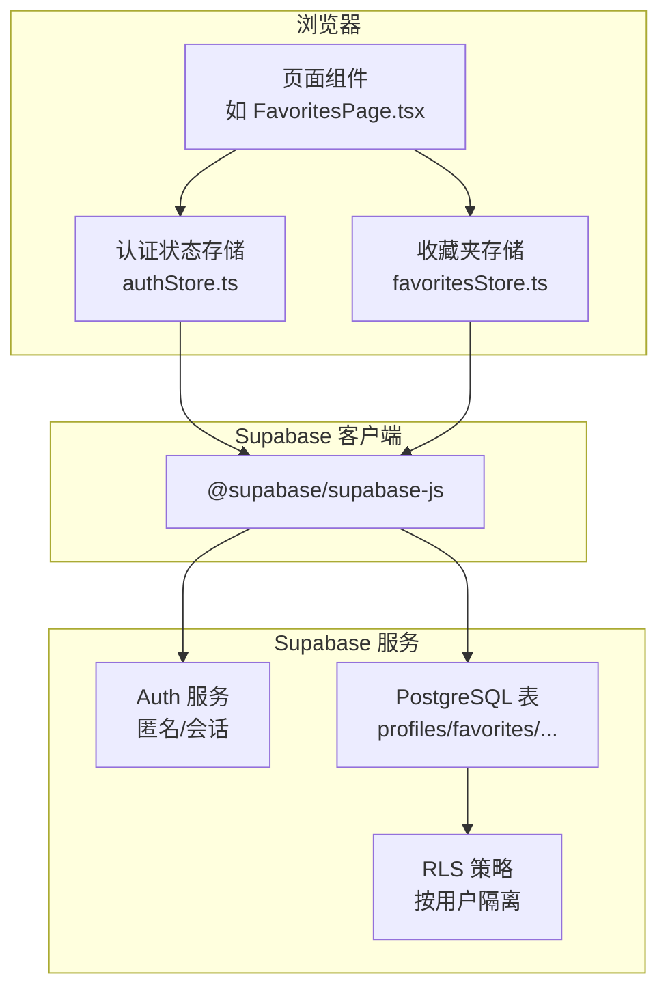
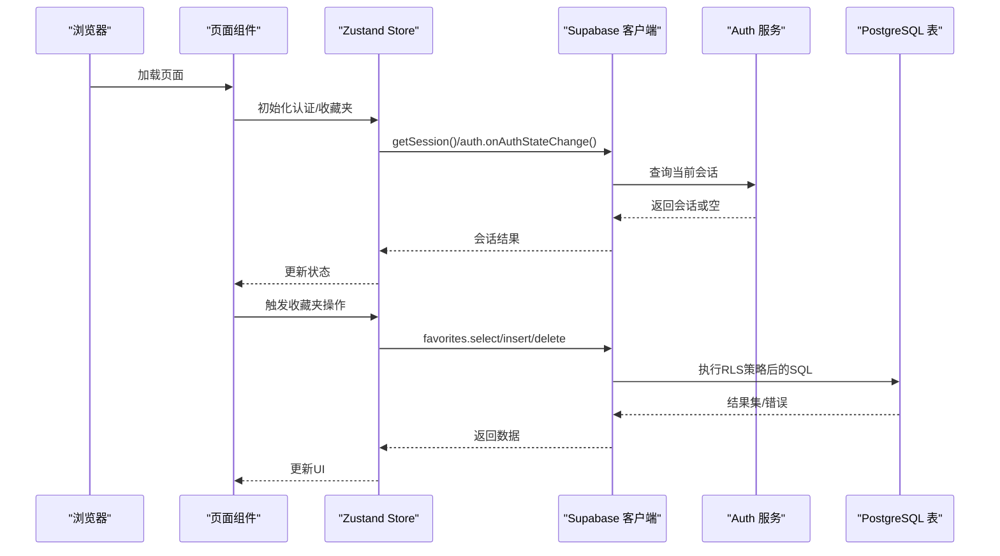
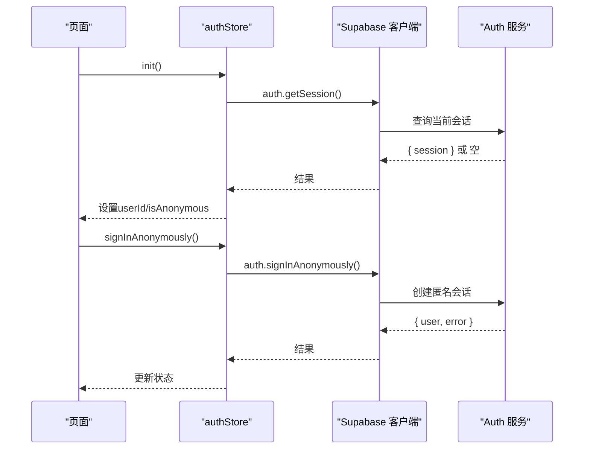
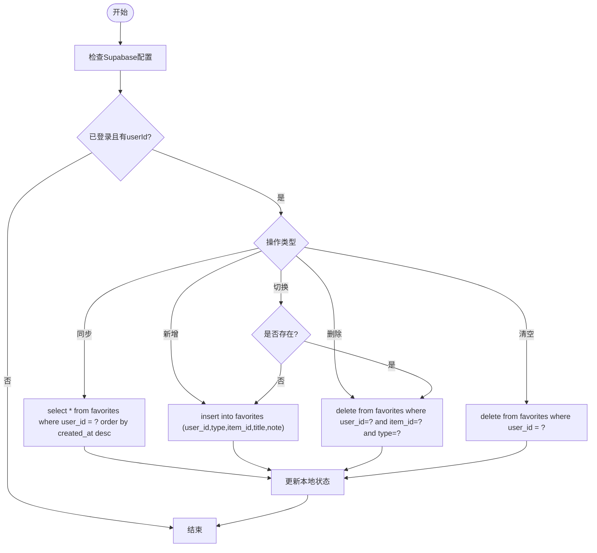
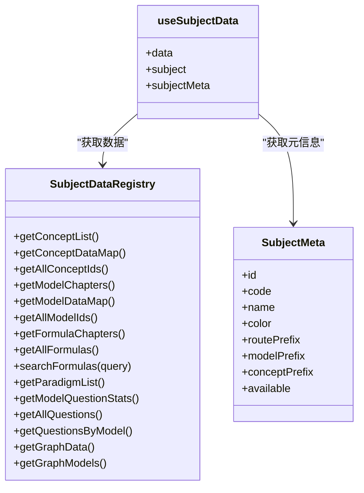
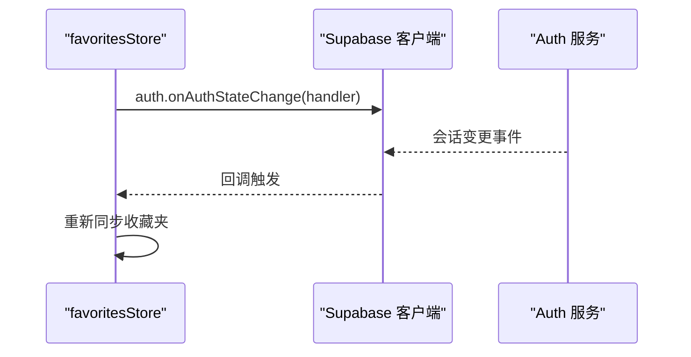
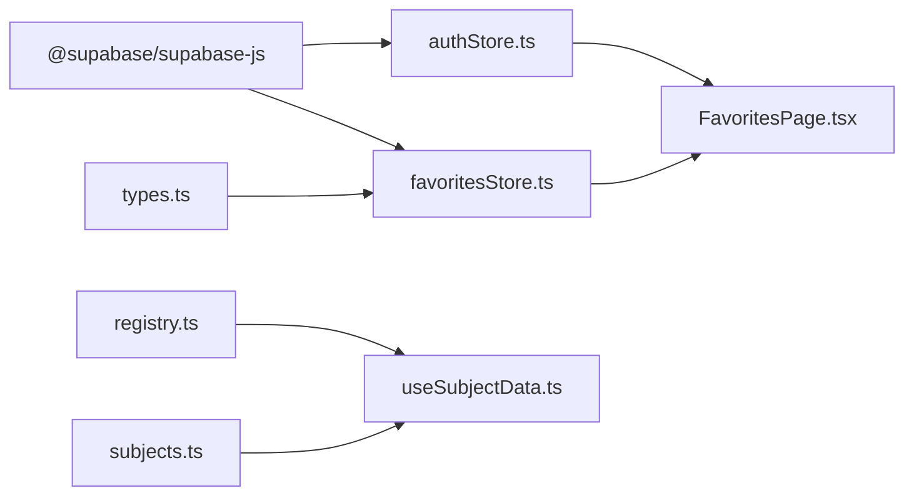

# API文档

<cite>
**本文引用的文件**
- [src/lib/supabase.ts](file://src/lib/supabase.ts)
- [src/stores/authStore.ts](file://src/stores/authStore.ts)
- [src/stores/favoritesStore.ts](file://src/stores/favoritesStore.ts)
- [src/stores/types.ts](file://src/stores/types.ts)
- [supabase_schema.sql](file://supabase_schema.sql)
- [src/sections/FavoritesPage.tsx](file://src/sections/FavoritesPage.tsx)
- [src/data/physics/physicsData.ts](file://src/data/physics/physicsData.ts)
- [src/hooks/useSubjectData.ts](file://src/hooks/useSubjectData.ts)
- [src/data/registry.ts](file://src/data/registry.ts)
- [src/data/subjects.ts](file://src/data/subjects.ts)
- [package.json](file://package.json)
- [netlify.toml](file://netlify.toml)
</cite>

## 目录
1. [简介](#简介)
2. [项目结构](#项目结构)
3. [核心组件](#核心组件)
4. [架构总览](#架构总览)
5. [详细组件分析](#详细组件分析)
6. [依赖分析](#依赖分析)
7. [性能考量](#性能考量)
8. [故障排查指南](#故障排查指南)
9. [结论](#结论)
10. [附录](#附录)

## 简介
本文件为“星耀平台”面向前端与集成方的API文档，聚焦于以下方面：
- Supabase云数据库的REST与Realtime能力使用方式
- 用户认证API与身份验证方法
- 收藏夹API的CRUD操作、数据格式与权限控制
- 学科数据API的查询接口、参数规范与返回值结构
- WebSocket连接处理、消息格式、事件类型与实时交互模式
- 协议特定示例、错误处理策略、安全考虑与性能优化建议
- 常见用例、客户端实现指南与API版本管理

说明：
- 本仓库以前端为主，通过Supabase JS客户端直接调用Supabase服务端；文档中凡涉及“REST API”的描述，均指通过Supabase JS SDK封装的HTTP/Realtime接口。
- “收藏夹”“学科数据”等业务API基于Supabase Postgres表与Row Level Security策略实现。

## 项目结构
前端采用React + Vite + Zustand + Supabase JS SDK的典型现代Web栈。与API相关的关键目录与文件如下：
- 认证与存储：src/lib/supabase.ts、src/stores/authStore.ts、src/stores/favoritesStore.ts
- 数据模型与类型：src/stores/types.ts、src/data/registry.ts、src/data/subjects.ts
- 学科数据：src/data/physics/physicsData.ts、src/hooks/useSubjectData.ts
- 数据库Schema：supabase_schema.sql
- 构建与部署：package.json、netlify.toml

图表来源
- [src/lib/supabase.ts:1-18](file://src/lib/supabase.ts#L1-L18)
- [src/stores/authStore.ts:1-63](file://src/stores/authStore.ts#L1-L63)
- [src/stores/favoritesStore.ts:1-172](file://src/stores/favoritesStore.ts#L1-L172)
- [supabase_schema.sql:1-178](file://supabase_schema.sql#L1-L178)

章节来源
- [src/lib/supabase.ts:1-18](file://src/lib/supabase.ts#L1-L18)
- [src/stores/authStore.ts:1-63](file://src/stores/authStore.ts#L1-L63)
- [src/stores/favoritesStore.ts:1-172](file://src/stores/favoritesStore.ts#L1-L172)
- [supabase_schema.sql:1-178](file://supabase_schema.sql#L1-L178)

## 核心组件
- Supabase客户端初始化与配置：负责创建客户端、启用自动刷新与会话持久化，并提供配置可用性检测。
- 认证状态存储：封装getSession、匿名登录、登出与状态变更监听。
- 收藏夹存储：封装收藏夹的增删查改、本地与云端同步、RLS权限校验。
- 学科数据注册表：统一暴露学科数据的查询接口，供路由与页面使用。
- 数据库Schema：定义表结构、索引与RLS策略，确保数据隔离与访问控制。

章节来源
- [src/lib/supabase.ts:1-18](file://src/lib/supabase.ts#L1-L18)
- [src/stores/authStore.ts:1-63](file://src/stores/authStore.ts#L1-L63)
- [src/stores/favoritesStore.ts:1-172](file://src/stores/favoritesStore.ts#L1-L172)
- [src/data/registry.ts:1-48](file://src/data/registry.ts#L1-L48)
- [supabase_schema.sql:1-178](file://supabase_schema.sql#L1-L178)

## 架构总览
下图展示了前端与Supabase之间的交互路径，包括认证、收藏夹CRUD与学科数据访问。

图表来源
- [src/stores/authStore.ts:20-61](file://src/stores/authStore.ts#L20-L61)
- [src/stores/favoritesStore.ts:37-142](file://src/stores/favoritesStore.ts#L37-L142)
- [supabase_schema.sql:52-59](file://supabase_schema.sql#L52-L59)

## 详细组件分析

### 用户认证API
- 终端与方法
  - 获取当前会话：GET（通过SDK封装）
  - 匿名登录：POST（通过SDK封装）
  - 登出：POST（通过SDK封装）
- URL模式与身份验证
  - 通过Supabase JS客户端自动携带Authorization头与Cookie（若启用持久化），无需手动拼接URL。
  - 匿名登录支持，满足“无需注册即可使用”的场景。
- 请求/响应模式
  - getSession：返回session对象（含user字段），若无会话则为空。
  - signInAnonymously：返回data.user与error；成功后store设置userId与isAnonymous。
  - signOut：无返回，仅清理本地状态。
- 权限控制
  - Supabase Auth内部表支持匿名会话生成；RLS策略确保用户只能访问自身数据。

图表来源
- [src/stores/authStore.ts:20-61](file://src/stores/authStore.ts#L20-L61)

章节来源
- [src/stores/authStore.ts:1-63](file://src/stores/authStore.ts#L1-L63)
- [src/lib/supabase.ts:1-18](file://src/lib/supabase.ts#L1-L18)
- [supabase_schema.sql:171-178](file://supabase_schema.sql#L171-L178)

### 收藏夹API（CRUD）
- 终端与方法
  - 同步收藏夹：GET（通过SDK封装）
  - 添加收藏：POST（通过SDK封装）
  - 删除收藏：DELETE（通过SDK封装）
  - 切换收藏：PUT/POST（通过SDK封装，内部为add/remove组合）
  - 清空收藏：DELETE（通过SDK封装）
- URL模式与请求/响应
  - 表favorites：user_id、type、item_id、title、note、created_at。
  - 查询：按user_id过滤，按created_at倒序。
  - 插入：包含user_id、type、item_id、title、note。
  - 删除：按user_id、item_id、type精确匹配。
- 权限控制
  - RLS策略：仅允许auth.uid() = user_id的用户读写自身收藏。
  - 唯一约束：同一用户下，type+item_id唯一，避免重复收藏。
- 数据格式
  - Favorite接口包含id、type、itemId、title、addedAt、note。
  - type枚举：'model' | 'strategy' | 'vision' | 'question'。

图表来源
- [src/stores/favoritesStore.ts:37-142](file://src/stores/favoritesStore.ts#L37-L142)
- [src/stores/types.ts:1-12](file://src/stores/types.ts#L1-L12)
- [supabase_schema.sql:36-60](file://supabase_schema.sql#L36-L60)

章节来源
- [src/stores/favoritesStore.ts:1-172](file://src/stores/favoritesStore.ts#L1-L172)
- [src/stores/types.ts:1-12](file://src/stores/types.ts#L1-L12)
- [supabase_schema.sql:36-60](file://supabase_schema.sql#L36-L60)

### 学科数据API
- 查询接口
  - 注册表接口：SubjectDataRegistry统一暴露学科数据查询方法，如概念列表、模型数据、公式、题库等。
  - 路由钩子：useSubjectData根据路由参数subject获取学科数据注册表与学科元信息。
- 参数规范
  - 路由参数：subject（如physics/chinese/english等）。
  - 学科元信息：包含routePrefix、modelPrefix、available等。
- 返回值结构
  - 概念：章节-模块-概念的层级结构与难度。
  - 模型：章节-模块-模型的层级结构与难度。
  - 公式：章节与卡片列表，支持搜索。
  - 题库：包含难度、目标、功能、类型等选项与数据。
  - 图谱：模块节点、知识节点与前置关系边。
- 实现要点
  - 数据注册：通过registerSubject(id, data)注册学科数据。
  - 路由与页面：结合路由前缀与页面组件渲染学科内容。

图表来源
- [src/data/registry.ts:1-48](file://src/data/registry.ts#L1-L48)
- [src/data/subjects.ts:1-30](file://src/data/subjects.ts#L1-L30)
- [src/hooks/useSubjectData.ts:1-19](file://src/hooks/useSubjectData.ts#L1-L19)

章节来源
- [src/data/registry.ts:1-48](file://src/data/registry.ts#L1-L48)
- [src/data/subjects.ts:1-30](file://src/data/subjects.ts#L1-L30)
- [src/hooks/useSubjectData.ts:1-19](file://src/hooks/useSubjectData.ts#L1-L19)
- [src/data/physics/physicsData.ts:1-138](file://src/data/physics/physicsData.ts#L1-L138)

### WebSocket连接与实时交互
- 连接处理
  - 认证状态监听：auth.onAuthStateChange()在用户登录/登出时触发回调，便于重新同步收藏夹。
  - 自动刷新：Supabase客户端启用autoRefreshToken与persistSession，减少频繁登录。
- 消息格式与事件类型
  - 认证事件：登录/登出/会话变更。
  - 收藏夹事件：本地状态变更后，SDK通过订阅机制感知并触发同步。
- 实时交互模式
  - 通过onAuthStateChange与store订阅实现“登录即同步”，保证本地与云端一致。
  - 若需更细粒度的实时订阅（如某用户收藏夹变更），可在Supabase中启用Realtime并订阅相应频道。

图表来源
- [src/stores/favoritesStore.ts:21-28](file://src/stores/favoritesStore.ts#L21-L28)
- [src/lib/supabase.ts:8-14](file://src/lib/supabase.ts#L8-L14)

章节来源
- [src/stores/favoritesStore.ts:154-171](file://src/stores/favoritesStore.ts#L154-L171)
- [src/lib/supabase.ts:1-18](file://src/lib/supabase.ts#L1-L18)

## 依赖分析
- 外部依赖
  - @supabase/supabase-js：提供认证、数据库与Realtime能力。
  - zustand：状态管理，用于认证与收藏夹。
- 内部依赖
  - 认证store依赖supabase客户端与配置可用性检测。
  - 收藏夹store依赖认证store、supabase客户端与类型定义。
  - 学科数据store依赖注册表与路由钩子。

图表来源
- [package.json:43](file://package.json#L43)
- [src/stores/authStore.ts:1-63](file://src/stores/authStore.ts#L1-L63)
- [src/stores/favoritesStore.ts:1-172](file://src/stores/favoritesStore.ts#L1-L172)
- [src/stores/types.ts:1-12](file://src/stores/types.ts#L1-L12)
- [src/data/registry.ts:1-48](file://src/data/registry.ts#L1-L48)
- [src/hooks/useSubjectData.ts:1-19](file://src/hooks/useSubjectData.ts#L1-L19)
- [src/data/subjects.ts:1-30](file://src/data/subjects.ts#L1-L30)

章节来源
- [package.json:14-86](file://package.json#L14-L86)
- [src/stores/authStore.ts:1-63](file://src/stores/authStore.ts#L1-L63)
- [src/stores/favoritesStore.ts:1-172](file://src/stores/favoritesStore.ts#L1-L172)
- [src/data/registry.ts:1-48](file://src/data/registry.ts#L1-L48)
- [src/hooks/useSubjectData.ts:1-19](file://src/hooks/useSubjectData.ts#L1-L19)
- [src/data/subjects.ts:1-30](file://src/data/subjects.ts#L1-L30)

## 性能考量
- 本地优先与批量更新
  - 本地先更新再同步云端，减少网络往返；批量插入/删除时注意错误回滚。
- 索引与查询优化
  - favorites表对user_id、type建立索引，提升查询与去重效率。
- 会话与缓存
  - 启用autoRefreshToken与persistSession，降低频繁登录成本。
- 前端状态管理
  - 使用Zustand避免不必要的重渲染；对高频操作（如切换收藏）进行防抖/节流。

## 故障排查指南
- Supabase未配置
  - 现象：初始化时静默降级，不执行匿名登录。
  - 排查：确认VITE_SUPABASE_URL与VITE_SUPABASE_ANON_KEY环境变量。
- 匿名登录失败
  - 现象：signInAnonymously返回错误。
  - 排查：检查Supabase项目是否启用匿名登录；查看控制台错误日志。
- 收藏夹不同步
  - 现象：本地显示与云端不一致。
  - 排查：确认auth.onAuthStateChange回调是否触发；检查RLS策略是否生效。
- RLS拒绝访问
  - 现象：查询/插入/删除报权限错误。
  - 排查：确认当前会话user_id与表中user_id一致；检查策略with check是否允许插入。

章节来源
- [src/lib/supabase.ts:3-17](file://src/lib/supabase.ts#L3-L17)
- [src/stores/authStore.ts:39-55](file://src/stores/authStore.ts#L39-L55)
- [src/stores/favoritesStore.ts:37-63](file://src/stores/favoritesStore.ts#L37-L63)
- [supabase_schema.sql:52-59](file://supabase_schema.sql#L52-L59)

## 结论
本API文档梳理了星耀平台基于Supabase的认证、收藏夹与学科数据的核心接口与实现细节。通过RLS保障数据隔离，借助Supabase JS SDK简化REST/Realtime接入，配合Zustand实现高效的状态管理。建议在生产环境中持续关注会话生命周期、索引与查询性能，并完善错误监控与日志记录。

## 附录

### 协议特定示例（以路径代替代码片段）
- 获取当前会话
  - [src/stores/authStore.ts:26-31](file://src/stores/authStore.ts#L26-L31)
- 匿名登录
  - [src/stores/authStore.ts:39-55](file://src/stores/authStore.ts#L39-L55)
- 同步收藏夹
  - [src/stores/favoritesStore.ts:37-63](file://src/stores/favoritesStore.ts#L37-L63)
- 添加收藏
  - [src/stores/favoritesStore.ts:65-94](file://src/stores/favoritesStore.ts#L65-L94)
- 删除收藏
  - [src/stores/favoritesStore.ts:96-114](file://src/stores/favoritesStore.ts#L96-L114)
- 清空收藏
  - [src/stores/favoritesStore.ts:134-142](file://src/stores/favoritesStore.ts#L134-L142)
- 切换收藏
  - [src/stores/favoritesStore.ts:116-126](file://src/stores/favoritesStore.ts#L116-L126)
- 获取学科数据
  - [src/hooks/useSubjectData.ts:5-19](file://src/hooks/useSubjectData.ts#L5-L19)
  - [src/data/registry.ts:4-38](file://src/data/registry.ts#L4-L38)
  - [src/data/subjects.ts:21-29](file://src/data/subjects.ts#L21-L29)

### 错误处理策略
- 初始化降级：未配置Supabase时，静默设置为未登录状态。
- 异常捕获：对认证与收藏夹操作进行try/catch，避免崩溃。
- RLS错误：对权限相关错误进行提示与引导（例如检查登录状态与策略）。

章节来源
- [src/stores/authStore.ts:20-37](file://src/stores/authStore.ts#L20-L37)
- [src/stores/favoritesStore.ts:37-63](file://src/stores/favoritesStore.ts#L37-L63)

### 安全考虑
- RLS策略：确保用户仅能访问自身数据。
- 匿名登录：在允许匿名访问的同时，严格限制匿名用户的写入范围。
- 会话持久化：合理设置过期与刷新策略，避免长期有效令牌带来的风险。

章节来源
- [supabase_schema.sql:52-59](file://supabase_schema.sql#L52-L59)
- [supabase_schema.sql:171-178](file://supabase_schema.sql#L171-L178)
- [src/lib/supabase.ts:8-14](file://src/lib/supabase.ts#L8-L14)

### 性能优化建议
- 查询优化：利用现有索引（favorites_user_id_idx、favorites_type_idx等）。
- 状态管理：减少不必要的全局更新，使用局部状态与选择器。
- 网络层：对高频操作进行去抖/节流，合并请求。

章节来源
- [supabase_schema.sql:160-169](file://supabase_schema.sql#L160-L169)
- [src/stores/favoritesStore.ts:65-94](file://src/stores/favoritesStore.ts#L65-L94)

### 常见用例
- 新用户首次打开页面：init()获取会话；若无会话则保持未登录状态。
- 用户点击“收藏”按钮：toggleFavorite()根据是否存在决定add或remove。
- 用户切换学科：useSubjectData()根据路由参数加载对应学科数据。

章节来源
- [src/stores/authStore.ts:20-37](file://src/stores/authStore.ts#L20-L37)
- [src/stores/favoritesStore.ts:116-126](file://src/stores/favoritesStore.ts#L116-L126)
- [src/hooks/useSubjectData.ts:5-19](file://src/hooks/useSubjectData.ts#L5-L19)

### 客户端实现指南
- 环境变量：确保VITE_SUPABASE_URL与VITE_SUPABASE_ANON_KEY正确配置。
- 认证流程：优先使用getSession；若无会话再考虑匿名登录。
- 收藏夹流程：本地先更新，再异步同步至云端；失败时回滚本地状态。
- 学科数据：通过useSubjectData获取学科数据与元信息，渲染对应页面。

章节来源
- [src/lib/supabase.ts:3-17](file://src/lib/supabase.ts#L3-L17)
- [src/stores/authStore.ts:20-37](file://src/stores/authStore.ts#L20-L37)
- [src/stores/favoritesStore.ts:65-94](file://src/stores/favoritesStore.ts#L65-L94)
- [src/hooks/useSubjectData.ts:5-19](file://src/hooks/useSubjectData.ts#L5-L19)

### API版本管理
- 当前版本：前端包版本号参见package.json。
- 部署回退：Netlify SPA回退至index.html，确保路由兼容。
- 建议：对Supabase Schema变更采用迁移脚本与版本标签管理，避免破坏性更新。

章节来源
- [package.json:1-13](file://package.json#L1-L13)
- [netlify.toml:8-12](file://netlify.toml#L8-L12)