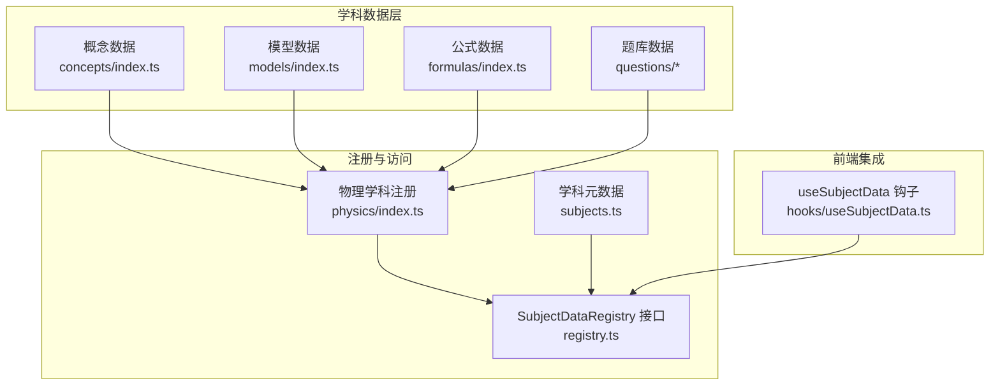
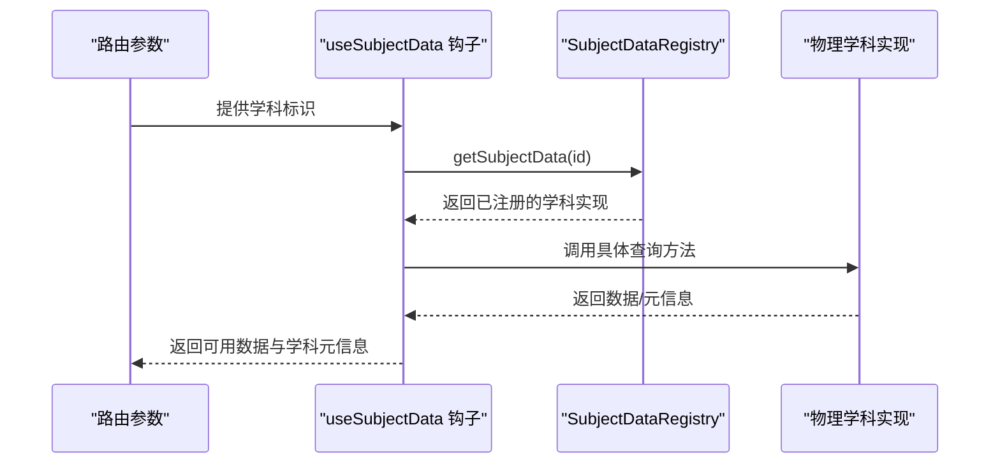
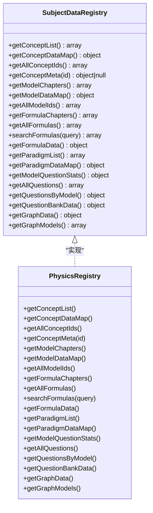
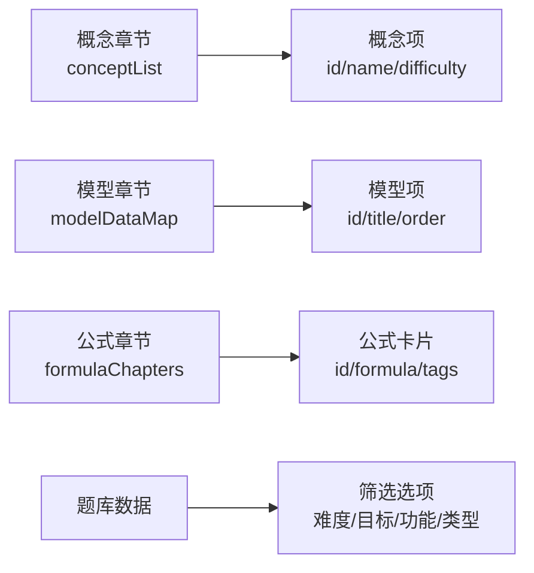
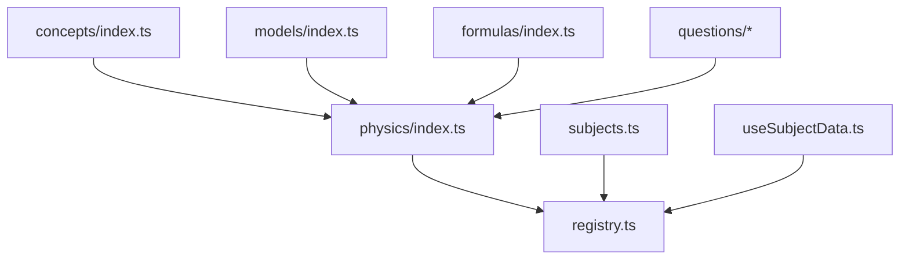

# 学科数据API

<cite>
**本文引用的文件**
- [src/data/subjects.ts](file://src/data/subjects.ts)
- [src/data/registry.ts](file://src/data/registry.ts)
- [src/data/physics/index.ts](file://src/data/physics/index.ts)
- [src/hooks/useSubjectData.ts](file://src/hooks/useSubjectData.ts)
- [src/data/physics/concepts/index.ts](file://src/data/physics/concepts/index.ts)
- [src/data/physics/models/index.ts](file://src/data/physics/models/index.ts)
- [src/data/physics/formulas/index.ts](file://src/data/physics/formulas/index.ts)
</cite>

## 目录
1. [简介](#简介)
2. [项目结构](#项目结构)
3. [核心组件](#核心组件)
4. [架构总览](#架构总览)
5. [详细组件分析](#详细组件分析)
6. [依赖分析](#依赖分析)
7. [性能考虑](#性能考虑)
8. [故障排除指南](#故障排除指南)
9. [结论](#结论)
10. [附录](#附录)

## 简介
本文件为星耀平台“学科数据API”的权威技术文档，聚焦物理学科的数据组织与访问接口，涵盖以下主题：
- 学科数据查询接口与参数规范
- SubjectDataRegistry 的使用方法、数据加载机制与缓存策略
- 学科数据的组织结构、层级关系与依赖关系
- 数据过滤、排序与分页的实现方式
- 动态加载、懒加载与预加载策略
- 数据格式标准化、版本管理与兼容性处理
- 数据更新机制、增量同步与冲突解决
- 使用示例、性能优化与故障排除

## 项目结构
星耀平台采用“按学科模块化”的数据组织方式，物理学科数据位于 src/data/physics 目录，核心包括：
- 概念（concepts）：知识点条目与章节结构
- 模型（models）：典型问题模型与章节结构
- 公式（formulas）：公式卡片与章节结构
- 问题（questions）：题库与筛选选项
- 注册中心（registry）：学科数据注册与统一访问接口

**图表来源**
- [src/data/physics/index.ts:1-433](file://src/data/physics/index.ts#L1-L433)
- [src/data/registry.ts:1-48](file://src/data/registry.ts#L1-L48)
- [src/data/subjects.ts:1-30](file://src/data/subjects.ts#L1-L30)
- [src/hooks/useSubjectData.ts:1-19](file://src/hooks/useSubjectData.ts#L1-L19)

**章节来源**
- [src/data/physics/index.ts:1-433](file://src/data/physics/index.ts#L1-L433)
- [src/data/registry.ts:1-48](file://src/data/registry.ts#L1-L48)
- [src/data/subjects.ts:1-30](file://src/data/subjects.ts#L1-L30)
- [src/hooks/useSubjectData.ts:1-19](file://src/hooks/useSubjectData.ts#L1-L19)

## 核心组件
- SubjectMeta：学科元数据，包含学科标识、路由前缀、模型/概念前缀、可用性等
- SubjectDataRegistry：学科数据统一访问接口，提供概念、模型、公式、题库、图谱等查询能力
- 物理学科注册：在物理模块中实现 SubjectDataRegistry，并通过 registerSubject 完成注册
- useSubjectData：React 钩子，基于路由参数获取当前学科数据与元信息

**章节来源**
- [src/data/subjects.ts:1-30](file://src/data/subjects.ts#L1-L30)
- [src/data/registry.ts:4-38](file://src/data/registry.ts#L4-L38)
- [src/data/physics/index.ts:383-431](file://src/data/physics/index.ts#L383-L431)
- [src/hooks/useSubjectData.ts:5-19](file://src/hooks/useSubjectData.ts#L5-L19)

## 架构总览
学科数据API通过“注册中心 + 学科实现”的模式，将物理学科的数据以统一接口暴露给前端组件使用。前端通过 useSubjectData 钩子按路由获取学科数据，实现按需加载与缓存复用。

**图表来源**
- [src/hooks/useSubjectData.ts:10-18](file://src/hooks/useSubjectData.ts#L10-L18)
- [src/data/registry.ts:46-48](file://src/data/registry.ts#L46-L48)
- [src/data/physics/index.ts:383-431](file://src/data/physics/index.ts#L383-L431)

## 详细组件分析

### SubjectDataRegistry 接口与实现
- 接口职责
  - 概念：获取概念列表、概念数据映射、概念ID列表、概念元信息
  - 模型：获取模型章节、模型数据映射、模型ID列表
  - 公式：获取公式章节、全部公式、公式检索、公式数据聚合
  - 题库：获取模型题目统计、全部题目、按模型分组、筛选选项与标签
  - 图谱：获取图数据与模型列表
- 实现要点
  - 物理学科通过 registerSubject 将实现注入注册中心
  - 实现内部聚合概念、模型、公式、题库等数据源，提供统一查询

**图表来源**
- [src/data/registry.ts:4-38](file://src/data/registry.ts#L4-L38)
- [src/data/physics/index.ts:383-431](file://src/data/physics/index.ts#L383-L431)

**章节来源**
- [src/data/registry.ts:4-38](file://src/data/registry.ts#L4-L38)
- [src/data/physics/index.ts:383-431](file://src/data/physics/index.ts#L383-L431)

### 物理学科数据加载与缓存策略
- 预加载与注册
  - 物理模块在初始化时导入概念、模型、公式、题库等数据，并通过 registerSubject 注册到全局注册中心
  - 注册中心以 Map 结构存储学科实现，按学科ID快速检索
- 缓存机制
  - 注册中心内的实现为单例，避免重复加载
  - 前端通过 useSubjectData 钩子按需获取，实现“一次注册，多处复用”
- 动态/懒加载建议
  - 可将“按需加载”扩展至“按路由/页面懒加载”，在进入学科详情页时再触发数据注册与查询
  - 对大型数据集（如题库）可采用分页/分片策略，结合前端虚拟滚动优化渲染

**章节来源**
- [src/data/physics/index.ts:1-18](file://src/data/physics/index.ts#L1-L18)
- [src/data/registry.ts:40-48](file://src/data/registry.ts#L40-L48)
- [src/hooks/useSubjectData.ts:10-12](file://src/hooks/useSubjectData.ts#L10-L12)

### 学科数据组织结构与层级关系
- 概念（concepts）
  - 以章节（chapter）组织，章节下包含概念列表（conceptList）
  - 概念元信息包含名称、模块、章节、难度等
- 模型（models）
  - 以模块（module）组织，模块下包含模型列表（modelDataMap）
  - 模型ID与模块ID一一对应
- 公式（formulas）
  - 以章节（chapter）与板块（section）组织，包含公式卡片数组与章节列表
- 题库（questions）
  - 包含全部题目、按模型分组、筛选选项（难度、目标、功能、类型等）

**图表来源**
- [src/data/physics/concepts/index.ts:102-175](file://src/data/physics/concepts/index.ts#L102-L175)
- [src/data/physics/models/index.ts:52-95](file://src/data/physics/models/index.ts#L52-L95)
- [src/data/physics/formulas/index.ts:1-800](file://src/data/physics/formulas/index.ts#L1-L800)

**章节来源**
- [src/data/physics/concepts/index.ts:102-175](file://src/data/physics/concepts/index.ts#L102-L175)
- [src/data/physics/models/index.ts:52-95](file://src/data/physics/models/index.ts#L52-L95)
- [src/data/physics/formulas/index.ts:1-800](file://src/data/physics/formulas/index.ts#L1-L800)

### 数据过滤、排序与分页
- 过滤
  - 题库提供多维筛选选项（难度、目标、功能、类型），前端可组合筛选条件
- 排序
  - 概念与模型提供顺序字段（order），可用于排序展示
- 分页
  - 概念提供“全部概念ID列表”，可用于分页导航与分批渲染
  - 题库提供“全部题目”，建议前端按需分页加载

**章节来源**
- [src/data/physics/index.ts:11-17](file://src/data/physics/index.ts#L11-L17)
- [src/data/physics/concepts/index.ts:188-195](file://src/data/physics/concepts/index.ts#L188-L195)

### 数据格式标准化、版本管理与兼容性
- 标准化
  - 概念、模型、公式、题库均采用统一的结构字段（如 id、title、module、chapter、tags 等）
  - 公式卡片包含变量、条件、来源概念等元信息，便于溯源与教学
- 版本管理
  - 通过模块化目录与文件命名（如 Pxx、Mxx、Fxxx）实现版本化组织
  - 可在新增/修改概念/模型/公式时，保持 id 唯一性与兼容性
- 兼容性
  - 接口返回结构稳定，前端可逐步迁移旧字段，避免破坏性变更

**章节来源**
- [src/data/physics/concepts/index.ts:77-85](file://src/data/physics/concepts/index.ts#L77-L85)
- [src/data/physics/models/index.ts:52-95](file://src/data/physics/models/index.ts#L52-L95)
- [src/data/physics/formulas/index.ts:1-800](file://src/data/physics/formulas/index.ts#L1-L800)

### 数据更新机制、增量同步与冲突解决
- 更新机制
  - 新增/修改概念/模型/公式时，更新对应模块文件与索引（如 concepts/index.ts、models/index.ts、formulas/index.ts）
  - 通过 registerSubject 注册的新实现将覆盖旧实现，确保前端使用最新数据
- 增量同步
  - 建议在构建阶段聚合数据，避免运行时频繁 IO
  - 对题库等大数据集，可采用分片与增量加载策略
- 冲突解决
  - 保持 id 唯一性（概念：Pxx；模型：Mxx；公式：Fxxx），避免冲突
  - 若需重命名/迁移，需同步更新依赖引用与路由前缀

**章节来源**
- [src/data/physics/index.ts:383-431](file://src/data/physics/index.ts#L383-L431)
- [src/data/subjects.ts:12-19](file://src/data/subjects.ts#L12-L19)

### 使用示例与最佳实践
- 前端使用
  - 在页面中调用 useSubjectData 获取学科数据与元信息
  - 通过 getConceptList/getModelChapters/getFormulaChapters 等接口渲染列表
  - 使用 getAllConceptIds 实现分页导航
- 性能优化
  - 使用注册中心缓存已加载的学科实现
  - 对题库采用分页/虚拟滚动，减少一次性渲染压力
  - 对公式检索使用前端过滤（searchFormulas），避免远程请求
- 兼容性
  - 保持字段命名与结构稳定，避免破坏性变更
  - 新增字段时提供默认值，保证旧代码兼容

**章节来源**
- [src/hooks/useSubjectData.ts:10-18](file://src/hooks/useSubjectData.ts#L10-L18)
- [src/data/registry.ts:46-48](file://src/data/registry.ts#L46-L48)
- [src/data/physics/index.ts:383-431](file://src/data/physics/index.ts#L383-L431)

## 依赖分析
学科数据API的依赖关系清晰：物理模块实现依赖概念、模型、公式、题库等子模块；注册中心提供统一访问；前端钩子依赖注册中心与学科元数据。

**图表来源**
- [src/data/physics/index.ts:1-18](file://src/data/physics/index.ts#L1-L18)
- [src/data/registry.ts:40-48](file://src/data/registry.ts#L40-L48)
- [src/data/subjects.ts:1-30](file://src/data/subjects.ts#L1-L30)
- [src/hooks/useSubjectData.ts:1-19](file://src/hooks/useSubjectData.ts#L1-L19)

**章节来源**
- [src/data/physics/index.ts:1-18](file://src/data/physics/index.ts#L1-L18)
- [src/data/registry.ts:40-48](file://src/data/registry.ts#L40-L48)
- [src/data/subjects.ts:1-30](file://src/data/subjects.ts#L1-L30)
- [src/hooks/useSubjectData.ts:1-19](file://src/hooks/useSubjectData.ts#L1-L19)

## 性能考虑
- 数据加载
  - 预加载物理模块数据，减少首次渲染等待
  - 将大型数据（题库）分片加载，结合分页与虚拟滚动
- 查询效率
  - 使用 Map 结构（如 modelDataMap、conceptDataMap）进行 O(1) 查找
  - 对公式检索使用前端过滤，避免网络请求
- 渲染优化
  - 概念与模型列表按模块/章节分组，提升可读性与渲染性能
  - 使用 getAllConceptIds 实现分页导航，避免一次性渲染过多节点

[本节为通用指导，无需特定文件引用]

## 故障排除指南
- 无法获取学科数据
  - 检查路由参数是否正确，确认 useSubjectData 返回的 subject 是否为空
  - 确认物理模块已通过 registerSubject 注册
- 数据不一致
  - 检查概念/模型/公式文件是否更新，确保 id 唯一性
  - 确认 getAllConceptIds 与概念列表顺序一致
- 查询异常
  - 检查 getConceptMeta/getQuestionsByModel 等接口返回值是否存在
  - 对公式检索，确认 searchFormulas 的查询逻辑与输入匹配

**章节来源**
- [src/hooks/useSubjectData.ts:10-18](file://src/hooks/useSubjectData.ts#L10-L18)
- [src/data/registry.ts:46-48](file://src/data/registry.ts#L46-L48)
- [src/data/physics/concepts/index.ts:180-186](file://src/data/physics/concepts/index.ts#L180-L186)
- [src/data/physics/index.ts:383-431](file://src/data/physics/index.ts#L383-L431)

## 结论
学科数据API通过“注册中心 + 学科实现”的架构，实现了物理学科数据的统一访问与高效复用。配合前端钩子与模块化数据组织，能够满足概念、模型、公式、题库等多维度数据的查询与展示需求。建议在后续迭代中进一步完善题库分页、公式检索性能与数据版本管理，持续提升用户体验与维护效率。

[本节为总结性内容，无需特定文件引用]

## 附录

### API 方法清单与返回结构（物理学科）
- 概念
  - getConceptList：返回章节列表（包含模块、章节、概念项）
  - getConceptDataMap：返回概念ID到概念数据的映射
  - getAllConceptIds：返回按章节顺序排列的概念ID列表
  - getConceptMeta(id)：返回概念元信息（名称、模块、章节、难度）
- 模型
  - getModelChapters：返回模型章节列表（模块、模型项）
  - getModelDataMap：返回模型ID到模型数据的映射
  - getAllModelIds：返回全部模型ID列表
- 公式
  - getFormulaChapters：返回公式章节列表
  - getAllFormulas：返回全部公式卡片
  - searchFormulas(query)：返回匹配的公式卡片
  - getFormulaData：返回公式章节、检索函数与全部公式
- 题库
  - getModelQuestionStats：返回模型题目统计
  - getAllQuestions：返回全部题目
  - getQuestionsByModel：返回按模型分组的题目
  - getQuestionBankData：返回题库筛选选项与标签

**章节来源**
- [src/data/registry.ts:4-38](file://src/data/registry.ts#L4-L38)
- [src/data/physics/index.ts:383-431](file://src/data/physics/index.ts#L383-L431)