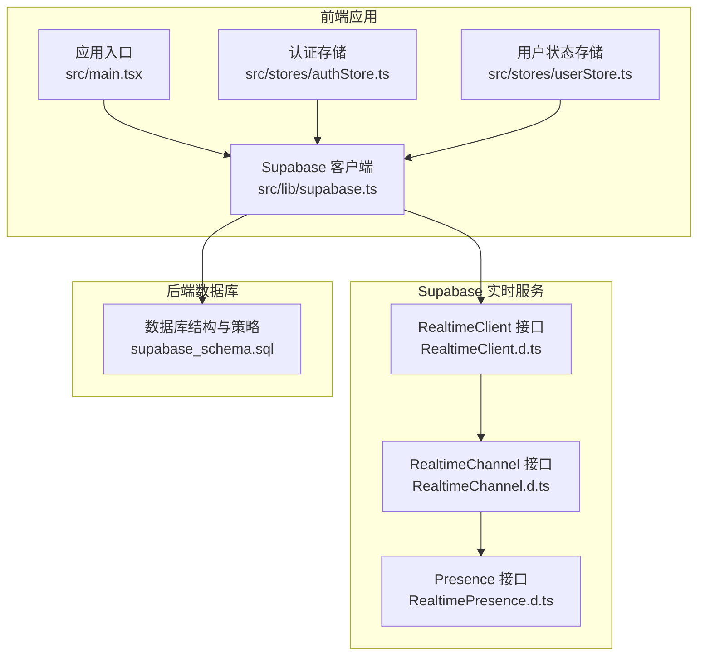
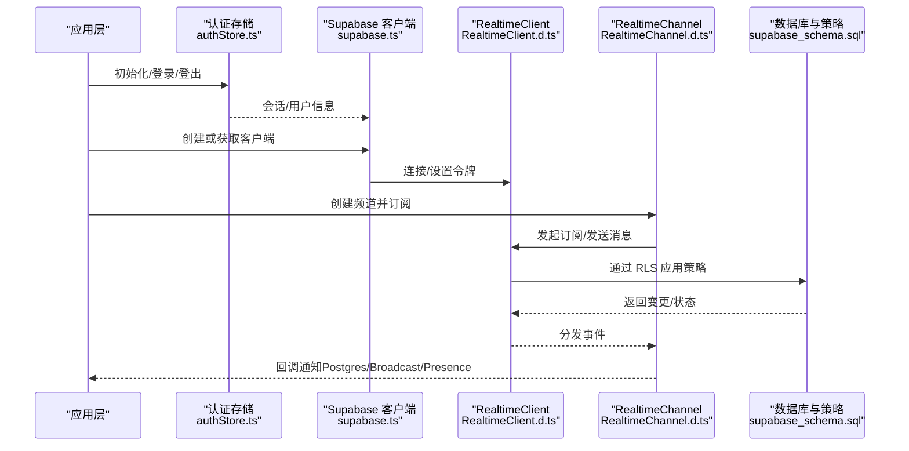
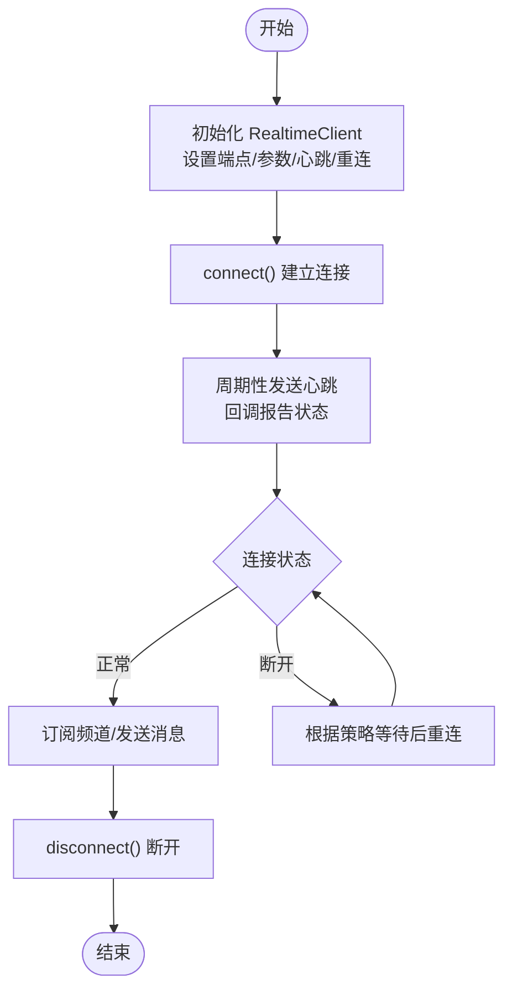
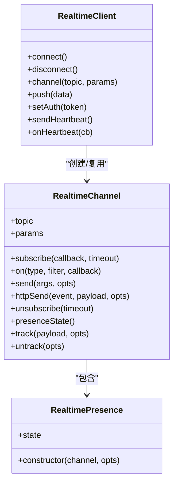
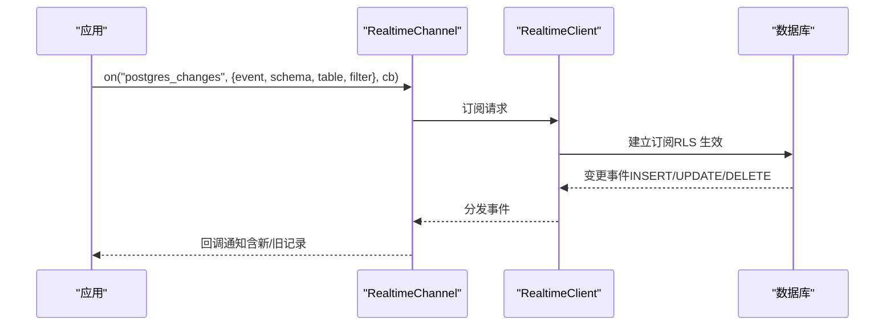
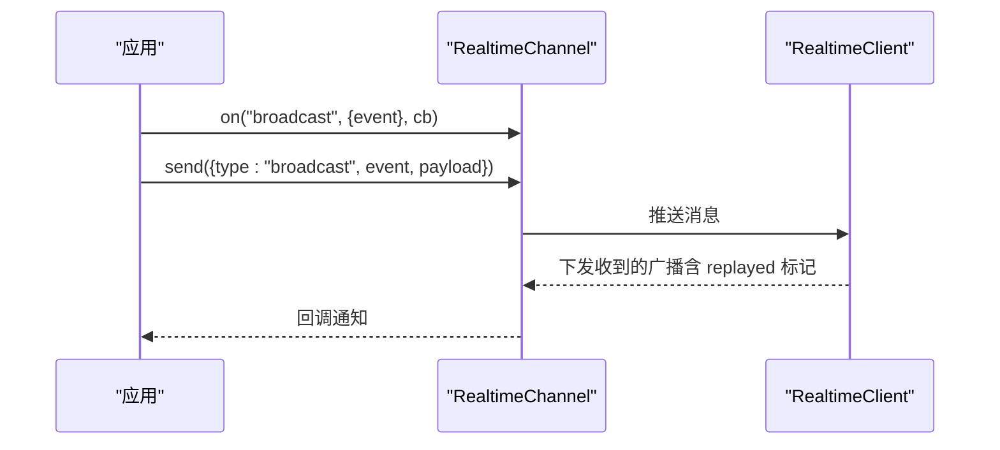
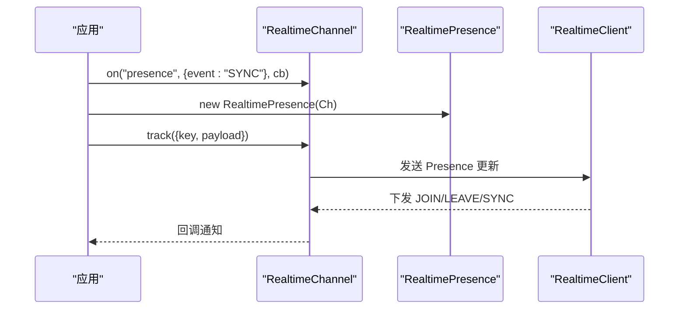
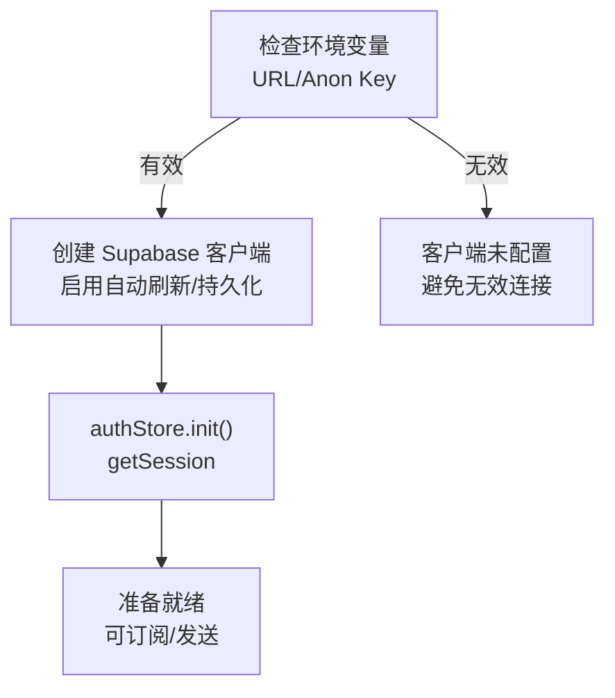
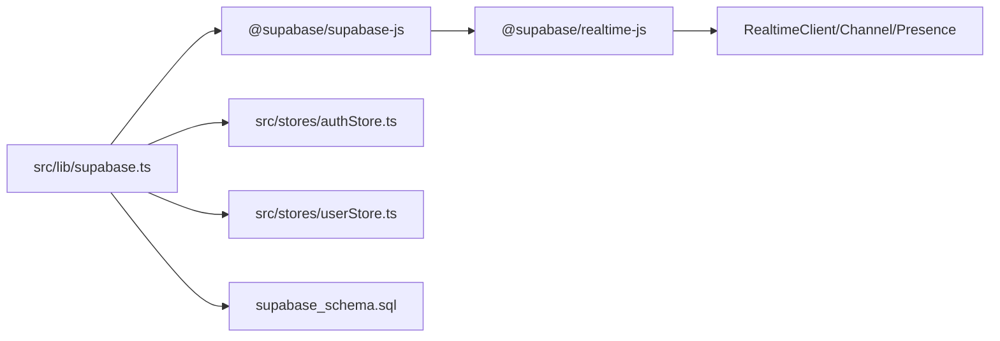

# 实时通信API

<cite>
**本文引用的文件**
- [src/lib/supabase.ts](file://src/lib/supabase.ts)
- [src/stores/authStore.ts](file://src/stores/authStore.ts)
- [src/stores/userStore.ts](file://src/stores/userStore.ts)
- [node_modules/@supabase/realtime-js/dist/main/RealtimeClient.d.ts](file://node_modules/@supabase/realtime-js/dist/main/RealtimeClient.d.ts)
- [node_modules/@supabase/realtime-js/dist/main/RealtimeChannel.d.ts](file://node_modules/@supabase/realtime-js/dist/main/RealtimeChannel.d.ts)
- [node_modules/@supabase/realtime-js/dist/main/RealtimePresence.d.ts](file://node_modules/@supabase/realtime-js/dist/main/RealtimePresence.d.ts)
- [supabase_schema.sql](file://supabase_schema.sql)
</cite>

## 目录
1. [简介](#简介)
2. [项目结构](#项目结构)
3. [核心组件](#核心组件)
4. [架构总览](#架构总览)
5. [详细组件分析](#详细组件分析)
6. [依赖分析](#依赖分析)
7. [性能考虑](#性能考虑)
8. [故障排查指南](#故障排查指南)
9. [结论](#结论)
10. [附录](#附录)

## 简介
本文件面向“星耀平台”的前端开发者与集成工程师，系统化阐述平台基于 Supabase 的实时通信能力，包括：
- WebSocket 连接与心跳、重连策略
- 订阅频道的配置、过滤与事件监听
- 数据变更通知（Postgres Changes）、广播消息（Broadcast）与在线状态（Presence）
- 实时协作与数据同步最佳实践
- 错误恢复与网络异常处理
- 使用示例、调试与监控建议

说明：当前仓库未直接包含业务侧的实时订阅调用代码，本文以 Supabase 官方 SDK 的类型定义与配置为依据，结合平台数据库结构与认证流程，给出可落地的实现蓝图与运维建议。

## 项目结构
与实时通信相关的关键位置如下：
- 客户端初始化：src/lib/supabase.ts
- 认证与会话：src/stores/authStore.ts
- 用户状态与学习数据：src/stores/userStore.ts
- 实时 SDK 类型与接口：node_modules/@supabase/realtime-js/...
- 平台数据库结构与策略：supabase_schema.sql

**图示来源**
- [src/lib/supabase.ts:1-18](file://src/lib/supabase.ts#L1-L18)
- [src/stores/authStore.ts:1-62](file://src/stores/authStore.ts#L1-L62)
- [src/stores/userStore.ts:1-236](file://src/stores/userStore.ts#L1-L236)
- [node_modules/@supabase/realtime-js/dist/main/RealtimeClient.d.ts:1-254](file://node_modules/@supabase/realtime-js/dist/main/RealtimeClient.d.ts#L1-L254)
- [node_modules/@supabase/realtime-js/dist/main/RealtimeChannel.d.ts:1-430](file://node_modules/@supabase/realtime-js/dist/main/RealtimeChannel.d.ts#L1-L430)
- [node_modules/@supabase/realtime-js/dist/main/RealtimePresence.d.ts:1-62](file://node_modules/@supabase/realtime-js/dist/main/RealtimePresence.d.ts#L1-L62)
- [supabase_schema.sql:1-177](file://supabase_schema.sql#L1-L177)

**章节来源**
- [src/lib/supabase.ts:1-18](file://src/lib/supabase.ts#L1-L18)
- [src/stores/authStore.ts:1-62](file://src/stores/authStore.ts#L1-L62)
- [src/stores/userStore.ts:1-236](file://src/stores/userStore.ts#L1-L236)
- [node_modules/@supabase/realtime-js/dist/main/RealtimeClient.d.ts:1-254](file://node_modules/@supabase/realtime-js/dist/main/RealtimeClient.d.ts#L1-L254)
- [node_modules/@supabase/realtime-js/dist/main/RealtimeChannel.d.ts:1-430](file://node_modules/@supabase/realtime-js/dist/main/RealtimeChannel.d.ts#L1-L430)
- [node_modules/@supabase/realtime-js/dist/main/RealtimePresence.d.ts:1-62](file://node_modules/@supabase/realtime-js/dist/main/RealtimePresence.d.ts#L1-L62)
- [supabase_schema.sql:1-177](file://supabase_schema.sql#L1-L177)

## 核心组件
- Supabase 客户端初始化与认证配置
  - 通过环境变量注入 Supabase URL 与 Anon Key，按需启用自动刷新 Token 与持久化会话。
  - 当环境变量缺失时，客户端被置为未配置状态，避免无效连接。
- 认证存储
  - 提供初始化、匿名登录、登出等动作；与 Supabase Auth 会话联动。
- 用户状态存储
  - 维护用户学习进度、错题、答题尝试与统计，便于实时协作场景下的本地缓存与回放。
- Realtime SDK
  - RealtimeClient：负责 WebSocket 连接、心跳、重连、全局推送与日志。
  - RealtimeChannel：订阅主题、绑定事件、发送广播/Presence、支持 Postgres Changes 过滤。
  - RealtimePresence：维护 Presence 状态，支持 JOIN/LEAVE/SYNC 事件。

**章节来源**
- [src/lib/supabase.ts:1-18](file://src/lib/supabase.ts#L1-L18)
- [src/stores/authStore.ts:1-62](file://src/stores/authStore.ts#L1-L62)
- [src/stores/userStore.ts:1-236](file://src/stores/userStore.ts#L1-L236)
- [node_modules/@supabase/realtime-js/dist/main/RealtimeClient.d.ts:1-254](file://node_modules/@supabase/realtime-js/dist/main/RealtimeClient.d.ts#L1-L254)
- [node_modules/@supabase/realtime-js/dist/main/RealtimeChannel.d.ts:1-430](file://node_modules/@supabase/realtime-js/dist/main/RealtimeChannel.d.ts#L1-L430)
- [node_modules/@supabase/realtime-js/dist/main/RealtimePresence.d.ts:1-62](file://node_modules/@supabase/realtime-js/dist/main/RealtimePresence.d.ts#L1-L62)

## 架构总览
下图展示从应用到 Supabase 实时服务的整体交互路径，以及与数据库 RLS 的关系。

**图示来源**
- [src/lib/supabase.ts:1-18](file://src/lib/supabase.ts#L1-L18)
- [src/stores/authStore.ts:1-62](file://src/stores/authStore.ts#L1-L62)
- [node_modules/@supabase/realtime-js/dist/main/RealtimeClient.d.ts:1-254](file://node_modules/@supabase/realtime-js/dist/main/RealtimeClient.d.ts#L1-L254)
- [node_modules/@supabase/realtime-js/dist/main/RealtimeChannel.d.ts:1-430](file://node_modules/@supabase/realtime-js/dist/main/RealtimeChannel.d.ts#L1-L430)
- [supabase_schema.sql:1-177](file://supabase_schema.sql#L1-L177)

## 详细组件分析

### WebSocket 连接与心跳、重连策略
- 连接建立
  - RealtimeClient 在构造时接收端点与参数，支持自定义传输、编码/解码、心跳回调、日志级别、重连间隔函数等。
  - 客户端提供 connect()/disconnect()、getChannels()/removeChannel()/removeAllChannels() 等生命周期管理方法。
- 心跳与健康
  - 支持心跳间隔配置与回调，可用于观测连接健康与延迟。
- 重连策略
  - 可通过 reconnectAfterMs 回调自定义退避策略；SDK 内部维护重连计时器与状态变更回调，便于外部监控。

**图示来源**
- [node_modules/@supabase/realtime-js/dist/main/RealtimeClient.d.ts:26-48](file://node_modules/@supabase/realtime-js/dist/main/RealtimeClient.d.ts#L26-L48)
- [node_modules/@supabase/realtime-js/dist/main/RealtimeClient.d.ts:124-146](file://node_modules/@supabase/realtime-js/dist/main/RealtimeClient.d.ts#L124-L146)
- [node_modules/@supabase/realtime-js/dist/main/RealtimeClient.d.ts:244-251](file://node_modules/@supabase/realtime-js/dist/main/RealtimeClient.d.ts#L244-L251)

**章节来源**
- [node_modules/@supabase/realtime-js/dist/main/RealtimeClient.d.ts:1-254](file://node_modules/@supabase/realtime-js/dist/main/RealtimeClient.d.ts#L1-L254)

### 订阅频道与事件监听
- 频道创建
  - RealtimeClient.channel(topic, params) 复用相同 topic 的频道实例，自动前缀 "realtime:"。
  - params.config 支持 broadcast/presence/private 等配置项。
- 订阅与状态
  - RealtimeChannel.subscribe(callback, timeout) 返回订阅状态枚举（SUBSCRIBED/TIMED_OUT/CLOSED/CHANNEL_ERROR）。
- 事件类型
  - POSTGRES_CHANGES：INSERT/UPDATE/DELETE，支持按 schema/table/filter 过滤。
  - BROADCAST：自定义事件名，支持 ack/replay/self 等选项。
  - PRESENCE：JOIN/LEAVE/SYNC，用于在线状态同步。
  - SYSTEM：系统事件。
- 发送与广播
  - channel.send(...) 支持三种类型的消息；httpSend(...) 通过 REST 显式发送，保证送达。

**图示来源**
- [node_modules/@supabase/realtime-js/dist/main/RealtimeClient.d.ts:199-207](file://node_modules/@supabase/realtime-js/dist/main/RealtimeClient.d.ts#L199-L207)
- [node_modules/@supabase/realtime-js/dist/main/RealtimeChannel.d.ts:154-428](file://node_modules/@supabase/realtime-js/dist/main/RealtimeChannel.d.ts#L154-L428)
- [node_modules/@supabase/realtime-js/dist/main/RealtimePresence.d.ts:39-61](file://node_modules/@supabase/realtime-js/dist/main/RealtimePresence.d.ts#L39-L61)

**章节来源**
- [node_modules/@supabase/realtime-js/dist/main/RealtimeChannel.d.ts:1-430](file://node_modules/@supabase/realtime-js/dist/main/RealtimeChannel.d.ts#L1-L430)
- [node_modules/@supabase/realtime-js/dist/main/RealtimeClient.d.ts:1-254](file://node_modules/@supabase/realtime-js/dist/main/RealtimeClient.d.ts#L1-L254)
- [node_modules/@supabase/realtime-js/dist/main/RealtimePresence.d.ts:1-62](file://node_modules/@supabase/realtime-js/dist/main/RealtimePresence.d.ts#L1-L62)

### 数据变更通知（Postgres Changes）
- 事件类型
  - INSERT/UPDATE/DELETE，携带新旧记录与提交时间戳。
- 过滤条件
  - 支持 event/schema/table/filter 字符串表达式，便于按表或复杂条件筛选。
- RLS 集成
  - 订阅与过滤均受数据库 Row Level Security 策略约束，确保数据安全。

**图示来源**
- [node_modules/@supabase/realtime-js/dist/main/RealtimeChannel.d.ts:96-113](file://node_modules/@supabase/realtime-js/dist/main/RealtimeChannel.d.ts#L96-L113)
- [node_modules/@supabase/realtime-js/dist/main/RealtimeChannel.d.ts:250-262](file://node_modules/@supabase/realtime-js/dist/main/RealtimeChannel.d.ts#L250-L262)
- [supabase_schema.sql:1-177](file://supabase_schema.sql#L1-L177)

**章节来源**
- [node_modules/@supabase/realtime-js/dist/main/RealtimeChannel.d.ts:66-95](file://node_modules/@supabase/realtime-js/dist/main/RealtimeChannel.d.ts#L66-L95)
- [node_modules/@supabase/realtime-js/dist/main/RealtimeChannel.d.ts:96-113](file://node_modules/@supabase/realtime-js/dist/main/RealtimeChannel.d.ts#L96-L113)
- [supabase_schema.sql:1-177](file://supabase_schema.sql#L1-L177)

### 广播消息（Broadcast）
- 用途
  - 用于房间/协作场景的即时消息，如光标共享、协作编辑等。
- 行为
  - 支持 self/ack/replay 等选项；send() 优先走 WebSocket，httpSend() 强制 REST。
- 典型模式
  - 通过频道主题划分房间，事件名标识消息类型，payload 传输结构化数据。

**图示来源**
- [node_modules/@supabase/realtime-js/dist/main/RealtimeChannel.d.ts:269-329](file://node_modules/@supabase/realtime-js/dist/main/RealtimeChannel.d.ts#L269-L329)
- [node_modules/@supabase/realtime-js/dist/main/RealtimeChannel.d.ts:394-401](file://node_modules/@supabase/realtime-js/dist/main/RealtimeChannel.d.ts#L394-L401)

**章节来源**
- [node_modules/@supabase/realtime-js/dist/main/RealtimeChannel.d.ts:269-329](file://node_modules/@supabase/realtime-js/dist/main/RealtimeChannel.d.ts#L269-L329)
- [node_modules/@supabase/realtime-js/dist/main/RealtimeChannel.d.ts:394-401](file://node_modules/@supabase/realtime-js/dist/main/RealtimeChannel.d.ts#L394-L401)

### 在线状态（Presence）
- 用途
  - 同步用户在线状态、显示“谁在线”、实现协作可见性。
- 事件
  - SYNC：初始状态同步；JOIN/LEAVE：加入/离开事件。
- 用法
  - channel.presenceState() 获取当前状态；track()/untrack() 上报/移除 Presence。

**图示来源**
- [node_modules/@supabase/realtime-js/dist/main/RealtimeChannel.d.ts:198-226](file://node_modules/@supabase/realtime-js/dist/main/RealtimeChannel.d.ts#L198-L226)
- [node_modules/@supabase/realtime-js/dist/main/RealtimeChannel.d.ts:230-247](file://node_modules/@supabase/realtime-js/dist/main/RealtimeChannel.d.ts#L230-L247)
- [node_modules/@supabase/realtime-js/dist/main/RealtimePresence.d.ts:28-32](file://node_modules/@supabase/realtime-js/dist/main/RealtimePresence.d.ts#L28-L32)

**章节来源**
- [node_modules/@supabase/realtime-js/dist/main/RealtimeChannel.d.ts:198-247](file://node_modules/@supabase/realtime-js/dist/main/RealtimeChannel.d.ts#L198-L247)
- [node_modules/@supabase/realtime-js/dist/main/RealtimePresence.d.ts:1-62](file://node_modules/@supabase/realtime-js/dist/main/RealtimePresence.d.ts#L1-L62)

### 认证与会话、连接状态管理
- 客户端初始化
  - 仅当 URL 与 Anon Key 均存在时才创建客户端，避免空 URL 导致连接失败。
  - 启用自动刷新 Token 与持久化会话，减少手动干预。
- 认证存储
  - 提供 init/signInAnonymously/signOut，与 Supabase Auth getSession/SignIn/SignOut 对接。
- 连接状态
  - RealtimeClient 提供 isConnected/isConnecting/isDisconnecting/connectionState 等方法，便于 UI 层展示连接状态。

**图示来源**
- [src/lib/supabase.ts:3-17](file://src/lib/supabase.ts#L3-L17)
- [src/stores/authStore.ts:20-37](file://src/stores/authStore.ts#L20-L37)
- [node_modules/@supabase/realtime-js/dist/main/RealtimeClient.d.ts:179-197](file://node_modules/@supabase/realtime-js/dist/main/RealtimeClient.d.ts#L179-L197)

**章节来源**
- [src/lib/supabase.ts:1-18](file://src/lib/supabase.ts#L1-L18)
- [src/stores/authStore.ts:1-62](file://src/stores/authStore.ts#L1-L62)
- [node_modules/@supabase/realtime-js/dist/main/RealtimeClient.d.ts:179-197](file://node_modules/@supabase/realtime-js/dist/main/RealtimeClient.d.ts#L179-L197)

## 依赖分析
- 组件耦合
  - 应用通过 supabase.ts 获取客户端实例；authStore 与 userStore 作为状态层，间接依赖客户端提供的认证与实时能力。
- 外部依赖
  - @supabase/realtime-js 提供 WebSocket/Phoenix 协议实现；@supabase/supabase-js 提供 JS 客户端封装。
- 数据库策略
  - RLS 策略确保订阅与写入符合用户身份，避免越权访问。

**图示来源**
- [src/lib/supabase.ts:1-18](file://src/lib/supabase.ts#L1-L18)
- [node_modules/@supabase/realtime-js/dist/main/RealtimeClient.d.ts:1-254](file://node_modules/@supabase/realtime-js/dist/main/RealtimeClient.d.ts#L1-L254)
- [supabase_schema.sql:1-177](file://supabase_schema.sql#L1-L177)

**章节来源**
- [src/lib/supabase.ts:1-18](file://src/lib/supabase.ts#L1-L18)
- [node_modules/@supabase/realtime-js/dist/main/RealtimeClient.d.ts:1-254](file://node_modules/@supabase/realtime-js/dist/main/RealtimeClient.d.ts#L1-L254)
- [supabase_schema.sql:1-177](file://supabase_schema.sql#L1-L177)

## 性能考虑
- 心跳与重连
  - 合理设置心跳间隔与重连策略，避免频繁抖动；在弱网环境下采用指数退避。
- 订阅粒度
  - 使用精确的 schema/table/filter，减少不必要的事件分发与渲染压力。
- 广播与回放
  - broadcast.replay 适合需要历史消息补发的场景，但应控制 replay 范围与大小。
- Presence
  - 仅上报必要字段，避免大 payload；合理使用 key 与 metadata，降低状态同步成本。
- 本地缓存
  - 结合 userStore 的本地状态，减少重复请求与闪烁；在断网后优先使用本地数据，网络恢复后再合并远端变更。

[本节为通用指导，无需具体文件引用]

## 故障排查指南
- 连接失败
  - 检查环境变量是否正确注入；确认客户端未处于未配置状态。
  - 观察 RealtimeClient 的连接状态与心跳回调，定位断开原因。
- 无法收到事件
  - 确认订阅的 schema/table/filter 是否匹配；检查 RLS 策略是否允许当前用户访问。
  - 对于 Broadcast，确认事件名一致且未被过滤。
- Presence 不生效
  - 确保已调用 track() 上报；检查 Presence 事件名与回调绑定。
- 重连与恢复
  - 使用 reconnectAfterMs 自定义策略；在 UI 中展示连接状态与重试次数。
  - 对于关键操作，使用 httpSend() 保证送达。

**章节来源**
- [src/lib/supabase.ts:3-17](file://src/lib/supabase.ts#L3-L17)
- [node_modules/@supabase/realtime-js/dist/main/RealtimeClient.d.ts:124-146](file://node_modules/@supabase/realtime-js/dist/main/RealtimeClient.d.ts#L124-L146)
- [node_modules/@supabase/realtime-js/dist/main/RealtimeChannel.d.ts:269-329](file://node_modules/@supabase/realtime-js/dist/main/RealtimeChannel.d.ts#L269-L329)
- [node_modules/@supabase/realtime-js/dist/main/RealtimeChannel.d.ts:198-226](file://node_modules/@supabase/realtime-js/dist/main/RealtimeChannel.d.ts#L198-L226)

## 结论
本文件基于 Supabase 官方实时 SDK 的类型定义与平台数据库策略，给出了星耀平台实时通信的完整实现蓝图：从客户端初始化、连接与心跳、订阅与事件过滤，到广播与在线状态，再到认证与 RLS 安全保障。建议在业务侧遵循“精确订阅、最小权限、可观测性”的原则，结合本地缓存与重连策略，构建稳定可靠的实时体验。

[本节为总结性内容，无需具体文件引用]

## 附录

### 实时交互模式速查
- 数据变更通知
  - 事件类型：INSERT/UPDATE/DELETE
  - 过滤条件：event/schema/table/filter
  - 安全：受 RLS 策略保护
- 广播消息
  - 事件名自定义
  - 选项：self/ack/replay
  - 送达：send() 优先 WebSocket，httpSend() 强制 REST
- 在线状态
  - 事件：SYNC/JION/LEAVE
  - 方法：presenceState()/track()/untrack()

**章节来源**
- [node_modules/@supabase/realtime-js/dist/main/RealtimeChannel.d.ts:96-113](file://node_modules/@supabase/realtime-js/dist/main/RealtimeChannel.d.ts#L96-L113)
- [node_modules/@supabase/realtime-js/dist/main/RealtimeChannel.d.ts:269-329](file://node_modules/@supabase/realtime-js/dist/main/RealtimeChannel.d.ts#L269-L329)
- [node_modules/@supabase/realtime-js/dist/main/RealtimeChannel.d.ts:198-226](file://node_modules/@supabase/realtime-js/dist/main/RealtimeChannel.d.ts#L198-L226)

### 数据库与策略参考
- 用户档案、收藏、进度、错题、答题历史、学习会话等表均启用 RLS，并针对用户自身数据设置“仅本人可读写”的策略。
- 匿名登录策略允许匿名用户参与部分功能。

**章节来源**
- [supabase_schema.sql:1-177](file://supabase_schema.sql#L1-L177)