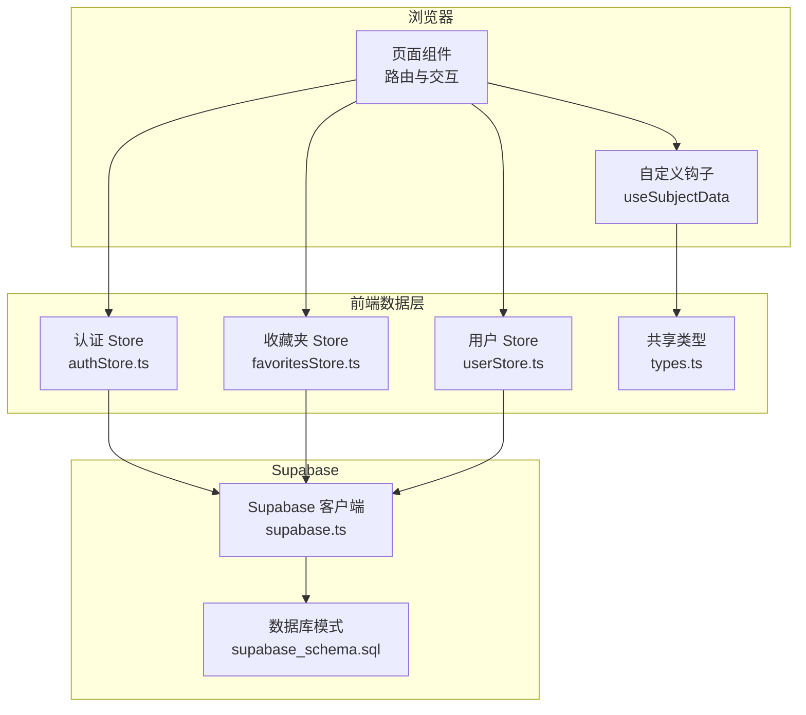
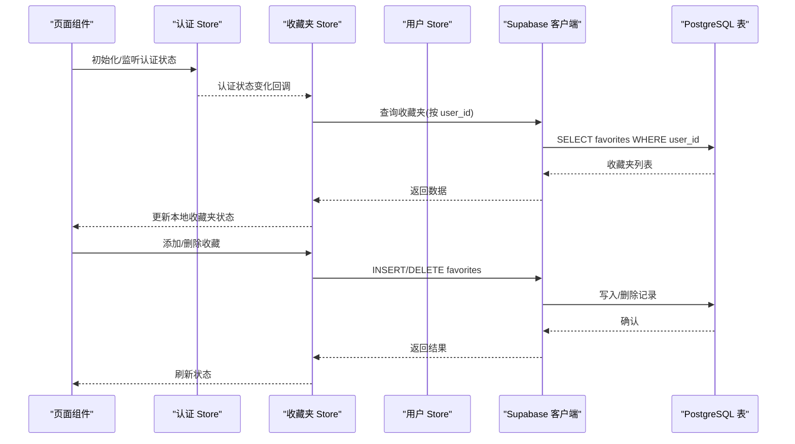
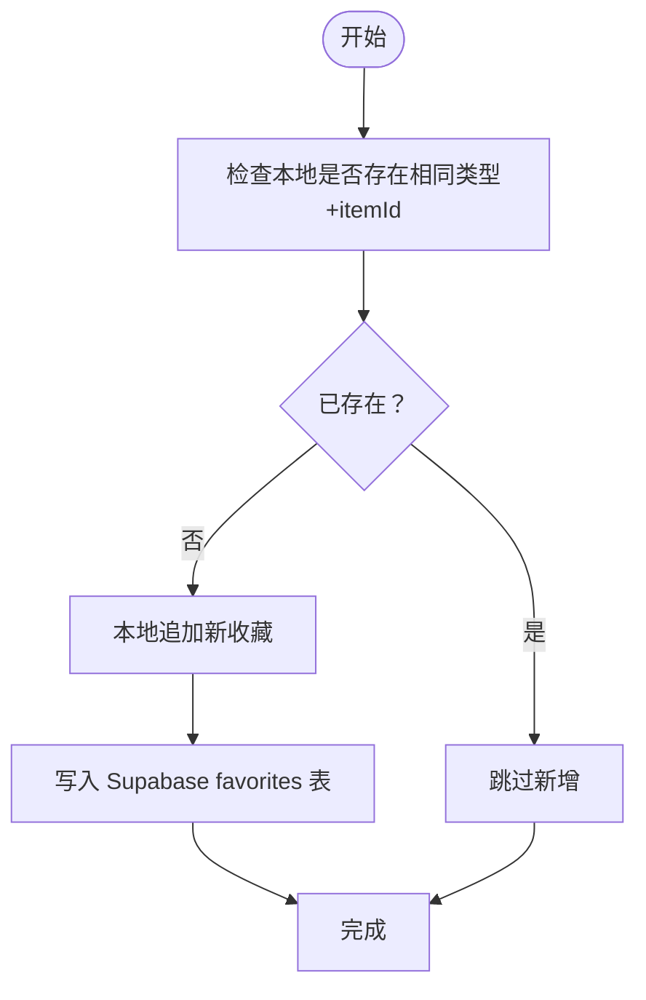
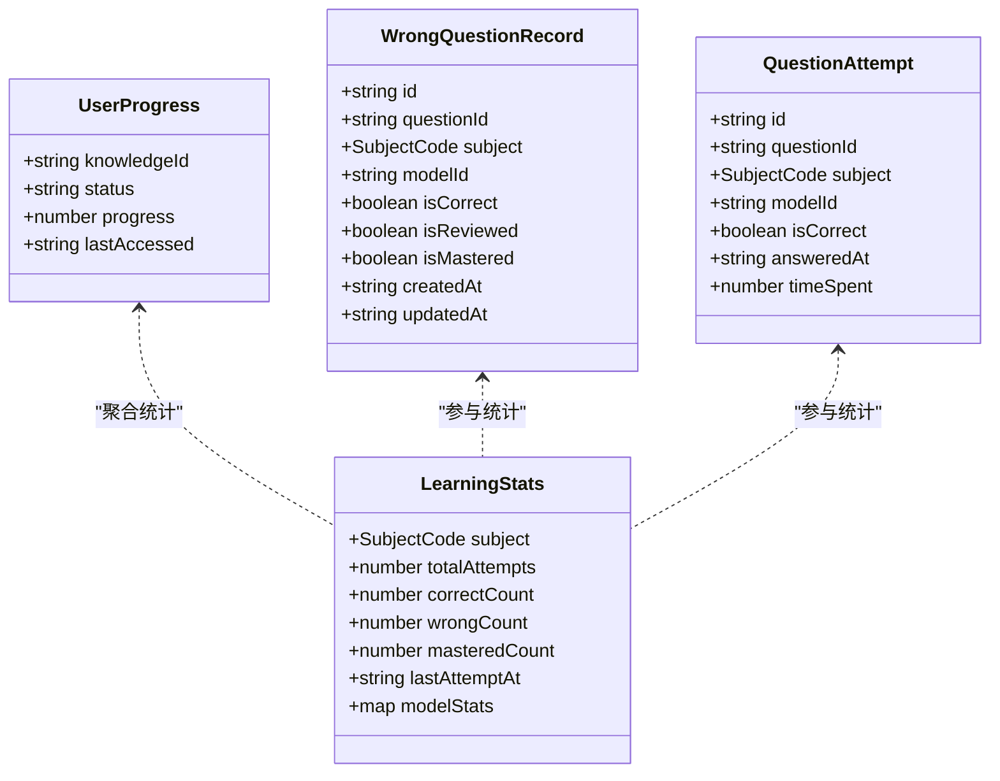
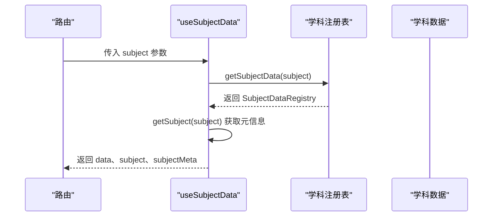
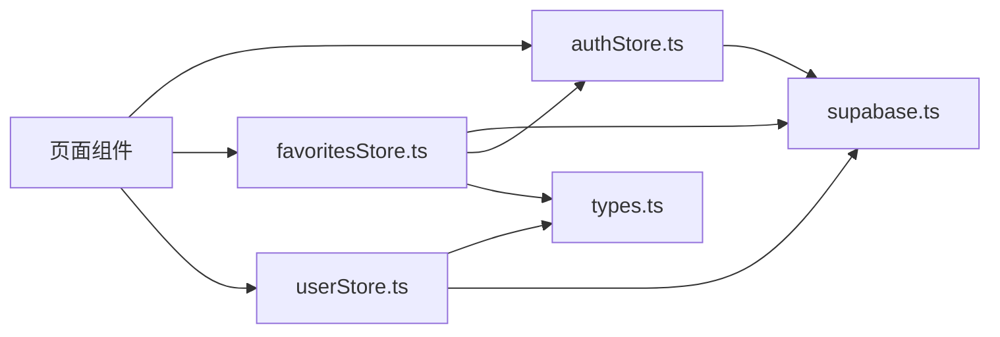

# 数据操作API

<cite>
**本文引用的文件**
- [supabase.ts](file://src/lib/supabase.ts)
- [supabase_schema.sql](file://supabase_schema.sql)
- [favoritesStore.ts](file://src/stores/favoritesStore.ts)
- [userStore.ts](file://src/stores/userStore.ts)
- [authStore.ts](file://src/stores/authStore.ts)
- [types.ts](file://src/stores/types.ts)
- [useSubjectData.ts](file://src/hooks/useSubjectData.ts)
- [registry.ts](file://src/data/registry.ts)
- [index.ts](file://src/types/index.ts)
</cite>

## 目录
1. [简介](#简介)
2. [项目结构](#项目结构)
3. [核心组件](#核心组件)
4. [架构总览](#架构总览)
5. [详细组件分析](#详细组件分析)
6. [依赖分析](#依赖分析)
7. [性能考虑](#性能考虑)
8. [故障排查指南](#故障排查指南)
9. [结论](#结论)
10. [附录](#附录)

## 简介
本文件面向星耀平台的数据操作API，系统化梳理基于 Supabase 的数据库 CRUD 接口与前端数据流，覆盖以下能力：
- 收藏夹数据的增删改查（按用户隔离）
- 用户学习进度数据的同步与聚合
- 学科数据的查询与路由绑定
- 数据验证规则、权限控制与访问限制
- 数据同步机制、缓存策略与性能优化建议
- 常见数据操作场景、批量操作示例与错误处理策略

## 项目结构
星耀平台采用前端 Zustand Store + Supabase 客户端的轻量数据层架构：
- 数据库层：Supabase Postgres 表与 RLS 策略
- 客户端层：认证与 Supabase 客户端初始化、收藏夹与用户状态管理 Store、学科数据注册与路由钩子

图表来源
- [supabase.ts:1-18](file://src/lib/supabase.ts#L1-L18)
- [supabase_schema.sql:1-178](file://supabase_schema.sql#L1-L178)
- [favoritesStore.ts:1-172](file://src/stores/favoritesStore.ts#L1-L172)
- [userStore.ts:1-236](file://src/stores/userStore.ts#L1-L236)
- [authStore.ts:1-63](file://src/stores/authStore.ts#L1-L63)
- [types.ts:1-12](file://src/stores/types.ts#L1-L12)
- [useSubjectData.ts:1-19](file://src/hooks/useSubjectData.ts#L1-L19)

章节来源
- [supabase.ts:1-18](file://src/lib/supabase.ts#L1-L18)
- [supabase_schema.sql:1-178](file://supabase_schema.sql#L1-L178)
- [favoritesStore.ts:1-172](file://src/stores/favoritesStore.ts#L1-L172)
- [userStore.ts:1-236](file://src/stores/userStore.ts#L1-L236)
- [authStore.ts:1-63](file://src/stores/authStore.ts#L1-L63)
- [types.ts:1-12](file://src/stores/types.ts#L1-L12)
- [useSubjectData.ts:1-19](file://src/hooks/useSubjectData.ts#L1-L19)

## 核心组件
- Supabase 客户端初始化与认证
  - 在环境变量有效时创建客户端，并启用自动刷新 Token 与会话持久化
  - 提供“是否已配置”的布尔标志，用于 Store 的降级策略
- 收藏夹 Store
  - 提供收藏夹的本地内存状态与云端同步，支持增删改查、切换与清空
  - 基于用户 ID 与类型+itemId 唯一键约束，确保同一用户对同一项只收藏一次
- 用户 Store
  - 管理用户学习进度、错题记录、做题尝试与学科统计
  - 提供本地聚合与持久化，支持按学科维度的统计计算
- 认证 Store
  - 管理用户会话、匿名登录与登出
  - 通过订阅认证状态变化驱动收藏夹自动同步
- 学科数据注册与路由钩子
  - 通过注册表统一暴露学科数据查询接口
  - 路由钩子根据参数获取学科数据与元信息

章节来源
- [supabase.ts:1-18](file://src/lib/supabase.ts#L1-L18)
- [favoritesStore.ts:1-172](file://src/stores/favoritesStore.ts#L1-L172)
- [userStore.ts:1-236](file://src/stores/userStore.ts#L1-L236)
- [authStore.ts:1-63](file://src/stores/authStore.ts#L1-L63)
- [registry.ts:1-48](file://src/data/registry.ts#L1-L48)
- [useSubjectData.ts:1-19](file://src/hooks/useSubjectData.ts#L1-L19)

## 架构总览
下图展示从页面到数据库的关键调用链路与权限控制：

图表来源
- [authStore.ts:1-63](file://src/stores/authStore.ts#L1-L63)
- [favoritesStore.ts:1-172](file://src/stores/favoritesStore.ts#L1-L172)
- [supabase.ts:1-18](file://src/lib/supabase.ts#L1-L18)
- [supabase_schema.sql:36-84](file://supabase_schema.sql#L36-L84)

## 详细组件分析

### 收藏夹数据操作（CRUD）
- 数据模型与约束
  - 表：favorites
  - 字段：id、user_id、type、item_id、title、note、created_at
  - 约束：unique(user_id, type, item_id)，防止重复收藏
  - RLS：仅允许用户读写自己的收藏
- 前端实现要点
  - 查询：按 user_id 查询并按添加时间倒序
  - 新增：先本地去重与预分配临时 id，再异步写入 Supabase
  - 删除：按 user_id + item_id + type 精确删除
  - 切换：内部判断是否存在，执行新增或删除
  - 清空：删除当前用户所有收藏
  - 同步：认证状态变化与初始化时拉取云端数据
- 数据验证与权限
  - type 限定为 model、strategy、vision、question
  - RLS 策略 using(auth.uid() = user_id) 与 with check(auth.uid() = user_id)

图表来源
- [favoritesStore.ts:65-94](file://src/stores/favoritesStore.ts#L65-L94)
- [supabase_schema.sql:36-84](file://supabase_schema.sql#L36-L84)

章节来源
- [favoritesStore.ts:1-172](file://src/stores/favoritesStore.ts#L1-L172)
- [supabase_schema.sql:36-84](file://supabase_schema.sql#L36-L84)
- [types.ts:1-12](file://src/stores/types.ts#L1-L12)

### 用户学习进度数据同步与聚合
- 数据模型
  - 表：progress（唯一(user_id, model_id)）、study_sessions、question_history、wrong_questions
  - RLS：仅允许用户读写自己的进度与会话
- 前端实现要点
  - 进度更新：本地合并状态，包含 status、progress、last_accessed
  - 错题记录：本地维护 subject -> records 数组，支持新增、更新、标记已阅/已掌握、删除
  - 做题尝试：本地维护 attempts 数组，按 subject 聚合统计
  - 学习统计：按 subject 计算 totalAttempts、correctCount、wrongCount、masteredCount、modelStats
- 数据验证
  - progress.status 限定为 undone、learning、mastered
  - progress.progress 0~100 整数

图表来源
- [userStore.ts:1-236](file://src/stores/userStore.ts#L1-L236)
- [index.ts:138-209](file://src/types/index.ts#L138-L209)

章节来源
- [userStore.ts:1-236](file://src/stores/userStore.ts#L1-L236)
- [index.ts:138-209](file://src/types/index.ts#L138-L209)
- [supabase_schema.sql:61-158](file://supabase_schema.sql#L61-L158)

### 学科数据查询接口
- 注册表
  - 提供学科概念、模型、公式、题库、图谱等查询接口
  - 通过 registerSubject 与 getSubjectData 统一管理
- 路由钩子
  - useSubjectData 从路由参数获取 subject，加载对应学科数据与元信息

图表来源
- [useSubjectData.ts:1-19](file://src/hooks/useSubjectData.ts#L1-L19)
- [registry.ts:1-48](file://src/data/registry.ts#L1-L48)

章节来源
- [useSubjectData.ts:1-19](file://src/hooks/useSubjectData.ts#L1-L19)
- [registry.ts:1-48](file://src/data/registry.ts#L1-L48)

## 依赖分析
- 组件耦合
  - favoritesStore 依赖 authStore 与 supabase.ts；依赖 types.ts 的 Favorite/FavoriteType
  - userStore 依赖 types.ts 的 UserProgress/WrongQuestionRecord/QuestionAttempt/LearningStats
  - authStore 依赖 supabase.ts 并与 favoritesStore 协作实现自动同步
- 外部依赖
  - Supabase 客户端负责认证与数据库访问
  - 浏览器环境变量提供 Supabase URL 与匿名密钥

图表来源
- [authStore.ts:1-63](file://src/stores/authStore.ts#L1-L63)
- [favoritesStore.ts:1-172](file://src/stores/favoritesStore.ts#L1-L172)
- [userStore.ts:1-236](file://src/stores/userStore.ts#L1-L236)
- [supabase.ts:1-18](file://src/lib/supabase.ts#L1-L18)
- [types.ts:1-12](file://src/stores/types.ts#L1-L12)

章节来源
- [authStore.ts:1-63](file://src/stores/authStore.ts#L1-L63)
- [favoritesStore.ts:1-172](file://src/stores/favoritesStore.ts#L1-L172)
- [userStore.ts:1-236](file://src/stores/userStore.ts#L1-L236)
- [supabase.ts:1-18](file://src/lib/supabase.ts#L1-L18)
- [types.ts:1-12](file://src/stores/types.ts#L1-L12)

## 性能考虑
- 查询索引
  - favorites、progress、wrong_questions、question_history、study_sessions 已建立关键字段索引，提升按 user_id、type、itemId 等过滤效率
- 写入策略
  - 收藏夹新增采用“先本地后云端”策略，减少 UI 卡顿；云端写入失败可回滚或重试
- 缓存策略
  - 收藏夹 Store 在未配置 Supabase 时持久化到 localStorage；配置后以云端为准，本地仅作快速回显
  - 用户 Store 对进度、错题、统计等进行本地聚合，降低频繁读取成本
- 批量操作建议
  - 批量删除收藏：按 user_id + 多个 (type, item_id) 组合进行批量 delete
  - 批量更新进度：按 model_id 唯一键 upsert，避免重复写入
- 网络异常处理
  - 云端请求失败时保持本地状态可用，待网络恢复后重试或提示用户

## 故障排查指南
- Supabase 未配置
  - 现象：客户端为空，无法进行数据库操作
  - 处理：检查环境变量 VITE_SUPABASE_URL 与 VITE_SUPABASE_ANON_KEY 是否正确设置
- 认证状态异常
  - 现象：收藏夹无法同步、RLS 报权限不足
  - 处理：确认 authStore.init() 成功获取 session；若无 session，避免强制匿名登录导致 422
- 写入冲突
  - 现象：新增收藏报唯一键冲突
  - 处理：前端已在本地去重；如仍出现，检查 type 与 item_id 组合是否重复
- 数据不一致
  - 现象：本地与云端显示不一致
  - 处理：触发 syncFromSupabase 或等待认证状态变化自动同步

章节来源
- [supabase.ts:1-18](file://src/lib/supabase.ts#L1-L18)
- [authStore.ts:1-63](file://src/stores/authStore.ts#L1-L63)
- [favoritesStore.ts:1-172](file://src/stores/favoritesStore.ts#L1-L172)
- [supabase_schema.sql:36-84](file://supabase_schema.sql#L36-L84)

## 结论
星耀平台通过 Supabase + Zustand 的组合实现了简洁可靠的前端数据层：以 RLS 保障数据安全，以 Store 实现本地快速响应与云端持久化。收藏夹与学习进度两大核心能力具备完善的增删改查、权限控制与同步机制，配合学科数据注册表与路由钩子，形成从数据到界面的一体化体验。

## 附录

### 数据库表结构与字段定义
- profiles
  - 字段：id、username、avatar_url、created_at、updated_at
  - 关系：id 引用 auth.users
- favorites
  - 字段：id、user_id、type、item_id、title、note、created_at
  - 约束：unique(user_id, type, item_id)
  - RLS：仅允许用户读写自己的收藏
- progress
  - 字段：id、user_id、model_id、status、progress、last_accessed、created_at、updated_at
  - 约束：unique(user_id, model_id)
  - RLS：仅允许用户读写自己的进度
- wrong_questions
  - 字段：id、user_id、question_id、model_id、difficulty、my_answer、correct_answer、reason、review_count、is_resolved、created_at
  - 约束：unique(user_id, question_id)
  - RLS：仅允许用户读写自己的错题
- question_history
  - 字段：id、user_id、question_id、model_id、difficulty、my_answer、correct_answer、is_correct、time_spent、created_at
  - RLS：仅允许用户读写自己的历史
- study_sessions
  - 字段：id、user_id、date、study_time、questions_done、correct_count、created_at
  - 约束：unique(user_id, date)
  - RLS：仅允许用户读写自己的会话

章节来源
- [supabase_schema.sql:1-178](file://supabase_schema.sql#L1-L178)

### 数据验证规则与权限控制
- 类型约束
  - favorites.type ∈ {model, strategy, vision, question}
  - progress.status ∈ {undone, learning, mastered}
- 唯一键约束
  - favorites：(user_id, type, item_id)
  - progress：(user_id, model_id)
  - wrong_questions：(user_id, question_id)
  - study_sessions：(user_id, date)
- 权限控制
  - RLS using(auth.uid() = user_id) 与 with check(auth.uid() = user_id)

章节来源
- [supabase_schema.sql:36-84](file://supabase_schema.sql#L36-L84)
- [supabase_schema.sql:61-158](file://supabase_schema.sql#L61-L158)

### 常见数据操作场景
- 新增收藏
  - 步骤：本地去重 → 本地追加 → 写入 Supabase → 观察云端结果
  - 参考：favoritesStore.addFavorite
- 删除收藏
  - 步骤：本地移除 → 按 user_id + (type, item_id) 删除
  - 参考：favoritesStore.removeFavorite
- 切换收藏
  - 步骤：判断是否存在 → 存在则删除，否则新增
  - 参考：favoritesStore.toggleFavorite
- 清空收藏
  - 步骤：本地清空 → 按 user_id 删除全部
  - 参考：favoritesStore.clearAll
- 同步收藏
  - 步骤：认证状态变化 → 拉取 favorites.user_id → 更新本地
  - 参考：favoritesStore.syncFromSupabase

章节来源
- [favoritesStore.ts:65-142](file://src/stores/favoritesStore.ts#L65-L142)

### 批量操作示例
- 批量删除收藏
  - 方法：按 user_id + 多组 (type, item_id) 进行 delete
  - 注意：确保每组唯一键不冲突
- 批量更新进度
  - 方法：按 model_id 唯一键 upsert，避免重复写入
  - 注意：保持 progress ∈ [0,100] 且 status 合法

章节来源
- [supabase_schema.sql:36-84](file://supabase_schema.sql#L36-L84)
- [favoritesStore.ts:96-114](file://src/stores/favoritesStore.ts#L96-L114)