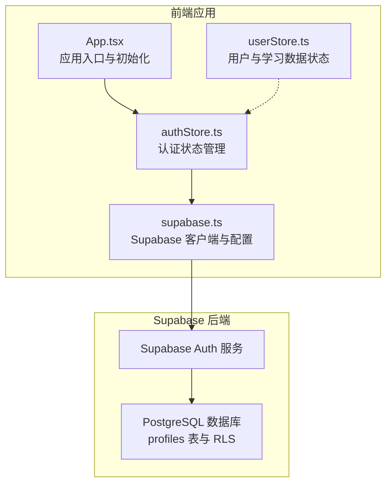
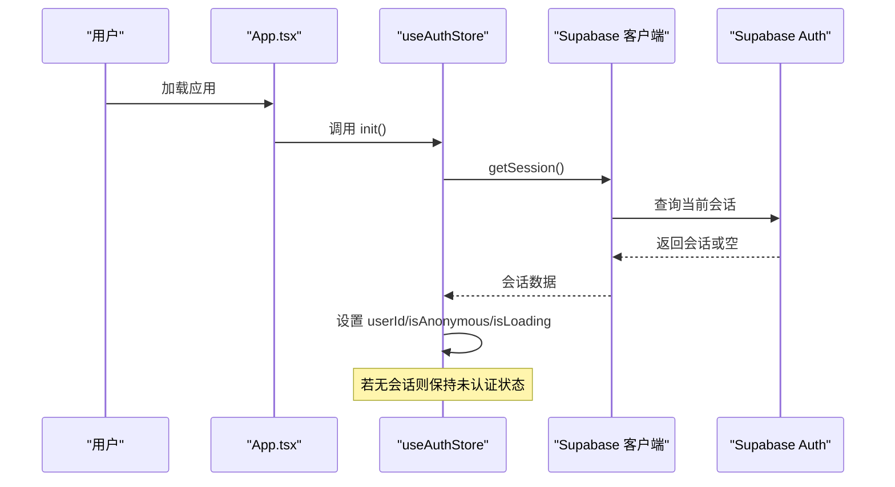
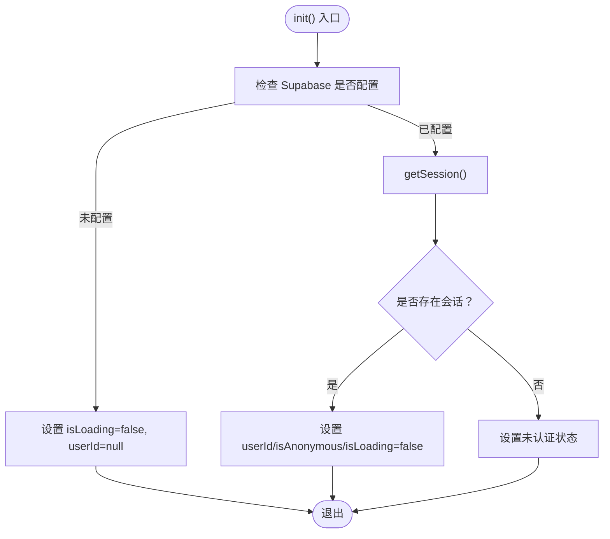
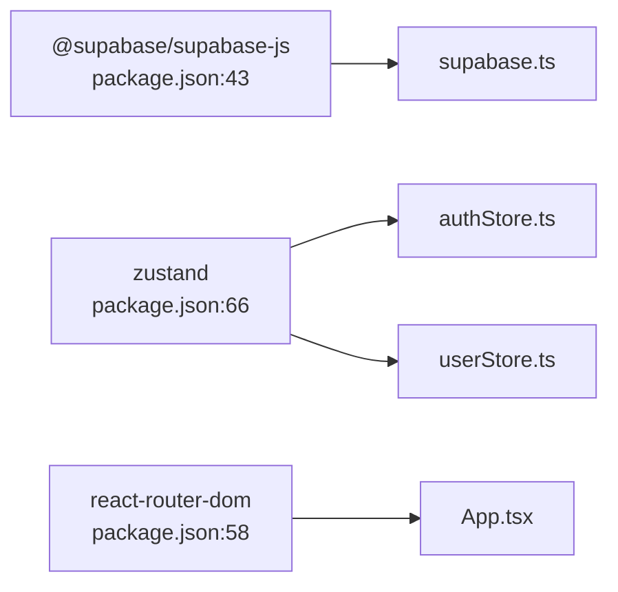

# 用户认证API

<cite>
**本文引用的文件**
- [supabase.ts](file://src/lib/supabase.ts)
- [authStore.ts](file://src/stores/authStore.ts)
- [userStore.ts](file://src/stores/userStore.ts)
- [App.tsx](file://src/App.tsx)
- [supabase_schema.sql](file://supabase_schema.sql)
- [package.json](file://package.json)
</cite>

## 目录
1. [简介](#简介)
2. [项目结构](#项目结构)
3. [核心组件](#核心组件)
4. [架构总览](#架构总览)
5. [详细组件分析](#详细组件分析)
6. [依赖分析](#依赖分析)
7. [性能考量](#性能考量)
8. [故障排查指南](#故障排查指南)
9. [结论](#结论)
10. [附录](#附录)

## 简介
本文件面向星耀平台的前端与集成开发者，系统化说明基于 Supabase 的用户认证能力与实现。文档覆盖以下主题：
- Supabase 提供的用户注册、登录、登出与会话管理接口
- 认证流程的 HTTP 方法、URL 模式、请求/响应格式与身份验证方法
- 邮箱密码认证、OAuth 认证与匿名认证的实现细节
- 自动刷新令牌机制、会话持久化与检测 URL 会话的功能配置
- 认证状态管理的最佳实践、错误处理策略与安全考虑
- 常见认证场景示例、客户端实现指南与调试技巧

说明：本仓库采用 Supabase 客户端 SDK 进行认证，具体 REST API 行为由 Supabase 后端服务提供；本文重点阐述前端如何通过 SDK 实现认证流程与状态管理。

## 项目结构
与认证直接相关的代码集中在以下位置：
- 客户端初始化与认证配置：src/lib/supabase.ts
- 认证状态管理（Zustand）：src/stores/authStore.ts
- 用户数据与学习进度等状态管理（Zustand + 持久化）：src/stores/userStore.ts
- 应用入口与认证初始化调用：src/App.tsx
- Supabase 数据库与策略（含 profiles 表与 RLS）：supabase_schema.sql
- 依赖声明（包含 @supabase/supabase-js）：package.json

图表来源
- [App.tsx:69-75](file://src/App.tsx#L69-L75)
- [authStore.ts:15-62](file://src/stores/authStore.ts#L15-L62)
- [userStore.ts:46-236](file://src/stores/userStore.ts#L46-L236)
- [supabase.ts:1-18](file://src/lib/supabase.ts#L1-L18)
- [supabase_schema.sql:12-34](file://supabase_schema.sql#L12-L34)

章节来源
- [supabase.ts:1-18](file://src/lib/supabase.ts#L1-L18)
- [authStore.ts:1-63](file://src/stores/authStore.ts#L1-L63)
- [userStore.ts:1-236](file://src/stores/userStore.ts#L1-L236)
- [App.tsx:69-75](file://src/App.tsx#L69-L75)
- [supabase_schema.sql:12-34](file://supabase_schema.sql#L12-L34)
- [package.json:43](file://package.json#L43)

## 核心组件
- Supabase 客户端与配置
  - 通过环境变量注入 Supabase URL 与匿名密钥，按需创建客户端实例
  - 启用自动刷新令牌、会话持久化，并关闭“检测 URL 会话”以避免外部回调干扰
- 认证状态管理（useAuthStore）
  - 初始化：读取本地会话，设置认证状态与匿名标志
  - 匿名登录：触发匿名认证，更新用户 ID 与匿名标志
  - 登出：调用后端登出并清空本地状态
- 用户状态管理（useUserStore）
  - 维护用户基本信息、学习进度、错题与统计等
  - 通过持久化中间件将关键状态写入本地存储，提升体验与容错

章节来源
- [supabase.ts:1-18](file://src/lib/supabase.ts#L1-L18)
- [authStore.ts:15-62](file://src/stores/authStore.ts#L15-L62)
- [userStore.ts:46-236](file://src/stores/userStore.ts#L46-L236)

## 架构总览
下图展示认证初始化与状态流转的关键交互：

图表来源
- [App.tsx:69-75](file://src/App.tsx#L69-L75)
- [authStore.ts:20-37](file://src/stores/authStore.ts#L20-L37)
- [supabase.ts:27](file://src/lib/supabase.ts#L27)

## 详细组件分析

### Supabase 客户端与配置（src/lib/supabase.ts）
- 环境变量驱动的客户端创建：当 URL 与匿名密钥均有效时才创建客户端，避免空配置导致连接失败
- 关键配置项
  - autoRefreshToken：启用自动刷新访问令牌
  - persistSession：启用会话持久化（浏览器本地存储）
  - detectSessionInUrl：关闭从 URL 检测会话，降低外部回调风险
- 配置开关说明
  - autoRefreshToken：确保长时间使用时令牌不会过期
  - persistSession：刷新页面后仍保持登录态
  - detectSessionInUrl：默认关闭，避免 OAuth 回调参数污染本地会话

章节来源
- [supabase.ts:1-18](file://src/lib/supabase.ts#L1-L18)

### 认证状态管理（src/stores/authStore.ts）
- 状态字段
  - userId：当前用户 ID 或空
  - isLoading：初始化中
  - isAnonymous：是否匿名用户
- 关键动作
  - init：获取当前会话，若存在则设置用户 ID 与匿名标志；否则保持未认证
  - signInAnonymously：匿名登录，成功后更新用户 ID 与 isAnonymous
  - signOut：调用后端登出并清空本地状态
- 错误处理
  - 初始化异常时静默降级，避免阻塞应用启动
  - 匿名登录失败时记录错误日志

图表来源
- [authStore.ts:20-37](file://src/stores/authStore.ts#L20-L37)

章节来源
- [authStore.ts:15-62](file://src/stores/authStore.ts#L15-L62)

### 用户状态管理（src/stores/userStore.ts）
- 状态与行为
  - 维护用户对象、认证状态、学习进度、错题与统计
  - 提供 logout 清理函数，重置所有用户相关状态
  - 通过持久化中间件将关键字段写入本地存储，提升体验
- 与认证的关系
  - 认证状态改变时，应同步清理或重置用户相关状态，避免脏数据

章节来源
- [userStore.ts:46-236](file://src/stores/userStore.ts#L46-L236)

### 应用入口与初始化（src/App.tsx）
- 在应用启动时，若 Supabase 已配置，则立即执行认证初始化
- 初始化完成后，路由层可基于认证状态决定页面渲染与权限控制

章节来源
- [App.tsx:69-75](file://src/App.tsx#L69-L75)

### Supabase 数据库与策略（supabase_schema.sql）
- profiles 表：为每个用户创建档案，注册时自动触发
- RLS 策略：收藏夹表启用行级安全策略，确保用户只能读写自己的收藏
- 与认证的关联
  - 用户注册后自动创建档案，便于后续业务数据绑定
  - RLS 保障用户数据隔离，配合认证实现安全访问

章节来源
- [supabase_schema.sql:12-34](file://supabase_schema.sql#L12-L34)
- [supabase_schema.sql:52-59](file://supabase_schema.sql#L52-L59)

## 依赖分析
- @supabase/supabase-js：认证与数据库访问的核心依赖
- Zustand：轻量状态管理，用于认证与用户数据
- React Router：路由控制，结合认证状态实现页面级权限

图表来源
- [package.json:43](file://package.json#L43)
- [package.json:66](file://package.json#L66)
- [package.json:58](file://package.json#L58)

章节来源
- [package.json:43](file://package.json#L43)
- [package.json:66](file://package.json#L66)
- [package.json:58](file://package.json#L58)

## 性能考量
- 自动刷新令牌与会话持久化
  - 优点：减少频繁登录，提升用户体验
  - 注意：需关注本地存储占用与令牌轮换开销
- 初始化时机
  - 在应用启动阶段尽早调用 init，避免首屏等待
- 状态粒度
  - 将用户相关状态持久化，减少重复拉取与计算

## 故障排查指南
- Supabase 未配置
  - 现象：初始化后未进入认证状态
  - 排查：确认环境变量是否正确注入
- 匿名登录失败
  - 现象：调用匿名登录后仍为未认证
  - 排查：检查返回的错误对象，确认网络与服务可用性
- 会话未持久化
  - 现象：刷新页面后丢失登录态
  - 排查：确认浏览器本地存储可用，且 persistSession 已启用
- OAuth 回调导致状态异常
  - 现象：URL 中携带会话参数后出现意外行为
  - 排查：确认 detectSessionInUrl 已关闭

章节来源
- [supabase.ts:1-18](file://src/lib/supabase.ts#L1-L18)
- [authStore.ts:39-55](file://src/stores/authStore.ts#L39-L55)

## 结论
本项目通过 Supabase 客户端 SDK 与 Zustand 状态管理，实现了简洁可靠的认证流程：初始化读取会话、匿名登录、登出与状态持久化。结合数据库侧的 RLS 策略，形成从前端到后端的安全闭环。建议在生产环境中持续监控令牌刷新与会话持久化表现，并根据业务需要扩展邮箱密码与 OAuth 认证。

## 附录

### 常见认证场景与实现要点
- 邮箱密码认证
  - 通过 Supabase 客户端的邮箱密码接口实现注册与登录
  - 建议在 UI 层提供输入校验与错误提示
- OAuth 认证
  - 利用 Supabase 的 OAuth 集成，完成第三方登录
  - 保持 detectSessionInUrl 关闭，避免 URL 参数干扰
- 匿名认证
  - 适合访客快速体验，后续可引导升级为正式账户
  - 登录态切换时注意清理用户相关状态

### 客户端实现指南
- 初始化
  - 在应用启动时调用认证初始化，避免阻塞首屏
- 登录/登出
  - 登录成功后更新认证状态与用户状态
  - 登出时调用后端登出并清理本地状态
- 错误处理
  - 对初始化与登录过程进行异常捕获与降级处理

### 调试技巧
- 查看本地存储中的会话信息，确认 persistSession 生效
- 使用浏览器开发者工具观察网络请求，确认认证相关 API 调用
- 在开发环境临时开启更详细的日志输出，定位初始化问题