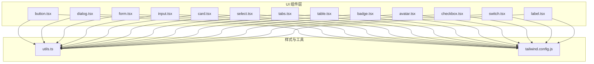
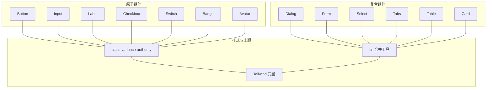
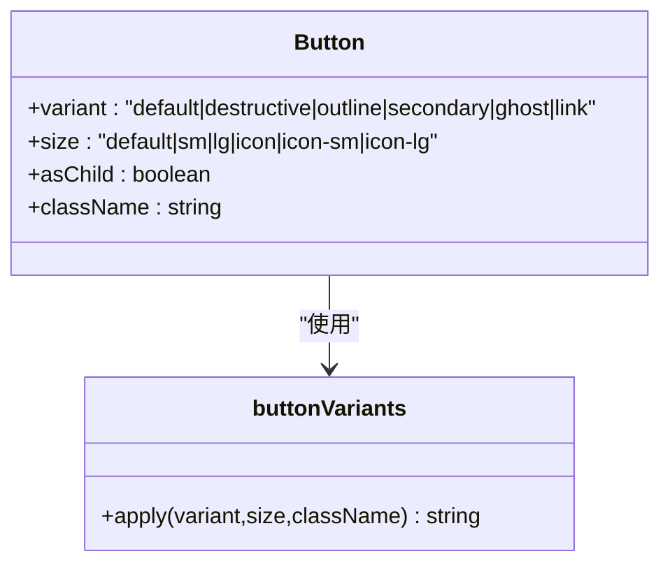
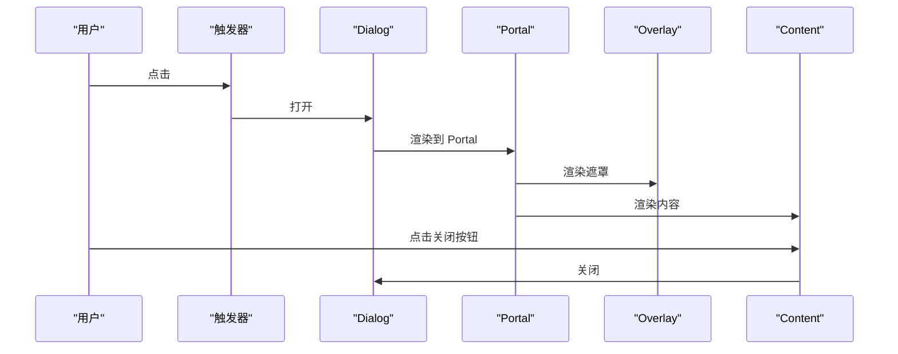
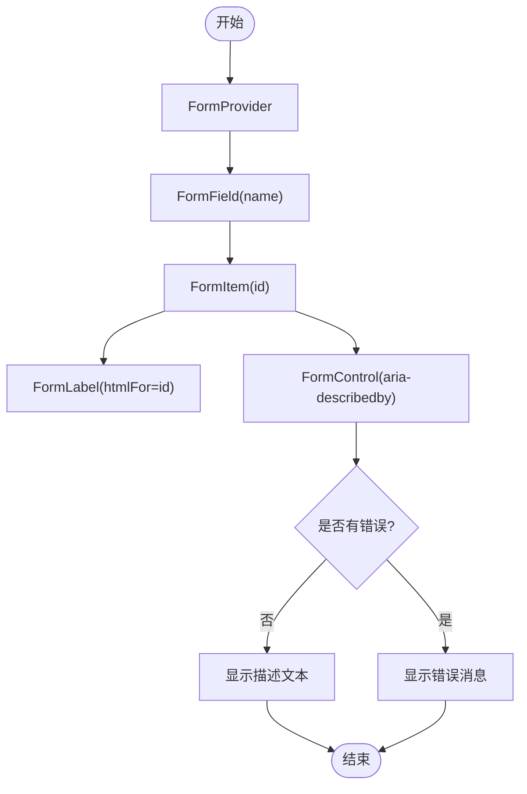
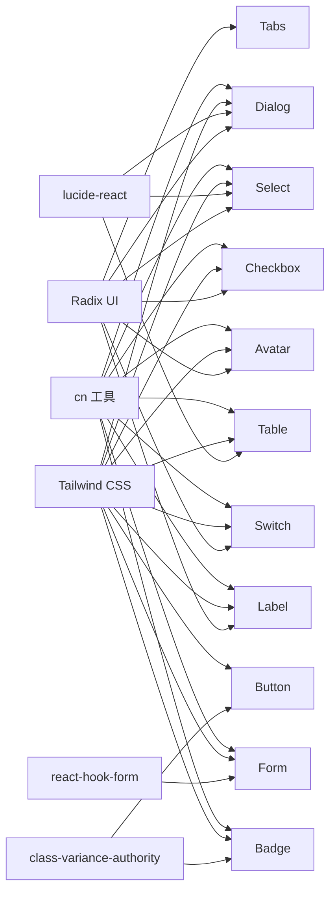

# UI组件系统

<cite>
**本文引用的文件**
- [button.tsx](file://src/components/ui/button.tsx)
- [dialog.tsx](file://src/components/ui/dialog.tsx)
- [form.tsx](file://src/components/ui/form.tsx)
- [input.tsx](file://src/components/ui/input.tsx)
- [card.tsx](file://src/components/ui/card.tsx)
- [select.tsx](file://src/components/ui/select.tsx)
- [tabs.tsx](file://src/components/ui/tabs.tsx)
- [table.tsx](file://src/components/ui/table.tsx)
- [badge.tsx](file://src/components/ui/badge.tsx)
- [avatar.tsx](file://src/components/ui/avatar.tsx)
- [checkbox.tsx](file://src/components/ui/checkbox.tsx)
- [switch.tsx](file://src/components/ui/switch.tsx)
- [label.tsx](file://src/components/ui/label.tsx)
- [utils.ts](file://src/lib/utils.ts)
- [tailwind.config.js](file://tailwind.config.js)
</cite>

## 目录
1. [简介](#简介)
2. [项目结构](#项目结构)
3. [核心组件](#核心组件)
4. [架构总览](#架构总览)
5. [详细组件分析](#详细组件分析)
6. [依赖分析](#依赖分析)
7. [性能考虑](#性能考虑)
8. [故障排查指南](#故障排查指南)
9. [结论](#结论)
10. [附录](#附录)

## 简介
本文件系统性梳理星耀平台的UI组件体系，该体系以 shadcn/ui 的设计哲学为蓝本，结合 Radix UI 的可访问性与语义化能力，构建出统一、可组合、可定制的现代化组件库。组件遵循以下原则：
- 视觉：基于 Tailwind CSS 变量与暗色模式，提供一致的色彩与圆角体系。
- 行为：以 Radix UI 提供的可访问性与状态管理为基础，确保键盘可达与屏幕阅读器友好。
- 交互：通过变体与尺寸系统实现丰富的外观与布局组合，满足不同场景需求。
- 可定制：以 class-variance-authority 与 cn 工具为核心，提供灵活的样式组合与覆盖。

## 项目结构
UI 组件集中位于 src/components/ui 目录下，采用“按功能分文件”的组织方式，每个组件文件聚焦单一职责，并通过共享的样式工具与主题配置保持一致性。

图表来源
- [button.tsx:1-63](file://src/components/ui/button.tsx#L1-L63)
- [dialog.tsx:1-142](file://src/components/ui/dialog.tsx#L1-L142)
- [form.tsx:1-168](file://src/components/ui/form.tsx#L1-L168)
- [input.tsx:1-22](file://src/components/ui/input.tsx#L1-L22)
- [card.tsx:1-93](file://src/components/ui/card.tsx#L1-L93)
- [select.tsx:1-189](file://src/components/ui/select.tsx#L1-L189)
- [tabs.tsx:1-67](file://src/components/ui/tabs.tsx#L1-L67)
- [table.tsx:1-115](file://src/components/ui/table.tsx#L1-L115)
- [badge.tsx:1-47](file://src/components/ui/badge.tsx#L1-L47)
- [avatar.tsx:1-52](file://src/components/ui/avatar.tsx#L1-L52)
- [checkbox.tsx:1-33](file://src/components/ui/checkbox.tsx#L1-L33)
- [switch.tsx:1-32](file://src/components/ui/switch.tsx#L1-L32)
- [label.tsx:1-25](file://src/components/ui/label.tsx#L1-L25)
- [utils.ts:1-7](file://src/lib/utils.ts#L1-L7)
- [tailwind.config.js:1-52](file://tailwind.config.js#L1-L52)

章节来源
- [button.tsx:1-63](file://src/components/ui/button.tsx#L1-L63)
- [dialog.tsx:1-142](file://src/components/ui/dialog.tsx#L1-L142)
- [form.tsx:1-168](file://src/components/ui/form.tsx#L1-L168)
- [input.tsx:1-22](file://src/components/ui/input.tsx#L1-L22)
- [card.tsx:1-93](file://src/components/ui/card.tsx#L1-L93)
- [select.tsx:1-189](file://src/components/ui/select.tsx#L1-L189)
- [tabs.tsx:1-67](file://src/components/ui/tabs.tsx#L1-L67)
- [table.tsx:1-115](file://src/components/ui/table.tsx#L1-L115)
- [badge.tsx:1-47](file://src/components/ui/badge.tsx#L1-L47)
- [avatar.tsx:1-52](file://src/components/ui/avatar.tsx#L1-L52)
- [checkbox.tsx:1-33](file://src/components/ui/checkbox.tsx#L1-L33)
- [switch.tsx:1-32](file://src/components/ui/switch.tsx#L1-L32)
- [label.tsx:1-25](file://src/components/ui/label.tsx#L1-L25)
- [utils.ts:1-7](file://src/lib/utils.ts#L1-L7)
- [tailwind.config.js:1-52](file://tailwind.config.js#L1-L52)

## 核心组件
本节概述关键组件的职责、外观与交互要点，并给出使用建议与注意事项。

- 按钮 Button
  - 外观：支持默认、破坏性、描边、次级、幽灵、链接六种变体；提供默认、小、大、图标（含尺寸）四种尺寸。
  - 交互：支持 asChild 将渲染节点替换为包裹容器，便于与路由或链接组合；内置焦点环与禁用态样式。
  - 自定义：通过变体与尺寸组合实现丰富外观；可叠加 className 覆盖。
  - 无障碍：继承原生按钮语义，支持键盘激活与可访问名称。
  - 参考路径：[button.tsx:7-37](file://src/components/ui/button.tsx#L7-L37)

- 对话框 Dialog
  - 结构：Root、Trigger、Portal、Overlay、Content、Header、Footer、Title、Description、Close。
  - 动画：基于 Radix UI 状态切换，配合淡入淡出与缩放动画；支持关闭按钮。
  - 交互：居中展示，最大宽度适配；支持键盘关闭（Esc）与点击遮罩关闭。
  - 自定义：Content 支持传入 className；可选择是否显示关闭按钮。
  - 参考路径：[dialog.tsx:31-79](file://src/components/ui/dialog.tsx#L31-L79)

- 表单 Form
  - 架构：FormProvider、FormField、FormItem、FormLabel、FormControl、FormDescription、FormMessage。
  - 状态：集成 react-hook-form，自动注入 aria-* 属性与错误提示 ID。
  - 交互：Label 与控件通过 formItemId 关联；错误态自动标注。
  - 自定义：FormItem 内部生成唯一 ID；可直接传入任意受控组件作为 FormControl。
  - 参考路径：[form.tsx:19-167](file://src/components/ui/form.tsx#L19-L167)

- 输入框 Input
  - 外观：统一圆角、边框、背景与阴影；聚焦态带 ring 边框与环形光晕。
  - 交互：支持 type、placeholder、禁用态；错误态通过 aria-invalid 标注。
  - 自定义：可叠加 className；与 Form 组合时自动接入无障碍属性。
  - 参考路径：[input.tsx:5-19](file://src/components/ui/input.tsx#L5-L19)

- 卡片 Card
  - 结构：Card、CardHeader、CardTitle、CardDescription、CardAction、CardContent、CardFooter。
  - 布局：Header 支持右侧操作区网格布局；Footer 支持边框线。
  - 自定义：通过 data-slot 标识内部节点，便于主题覆盖。
  - 参考路径：[card.tsx:5-82](file://src/components/ui/card.tsx#L5-L82)

- 选择器 Select
  - 结构：Root、Trigger、Content、Viewport、Label、Item、Separator、ScrollUp/DownButton、Value。
  - 交互：支持分组、滚动按钮、占位符；Item 带勾选指示器。
  - 自定义：Trigger 支持 size；Content 支持位置与对齐；可自定义图标。
  - 参考路径：[select.tsx:7-188](file://src/components/ui/select.tsx#L7-L188)

- 标签页 Tabs
  - 结构：Root、List、Trigger、Content。
  - 交互：激活态带边框与阴影；支持键盘导航。
  - 自定义：触发器与列表样式可叠加 className。
  - 参考路径：[tabs.tsx:8-66](file://src/components/ui/tabs.tsx#L8-L66)

- 表格 Table
  - 结构：Table 容器、TableHeader、TableBody、TableFooter、TableRow、TableHead、TableCell、TableCaption。
  - 交互：行悬停与选中态；支持横向滚动容器。
  - 自定义：容器外层提供滚动包装；单元格内可放置复选框等控件。
  - 参考路径：[table.tsx:5-114](file://src/components/ui/table.tsx#L5-L114)

- 徽章 Badge
  - 外观：默认、次级、破坏性、描边四种变体；支持 asChild 渲染为子元素。
  - 交互：聚焦态带 ring；错误态标注。
  - 自定义：通过变体与 asChild 实现多样化徽标。
  - 参考路径：[badge.tsx:7-26](file://src/components/ui/badge.tsx#L7-L26)

- 头像 Avatar
  - 结构：Root、Image、Fallback。
  - 交互：图片加载失败回退到占位；支持禁用态样式。
  - 自定义：可叠加 className；适合与标签、列表等组合。
  - 参考路径：[avatar.tsx:6-49](file://src/components/ui/avatar.tsx#L6-L49)

- 复选框 Checkbox
  - 外观：统一圆角与阴影；选中态改变背景与边框颜色。
  - 交互：支持禁用与错误态；键盘可切换。
  - 自定义：可叠加 className；与 Label 组合提升可访问性。
  - 参考路径：[checkbox.tsx:9-29](file://src/components/ui/checkbox.tsx#L9-L29)

- 开关 Switch
  - 外观：拇指随状态平滑移动；未选中态背景来自输入色板。
  - 交互：支持禁用与键盘切换；聚焦态带 ring。
  - 自定义：可叠加 className；适合设置项与过滤器。
  - 参考路径：[switch.tsx:8-28](file://src/components/ui/switch.tsx#L8-L28)

- 标签 Label
  - 外观：强调字体与行高；支持禁用态样式。
  - 交互：与表单控件关联，提升可点区域。
  - 自定义：可叠加 className；与 Form 组件配合最佳。
  - 参考路径：[label.tsx:8-21](file://src/components/ui/label.tsx#L8-L21)

章节来源
- [button.tsx:7-37](file://src/components/ui/button.tsx#L7-L37)
- [dialog.tsx:31-79](file://src/components/ui/dialog.tsx#L31-L79)
- [form.tsx:19-167](file://src/components/ui/form.tsx#L19-L167)
- [input.tsx:5-19](file://src/components/ui/input.tsx#L5-L19)
- [card.tsx:5-82](file://src/components/ui/card.tsx#L5-L82)
- [select.tsx:7-188](file://src/components/ui/select.tsx#L7-L188)
- [tabs.tsx:8-66](file://src/components/ui/tabs.tsx#L8-L66)
- [table.tsx:5-114](file://src/components/ui/table.tsx#L5-L114)
- [badge.tsx:7-26](file://src/components/ui/badge.tsx#L7-L26)
- [avatar.tsx:6-49](file://src/components/ui/avatar.tsx#L6-L49)
- [checkbox.tsx:9-29](file://src/components/ui/checkbox.tsx#L9-L29)
- [switch.tsx:8-28](file://src/components/ui/switch.tsx#L8-L28)
- [label.tsx:8-21](file://src/components/ui/label.tsx#L8-L21)

## 架构总览
组件系统采用“原子化 + 组合”的设计思路：
- 原子组件：Button、Input、Label、Checkbox、Switch、Badge、Avatar 等，负责最小可复用的交互与视觉单元。
- 复合组件：Dialog、Form、Select、Tabs、Table、Card 等，封装复杂状态与布局，提供稳定的 API。
- 样式与主题：通过 Tailwind CSS 变量与 class-variance-authority 的变体系统，统一风格与尺寸。
- 可访问性：所有复合组件均基于 Radix UI，确保键盘导航、ARIA 属性与屏幕阅读器支持。

图表来源
- [button.tsx:7-37](file://src/components/ui/button.tsx#L7-L37)
- [input.tsx:5-19](file://src/components/ui/input.tsx#L5-L19)
- [label.tsx:8-21](file://src/components/ui/label.tsx#L8-L21)
- [checkbox.tsx:9-29](file://src/components/ui/checkbox.tsx#L9-L29)
- [switch.tsx:8-28](file://src/components/ui/switch.tsx#L8-L28)
- [badge.tsx:7-26](file://src/components/ui/badge.tsx#L7-L26)
- [avatar.tsx:6-49](file://src/components/ui/avatar.tsx#L6-L49)
- [dialog.tsx:31-79](file://src/components/ui/dialog.tsx#L31-L79)
- [form.tsx:19-167](file://src/components/ui/form.tsx#L19-L167)
- [select.tsx:7-188](file://src/components/ui/select.tsx#L7-L188)
- [tabs.tsx:8-66](file://src/components/ui/tabs.tsx#L8-L66)
- [table.tsx:5-114](file://src/components/ui/table.tsx#L5-L114)
- [card.tsx:5-82](file://src/components/ui/card.tsx#L5-L82)
- [utils.ts:4-6](file://src/lib/utils.ts#L4-L6)
- [tailwind.config.js:10-49](file://tailwind.config.js#L10-L49)

## 详细组件分析

### 按钮 Button 组件
- 设计要点
  - 使用 cva 定义变体与尺寸，保证样式一致性与可维护性。
  - 支持 asChild，便于与路由或链接组合，避免多余 DOM 节点。
  - 焦点态与禁用态通过 Tailwind 类与 aria-* 属性明确反馈。
- 使用示例
  - 基础按钮：参考 [button.tsx:39-60](file://src/components/ui/button.tsx#L39-L60)
  - 图标按钮：参考 [button.tsx:27-29](file://src/components/ui/button.tsx#L27-L29)
  - 链接样式：参考 [button.tsx:21-22](file://src/components/ui/button.tsx#L21-L22)
- 无障碍与交互
  - 默认原生 button 语义；asChild 模式需确保父元素具备可访问名称。
  - 焦点环与错误态通过 data-slot 与 aria-* 属性暴露给主题系统。

图表来源
- [button.tsx:7-37](file://src/components/ui/button.tsx#L7-L37)
- [button.tsx:39-60](file://src/components/ui/button.tsx#L39-L60)

章节来源
- [button.tsx:7-37](file://src/components/ui/button.tsx#L7-L37)
- [button.tsx:39-60](file://src/components/ui/button.tsx#L39-L60)

### 对话框 Dialog 组件
- 设计要点
  - Portal 与 Overlay 分离，确保内容在全局层级正确渲染与遮罩。
  - Content 使用动画类实现淡入淡出与缩放，提升体验。
  - Header/Footer 提供语义化布局容器，Title/Description 与内容关联。
- 使用示例
  - 打开/关闭：参考 [dialog.tsx:7-11](file://src/components/ui/dialog.tsx#L7-L11)
  - 自定义关闭按钮：参考 [dialog.tsx:67-75](file://src/components/ui/dialog.tsx#L67-L75)
- 无障碍与交互
  - 支持 Esc 关闭；点击遮罩关闭；关闭按钮包含 sr-only 文本。

图表来源
- [dialog.tsx:7-11](file://src/components/ui/dialog.tsx#L7-L11)
- [dialog.tsx:55-78](file://src/components/ui/dialog.tsx#L55-L78)

章节来源
- [dialog.tsx:31-79](file://src/components/ui/dialog.tsx#L31-L79)

### 表单 Form 组件
- 设计要点
  - FormProvider 提供上下文；FormField 注入字段名；FormItem 生成唯一 ID。
  - useFormField 自动拼接 aria-describedby 与 aria-invalid。
  - FormLabel 与 FormControl 通过 ID 关联，形成完整表单语义。
- 使用示例
  - 基础表单：参考 [form.tsx:19-43](file://src/components/ui/form.tsx#L19-L43)
  - 字段描述与错误：参考 [form.tsx:125-156](file://src/components/ui/form.tsx#L125-L156)
- 无障碍与交互
  - 自动注入 aria-* 属性；错误消息仅在存在时渲染。

图表来源
- [form.tsx:19-43](file://src/components/ui/form.tsx#L19-L43)
- [form.tsx:90-123](file://src/components/ui/form.tsx#L90-L123)
- [form.tsx:125-156](file://src/components/ui/form.tsx#L125-L156)

章节来源
- [form.tsx:19-167](file://src/components/ui/form.tsx#L19-L167)

### 输入框 Input 组件
- 设计要点
  - 统一圆角、边框与阴影；聚焦态带 ring 与环形光晕。
  - 错误态通过 aria-invalid 标注；禁用态不可交互。
- 使用示例
  - 基础输入：参考 [input.tsx:5-19](file://src/components/ui/input.tsx#L5-L19)
- 无障碍与交互
  - 与 Form 组合时自动接入 aria-* 属性；支持键盘输入与粘贴。

章节来源
- [input.tsx:5-19](file://src/components/ui/input.tsx#L5-L19)

### 卡片 Card 组件
- 设计要点
  - Header 支持右侧操作区网格布局；Footer 支持边框线。
  - data-slot 标识内部节点，便于主题覆盖。
- 使用示例
  - 标题与描述：参考 [card.tsx:31-48](file://src/components/ui/card.tsx#L31-L48)
  - 操作区：参考 [card.tsx:51-61](file://src/components/ui/card.tsx#L51-L61)

章节来源
- [card.tsx:5-82](file://src/components/ui/card.tsx#L5-L82)

### 选择器 Select 组件
- 设计要点
  - Trigger 支持 size；Content 支持位置与对齐；Viewport 自适应高度。
  - Item 带勾选指示器；Group/Label/Separator 支持分组与分隔。
- 使用示例
  - 触发器与内容：参考 [select.tsx:25-86](file://src/components/ui/select.tsx#L25-L86)
  - 选项与指示器：参考 [select.tsx:101-126](file://src/components/ui/select.tsx#L101-L126)

章节来源
- [select.tsx:7-188](file://src/components/ui/select.tsx#L7-L188)

### 标签页 Tabs 组件
- 设计要点
  - List 与 Trigger 统一样式；激活态带边框与阴影。
  - 支持键盘导航与禁用态。
- 使用示例
  - 列表与触发器：参考 [tabs.tsx:21-51](file://src/components/ui/tabs.tsx#L21-L51)

章节来源
- [tabs.tsx:8-66](file://src/components/ui/tabs.tsx#L8-L66)

### 表格 Table 组件
- 设计要点
  - Table 容器提供横向滚动；行悬停与选中态增强可读性。
  - Caption 用于表格说明；支持复选框等控件嵌入单元格。
- 使用示例
  - 表头与行：参考 [table.tsx:20-64](file://src/components/ui/table.tsx#L20-L64)

章节来源
- [table.tsx:5-114](file://src/components/ui/table.tsx#L5-L114)

### 徽章 Badge 组件
- 设计要点
  - 四种变体；支持 asChild 渲染为子元素。
  - 焦点态与错误态通过类名与 aria-* 属性反馈。
- 使用示例
  - 变体与渲染：参考 [badge.tsx:28-44](file://src/components/ui/badge.tsx#L28-L44)

章节来源
- [badge.tsx:7-26](file://src/components/ui/badge.tsx#L7-L26)
- [badge.tsx:28-44](file://src/components/ui/badge.tsx#L28-L44)

### 头像 Avatar 组件
- 设计要点
  - Root、Image、Fallback 三段式结构；图片加载失败回退。
- 使用示例
  - 图像与回退：参考 [avatar.tsx:22-49](file://src/components/ui/avatar.tsx#L22-L49)

章节来源
- [avatar.tsx:6-49](file://src/components/ui/avatar.tsx#L6-L49)

### 复选框 Checkbox 组件
- 设计要点
  - 选中态改变背景与边框颜色；支持禁用与错误态。
- 使用示例
  - 基础复选框：参考 [checkbox.tsx:9-29](file://src/components/ui/checkbox.tsx#L9-L29)

章节来源
- [checkbox.tsx:9-29](file://src/components/ui/checkbox.tsx#L9-L29)

### 开关 Switch 组件
- 设计要点
  - 拇指随状态平滑移动；未选中态背景来自输入色板。
- 使用示例
  - 基础开关：参考 [switch.tsx:8-28](file://src/components/ui/switch.tsx#L8-L28)

章节来源
- [switch.tsx:8-28](file://src/components/ui/switch.tsx#L8-L28)

### 标签 Label 组件
- 设计要点
  - 强调字体与行高；支持禁用态样式。
- 使用示例
  - 基础标签：参考 [label.tsx:8-21](file://src/components/ui/label.tsx#L8-L21)

章节来源
- [label.tsx:8-21](file://src/components/ui/label.tsx#L8-L21)

## 依赖分析
- 组件依赖
  - Radix UI：提供可访问性与状态管理（Dialog、Select、Tabs、Checkbox、Switch、Avatar、Label 等）。
  - class-variance-authority：为 Button、Badge 等组件提供变体系统。
  - lucide-react：提供图标（如 X、Check、Chevron*）。
  - react-hook-form：与 Form 组件深度集成。
- 样式依赖
  - Tailwind CSS：提供原子类与变量；tailwindcss-animate 插件提供动画类。
  - cn 工具：合并与去重类名，避免冲突。

图表来源
- [button.tsx:1-6](file://src/components/ui/button.tsx#L1-L6)
- [badge.tsx:1-6](file://src/components/ui/badge.tsx#L1-L6)
- [dialog.tsx:1-6](file://src/components/ui/dialog.tsx#L1-L6)
- [select.tsx:1-6](file://src/components/ui/select.tsx#L1-L6)
- [tabs.tsx:1-7](file://src/components/ui/tabs.tsx#L1-L7)
- [table.tsx:1-4](file://src/components/ui/table.tsx#L1-L4)
- [avatar.tsx:1-5](file://src/components/ui/avatar.tsx#L1-L5)
- [checkbox.tsx:1-8](file://src/components/ui/checkbox.tsx#L1-L8)
- [switch.tsx:1-8](file://src/components/ui/switch.tsx#L1-L8)
- [label.tsx:1-7](file://src/components/ui/label.tsx#L1-L7)
- [form.tsx:1-18](file://src/components/ui/form.tsx#L1-L18)
- [utils.ts:1-7](file://src/lib/utils.ts#L1-L7)
- [tailwind.config.js:1-52](file://tailwind.config.js#L1-L52)

章节来源
- [button.tsx:1-6](file://src/components/ui/button.tsx#L1-L6)
- [badge.tsx:1-6](file://src/components/ui/badge.tsx#L1-L6)
- [dialog.tsx:1-6](file://src/components/ui/dialog.tsx#L1-L6)
- [select.tsx:1-6](file://src/components/ui/select.tsx#L1-L6)
- [tabs.tsx:1-7](file://src/components/ui/tabs.tsx#L1-L7)
- [table.tsx:1-4](file://src/components/ui/table.tsx#L1-L4)
- [avatar.tsx:1-5](file://src/components/ui/avatar.tsx#L1-L5)
- [checkbox.tsx:1-8](file://src/components/ui/checkbox.tsx#L1-L8)
- [switch.tsx:1-8](file://src/components/ui/switch.tsx#L1-L8)
- [label.tsx:1-7](file://src/components/ui/label.tsx#L1-L7)
- [form.tsx:1-18](file://src/components/ui/form.tsx#L1-L18)
- [utils.ts:1-7](file://src/lib/utils.ts#L1-L7)
- [tailwind.config.js:1-52](file://tailwind.config.js#L1-L52)

## 性能考虑
- 样式合并
  - 使用 cn 工具合并类名，减少重复与冲突，降低运行时样式计算成本。
- 动画与过渡
  - 通过 Tailwind animate 插件与 Radix UI 状态类，避免自定义 JS 动画带来的性能损耗。
- 组件渲染
  - asChild 模式减少不必要的 DOM 包裹；Portal 仅在需要时渲染，避免阻塞主渲染树。
- 主题与变量
  - Tailwind 变量集中管理色彩与圆角，减少样式碎片化，提升打包与运行效率。

## 故障排查指南
- 表单错误不显示
  - 检查 FormField 是否正确包裹控制器；确认 useFormField 返回的 formMessageId 是否被 FormControl 使用。
  - 参考路径：[form.tsx:107-123](file://src/components/ui/form.tsx#L107-L123)
- 对话框无法关闭
  - 确认 DialogTrigger 与 Dialog 的关联；检查关闭按钮是否可见且可点击。
  - 参考路径：[dialog.tsx:13-29](file://src/components/ui/dialog.tsx#L13-L29)
- 选择器选项不显示
  - 检查 SelectTrigger 的 size 与 SelectContent 的 position/align；确认 Viewport 是否有内容。
  - 参考路径：[select.tsx:25-86](file://src/components/ui/select.tsx#L25-L86)
- 输入框错误态无效
  - 确认 aria-invalid 是否由外部状态注入；检查 className 是否覆盖了错误态类。
  - 参考路径：[input.tsx:10-15](file://src/components/ui/input.tsx#L10-L15)
- 按钮焦点环不出现
  - 检查 focus-visible 类是否被覆盖；确认主题变量 ring 是否生效。
  - 参考路径：[button.tsx:8-9](file://src/components/ui/button.tsx#L8-L9)

章节来源
- [form.tsx:107-123](file://src/components/ui/form.tsx#L107-L123)
- [dialog.tsx:13-29](file://src/components/ui/dialog.tsx#L13-L29)
- [select.tsx:25-86](file://src/components/ui/select.tsx#L25-L86)
- [input.tsx:10-15](file://src/components/ui/input.tsx#L10-L15)
- [button.tsx:8-9](file://src/components/ui/button.tsx#L8-L9)

## 结论
星耀平台的 UI 组件系统以 shadcn/ui 的设计哲学为基础，结合 Radix UI 的可访问性与语义化能力，构建出统一、可组合、可定制的组件库。通过 class-variance-authority 与 Tailwind CSS 变量，组件在外观与交互上保持一致；通过 cn 工具与 Portal/Overlay，兼顾性能与可维护性。建议在实际使用中：
- 优先使用复合组件以获得完整的可访问性与状态管理；
- 在需要定制时，通过变体、尺寸与 className 进行增量覆盖；
- 与 Form 组件配合，确保表单的无障碍与错误反馈；
- 在复杂页面中合理使用 Portal 与动画，避免过度渲染。

## 附录
- 主题变量与圆角
  - Tailwind 配置集中管理色彩与圆角变量，便于主题切换与品牌定制。
  - 参考路径：[tailwind.config.js:10-49](file://tailwind.config.js#L10-L49)
- 样式工具
  - cn 工具负责类名合并与去重，确保样式稳定与性能最优。
  - 参考路径：[utils.ts:4-6](file://src/lib/utils.ts#L4-L6)

章节来源
- [tailwind.config.js:10-49](file://tailwind.config.js#L10-L49)
- [utils.ts:4-6](file://src/lib/utils.ts#L4-L6)