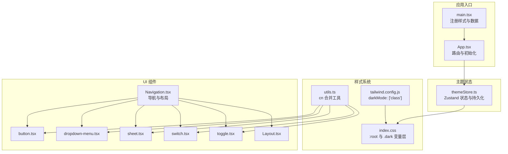
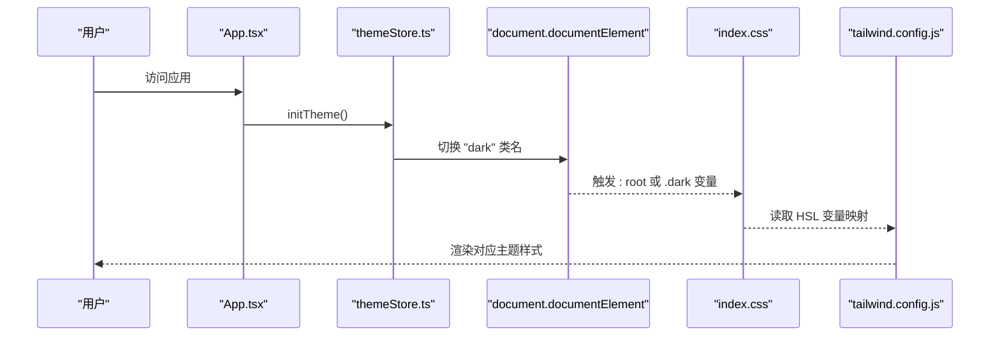
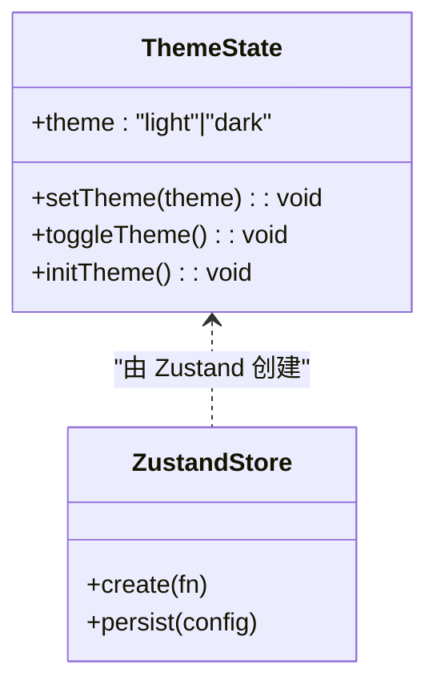
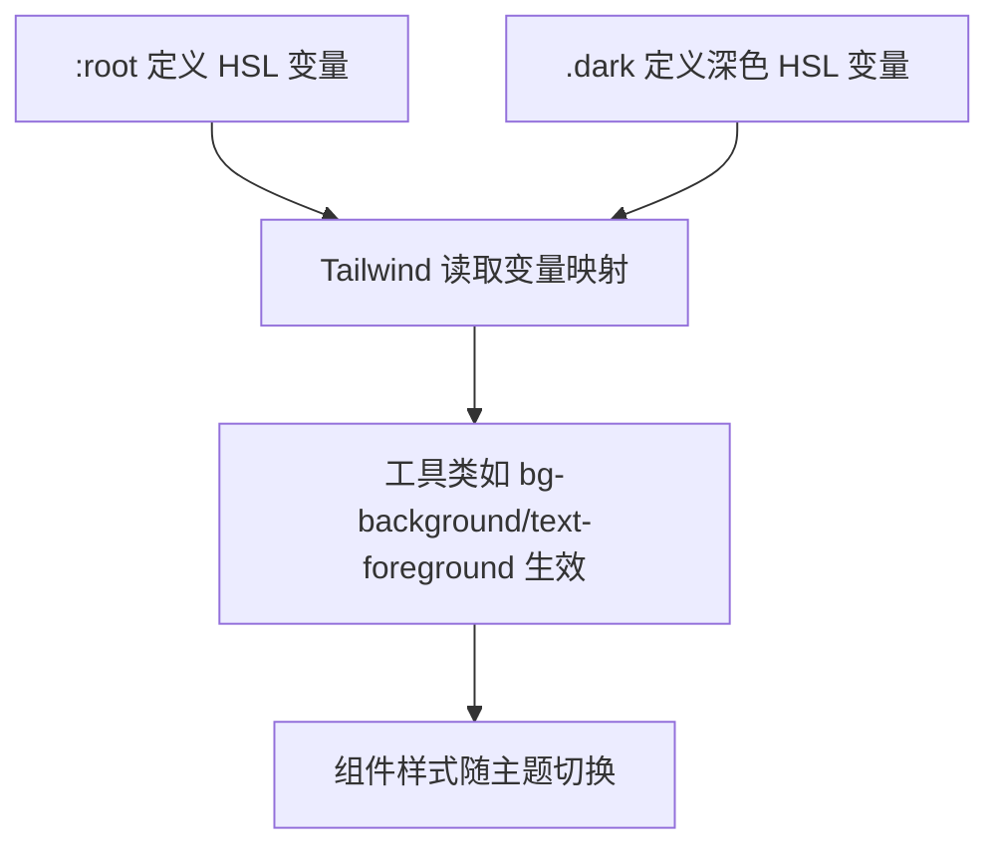
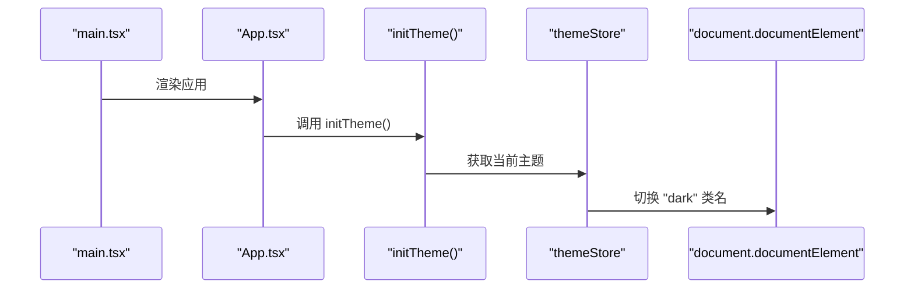
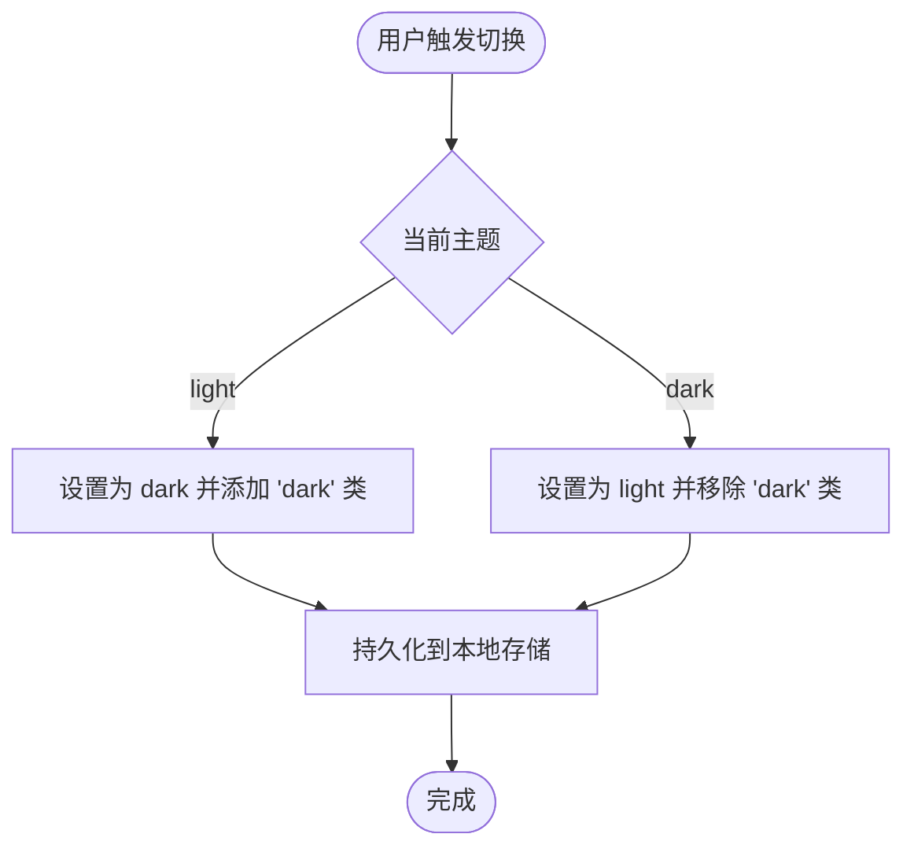
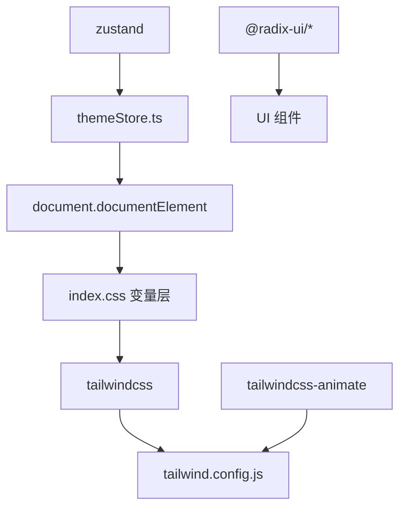

# 主题系统

<cite>
**本文档引用的文件**
- [themeStore.ts](file://src/stores/themeStore.ts)
- [tailwind.config.js](file://tailwind.config.js)
- [index.css](file://src/index.css)
- [App.css](file://src/App.css)
- [App.tsx](file://src/App.tsx)
- [main.tsx](file://src/main.tsx)
- [Navigation.tsx](file://src/components/layout/Navigation.tsx)
- [button.tsx](file://src/components/ui/button.tsx)
- [dropdown-menu.tsx](file://src/components/ui/dropdown-menu.tsx)
- [sheet.tsx](file://src/components/ui/sheet.tsx)
- [switch.tsx](file://src/components/ui/switch.tsx)
- [toggle.tsx](file://src/components/ui/toggle.tsx)
- [Layout.tsx](file://src/components/Layout.tsx)
- [utils.ts](file://src/lib/utils.ts)
- [package.json](file://package.json)
</cite>

## 目录
1. [简介](#简介)
2. [项目结构](#项目结构)
3. [核心组件](#核心组件)
4. [架构总览](#架构总览)
5. [详细组件分析](#详细组件分析)
6. [依赖分析](#依赖分析)
7. [性能考虑](#性能考虑)
8. [故障排除指南](#故障排除指南)
9. [结论](#结论)
10. [附录](#附录)

## 简介
本主题系统基于 Tailwind CSS 的 HSL 变量与类名驱动的深色/浅色模式切换，并通过 Zustand 管理主题状态，结合持久化存储实现用户偏好的本地保存。系统采用 CSS 自定义属性作为颜色语义化载体，配合 Tailwind 的 `darkMode: ['class']` 机制，在根元素上切换 `.dark` 类名以驱动样式变量的切换。同时，主题状态初始化在应用启动阶段执行，确保页面渲染即具备正确的主题外观。

## 项目结构
主题系统的关键文件分布如下：
- 状态管理：src/stores/themeStore.ts
- 样式变量与主题层：src/index.css
- Tailwind 配置：tailwind.config.js
- 应用入口与初始化：src/main.tsx、src/App.tsx
- 导航与 UI 组件：src/components/layout/Navigation.tsx、src/components/ui/*.tsx
- 工具函数：src/lib/utils.ts
- 依赖声明：package.json



**图表来源**
- [main.tsx:1-19](file://src/main.tsx#L1-L19)
- [App.tsx:1-214](file://src/App.tsx#L1-L214)
- [themeStore.ts:1-37](file://src/stores/themeStore.ts#L1-L37)
- [index.css:1-78](file://src/index.css#L1-L78)
- [tailwind.config.js:1-52](file://tailwind.config.js#L1-L52)
- [utils.ts:1-7](file://src/lib/utils.ts#L1-L7)
- [Navigation.tsx:1-719](file://src/components/layout/Navigation.tsx#L1-L719)
- [button.tsx:1-63](file://src/components/ui/button.tsx#L1-L63)
- [dropdown-menu.tsx:1-256](file://src/components/ui/dropdown-menu.tsx#L1-L256)
- [sheet.tsx:1-138](file://src/components/ui/sheet.tsx#L1-L138)
- [switch.tsx:1-31](file://src/components/ui/switch.tsx#L1-L31)
- [toggle.tsx:1-45](file://src/components/ui/toggle.tsx#L1-L45)
- [Layout.tsx:1-53](file://src/components/Layout.tsx#L1-L53)

**章节来源**
- [main.tsx:1-19](file://src/main.tsx#L1-L19)
- [App.tsx:1-214](file://src/App.tsx#L1-L214)
- [themeStore.ts:1-37](file://src/stores/themeStore.ts#L1-L37)
- [index.css:1-78](file://src/index.css#L1-L78)
- [tailwind.config.js:1-52](file://tailwind.config.js#L1-L52)
- [utils.ts:1-7](file://src/lib/utils.ts#L1-L7)
- [Navigation.tsx:1-719](file://src/components/layout/Navigation.tsx#L1-L719)
- [button.tsx:1-63](file://src/components/ui/button.tsx#L1-L63)
- [dropdown-menu.tsx:1-256](file://src/components/ui/dropdown-menu.tsx#L1-L256)
- [sheet.tsx:1-138](file://src/components/ui/sheet.tsx#L1-L138)
- [switch.tsx:1-31](file://src/components/ui/switch.tsx#L1-L31)
- [toggle.tsx:1-45](file://src/components/ui/toggle.tsx#L1-L45)
- [Layout.tsx:1-53](file://src/components/Layout.tsx#L1-L53)

## 核心组件
- 主题状态存储（Zustand）
  - 提供主题状态、设置主题、切换主题、初始化主题的方法
  - 使用持久化中间件将主题偏好保存到本地存储
- 样式变量层（CSS 层）
  - 在 `:root` 和 `.dark` 中定义 HSL 变量，作为语义化颜色源
  - 通过 `@layer base` 将变量注入到基础层，确保全局可用
- Tailwind 配置
  - 开启 `darkMode: ['class']`，使 Tailwind 支持基于类名的深色模式
  - 扩展颜色映射为 HSL 变量，统一风格变量来源
- 应用初始化
  - 在应用启动时调用主题初始化，确保 DOM 根元素具备正确的类名
- UI 组件
  - 大量使用 Tailwind 工具类，依赖语义化颜色变量实现主题一致的视觉效果
  - 通过 `cn` 工具合并类名，保证组件在不同主题下的表现稳定

**章节来源**
- [themeStore.ts:1-37](file://src/stores/themeStore.ts#L1-L37)
- [index.css:1-78](file://src/index.css#L1-L78)
- [tailwind.config.js:1-52](file://tailwind.config.js#L1-L52)
- [App.tsx:1-214](file://src/App.tsx#L1-L214)
- [utils.ts:1-7](file://src/lib/utils.ts#L1-L7)

## 架构总览
主题系统采用“状态驱动样式”的架构：Zustand 管理主题状态，通过切换根元素的 `.dark` 类名，驱动 Tailwind 读取对应的 HSL 变量，从而实现全局样式的即时切换。



**图表来源**
- [App.tsx:69-75](file://src/App.tsx#L69-L75)
- [themeStore.ts:26-30](file://src/stores/themeStore.ts#L26-L30)
- [index.css:5-46](file://src/index.css#L5-L46)
- [tailwind.config.js:4-51](file://tailwind.config.js#L4-L51)

**章节来源**
- [App.tsx:69-75](file://src/App.tsx#L69-L75)
- [themeStore.ts:13-34](file://src/stores/themeStore.ts#L13-L34)
- [index.css:5-46](file://src/index.css#L5-L46)
- [tailwind.config.js:4-51](file://tailwind.config.js#L4-L51)

## 详细组件分析

### 主题状态存储（Zustand）
- 状态结构
  - theme: 'light' | 'dark'
  - setTheme(theme): 设置指定主题并更新根元素类名
  - toggleTheme(): 在 light/dark 之间切换并更新根元素类名
  - initTheme(): 初始化主题，确保根元素类名与当前状态一致
- 持久化策略
  - 使用 persist 中间件，将主题偏好保存到本地存储，键名为 'xingyao-theme'



**图表来源**
- [themeStore.ts:6-11](file://src/stores/themeStore.ts#L6-L11)
- [themeStore.ts:13-34](file://src/stores/themeStore.ts#L13-L34)

**章节来源**
- [themeStore.ts:1-37](file://src/stores/themeStore.ts#L1-L37)

### 样式变量与颜色系统
- 变量定义
  - 在 `:root` 中定义一组 HSL 变量，覆盖背景、前景、卡片、输入框、环形边框、主要/次要/破坏性/强调/静音等语义色
  - 在 `.dark` 中为深色模式提供对应的 HSL 变量值
- Tailwind 集成
  - tailwind.config.js 将颜色映射到 HSL 变量，使工具类如 `bg-background`、`text-foreground`、`border-border` 等自动跟随变量
- 自定义样式
  - App.css 中大量使用 `var(--*)` 变量，确保自定义组件与主题系统保持一致



**图表来源**
- [index.css:5-46](file://src/index.css#L5-L46)
- [tailwind.config.js:10-48](file://tailwind.config.js#L10-L48)
- [App.css:1-185](file://src/App.css#L1-L185)

**章节来源**
- [index.css:1-78](file://src/index.css#L1-L78)
- [tailwind.config.js:1-52](file://tailwind.config.js#L1-L52)
- [App.css:1-185](file://src/App.css#L1-L185)

### 应用初始化与主题注入
- 初始化流程
  - main.tsx 引入全局样式
  - App.tsx 在首次挂载时调用 initTheme，确保根元素具备正确的类名
- 根元素类名
  - themeStore 在 setTheme/toggleTheme/initTheme 中切换 `document.documentElement.classList` 上的 'dark' 类



**图表来源**
- [main.tsx:1-19](file://src/main.tsx#L1-L19)
- [App.tsx:69-75](file://src/App.tsx#L69-L75)
- [themeStore.ts:26-30](file://src/stores/themeStore.ts#L26-L30)

**章节来源**
- [main.tsx:1-19](file://src/main.tsx#L1-L19)
- [App.tsx:69-75](file://src/App.tsx#L69-L75)
- [themeStore.ts:26-30](file://src/stores/themeStore.ts#L26-L30)

### UI 组件与主题集成
- 组件风格
  - 大量使用工具类，如 `bg-background`、`text-foreground`、`border-border`、`hover:bg-muted` 等
  - 通过 `cn` 工具合并类名，确保组件在不同主题下的一致表现
- 典型组件
  - Button：基于语义化颜色变量实现默认/次级/破坏性/链接等变体
  - DropdownMenu：使用 `bg-popover`、`text-popover-foreground` 等变量
  - Sheet：使用 `bg-background`、`text-foreground` 等变量
  - Switch/Toggle：使用 `bg-input`、`bg-primary` 等变量

```mermaid
classDiagram
class Button {
+使用 "bg-primary/text-primary-foreground" 等语义类
}
class DropdownMenu {
+使用 "bg-popover/text-popover-foreground" 等语义类
}
class Sheet {
+使用 "bg-background/text-foreground" 等语义类
}
class Switch {
+使用 "bg-input/data-[state=checked] : bg-primary" 等语义类
}
class Toggle {
+使用 "bg-transparent/data-[state=on] : bg-accent" 等语义类
}
Button --> Utils["cn 合并类名"]
DropdownMenu --> Utils
Sheet --> Utils
Switch --> Utils
Toggle --> Utils
```

**图表来源**
- [button.tsx:7-37](file://src/components/ui/button.tsx#L7-L37)
- [dropdown-menu.tsx:32-49](file://src/components/ui/dropdown-menu.tsx#L32-L49)
- [sheet.tsx:45-79](file://src/components/ui/sheet.tsx#L45-L79)
- [switch.tsx:8-29](file://src/components/ui/switch.tsx#L8-L29)
- [toggle.tsx:29-43](file://src/components/ui/toggle.tsx#L29-L43)
- [utils.ts:4-6](file://src/lib/utils.ts#L4-L6)

**章节来源**
- [button.tsx:1-63](file://src/components/ui/button.tsx#L1-L63)
- [dropdown-menu.tsx:1-256](file://src/components/ui/dropdown-menu.tsx#L1-L256)
- [sheet.tsx:1-138](file://src/components/ui/sheet.tsx#L1-L138)
- [switch.tsx:1-31](file://src/components/ui/switch.tsx#L1-L31)
- [toggle.tsx:1-45](file://src/components/ui/toggle.tsx#L1-L45)
- [utils.ts:1-7](file://src/lib/utils.ts#L1-L7)

### 主题切换逻辑与用户偏好
- 切换逻辑
  - setTheme：直接设置主题并同步根元素类名
  - toggleTheme：在 light/dark 之间翻转并同步根元素类名
  - initTheme：根据当前状态确保根元素类名正确
- 用户偏好
  - 通过 persist 中间件将主题偏好保存到本地存储，键名为 'xingyao-theme'
- 自动检测
  - 当前实现未包含系统主题或时间的自动检测逻辑；如需扩展，可在 initTheme 中加入媒体查询或系统偏好检测



**图表来源**
- [themeStore.ts:17-30](file://src/stores/themeStore.ts#L17-L30)

**章节来源**
- [themeStore.ts:1-37](file://src/stores/themeStore.ts#L1-L37)

### 主题定制选项与颜色语义化
- 语义化颜色
  - 背景/前景/卡片/输入/环形边框/主要/次要/破坏性/强调/静音等
  - 通过 HSL 变量实现明暗两套配色，满足深色/浅色模式
- 定制建议
  - 新增语义色时，优先在 `:root` 与 `.dark` 中定义变量，避免硬编码颜色值
  - 在 Tailwind 配置中扩展颜色映射，确保工具类可用
  - 组件中统一使用语义类，减少主题切换时的维护成本

**章节来源**
- [index.css:5-46](file://src/index.css#L5-L46)
- [tailwind.config.js:10-48](file://tailwind.config.js#L10-L48)

### 可访问性考虑
- 对比度与可读性
  - 深色模式下，前景与背景对比度应满足可访问性标准
  - 使用语义化颜色变量，确保在不同模式下均符合对比度要求
- 交互反馈
  - 悬停、焦点、禁用状态的颜色应清晰可辨
  - 组件中已使用 `focus-visible:ring` 等机制增强键盘可达性

**章节来源**
- [index.css:52-56](file://src/index.css#L52-L56)
- [button.tsx:8-37](file://src/components/ui/button.tsx#L8-L37)

### 主题组件使用示例与最佳实践
- 使用示例
  - 在任意组件中使用语义类如 `bg-background text-foreground border-border`
  - 通过 cn 工具合并类名，确保主题切换时的样式一致性
- 最佳实践
  - 避免直接使用十六进制颜色值，统一使用语义类
  - 新增组件时，先在 `index.css` 中定义必要的变量，再在 Tailwind 中映射
  - 保持 UI 组件与主题变量的解耦，便于主题扩展与维护

**章节来源**
- [utils.ts:1-7](file://src/lib/utils.ts#L1-L7)
- [button.tsx:39-60](file://src/components/ui/button.tsx#L39-L60)
- [index.css:5-46](file://src/index.css#L5-L46)

### 响应式主题适配与动态切换
- 响应式适配
  - 通过 Tailwind 的断点系统与语义类，确保在不同屏幕尺寸下主题一致
- 动态切换
  - 通过切换根元素的 'dark' 类名，实现即时主题切换
  - 组件样式自动跟随变量更新，无需重新渲染

**章节来源**
- [tailwind.config.js:4-51](file://tailwind.config.js#L4-L51)
- [Navigation.tsx:369-547](file://src/components/layout/Navigation.tsx#L369-L547)

## 依赖分析
- 核心依赖
  - zustand：状态管理
  - tailwindcss：原子化样式与 darkMode 支持
  - tailwindcss-animate：动画插件
  - radix-ui：UI 组件基础库
- 主题相关
  - 通过 zustand 的 persist 中间件实现主题偏好持久化
  - 通过 Tailwind 的 darkMode: ['class'] 与 HSL 变量实现主题切换



**图表来源**
- [package.json:14-66](file://package.json#L14-L66)
- [themeStore.ts:1-2](file://src/stores/themeStore.ts#L1-L2)
- [tailwind.config.js:1-52](file://tailwind.config.js#L1-L52)
- [index.css:1-78](file://src/index.css#L1-L78)

**章节来源**
- [package.json:14-66](file://package.json#L14-L66)
- [themeStore.ts:1-2](file://src/stores/themeStore.ts#L1-L2)
- [tailwind.config.js:1-52](file://tailwind.config.js#L1-L52)
- [index.css:1-78](file://src/index.css#L1-L78)

## 性能考虑
- 状态最小化
  - 主题状态仅包含一个字符串字段，开销极小
- 样式切换成本低
  - 通过切换根元素类名驱动变量切换，避免重排与重绘
- 组件渲染
  - UI 组件使用工具类，样式计算在构建时完成，运行时开销低
- 持久化策略
  - 仅保存主题偏好，数据量小，读写开销低

## 故障排除指南
- 切换后样式未更新
  - 检查是否正确调用 initTheme 或 setTheme/toggleTheme
  - 确认根元素是否包含 'dark' 类
- 深色模式不生效
  - 检查 tailwind.config.js 是否启用 darkMode: ['class']
  - 确认 index.css 中 :root 与 .dark 的变量定义是否存在
- 组件颜色异常
  - 检查组件是否使用了语义类而非硬编码颜色
  - 确认 cn 工具是否正确合并类名

**章节来源**
- [themeStore.ts:17-30](file://src/stores/themeStore.ts#L17-L30)
- [tailwind.config.js:4-5](file://tailwind.config.js#L4-L5)
- [index.css:5-46](file://src/index.css#L5-L46)
- [utils.ts:4-6](file://src/lib/utils.ts#L4-L6)

## 结论
本主题系统通过 Zustand 管理主题状态，借助 Tailwind 的 darkMode 机制与 HSL 变量层，实现了简洁高效的深色/浅色模式切换。系统以语义化颜色为核心，确保组件在不同主题下的一致表现；通过持久化存储保存用户偏好，提升用户体验。整体架构解耦良好，易于扩展与维护。

## 附录
- 术语
  - 语义化颜色：通过语义类（如 bg-background）而非具体颜色值定义样式
  - HSL 变量：以 HSL 表示的颜色变量，便于在浅色/深色模式间切换
- 扩展建议
  - 添加系统主题或时间自动检测逻辑
  - 支持更多主题变体（如高对比度）
  - 提供主题编辑器或变量覆盖接口