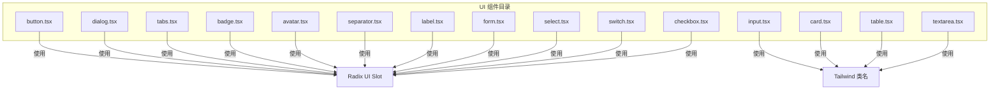
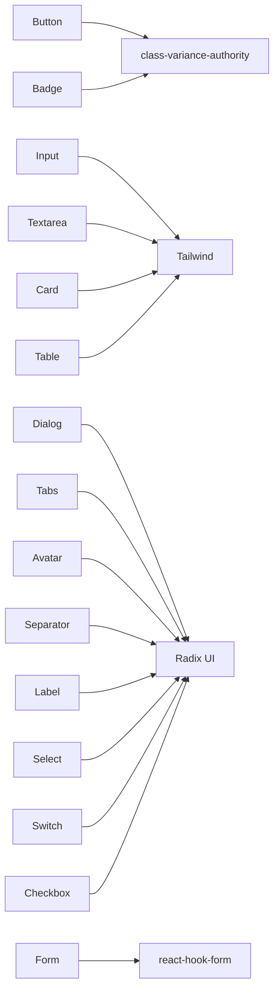

# 基础UI组件

<cite>
**本文引用的文件**
- [button.tsx](file://src/components/ui/button.tsx)
- [input.tsx](file://src/components/ui/input.tsx)
- [card.tsx](file://src/components/ui/card.tsx)
- [dialog.tsx](file://src/components/ui/dialog.tsx)
- [table.tsx](file://src/components/ui/table.tsx)
- [tabs.tsx](file://src/components/ui/tabs.tsx)
- [badge.tsx](file://src/components/ui/badge.tsx)
- [avatar.tsx](file://src/components/ui/avatar.tsx)
- [separator.tsx](file://src/components/ui/separator.tsx)
- [label.tsx](file://src/components/ui/label.tsx)
- [form.tsx](file://src/components/ui/form.tsx)
- [select.tsx](file://src/components/ui/select.tsx)
- [textarea.tsx](file://src/components/ui/textarea.tsx)
- [switch.tsx](file://src/components/ui/switch.tsx)
- [checkbox.tsx](file://src/components/ui/checkbox.tsx)
</cite>

## 目录
1. [简介](#简介)
2. [项目结构](#项目结构)
3. [核心组件](#核心组件)
4. [架构总览](#架构总览)
5. [详细组件分析](#详细组件分析)
6. [依赖分析](#依赖分析)
7. [性能考虑](#性能考虑)
8. [故障排查指南](#故障排查指南)
9. [结论](#结论)
10. [附录](#附录)

## 简介
本文件系统化梳理星耀平台的基础UI组件库，覆盖按钮、输入框、卡片、对话框、表格、标签页、徽章、头像、分割线、标签、表单、选择器、文本域、开关、复选框等核心组件。文档聚焦于组件的视觉外观、行为与交互模式，完整说明属性（props）、事件、可组合性与自定义选项；提供使用场景与集成建议；并给出响应式设计、无障碍（a11y）合规要点、状态管理与动画效果、样式自定义与主题支持、跨浏览器兼容性与性能优化策略。

## 项目结构
基础UI组件集中位于 src/components/ui 目录，采用“按功能分文件”的组织方式，便于按需引入与维护。组件普遍以 Radix UI 为交互与无障碍基石，并结合 shadcn/ui 的风格化约定与 Tailwind 类名体系，辅以 class-variance-authority 实现变体（variants）与尺寸（sizes）的统一管理。

图表来源
- [button.tsx:1-63](file://src/components/ui/button.tsx#L1-L63)
- [input.tsx:1-22](file://src/components/ui/input.tsx#L1-L22)
- [card.tsx:1-93](file://src/components/ui/card.tsx#L1-L93)
- [dialog.tsx:1-142](file://src/components/ui/dialog.tsx#L1-L142)
- [table.tsx:1-115](file://src/components/ui/table.tsx#L1-L115)
- [tabs.tsx:1-67](file://src/components/ui/tabs.tsx#L1-L67)
- [badge.tsx:1-47](file://src/components/ui/badge.tsx#L1-L47)
- [avatar.tsx:1-52](file://src/components/ui/avatar.tsx#L1-L52)
- [separator.tsx:1-29](file://src/components/ui/separator.tsx#L1-L29)
- [label.tsx:1-25](file://src/components/ui/label.tsx#L1-L25)
- [form.tsx:1-168](file://src/components/ui/form.tsx#L1-L168)
- [select.tsx:1-189](file://src/components/ui/select.tsx#L1-L189)
- [textarea.tsx:1-19](file://src/components/ui/textarea.tsx#L1-L19)
- [switch.tsx:1-32](file://src/components/ui/switch.tsx#L1-L32)
- [checkbox.tsx:1-33](file://src/components/ui/checkbox.tsx#L1-L33)

章节来源
- [button.tsx:1-63](file://src/components/ui/button.tsx#L1-L63)
- [input.tsx:1-22](file://src/components/ui/input.tsx#L1-L22)
- [card.tsx:1-93](file://src/components/ui/card.tsx#L1-L93)
- [dialog.tsx:1-142](file://src/components/ui/dialog.tsx#L1-L142)
- [table.tsx:1-115](file://src/components/ui/table.tsx#L1-L115)
- [tabs.tsx:1-67](file://src/components/ui/tabs.tsx#L1-L67)
- [badge.tsx:1-47](file://src/components/ui/badge.tsx#L1-L47)
- [avatar.tsx:1-52](file://src/components/ui/avatar.tsx#L1-L52)
- [separator.tsx:1-29](file://src/components/ui/separator.tsx#L1-L29)
- [label.tsx:1-25](file://src/components/ui/label.tsx#L1-L25)
- [form.tsx:1-168](file://src/components/ui/form.tsx#L1-L168)
- [select.tsx:1-189](file://src/components/ui/select.tsx#L1-L189)
- [textarea.tsx:1-19](file://src/components/ui/textarea.tsx#L1-L19)
- [switch.tsx:1-32](file://src/components/ui/switch.tsx#L1-L32)
- [checkbox.tsx:1-33](file://src/components/ui/checkbox.tsx#L1-L33)

## 核心组件
本节概览所有基础UI组件的职责与典型用法，帮助快速定位与选用。

- 按钮 Button：提供多种视觉变体与尺寸，支持作为容器（asChild）渲染，具备焦点环、禁用态与错误态的视觉反馈。
- 输入 Input：通用文本输入框，内置焦点环、禁用与错误态样式，适配文件输入与占位符。
- 卡片 Card：由头部、标题、描述、内容、操作区、底部等子组件构成，支持网格布局与边框/阴影配置。
- 对话框 Dialog：基于 Radix UI 的模态层，提供遮罩、内容区、标题、描述、关闭按钮与动画过渡。
- 表格 Table：容器 + 表头/体/脚 + 行/单元格 + 标题，支持悬停与选中态、滚动容器与响应式宽度。
- 标签页 Tabs：标签列表与触发器、内容区，支持激活态与禁用态、键盘导航与动画。
- 徽章 Badge：强调性标签，支持变体与作为容器渲染。
- 头像 Avatar：头像根节点、图片与回退占位，支持溢出与占位样式。
- 分割线 Separator：水平/垂直方向的分隔线，支持装饰性与方向控制。
- 标签 Label：与表单控件配对使用，支持禁用态与错误态联动。
- 表单 Form：基于 react-hook-form 的表单上下文，提供字段包装、标签、描述、消息与无障碍属性绑定。
- 选择器 Select：下拉选择，支持组、标签、项、滚动按钮、图标与弹出层动画。
- 文本域 Textarea：多行文本输入，具备与输入框一致的焦点与错误态样式。
- 开关 Switch：二态切换控件，支持动画与焦点环。
- 复选框 Checkbox：多用于列表/表单，支持选中态与指示图标。

章节来源
- [button.tsx:39-60](file://src/components/ui/button.tsx#L39-L60)
- [input.tsx:5-19](file://src/components/ui/input.tsx#L5-L19)
- [card.tsx:5-82](file://src/components/ui/card.tsx#L5-L82)
- [dialog.tsx:7-79](file://src/components/ui/dialog.tsx#L7-L79)
- [table.tsx:5-103](file://src/components/ui/table.tsx#L5-L103)
- [tabs.tsx:8-64](file://src/components/ui/tabs.tsx#L8-L64)
- [badge.tsx:28-44](file://src/components/ui/badge.tsx#L28-L44)
- [avatar.tsx:6-49](file://src/components/ui/avatar.tsx#L6-L49)
- [separator.tsx:8-26](file://src/components/ui/separator.tsx#L8-L26)
- [label.tsx:8-21](file://src/components/ui/label.tsx#L8-L21)
- [form.tsx:19-167](file://src/components/ui/form.tsx#L19-L167)
- [select.tsx:7-187](file://src/components/ui/select.tsx#L7-L187)
- [textarea.tsx:5-15](file://src/components/ui/textarea.tsx#L5-L15)
- [switch.tsx:8-29](file://src/components/ui/switch.tsx#L8-L29)
- [checkbox.tsx:9-30](file://src/components/ui/checkbox.tsx#L9-L30)

## 架构总览
组件架构遵循“最小公共父类 + 变体/尺寸 + Radix 交互 + Tailwind 样式”的模式。组件通过 Slot 容器实现 asChild 组合能力；通过 class-variance-authority 提供变体与尺寸；通过 cn 合并类名与主题变量；通过 Radix UI 提供无障碍与状态同步。

```mermaid
classDiagram
class Button {
+variant : "default|destructive|outline|secondary|ghost|link"
+size : "default|sm|lg|icon|icon-sm|icon-lg"
+asChild : boolean
+className : string
}
class Input {
+type : string
+className : string
}
class Card {
+CardHeader
+CardTitle
+CardDescription
+CardContent
+CardAction
+CardFooter
}
class Dialog {
+DialogTrigger
+DialogContent
+DialogTitle
+DialogDescription
+DialogFooter
+DialogOverlay
}
class Table {
+TableHeader
+TableBody
+TableFooter
+TableRow
+TableHead
+TableCell
+TableCaption
}
class Tabs {
+TabsList
+TabsTrigger
+TabsContent
}
class Badge {
+variant : "default|secondary|destructive|outline"
+asChild : boolean
}
class Avatar {
+AvatarImage
+AvatarFallback
}
class Separator
class Label
class Form {
+Form
+FormField
+FormItem
+FormLabel
+FormControl
+FormDescription
+FormMessage
}
class Select {
+SelectTrigger
+SelectContent
+SelectItem
+SelectLabel
+SelectSeparator
+SelectScrollUpButton
+SelectScrollDownButton
}
class Textarea
class Switch
class Checkbox
Button --> "使用" Radix_Slot
Badge --> "使用" Radix_Slot
Dialog --> "使用" Radix_UI
Tabs --> "使用" Radix_UI
Select --> "使用" Radix_UI
Avatar --> "使用" Radix_UI
Separator --> "使用" Radix_UI
Label --> "使用" Radix_UI
Form --> "使用" Radix_UI
Switch --> "使用" Radix_UI
Checkbox --> "使用" Radix_UI
```

图表来源
- [button.tsx:1-63](file://src/components/ui/button.tsx#L1-L63)
- [badge.tsx:1-47](file://src/components/ui/badge.tsx#L1-L47)
- [card.tsx:1-93](file://src/components/ui/card.tsx#L1-L93)
- [dialog.tsx:1-142](file://src/components/ui/dialog.tsx#L1-L142)
- [table.tsx:1-115](file://src/components/ui/table.tsx#L1-L115)
- [tabs.tsx:1-67](file://src/components/ui/tabs.tsx#L1-L67)
- [avatar.tsx:1-52](file://src/components/ui/avatar.tsx#L1-L52)
- [separator.tsx:1-29](file://src/components/ui/separator.tsx#L1-L29)
- [label.tsx:1-25](file://src/components/ui/label.tsx#L1-L25)
- [form.tsx:1-168](file://src/components/ui/form.tsx#L1-L168)
- [select.tsx:1-189](file://src/components/ui/select.tsx#L1-L189)
- [textarea.tsx:1-19](file://src/components/ui/textarea.tsx#L1-L19)
- [switch.tsx:1-32](file://src/components/ui/switch.tsx#L1-L32)
- [checkbox.tsx:1-33](file://src/components/ui/checkbox.tsx#L1-L33)

## 详细组件分析

### 按钮 Button
- 视觉与行为
  - 支持默认、破坏性、描边、次级、幽灵、链接六种变体；默认与多种尺寸；禁用态与错误态视觉反馈；焦点环与可访问性属性。
  - 支持 asChild 将渲染节点替换为 Slot，便于与路由或链接组合。
- 属性（props）
  - className: 字符串
  - variant: "default" | "destructive" | "outline" | "secondary" | "ghost" | "link"
  - size: "default" | "sm" | "lg" | "icon" | "icon-sm" | "icon-lg"
  - asChild: boolean
  - 其余继承自原生 button
- 事件与插槽
  - 事件：onClick 等原生事件透传
  - 插槽：通过 asChild 使用 Radix Slot 容器
- 自定义与主题
  - 通过变体与尺寸类名组合实现；支持暗色主题下的边框/背景/焦点环差异
- 使用示例与场景
  - 主要操作（提交、确认）、次要操作（取消、返回）、危险操作（删除、移除）
- 动画与状态
  - 过渡与焦点环；禁用态指针事件关闭
- 响应式与无障碍
  - 焦点可见性、错误态 aria-invalid、屏幕阅读器友好

章节来源
- [button.tsx:7-37](file://src/components/ui/button.tsx#L7-L37)
- [button.tsx:39-60](file://src/components/ui/button.tsx#L39-L60)

### 输入 Input
- 视觉与行为
  - 通用文本输入，支持文件输入、占位符、禁用、错误态；焦点时显示 ring 边框与环形光晕
- 属性（props）
  - className: 字符串
  - type: 字符串（如 text、password、email 等）
- 事件与插槽
  - 事件：onChange、onFocus、onBlur 等原生事件透传
  - 插槽：无
- 自定义与主题
  - 通过 Tailwind 类名叠加；暗色主题下背景与边框差异化
- 使用示例与场景
  - 登录、搜索、表单字段
- 动画与状态
  - 焦点过渡与错误态 ring
- 响应式与无障碍
  - 语义化输入、禁用态不可交互

章节来源
- [input.tsx:5-19](file://src/components/ui/input.tsx#L5-L19)

### 卡片 Card
- 视觉与行为
  - 卡片容器，内部提供头部、标题、描述、内容、操作区、底部等子组件；支持网格布局与边框/阴影
- 属性（props）
  - className: 字符串
- 子组件
  - CardHeader、CardTitle、CardDescription、CardContent、CardAction、CardFooter
- 事件与插槽
  - 事件：透传
  - 插槽：无
- 自定义与主题
  - 通过 Tailwind 类名覆盖；暗色主题下背景与边框差异化
- 使用示例与场景
  - 列表卡片、详情卡片、设置面板
- 动画与状态
  - 无特定动画
- 响应式与无障碍
  - 语义化结构，配合标题与描述提升可读性

章节来源
- [card.tsx:5-82](file://src/components/ui/card.tsx#L5-L82)

### 对话框 Dialog
- 视觉与行为
  - 基于 Radix UI 的模态层，遮罩与内容区具备进入/退出动画；支持关闭按钮与居中布局
- 属性（props）
  - Root/Trigger/Portal/Close/Overlay/Content/Title/Description/Header/Footer
  - Content 支持 showCloseButton 控制是否渲染关闭按钮
- 事件与插槽
  - 事件：透传；支持 onOpenChange 等回调
  - 插槽：无
- 自定义与主题
  - 内容区与遮罩类名可叠加；暗色主题下背景与对比度调整
- 使用示例与场景
  - 确认对话框、表单弹窗、提示信息
- 动画与状态
  - 打开/关闭动画：fade/zoom；Portal 渲染至根节点
- 响应式与无障碍
  - 键盘可聚焦、ESC 关闭、焦点锁定、隐藏背景滚动

章节来源
- [dialog.tsx:7-141](file://src/components/ui/dialog.tsx#L7-L141)

### 表格 Table
- 视觉与行为
  - 表格容器支持横向滚动；行悬停与选中态；表头/体/脚分层；单元格支持复选框对齐
- 属性（props）
  - Table/TableHeader/TableBody/TableFooter/TableRow/TableHead/TableCell/TableCaption
- 事件与插槽
  - 事件：透传
  - 插槽：无
- 自定义与主题
  - 通过 Tailwind 类名覆盖；暗色主题下边框与背景差异化
- 使用示例与场景
  - 数据列表、筛选结果、统计报表
- 动画与状态
  - 无特定动画
- 响应式与无障碍
  - 横向滚动容器；语义化表头与标题

章节来源
- [table.tsx:5-103](file://src/components/ui/table.tsx#L5-L103)

### 标签页 Tabs
- 视觉与行为
  - 标签列表与触发器、内容区；激活态与禁用态；支持键盘导航与动画
- 属性（props）
  - Tabs/TabsList/TabsTrigger/TabsContent
  - 触发器支持禁用态与激活态样式
- 事件与插槽
  - 事件：透传
  - 插槽：无
- 自定义与主题
  - 通过 Tailwind 类名覆盖；暗色主题下边框与背景差异化
- 使用示例与场景
  - 设置面板、详情页分栏、筛选标签
- 动画与状态
  - 动画：进入/退出 fade/zoom
- 响应式与无障碍
  - 键盘导航、ARIA 标签与面板关联

章节来源
- [tabs.tsx:8-64](file://src/components/ui/tabs.tsx#L8-L64)

### 徽章 Badge
- 视觉与行为
  - 强调性标签，支持默认、次级、破坏性、描边四种变体；可作为容器渲染
- 属性（props）
  - className: 字符串
  - variant: "default" | "secondary" | "destructive" | "outline"
  - asChild: boolean
- 事件与插槽
  - 事件：透传
  - 插槽：Slot 容器
- 自定义与主题
  - 通过变体类名与焦点环控制；暗色主题下对比度调整
- 使用示例与场景
  - 状态标签、新功能标识、计数徽标
- 动画与状态
  - 过渡与焦点环
- 响应式与无障碍
  - 语义化标签，适合与图标组合

章节来源
- [badge.tsx:28-44](file://src/components/ui/badge.tsx#L28-L44)

### 头像 Avatar
- 视觉与行为
  - 头像根节点、图片与回退占位；支持溢出与占位样式
- 属性（props）
  - Avatar/AvatarImage/AvatarFallback
- 事件与插槽
  - 事件：透传
  - 插槽：无
- 自定义与主题
  - 通过 Tailwind 类名覆盖；暗色主题下占位背景差异化
- 使用示例与场景
  - 用户头像、团队成员、占位图
- 动画与状态
  - 无特定动画
- 响应式与无障碍
  - 图片降级到占位，确保可读性

章节来源
- [avatar.tsx:6-49](file://src/components/ui/avatar.tsx#L6-L49)

### 分割线 Separator
- 视觉与行为
  - 水平/垂直分割线；支持装饰性与方向控制
- 属性（props）
  - orientation: "horizontal" | "vertical"
  - decorative: boolean
- 事件与插槽
  - 事件：透传
  - 插槽：无
- 自定义与主题
  - 通过 Tailwind 类名覆盖；暗色主题下颜色差异化
- 使用示例与场景
  - 区块分隔、菜单分隔、列表分隔
- 动画与状态
  - 无特定动画
- 响应式与无障碍
  - 语义化分隔，可选装饰性

章节来源
- [separator.tsx:8-26](file://src/components/ui/separator.tsx#L8-L26)

### 标签 Label
- 视觉与行为
  - 与表单控件配对使用；支持禁用态与错误态联动
- 属性（props）
  - className: 字符串
- 事件与插槽
  - 事件：透传
  - 插槽：无
- 自定义与主题
  - 通过 Tailwind 类名覆盖；暗色主题下颜色差异化
- 使用示例与场景
  - 表单字段标题、说明文字
- 动画与状态
  - 无特定动画
- 响应式与无障碍
  - 与控件 ID 关联，提升可访问性

章节来源
- [label.tsx:8-21](file://src/components/ui/label.tsx#L8-L21)

### 表单 Form
- 视觉与行为
  - 基于 react-hook-form 的表单上下文；提供字段包装、标签、描述、消息与无障碍属性绑定
- 属性（props）
  - Form/FormField/FormItem/FormLabel/FormControl/FormDescription/FormMessage
  - useFormField 提供字段状态与 ID 绑定
- 事件与插槽
  - 事件：透传
  - 插槽：Slot 容器（FormControl）
- 自定义与主题
  - 通过 Tailwind 类名覆盖；暗色主题下颜色差异化
- 使用示例与场景
  - 登录表单、注册表单、设置表单
- 动画与状态
  - 无特定动画
- 响应式与无障碍
  - aria-invalid、aria-describedby、ID 关联

章节来源
- [form.tsx:19-167](file://src/components/ui/form.tsx#L19-L167)

### 选择器 Select
- 视觉与行为
  - 下拉选择，支持组、标签、项、滚动按钮、图标与弹出层动画；支持 popper 与 item-aligned 两种定位
- 属性（props）
  - Select/SelectTrigger/SelectContent/SelectItem/SelectLabel/SelectSeparator/SelectScrollUpButton/SelectScrollDownButton
  - Trigger 支持 size: "sm" | "default"
- 事件与插槽
  - 事件：透传
  - 插槽：无
- 自定义与主题
  - 通过 Tailwind 类名覆盖；暗色主题下背景与对比度调整
- 使用示例与场景
  - 下拉筛选、排序、设置项
- 动画与状态
  - 打开/关闭动画：fade/zoom；滚动按钮显隐
- 响应式与无障碍
  - 键盘导航、焦点管理、Portal 渲染

章节来源
- [select.tsx:7-187](file://src/components/ui/select.tsx#L7-L187)

### 文本域 Textarea
- 视觉与行为
  - 多行文本输入，具备与输入框一致的焦点与错误态样式
- 属性（props）
  - className: 字符串
- 事件与插槽
  - 事件：onChange、onFocus、onBlur 等原生事件透传
  - 插槽：无
- 自定义与主题
  - 通过 Tailwind 类名叠加；暗色主题下背景与边框差异化
- 使用示例与场景
  - 评论、描述、备注
- 动画与状态
  - 焦点过渡与错误态 ring
- 响应式与无障碍
  - 语义化输入、禁用态不可交互

章节来源
- [textarea.tsx:5-15](file://src/components/ui/textarea.tsx#L5-L15)

### 开关 Switch
- 视觉与行为
  - 二态切换控件，支持动画与焦点环；根据状态切换背景与拇指位置
- 属性（props）
  - className: 字符串
- 事件与插槽
  - 事件：onChange 等原生事件透传
  - 插槽：无
- 自定义与主题
  - 通过 Tailwind 类名覆盖；暗色主题下背景与对比度调整
- 使用示例与场景
  - 设置项开关、权限控制
- 动画与状态
  - 拇指平滑位移；焦点环
- 响应式与无障碍
  - 键盘可操作、状态可读

章节来源
- [switch.tsx:8-29](file://src/components/ui/switch.tsx#L8-L29)

### 复选框 Checkbox
- 视觉与行为
  - 多用于列表/表单，支持选中态与指示图标；具备焦点环与错误态样式
- 属性（props）
  - className: 字符串
- 事件与插槽
  - 事件：onChange 等原生事件透传
  - 插槽：无
- 自定义与主题
  - 通过 Tailwind 类名覆盖；暗色主题下背景与对比度调整
- 使用示例与场景
  - 条款勾选、批量选择、偏好设置
- 动画与状态
  - 指示图标过渡；焦点环
- 响应式与无障碍
  - 键盘可操作、状态可读

章节来源
- [checkbox.tsx:9-30](file://src/components/ui/checkbox.tsx#L9-L30)

## 依赖分析
- 组件依赖
  - Radix UI：提供无障碍与状态同步（Slot、Dialog、Tabs、Avatar、Separator、Label、Select、Switch、Checkbox）
  - class-variance-authority：统一变体与尺寸类名
  - lucide-react：图标（X、Check、ChevronDown/Up 等）
  - react-hook-form：表单上下文与字段状态
  - Tailwind：类名与主题变量
- 组件耦合
  - 高内聚：每个组件职责单一，子组件与容器清晰
  - 低耦合：通过 Radix Slot 与 Portal 解耦渲染目标
- 潜在循环依赖
  - 未见直接循环依赖；组件间通过上下文与容器组合间接协作

图表来源
- [button.tsx:1-63](file://src/components/ui/button.tsx#L1-L63)
- [badge.tsx:1-47](file://src/components/ui/badge.tsx#L1-L47)
- [input.tsx:1-22](file://src/components/ui/input.tsx#L1-L22)
- [textarea.tsx:1-19](file://src/components/ui/textarea.tsx#L1-L19)
- [card.tsx:1-93](file://src/components/ui/card.tsx#L1-L93)
- [table.tsx:1-115](file://src/components/ui/table.tsx#L1-L115)
- [dialog.tsx:1-142](file://src/components/ui/dialog.tsx#L1-L142)
- [tabs.tsx:1-67](file://src/components/ui/tabs.tsx#L1-L67)
- [avatar.tsx:1-52](file://src/components/ui/avatar.tsx#L1-L52)
- [separator.tsx:1-29](file://src/components/ui/separator.tsx#L1-L29)
- [label.tsx:1-25](file://src/components/ui/label.tsx#L1-L25)
- [form.tsx:1-168](file://src/components/ui/form.tsx#L1-L168)
- [select.tsx:1-189](file://src/components/ui/select.tsx#L1-L189)
- [switch.tsx:1-32](file://src/components/ui/switch.tsx#L1-L32)
- [checkbox.tsx:1-33](file://src/components/ui/checkbox.tsx#L1-L33)

## 性能考虑
- 渲染与动画
  - 对话框与标签页使用轻量动画（fade/zoom），避免复杂滤镜；Select 使用 Portal 减少 DOM 层级
- 样式与主题
  - Tailwind 类名按需拼接，避免重复样式；变体类名集中管理，减少运行时计算
- 交互与可访问性
  - 通过 aria-* 属性与键盘导航降低重排与重绘成本
- 资源与体积
  - 图标按需引入；组件按需加载，避免全量打包

## 故障排查指南
- 焦点环与错误态
  - 若焦点环不生效，检查是否正确引入焦点相关类名与 ring 配置
- 禁用态无效
  - 确认禁用态类名是否被覆盖；禁用态应阻止指针事件
- 错误态未显示
  - 表单组件需通过 useFormField 获取 error 并绑定 aria-invalid 与 aria-describedby
- 对话框无法关闭
  - 检查 DialogTrigger/Close 是否正确绑定；确认 ESC 与点击遮罩事件
- 选择器内容错位
  - 确认 SelectTrigger 的 size 与 SelectContent 的定位参数；必要时使用 popper 定位
- 复选框/开关状态不同步
  - 确认受控属性与 onChange 回调；检查状态更新逻辑

章节来源
- [form.tsx:107-122](file://src/components/ui/form.tsx#L107-L122)
- [dialog.tsx:25-79](file://src/components/ui/dialog.tsx#L25-L79)
- [select.tsx:51-85](file://src/components/ui/select.tsx#L51-L85)
- [checkbox.tsx:9-30](file://src/components/ui/checkbox.tsx#L9-L30)
- [switch.tsx:8-29](file://src/components/ui/switch.tsx#L8-L29)

## 结论
星耀平台基础UI组件库以 Radix UI 为核心，结合 shadcn/ui 风格与 Tailwind 类名体系，形成统一、可组合、可定制的组件生态。组件覆盖常用交互与展示场景，具备良好的可访问性与响应式表现。通过变体与尺寸系统、上下文与容器组合，开发者可在保证一致性的同时灵活扩展。

## 附录
- 组合模式与集成建议
  - 按钮与图标组合：使用 asChild 与图标尺寸控制
  - 表单与标签页：在 Tabs 中嵌套 Form，利用 useFormField 管理状态
  - 对话框与表格：在 DialogContent 中放置 Table，注意滚动容器与响应式
  - 选择器与复选框：在 SelectItem 中嵌入 Checkbox 实现多选
- 跨浏览器兼容性
  - 使用 CSS Grid/Flex 布局；确保 Radix UI polyfill（如需要）；测试焦点环与动画
- 性能优化
  - 按需引入图标；避免深层嵌套；合理使用 Portal 与动画