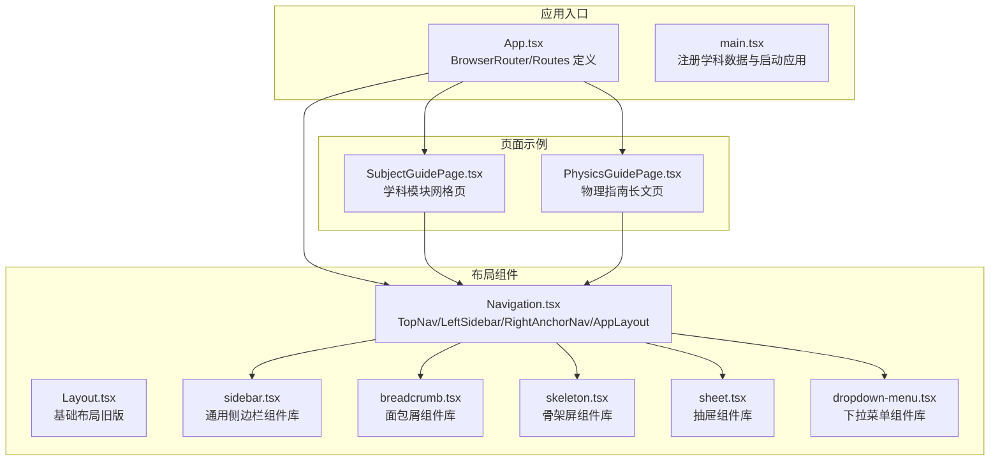
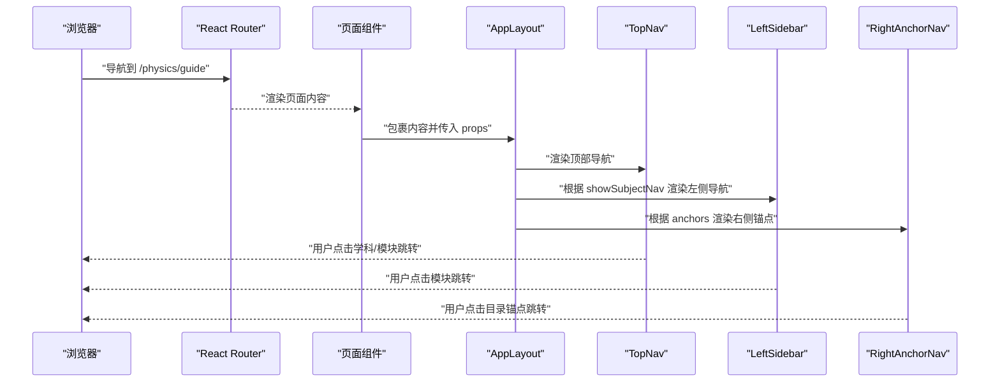
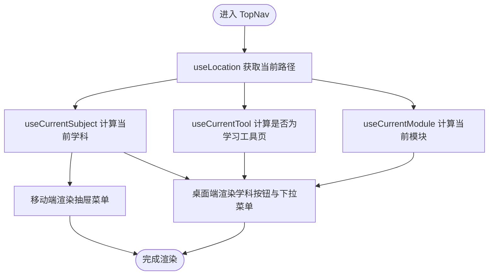
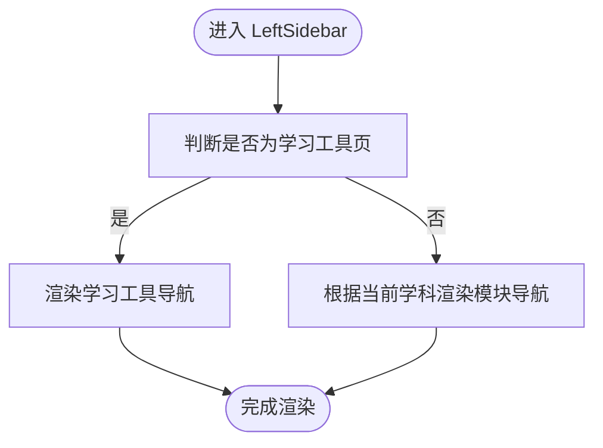
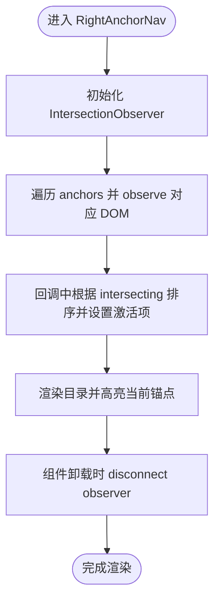
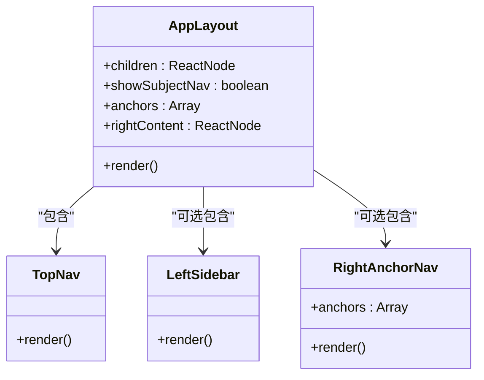
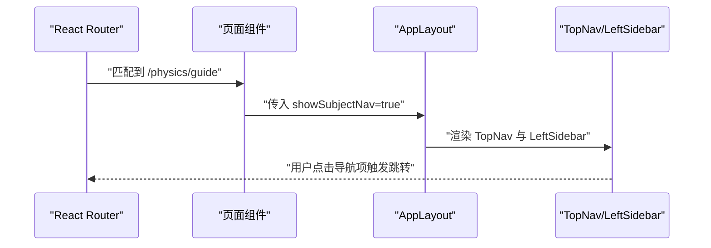
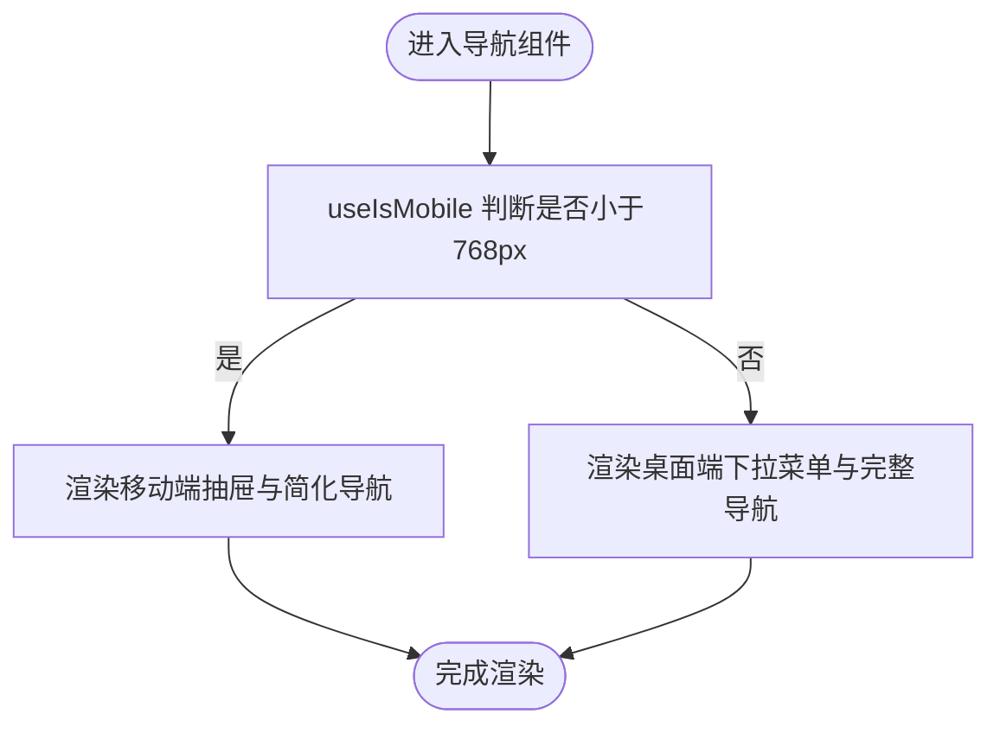
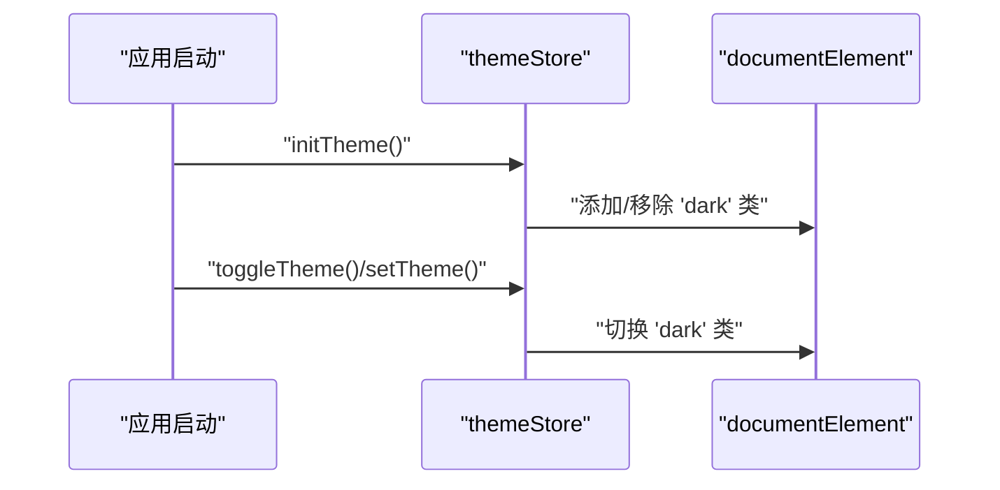
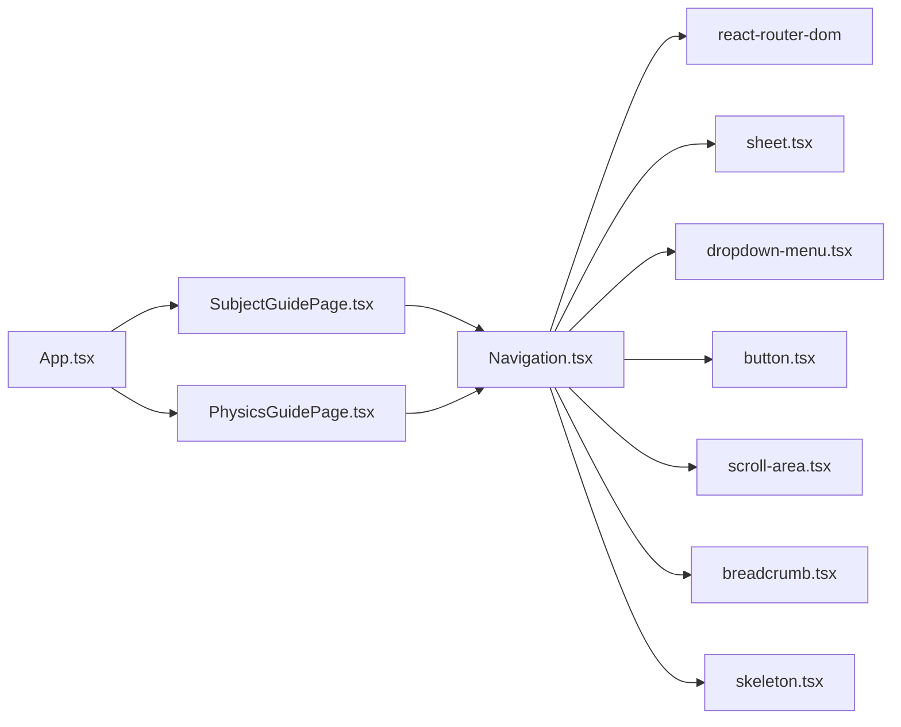

# 布局组件

<cite>
**本文引用的文件**
- [Navigation.tsx](file://src/components/layout/Navigation.tsx)
- [Layout.tsx](file://src/components/Layout.tsx)
- [sidebar.tsx](file://src/components/ui/sidebar.tsx)
- [breadcrumb.tsx](file://src/components/ui/breadcrumb.tsx)
- [skeleton.tsx](file://src/components/ui/skeleton.tsx)
- [sheet.tsx](file://src/components/ui/sheet.tsx)
- [dropdown-menu.tsx](file://src/components/ui/dropdown-menu.tsx)
- [SubjectGuidePage.tsx](file://src/sections/SubjectGuidePage.tsx)
- [PhysicsGuidePage.tsx](file://src/sections/PhysicsGuidePage.tsx)
- [App.tsx](file://src/App.tsx)
- [main.tsx](file://src/main.tsx)
- [use-mobile.ts](file://src/hooks/use-mobile.ts)
- [themeStore.ts](file://src/stores/themeStore.ts)
</cite>

## 目录
1. [简介](#简介)
2. [项目结构](#项目结构)
3. [核心组件](#核心组件)
4. [架构总览](#架构总览)
5. [详细组件分析](#详细组件分析)
6. [依赖分析](#依赖分析)
7. [性能考虑](#性能考虑)
8. [故障排查指南](#故障排查指南)
9. [结论](#结论)
10. [附录](#附录)

## 简介
本文件系统化梳理星耀平台的布局与导航体系，覆盖顶部导航、左侧边栏、右侧锚点导航与应用布局组件。文档重点阐述：
- 导航系统与布局架构：如何通过路由感知与模块映射实现“学科—模块”的两级导航
- 响应式设计：桌面端与移动端的差异化呈现与交互
- 状态管理与主题适配：基于 Zustand 的主题存储与 DOM 切换
- 用户体验优化：下拉菜单、侧边抽屉、锚点目录联动滚动
- 与路由系统的集成：页面如何以 AppLayout 包裹并注入导航
- 性能优化策略：懒加载、IntersectionObserver、移动端检测钩子

## 项目结构
星耀平台采用“页面按需加载 + 组件化布局”的结构：
- 路由层：集中定义在应用入口，按学科与功能划分路径
- 布局层：提供顶部导航、左侧边栏、右侧锚点与应用布局容器
- 页面层：通过 AppLayout 包裹内容，按需启用学科导航与锚点目录

**图表来源**
- [App.tsx:69-211](file://src/App.tsx#L69-L211)
- [main.tsx:1-19](file://src/main.tsx#L1-L19)
- [Navigation.tsx:369-718](file://src/components/layout/Navigation.tsx#L369-L718)
- [sidebar.tsx:154-254](file://src/components/ui/sidebar.tsx#L154-L254)
- [sheet.tsx:45-80](file://src/components/ui/sheet.tsx#L45-L80)
- [dropdown-menu.tsx:32-50](file://src/components/ui/dropdown-menu.tsx#L32-L50)
- [breadcrumb.tsx:11-22](file://src/components/ui/breadcrumb.tsx#L11-L22)
- [skeleton.tsx:3-11](file://src/components/ui/skeleton.tsx#L3-L11)
- [SubjectGuidePage.tsx:100-143](file://src/sections/SubjectGuidePage.tsx#L100-L143)
- [PhysicsGuidePage.tsx:6-137](file://src/sections/PhysicsGuidePage.tsx#L6-L137)

**章节来源**
- [App.tsx:69-211](file://src/App.tsx#L69-L211)
- [main.tsx:1-19](file://src/main.tsx#L1-L19)
- [Navigation.tsx:369-718](file://src/components/layout/Navigation.tsx#L369-L718)

## 核心组件
- 顶部导航 TopNav：学科切换按钮组、当前学科下拉菜单、学习工具下拉、移动端抽屉菜单
- 左侧边栏 LeftSidebar：根据当前学科与模块高亮，支持学习工具页专用导航
- 右侧锚点导航 RightAnchorNav：基于 IntersectionObserver 的目录联动滚动
- 应用布局 AppLayout：统一承载顶部导航、左侧边栏、主内容区与右侧内容区
- 基础布局 Layout：早期版本的基础容器（仍被部分页面使用）

关键配置与状态：
- 学科配置：包含名称、代码、颜色、可用性与路由前缀
- 模块映射：学科 ID 到模块列表的映射函数，用于动态生成导航项
- 路由感知：通过 useLocation 计算当前学科、模块与工具页状态
- 主题状态：Zustand store 提供主题切换与持久化

**章节来源**
- [Navigation.tsx:47-59](file://src/components/layout/Navigation.tsx#L47-L59)
- [Navigation.tsx:311-321](file://src/components/layout/Navigation.tsx#L311-L321)
- [Navigation.tsx:323-366](file://src/components/layout/Navigation.tsx#L323-L366)
- [Navigation.tsx:369-547](file://src/components/layout/Navigation.tsx#L369-L547)
- [Navigation.tsx:550-631](file://src/components/layout/Navigation.tsx#L550-L631)
- [Navigation.tsx:633-687](file://src/components/layout/Navigation.tsx#L633-L687)
- [Navigation.tsx:698-718](file://src/components/layout/Navigation.tsx#L698-L718)
- [Layout.tsx:3-15](file://src/components/Layout.tsx#L3-L15)
- [themeStore.ts:13-34](file://src/stores/themeStore.ts#L13-L34)

## 架构总览
星耀平台的导航与布局采用“组件分层 + 路由感知 + 组合式布局”的架构模式：
- 组件分层：Navigation.tsx 提供导航与布局容器；UI 组件库提供通用交互控件
- 路由感知：通过 useLocation 与路径匹配函数确定当前上下文
- 组合式布局：AppLayout 将 TopNav、LeftSidebar、主内容与右侧内容组合，支持按需开启学科导航与锚点目录

**图表来源**
- [App.tsx:80-206](file://src/App.tsx#L80-L206)
- [SubjectGuidePage.tsx:100-143](file://src/sections/SubjectGuidePage.tsx#L100-L143)
- [PhysicsGuidePage.tsx:6-137](file://src/sections/PhysicsGuidePage.tsx#L6-L137)
- [Navigation.tsx:698-718](file://src/components/layout/Navigation.tsx#L698-L718)

## 详细组件分析

### 顶部导航 TopNav
职责与行为：
- 桌面端：学科切换按钮组，当前学科高亮；当前学科下拉菜单展示模块；学习工具下拉菜单
- 移动端：左侧抽屉菜单，包含学习工具、学科选择与模块导航；右侧“我的”入口
- 路由感知：根据路径判断当前学科与模块，动态高亮与下拉菜单项

**图表来源**
- [Navigation.tsx:323-366](file://src/components/layout/Navigation.tsx#L323-L366)
- [Navigation.tsx:369-547](file://src/components/layout/Navigation.tsx#L369-L547)

**章节来源**
- [Navigation.tsx:369-547](file://src/components/layout/Navigation.tsx#L369-L547)

### 左侧边栏 LeftSidebar
职责与行为：
- 当处于学习工具页时，渲染学习工具导航
- 否则根据当前学科渲染对应模块导航，并高亮当前模块
- 使用 ScrollArea 实现内容滚动

**图表来源**
- [Navigation.tsx:550-631](file://src/components/layout/Navigation.tsx#L550-L631)

**章节来源**
- [Navigation.tsx:550-631](file://src/components/layout/Navigation.tsx#L550-L631)

### 右侧锚点导航 RightAnchorNav
职责与行为：
- 接收锚点数组，基于 IntersectionObserver 监听可见区域，动态更新激活项
- 使用 sticky 定位与简化的目录样式，突出当前章节

**图表来源**
- [Navigation.tsx:633-687](file://src/components/layout/Navigation.tsx#L633-L687)

**章节来源**
- [Navigation.tsx:633-687](file://src/components/layout/Navigation.tsx#L633-L687)

### 应用布局 AppLayout
职责与行为：
- 统一承载 TopNav、LeftSidebar、主内容区与右侧内容区
- 支持按需开启学科导航与右侧锚点目录
- 通过 props 控制布局结构与内容分区

**图表来源**
- [Navigation.tsx:698-718](file://src/components/layout/Navigation.tsx#L698-L718)

**章节来源**
- [Navigation.tsx:698-718](file://src/components/layout/Navigation.tsx#L698-L718)

### 基础布局 Layout（旧版）
职责与行为：
- 提供基础的头部、主内容区与页脚结构
- 支持全宽与最大宽度控制、类名透传

**章节来源**
- [Layout.tsx:3-15](file://src/components/Layout.tsx#L3-L15)
- [Layout.tsx:16-52](file://src/components/Layout.tsx#L16-L52)

### 与路由系统的集成
- 路由集中定义在 App.tsx 中，覆盖学科、竞赛、工具、首页等路径
- 页面通过 AppLayout 包裹内容，按需启用学科导航与锚点目录
- 页面示例：
  - SubjectGuidePage：学科模块网格页，启用学科导航
  - PhysicsGuidePage：物理指南长文页，启用学科导航与锚点目录

**图表来源**
- [App.tsx:80-206](file://src/App.tsx#L80-L206)
- [SubjectGuidePage.tsx:100-143](file://src/sections/SubjectGuidePage.tsx#L100-L143)
- [PhysicsGuidePage.tsx:6-137](file://src/sections/PhysicsGuidePage.tsx#L6-L137)
- [Navigation.tsx:698-718](file://src/components/layout/Navigation.tsx#L698-L718)

**章节来源**
- [App.tsx:69-211](file://src/App.tsx#L69-L211)
- [SubjectGuidePage.tsx:64-143](file://src/sections/SubjectGuidePage.tsx#L64-L143)
- [PhysicsGuidePage.tsx:5-137](file://src/sections/PhysicsGuidePage.tsx#L5-L137)

### 响应式设计与移动端适配
- 移动端断点：使用 768px 断点，配合 useIsMobile 判断
- 抽屉菜单：移动端使用 Sheet 组件承载导航内容，支持关闭按钮
- 下拉菜单：桌面端使用 DropdownMenu 组件承载学科与工具菜单
- 侧边栏组件库：sidebar.tsx 提供通用侧边栏能力（可作为扩展参考）

**图表来源**
- [use-mobile.ts:3-19](file://src/hooks/use-mobile.ts#L3-L19)
- [Navigation.tsx:455-544](file://src/components/layout/Navigation.tsx#L455-L544)
- [sheet.tsx:45-80](file://src/components/ui/sheet.tsx#L45-L80)
- [dropdown-menu.tsx:32-50](file://src/components/ui/dropdown-menu.tsx#L32-L50)

**章节来源**
- [use-mobile.ts:1-20](file://src/hooks/use-mobile.ts#L1-L20)
- [Navigation.tsx:455-544](file://src/components/layout/Navigation.tsx#L455-L544)
- [sheet.tsx:1-138](file://src/components/ui/sheet.tsx#L1-L138)
- [dropdown-menu.tsx:1-256](file://src/components/ui/dropdown-menu.tsx#L1-L256)

### 主题适配与状态管理
- 主题状态：Zustand store 管理 light/dark 切换与持久化
- 初始化：应用启动时调用 initTheme，确保 DOM 上的 dark 类存在
- 切换：setTheme/toggleTheme 动态切换 documentElement 的 dark 类

**图表来源**
- [themeStore.ts:13-34](file://src/stores/themeStore.ts#L13-L34)
- [App.tsx:69-76](file://src/App.tsx#L69-L76)

**章节来源**
- [themeStore.ts:1-37](file://src/stores/themeStore.ts#L1-L37)
- [App.tsx:69-76](file://src/App.tsx#L69-L76)

### 面包屑导航与页面骨架
- 面包屑：breadcrumb.tsx 提供标准的面包屑组件，可用于页面路径指示
- 页面骨架：skeleton.tsx 提供骨架屏组件，可在数据加载时提升感知性能

**章节来源**
- [breadcrumb.tsx:1-110](file://src/components/ui/breadcrumb.tsx#L1-L110)
- [skeleton.tsx:1-14](file://src/components/ui/skeleton.tsx#L1-L14)

## 依赖分析
- Navigation.tsx 依赖：
  - react-router-dom：Link、useLocation
  - UI 组件库：sheet、dropdown-menu、button、scroll-area、breadcrumb、skeleton
  - 自身逻辑：学科配置、模块映射、路径匹配函数
- AppLayout 依赖 Navigation.tsx 的 TopNav/LeftSidebar/RightAnchorNav
- 页面组件依赖 AppLayout 与 UI 组件库

**图表来源**
- [Navigation.tsx:1-16](file://src/components/layout/Navigation.tsx#L1-L16)
- [sheet.tsx:1-138](file://src/components/ui/sheet.tsx#L1-L138)
- [dropdown-menu.tsx:1-256](file://src/components/ui/dropdown-menu.tsx#L1-L256)
- [SubjectGuidePage.tsx:1-12](file://src/sections/SubjectGuidePage.tsx#L1-L12)
- [PhysicsGuidePage.tsx:1-4](file://src/sections/PhysicsGuidePage.tsx#L1-L4)
- [App.tsx:69-211](file://src/App.tsx#L69-L211)

**章节来源**
- [Navigation.tsx:1-16](file://src/components/layout/Navigation.tsx#L1-L16)
- [SubjectGuidePage.tsx:1-12](file://src/sections/SubjectGuidePage.tsx#L1-L12)
- [PhysicsGuidePage.tsx:1-4](file://src/sections/PhysicsGuidePage.tsx#L1-L4)
- [App.tsx:69-211](file://src/App.tsx#L69-L211)

## 性能考虑
- 懒加载与代码分割：App.tsx 中大量页面组件采用懒加载，减少首屏体积
- IntersectionObserver：RightAnchorNav 使用 IntersectionObserver 监听可见区域，避免频繁 reflow
- 移动端断点：useIsMobile 仅在挂载时监听 MediaQueryList，避免重复绑定
- 组件复用：AppLayout 作为布局容器，统一承载导航与内容，降低重复渲染成本

**章节来源**
- [App.tsx:69-211](file://src/App.tsx#L69-L211)
- [Navigation.tsx:633-687](file://src/components/layout/Navigation.tsx#L633-L687)
- [use-mobile.ts:1-20](file://src/hooks/use-mobile.ts#L1-L20)

## 故障排查指南
- 导航不生效或高亮异常
  - 检查 useCurrentSubject/useCurrentModule 的路径匹配逻辑是否覆盖目标路由
  - 确认学科配置中的 href 与实际路由一致
- 移动端抽屉无法关闭
  - 检查 Sheet 的 open/onOpenChange 是否正确绑定
  - 确认移动端断点与 useIsMobile 的返回值
- 锚点目录不更新
  - 检查 anchors 参数是否正确传入，且 DOM 节点 id 与锚点一致
  - 确认 IntersectionObserver 的 rootMargin/阈值设置是否合理
- 主题切换无效
  - 检查 initTheme 是否在应用启动时调用
  - 确认 setTheme/toggleTheme 是否正确更新 documentElement 的类名

**章节来源**
- [Navigation.tsx:323-366](file://src/components/layout/Navigation.tsx#L323-L366)
- [Navigation.tsx:455-544](file://src/components/layout/Navigation.tsx#L455-L544)
- [Navigation.tsx:633-687](file://src/components/layout/Navigation.tsx#L633-L687)
- [themeStore.ts:13-34](file://src/stores/themeStore.ts#L13-L34)

## 结论
星耀平台的布局与导航体系以“路由感知 + 组合式布局 + 响应式适配”为核心，通过 Navigation.tsx 提供统一的导航容器与交互控件，结合 AppLayout 实现灵活的内容布局。配合主题状态管理与性能优化策略，整体具备良好的可维护性与用户体验。

## 附录
- 使用示例
  - 在学科模块网格页启用学科导航：[SubjectGuidePage.tsx:100-143](file://src/sections/SubjectGuidePage.tsx#L100-L143)
  - 在长文页启用学科导航与锚点目录：[PhysicsGuidePage.tsx:6-137](file://src/sections/PhysicsGuidePage.tsx#L6-L137)
- 组件属性与配置
  - AppLayout 属性：children、showSubjectNav、anchors、rightContent
  - RightAnchorNav 属性：anchors（id、label）
  - TopNav/LeftSidebar：依赖路由上下文与学科配置

**章节来源**
- [SubjectGuidePage.tsx:100-143](file://src/sections/SubjectGuidePage.tsx#L100-L143)
- [PhysicsGuidePage.tsx:6-137](file://src/sections/PhysicsGuidePage.tsx#L6-L137)
- [Navigation.tsx:698-718](file://src/components/layout/Navigation.tsx#L698-L718)
- [Navigation.tsx:633-687](file://src/components/layout/Navigation.tsx#L633-L687)