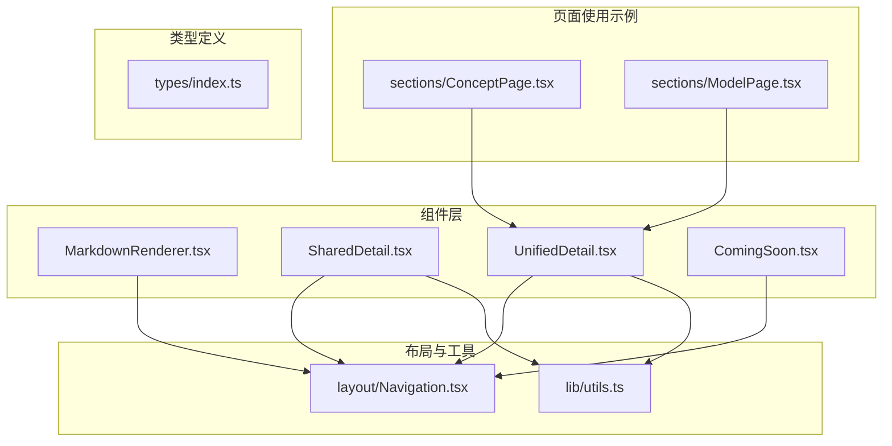
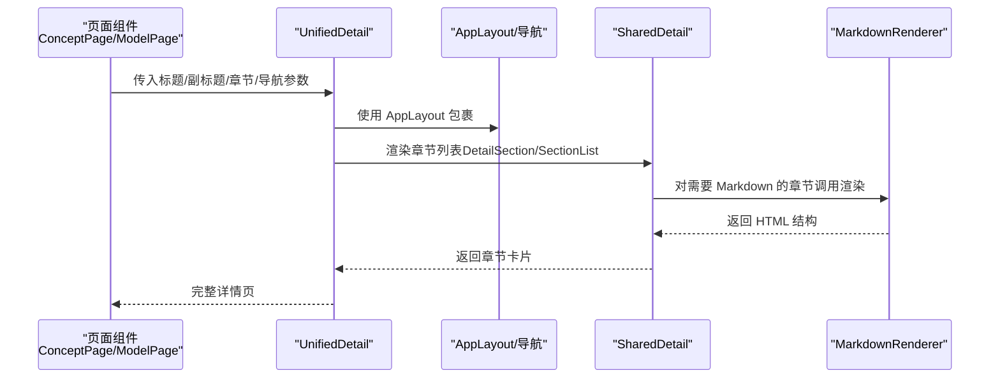
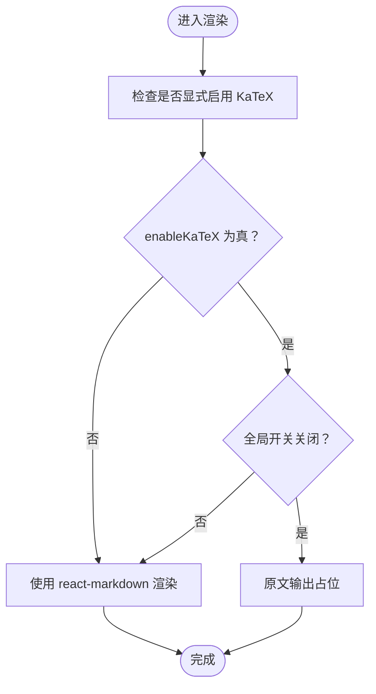
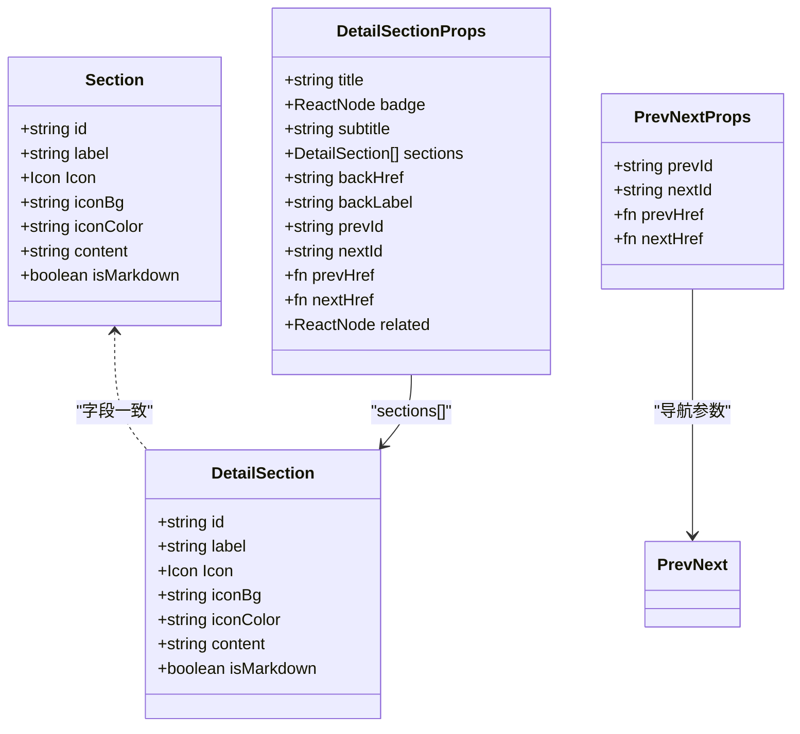
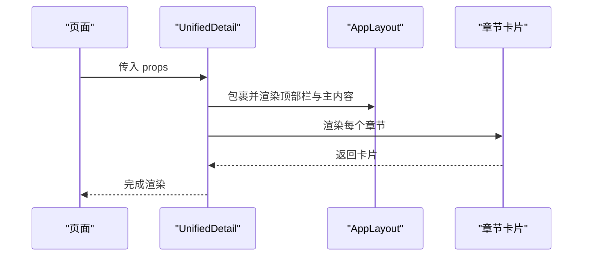
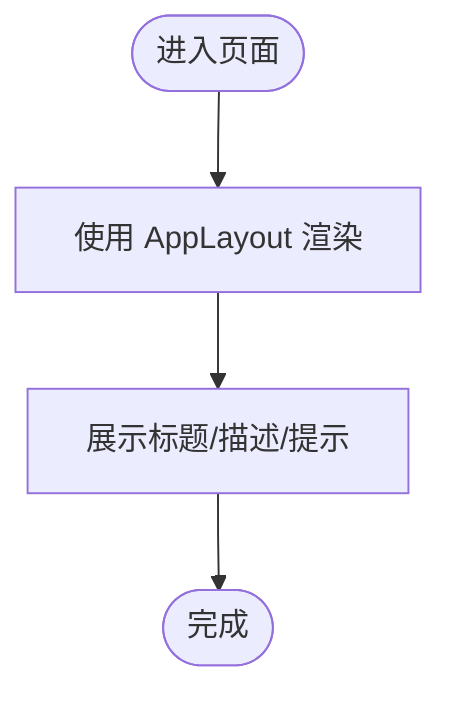
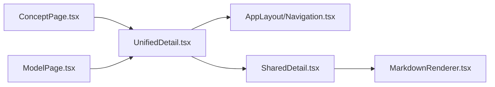
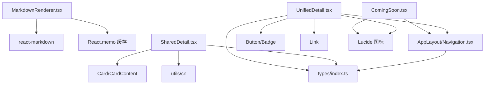

# 自定义组件

<cite>
**本文引用的文件**
- [MarkdownRenderer.tsx](file://src/components/MarkdownRenderer.tsx)
- [SharedDetail.tsx](file://src/components/SharedDetail.tsx)
- [UnifiedDetail.tsx](file://src/components/UnifiedDetail.tsx)
- [ComingSoon.tsx](file://src/components/ComingSoon.tsx)
- [Navigation.tsx](file://src/components/layout/Navigation.tsx)
- [utils.ts](file://src/lib/utils.ts)
- [ConceptPage.tsx](file://src/sections/ConceptPage.tsx)
- [ModelPage.tsx](file://src/sections/ModelPage.tsx)
- [index.ts](file://src/types/index.ts)
</cite>

## 目录
1. [简介](#简介)
2. [项目结构](#项目结构)
3. [核心组件](#核心组件)
4. [架构总览](#架构总览)
5. [组件详细分析](#组件详细分析)
6. [依赖关系分析](#依赖关系分析)
7. [性能考量](#性能考量)
8. [故障排查指南](#故障排查指南)
9. [结论](#结论)
10. [附录](#附录)

## 简介
本文件系统化梳理星耀平台的自定义业务组件，重点覆盖以下平台专属组件：
- Markdown 渲染器：支持基础 Markdown 渲染与可选的 KaTeX 数学公式渲染开关。
- 详情展示组件：提供“章节级”内容的统一展示与占位提示。
- 统一详情组件：在统一布局中渲染标题、副标题、章节、前后导航与相关推荐。
- 即将上线组件：用于展示“功能建设中”的占位页面。

上述组件围绕统一布局与主题样式，配合路由与图标库，形成一致的阅读体验与导航行为；同时通过 props 接口与状态管理钩子，实现灵活的数据驱动与交互扩展。

## 项目结构
自定义组件集中位于 src/components 目录，配套布局与工具位于 layout 与 lib 子目录；页面级使用示例位于 sections 目录；类型定义位于 src/types。

图表来源
- [MarkdownRenderer.tsx:1-33](file://src/components/MarkdownRenderer.tsx#L1-L33)
- [SharedDetail.tsx:1-81](file://src/components/SharedDetail.tsx#L1-L81)
- [UnifiedDetail.tsx:1-143](file://src/components/UnifiedDetail.tsx#L1-L143)
- [ComingSoon.tsx:1-28](file://src/components/ComingSoon.tsx#L1-L28)
- [Navigation.tsx:690-719](file://src/components/layout/Navigation.tsx#L690-L719)
- [utils.ts:1-7](file://src/lib/utils.ts#L1-L7)
- [ConceptPage.tsx:170-369](file://src/sections/ConceptPage.tsx#L170-L369)
- [ModelPage.tsx:200-279](file://src/sections/ModelPage.tsx#L200-L279)
- [index.ts:1-209](file://src/types/index.ts#L1-L209)

章节来源
- [MarkdownRenderer.tsx:1-33](file://src/components/MarkdownRenderer.tsx#L1-L33)
- [SharedDetail.tsx:1-81](file://src/components/SharedDetail.tsx#L1-L81)
- [UnifiedDetail.tsx:1-143](file://src/components/UnifiedDetail.tsx#L1-L143)
- [ComingSoon.tsx:1-28](file://src/components/ComingSoon.tsx#L1-L28)
- [Navigation.tsx:690-719](file://src/components/layout/Navigation.tsx#L690-L719)
- [utils.ts:1-7](file://src/lib/utils.ts#L1-L7)
- [ConceptPage.tsx:170-369](file://src/sections/ConceptPage.tsx#L170-L369)
- [ModelPage.tsx:200-279](file://src/sections/ModelPage.tsx#L200-L279)
- [index.ts:1-209](file://src/types/index.ts#L1-L209)

## 核心组件
- MarkdownRenderer：接收原始字符串内容，按需启用 KaTeX 渲染；默认走 react-markdown 渲染。
- SharedDetail：提供“章节级”内容的卡片化展示，支持占位文案与 Markdown 标记字段。
- UnifiedDetail：在统一布局中渲染标题、副标题、章节、前后导航与相关推荐，适合知识/模型详情页。
- ComingSoon：用于“功能建设中”占位页，支持学科与功能名称参数化。

章节来源
- [MarkdownRenderer.tsx:9-32](file://src/components/MarkdownRenderer.tsx#L9-L32)
- [SharedDetail.tsx:7-81](file://src/components/SharedDetail.tsx#L7-L81)
- [UnifiedDetail.tsx:14-143](file://src/components/UnifiedDetail.tsx#L14-L143)
- [ComingSoon.tsx:4-28](file://src/components/ComingSoon.tsx#L4-L28)

## 架构总览
自定义组件与页面使用的关系如下：

图表来源
- [ConceptPage.tsx:170-369](file://src/sections/ConceptPage.tsx#L170-L369)
- [ModelPage.tsx:200-279](file://src/sections/ModelPage.tsx#L200-L279)
- [UnifiedDetail.tsx:39-143](file://src/components/UnifiedDetail.tsx#L39-L143)
- [SharedDetail.tsx:18-54](file://src/components/SharedDetail.tsx#L18-L54)
- [MarkdownRenderer.tsx:19-32](file://src/components/MarkdownRenderer.tsx#L19-L32)
- [Navigation.tsx:698-718](file://src/components/layout/Navigation.tsx#L698-L718)

## 组件详细分析

### Markdown 渲染器
- 功能特性
  - 输入原始字符串，按需启用 KaTeX 渲染；默认关闭以避免网络不稳定导致的渲染失败。
  - 支持传入容器类名，便于样式定制。
- 数据处理逻辑
  - 使用 useMemo 对输入内容进行预处理缓存，减少重复渲染开销。
  - 当显式开启 KaTeX 且全局开关关闭时，回退为原文输出，避免异常。
- 用户交互设计
  - 作为子组件被详情页章节调用，保持渲染一致性与性能稳定。
- Props 接口
  - content: string（必填）
  - enableKaTeX?: boolean（可选，默认 false）
  - className?: string（可选）
- 状态管理与错误处理
  - 无内部状态；错误处理通过全局开关与回退策略实现。
- 使用场景与扩展
  - 适用于知识/模型详情页的章节正文渲染；可扩展为插件化渲染器以支持更多标签。

图表来源
- [MarkdownRenderer.tsx:19-32](file://src/components/MarkdownRenderer.tsx#L19-L32)

章节来源
- [MarkdownRenderer.tsx:9-32](file://src/components/MarkdownRenderer.tsx#L9-L32)

### 详情展示组件（章节级）
- 功能特性
  - DetailSection：单章节渲染，支持图标、标题、内容卡片与占位提示。
  - SectionList：章节列表渲染。
  - PrevNext：前后导航（可选）。
- 数据处理逻辑
  - 依据 Section 接口字段渲染卡片；content 为空时显示“内容整理中”占位。
- 用户交互设计
  - 占位卡片采用虚线边框与柔和背景，提升可读性与心理预期。
- Props 接口
  - DetailSection/Section 接口字段：id、label、Icon、iconBg、iconColor、content、isMarkdown。
  - PrevNext 接口字段：prevId、nextId、prevHref、nextHref。
- 状态管理与错误处理
  - 无内部状态；错误处理通过占位卡片与可选导航实现。
- 使用场景与扩展
  - 适配不同业务模块的内容展示；可扩展为支持富媒体或交互式卡片。

图表来源
- [SharedDetail.tsx:7-81](file://src/components/SharedDetail.tsx#L7-L81)
- [UnifiedDetail.tsx:14-37](file://src/components/UnifiedDetail.tsx#L14-L37)

章节来源
- [SharedDetail.tsx:7-81](file://src/components/SharedDetail.tsx#L7-L81)

### 统一详情组件
- 功能特性
  - 在统一布局中渲染标题、副标题、章节、前后导航与相关推荐。
  - 支持徽章、粘性顶部栏与左右导航按钮。
- 数据处理逻辑
  - 通过 DetailSection 数组渲染多个章节；章节内容为空时显示占位卡片。
  - 前后导航根据 prevId/nextId 与构造函数决定是否渲染。
- 用户交互设计
  - 粘性顶部栏提升滚动体验；前后导航按钮与链接跳转增强可访问性。
- Props 接口
  - title、subtitle、sections、backHref、backLabel、prevId、nextId、prevHref、nextHref、related、badge。
- 状态管理与错误处理
  - 无内部状态；错误处理通过占位卡片与导航条件渲染实现。
- 使用场景与扩展
  - 适配知识节点与模型详情页；可扩展为支持锚点导航与右侧目录。

图表来源
- [UnifiedDetail.tsx:39-143](file://src/components/UnifiedDetail.tsx#L39-L143)
- [Navigation.tsx:698-718](file://src/components/layout/Navigation.tsx#L698-L718)

章节来源
- [UnifiedDetail.tsx:25-143](file://src/components/UnifiedDetail.tsx#L25-L143)

### 即将上线组件
- 功能特性
  - 展示“功能建设中”的占位页面，支持学科与功能名称参数化。
- 数据处理逻辑
  - 通过 AppLayout 渲染统一布局。
- 用户交互设计
  - 中心化信息与友好提示，降低用户期望与实际状态的落差。
- Props 接口
  - name?: string、subject?: string。
- 状态管理与错误处理
  - 无内部状态；错误处理通过占位文案实现。
- 使用场景与扩展
  - 适用于新功能上线前的引导页；可扩展为订阅提醒或动态进度条。

图表来源
- [ComingSoon.tsx:9-28](file://src/components/ComingSoon.tsx#L9-L28)
- [Navigation.tsx:698-718](file://src/components/layout/Navigation.tsx#L698-L718)

章节来源
- [ComingSoon.tsx:4-28](file://src/components/ComingSoon.tsx#L4-L28)

### 页面使用示例与集成
- 知识节点详情页
  - 使用统一详情组件渲染章节与导航；章节内容来自数据对象的多个字段。
  - 通过锚点与卡片化展示，提升阅读体验。
- 模型详情页
  - 同样使用统一详情组件；章节内容来自模型数据对象。
  - 支持前后导航与相关推荐。

图表来源
- [ConceptPage.tsx:170-369](file://src/sections/ConceptPage.tsx#L170-L369)
- [ModelPage.tsx:200-279](file://src/sections/ModelPage.tsx#L200-L279)
- [UnifiedDetail.tsx:39-143](file://src/components/UnifiedDetail.tsx#L39-L143)
- [SharedDetail.tsx:18-54](file://src/components/SharedDetail.tsx#L18-L54)
- [MarkdownRenderer.tsx:19-32](file://src/components/MarkdownRenderer.tsx#L19-L32)
- [Navigation.tsx:698-718](file://src/components/layout/Navigation.tsx#L698-L718)

章节来源
- [ConceptPage.tsx:170-369](file://src/sections/ConceptPage.tsx#L170-L369)
- [ModelPage.tsx:200-279](file://src/sections/ModelPage.tsx#L200-L279)

## 依赖关系分析
- 组件依赖
  - MarkdownRenderer 依赖 react-markdown 与 React.memo 缓存。
  - SharedDetail 依赖 Card、CardContent 与 cn 工具函数。
  - UnifiedDetail 依赖 AppLayout、Button、Badge、Link、Lucide 图标。
  - ComingSoon 依赖 AppLayout 与图标。
- 布局与工具
  - AppLayout 由 Navigation.tsx 提供，包含顶部导航、左侧侧边栏与右侧锚点导航。
  - utils.ts 提供 cn 类名合并工具，统一样式拼接。
- 类型定义
  - types/index.ts 定义了学科、模块、章节、知识点、策略、题目、学习状态与认知图谱等核心类型，为页面与组件提供数据契约。

图表来源
- [MarkdownRenderer.tsx:6-7](file://src/components/MarkdownRenderer.tsx#L6-L7)
- [SharedDetail.tsx:1-4](file://src/components/SharedDetail.tsx#L1-L4)
- [utils.ts:4-6](file://src/lib/utils.ts#L4-L6)
- [UnifiedDetail.tsx:3-11](file://src/components/UnifiedDetail.tsx#L3-L11)
- [ComingSoon.tsx:1-2](file://src/components/ComingSoon.tsx#L1-L2)
- [Navigation.tsx:690-719](file://src/components/layout/Navigation.tsx#L690-L719)
- [index.ts:1-209](file://src/types/index.ts#L1-L209)

章节来源
- [MarkdownRenderer.tsx:6-7](file://src/components/MarkdownRenderer.tsx#L6-L7)
- [SharedDetail.tsx:1-4](file://src/components/SharedDetail.tsx#L1-L4)
- [utils.ts:4-6](file://src/lib/utils.ts#L4-L6)
- [UnifiedDetail.tsx:3-11](file://src/components/UnifiedDetail.tsx#L3-L11)
- [ComingSoon.tsx:1-2](file://src/components/ComingSoon.tsx#L1-L2)
- [Navigation.tsx:690-719](file://src/components/layout/Navigation.tsx#L690-L719)
- [index.ts:1-209](file://src/types/index.ts#L1-L209)

## 性能考量
- 渲染缓存
  - MarkdownRenderer 使用 useMemo 对输入内容进行缓存，避免重复渲染。
- 条件渲染
  - UnifiedDetail 与 SharedDetail 对空内容使用占位卡片，减少无效 DOM。
- 布局粘性
  - UnifiedDetail 的顶部栏采用粘性定位，减少滚动时的重排。
- 样式合并
  - 使用 utils/cn 合并类名，避免冗余样式与重复计算。

章节来源
- [MarkdownRenderer.tsx:19-21](file://src/components/MarkdownRenderer.tsx#L19-L21)
- [SharedDetail.tsx:30-42](file://src/components/SharedDetail.tsx#L30-L42)
- [UnifiedDetail.tsx:55-79](file://src/components/UnifiedDetail.tsx#L55-L79)
- [utils.ts:4-6](file://src/lib/utils.ts#L4-L6)

## 故障排查指南
- Markdown 无法渲染
  - 检查 enableKaTeX 参数与全局开关是否一致；若网络不稳定，建议保持全局开关关闭。
- 章节内容为空
  - 确认数据对象的 content 字段是否正确；组件会自动显示“内容整理中”占位。
- 导航不可用
  - 检查 prevId/nextId 与构造函数是否正确；确保路由路径有效。
- 样式异常
  - 检查 cn 工具函数是否正确合并类名；确认 Tailwind 样式是否完整引入。

章节来源
- [MarkdownRenderer.tsx:22-25](file://src/components/MarkdownRenderer.tsx#L22-L25)
- [SharedDetail.tsx:30-42](file://src/components/SharedDetail.tsx#L30-L42)
- [UnifiedDetail.tsx:67-76](file://src/components/UnifiedDetail.tsx#L67-L76)
- [utils.ts:4-6](file://src/lib/utils.ts#L4-L6)

## 结论
星耀平台的自定义组件围绕统一布局与一致的交互体验，提供了可复用的 Markdown 渲染、章节展示与详情页骨架。通过清晰的 Props 接口、占位提示与条件渲染策略，组件在保证性能的同时提升了可维护性与扩展性。建议在新增业务场景时遵循现有接口与样式约定，确保一致性与可演进性。

## 附录
- 集成建议
  - 在页面中优先使用 UnifiedDetail 作为详情页骨架，结合 SharedDetail 的章节渲染能力。
  - 对需要数学公式的章节，谨慎启用 KaTeX，并提供回退策略。
  - 使用 ComingSoon 作为新功能上线前的占位页，提升用户体验。
- 维护性考虑
  - 保持 Props 接口稳定，避免破坏性变更。
  - 对样式与交互进行单元测试与回归测试，确保跨模块一致性。