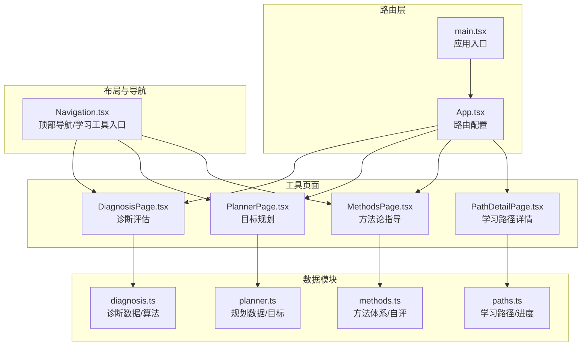
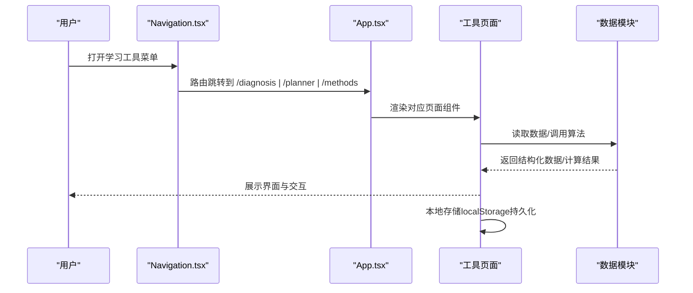
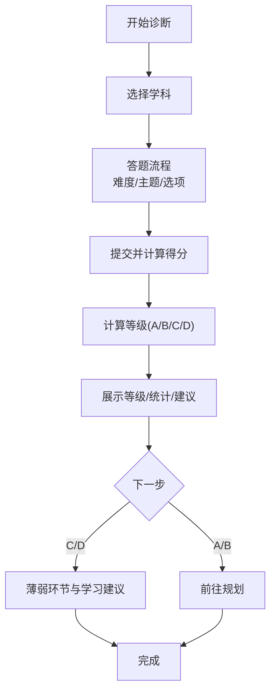
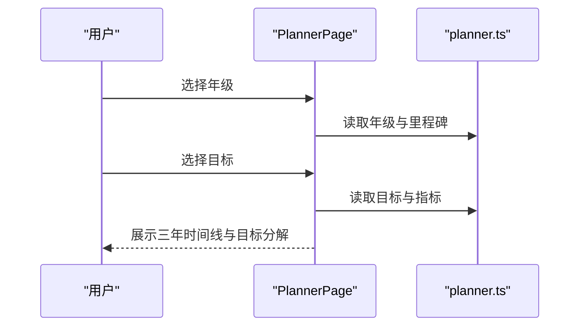
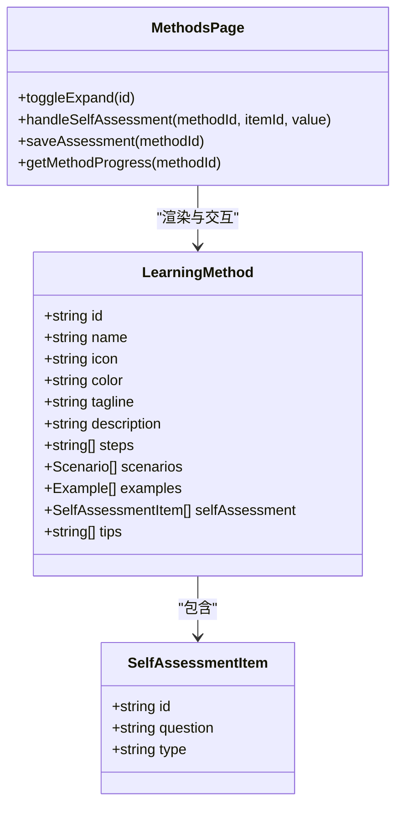
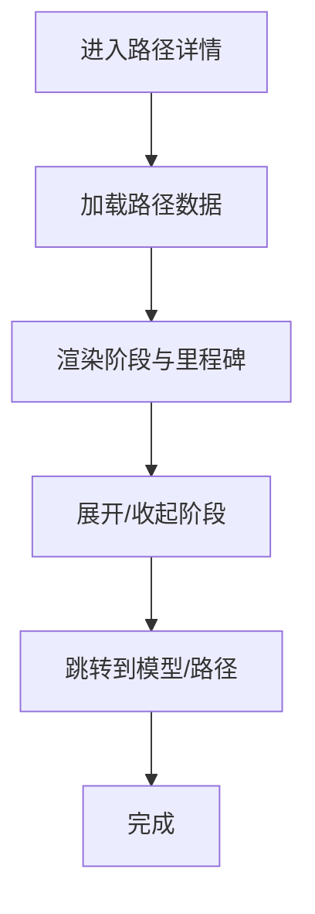
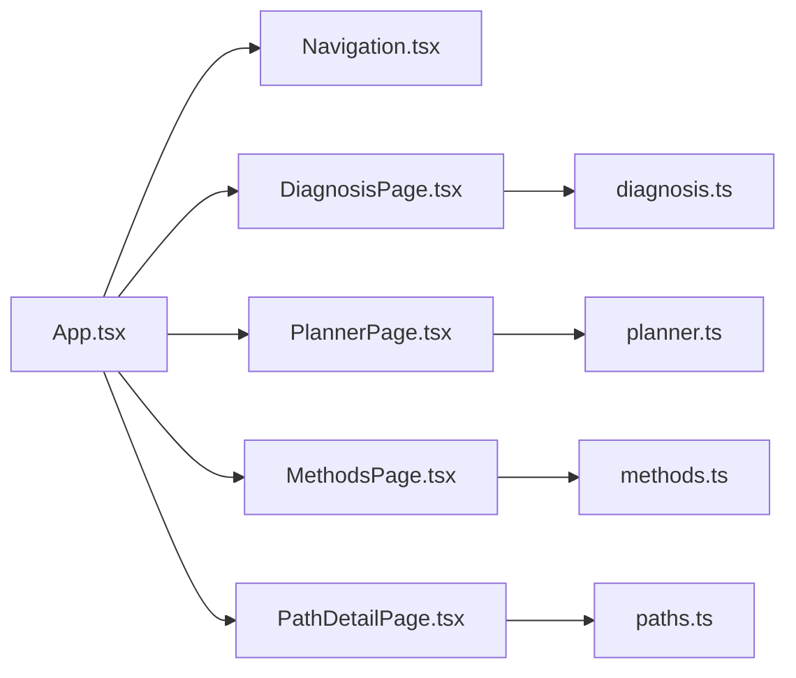

# 学习工具系统

<cite>
**本文档引用的文件**
- [src/App.tsx](file://src/App.tsx)
- [src/main.tsx](file://src/main.tsx)
- [src/components/layout/Navigation.tsx](file://src/components/layout/Navigation.tsx)
- [src/sections/tools/DiagnosisPage.tsx](file://src/sections/tools/DiagnosisPage.tsx)
- [src/data/tools/diagnosis.ts](file://src/data/tools/diagnosis.ts)
- [src/sections/tools/PlannerPage.tsx](file://src/sections/tools/PlannerPage.tsx)
- [src/data/tools/planner.ts](file://src/data/tools/planner.ts)
- [src/sections/tools/MethodsPage.tsx](file://src/sections/tools/MethodsPage.tsx)
- [src/data/tools/methods.ts](file://src/data/tools/methods.ts)
- [src/sections/tools/PathDetailPage.tsx](file://src/sections/tools/PathDetailPage.tsx)
- [src/data/tools/paths.ts](file://src/data/tools/paths.ts)
</cite>

## 目录
1. [简介](#简介)
2. [项目结构](#项目结构)
3. [核心组件](#核心组件)
4. [架构总览](#架构总览)
5. [详细组件分析](#详细组件分析)
6. [依赖关系分析](#依赖关系分析)
7. [性能考虑](#性能考虑)
8. [故障排除指南](#故障排除指南)
9. [结论](#结论)
10. [附录](#附录)

## 简介
本文件系统性阐述星耀平台学习工具系统的三大核心模块：诊断评估、学习规划与方法论指导。文档涵盖页面设计理念、算法实现原理、结果呈现方式、工具间协作关系与数据流转，并提供用户体验优化与功能扩展建议。

## 项目结构
学习工具系统采用“页面组件 + 数据模块”的分层架构：
- 页面组件位于 sections/tools，负责用户交互与视图渲染
- 数据模块位于 data/tools，封装业务数据与算法逻辑
- 导航与布局由 Navigation.tsx 提供统一的导航与工具入口
- 路由在 App.tsx 中集中配置，main.tsx 触发学科数据注册

**图表来源**
- [src/App.tsx:69-211](file://src/App.tsx#L69-L211)
- [src/main.tsx:1-19](file://src/main.tsx#L1-L19)
- [src/components/layout/Navigation.tsx:163-185](file://src/components/layout/Navigation.tsx#L163-L185)
- [src/sections/tools/DiagnosisPage.tsx:31-435](file://src/sections/tools/DiagnosisPage.tsx#L31-L435)
- [src/sections/tools/PlannerPage.tsx:42-344](file://src/sections/tools/PlannerPage.tsx#L42-L344)
- [src/sections/tools/MethodsPage.tsx:18-342](file://src/sections/tools/MethodsPage.tsx#L18-L342)
- [src/sections/tools/PathDetailPage.tsx:50-270](file://src/sections/tools/PathDetailPage.tsx#L50-L270)
- [src/data/tools/diagnosis.ts:1-294](file://src/data/tools/diagnosis.ts#L1-L294)
- [src/data/tools/planner.ts:1-145](file://src/data/tools/planner.ts#L1-L145)
- [src/data/tools/methods.ts:1-252](file://src/data/tools/methods.ts#L1-L252)
- [src/data/tools/paths.ts:1-515](file://src/data/tools/paths.ts#L1-L515)

**章节来源**
- [src/App.tsx:69-211](file://src/App.tsx#L69-L211)
- [src/main.tsx:1-19](file://src/main.tsx#L1-L19)
- [src/components/layout/Navigation.tsx:163-185](file://src/components/layout/Navigation.tsx#L163-L185)

## 核心组件
- 诊断评估（DiagnosisPage）：提供学科能力快速诊断，包含选择学科、答题、结果分析与建议
- 学习规划（PlannerPage）：基于年级与目标生成三年学习路径与关键里程碑
- 方法论指导（MethodsPage）：展示五种高效学习法，支持展开详情与自评量表
- 学习路径详情（PathDetailPage）：展示单条路径的阶段、里程碑与任务完成度

**章节来源**
- [src/sections/tools/DiagnosisPage.tsx:31-435](file://src/sections/tools/DiagnosisPage.tsx#L31-L435)
- [src/sections/tools/PlannerPage.tsx:42-344](file://src/sections/tools/PlannerPage.tsx#L42-L344)
- [src/sections/tools/MethodsPage.tsx:18-342](file://src/sections/tools/MethodsPage.tsx#L18-L342)
- [src/sections/tools/PathDetailPage.tsx:50-270](file://src/sections/tools/PathDetailPage.tsx#L50-L270)

## 架构总览
系统通过路由驱动页面组件，页面组件依赖数据模块提供的接口与算法，使用本地存储持久化用户数据，导航组件提供统一入口与工具切换。

**图表来源**
- [src/components/layout/Navigation.tsx:432-452](file://src/components/layout/Navigation.tsx#L432-L452)
- [src/App.tsx:200-204](file://src/App.tsx#L200-L204)
- [src/sections/tools/DiagnosisPage.tsx:39-85](file://src/sections/tools/DiagnosisPage.tsx#L39-L85)
- [src/sections/tools/PlannerPage.tsx:47-51](file://src/sections/tools/PlannerPage.tsx#L47-L51)
- [src/sections/tools/MethodsPage.tsx:36-46](file://src/sections/tools/MethodsPage.tsx#L36-L46)

## 详细组件分析

### 诊断评估（DiagnosisPage）
- 设计理念
  - 三步流程：选择学科 → 答题 → 结果与建议
  - 进度条与难度标签增强反馈
  - 结果卡片突出等级与描述，薄弱环节列表引导学习
- 评估算法
  - 计算正确率并映射到等级 A/B/C/D
  - 等级描述与建议动态生成
- 数据与持久化
  - 本地存储历史记录，限制最近10次
  - 诊断题按学科与难度分层组织
- 用户体验
  - 回答后即时反馈解释
  - 支持重新诊断与跳转到规划/学习中心

**图表来源**
- [src/sections/tools/DiagnosisPage.tsx:48-85](file://src/sections/tools/DiagnosisPage.tsx#L48-L85)
- [src/data/tools/diagnosis.ts:263-293](file://src/data/tools/diagnosis.ts#L263-L293)

**章节来源**
- [src/sections/tools/DiagnosisPage.tsx:31-435](file://src/sections/tools/DiagnosisPage.tsx#L31-L435)
- [src/data/tools/diagnosis.ts:1-294](file://src/data/tools/diagnosis.ts#L1-L294)

### 学习规划（PlannerPage）
- 设计理念
  - 三步流程：选择年级 → 选择目标 → 展示规划
  - 三年时间线与关键里程碑可视化
  - 目标分解与当前阶段重点突出
- 规划算法
  - 年级阶段与里程碑映射
  - 目标与阶段指标对齐
- 用户体验
  - 阶段颜色编码与图标增强可读性
  - 支持重选与跳转到学习路径详情

**图表来源**
- [src/sections/tools/PlannerPage.tsx:53-182](file://src/sections/tools/PlannerPage.tsx#L53-L182)
- [src/data/tools/planner.ts:40-145](file://src/data/tools/planner.ts#L40-L145)

**章节来源**
- [src/sections/tools/PlannerPage.tsx:42-344](file://src/sections/tools/PlannerPage.tsx#L42-L344)
- [src/data/tools/planner.ts:1-145](file://src/data/tools/planner.ts#L1-L145)

### 方法论指导（MethodsPage）
- 设计理念
  - 五种方法卡片展开详情，支持进度展示
  - 自评量表支持 yes/no 与 1-5 分评分
  - 本地存储自评结果，支持保存
- 方法体系
  - 费曼学习法、间隔重复法、检索练习、联想链接法、主动学习法
  - 每种方法包含步骤、适用场景、使用实例与技巧
- 用户体验
  - 展开/收起动画与进度条反馈
  - 保存自评后提示确认

**图表来源**
- [src/data/tools/methods.ts:3-21](file://src/data/tools/methods.ts#L3-L21)
- [src/sections/tools/MethodsPage.tsx:18-55](file://src/sections/tools/MethodsPage.tsx#L18-L55)

**章节来源**
- [src/sections/tools/MethodsPage.tsx:18-342](file://src/sections/tools/MethodsPage.tsx#L18-L342)
- [src/data/tools/methods.ts:1-252](file://src/data/tools/methods.ts#L1-L252)

### 学习路径详情（PathDetailPage）
- 设计理念
  - 阶段化时间线，支持展开查看里程碑与任务
  - 完成度计算与颜色主题
  - 任务与模型关联，支持跳转
- 算法
  - 路径总完成度 = 已完成里程碑数 / 总里程碑数
- 用户体验
  - 点击阶段展开/收起
  - 返回规划页与跳转到具体模型

**图表来源**
- [src/sections/tools/PathDetailPage.tsx:50-87](file://src/sections/tools/PathDetailPage.tsx#L50-L87)
- [src/data/tools/paths.ts:501-514](file://src/data/tools/paths.ts#L501-L514)

**章节来源**
- [src/sections/tools/PathDetailPage.tsx:50-270](file://src/sections/tools/PathDetailPage.tsx#L50-L270)
- [src/data/tools/paths.ts:1-515](file://src/data/tools/paths.ts#L1-L515)

## 依赖关系分析
- 组件耦合
  - 页面组件仅依赖数据模块接口，低耦合高内聚
  - Navigation.tsx 作为工具入口，统一跳转
- 数据依赖
  - 诊断页面依赖 diagnosis.ts 的题目与等级映射
  - 规划页面依赖 planner.ts 的年级与目标数据
  - 方法页面依赖 methods.ts 的方法与自评数据
  - 路径详情依赖 paths.ts 的路径与进度计算
- 外部依赖
  - 路由与懒加载由 App.tsx 管理
  - 应用入口 main.tsx 触发学科数据注册

**图表来源**
- [src/App.tsx:69-211](file://src/App.tsx#L69-L211)
- [src/components/layout/Navigation.tsx:163-185](file://src/components/layout/Navigation.tsx#L163-L185)
- [src/sections/tools/DiagnosisPage.tsx:21-27](file://src/sections/tools/DiagnosisPage.tsx#L21-L27)
- [src/sections/tools/PlannerPage.tsx](file://src/sections/tools/PlannerPage.tsx#L18)
- [src/sections/tools/MethodsPage.tsx](file://src/sections/tools/MethodsPage.tsx#L16)
- [src/sections/tools/PathDetailPage.tsx](file://src/sections/tools/PathDetailPage.tsx#L18)
- [src/data/tools/diagnosis.ts:1-294](file://src/data/tools/diagnosis.ts#L1-L294)
- [src/data/tools/planner.ts:1-145](file://src/data/tools/planner.ts#L1-L145)
- [src/data/tools/methods.ts:1-252](file://src/data/tools/methods.ts#L1-L252)
- [src/data/tools/paths.ts:1-515](file://src/data/tools/paths.ts#L1-L515)

**章节来源**
- [src/App.tsx:69-211](file://src/App.tsx#L69-L211)
- [src/components/layout/Navigation.tsx:163-185](file://src/components/layout/Navigation.tsx#L163-L185)

## 性能考虑
- 路由懒加载：App.tsx 对竞赛与题库等模块采用懒加载，降低首屏负载
- 本地存储：诊断与方法自评使用 localStorage，避免频繁网络请求
- 组件渲染：方法卡片展开/收起与路径详情的展开逻辑，建议在大数据量时启用虚拟滚动或分页
- 数据计算：路径进度计算为 O(N)，在路径规模扩大时可考虑缓存中间结果

[本节为通用性能建议，无需特定文件引用]

## 故障排除指南
- 诊断历史为空
  - 现象：历史记录区域不显示
  - 排查：检查 localStorage 中的 diagnosis_history 是否存在且可解析
  - 参考：[src/sections/tools/DiagnosisPage.tsx:39-46](file://src/sections/tools/DiagnosisPage.tsx#L39-L46)
- 方法自评未保存
  - 现象：保存后无提示或刷新后丢失
  - 排查：确认 localStorage 可用，检查 JSON 序列化异常捕获
  - 参考：[src/sections/tools/MethodsPage.tsx:36-46](file://src/sections/tools/MethodsPage.tsx#L36-L46)
- 路径详情不存在
  - 现象：访问不存在路径ID返回提示
  - 排查：getPathById 返回 undefined 时的降级处理
  - 参考：[src/sections/tools/PathDetailPage.tsx:57-71](file://src/sections/tools/PathDetailPage.tsx#L57-L71)
- 路由跳转失效
  - 现象：点击导航无响应
  - 排查：确认 App.tsx 中路由配置与页面组件导入
  - 参考：[src/App.tsx:200-204](file://src/App.tsx#L200-L204)

**章节来源**
- [src/sections/tools/DiagnosisPage.tsx:39-46](file://src/sections/tools/DiagnosisPage.tsx#L39-L46)
- [src/sections/tools/MethodsPage.tsx:36-46](file://src/sections/tools/MethodsPage.tsx#L36-L46)
- [src/sections/tools/PathDetailPage.tsx:57-71](file://src/sections/tools/PathDetailPage.tsx#L57-L71)
- [src/App.tsx:200-204](file://src/App.tsx#L200-L204)

## 结论
学习工具系统以清晰的页面流程与稳定的算法实现为基础，结合本地存储与统一导航，提供了从诊断到规划再到方法实践的完整学习闭环。通过模块化设计与路由懒加载，系统具备良好的可维护性与扩展性。建议后续在路径规模扩大时引入虚拟滚动与缓存策略，并进一步完善方法自评的统计分析与提醒功能。

[本节为总结性内容，无需特定文件引用]

## 附录
- 工具协作关系
  - 诊断结果可引导至规划页面，规划页面可跳转到方法页面与学习路径详情
  - 方法页面的自评结果可用于指导诊断与规划的调整
- 数据流转
  - 页面组件通过数据模块接口获取结构化数据
  - 用户操作触发本地存储更新，页面根据最新数据重新渲染
- 功能扩展建议
  - 增加方法自评统计面板与趋势分析
  - 在规划页面增加目标达成度可视化
  - 为诊断页面增加错题关联与知识点回溯
  - 路径详情支持任务完成状态的本地同步与云端备份

[本节为概念性内容，无需特定文件引用]