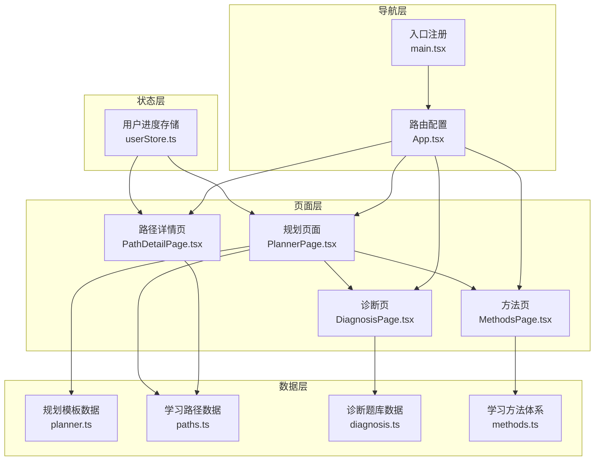
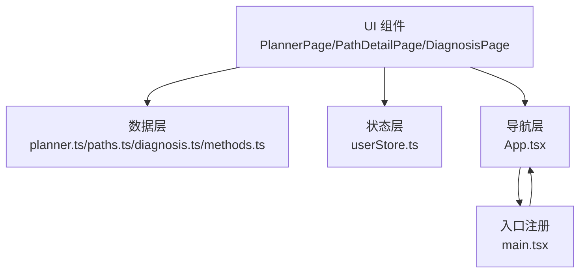
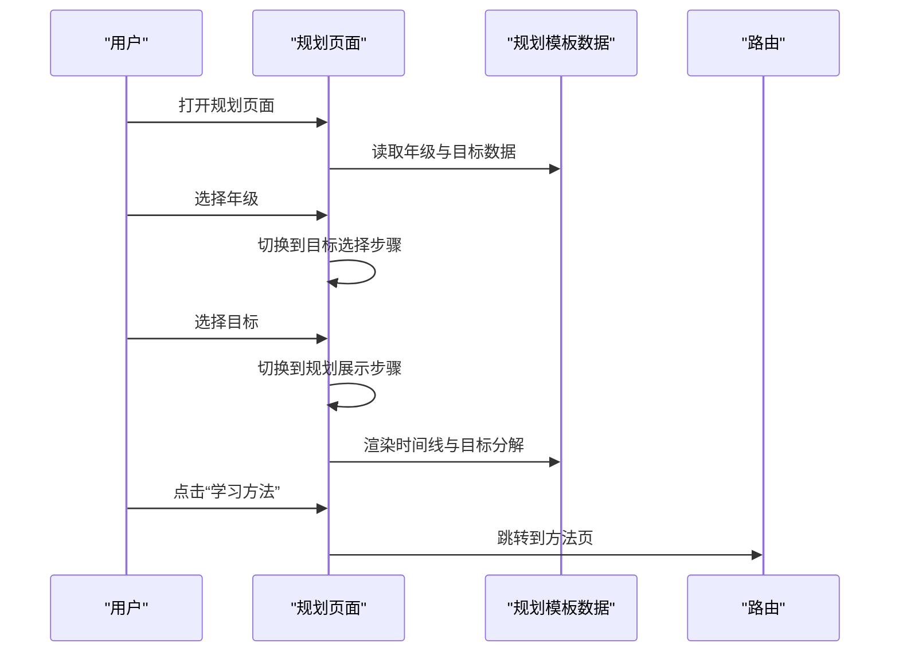
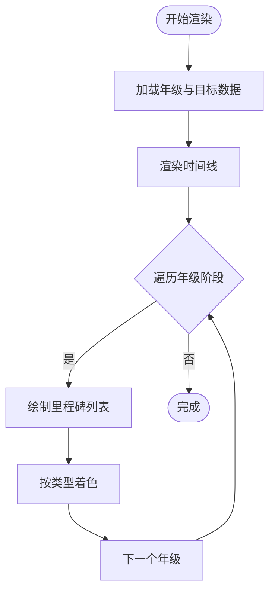
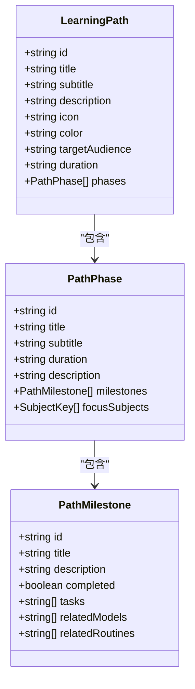
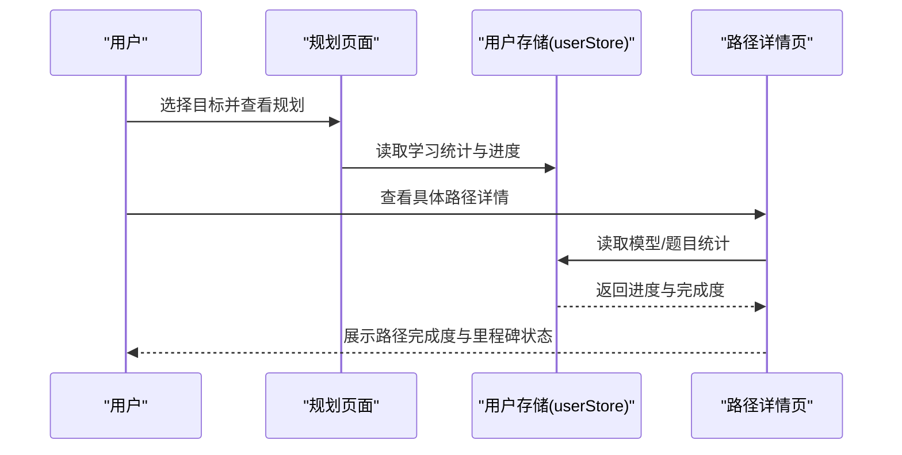
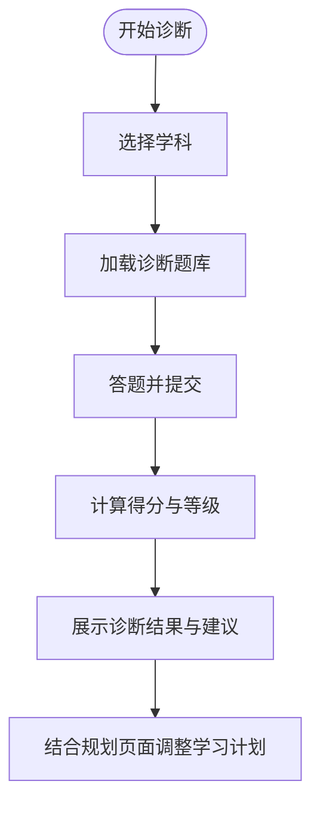
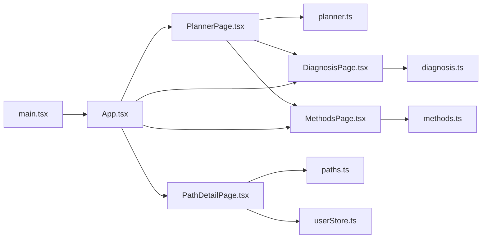

# 学习规划系统

<cite>
**本文档引用的文件**
- [src/sections/tools/PlannerPage.tsx](file://src/sections/tools/PlannerPage.tsx)
- [src/data/tools/planner.ts](file://src/data/tools/planner.ts)
- [src/data/tools/paths.ts](file://src/data/tools/paths.ts)
- [src/data/tools/diagnosis.ts](file://src/data/tools/diagnosis.ts)
- [src/data/tools/methods.ts](file://src/data/tools/methods.ts)
- [src/stores/userStore.ts](file://src/stores/userStore.ts)
- [src/App.tsx](file://src/App.tsx)
- [src/main.tsx](file://src/main.tsx)
- [src/hooks/useSubjectData.ts](file://src/hooks/useSubjectData.ts)
- [src/data/registry.ts](file://src/data/registry.ts)
- [src/data/subjects.ts](file://src/data/subjects.ts)
- [src/sections/tools/PathDetailPage.tsx](file://src/sections/tools/PathDetailPage.tsx)
- [src/sections/tools/DiagnosisPage.tsx](file://src/sections/tools/DiagnosisPage.tsx)
</cite>

## 目录
1. [引言](#引言)
2. [项目结构](#项目结构)
3. [核心组件](#核心组件)
4. [架构总览](#架构总览)
5. [详细组件分析](#详细组件分析)
6. [依赖分析](#依赖分析)
7. [性能考虑](#性能考虑)
8. [故障排除指南](#故障排除指南)
9. [结论](#结论)
10. [附录](#附录)

## 引言
本文件面向星耀平台的“学习规划系统”，系统性阐述规划页面的设计理念、实现架构与交互体验，并深入解析时间线算法、目标设定与里程碑管理、进度跟踪机制、数据存储与用户学习进度关联、模板与自定义目标、里程碑设置等核心功能。文档同时提供用户体验优化与执行跟踪的最佳实践建议，帮助开发者与产品人员高效理解与迭代该系统。

## 项目结构
学习规划系统由“规划页面”“路径数据”“诊断与方法体系”“用户进度存储”“路由与导航”等多个模块构成，采用分层与模块化组织方式：
- 页面层：规划页面、路径详情页、诊断页、方法页等
- 数据层：规划模板数据、学习路径数据、诊断题库、学习方法体系
- 状态层：用户学习进度与统计的本地持久化存储
- 导航层：基于 React Router 的路由配置与懒加载

图表来源
- [src/sections/tools/PlannerPage.tsx:1-344](file://src/sections/tools/PlannerPage.tsx#L1-L344)
- [src/data/tools/planner.ts:1-145](file://src/data/tools/planner.ts#L1-L145)
- [src/data/tools/paths.ts:1-515](file://src/data/tools/paths.ts#L1-L515)
- [src/data/tools/diagnosis.ts:1-294](file://src/data/tools/diagnosis.ts#L1-L294)
- [src/data/tools/methods.ts:1-252](file://src/data/tools/methods.ts#L1-L252)
- [src/stores/userStore.ts:1-236](file://src/stores/userStore.ts#L1-L236)
- [src/App.tsx:1-214](file://src/App.tsx#L1-L214)
- [src/main.tsx:1-19](file://src/main.tsx#L1-L19)

章节来源
- [src/App.tsx:1-214](file://src/App.tsx#L1-L214)
- [src/main.tsx:1-19](file://src/main.tsx#L1-L19)

## 核心组件
- 规划页面（PlannerPage）：提供“年级选择—目标选择—规划展示”的三步引导，渲染三年时间线与关键里程碑，展示目标分解与当前阶段重点。
- 学习路径数据（paths.ts）：定义三条主线路径（高考/强基/竞赛），包含阶段、里程碑、任务与关联模型，提供进度计算工具函数。
- 规划模板数据（planner.ts）：定义年级阶段、里程碑类型、学习目标与目标指标，支撑规划页面的可视化呈现。
- 诊断与方法体系（diagnosis.ts、methods.ts）：为用户提供能力诊断与学习方法指导，辅助规划落地。
- 用户进度存储（userStore.ts）：持久化用户学习进度、错题记录、做题统计等，为个性化与进度跟踪提供基础。
- 路由与入口（App.tsx、main.tsx）：统一配置路由与模块懒加载，注册学科数据。

章节来源
- [src/sections/tools/PlannerPage.tsx:1-344](file://src/sections/tools/PlannerPage.tsx#L1-L344)
- [src/data/tools/paths.ts:1-515](file://src/data/tools/paths.ts#L1-L515)
- [src/data/tools/planner.ts:1-145](file://src/data/tools/planner.ts#L1-L145)
- [src/data/tools/diagnosis.ts:1-294](file://src/data/tools/diagnosis.ts#L1-L294)
- [src/data/tools/methods.ts:1-252](file://src/data/tools/methods.ts#L1-L252)
- [src/stores/userStore.ts:1-236](file://src/stores/userStore.ts#L1-L236)
- [src/App.tsx:1-214](file://src/App.tsx#L1-L214)
- [src/main.tsx:1-19](file://src/main.tsx#L1-L19)

## 架构总览
系统采用“页面-数据-状态-导航”的分层架构：
- 页面层负责交互与展示，如规划页面的三步流程与时间线渲染。
- 数据层提供结构化的模板与路径数据，支撑页面动态渲染。
- 状态层通过本地持久化存储用户进度，为个性化与进度跟踪提供依据。
- 导航层统一管理路由与模块加载，保证首屏性能与可维护性。

图表来源
- [src/sections/tools/PlannerPage.tsx:1-344](file://src/sections/tools/PlannerPage.tsx#L1-L344)
- [src/sections/tools/PathDetailPage.tsx:1-269](file://src/sections/tools/PathDetailPage.tsx#L1-L269)
- [src/data/tools/planner.ts:1-145](file://src/data/tools/planner.ts#L1-L145)
- [src/data/tools/paths.ts:1-515](file://src/data/tools/paths.ts#L1-L515)
- [src/data/tools/diagnosis.ts:1-294](file://src/data/tools/diagnosis.ts#L1-L294)
- [src/data/tools/methods.ts:1-252](file://src/data/tools/methods.ts#L1-L252)
- [src/stores/userStore.ts:1-236](file://src/stores/userStore.ts#L1-L236)
- [src/App.tsx:1-214](file://src/App.tsx#L1-L214)
- [src/main.tsx:1-19](file://src/main.tsx#L1-L19)

## 详细组件分析

### 规划页面（PlannerPage）
- 设计理念：以“年级—目标—规划”三步流程降低认知负担，通过可视化时间线与里程碑帮助用户建立清晰的三年学习蓝图。
- 交互设计：
  - 步骤一：选择年级，按阶段（衔接/高一/高二/高三）展示不同颜色与标签。
  - 步骤二：选择目标（高考/强基/竞赛），展示目标描述与三年目标指标。
  - 步骤三：展示三年关键里程碑、目标分解与当前阶段重点，并提供“重新规划”“学习方法”等入口。
- 可视化呈现：
  - 时间线：左侧时间轴，按年级阶段绘制里程碑，按类型（考试/检查点/决策/事件）着色。
  - 目标分解：按学年展示目标与指标，提供“进入学习”跳转。
  - 重点关注：列出当前阶段学习重点，提供“能力诊断”“学习方法”快捷入口。

图表来源
- [src/sections/tools/PlannerPage.tsx:1-344](file://src/sections/tools/PlannerPage.tsx#L1-L344)
- [src/data/tools/planner.ts:1-145](file://src/data/tools/planner.ts#L1-L145)
- [src/App.tsx:1-214](file://src/App.tsx#L1-L214)

章节来源
- [src/sections/tools/PlannerPage.tsx:1-344](file://src/sections/tools/PlannerPage.tsx#L1-L344)
- [src/data/tools/planner.ts:1-145](file://src/data/tools/planner.ts#L1-L145)

### 时间线算法与里程碑管理
- 时间线数据结构：
  - 年级阶段（GradeLevel）：包含里程碑数组（Milestone），每个里程碑包含类型（exam/checkpoint/decision/event）、月份与描述。
  - 学习目标（LearningGoal）：包含目标指标（metrics），按学年分解。
- 里程碑类型与颜色：
  - 类型映射：考试（红色）、检查点（蓝色）、决策（紫色）、事件（绿色），用于视觉区分。
- 渲染策略：
  - 以年级为单位遍历，绘制时间轴节点与里程碑列表，按类型着色显示。
  - 支持与推荐路径联动，点击“进入学习”跳转至对应学科模块。

图表来源
- [src/sections/tools/PlannerPage.tsx:208-251](file://src/sections/tools/PlannerPage.tsx#L208-L251)
- [src/data/tools/planner.ts:15-22](file://src/data/tools/planner.ts#L15-L22)

章节来源
- [src/sections/tools/PlannerPage.tsx:208-251](file://src/sections/tools/PlannerPage.tsx#L208-L251)
- [src/data/tools/planner.ts:40-105](file://src/data/tools/planner.ts#L40-L105)

### 学习路径与里程碑（paths.ts）
- 路径结构：
  - LearningPath：包含标题、副标题、描述、图标、颜色、受众、时长与阶段数组。
  - PathPhase：包含阶段标题、描述、持续时间、里程碑数组与重点学科。
  - PathMilestone：包含里程碑标题、描述、完成状态、任务清单与关联模型/套路。
- 进度计算：
  - 提供 calculatePathProgress 函数，遍历所有阶段与里程碑，统计完成数量与总数，返回百分比进度。

图表来源
- [src/data/tools/paths.ts:44-54](file://src/data/tools/paths.ts#L44-L54)
- [src/data/tools/paths.ts:19-30](file://src/data/tools/paths.ts#L19-L30)
- [src/data/tools/paths.ts:32-41](file://src/data/tools/paths.ts#L32-L41)

章节来源
- [src/data/tools/paths.ts:1-515](file://src/data/tools/paths.ts#L1-L515)
- [src/data/tools/paths.ts:501-514](file://src/data/tools/paths.ts#L501-L514)

### 规划数据存储与用户学习进度关联
- 用户进度存储：
  - userStore.ts 提供用户信息、进度记录、错题记录、做题统计与学习统计的持久化存储接口。
  - 支持按知识点更新进度、记录错题、统计正确/错误/掌握数量、聚合模型学习统计。
- 与规划的关联：
  - 规划页面展示的目标指标与里程碑可作为用户进度的参考维度，结合 userStore 的统计可用于个性化提醒与调整。
  - 路径详情页的完成度计算可与 userStore 的模型/题目统计联动，形成闭环。

图表来源
- [src/stores/userStore.ts:1-236](file://src/stores/userStore.ts#L1-L236)
- [src/data/tools/paths.ts:501-514](file://src/data/tools/paths.ts#L501-L514)
- [src/sections/tools/PathDetailPage.tsx:50-269](file://src/sections/tools/PathDetailPage.tsx#L50-L269)

章节来源
- [src/stores/userStore.ts:1-236](file://src/stores/userStore.ts#L1-L236)
- [src/sections/tools/PathDetailPage.tsx:50-269](file://src/sections/tools/PathDetailPage.tsx#L50-L269)

### 诊断与方法体系（diagnosis.ts、methods.ts）
- 诊断（diagnosis.ts）：
  - 提供物理/化学/数学等学科的诊断题库，按难度分组，支持计算等级与描述。
  - 诊断结果可作为规划调整的依据，例如薄弱环节提示与学习建议。
- 方法（methods.ts）：
  - 提供费曼学习法、间隔重复法、检索练习、联想链接法、主动学习法等体系化方法，配套场景、示例与自评。
  - 与规划页面联动，提供“学习方法”入口，帮助用户将规划转化为行动。

图表来源
- [src/data/tools/diagnosis.ts:1-294](file://src/data/tools/diagnosis.ts#L1-L294)
- [src/sections/tools/DiagnosisPage.tsx:401-434](file://src/sections/tools/DiagnosisPage.tsx#L401-L434)
- [src/data/tools/methods.ts:1-252](file://src/data/tools/methods.ts#L1-L252)

章节来源
- [src/data/tools/diagnosis.ts:1-294](file://src/data/tools/diagnosis.ts#L1-L294)
- [src/data/tools/methods.ts:1-252](file://src/data/tools/methods.ts#L1-L252)
- [src/sections/tools/DiagnosisPage.tsx:401-434](file://src/sections/tools/DiagnosisPage.tsx#L401-L434)

### 路由与入口（App.tsx、main.tsx）
- 路由配置：
  - 统一注册学科模块、学习工具（诊断/规划/方法）、路径详情等路由。
  - 支持模块懒加载与竞赛专区共用代码块，优化首屏性能。
- 入口注册：
  - 在 main.tsx 中注册所有学科数据，触发数据注册与可用性初始化。

章节来源
- [src/App.tsx:1-214](file://src/App.tsx#L1-L214)
- [src/main.tsx:1-19](file://src/main.tsx#L1-L19)

## 依赖分析
- 组件耦合：
  - 规划页面依赖规划模板数据与诊断/方法页，形成“规划—诊断—方法”的闭环。
  - 路径详情页依赖学习路径数据与用户存储，形成“路径—进度—反馈”的闭环。
- 外部依赖：
  - React Router 提供路由与导航；Zustand 持久化提供状态管理；Lucide 图标库提供可视化元素。
- 潜在风险：
  - 数据与页面的耦合度较高，建议通过统一的数据访问层（如 hooks）进一步解耦。
  - 路由与页面的懒加载配置需保持一致，避免重复打包与资源浪费。

图表来源
- [src/sections/tools/PlannerPage.tsx:1-344](file://src/sections/tools/PlannerPage.tsx#L1-L344)
- [src/data/tools/planner.ts:1-145](file://src/data/tools/planner.ts#L1-L145)
- [src/sections/tools/PathDetailPage.tsx:1-269](file://src/sections/tools/PathDetailPage.tsx#L1-L269)
- [src/data/tools/paths.ts:1-515](file://src/data/tools/paths.ts#L1-L515)
- [src/stores/userStore.ts:1-236](file://src/stores/userStore.ts#L1-L236)
- [src/data/tools/diagnosis.ts:1-294](file://src/data/tools/diagnosis.ts#L1-L294)
- [src/data/tools/methods.ts:1-252](file://src/data/tools/methods.ts#L1-L252)
- [src/App.tsx:1-214](file://src/App.tsx#L1-L214)
- [src/main.tsx:1-19](file://src/main.tsx#L1-L19)

章节来源
- [src/App.tsx:1-214](file://src/App.tsx#L1-L214)
- [src/main.tsx:1-19](file://src/main.tsx#L1-L19)

## 性能考虑
- 懒加载与代码分割：路由层采用懒加载与竞赛专区共用代码块，减少首屏体积，提升加载速度。
- 本地持久化：用户进度与统计数据通过持久化存储，避免频繁请求，提升交互流畅度。
- 数据结构优化：路径与里程碑采用扁平化数组，计算完成度时遍历成本低，适合高频更新场景。
- 建议：
  - 对大型数据（如题库、模型）采用分页或按需加载策略。
  - 对复杂计算（如多学科进度聚合）引入缓存与节流，避免频繁重算。

## 故障排除指南
- 路由跳转异常：
  - 检查路由配置与路径参数是否匹配，确认懒加载模块是否正确导出默认组件。
- 数据缺失或为空：
  - 校验数据注册流程（main.tsx 中的学科数据导入）是否执行，确认数据模块未被意外删除或修改。
- 进度统计不更新：
  - 检查 userStore 的更新接口是否被调用，确认持久化中间件配置正确。
- 里程碑完成度异常：
  - 核对 calculatePathProgress 的实现，确保 completed 字段与实际状态一致。

章节来源
- [src/App.tsx:1-214](file://src/App.tsx#L1-L214)
- [src/main.tsx:1-19](file://src/main.tsx#L1-L19)
- [src/stores/userStore.ts:1-236](file://src/stores/userStore.ts#L1-L236)
- [src/data/tools/paths.ts:501-514](file://src/data/tools/paths.ts#L501-L514)

## 结论
学习规划系统通过“年级—目标—规划”的三步流程与可视化时间线，帮助用户建立清晰的三年学习蓝图；结合诊断与方法体系，形成“规划—诊断—方法—执行—反馈”的闭环。路径数据与用户进度存储为个性化与进度跟踪提供了坚实基础。建议在后续迭代中进一步解耦数据访问层、优化大数据加载与计算性能，并增强里程碑完成度与用户行为的联动提醒，以提升用户体验与执行效率。

## 附录
- 术语说明：
  - 里程碑：学习过程中的关键节点，包含类型、时间与描述。
  - 目标指标：按学年分解的具体学习目标与衡量标准。
  - 路径完成度：基于里程碑完成状态计算的总体进度百分比。
- 最佳实践：
  - 将“目标指标”与“里程碑”对齐，确保可量化与可追踪。
  - 结合诊断结果动态调整目标与里程碑，保持规划的灵活性。
  - 通过方法体系与路径详情页形成“方法—路径—执行”的闭环，提升学习效果。