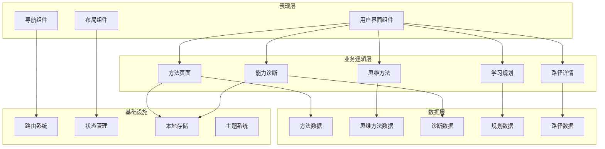
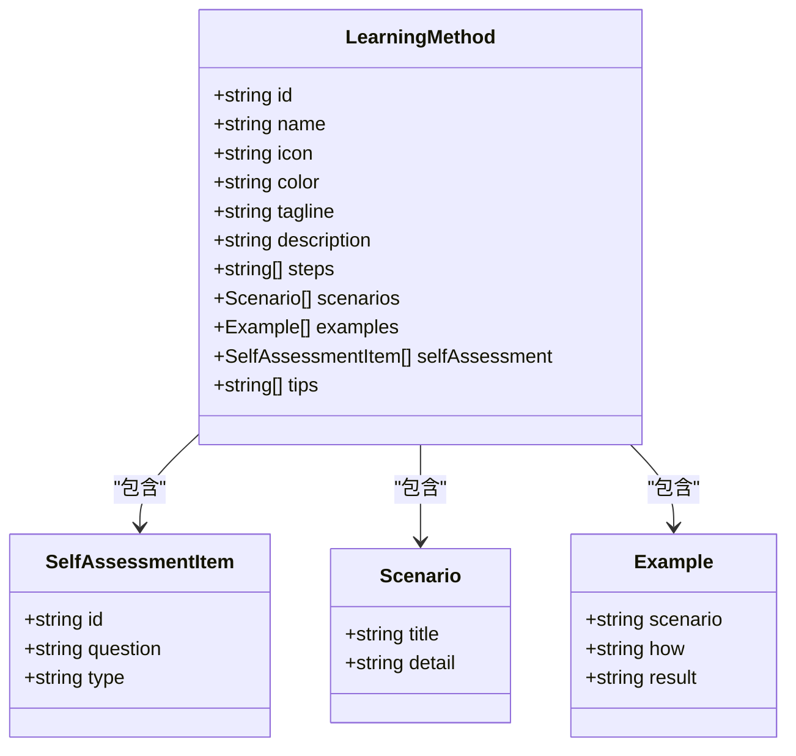
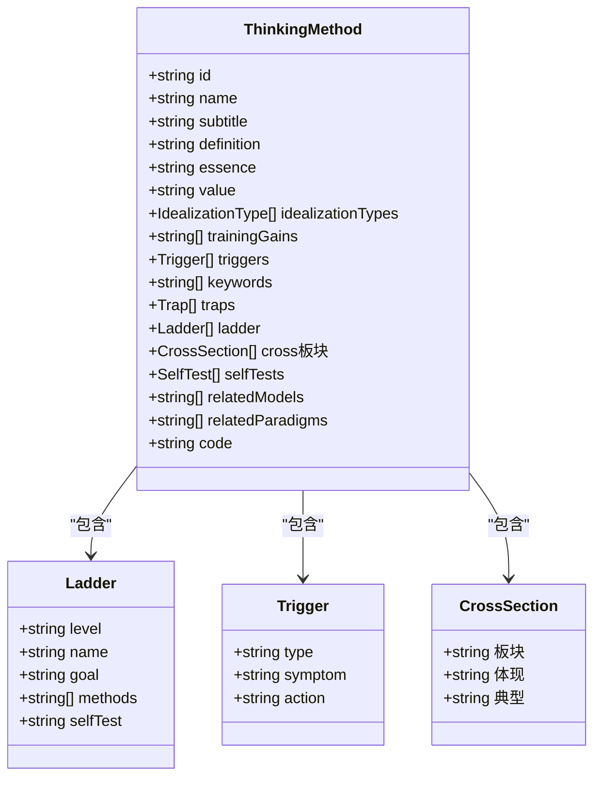
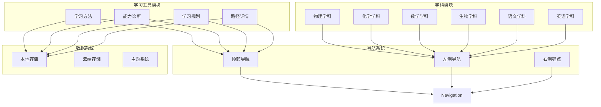
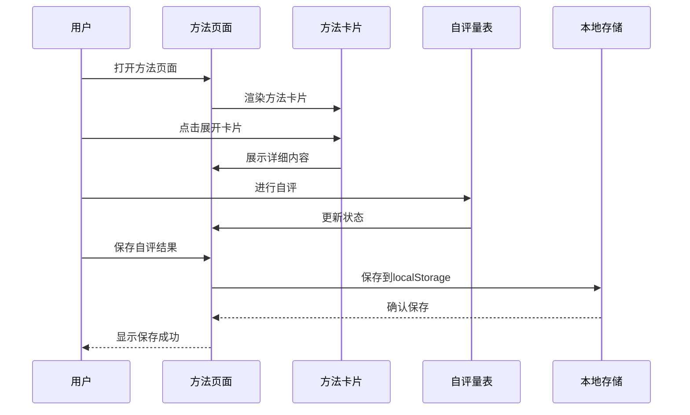
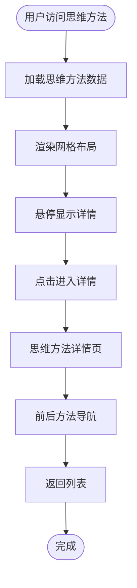
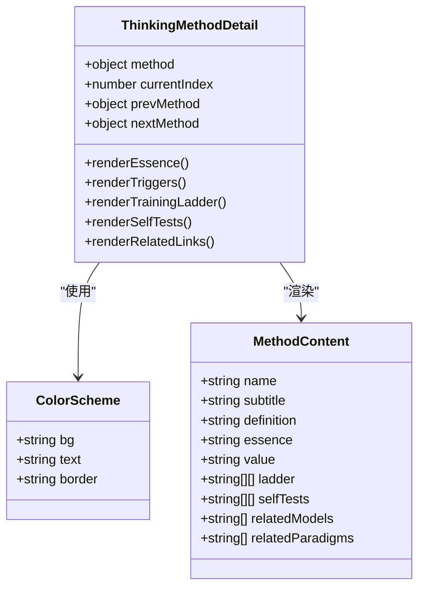
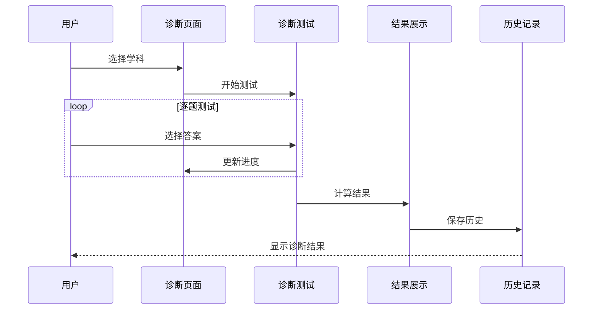
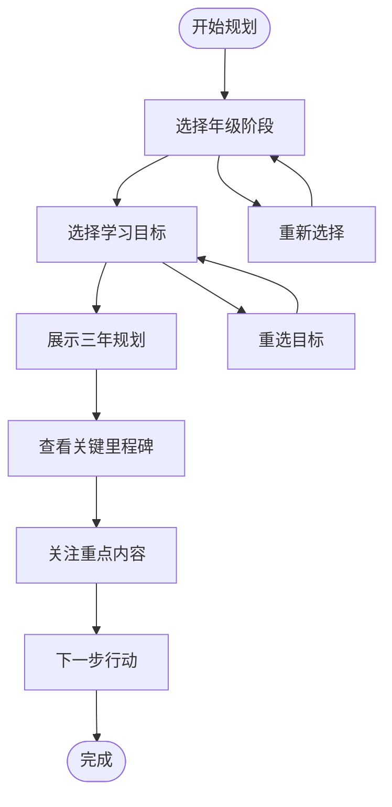
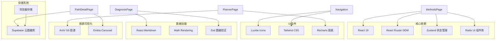

# 方法论指导系统

<cite>
**本文档引用的文件**
- [src/sections/tools/MethodsPage.tsx](file://src/sections/tools/MethodsPage.tsx)
- [src/data/tools/methods.ts](file://src/data/tools/methods.ts)
- [src/sections/physics/ThinkingMethodList.tsx](file://src/sections/physics/ThinkingMethodList.tsx)
- [src/sections/physics/ThinkingMethodDetail.tsx](file://src/sections/physics/ThinkingMethodDetail.tsx)
- [src/data/physics/thinkingMethods.ts](file://src/data/physics/thinkingMethods.ts)
- [src/components/MarkdownRenderer.tsx](file://src/components/MarkdownRenderer.tsx)
- [src/sections/tools/DiagnosisPage.tsx](file://src/sections/tools/DiagnosisPage.tsx)
- [src/data/tools/diagnosis.ts](file://src/data/tools/diagnosis.ts)
- [src/sections/tools/PlannerPage.tsx](file://src/sections/tools/PlannerPage.tsx)
- [src/data/tools/planner.ts](file://src/data/tools/planner.ts)
- [src/sections/tools/PathDetailPage.tsx](file://src/sections/tools/PathDetailPage.tsx)
- [src/App.tsx](file://src/App.tsx)
- [src/components/layout/Navigation.tsx](file://src/components/layout/Navigation.tsx)
- [src/types/index.ts](file://src/types/index.ts)
- [package.json](file://package.json)
</cite>

## 目录
1. [项目概述](#项目概述)
2. [系统架构](#系统架构)
3. [核心组件](#核心组件)
4. [架构总览](#架构总览)
5. [详细组件分析](#详细组件分析)
6. [依赖关系分析](#依赖关系分析)
7. [性能考虑](#性能考虑)
8. [故障排除指南](#故障排除指南)
9. [结论](#结论)

## 项目概述

星耀平台方法论指导系统是一个面向高中生的科学学习方法论体系，旨在通过系统化的学习方法、思维训练和个性化指导，提升学习效率和效果。系统围绕"五种高效学习方法"和"七个物理思维方法"两大核心体系构建，提供从方法学习到实践应用的完整指导。

系统采用现代化的前端技术栈，基于React 19和Vite构建，支持响应式设计和渐进式Web应用特性。通过模块化的架构设计，实现了方法卡片管理、自评量表、学习路径规划、能力诊断等功能的有机结合。

## 系统架构

星耀平台采用分层架构设计，主要分为以下层次：

**图表来源**
- [src/App.tsx:1-214](file://src/App.tsx#L1-L214)
- [src/components/layout/Navigation.tsx:1-719](file://src/components/layout/Navigation.tsx#L1-L719)

**章节来源**
- [src/App.tsx:1-214](file://src/App.tsx#L1-L214)
- [src/components/layout/Navigation.tsx:1-719](file://src/components/layout/Navigation.tsx#L1-L719)

## 核心组件

### 方法卡片管理系统

系统的核心是五种高效学习方法的卡片化展示，每种方法包含完整的知识结构：

**图表来源**
- [src/data/tools/methods.ts:3-22](file://src/data/tools/methods.ts#L3-L22)

### 思维方法体系

物理思维方法采用七维认知框架，每个方法都有完整的训练体系：

**图表来源**
- [src/data/physics/thinkingMethods.ts:4-49](file://src/data/physics/thinkingMethods.ts#L4-L49)

**章节来源**
- [src/data/tools/methods.ts:23-252](file://src/data/tools/methods.ts#L23-L252)
- [src/data/physics/thinkingMethods.ts:51-691](file://src/data/physics/thinkingMethods.ts#L51-L691)

## 架构总览

系统采用模块化设计理念，通过路由系统实现功能模块的解耦：

**图表来源**
- [src/App.tsx:78-210](file://src/App.tsx#L78-L210)
- [src/components/layout/Navigation.tsx:369-719](file://src/components/layout/Navigation.tsx#L369-L719)

**章节来源**
- [src/App.tsx:69-214](file://src/App.tsx#L69-L214)
- [src/components/layout/Navigation.tsx:1-719](file://src/components/layout/Navigation.tsx#L1-L719)

## 详细组件分析

### 方法页面组件

方法页面是系统的核心交互组件，实现了方法卡片的动态展示和用户交互：

**图表来源**
- [src/sections/tools/MethodsPage.tsx:18-342](file://src/sections/tools/MethodsPage.tsx#L18-L342)

方法页面的主要功能包括：

1. **方法卡片管理**：支持方法的展开/折叠、进度显示、颜色标识
2. **自评量表系统**：提供yes/no和5分制评分两种评估模式
3. **进度跟踪**：实时计算和显示方法掌握进度
4. **本地存储**：使用localStorage持久化用户评估数据

**章节来源**
- [src/sections/tools/MethodsPage.tsx:18-342](file://src/sections/tools/MethodsPage.tsx#L18-L342)

### 思维方法列表组件

思维方法列表提供了七种物理思维方法的概览展示：

**图表来源**
- [src/sections/physics/ThinkingMethodList.tsx:15-109](file://src/sections/physics/ThinkingMethodList.tsx#L15-L109)

**章节来源**
- [src/sections/physics/ThinkingMethodList.tsx:15-109](file://src/sections/physics/ThinkingMethodList.tsx#L15-L109)

### 思维方法详情组件

详情页面展示了每个思维方法的完整知识结构：

**图表来源**
- [src/sections/physics/ThinkingMethodDetail.tsx:15-353](file://src/sections/physics/ThinkingMethodDetail.tsx#L15-L353)

**章节来源**
- [src/sections/physics/ThinkingMethodDetail.tsx:15-353](file://src/sections/physics/ThinkingMethodDetail.tsx#L15-L353)

### 能力诊断系统

诊断系统提供了学科能力的快速评估功能：

**图表来源**
- [src/sections/tools/DiagnosisPage.tsx:31-435](file://src/sections/tools/DiagnosisPage.tsx#L31-L435)

**章节来源**
- [src/sections/tools/DiagnosisPage.tsx:31-435](file://src/sections/tools/DiagnosisPage.tsx#L31-L435)

### 学习规划系统

规划系统支持三种不同的学习目标路径：

**图表来源**
- [src/sections/tools/PlannerPage.tsx:42-344](file://src/sections/tools/PlannerPage.tsx#L42-L344)

**章节来源**
- [src/sections/tools/PlannerPage.tsx:42-344](file://src/sections/tools/PlannerPage.tsx#L42-L344)

## 依赖关系分析

系统采用模块化依赖管理，主要依赖关系如下：

**图表来源**
- [package.json:14-66](file://package.json#L14-L66)

**章节来源**
- [package.json:14-86](file://package.json#L14-L86)

## 性能考虑

系统在性能优化方面采用了多项策略：

### 代码分割与懒加载
- 使用React.lazy实现组件的按需加载
- 竞赛专区组件共享同一代码块
- 题库相关组件采用动态导入

### 状态管理优化
- 采用Zustand进行轻量级状态管理
- 局部状态与全局状态分离
- 避免不必要的组件重渲染

### 数据缓存策略
- 本地存储用于用户偏好和进度数据
- 服务器端数据缓存减少请求次数
- 图片和静态资源CDN加速

### 渲染性能优化
- 使用虚拟滚动处理大量数据
- 图表组件按需渲染
- 图片懒加载和格式优化

## 故障排除指南

### 常见问题及解决方案

**方法页面无法展开**
- 检查localStorage权限设置
- 清除浏览器缓存后重试
- 确认网络连接正常

**自评量表数据丢失**
- 检查浏览器隐私设置
- 确认localStorage未被清理
- 尝试在不同浏览器中登录

**导航菜单显示异常**
- 刷新页面清除缓存
- 检查网络代理设置
- 确认字体资源加载完成

**图表渲染失败**
- 检查JavaScript执行权限
- 确认网络连接稳定
- 清除浏览器缓存

**章节来源**
- [src/sections/tools/MethodsPage.tsx:36-46](file://src/sections/tools/MethodsPage.tsx#L36-L46)
- [src/sections/tools/DiagnosisPage.tsx:68-77](file://src/sections/tools/DiagnosisPage.tsx#L68-L77)

## 结论

星耀平台方法论指导系统通过精心设计的架构和丰富的功能模块，为学生提供了完整的科学学习方法论指导。系统的核心优势包括：

1. **系统化的学习方法**：五种高效学习方法的完整体系
2. **深度的思维训练**：七个物理思维方法的认知框架
3. **个性化的学习路径**：基于能力诊断的定制化规划
4. **实用的工具支持**：从方法学习到实践应用的全流程指导

系统采用现代化的技术栈和模块化设计，具有良好的可扩展性和维护性。通过本地存储和云端同步的双重保障，确保用户数据的安全性和完整性。

未来可以进一步扩展的功能包括：
- 更智能的个性化推荐算法
- 学习效果的量化分析
- 社区互动和经验分享功能
- 多设备同步和离线访问支持