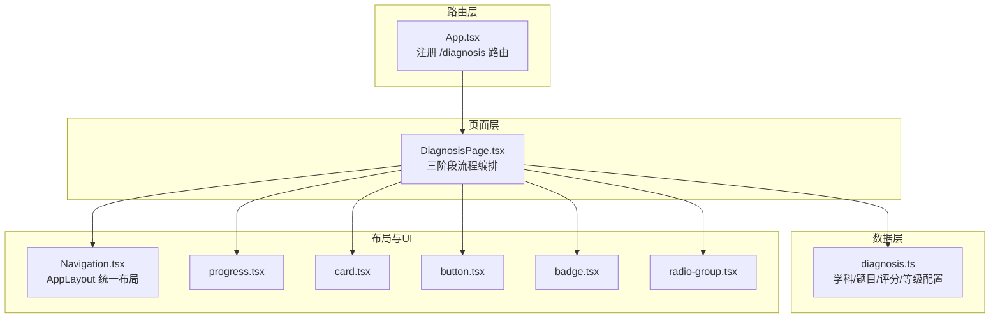
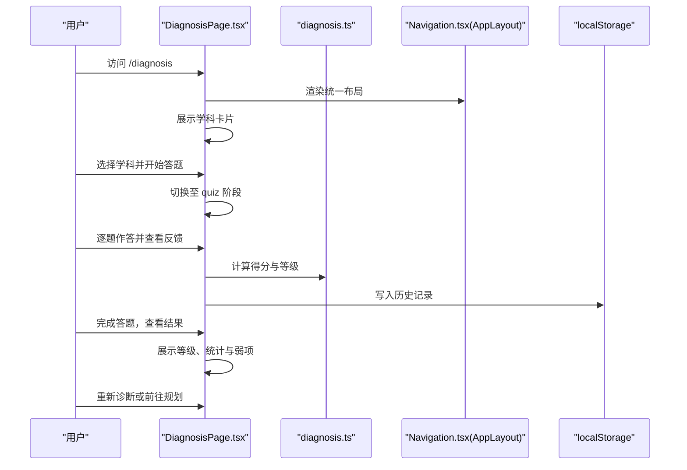
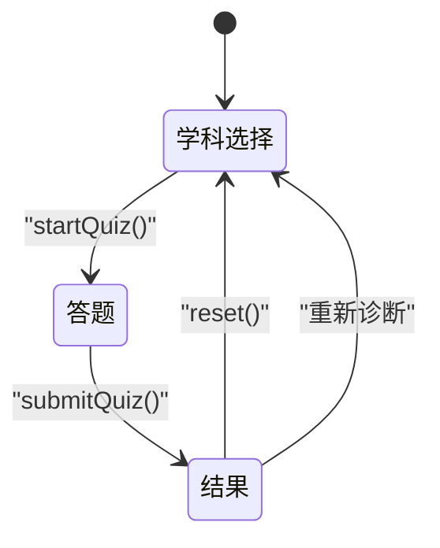
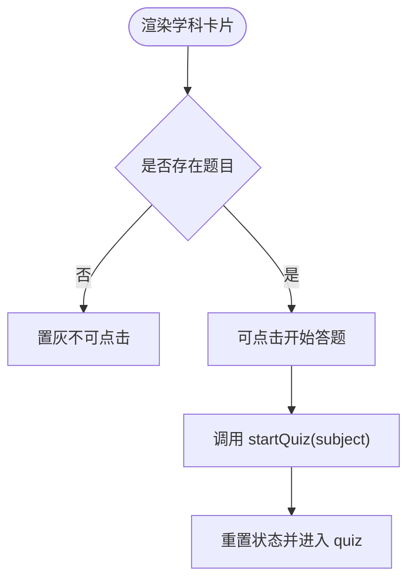
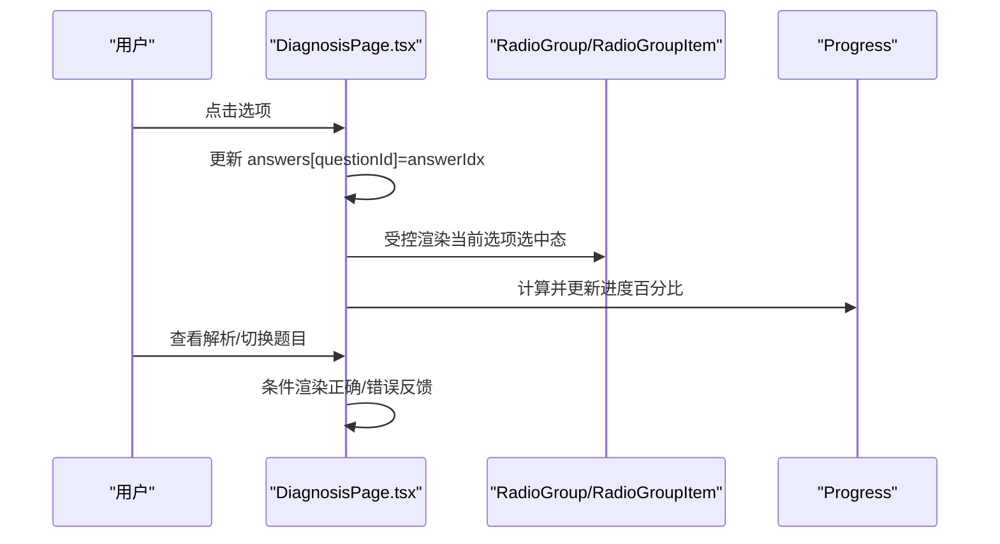
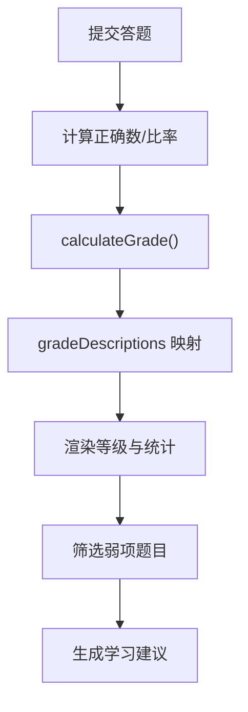
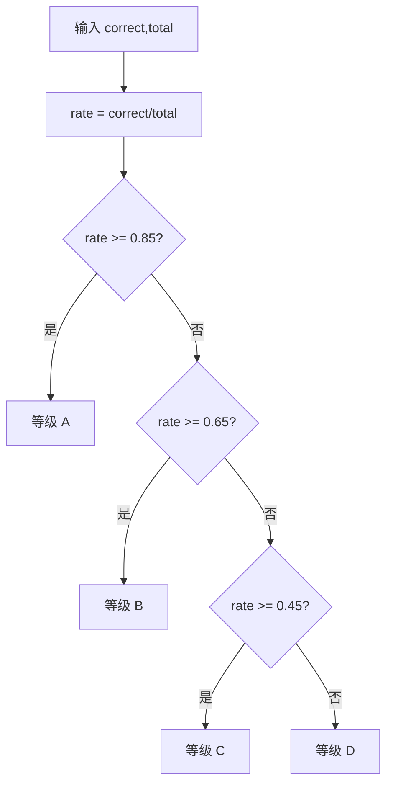
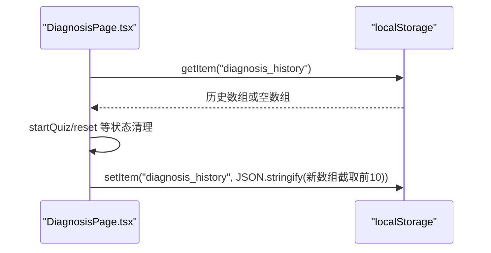
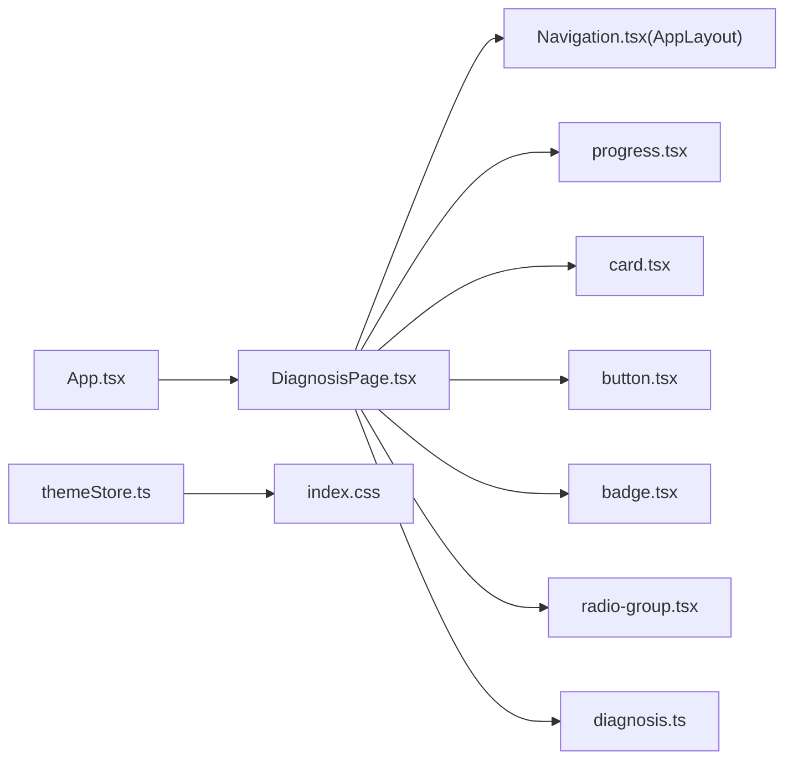

# 诊断评估系统

<cite>
**本文引用的文件**
- [DiagnosisPage.tsx](file://src/sections/tools/DiagnosisPage.tsx)
- [diagnosis.ts](file://src/data/tools/diagnosis.ts)
- [progress.tsx](file://src/components/ui/progress.tsx)
- [card.tsx](file://src/components/ui/card.tsx)
- [button.tsx](file://src/components/ui/button.tsx)
- [badge.tsx](file://src/components/ui/badge.tsx)
- [radio-group.tsx](file://src/components/ui/radio-group.tsx)
- [Navigation.tsx](file://src/components/layout/Navigation.tsx)
- [App.tsx](file://src/App.tsx)
- [useSubjectData.ts](file://src/hooks/useSubjectData.ts)
- [utils.ts](file://src/lib/utils.ts)
- [themeStore.ts](file://src/stores/themeStore.ts)
- [index.css](file://src/index.css)
- [package.json](file://package.json)
</cite>

## 目录
1. [简介](#简介)
2. [项目结构](#项目结构)
3. [核心组件](#核心组件)
4. [架构总览](#架构总览)
5. [详细组件分析](#详细组件分析)
6. [依赖分析](#依赖分析)
7. [性能考虑](#性能考虑)
8. [故障排查指南](#故障排查指南)
9. [结论](#结论)
10. [附录](#附录)

## 简介
本文件面向“星耀平台”的诊断评估系统，围绕诊断页面的三阶段流程（学科选择、答题、结果展示）进行深入技术解读，涵盖：
- 诊断算法（评分、等级划分、描述生成）
- 用户交互（进度条、答案反馈、弱项分析）
- 本地存储与历史记录管理
- 学科卡片、题目答题界面、结果页的实现要点
- 用户体验优化与功能扩展建议

## 项目结构
诊断页面位于工具区模块，采用路由直连组件的方式组织，配合统一布局与UI组件库实现一致的视觉与交互体验。

图示来源
- [App.tsx:200-205](file://src/App.tsx#L200-L205)
- [DiagnosisPage.tsx:1-435](file://src/sections/tools/DiagnosisPage.tsx#L1-L435)
- [diagnosis.ts:1-294](file://src/data/tools/diagnosis.ts#L1-L294)
- [Navigation.tsx:690-718](file://src/components/layout/Navigation.tsx#L690-L718)

章节来源
- [App.tsx:200-205](file://src/App.tsx#L200-L205)
- [DiagnosisPage.tsx:1-435](file://src/sections/tools/DiagnosisPage.tsx#L1-L435)

## 核心组件
- 诊断页面组件：负责三阶段流程的状态管理、交互与渲染，包含学科选择卡片、答题界面、结果展示与建议。
- 诊断数据模块：定义学科、题目、难度、答案索引、解析与评分算法。
- UI组件库：进度条、卡片、按钮、徽章、单选分组等，用于构建一致的交互体验。
- 布局组件：统一的 AppLayout 提供导航与页面骨架。

章节来源
- [DiagnosisPage.tsx:29-85](file://src/sections/tools/DiagnosisPage.tsx#L29-L85)
- [diagnosis.ts:4-294](file://src/data/tools/diagnosis.ts#L4-L294)
- [progress.tsx:1-30](file://src/components/ui/progress.tsx#L1-L30)
- [card.tsx:1-93](file://src/components/ui/card.tsx#L1-L93)
- [button.tsx:1-63](file://src/components/ui/button.tsx#L1-L63)
- [badge.tsx:1-47](file://src/components/ui/badge.tsx#L1-L47)
- [radio-group.tsx:1-46](file://src/components/ui/radio-group.tsx#L1-L46)
- [Navigation.tsx:690-718](file://src/components/layout/Navigation.tsx#L690-L718)

## 架构总览
诊断页面采用“页面组件 + 数据模块 + UI组件 + 布局”的分层架构：
- 页面组件集中处理状态与流程控制，调用数据模块的评分与等级描述，使用UI组件构建视图。
- 布局组件提供统一的导航与容器，保证跨页面一致性。
- 本地存储用于历史记录持久化，避免刷新丢失。

图示来源
- [DiagnosisPage.tsx:38-85](file://src/sections/tools/DiagnosisPage.tsx#L38-L85)
- [diagnosis.ts:263-294](file://src/data/tools/diagnosis.ts#L263-L294)
- [Navigation.tsx:690-718](file://src/components/layout/Navigation.tsx#L690-L718)

## 详细组件分析

### 三阶段流程与状态机
- 阶段标识：select（学科选择）、quiz（答题）、result（结果）。
- 状态字段：selectedSubject、currentQIndex、answers、result。
- 流程控制：startQuiz 切换到 quiz；submitQuiz 计算得分并切换到 result；reset 返回 select。

图示来源
- [DiagnosisPage.tsx:31-85](file://src/sections/tools/DiagnosisPage.tsx#L31-L85)

章节来源
- [DiagnosisPage.tsx:31-85](file://src/sections/tools/DiagnosisPage.tsx#L31-L85)

### 学科选择卡片
- 渲染逻辑：遍历 diagnosisSubjects，根据是否有题目决定可点击性与文案。
- 交互行为：点击卡片触发 startQuiz，清空答题状态并进入 quiz。
- 视觉要素：颜色块、首字母徽标、题目数量、右箭头指示。

图示来源
- [DiagnosisPage.tsx:105-131](file://src/sections/tools/DiagnosisPage.tsx#L105-L131)
- [diagnosis.ts:218-261](file://src/data/tools/diagnosis.ts#L218-L261)

章节来源
- [DiagnosisPage.tsx:105-131](file://src/sections/tools/DiagnosisPage.tsx#L105-L131)
- [diagnosis.ts:218-261](file://src/data/tools/diagnosis.ts#L218-L261)

### 答题界面与答案反馈
- 进度条：基于 currentQIndex 与总题数计算百分比，使用 Progress 组件展示。
- 题目卡片：展示难度徽章、主题标签、题目正文与选项列表。
- 单选交互：RadioGroupItem 与 RadioGroupItem 值绑定 answers[currentQ.id]，点击即记录答案。
- 答案反馈：若已作答，显示正确/错误图标与解析；最后题隐藏“下一题”按钮，改为“查看结果”。

图示来源
- [DiagnosisPage.tsx:190-311](file://src/sections/tools/DiagnosisPage.tsx#L190-L311)
- [radio-group.tsx:1-46](file://src/components/ui/radio-group.tsx#L1-L46)
- [progress.tsx:6-27](file://src/components/ui/progress.tsx#L6-L27)

章节来源
- [DiagnosisPage.tsx:190-311](file://src/sections/tools/DiagnosisPage.tsx#L190-L311)
- [radio-group.tsx:1-46](file://src/components/ui/radio-group.tsx#L1-L46)
- [progress.tsx:6-27](file://src/components/ui/progress.tsx#L6-L27)

### 结果展示与弱项分析
- 评分与等级：submitQuiz 调用 calculateGrade(correct,total) 获取等级 A/B/C/D。
- 等级描述：gradeDescriptions 提供标签、颜色与描述，用于结果页主题色与文案。
- 弱项分析：筛选 answers[q.id] !== q.correctAnswer 的题目，展示主题、题目与正确答案，并提供“去学习”链接。
- 建议：依据等级输出不同建议，引导进入规划或学习中心。

图示来源
- [DiagnosisPage.tsx:60-77](file://src/sections/tools/DiagnosisPage.tsx#L60-L77)
- [diagnosis.ts:263-294](file://src/data/tools/diagnosis.ts#L263-L294)

章节来源
- [DiagnosisPage.tsx:313-431](file://src/sections/tools/DiagnosisPage.tsx#L313-L431)
- [diagnosis.ts:263-294](file://src/data/tools/diagnosis.ts#L263-L294)

### 诊断算法实现
- 输入：correct（正确题数）、total（总题数）
- 计算：正确率 rate = correct/total
- 等级划分：
  - A：rate ≥ 0.85
  - B：rate ≥ 0.65
  - C：rate ≥ 0.45
  - D：否则
- 等级描述：包含标签、颜色与描述，用于结果页视觉与文案。

图示来源
- [diagnosis.ts:263-270](file://src/data/tools/diagnosis.ts#L263-L270)
- [diagnosis.ts:272-293](file://src/data/tools/diagnosis.ts#L272-L293)

章节来源
- [diagnosis.ts:263-294](file://src/data/tools/diagnosis.ts#L263-L294)

### 本地存储与历史记录管理
- 历史记录键名：diagnosis_history
- 存储结构：数组，每项包含 subject、correct、total、grade、date
- 写入时机：每次完成答题后写入，最多保留最近 10 条
- 读取时机：页面初始化时从 localStorage 恢复历史记录并在“历史诊断”卡片中展示

图示来源
- [DiagnosisPage.tsx:38-46](file://src/sections/tools/DiagnosisPage.tsx#L38-L46)
- [DiagnosisPage.tsx:68-73](file://src/sections/tools/DiagnosisPage.tsx#L68-L73)

章节来源
- [DiagnosisPage.tsx:38-46](file://src/sections/tools/DiagnosisPage.tsx#L38-L46)
- [DiagnosisPage.tsx:68-73](file://src/sections/tools/DiagnosisPage.tsx#L68-L73)

### 用户交互与可用性
- 进度条：实时反映当前题号与总题数，提升任务完成感
- 答案反馈：即时显示正确/错误与解析，强化学习闭环
- 弱项分析：按主题聚合错误题目，提供“去学习”直达入口
- 建议：根据等级给出差异化建议，引导后续学习路径
- 历史记录：在学科选择页展示最近诊断记录，便于追踪

章节来源
- [DiagnosisPage.tsx:200-217](file://src/sections/tools/DiagnosisPage.tsx#L200-L217)
- [DiagnosisPage.tsx:258-272](file://src/sections/tools/DiagnosisPage.tsx#L258-L272)
- [DiagnosisPage.tsx:355-390](file://src/sections/tools/DiagnosisPage.tsx#L355-L390)
- [DiagnosisPage.tsx:399-413](file://src/sections/tools/DiagnosisPage.tsx#L399-L413)
- [DiagnosisPage.tsx:133-171](file://src/sections/tools/DiagnosisPage.tsx#L133-L171)

## 依赖分析
- 路由与页面：App.tsx 注册 /diagnosis 路由，直接引入 DiagnosisPage
- 布局：DiagnosisPage 使用 Navigation.tsx 的 AppLayout
- UI 组件：进度条、卡片、按钮、徽章、单选组均由内部组件库提供
- 数据与算法：diagnosis.ts 提供学科、题目、评分与等级描述
- 主题与样式：Tailwind 基础变量与暗色主题开关由 themeStore 与 index.css 支持

图示来源
- [App.tsx:200-205](file://src/App.tsx#L200-L205)
- [DiagnosisPage.tsx:1-435](file://src/sections/tools/DiagnosisPage.tsx#L1-L435)
- [Navigation.tsx:690-718](file://src/components/layout/Navigation.tsx#L690-L718)
- [diagnosis.ts:1-294](file://src/data/tools/diagnosis.ts#L1-L294)
- [themeStore.ts:1-36](file://src/stores/themeStore.ts#L1-L36)
- [index.css:1-61](file://src/index.css#L1-L61)

章节来源
- [App.tsx:200-205](file://src/App.tsx#L200-L205)
- [Navigation.tsx:690-718](file://src/components/layout/Navigation.tsx#L690-L718)
- [diagnosis.ts:1-294](file://src/data/tools/diagnosis.ts#L1-L294)
- [themeStore.ts:1-36](file://src/stores/themeStore.ts#L1-L36)
- [index.css:1-61](file://src/index.css#L1-L61)

## 性能考虑
- 组件渲染：DiagnosisPage 以条件分支渲染三阶段视图，避免不必要的重渲染
- 状态粒度：answers 使用对象映射，按题 ID 存取，便于快速查询与更新
- 本地存储：历史记录仅保留最近 10 条，控制存储大小与解析成本
- UI 组件：Progress、RadioGroup 等均为轻量组件，按需引入，减少打包体积

## 故障排查指南
- 无法看到历史记录
  - 检查 localStorage 中键名为 diagnosis_history 的数据是否可解析
  - 若解析失败，组件会回退为空数组
- 答题完成后无法进入结果页
  - 确认 submitQuiz 是否被调用且 selectedSubject 存在
  - 确认 answers 是否已完整填写（最后题需全部作答）
- 等级显示异常
  - 检查 calculateGrade 的输入 correct/total 是否为有效数值
  - 确认 gradeDescriptions 中是否存在对应等级键
- 主题切换无效
  - 确认 themeStore.initTheme 是否在应用启动时执行
  - 检查 index.css 中 Tailwind 变量与 .dark 类是否生效

章节来源
- [DiagnosisPage.tsx:38-46](file://src/sections/tools/DiagnosisPage.tsx#L38-L46)
- [DiagnosisPage.tsx:60-77](file://src/sections/tools/DiagnosisPage.tsx#L60-L77)
- [diagnosis.ts:263-294](file://src/data/tools/diagnosis.ts#L263-L294)
- [themeStore.ts:26-30](file://src/stores/themeStore.ts#L26-L30)
- [index.css:27-46](file://src/index.css#L27-L46)

## 结论
诊断评估系统通过清晰的三阶段流程、简洁的评分与等级机制、完善的答案反馈与弱项分析，以及本地历史记录管理，为用户提供高效、直观的学科能力诊断体验。页面组件与数据模块解耦良好，UI 组件库统一了交互风格，布局组件确保跨页面一致性。建议后续可扩展为多学科联动分析与长期学习轨迹追踪，进一步增强个性化学习建议。

## 附录
- 术语
  - D1/D2/D3：难度等级（基础/进阶/挑战）
  - 等级 A/B/C/D：能力水平划分
- 参考实现路径
  - 学科与题目数据：[diagnosis.ts:218-261](file://src/data/tools/diagnosis.ts#L218-L261)
  - 评分与等级：[diagnosis.ts:263-294](file://src/data/tools/diagnosis.ts#L263-L294)
  - 页面流程与交互：[DiagnosisPage.tsx:31-431](file://src/sections/tools/DiagnosisPage.tsx#L31-L431)
  - 布局骨架：[Navigation.tsx:690-718](file://src/components/layout/Navigation.tsx#L690-L718)
  - UI 组件清单：[progress.tsx:1-30](file://src/components/ui/progress.tsx#L1-L30)、[card.tsx:1-93](file://src/components/ui/card.tsx#L1-L93)、[button.tsx:1-63](file://src/components/ui/button.tsx#L1-L63)、[badge.tsx:1-47](file://src/components/ui/badge.tsx#L1-L47)、[radio-group.tsx:1-46](file://src/components/ui/radio-group.tsx#L1-L46)
  - 主题与样式：[themeStore.ts:1-36](file://src/stores/themeStore.ts#L1-L36)、[index.css:1-61](file://src/index.css#L1-L61)
  - 路由注册：[App.tsx:200-205](file://src/App.tsx#L200-L205)