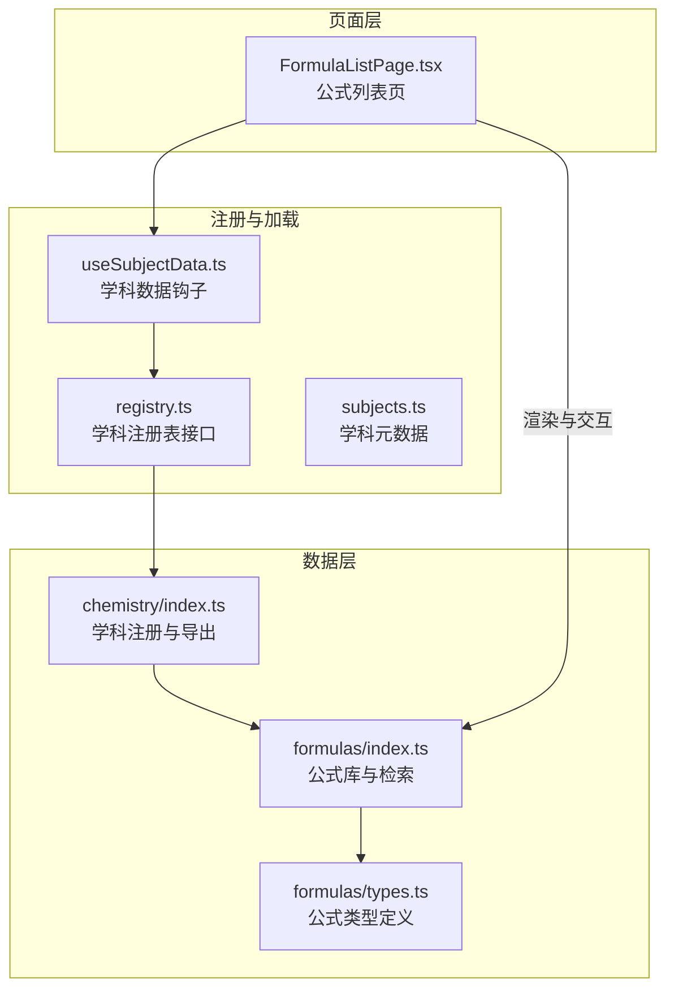
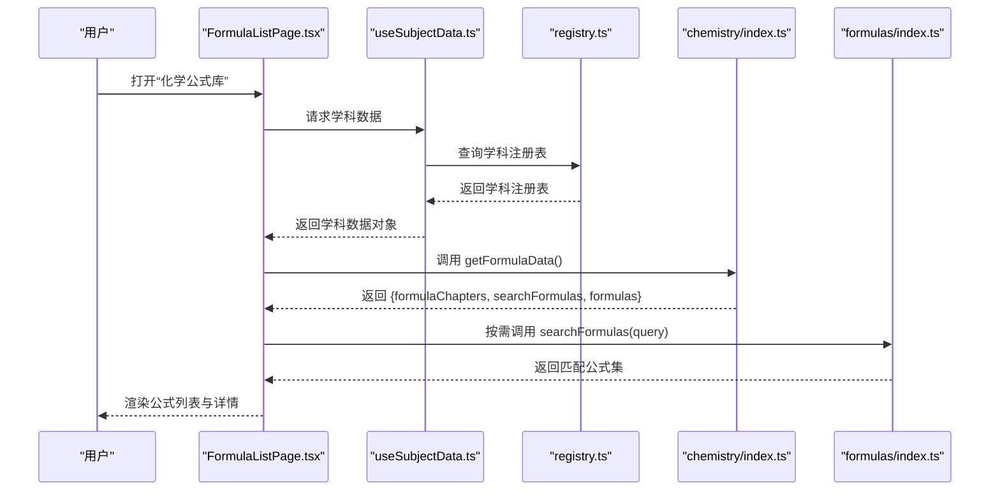
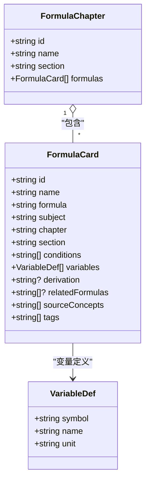
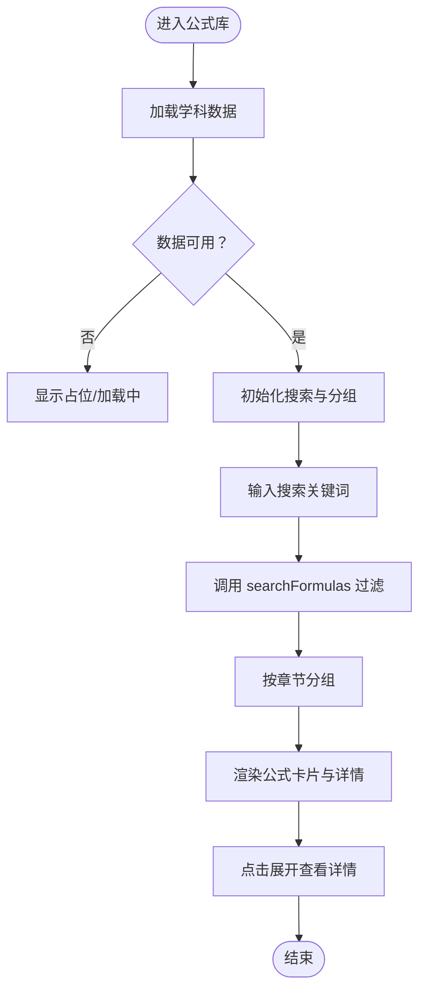
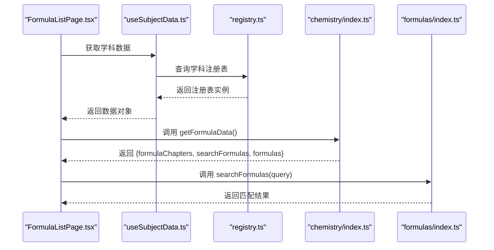
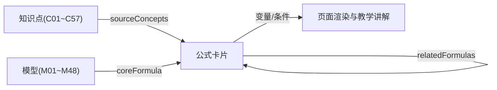
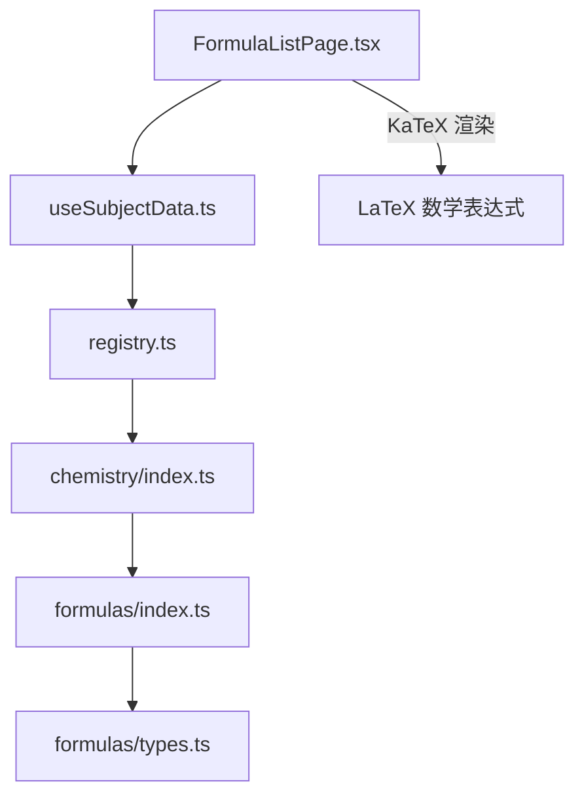

# 化学公式章节

<cite>
**本文引用的文件**
- [src/data/chemistry/formulas/index.ts](file://src/data/chemistry/formulas/index.ts)
- [src/data/chemistry/formulas/types.ts](file://src/data/chemistry/formulas/types.ts)
- [src/sections/FormulaListPage.tsx](file://src/sections/FormulaListPage.tsx)
- [src/hooks/useSubjectData.ts](file://src/hooks/useSubjectData.ts)
- [src/data/registry.ts](file://src/data/registry.ts)
- [src/data/subjects.ts](file://src/data/subjects.ts)
- [src/data/chemistry/index.ts](file://src/data/chemistry/index.ts)
- [src/data/chemistry/models/M01_物质分类树模型.ts](file://src/data/chemistry/models/M01_物质分类树模型.ts)
- [src/data/chemistry/models/M02_摩尔计算模型.ts](file://src/data/chemistry/models/M02_摩尔计算模型.ts)
- [src/data/chemistry/models/M11_热化学盖斯定律模型.ts](file://src/data/chemistry/models/M11_热化学盖斯定律模型.ts)
- [src/data/chemistry/concepts/C01_物质的分类.ts](file://src/data/chemistry/concepts/C01_物质的分类.ts)
- [src/data/chemistry/concepts/C03_物质的量.ts](file://src/data/chemistry/concepts/C03_物质的量.ts)
- [src/data/chemistry/concepts/C20_热化学方程式与盖斯定律.ts](file://src/data/chemistry/concepts/C20_热化学方程式与盖斯定律.ts)
- [src/data/chemistry/concepts/C21_化学反应速率.ts](file://src/data/chemistry/concepts/C21_化学反应速率.ts)
</cite>

## 目录
1. [引言](#引言)
2. [项目结构](#项目结构)
3. [核心组件](#核心组件)
4. [架构总览](#架构总览)
5. [详细组件分析](#详细组件分析)
6. [依赖分析](#依赖分析)
7. [性能考虑](#性能考虑)
8. [故障排查指南](#故障排查指南)
9. [结论](#结论)
10. [附录](#附录)

## 引言
本文件面向星耀平台“化学公式章节”的建设与使用，系统化阐述公式数据结构、检索机制、与知识点及模型的关联方式，并给出公式在不同模型与题型中的应用路径建议。目标是帮助教师与学生建立“公式—知识点—模型—题型”的知识网络，提升公式记忆与迁移应用能力。

## 项目结构
化学公式章节由“数据层（公式库与类型）+ 页面层（公式列表页）+ 注册与加载（学科注册与按需加载）”三层构成，采用与物理等其他学科一致的数据接口与页面渲染模式，确保跨学科一致性与可扩展性。

图示来源
- [src/sections/FormulaListPage.tsx:1-261](file://src/sections/FormulaListPage.tsx#L1-L261)
- [src/data/chemistry/index.ts:135-183](file://src/data/chemistry/index.ts#L135-L183)
- [src/data/chemistry/formulas/index.ts:1-19](file://src/data/chemistry/formulas/index.ts#L1-L19)
- [src/data/chemistry/formulas/types.ts:1-31](file://src/data/chemistry/formulas/types.ts#L1-L31)
- [src/data/registry.ts:4-38](file://src/data/registry.ts#L4-L38)
- [src/hooks/useSubjectData.ts:1-46](file://src/hooks/useSubjectData.ts#L1-L46)
- [src/data/subjects.ts:12-29](file://src/data/subjects.ts#L12-L29)

章节来源
- [src/sections/FormulaListPage.tsx:1-261](file://src/sections/FormulaListPage.tsx#L1-L261)
- [src/data/chemistry/index.ts:1-186](file://src/data/chemistry/index.ts#L1-L186)
- [src/data/chemistry/formulas/index.ts:1-19](file://src/data/chemistry/formulas/index.ts#L1-L19)
- [src/data/chemistry/formulas/types.ts:1-31](file://src/data/chemistry/formulas/types.ts#L1-L31)
- [src/data/registry.ts:1-52](file://src/data/registry.ts#L1-L52)
- [src/hooks/useSubjectData.ts:1-46](file://src/hooks/useSubjectData.ts#L1-L46)
- [src/data/subjects.ts:1-30](file://src/data/subjects.ts#L1-L30)

## 核心组件
- 公式卡片与章节数据结构：定义了公式名称、LaTeX 表达式、适用条件、变量说明、来源知识点、标签等字段，支持按名称、LaTeX 内容、标签进行检索。
- 公式检索函数：提供模糊检索能力，支持空查询返回全量公式。
- 公式列表页：提供按章节分组、搜索框、折叠面板、变量说明、适用条件、来源知识点链接、标签展示等功能。
- 学科注册与加载：统一暴露 getFormulaData/searchFormulas/getAllFormulas 等接口，供页面按需调用；支持按学科动态加载。

章节来源
- [src/data/chemistry/formulas/types.ts:10-31](file://src/data/chemistry/formulas/types.ts#L10-L31)
- [src/data/chemistry/formulas/index.ts:10-19](file://src/data/chemistry/formulas/index.ts#L10-L19)
- [src/sections/FormulaListPage.tsx:40-56](file://src/sections/FormulaListPage.tsx#L40-L56)
- [src/data/chemistry/index.ts:155-162](file://src/data/chemistry/index.ts#L155-L162)

## 架构总览
下图展示了“公式章节”在前端的整体调用链路：页面通过 useSubjectData 获取学科数据，再从学科注册表中获取公式数据与检索函数，最终渲染公式列表与详情。

图示来源
- [src/sections/FormulaListPage.tsx:20-40](file://src/sections/FormulaListPage.tsx#L20-L40)
- [src/hooks/useSubjectData.ts:7-46](file://src/hooks/useSubjectData.ts#L7-L46)
- [src/data/registry.ts:14-17](file://src/data/registry.ts#L14-L17)
- [src/data/chemistry/index.ts:155-162](file://src/data/chemistry/index.ts#L155-L162)
- [src/data/chemistry/formulas/index.ts:10-19](file://src/data/chemistry/formulas/index.ts#L10-L19)

## 详细组件分析

### 组件A：公式数据结构与检索
- 数据结构要点
  - 公式卡片包含：唯一ID、名称、LaTeX 表达式、所属章节/板块、适用条件数组、变量定义数组、推导说明、关联公式ID、来源知识点ID数组、标签数组。
  - 章节结构包含：章节ID、名称、板块、公式列表。
- 检索逻辑
  - 支持按名称、LaTeX 内容、标签进行模糊匹配；空查询返回全量公式。
- 使用建议
  - 在“适用条件”中明确边界与前提，避免误用。
  - “变量说明”应与“LaTeX 表达式”严格对应，便于渲染与理解。
  - “来源知识点”用于建立公式与概念的溯源关系，便于回溯学习。

图示来源
- [src/data/chemistry/formulas/types.ts:10-31](file://src/data/chemistry/formulas/types.ts#L10-L31)

章节来源
- [src/data/chemistry/formulas/types.ts:4-31](file://src/data/chemistry/formulas/types.ts#L4-L31)
- [src/data/chemistry/formulas/index.ts:10-19](file://src/data/chemistry/formulas/index.ts#L10-L19)

### 组件B：公式列表页（FormulaListPage）
- 功能特性
  - 加载态与占位提示：学科数据未就绪时显示加载中与“即将上线”提示。
  - 搜索：支持按名称、LaTeX、标签检索；清空输入恢复全量。
  - 分组：按章节分组展示；支持切换“全部/某章节”。
  - 展示：每个公式支持折叠展开，展示变量说明、适用条件、来源知识点链接、标签。
  - 数学渲染：使用 KaTeX 渲染 LaTeX 表达式。
- 交互流程

图示来源
- [src/sections/FormulaListPage.tsx:20-97](file://src/sections/FormulaListPage.tsx#L20-L97)
- [src/sections/FormulaListPage.tsx:115-242](file://src/sections/FormulaListPage.tsx#L115-L242)
- [src/data/chemistry/formulas/index.ts:10-19](file://src/data/chemistry/formulas/index.ts#L10-L19)

章节来源
- [src/sections/FormulaListPage.tsx:1-261](file://src/sections/FormulaListPage.tsx#L1-L261)
- [src/data/chemistry/formulas/index.ts:10-19](file://src/data/chemistry/formulas/index.ts#L10-L19)

### 组件C：学科注册与数据导出（chemistry/index.ts）
- 职责
  - 注册化学学科到全局注册表，暴露 getFormulaData/searchFormulas/getAllFormulas 等接口。
  - 提供公式章节与模型章节的映射，便于页面侧按章节分组。
- 与页面的关系
  - 页面通过 useSubjectData 获取学科数据后，直接调用 getFormulaData 返回的函数与数据进行渲染。

图示来源
- [src/sections/FormulaListPage.tsx:40-46](file://src/sections/FormulaListPage.tsx#L40-L46)
- [src/data/chemistry/index.ts:155-162](file://src/data/chemistry/index.ts#L155-L162)
- [src/data/registry.ts:14-17](file://src/data/registry.ts#L14-L17)

章节来源
- [src/data/chemistry/index.ts:135-183](file://src/data/chemistry/index.ts#L135-L183)
- [src/data/registry.ts:4-38](file://src/data/registry.ts#L4-L38)

### 组件D：公式与知识点、模型的关联
- 公式与知识点
  - 公式卡片包含 sourceConcepts 字段，用于指向来源知识点ID；页面渲染时提供跳转链接，便于溯源学习。
  - 化学概念文件中也预留了 formulas 字段，可用于在概念侧标注“本节涉及的公式”，形成双向关联。
- 公式与模型
  - 模型文件的知识网络中包含 coreFormula 字段，可指向核心公式ID，实现“模型—公式”的直接绑定。
  - 页面可通过“来源知识点”反查到相关模型，形成“知识点—模型—公式”的闭环。

图示来源
- [src/data/chemistry/formulas/types.ts:20-22](file://src/data/chemistry/formulas/types.ts#L20-L22)
- [src/data/chemistry/models/M01_物质分类树模型.ts:28-33](file://src/data/chemistry/models/M01_物质分类树模型.ts#L28-L33)
- [src/data/chemistry/concepts/C01_物质的分类.ts:31-33](file://src/data/chemistry/concepts/C01_物质的分类.ts#L31-L33)

章节来源
- [src/data/chemistry/formulas/types.ts:10-31](file://src/data/chemistry/formulas/types.ts#L10-L31)
- [src/data/chemistry/models/M01_物质分类树模型.ts:1-50](file://src/data/chemistry/models/M01_物质分类树模型.ts#L1-L50)
- [src/data/chemistry/models/M02_摩尔计算模型.ts:1-50](file://src/data/chemistry/models/M02_摩尔计算模型.ts#L1-L50)
- [src/data/chemistry/models/M11_热化学盖斯定律模型.ts:1-50](file://src/data/chemistry/models/M11_热化学盖斯定律模型.ts#L1-L50)
- [src/data/chemistry/concepts/C01_物质的分类.ts:31-33](file://src/data/chemistry/concepts/C01_物质的分类.ts#L31-L33)
- [src/data/chemistry/concepts/C03_物质的量.ts:31-33](file://src/data/chemistry/concepts/C03_物质的量.ts#L31-L33)
- [src/data/chemistry/concepts/C20_热化学方程式与盖斯定律.ts:31-33](file://src/data/chemistry/concepts/C20_热化学方程式与盖斯定律.ts#L31-L33)
- [src/data/chemistry/concepts/C21_化学反应速率.ts:31-33](file://src/data/chemistry/concepts/C21_化学反应速率.ts#L31-L33)

## 依赖分析
- 组件耦合
  - 页面层仅依赖注册表提供的接口，不直接依赖具体数据实现，降低耦合度。
  - 数据层通过统一接口暴露检索与列表，便于替换与扩展。
- 外部依赖
  - 页面使用 KaTeX 渲染 LaTeX；使用 React Router 导航至知识点详情。
- 潜在风险
  - 若公式数据为空或未加载，页面需保证占位与错误提示友好。
  - 搜索性能取决于公式总量，建议在数据层增加索引或分页策略。

图示来源
- [src/sections/FormulaListPage.tsx:13-18](file://src/sections/FormulaListPage.tsx#L13-L18)
- [src/hooks/useSubjectData.ts:1-46](file://src/hooks/useSubjectData.ts#L1-L46)
- [src/data/registry.ts:1-52](file://src/data/registry.ts#L1-L52)
- [src/data/chemistry/index.ts:1-186](file://src/data/chemistry/index.ts#L1-L186)
- [src/data/chemistry/formulas/index.ts:1-19](file://src/data/chemistry/formulas/index.ts#L1-L19)
- [src/data/chemistry/formulas/types.ts:1-31](file://src/data/chemistry/formulas/types.ts#L1-L31)

章节来源
- [src/sections/FormulaListPage.tsx:1-261](file://src/sections/FormulaListPage.tsx#L1-L261)
- [src/hooks/useSubjectData.ts:1-46](file://src/hooks/useSubjectData.ts#L1-L46)
- [src/data/registry.ts:1-52](file://src/data/registry.ts#L1-L52)
- [src/data/chemistry/index.ts:1-186](file://src/data/chemistry/index.ts#L1-L186)
- [src/data/chemistry/formulas/index.ts:1-19](file://src/data/chemistry/formulas/index.ts#L1-L19)
- [src/data/chemistry/formulas/types.ts:1-31](file://src/data/chemistry/formulas/types.ts#L1-L31)

## 性能考虑
- 检索复杂度
  - 当前检索为线性过滤，时间复杂度 O(N)；N 为公式总数。若公式量增长，建议：
    - 在数据层引入前缀索引或标签索引；
    - 对搜索词做标准化（去空白、小写化）；
    - 分页或虚拟滚动渲染。
- 渲染优化
  - 使用折叠面板减少一次性渲染项数；
  - KaTeX 渲染建议缓存已渲染片段，避免重复计算。
- 数据加载
  - 通过学科按需加载策略，避免一次性加载所有学科数据。

## 故障排查指南
- 页面一直显示“加载中”
  - 检查学科是否已注册且可加载；确认路由与学科ID一致。
  - 参考：useSubjectData 的加载逻辑与注册表校验。
- 搜索无结果
  - 确认搜索词是否为空；空查询应返回全量公式。
  - 检查公式数据是否已填充；确认 sourceConcepts/tags/formula 是否有值。
- 公式渲染异常
  - 检查 LaTeX 表达式格式；页面会移除多余美元符号后渲染。
  - 确认 KaTeX 资源加载正常。
- 知识点链接不可用
  - 检查 sourceConcepts 中的ID是否与概念文件ID一致；确认概念路由前缀配置。

章节来源
- [src/hooks/useSubjectData.ts:19-43](file://src/hooks/useSubjectData.ts#L19-L43)
- [src/data/registry.ts:40-52](file://src/data/registry.ts#L40-L52)
- [src/data/subjects.ts:25-30](file://src/data/subjects.ts#L25-L30)
- [src/sections/FormulaListPage.tsx:135-141](file://src/sections/FormulaListPage.tsx#L135-L141)
- [src/data/chemistry/formulas/index.ts:10-19](file://src/data/chemistry/formulas/index.ts#L10-L19)

## 结论
化学公式章节以统一的数据结构与检索接口为基础，结合页面的分组、搜索与折叠展示，形成“公式—知识点—模型”的知识网络。通过明确适用条件、变量说明与来源溯源，有助于学生建立公式的数学支撑与迁移应用能力。建议在数据层逐步完善公式内容与索引，持续优化检索与渲染性能，以支撑更大规模的公式体系。

## 附录
- 公式分类建议（基于现有章节）
  - 基础公式：物质的量、气体摩尔体积、物质的量浓度等计量类公式。
  - 推导公式：盖斯定律、速率方程、平衡常数表达式等。
  - 应用公式：电化学计算、沉淀溶解平衡、盐类水解等。
- 记忆与应用最佳实践
  - 先理解单位与变量含义，再记忆表达式；
  - 明确适用条件与边界，避免滥用；
  - 通过模型与题型反复练习，强化迁移能力；
  - 利用“来源知识点”回溯概念，建立知识脉络。