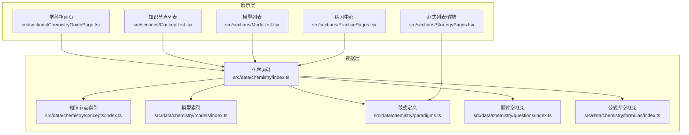
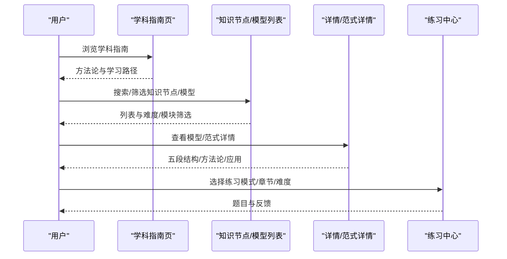
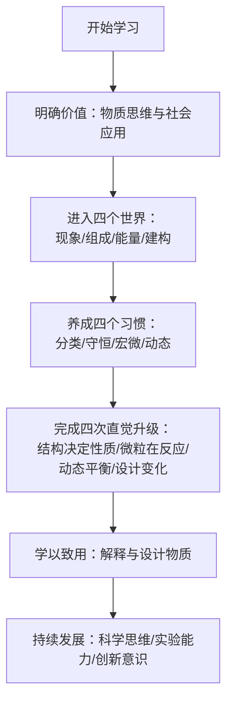
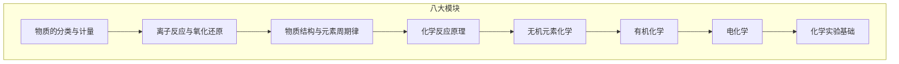
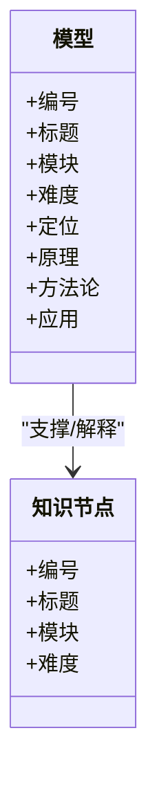
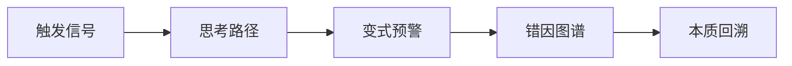
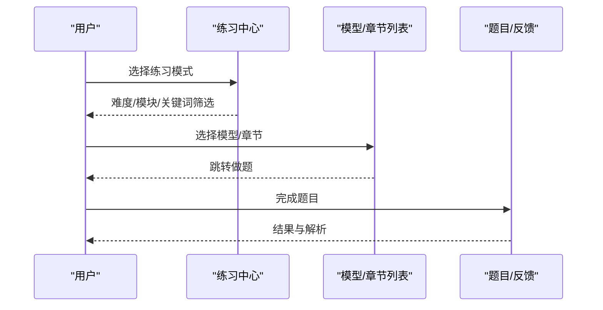
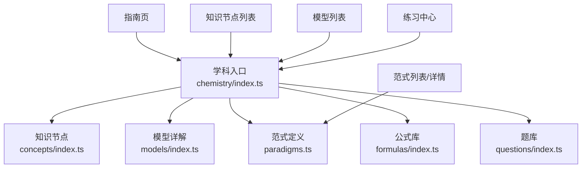

# 化学学习策略

<cite>
**本文引用的文件**
- [src/data/chemistry/index.ts](file://src/data/chemistry/index.ts)
- [src/data/chemistry/concepts/index.ts](file://src/data/chemistry/concepts/index.ts)
- [src/data/chemistry/models/index.ts](file://src/data/chemistry/models/index.ts)
- [src/data/chemistry/paradigms.ts](file://src/data/chemistry/paradigms.ts)
- [src/data/chemistry/questions/index.ts](file://src/data/chemistry/questions/index.ts)
- [src/data/chemistry/formulas/index.ts](file://src/data/chemistry/formulas/index.ts)
- [src/sections/ChemistryGuidePage.tsx](file://src/sections/ChemistryGuidePage.tsx)
- [src/sections/ConceptList.tsx](file://src/sections/ConceptList.tsx)
- [src/sections/ModelList.tsx](file://src/sections/ModelList.tsx)
- [src/sections/StrategyPages.tsx](file://src/sections/StrategyPages.tsx)
- [src/sections/PracticePages.tsx](file://src/sections/PracticePages.tsx)
</cite>

## 目录
1. [引言](#引言)
2. [项目结构](#项目结构)
3. [核心组件](#核心组件)
4. [架构总览](#架构总览)
5. [详细组件分析](#详细组件分析)
6. [依赖分析](#依赖分析)
7. [性能考量](#性能考量)
8. [故障排查指南](#故障排查指南)
9. [结论](#结论)
10. [附录](#附录)

## 引言
本文件面向“星耀平台”的化学学习需求，系统化梳理并输出一套契合平台能力的化学学习策略文档。内容覆盖概念理解、模型应用、实验设计、计算解题等核心方法，并结合平台的知识节点、模型详解、范式体系与练习中心，给出可落地的学习路径与阶段性突破建议。文档强调：
- 将理论知识与实验现象结合，建立“宏微符”三重映射思维；
- 通过模型构建理解复杂反应机理与物质转化；
- 运用数学工具（如平衡常数、反应速率、电荷守恒）解决化学问题；
- 培养科学思维、实验能力与创新意识；
- 提供个性化学习建议，帮助学生建立高效学习体系。

## 项目结构
星耀平台的化学数据与前端页面采用清晰的分层组织：
- 数据层：按学科组织“知识节点（concepts）”“模型详解（models）”“范式（paradigms）”“公式（formulas）”“题库（questions）”，并通过学科入口统一注册。
- 展示层：提供“学科指南”“知识节点列表”“模型列表”“练习中心”等页面，支持搜索、筛选与导航。
- 能力支撑：基于注册接口，统一暴露概念、模型、范式、公式与题库数据，便于前端按需渲染与交互。

图表来源
- [src/data/chemistry/index.ts:1-186](file://src/data/chemistry/index.ts#L1-L186)
- [src/data/chemistry/concepts/index.ts:1-244](file://src/data/chemistry/concepts/index.ts#L1-L244)
- [src/data/chemistry/models/index.ts:1-209](file://src/data/chemistry/models/index.ts#L1-L209)
- [src/data/chemistry/paradigms.ts:1-25](file://src/data/chemistry/paradigms.ts#L1-L25)
- [src/data/chemistry/questions/index.ts:1-19](file://src/data/chemistry/questions/index.ts#L1-L19)
- [src/data/chemistry/formulas/index.ts:1-19](file://src/data/chemistry/formulas/index.ts#L1-L19)
- [src/sections/ChemistryGuidePage.tsx:1-139](file://src/sections/ChemistryGuidePage.tsx#L1-L139)
- [src/sections/ConceptList.tsx:1-151](file://src/sections/ConceptList.tsx#L1-L151)
- [src/sections/ModelList.tsx:1-162](file://src/sections/ModelList.tsx#L1-L162)
- [src/sections/StrategyPages.tsx:1-322](file://src/sections/StrategyPages.tsx#L1-L322)
- [src/sections/PracticePages.tsx:1-375](file://src/sections/PracticePages.tsx#L1-L375)

章节来源
- [src/data/chemistry/index.ts:22-93](file://src/data/chemistry/index.ts#L22-L93)
- [src/data/chemistry/concepts/index.ts:125-232](file://src/data/chemistry/concepts/index.ts#L125-L232)
- [src/data/chemistry/models/index.ts:159-208](file://src/data/chemistry/models/index.ts#L159-L208)

## 核心组件
- 学科数据入口：统一注册化学学科模块、知识节点、模型、范式、公式与题库，提供查询与统计接口。
- 知识节点：按八大板块组织（物质的分类与计量、离子反应与氧化还原、物质结构与元素周期律、化学反应原理、无机元素化学、有机化学、电化学、化学实验基础）。
- 模型详解：围绕核心主题构建“模型”，覆盖定位、原理、变式、知识网络、方法论、自检与应用。
- 范式体系：以“触发信号→思考路径→变式预警→错因图谱→本质回溯”的五段结构，沉淀思维方法。
- 练习中心：提供知识点练习、章节测试、题库浏览等模式，支持难度与模型筛选。

章节来源
- [src/data/chemistry/index.ts:135-183](file://src/data/chemistry/index.ts#L135-L183)
- [src/data/chemistry/concepts/index.ts:125-232](file://src/data/chemistry/concepts/index.ts#L125-L232)
- [src/data/chemistry/models/index.ts:57-157](file://src/data/chemistry/models/index.ts#L57-L157)
- [src/data/chemistry/paradigms.ts:6-25](file://src/data/chemistry/paradigms.ts#L6-L25)
- [src/sections/PracticePages.tsx:16-65](file://src/sections/PracticePages.tsx#L16-L65)

## 架构总览
平台通过“学科数据入口”将知识、模型、范式、公式与题库聚合，前端页面按需调用并渲染。学习策略贯穿以下流程：
- 学科指南：建立学习动机与方法论框架；
- 知识节点：按模块推进，建立“现象→微观→符号”的映射；
- 模型详解：以模型为载体，系统化解题与建模；
- 范式体系：以范式为工具，提升迁移与创新能力；
- 练习中心：以练促学，巩固与拓展。

图表来源
- [src/sections/ChemistryGuidePage.tsx:1-139](file://src/sections/ChemistryGuidePage.tsx#L1-L139)
- [src/sections/ConceptList.tsx:24-58](file://src/sections/ConceptList.tsx#L24-L58)
- [src/sections/ModelList.tsx:18-54](file://src/sections/ModelList.tsx#L18-L54)
- [src/sections/StrategyPages.tsx:55-153](file://src/sections/StrategyPages.tsx#L55-L153)
- [src/sections/PracticePages.tsx:88-184](file://src/sections/PracticePages.tsx#L88-L184)

## 详细组件分析

### 学科指南：学习动机与方法论
- 价值认知：从“现象世界”到“组成与结构世界”“能量与限度世界”“建构世界”的四个维度，帮助学生建立物质思维与系统视角。
- 四个习惯：分类与归纳、守恒与配平、宏微结合、动态视角，构成化学思维的底层能力。
- 升级路径：从“物质是实体”到“结构决定性质”、从“物质有性质”到“微粒在反应”、从“反应进行到底”到“动态平衡”、从“解释变化”到“设计变化”。

图表来源
- [src/sections/ChemistryGuidePage.tsx:15-134](file://src/sections/ChemistryGuidePage.tsx#L15-L134)

章节来源
- [src/sections/ChemistryGuidePage.tsx:15-134](file://src/sections/ChemistryGuidePage.tsx#L15-L134)

### 知识节点：阶段性学习与难点突破
- 模块划分：八大板块覆盖高中化学核心内容，便于按阶段推进。
- 难度标注：每个节点具备难度等级，便于个性化安排学习节奏。
- 实验与理论结合：在“物质的分类与计量”“化学实验基础”等模块强化实验与理论的联系。

图表来源
- [src/data/chemistry/concepts/index.ts:125-232](file://src/data/chemistry/concepts/index.ts#L125-L232)

章节来源
- [src/data/chemistry/concepts/index.ts:125-232](file://src/data/chemistry/concepts/index.ts#L125-L232)
- [src/sections/ConceptList.tsx:24-58](file://src/sections/ConceptList.tsx#L24-L58)

### 模型详解：系统化建模与解题
- 模型分类：围绕八大模块构建48个模型，覆盖物质分类、离子反应、结构预测、平衡分析、元素转化、有机推断、电化学、实验流程等。
- 方法论：每个模型包含定位、原理、变式、知识网络、方法论、自检与应用，形成“从模型到应用”的闭环。
- 难度分布：基础/中等/进阶三级难度，配合练习中心实现分层训练。

图表来源
- [src/data/chemistry/models/index.ts:57-157](file://src/data/chemistry/models/index.ts#L57-L157)
- [src/data/chemistry/concepts/index.ts:65-123](file://src/data/chemistry/concepts/index.ts#L65-L123)

章节来源
- [src/data/chemistry/models/index.ts:57-157](file://src/data/chemistry/models/index.ts#L57-L157)
- [src/sections/ModelList.tsx:18-54](file://src/sections/ModelList.tsx#L18-L54)

### 范式体系：思维方法与迁移创新
- 五段结构：触发信号→思考路径→变式预警→错因图谱→本质回溯，帮助学生形成系统化思维。
- 思维维度：范式与模型对应，覆盖知识掌握、思维运用、迁移创新三个层次。
- 平台实现：范式列表与详情页提供检索、分类与翻页，便于学习与复习。

图表来源
- [src/data/chemistry/paradigms.ts:6-25](file://src/data/chemistry/paradigms.ts#L6-L25)
- [src/sections/StrategyPages.tsx:156-321](file://src/sections/StrategyPages.tsx#L156-L321)

章节来源
- [src/data/chemistry/paradigms.ts:6-25](file://src/data/chemistry/paradigms.ts#L6-L25)
- [src/sections/StrategyPages.tsx:55-153](file://src/sections/StrategyPages.tsx#L55-L153)

### 练习中心：以练促学与能力诊断
- 模式：知识点练习（按模型）、章节测试（按模块）、题库浏览（按难度）。
- 难度：B/J/T三层，分别对应基础、进阶与挑战，便于分层训练。
- 导航：支持按模块/难度/关键词筛选，结合模型与章节实现精准练习。

图表来源
- [src/sections/PracticePages.tsx:88-375](file://src/sections/PracticePages.tsx#L88-L375)

章节来源
- [src/sections/PracticePages.tsx:88-375](file://src/sections/PracticePages.tsx#L88-L375)

## 依赖分析
- 学科入口依赖：知识节点、模型、范式、公式、题库均通过学科入口统一注册，前端页面通过钩子获取数据。
- 页面依赖：指南页依赖学科元数据与模块划分；列表页依赖概念/模型数据与筛选逻辑；范式页依赖范式定义；练习页依赖难度与模型配置。
- 潜在耦合：范式与模型的映射关系可通过“所属模型”字段关联，避免重复维护。

图表来源
- [src/data/chemistry/index.ts:135-183](file://src/data/chemistry/index.ts#L135-L183)
- [src/sections/ConceptList.tsx:24-58](file://src/sections/ConceptList.tsx#L24-L58)
- [src/sections/ModelList.tsx:18-54](file://src/sections/ModelList.tsx#L18-L54)
- [src/sections/StrategyPages.tsx:55-153](file://src/sections/StrategyPages.tsx#L55-L153)
- [src/sections/PracticePages.tsx:88-184](file://src/sections/PracticePages.tsx#L88-L184)

章节来源
- [src/data/chemistry/index.ts:135-183](file://src/data/chemistry/index.ts#L135-L183)

## 性能考量
- 数据懒加载：页面首次渲染仅加载必要模块，按需请求模型与题库数据。
- 搜索与筛选：前端本地过滤，减少网络请求；关键词匹配支持名称、公式与标签。
- 渲染优化：列表采用虚拟滚动与分页策略，避免大量DOM节点导致卡顿。
- 缓存策略：对静态数据（如模块与难度配置）进行内存缓存，提升二次访问速度。

## 故障排查指南
- 页面空白或加载缓慢
  - 检查学科数据是否成功注册与返回。
  - 确认概念/模型数据是否存在空数组或缺失字段。
- 搜索无结果
  - 确认关键词大小写与拼写；公式库搜索支持名称、分子式与标签。
- 练习无法跳转
  - 检查模型/章节可用性标记与路由参数是否正确。
- 范式详情缺失
  - 确认范式列表是否为空；平台当前范式为空占位，需填充内容。

章节来源
- [src/data/chemistry/formulas/index.ts:10-18](file://src/data/chemistry/formulas/index.ts#L10-L18)
- [src/data/chemistry/questions/index.ts:6-18](file://src/data/chemistry/questions/index.ts#L6-L18)
- [src/sections/PracticePages.tsx:186-241](file://src/sections/PracticePages.tsx#L186-L241)
- [src/sections/StrategyPages.tsx:156-178](file://src/sections/StrategyPages.tsx#L156-L178)

## 结论
星耀平台的化学学习策略以“学科指南—知识节点—模型详解—范式体系—练习中心”为主线，既满足知识体系化学习，又强调思维方法与实践能力培养。通过模块化、模型化与范式化的学习路径，学生能够：
- 将理论与实验结合，建立“宏微符”思维；
- 以模型为工具，系统化解题与设计；
- 以范式为方法，提升迁移与创新能力；
- 以练习为中心，实现分层巩固与能力诊断。

## 附录
- 学习建议
  - 建立“现象→微观→符号”的三段式思维，用模型串联知识点。
  - 以范式为工具，针对易错点绘制“错因图谱”，并反复演练“思考路径”。
  - 分层练习：B层打基础、J层强综合、T层拓思维，逐步提升难度。
  - 实验与理论并重：在“实验基础”模块强化操作、分离与误差分析。
- 阶段性重点
  - 初期：物质分类与计量、离子反应与氧化还原（打基础）。
  - 中期：结构与周期律、反应原理（建模型）。
  - 高期：元素化学、有机化学、电化学（强应用）。
- 核心素养
  - 科学思维：守恒、平衡、动态视角。
  - 实验能力：仪器使用、分离提纯、误差分析。
  - 创新意识：从“解释世界”走向“设计世界”。