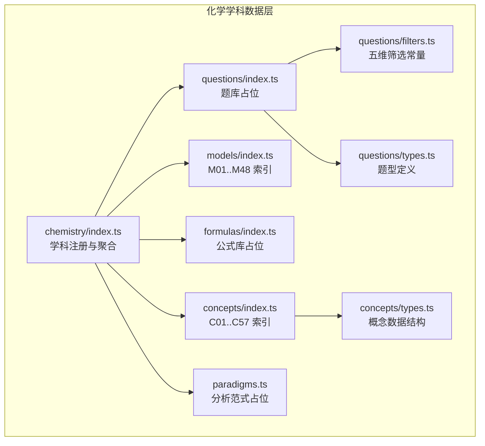
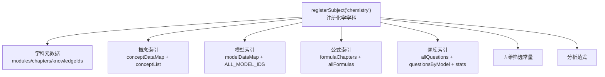
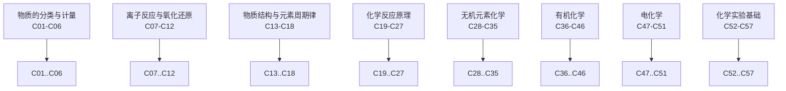
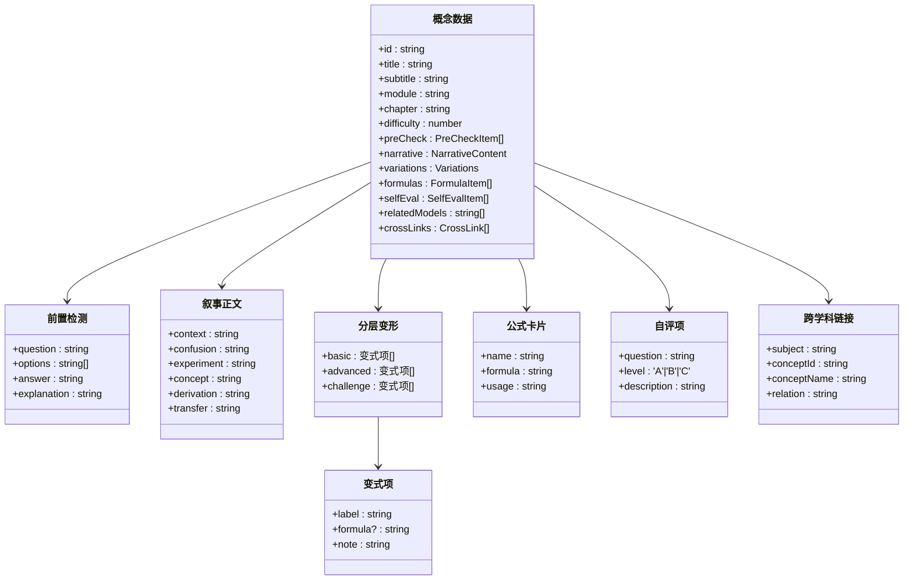
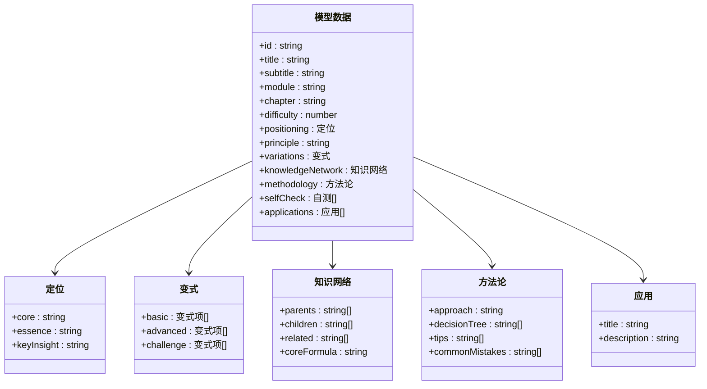
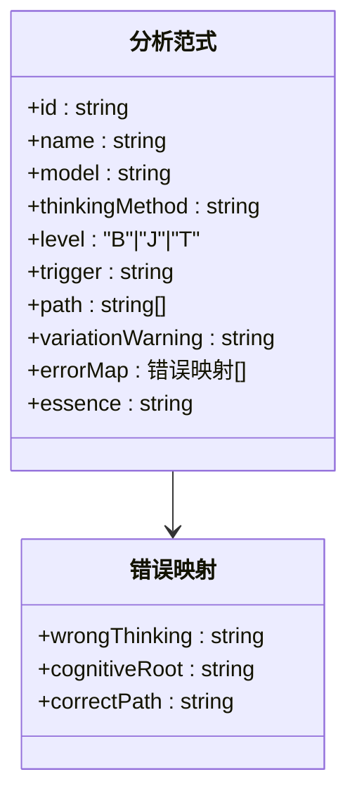
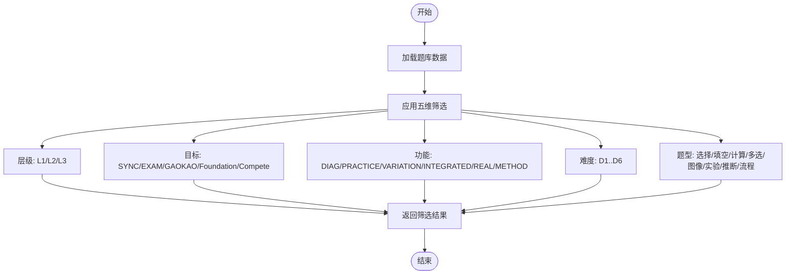
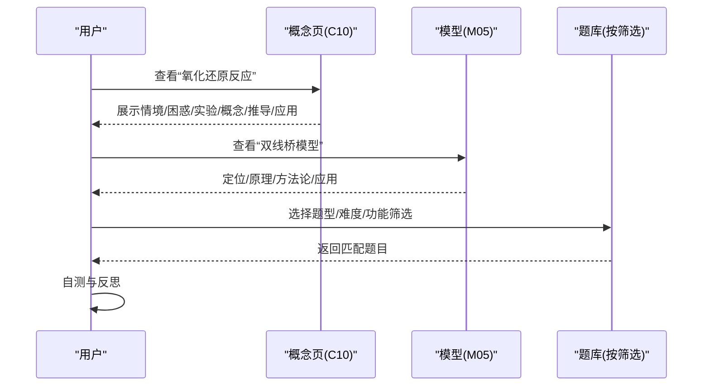
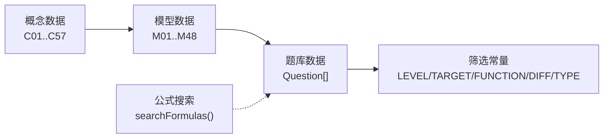

# 化学学科

<cite>
**本文引用的文件**
- [src/data/chemistry/index.ts](file://src/data/chemistry/index.ts)
- [src/data/chemistry/concepts/index.ts](file://src/data/chemistry/concepts/index.ts)
- [src/data/chemistry/models/index.ts](file://src/data/chemistry/models/index.ts)
- [src/data/chemistry/questions/index.ts](file://src/data/chemistry/questions/index.ts)
- [src/data/chemistry/questions/filters.ts](file://src/data/chemistry/questions/filters.ts)
- [src/data/chemistry/questions/types.ts](file://src/data/chemistry/questions/types.ts)
- [src/data/chemistry/formulas/index.ts](file://src/data/chemistry/formulas/index.ts)
- [src/data/chemistry/paradigms.ts](file://src/data/chemistry/paradigms.ts)
- [src/data/chemistry/concepts/types.ts](file://src/data/chemistry/concepts/types.ts)
- [src/data/chemistry/concepts/C01_物质的分类.ts](file://src/data/chemistry/concepts/C01_物质的分类.ts)
- [src/data/chemistry/models/M01_物质分类树模型.ts](file://src/data/chemistry/models/M01_物质分类树模型.ts)
- [src/data/chemistry/concepts/C10_氧化还原反应.ts](file://src/data/chemistry/concepts/C10_氧化还原反应.ts)
- [src/data/chemistry/models/M05_氧化还原双线桥模型.ts](file://src/data/chemistry/models/M05_氧化还原双线桥模型.ts)
- [src/data/chemistry/concepts/C22_化学平衡与平衡常数.ts](file://src/data/chemistry/concepts/C22_化学平衡与平衡常数.ts)
</cite>

## 目录
1. [简介](#简介)
2. [项目结构](#项目结构)
3. [核心组件](#核心组件)
4. [架构总览](#架构总览)
5. [详细组件分析](#详细组件分析)
6. [依赖分析](#依赖分析)
7. [性能考虑](#性能考虑)
8. [故障排查指南](#故障排查指南)
9. [结论](#结论)
10. [附录](#附录)

## 简介
本文件面向“星耀平台”的化学学科，系统化梳理知识组织结构与模块化设计，覆盖以下要点：
- 知识组织：K层知识节点（57个）、M层核心模型（48个）、R层分析范式（计划70个）、P层练习题库（五维筛选与统计）
- 模块划分与章节组织：物质的分类与计量、离子反应与氧化还原、物质结构与元素周期律、化学反应原理、无机元素化学、有机化学、电化学、化学实验基础
- 知识结构：情境(context)、困惑(confusion)、实验(experiment)、概念(concept)、推导(derivation)、应用(transfer)六段式
- 方法论：模型的定位(positioning)、原理(principle)、变式(variations)、知识网络(knowledgeNetwork)、方法论(methodology)、自测(selfCheck)、应用(applications)七模块
- 思维方法与解题策略：氧化还原反应、化学平衡、电化学计算等核心主题
- 题库筛选机制：层级(L1/L2/L3)、目标(SYNC/EXAM/GAOKAO/Foundation/Compete)、功能(DIAG/PRACTICE/VARIATION/INTEGRATED/REAL/METHOD)、难度D(1~6)、题型(选择/填空/计算/多选/图像/实验/推断/流程)

## 项目结构
化学学科的数据结构遵循统一的“学科注册器”模式，通过一个入口文件聚合概念、模型、公式、题库与分析范式，并暴露标准化接口给前端页面与工具模块使用。

图示来源
- [src/data/chemistry/index.ts:1-186](file://src/data/chemistry/index.ts#L1-L186)
- [src/data/chemistry/concepts/index.ts:1-244](file://src/data/chemistry/concepts/index.ts#L1-L244)
- [src/data/chemistry/models/index.ts:1-209](file://src/data/chemistry/models/index.ts#L1-L209)
- [src/data/chemistry/formulas/index.ts:1-19](file://src/data/chemistry/formulas/index.ts#L1-L19)
- [src/data/chemistry/questions/index.ts:1-19](file://src/data/chemistry/questions/index.ts#L1-L19)
- [src/data/chemistry/questions/filters.ts:1-47](file://src/data/chemistry/questions/filters.ts#L1-L47)
- [src/data/chemistry/questions/types.ts:1-28](file://src/data/chemistry/questions/types.ts#L1-L28)
- [src/data/chemistry/concepts/types.ts:1-79](file://src/data/chemistry/concepts/types.ts#L1-L79)
- [src/data/chemistry/paradigms.ts:1-25](file://src/data/chemistry/paradigms.ts#L1-L25)

章节来源
- [src/data/chemistry/index.ts:22-93](file://src/data/chemistry/index.ts#L22-L93)
- [src/data/chemistry/concepts/index.ts:125-232](file://src/data/chemistry/concepts/index.ts#L125-L232)
- [src/data/chemistry/models/index.ts:159-208](file://src/data/chemistry/models/index.ts#L159-L208)

## 核心组件
- 学科元数据与模块章节
  - 化学学科元数据包含学科标识、名称、颜色以及八大模块与章节映射，每个模块下包含若干知识节点ID。
  - 示例：物质的分类与计量模块包含C01~C06；电化学模块包含C47~C51。
- 概念数据（K层）
  - C01~C57，按模块分组，每条概念数据包含标题、副标题、模块、章节、难度、前置检测、叙事正文、分层变形、公式卡片、自评、关联模型与跨学科链接。
- 模型数据（M层）
  - M01~M48，按模块分组，每条模型数据包含标题、模块、章节、难度、定位与本质、原理、变式、知识网络、方法论、自测、应用等七模块。
- 分析范式（R层）
  - CHE-R01~CHE-R70，按思维方法维度组织，包含触发信号、思考路径、变式预警、错误映射、本质回溯等。
- 练习题库（P层）
  - 题库为空占位，待AI填充；已定义五维筛选常量与题型枚举，便于后续扩展。

章节来源
- [src/data/chemistry/index.ts:22-93](file://src/data/chemistry/index.ts#L22-L93)
- [src/data/chemistry/concepts/index.ts:65-123](file://src/data/chemistry/concepts/index.ts#L65-L123)
- [src/data/chemistry/models/index.ts:57-106](file://src/data/chemistry/models/index.ts#L57-L106)
- [src/data/chemistry/paradigms.ts:6-25](file://src/data/chemistry/paradigms.ts#L6-L25)
- [src/data/chemistry/questions/index.ts:6-18](file://src/data/chemistry/questions/index.ts#L6-L18)

## 架构总览
化学学科采用“注册器+模块化索引”的架构，将概念、模型、公式、题库与范式统一注册到学科命名空间，前端通过标准化接口获取所需数据。

图示来源
- [src/data/chemistry/index.ts:135-183](file://src/data/chemistry/index.ts#L135-L183)

章节来源
- [src/data/chemistry/index.ts:135-183](file://src/data/chemistry/index.ts#L135-L183)

## 详细组件分析

### 模块划分与章节组织
化学学科划分为八大模块，每个模块下包含若干知识节点与对应模型，形成“知识—模型—题库”的闭环。

图示来源
- [src/data/chemistry/index.ts:27-92](file://src/data/chemistry/index.ts#L27-L92)
- [src/data/chemistry/concepts/index.ts:126-232](file://src/data/chemistry/concepts/index.ts#L126-L232)

章节来源
- [src/data/chemistry/index.ts:27-92](file://src/data/chemistry/index.ts#L27-L92)
- [src/data/chemistry/concepts/index.ts:126-232](file://src/data/chemistry/concepts/index.ts#L126-L232)

### 知识结构（K层）：情境-困惑-实验-概念-推导-应用
概念数据采用统一的六段式结构，确保教学与学习的一致性与可迁移性。

图示来源
- [src/data/chemistry/concepts/types.ts:52-79](file://src/data/chemistry/concepts/types.ts#L52-L79)
- [src/data/chemistry/concepts/types.ts:12-19](file://src/data/chemistry/concepts/types.ts#L12-L19)
- [src/data/chemistry/concepts/types.ts:21-31](file://src/data/chemistry/concepts/types.ts#L21-L31)
- [src/data/chemistry/concepts/types.ts:33-37](file://src/data/chemistry/concepts/types.ts#L33-L37)
- [src/data/chemistry/concepts/types.ts:39-43](file://src/data/chemistry/concepts/types.ts#L39-L43)
- [src/data/chemistry/concepts/types.ts:45-50](file://src/data/chemistry/concepts/types.ts#L45-L50)

章节来源
- [src/data/chemistry/concepts/types.ts:12-79](file://src/data/chemistry/concepts/types.ts#L12-L79)
- [src/data/chemistry/concepts/C01_物质的分类.ts:4-42](file://src/data/chemistry/concepts/C01_物质的分类.ts#L4-L42)

### 模型结构（M层）：定位-原理-变式-知识网络-方法论-自测-应用
模型数据采用七模块结构，强调“从知识到方法再到应用”的系统化建模。

图示来源
- [src/data/chemistry/models/index.ts:57-106](file://src/data/chemistry/models/index.ts#L57-L106)
- [src/data/chemistry/models/M01_物质分类树模型.ts:4-50](file://src/data/chemistry/models/M01_物质分类树模型.ts#L4-L50)

章节来源
- [src/data/chemistry/models/index.ts:57-106](file://src/data/chemistry/models/index.ts#L57-L106)
- [src/data/chemistry/models/M01_物质分类树模型.ts:4-50](file://src/data/chemistry/models/M01_物质分类树模型.ts#L4-L50)

### 分析范式（R层）：思维方法维度与解题套路
分析范式用于沉淀“解题套路”，包含触发信号、思考路径、变式预警、错误映射与本质回溯，支撑从知识到迁移创新的学习路径。

图示来源
- [src/data/chemistry/paradigms.ts:6-25](file://src/data/chemistry/paradigms.ts#L6-L25)

章节来源
- [src/data/chemistry/paradigms.ts:6-25](file://src/data/chemistry/paradigms.ts#L6-L25)

### 题库与筛选机制（P层）
题库采用五维筛选，便于按层级、目标、功能、难度与题型进行精准匹配与个性化练习。

图示来源
- [src/data/chemistry/questions/filters.ts:4-47](file://src/data/chemistry/questions/filters.ts#L4-L47)
- [src/data/chemistry/questions/types.ts:4-28](file://src/data/chemistry/questions/types.ts#L4-L28)

章节来源
- [src/data/chemistry/questions/index.ts:6-18](file://src/data/chemistry/questions/index.ts#L6-L18)
- [src/data/chemistry/questions/filters.ts:4-47](file://src/data/chemistry/questions/filters.ts#L4-L47)
- [src/data/chemistry/questions/types.ts:4-28](file://src/data/chemistry/questions/types.ts#L4-L28)

### 核心主题：氧化还原反应、化学平衡、电化学计算
- 氧化还原反应（C10）与双线桥模型（M05）：建立电子转移视角，配合配平与计算模型，强化从微观到宏观的迁移能力。
- 化学平衡（C22）与平衡分析模型（M12）：结合等效平衡、图像分析与pH计算，提升动态平衡的建模与应用能力。
- 电化学（C47~C51）与电化学模型（M38~M41）：原电池、电解池、金属防护与电化学计算，形成“原理—装置—应用”的完整链路。

图示来源
- [src/data/chemistry/concepts/C10_氧化还原反应.ts:4-42](file://src/data/chemistry/concepts/C10_氧化还原反应.ts#L4-L42)
- [src/data/chemistry/models/M05_氧化还原双线桥模型.ts:4-50](file://src/data/chemistry/models/M05_氧化还原双线桥模型.ts#L4-L50)
- [src/data/chemistry/questions/filters.ts:4-47](file://src/data/chemistry/questions/filters.ts#L4-L47)

章节来源
- [src/data/chemistry/concepts/C10_氧化还原反应.ts:4-42](file://src/data/chemistry/concepts/C10_氧化还原反应.ts#L4-L42)
- [src/data/chemistry/models/M05_氧化还原双线桥模型.ts:4-50](file://src/data/chemistry/models/M05_氧化还原双线桥模型.ts#L4-L50)
- [src/data/chemistry/concepts/C22_化学平衡与平衡常数.ts:4-42](file://src/data/chemistry/concepts/C22_化学平衡与平衡常数.ts#L4-L42)

## 依赖分析
- 概念与模型的耦合关系
  - 概念数据通过relatedModels字段指向相关模型ID，实现“知识—模型”的双向关联。
  - 模型数据的knowledgeNetwork.children/parents/related体现知识间的层级与关联。
- 题库与模型的绑定
  - 题目类型包含modelId字段，questionsByModel按模型聚合题目，modelQuestionStats提供统计视图。
- 筛选与搜索
  - 五维筛选常量与题型枚举统一了题库的过滤口径；公式库提供按名称/公式/标签的检索接口。

图示来源
- [src/data/chemistry/concepts/index.ts:65-123](file://src/data/chemistry/concepts/index.ts#L65-L123)
- [src/data/chemistry/models/index.ts:57-106](file://src/data/chemistry/models/index.ts#L57-L106)
- [src/data/chemistry/questions/index.ts:6-18](file://src/data/chemistry/questions/index.ts#L6-L18)
- [src/data/chemistry/questions/filters.ts:4-47](file://src/data/chemistry/questions/filters.ts#L4-L47)
- [src/data/chemistry/formulas/index.ts:10-18](file://src/data/chemistry/formulas/index.ts#L10-L18)

章节来源
- [src/data/chemistry/concepts/index.ts:65-123](file://src/data/chemistry/concepts/index.ts#L65-L123)
- [src/data/chemistry/models/index.ts:57-106](file://src/data/chemistry/models/index.ts#L57-L106)
- [src/data/chemistry/questions/index.ts:6-18](file://src/data/chemistry/questions/index.ts#L6-L18)
- [src/data/chemistry/formulas/index.ts:10-18](file://src/data/chemistry/formulas/index.ts#L10-L18)

## 性能考虑
- 数据加载与懒加载
  - 概念与模型采用索引映射，避免重复遍历；题库按需加载与筛选，减少前端渲染压力。
- 搜索与过滤
  - 公式搜索与题库筛选均基于数组过滤，建议在数据量增大时引入索引或分页策略。
- 图标与颜色
  - 模块颜色与分类映射集中管理，便于UI复用与主题切换。

## 故障排查指南
- 概念缺失或未注册
  - 确认conceptDataMap与conceptList是否包含目标ID；检查模块章节映射是否正确。
- 模型缺失或未聚合
  - 确认modelDataMap与ALL_MODEL_IDS是否包含目标ID；检查模块分组与排序。
- 题库为空
  - 确认questions/index.ts中allQuestions与questionsByModel是否被正确填充；检查modelQuestionStats统计是否更新。
- 筛选无效
  - 检查五维筛选常量与题型枚举是否与题目字段一致；确认前端调用参数格式。

章节来源
- [src/data/chemistry/concepts/index.ts:235-244](file://src/data/chemistry/concepts/index.ts#L235-L244)
- [src/data/chemistry/models/index.ts:108-157](file://src/data/chemistry/models/index.ts#L108-L157)
- [src/data/chemistry/questions/index.ts:6-18](file://src/data/chemistry/questions/index.ts#L6-L18)
- [src/data/chemistry/questions/filters.ts:4-47](file://src/data/chemistry/questions/filters.ts#L4-L47)

## 结论
化学学科通过K层知识节点、M层核心模型、R层分析范式与P层题库的协同，实现了从“知识—方法—应用—评价”的完整学习闭环。模块化设计使知识结构清晰、学习路径可追踪，五维筛选机制则为个性化学习提供了强大支撑。随着内容的逐步完善，该体系将有效提升学生在物质结构、反应原理、元素化学、有机化学与电化学等领域的系统化理解与迁移能力。

## 附录
- 概念与模型的完整清单
  - 概念：C01~C57（按模块分组）
  - 模型：M01~M48（按模块分组）
- 分析范式与题型
  - 分析范式：CHE-R01~CHE-R70（占位）
  - 题型：选择题、填空题、计算题、多选题、图像分析题、实验设计题、无机推断题、有机推断题、流程分析题

章节来源
- [src/data/chemistry/concepts/index.ts:126-232](file://src/data/chemistry/concepts/index.ts#L126-L232)
- [src/data/chemistry/models/index.ts:159-208](file://src/data/chemistry/models/index.ts#L159-L208)
- [src/data/chemistry/paradigms.ts:24](file://src/data/chemistry/paradigms.ts#L24)
- [src/data/chemistry/questions/types.ts:8](file://src/data/chemistry/questions/types.ts#L8)