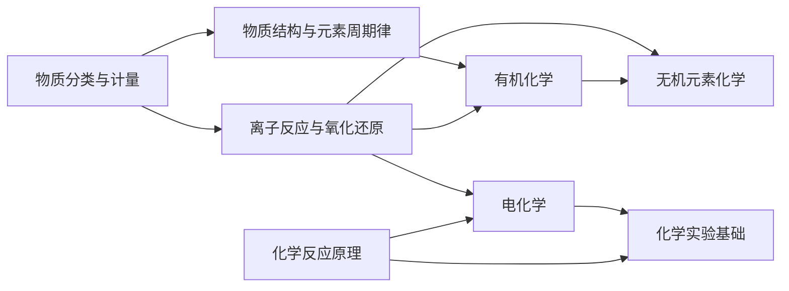

# 化学核心模型

<cite>
**本文引用的文件**
- [src/data/chemistry/models/index.ts](file://src/data/chemistry/models/index.ts)
- [src/data/chemistry/models/M01_物质分类树模型.ts](file://src/data/chemistry/models/M01_物质分类树模型.ts)
- [src/data/chemistry/models/M02_摩尔计算模型.ts](file://src/data/chemistry/models/M02_摩尔计算模型.ts)
- [src/data/chemistry/models/M03_离子方程式书写模型.ts](file://src/data/chemistry/models/M03_离子方程式书写模型.ts)
- [src/data/chemistry/models/M04_离子共存分析模型.ts](file://src/data/chemistry/models/M04_离子共存分析模型.ts)
- [src/data/chemistry/models/M05_氧化还原双线桥模型.ts](file://src/data/chemistry/models/M05_氧化还原双线桥模型.ts)
- [src/data/chemistry/models/M06_氧化还原配平与计算模型.ts](file://src/data/chemistry/models/M06_氧化还原配平与计算模型.ts)
- [src/data/chemistry/models/M07_原子结构与元素推断模型.ts](file://src/data/chemistry/models/M07_原子结构与元素推断模型.ts)
- [src/data/chemistry/models/M08_元素周期表应用模型.ts](file://src/data/chemistry/models/M08_元素周期表应用模型.ts)
- [src/data/chemistry/models/M09_分子结构预测模型.ts](file://src/data/chemistry/models/M09_分子结构预测模型.ts)
- [src/data/chemistry/models/M10_晶体结构分析模型.ts](file://src/data/chemistry/models/M10_晶体结构分析模型.ts)
- [src/data/chemistry/models/M11_热化学盖斯定律模型.ts](file://src/data/chemistry/models/M11_热化学盖斯定律模型.ts)
- [src/data/chemistry/models/M12_化学平衡分析模型.ts](file://src/data/chemistry/models/M12_化学平衡分析模型.ts)
- [src/data/chemistry/models/M13_等效平衡模型.ts](file://src/data/chemistry/models/M13_等效平衡模型.ts)
- [src/data/chemistry/models/M14_弱电解质电离平衡模型.ts](file://src/data/chemistry/models/M14_弱电解质电离平衡模型.ts)
- [src/data/chemistry/models/M15_沉淀溶解平衡模型.ts](file://src/data/chemistry/models/M15_沉淀溶解平衡模型.ts)
- [src/data/chemistry/models/M16_速率图像分析模型.ts](file://src/data/chemistry/models/M16_速率图像分析模型.ts)
- [src/data/chemistry/models/M17_pH综合计算模型.ts](file://src/data/chemistry/models/M17_pH综合计算模型.ts)
- [src/data/chemistry/models/M18_钠的转化链模型.ts](file://src/data/chemistry/models/M18_钠的转化链模型.ts)
- [src/data/chemistry/models/M19_铝的两性转化模型.ts](file://src/data/chemistry/models/M19_铝的两性转化模型.ts)
- [src/data/chemistry/models/M20_铁三角氧化还原模型.ts](file://src/data/chemistry/models/M20_铁三角氧化还原模型.ts)
- [src/data/chemistry/models/M21_铜的氧化还原模型.ts](file://src/data/chemistry/models/M21_铜的氧化还原模型.ts)
- [src/data/chemistry/models/M22_氯的歧化与归中模型.ts](file://src/data/chemistry/models/M22_氯的歧化与归中模型.ts)
- [src/data/chemistry/models/M23_硫氮价态转化模型.ts](file://src/data/chemistry/models/M23_硫氮价态转化模型.ts)
- [src/data/chemistry/models/M24_工业流程分析模型.ts](file://src/data/chemistry/models/M24_工业流程分析模型.ts)
- [src/data/chemistry/models/M25_无机新材料模型.ts](file://src/data/chemistry/models/M25_无机新材料模型.ts)
- [src/data/chemistry/models/M26_同分异构体推导模型.ts](file://src/data/chemistry/models/M26_同分异构体推导模型.ts)
- [src/data/chemistry/models/M27_烃的反应分类模型.ts](file://src/data/chemistry/models/M27_烃的反应分类模型.ts)
- [src/data/chemistry/models/M28_芳香烃定位规则模型.ts](file://src/data/chemistry/models/M28_芳香烃定位规则模型.ts)
- [src/data/chemistry/models/M29_卤代烃反应条件模型.ts](file://src/data/chemistry/models/M29_卤代烃反应条件模型.ts)
- [src/data/chemistry/models/M30_醇酚转化模型.ts](file://src/data/chemistry/models/M30_醇酚转化模型.ts)
- [src/data/chemistry/models/M31_酚的特性模型.ts](file://src/data/chemistry/models/M31_酚的特性模型.ts)
- [src/data/chemistry/models/M32_醛的氧化还原模型.ts](file://src/data/chemistry/models/M32_醛的氧化还原模型.ts)
- [src/data/chemistry/models/M33_羧酸酯转化模型.ts](file://src/data/chemistry/models/M33_羧酸酯转化模型.ts)
- [src/data/chemistry/models/M34_有机推断与合成模型.ts](file://src/data/chemistry/models/M34_有机推断与合成模型.ts)
- [src/data/chemistry/models/M35_过氧化钠歧化模型.ts](file://src/data/chemistry/models/M35_过氧化钠歧化模型.ts)
- [src/data/chemistry/models/M36_高分子合成模型.ts](file://src/data/chemistry/models/M36_高分子合成模型.ts)
- [src/data/chemistry/models/M37_生物大分子模型.ts](file://src/data/chemistry/models/M37_生物大分子模型.ts)
- [src/data/chemistry/models/M38_原电池分析模型.ts](file://src/data/chemistry/models/M38_原电池分析模型.ts)
- [src/data/chemistry/models/M39_新型电池分析模型.ts](file://src/data/chemistry/models/M39_新型电池分析模型.ts)
- [src/data/chemistry/models/M40_电解池与金属防护模型.ts](file://src/data/chemistry/models/M40_电解池与金属防护模型.ts)
- [src/data/chemistry/models/M41_电化学计算模型.ts](file://src/data/chemistry/models/M41_电化学计算模型.ts)
- [src/data/chemistry/models/M42_分离提纯模型.ts](file://src/data/chemistry/models/M42_分离提纯模型.ts)
- [src/data/chemistry/models/M43_气体制备流程模型.ts](file://src/data/chemistry/models/M43_气体制备流程模型.ts)
- [src/data/chemistry/models/M44_检验鉴别模型.ts](file://src/data/chemistry/models/M44_检验鉴别模型.ts)
- [src/data/chemistry/models/M45_定量滴定实验模型.ts](file://src/data/chemistry/models/M45_定量滴定实验模型.ts)
- [src/data/chemistry/models/M46_探究实验设计模型.ts](file://src/data/chemistry/models/M46_探究实验设计模型.ts)
- [src/data/chemistry/models/M47_实验误差分析模型.ts](file://src/data/chemistry/models/M47_实验误差分析模型.ts)
- [src/data/chemistry/models/M48_综合实验评价模型.ts](file://src/data/chemistry/models/M48_综合实验评价模型.ts)
</cite>

## 目录
1. [简介](#简介)
2. [项目结构](#项目结构)
3. [核心组件](#核心组件)
4. [架构总览](#架构总览)
5. [详细组件分析](#详细组件分析)
6. [依赖分析](#依赖分析)
7. [性能考虑](#性能考虑)
8. [故障排查指南](#故障排查指南)
9. [结论](#结论)
10. [附录](#附录)

## 简介
本文件面向“星耀平台”的化学学科，系统梳理并阐述48个M层核心模型的分类体系与应用价值。这些模型覆盖物质分类与计量、离子反应与氧化还原、物质结构与元素周期律、化学反应原理、无机元素化学、有机化学、电化学、化学实验基础等八大知识板块，形成从微观到宏观、从静态到动态、从理论到实践的完整知识建模体系。每个模型均包含定位（核心要点、本质洞察、关键洞见）、原理、变式（基础/进阶/挑战）、知识网络、方法论（解题思路、决策树、技巧与易错点）、自测题与应用场景等维度，便于学习者建立可迁移的知识模型与解题范式。

## 项目结构
化学核心模型位于前端数据层的“models”目录下，采用统一的“Mxx_模型名称.ts”命名规范，并通过一个集中索引文件导出与注册，便于在页面组件中按需加载与渲染。

图示来源
- [src/data/chemistry/models/index.ts:57-106](file://src/data/chemistry/models/index.ts#L57-L106)

章节来源
- [src/data/chemistry/models/index.ts:1-209](file://src/data/chemistry/models/index.ts#L1-L209)

## 核心组件
- 模型索引与注册：集中导出48个模型对象，并提供模型ID映射与有序列表，便于前端路由与导航使用。
- 模型数据结构：每个模型对象包含标准字段：id、title、module、chapter、difficulty、subtitle、description、positioning、principle、variations、knowledgeNetwork、methodology、selfCheck、applications。
- 模块化组织：按“物质分类与计量、离子反应与氧化还原、物质结构与元素周期律、化学反应原理、无机元素化学、有机化学、电化学、化学实验基础”八大学习模块划分，体现知识的系统性与层次性。

章节来源
- [src/data/chemistry/models/index.ts:57-106](file://src/data/chemistry/models/index.ts#L57-L106)
- [src/data/chemistry/models/index.ts:159-209](file://src/data/chemistry/models/index.ts#L159-L209)

## 架构总览
化学核心模型的组织遵循“统一数据结构 + 模块化索引 + 可扩展模板”的架构原则。前端页面通过模型ID从索引中获取具体模型数据，再渲染为教学或练习内容。该架构支持：
- 快速检索与排序：基于模块与难度层级。
- 知识网络可视化：通过parents/children/related与核心公式字段，支撑概念关联与迁移路径。
- 方法论与自测：标准化的解题流程与评估机制，便于形成可复用的学习范式。

```mermaid
graph TB
subgraph "数据层"
IDX["模型索引<br/>index.ts"] --> MAP["模型ID映射<br/>modelDataMap"]
IDX --> LIST["模型ID列表<br/>ALL_MODEL_IDS"]
IDX --> META["模型元数据列表<br/>chemistryModels"]
end
subgraph "模型文件"
M01["M01 物质分类树模型.ts"]
M02["M02 摩尔计算模型.ts"]
M03["M03 离子方程式书写模型.ts"]
M04["M04 离子共存分析模型.ts"]
M05["M05 氧化还原双线桥模型.ts"]
M06["M06 氧化还原配平与计算模型.ts"]
M07["M07 原子结构与元素推断模型.ts"]
M08["M08 元素周期表应用模型.ts"]
M09["M09 分子结构预测模型.ts"]
M10["M10 晶体结构分析模型.ts"]
M11["M11 热化学盖斯定律模型.ts"]
M12["M12 化学平衡分析模型.ts"]
M13["M13 等效平衡模型.ts"]
M14["M14 弱电解质电离平衡模型.ts"]
M15["M15 沉淀溶解平衡模型.ts"]
M16["M16 速率图像分析模型.ts"]
M17["M17 pH综合计算模型.ts"]
M18["M18 钠的转化链模型.ts"]
M19["M19 铝的两性转化模型.ts"]
M20["M20 铁三角氧化还原模型.ts"]
M21["M21 铜的氧化还原模型.ts"]
M22["M22 氯的歧化与归中模型.ts"]
M23["M23 硫氮价态转化模型.ts"]
M24["M24 工业流程分析模型.ts"]
M25["M25 无机新材料模型.ts"]
M26["M26 同分异构体推导模型.ts"]
M27["M27 烃的反应分类模型.ts"]
M28["M28 芳香烃定位规则模型.ts"]
M29["M29 卤代烃反应条件模型.ts"]
M30["M30 醇酚转化模型.ts"]
M31["M31 酚的特性模型.ts"]
M32["M32 醛的氧化还原模型.ts"]
M33["M33 羧酸酯转化模型.ts"]
M34["M34 有机推断与合成模型.ts"]
M35["M35 过氧化钠歧化模型.ts"]
M36["M36 高分子合成模型.ts"]
M37["M37 生物大分子模型.ts"]
M38["M38 原电池分析模型.ts"]
M39["M39 新型电池分析模型.ts"]
M40["M40 电解池与金属防护模型.ts"]
M41["M41 电化学计算模型.ts"]
M42["M42 分离提纯模型.ts"]
M43["M43 气体制备流程模型.ts"]
M44["M44 检验鉴别模型.ts"]
M45["M45 定量滴定实验模型.ts"]
M46["M46 探究实验设计模型.ts"]
M47["M47 实验误差分析模型.ts"]
M48["M48 综合实验评价模型.ts"]
end
IDX --> M01
IDX --> M02
IDX --> M03
IDX --> M04
IDX --> M05
IDX --> M06
IDX --> M07
IDX --> M08
IDX --> M09
IDX --> M10
IDX --> M11
IDX --> M12
IDX --> M13
IDX --> M14
IDX --> M15
IDX --> M16
IDX --> M17
IDX --> M18
IDX --> M19
IDX --> M20
IDX --> M21
IDX --> M22
IDX --> M23
IDX --> M24
IDX --> M25
IDX --> M26
IDX --> M27
IDX --> M28
IDX --> M29
IDX --> M30
IDX --> M31
IDX --> M32
IDX --> M33
IDX --> M34
IDX --> M35
IDX --> M36
IDX --> M37
IDX --> M38
IDX --> M39
IDX --> M40
IDX --> M41
IDX --> M42
IDX --> M43
IDX --> M44
IDX --> M45
IDX --> M46
IDX --> M47
IDX --> M48
```

图示来源
- [src/data/chemistry/models/index.ts:4-51](file://src/data/chemistry/models/index.ts#L4-L51)
- [src/data/chemistry/models/index.ts:57-106](file://src/data/chemistry/models/index.ts#L57-L106)

## 详细组件分析
以下按模块与代表性模型，分层次解析48个M层模型的定位、原理、方法论与应用。

### 物质分类与计量（M01-M02）
- 物质分类树模型（M01）：以树形结构梳理物质类别与属性，强调分类的层次性与交叉性；适用于物质识别、性质归纳与系统记忆。
- 摩尔计算模型（M02）：围绕物质的量、摩尔质量、气体摩尔体积、物质的量浓度等进行系统计算；强调单位换算与多步推理。

章节来源
- [src/data/chemistry/models/M01_物质分类树模型.ts:1-50](file://src/data/chemistry/models/M01_物质分类树模型.ts#L1-L50)
- [src/data/chemistry/models/M02_摩尔计算模型.ts:1-50](file://src/data/chemistry/models/M02_摩尔计算模型.ts#L1-L50)

### 离子反应与氧化还原（M03-M06）
- 离子方程式书写模型（M03）：规范强弱电解质拆分、微溶物与气体产物处理；强调反应实质与电荷守恒。
- 离子共存分析模型（M04）：基于沉淀、气体、弱电解质生成与氧化还原反应判断共存条件。
- 氧化还原双线桥模型（M05）：直观标注电子转移方向与数目，辅助配平与计算。
- 氧化还原配平与计算模型（M06）：系统讲解电子守恒法、化合价升降法与离子-电子法，强化定量计算能力。

章节来源
- [src/data/chemistry/models/M03_离子方程式书写模型.ts:1-50](file://src/data/chemistry/models/M03_离子方程式书写模型.ts#L1-L50)
- [src/data/chemistry/models/M04_离子共存分析模型.ts:1-50](file://src/data/chemistry/models/M04_离子共存分析模型.ts#L1-L50)
- [src/data/chemistry/models/M05_氧化还原双线桥模型.ts:1-50](file://src/data/chemistry/models/M05_氧化还原双线桥模型.ts#L1-L50)
- [src/data/chemistry/models/M06_氧化还原配平与计算模型.ts:1-50](file://src/data/chemistry/models/M06_氧化还原配平与计算模型.ts#L1-L50)

### 物质结构与元素周期律（M07-M10）
- 原子结构与元素推断模型（M07）：结合电子构型、电离能、电负性推断元素性质与位置。
- 元素周期表应用模型（M08）：利用周期性趋势解释与预测元素性质。
- 分子结构预测模型（M09）：基于价层电子对互斥理论预测分子几何与极性。
- 晶体结构分析模型（M10）：对比离子晶体、分子晶体、原子晶体、金属晶体的结构与性质。

章节来源
- [src/data/chemistry/models/M07_原子结构与元素推断模型.ts:1-50](file://src/data/chemistry/models/M07_原子结构与元素推断模型.ts#L1-L50)
- [src/data/chemistry/models/M08_元素周期表应用模型.ts:1-50](file://src/data/chemistry/models/M08_元素周期表应用模型.ts#L1-L50)
- [src/data/chemistry/models/M09_分子结构预测模型.ts:1-50](file://src/data/chemistry/models/M09_分子结构预测模型.ts#L1-L50)
- [src/data/chemistry/models/M10_晶体结构分析模型.ts:1-50](file://src/data/chemistry/models/M10_晶体结构分析模型.ts#L1-L50)

### 化学反应原理（M11-M17）
- 热化学盖斯定律模型（M11）：通过反应热与路径无关性进行反应热计算与图解分析。
- 化学平衡分析模型（M12）：平衡常数、平衡移动与转化率计算，强调动态平衡思维。
- 等效平衡模型（M13）：不同起始状态下的等效关系，提升迁移与类比能力。
- 弱电解质电离平衡模型（M14）：Ka、电离度与稀释定律，关注微小电离与缓冲体系。
- 沉淀溶解平衡模型（M15）：Ksp与沉淀转化、溶解度比较，强调条件控制。
- 速率图像分析模型（M16）：图像解读、活化能与反应历程分析。
- pH综合计算模型（M17）：强弱酸碱、盐类水解、缓冲体系的pH计算与图像分析。

章节来源
- [src/data/chemistry/models/M11_热化学盖斯定律模型.ts:1-50](file://src/data/chemistry/models/M11_热化学盖斯定律模型.ts#L1-L50)
- [src/data/chemistry/models/M12_化学平衡分析模型.ts:1-50](file://src/data/chemistry/models/M12_化学平衡分析模型.ts#L1-L50)
- [src/data/chemistry/models/M13_等效平衡模型.ts:1-50](file://src/data/chemistry/models/M13_等效平衡模型.ts#L1-L50)
- [src/data/chemistry/models/M14_弱电解质电离平衡模型.ts:1-50](file://src/data/chemistry/models/M14_弱电解质电离平衡模型.ts#L1-L50)
- [src/data/chemistry/models/M15_沉淀溶解平衡模型.ts:1-50](file://src/data/chemistry/models/M15_沉淀溶解平衡模型.ts#L1-L50)
- [src/data/chemistry/models/M16_速率图像分析模型.ts:1-50](file://src/data/chemistry/models/M16_速率图像分析模型.ts#L1-L50)
- [src/data/chemistry/models/M17_pH综合计算模型.ts:1-50](file://src/data/chemistry/models/M17_pH综合计算模型.ts#L1-L50)

### 无机元素化学（M18-M25）
- 钠的转化链模型（M18）：Na→Na2O→NaOH→Na2CO3→NaCl等转化路径与条件控制。
- 铝的两性转化模型（M19）：Al(OH)3与强酸强碱反应，强调两性的边界与条件。
- 铁三角氧化还原模型（M20）：Fe、Fe2+、Fe3+相互转化与氧化还原关系。
- 铜的氧化还原模型（M21）：Cu与Cu2+的氧化还原关系与反应条件。
- 氯的歧化与归中模型（M22）：Cl2在不同条件下的歧化与归中反应。
- 硫氮价态转化模型（M23）：S、N常见价态间的转化与典型反应。
- 工业流程分析模型（M24）：典型工业流程的物质与能量分析。
- 无机新材料模型（M25）：新型材料的组成、结构与性能关系。

章节来源
- [src/data/chemistry/models/M18_钠的转化链模型.ts:1-50](file://src/data/chemistry/models/M18_钠的转化链模型.ts#L1-L50)
- [src/data/chemistry/models/M19_铝的两性转化模型.ts:1-50](file://src/data/chemistry/models/M19_铝的两性转化模型.ts#L1-L50)
- [src/data/chemistry/models/M20_铁三角氧化还原模型.ts:1-50](file://src/data/chemistry/models/M20_铁三角氧化还原模型.ts#L1-L50)
- [src/data/chemistry/models/M21_铜的氧化还原模型.ts:1-50](file://src/data/chemistry/models/M21_铜的氧化还原模型.ts#L1-L50)
- [src/data/chemistry/models/M22_氯的歧化与归中模型.ts:1-50](file://src/data/chemistry/models/M22_氯的歧化与归中模型.ts#L1-L50)
- [src/data/chemistry/models/M23_硫氮价态转化模型.ts:1-50](file://src/data/chemistry/models/M23_硫氮价态转化模型.ts#L1-L50)
- [src/data/chemistry/models/M24_工业流程分析模型.ts:1-50](file://src/data/chemistry/models/M24_工业流程分析模型.ts#L1-L50)
- [src/data/chemistry/models/M25_无机新材料模型.ts:1-50](file://src/data/chemistry/models/M25_无机新材料模型.ts#L1-L50)

### 有机化学（M26-M37）
- 同分异构体推导模型（M26）：基于分子式与官能团推导结构异构与立体异构。
- 烃的反应分类模型（M27）：烷、烯、炔、芳香烃的典型反应类型与条件。
- 芳香烃定位规则模型（M28）：邻、对位与间位定位基的判断与应用。
- 卤代烃反应条件模型（M29）：取代、消去与亲核取代的条件与产物预测。
- 醇酚转化模型（M30）：醇与酚的相互转化与反应条件。
- 酚的特性模型（M31）：显色反应、弱酸性与氧化性等特性。
- 醛的氧化还原模型（M32）：醛的氧化成酸、还原成醇的反应。
- 羧酸酯转化模型（M33）：酸、酯的相互转化与水解规律。
- 有机推断与合成模型（M34）：基于官能团与反应类型的推断与合成路线设计。
- 过氧化钠歧化模型（M35）：Na2O2的歧化反应与应用。
- 高分子合成模型（M36）：加聚与缩聚的单体、条件与聚合度。
- 生物大分子模型（M37）：糖类、油脂、蛋白质、核酸的结构与功能。

章节来源
- [src/data/chemistry/models/M26_同分异构体推导模型.ts:1-50](file://src/data/chemistry/models/M26_同分异构体推导模型.ts#L1-L50)
- [src/data/chemistry/models/M27_烃的反应分类模型.ts:1-50](file://src/data/chemistry/models/M27_烃的反应分类模型.ts#L1-L50)
- [src/data/chemistry/models/M28_芳香烃定位规则模型.ts:1-50](file://src/data/chemistry/models/M28_芳香烃定位规则模型.ts#L1-L50)
- [src/data/chemistry/models/M29_卤代烃反应条件模型.ts:1-50](file://src/data/chemistry/models/M29_卤代烃反应条件模型.ts#L1-L50)
- [src/data/chemistry/models/M30_醇酚转化模型.ts:1-50](file://src/data/chemistry/models/M30_醇酚转化模型.ts#L1-L50)
- [src/data/chemistry/models/M31_酚的特性模型.ts:1-50](file://src/data/chemistry/models/M31_酚的特性模型.ts#L1-L50)
- [src/data/chemistry/models/M32_醛的氧化还原模型.ts:1-50](file://src/data/chemistry/models/M32_醛的氧化还原模型.ts#L1-L50)
- [src/data/chemistry/models/M33_羧酸酯转化模型.ts:1-50](file://src/data/chemistry/models/M33_羧酸酯转化模型.ts#L1-L50)
- [src/data/chemistry/models/M34_有机推断与合成模型.ts:1-50](file://src/data/chemistry/models/M34_有机推断与合成模型.ts#L1-L50)
- [src/data/chemistry/models/M35_过氧化钠歧化模型.ts:1-50](file://src/data/chemistry/models/M35_过氧化钠歧化模型.ts#L1-L50)
- [src/data/chemistry/models/M36_高分子合成模型.ts:1-50](file://src/data/chemistry/models/M36_高分子合成模型.ts#L1-L50)
- [src/data/chemistry/models/M37_生物大分子模型.ts:1-50](file://src/data/chemistry/models/M37_生物大分子模型.ts#L1-L50)

### 电化学（M38-M41）
- 原电池分析模型（M38）：正负极判断、电极反应与电子流向。
- 新型电池分析模型（M39）：锂电池、燃料电池等的工作原理与优缺点。
- 电解池与金属防护模型（M40）：电解原理、电镀与金属防护。
- 电化学计算模型（M41）：法拉第定律、电量与产物计算。

章节来源
- [src/data/chemistry/models/M38_原电池分析模型.ts:1-50](file://src/data/chemistry/models/M38_原电池分析模型.ts#L1-L50)
- [src/data/chemistry/models/M39_新型电池分析模型.ts:1-50](file://src/data/chemistry/models/M39_新型电池分析模型.ts#L1-L50)
- [src/data/chemistry/models/M40_电解池与金属防护模型.ts:1-50](file://src/data/chemistry/models/M40_电解池与金属防护模型.ts#L1-L50)
- [src/data/chemistry/models/M41_电化学计算模型.ts:1-50](file://src/data/chemistry/models/M41_电化学计算模型.ts#L1-L50)

### 化学实验基础（M42-M48）
- 分离提纯模型（M42）：过滤、蒸馏、萃取、结晶等方法的选择与优化。
- 气体制备流程模型（M43）：发生装置、净化、收集与尾气处理。
- 检验鉴别模型（M44）：常见离子与气体的检验方法与现象。
- 定量滴定实验模型（M45）：指示剂选择、滴定曲线与终点判断。
- 探究实验设计模型（M46）：变量控制、对照实验与结论归纳。
- 实验误差分析模型（M47）：系统误差与偶然误差的识别与改进。
- 综合实验评价模型（M48）：实验方案的科学性、安全性与创新性评价。

章节来源
- [src/data/chemistry/models/M42_分离提纯模型.ts:1-50](file://src/data/chemistry/models/M42_分离提纯模型.ts#L1-L50)
- [src/data/chemistry/models/M43_气体制备流程模型.ts:1-50](file://src/data/chemistry/models/M43_气体制备流程模型.ts#L1-L50)
- [src/data/chemistry/models/M44_检验鉴别模型.ts:1-50](file://src/data/chemistry/models/M44_检验鉴别模型.ts#L1-L50)
- [src/data/chemistry/models/M45_定量滴定实验模型.ts:1-50](file://src/data/chemistry/models/M45_定量滴定实验模型.ts#L1-L50)
- [src/data/chemistry/models/M46_探究实验设计模型.ts:1-50](file://src/data/chemistry/models/M46_探究实验设计模型.ts#L1-L50)
- [src/data/chemistry/models/M47_实验误差分析模型.ts:1-50](file://src/data/chemistry/models/M47_实验误差分析模型.ts#L1-L50)
- [src/data/chemistry/models/M48_综合实验评价模型.ts:1-50](file://src/data/chemistry/models/M48_综合实验评价模型.ts#L1-L50)

## 依赖分析
- 模块内依赖：同一模块内的模型通常共享前置知识（如“物质结构与元素周期律”模块中的M07-M10），形成知识递进。
- 模块间依赖：如“无机元素化学”与“有机化学”均依赖“物质分类与计量”和“离子反应与氧化还原”的基础；“电化学”依赖“氧化还原反应”和“化学平衡”。
- 知识网络：通过knowledgeNetwork.parents/children/related字段，可构建模型间的概念关联图谱，指导知识迁移与综合应用。

图示来源
- [src/data/chemistry/models/index.ts:159-209](file://src/data/chemistry/models/index.ts#L159-L209)

章节来源
- [src/data/chemistry/models/index.ts:159-209](file://src/data/chemistry/models/index.ts#L159-L209)

## 性能考虑
- 数据结构统一：所有模型采用一致的数据结构，有利于前端统一渲染与缓存策略。
- 模块化加载：按需引入模型文件，减少初始包体与首屏渲染压力。
- 知识网络索引：通过parents/children/related建立轻量索引，便于快速构建概念图谱与推荐路径。

## 故障排查指南
- 模型缺失或ID错误：检查index.ts中的导出与映射，确保ALL_MODEL_IDS与modelDataMap一致。
- 方法论不清晰：依据methodology字段中的decisionTree与tips，逐步回溯至相关模型，补齐知识链。
- 自测题无效：检查selfCheck的question、options、answer与explanation是否完整，避免空值导致渲染异常。
- 应用场景不符：根据knowledgeNetwork.coreFormula与applications描述，核对模型适用范围与边界条件。

章节来源
- [src/data/chemistry/models/index.ts:57-106](file://src/data/chemistry/models/index.ts#L57-L106)

## 结论
星耀平台的化学核心模型以“统一数据结构 + 模块化索引 + 可扩展模板”为核心，系统覆盖高中化学的主干知识与关键能力。通过48个M层模型，学习者可以建立从微观结构到宏观应用的完整认知框架，并在不同模块间实现知识迁移与综合应用。建议在教学实践中以模块为单位推进，配合知识网络图谱与方法论训练，持续优化模型内容与呈现方式。

## 附录
- 模型清单与模块分布：详见“核心组件”与“依赖分析”部分的索引与元数据列表。
- 使用建议：优先从基础模型（如M01-M06）入手，逐步过渡到原理与应用模型（如M11-M17、M24-M25、M38-M41），最后进入实验与综合模型（M42-M48）。