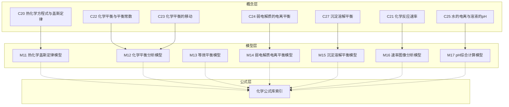
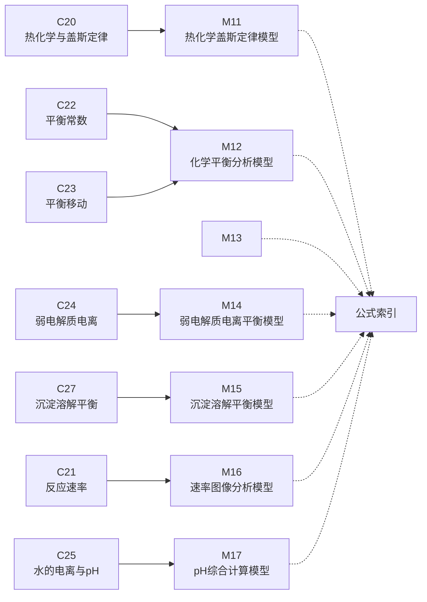
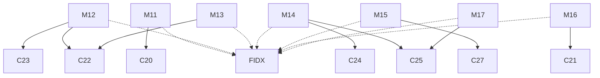

# 反应原理模型

<cite>
**本文引用的文件**
- [M11_热化学盖斯定律模型.ts](file://src/data/chemistry/models/M11_热化学盖斯定律模型.ts)
- [M12_化学平衡分析模型.ts](file://src/data/chemistry/models/M12_化学平衡分析模型.ts)
- [M13_等效平衡模型.ts](file://src/data/chemistry/models/M13_等效平衡模型.ts)
- [M14_弱电解质电离平衡模型.ts](file://src/data/chemistry/models/M14_弱电解质电离平衡模型.ts)
- [M15_沉淀溶解平衡模型.ts](file://src/data/chemistry/models/M15_沉淀溶解平衡模型.ts)
- [M16_速率图像分析模型.ts](file://src/data/chemistry/models/M16_速率图像分析模型.ts)
- [M17_pH综合计算模型.ts](file://src/data/chemistry/models/M17_pH综合计算模型.ts)
- [C20_热化学方程式与盖斯定律.ts](file://src/data/chemistry/concepts/C20_热化学方程式与盖斯定律.ts)
- [C21_化学反应速率.ts](file://src/data/chemistry/concepts/C21_化学反应速率.ts)
- [C22_化学平衡与平衡常数.ts](file://src/data/chemistry/concepts/C22_化学平衡与平衡常数.ts)
- [C23_化学平衡的移动.ts](file://src/data/chemistry/concepts/C23_化学平衡的移动.ts)
- [C24_弱电解质的电离平衡.ts](file://src/data/chemistry/concepts/C24_弱电解质的电离平衡.ts)
- [C25_水的电离与溶液的pH.ts](file://src/data/chemistry/concepts/C25_水的电离与溶液的pH.ts)
- [C27_沉淀溶解平衡.ts](file://src/data/chemistry/concepts/C27_沉淀溶解平衡.ts)
- [index.ts（化学公式库索引）](file://src/data/chemistry/formulas/index.ts)
- [跨学科知识网络.md](file://docs/cross-cutting/跨学科知识网络.md)
</cite>

## 目录
1. [引言](#引言)
2. [项目结构](#项目结构)
3. [核心组件](#核心组件)
4. [架构总览](#架构总览)
5. [详细组件分析](#详细组件分析)
6. [依赖分析](#依赖分析)
7. [性能考量](#性能考量)
8. [故障排查指南](#故障排查指南)
9. [结论](#结论)
10. [附录](#附录)

## 引言
本文件面向“星耀平台”化学学科的“反应原理模型”，系统梳理并阐述以下七个模型的理论基础与应用方法：
- 热化学盖斯定律模型
- 化学平衡分析模型
- 等效平衡模型
- 弱电解质电离平衡模型
- 沉淀溶解平衡模型
- 速率图像分析模型
- pH 综合计算模型

目标是帮助教师与学生建立清晰的知识网络，掌握能量变化、平衡移动、电离与沉淀、反应速率与图像分析、以及 pH 计算的系统方法，并通过典型例题与图像分析技巧提升解题能力。

## 项目结构
本项目采用“概念-模型-公式-应用”的分层组织方式：
- 概念层：提供知识点的背景、困惑点、实验、概念、推导与迁移，形成学习的“认知锚点”
- 模型层：将概念抽象为可操作的“解题模型”，包含定位、原理、变式、知识网络、方法论、自测与应用
- 公式层：提供检索与索引能力，便于快速定位相关公式
- 应用与跨学科：结合真实情境与跨学科迁移，强化综合素养

图表来源
- [M11_热化学盖斯定律模型.ts:1-50](file://src/data/chemistry/models/M11_热化学盖斯定律模型.ts#L1-L50)
- [M12_化学平衡分析模型.ts:1-50](file://src/data/chemistry/models/M12_化学平衡分析模型.ts#L1-L50)
- [M13_等效平衡模型.ts:1-50](file://src/data/chemistry/models/M13_等效平衡模型.ts#L1-L50)
- [M14_弱电解质电离平衡模型.ts:1-50](file://src/data/chemistry/models/M14_弱电解质电离平衡模型.ts#L1-L50)
- [M15_沉淀溶解平衡模型.ts:1-50](file://src/data/chemistry/models/M15_沉淀溶解平衡模型.ts#L1-L50)
- [M16_速率图像分析模型.ts:1-50](file://src/data/chemistry/models/M16_速率图像分析模型.ts#L1-L50)
- [M17_pH综合计算模型.ts:1-50](file://src/data/chemistry/models/M17_pH综合计算模型.ts#L1-L50)
- [C20_热化学方程式与盖斯定律.ts:1-42](file://src/data/chemistry/concepts/C20_热化学方程式与盖斯定律.ts#L1-L42)
- [C21_化学反应速率.ts:1-42](file://src/data/chemistry/concepts/C21_化学反应速率.ts#L1-L42)
- [C22_化学平衡与平衡常数.ts:1-42](file://src/data/chemistry/concepts/C22_化学平衡与平衡常数.ts#L1-L42)
- [C23_化学平衡的移动.ts:1-42](file://src/data/chemistry/concepts/C23_化学平衡的移动.ts#L1-L42)
- [C24_弱电解质的电离平衡.ts:1-42](file://src/data/chemistry/concepts/C24_弱电解质的电离平衡.ts#L1-L42)
- [C25_水的电离与溶液的pH.ts:1-42](file://src/data/chemistry/concepts/C25_水的电离与溶液的pH.ts#L1-L42)
- [C27_沉淀溶解平衡.ts:1-42](file://src/data/chemistry/concepts/C27_沉淀溶解平衡.ts#L1-L42)
- [index.ts（化学公式库索引）:1-19](file://src/data/chemistry/formulas/index.ts#L1-L19)

章节来源
- [M11_热化学盖斯定律模型.ts:1-50](file://src/data/chemistry/models/M11_热化学盖斯定律模型.ts#L1-L50)
- [M12_化学平衡分析模型.ts:1-50](file://src/data/chemistry/models/M12_化学平衡分析模型.ts#L1-L50)
- [M13_等效平衡模型.ts:1-50](file://src/data/chemistry/models/M13_等效平衡模型.ts#L1-L50)
- [M14_弱电解质电离平衡模型.ts:1-50](file://src/data/chemistry/models/M14_弱电解质电离平衡模型.ts#L1-L50)
- [M15_沉淀溶解平衡模型.ts:1-50](file://src/data/chemistry/models/M15_沉淀溶解平衡模型.ts#L1-L50)
- [M16_速率图像分析模型.ts:1-50](file://src/data/chemistry/models/M16_速率图像分析模型.ts#L1-L50)
- [M17_pH综合计算模型.ts:1-50](file://src/data/chemistry/models/M17_pH综合计算模型.ts#L1-L50)
- [C20_热化学方程式与盖斯定律.ts:1-42](file://src/data/chemistry/concepts/C20_热化学方程式与盖斯定律.ts#L1-L42)
- [C21_化学反应速率.ts:1-42](file://src/data/chemistry/concepts/C21_化学反应速率.ts#L1-L42)
- [C22_化学平衡与平衡常数.ts:1-42](file://src/data/chemistry/concepts/C22_化学平衡与平衡常数.ts#L1-L42)
- [C23_化学平衡的移动.ts:1-42](file://src/data/chemistry/concepts/C23_化学平衡的移动.ts#L1-L42)
- [C24_弱电解质的电离平衡.ts:1-42](file://src/data/chemistry/concepts/C24_弱电解质的电离平衡.ts#L1-L42)
- [C25_水的电离与溶液的pH.ts:1-42](file://src/data/chemistry/concepts/C25_水的电离与溶液的pH.ts#L1-L42)
- [C27_沉淀溶解平衡.ts:1-42](file://src/data/chemistry/concepts/C27_沉淀溶解平衡.ts#L1-L42)
- [index.ts（化学公式库索引）:1-19](file://src/data/chemistry/formulas/index.ts#L1-L19)

## 核心组件
本节聚焦七个反应原理模型的“七模块”结构：定位（核心/本质/关键洞察）、原理、变式（基础/进阶/挑战）、知识网络（父节点/子节点/关联）、方法论（思路/决策树/技巧/常见误区）、自测与应用。

- 定位与原理：明确模型在知识体系中的位置、核心与关键洞察，给出可迁移的原理
- 变式与难度：按基础、进阶、挑战三个层级组织，便于分层教学与练习
- 知识网络：标注与哪些概念/模型存在父子、子、关联关系，形成知识图谱
- 方法论：提供解题思路、决策树、技巧与常见误区，帮助学生建立系统方法
- 自测与应用：提供典型题目与应用场景，强化迁移与应用

章节来源
- [M11_热化学盖斯定律模型.ts:14-40](file://src/data/chemistry/models/M11_热化学盖斯定律模型.ts#L14-L40)
- [M12_化学平衡分析模型.ts:14-40](file://src/data/chemistry/models/M12_化学平衡分析模型.ts#L14-L40)
- [M13_等效平衡模型.ts:14-40](file://src/data/chemistry/models/M13_等效平衡模型.ts#L14-L40)
- [M14_弱电解质电离平衡模型.ts:14-40](file://src/data/chemistry/models/M14_弱电解质电离平衡模型.ts#L14-L40)
- [M15_沉淀溶解平衡模型.ts:14-40](file://src/data/chemistry/models/M15_沉淀溶解平衡模型.ts#L14-L40)
- [M16_速率图像分析模型.ts:14-40](file://src/data/chemistry/models/M16_速率图像分析模型.ts#L14-L40)
- [M17_pH综合计算模型.ts:14-40](file://src/data/chemistry/models/M17_pH综合计算模型.ts#L14-L40)

## 架构总览
下图展示七个模型与其对应的概念节点之间的映射关系，体现“概念驱动模型、模型支撑应用”的知识架构。

图表来源
- [C20_热化学方程式与盖斯定律.ts:1-42](file://src/data/chemistry/concepts/C20_热化学方程式与盖斯定律.ts#L1-L42)
- [C21_化学反应速率.ts:1-42](file://src/data/chemistry/concepts/C21_化学反应速率.ts#L1-L42)
- [C22_化学平衡与平衡常数.ts:1-42](file://src/data/chemistry/concepts/C22_化学平衡与平衡常数.ts#L1-L42)
- [C23_化学平衡的移动.ts:1-42](file://src/data/chemistry/concepts/C23_化学平衡的移动.ts#L1-L42)
- [C24_弱电解质的电离平衡.ts:1-42](file://src/data/chemistry/concepts/C24_弱电解质的电离平衡.ts#L1-L42)
- [C25_水的电离与溶液的pH.ts:1-42](file://src/data/chemistry/concepts/C25_水的电离与溶液的pH.ts#L1-L42)
- [C27_沉淀溶解平衡.ts:1-42](file://src/data/chemistry/concepts/C27_沉淀溶解平衡.ts#L1-L42)
- [M11_热化学盖斯定律模型.ts:1-50](file://src/data/chemistry/models/M11_热化学盖斯定律模型.ts#L1-L50)
- [M12_化学平衡分析模型.ts:1-50](file://src/data/chemistry/models/M12_化学平衡分析模型.ts#L1-L50)
- [M13_等效平衡模型.ts:1-50](file://src/data/chemistry/models/M13_等效平衡模型.ts#L1-L50)
- [M14_弱电解质电离平衡模型.ts:1-50](file://src/data/chemistry/models/M14_弱电解质电离平衡模型.ts#L1-L50)
- [M15_沉淀溶解平衡模型.ts:1-50](file://src/data/chemistry/models/M15_沉淀溶解平衡模型.ts#L1-L50)
- [M16_速率图像分析模型.ts:1-50](file://src/data/chemistry/models/M16_速率图像分析模型.ts#L1-L50)
- [M17_pH综合计算模型.ts:1-50](file://src/data/chemistry/models/M17_pH综合计算模型.ts#L1-L50)
- [index.ts（化学公式库索引）:1-19](file://src/data/chemistry/formulas/index.ts#L1-L19)

## 详细组件分析

### 热化学盖斯定律模型
- 理论基础：盖斯定律表明反应热只与始末状态有关，与路径无关；可用于间接计算反应热、热化学方程式的组合与变换
- 应用要点：
  - 通过已知反应热数据叠加或反向叠加，求未知反应热
  - 注意方程式的系数与热效应的对应关系
  - 利用图像（如反应进程图）辅助理解能量变化趋势
- 计算步骤（示意）：
  1) 写出目标反应
  2) 选择合适的已知热化学方程式
  3) 通过乘除调整系数，使中间物质抵消
  4) 将反应热相加或相减得到目标反应热
- 图像分析技巧：
  - 观察反应物与生成物的相对能量高低
  - 判断反应是放热还是吸热
  - 分析活化能与反应热的关系
- 典型例题类型：热化学方程式组合、反应热叠加、逆反应热与正反应热的关系

章节来源
- [M11_热化学盖斯定律模型.ts:1-50](file://src/data/chemistry/models/M11_热化学盖斯定律模型.ts#L1-L50)
- [C20_热化学方程式与盖斯定律.ts:1-42](file://src/data/chemistry/concepts/C20_热化学方程式与盖斯定律.ts#L1-L42)

### 化学平衡分析模型
- 理论基础：动态平衡、平衡常数 K 的表达与计算、反应商 Q 与 K 的比较判断移动方向
- 应用要点：
  - 平衡常数表达式书写与计算
  - 利用 Q 与 K 判断平衡移动方向
  - 多步平衡的串联与叠加
- 计算步骤（示意）：
  1) 写出平衡表达式
  2) 代入平衡浓度或分压
  3) 求解 K 或判断移动方向
- 图像分析技巧：
  - 浓度-时间曲线：观察斜率变化与平台期
  - 速率-时间曲线：区分正逆反应速率
- 典型例题类型：平衡常数计算、平衡移动判断、多步平衡串联

章节来源
- [M12_化学平衡分析模型.ts:1-50](file://src/data/chemistry/models/M12_化学平衡分析模型.ts#L1-L50)
- [C22_化学平衡与平衡常数.ts:1-42](file://src/data/chemistry/concepts/C22_化学平衡与平衡常数.ts#L1-L42)
- [C23_化学平衡的移动.ts:1-42](file://src/data/chemistry/concepts/C23_化学平衡的移动.ts#L1-L42)

### 等效平衡模型
- 理论基础：等效平衡是指不同起始状态下达到相同平衡状态的体系；强调等价关系与平衡常数不变
- 应用要点：
  - 同一平衡体系的不同投料方式是否等效
  - 容器体积变化对等效关系的影响
  - 平衡常数与等效关系的联系
- 计算步骤（示意）：
  1) 确定反应计量关系
  2) 判断起始投料是否等价
  3) 比较平衡常数与平衡位置
- 图像分析技巧：
  - 起始与平衡状态的对比
  - 不同投料路径的平衡曲线重合性
- 典型例题类型：等效投料判断、等效平衡建立、平衡常数应用

章节来源
- [M13_等效平衡模型.ts:1-50](file://src/data/chemistry/models/M13_等效平衡模型.ts#L1-L50)
- [C22_化学平衡与平衡常数.ts:1-42](file://src/data/chemistry/concepts/C22_化学平衡与平衡常数.ts#L1-L42)
- [C23_化学平衡的移动.ts:1-42](file://src/data/chemistry/concepts/C23_化学平衡的移动.ts#L1-L42)

### 弱电解质电离平衡模型
- 理论基础：弱电解质部分电离、电离平衡常数 Ka、电离度 α、稀释定律
- 应用要点：
  - 电离平衡表达式与 Ka 的计算
  - 一元弱酸/弱碱的 pH 近似计算
  - 同离子效应与缓冲体系
- 计算步骤（示意）：
  1) 写出电离平衡表达式
  2) 建立电离度或浓度关系
  3) 代入 Ka 估算 [H⁺] 或 pOH
  4) 求 pH 或 pOH
- 图像分析技巧：
  - 电离度随浓度变化的曲线
  - 缓冲区间内的 pH 变化趋势
- 典型例题类型：Ka 计算、pH 近似、同离子效应、缓冲体系

章节来源
- [M14_弱电解质电离平衡模型.ts:1-50](file://src/data/chemistry/models/M14_弱电解质电离平衡模型.ts#L1-L50)
- [C24_弱电解质的电离平衡.ts:1-42](file://src/data/chemistry/concepts/C24_弱电解质的电离平衡.ts#L1-L42)
- [C25_水的电离与溶液的pH.ts:1-42](file://src/data/chemistry/concepts/C25_水的电离与溶液的pH.ts#L1-L42)

### 沉淀溶解平衡模型
- 理论基础：溶度积 Ksp、沉淀生成与溶解的条件判断、离子积 Qc 与 Ksp 的比较
- 应用要点：
  - Ksp 表达式与计算
  - 通过 Qc 判断沉淀生成或溶解
  - 共同离子效应与沉淀顺序
- 计算步骤（示意）：
  1) 写出沉淀溶解平衡表达式
  2) 计算离子积 Qc
  3) 比较 Qc 与 Ksp 判断过程
- 图像分析技巧：
  - 溶解度随温度/浓度变化的趋势
  - 沉淀滴定曲线（突跃点）
- 典型例题类型：Ksp 计算、沉淀生成与溶解、沉淀分离

章节来源
- [M15_沉淀溶解平衡模型.ts:1-50](file://src/data/chemistry/models/M15_沉淀溶解平衡模型.ts#L1-L50)
- [C27_沉淀溶解平衡.ts:1-42](file://src/data/chemistry/concepts/C27_沉淀溶解平衡.ts#L1-L42)

### 速率图像分析模型
- 理论基础：有效碰撞理论、活化能、反应速率与浓度/温度/催化剂的关系
- 应用要点：
  - 速率-时间曲线的斜率与瞬时速率
  - 浓度-时间曲线的形状与反应级数判断
  - 活化能与温度对速率的影响
- 计算步骤（示意）：
  1) 读取图像坐标与单位
  2) 计算某时刻的切线斜率（瞬时速率）
  3) 比较不同条件下的速率差异
- 图像分析技巧：
  - 曲线斜率变化反映反应快慢
  - 拐点与平台期的物理意义
- 典型例题类型：速率图像解读、反应级数判断、活化能估计

章节来源
- [M16_速率图像分析模型.ts:1-50](file://src/data/chemistry/models/M16_速率图像分析模型.ts#L1-L50)
- [C21_化学反应速率.ts:1-42](file://src/data/chemistry/concepts/C21_化学反应速率.ts#L1-L42)

### pH 综合计算模型
- 理论基础：水的离子积 Kw、pH/pOH 与 [H⁺]/[OH⁻] 的关系、缓冲体系与稀释
- 应用要点：
  - 强酸/强碱、一元弱酸/弱碱的 pH 近似计算
  - 缓冲溶液的组成与缓冲容量
  - 混合溶液的最终 pH 计算
- 计算步骤（示意）：
  1) 判断溶液类型（强酸/强碱/弱酸/弱碱/缓冲）
  2) 选择合适的近似或公式
  3) 代入已知数据计算 [H⁺] 或 [OH⁻]
  4) 求 pH 或 pOH
- 图像分析技巧：
  - 滴定曲线的突跃与缓冲区间
  - 指示剂的选择与变色范围
- 典型例题类型：混合溶液 pH、缓冲体系、滴定终点判断

章节来源
- [M17_pH综合计算模型.ts:1-50](file://src/data/chemistry/models/M17_pH综合计算模型.ts#L1-L50)
- [C25_水的电离与溶液的pH.ts:1-42](file://src/data/chemistry/concepts/C25_水的电离与溶液的pH.ts#L1-L42)
- [跨学科知识网络.md:546-563](file://docs/cross-cutting/跨学科知识网络.md#L546-L563)

## 依赖分析
- 概念到模型的映射：每个模型均与一个或多个概念节点对应，确保“先概念后模型”的学习路径
- 方法论与知识网络：模型内部的“方法论”与“知识网络”为学生提供“如何学”和“知识关联”的双重支持
- 公式检索：通过公式索引可快速定位相关公式卡片，支撑模型中的“核心公式”与“公式使用”

图表来源
- [M11_热化学盖斯定律模型.ts:1-50](file://src/data/chemistry/models/M11_热化学盖斯定律模型.ts#L1-L50)
- [M12_化学平衡分析模型.ts:1-50](file://src/data/chemistry/models/M12_化学平衡分析模型.ts#L1-L50)
- [M13_等效平衡模型.ts:1-50](file://src/data/chemistry/models/M13_等效平衡模型.ts#L1-L50)
- [M14_弱电解质电离平衡模型.ts:1-50](file://src/data/chemistry/models/M14_弱电解质电离平衡模型.ts#L1-L50)
- [M15_沉淀溶解平衡模型.ts:1-50](file://src/data/chemistry/models/M15_沉淀溶解平衡模型.ts#L1-L50)
- [M16_速率图像分析模型.ts:1-50](file://src/data/chemistry/models/M16_速率图像分析模型.ts#L1-L50)
- [M17_pH综合计算模型.ts:1-50](file://src/data/chemistry/models/M17_pH综合计算模型.ts#L1-L50)
- [C20_热化学方程式与盖斯定律.ts:1-42](file://src/data/chemistry/concepts/C20_热化学方程式与盖斯定律.ts#L1-L42)
- [C21_化学反应速率.ts:1-42](file://src/data/chemistry/concepts/C21_化学反应速率.ts#L1-L42)
- [C22_化学平衡与平衡常数.ts:1-42](file://src/data/chemistry/concepts/C22_化学平衡与平衡常数.ts#L1-L42)
- [C23_化学平衡的移动.ts:1-42](file://src/data/chemistry/concepts/C23_化学平衡的移动.ts#L1-L42)
- [C24_弱电解质的电离平衡.ts:1-42](file://src/data/chemistry/concepts/C24_弱电解质的电离平衡.ts#L1-L42)
- [C25_水的电离与溶液的pH.ts:1-42](file://src/data/chemistry/concepts/C25_水的电离与溶液的pH.ts#L1-L42)
- [C27_沉淀溶解平衡.ts:1-42](file://src/data/chemistry/concepts/C27_沉淀溶解平衡.ts#L1-L42)
- [index.ts（化学公式库索引）:1-19](file://src/data/chemistry/formulas/index.ts#L1-L19)

章节来源
- [index.ts（化学公式库索引）:1-19](file://src/data/chemistry/formulas/index.ts#L1-L19)

## 性能考量
- 数据检索效率：公式索引提供 O(n) 的过滤能力，建议在前端或服务端缓存常用查询结果
- 模型渲染优化：模型数据结构统一，建议按需加载与懒加载，减少首屏压力
- 图像分析：对于速率与滴定图像，建议提供缩放与标注工具，提升交互体验与分析精度

## 故障排查指南
- 概念与模型不匹配：若发现模型与概念节点不一致，优先检查概念节点的“相关模型”字段与模型的“知识网络”关系
- 公式缺失：若模型标注“核心公式”为空，可在公式索引中补充或回填
- 图像分析偏差：若图像分析结果与预期不符，检查横纵坐标单位、刻度与截取区间
- 自测与应用：若自测题与模型难度不匹配，根据“基础/进阶/挑战”层级重新归类

章节来源
- [index.ts（化学公式库索引）:1-19](file://src/data/chemistry/formulas/index.ts#L1-L19)

## 结论
本文件基于“概念—模型—公式—应用”的知识架构，系统梳理了七个反应原理模型的理论基础与应用方法。通过统一的“七模块”结构与跨学科迁移，有助于教师开展分层教学，帮助学生建立系统的方法论与知识网络，提升解决复杂化学问题的能力。

## 附录
- 典型例题建议：
  - 热化学：热化学方程式组合与反应热叠加
  - 平衡：平衡常数计算、Q 与 K 判断移动、等效平衡建立
  - 电离：Ka 计算、pH 近似、缓冲体系
  - 沉淀：Ksp 计算、沉淀生成与分离
  - 速率：速率图像解读、反应级数判断
  - pH：混合溶液 pH、缓冲与滴定
- 跨学科示例：pH 与对数运算、缓冲体系与生物稳态

章节来源
- [跨学科知识网络.md:546-563](file://docs/cross-cutting/跨学科知识网络.md#L546-L563)