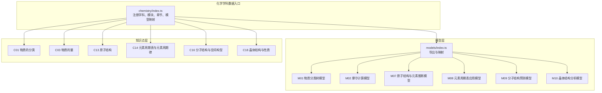
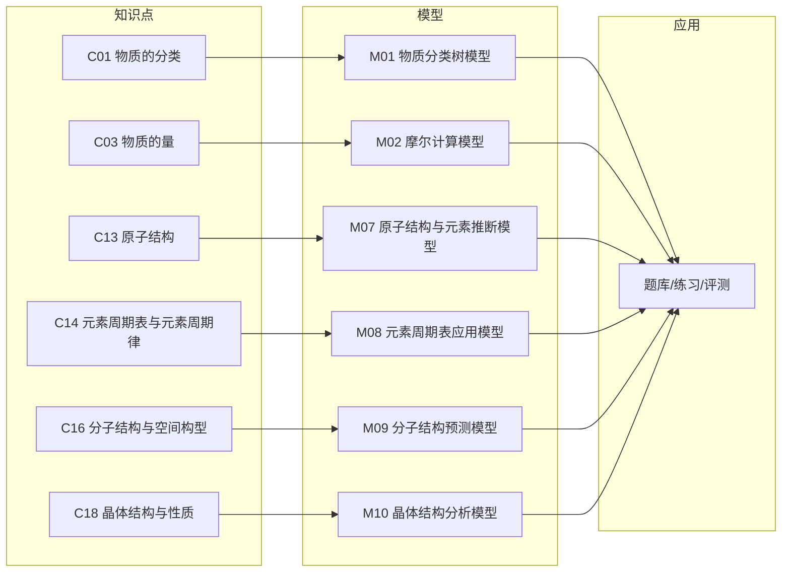
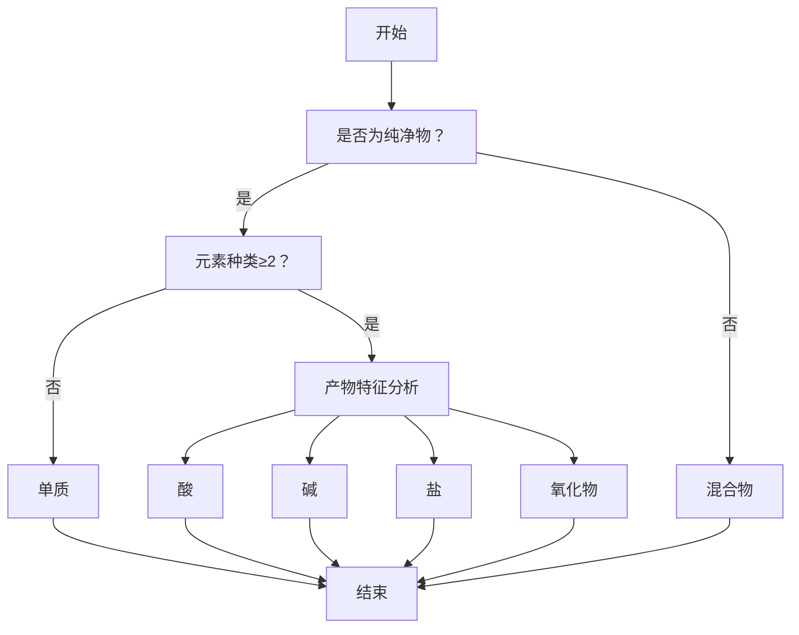
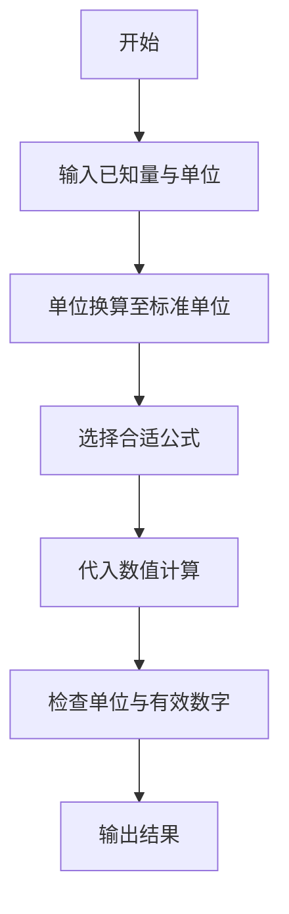
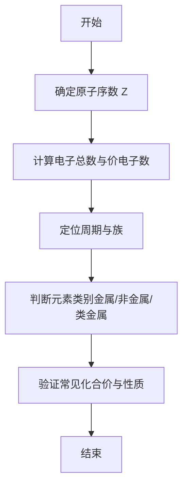
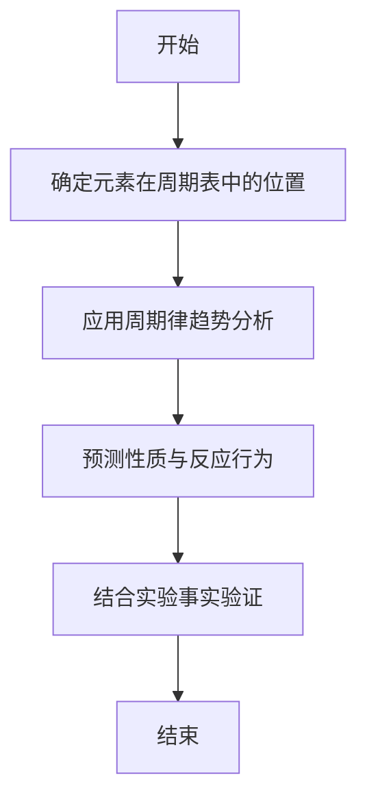
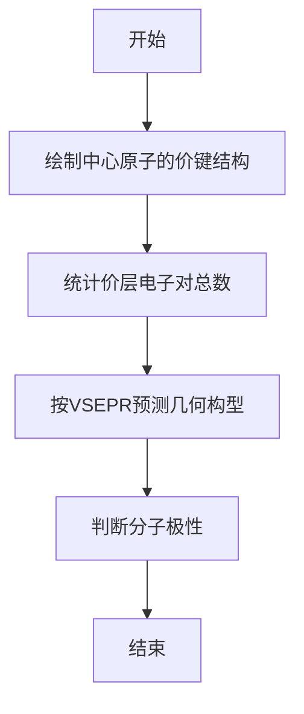
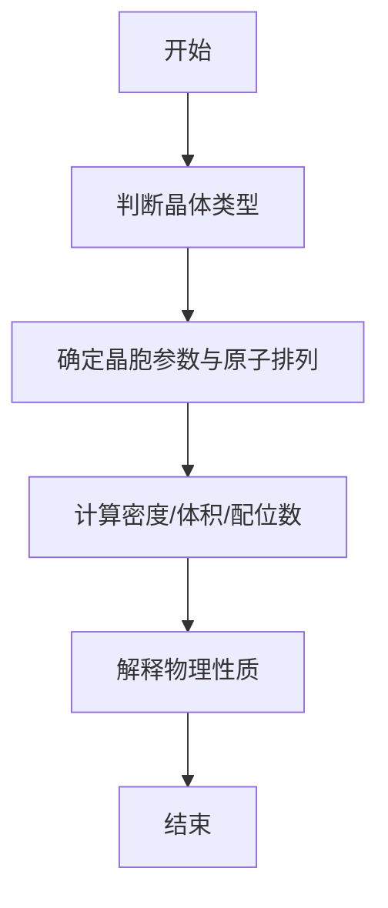
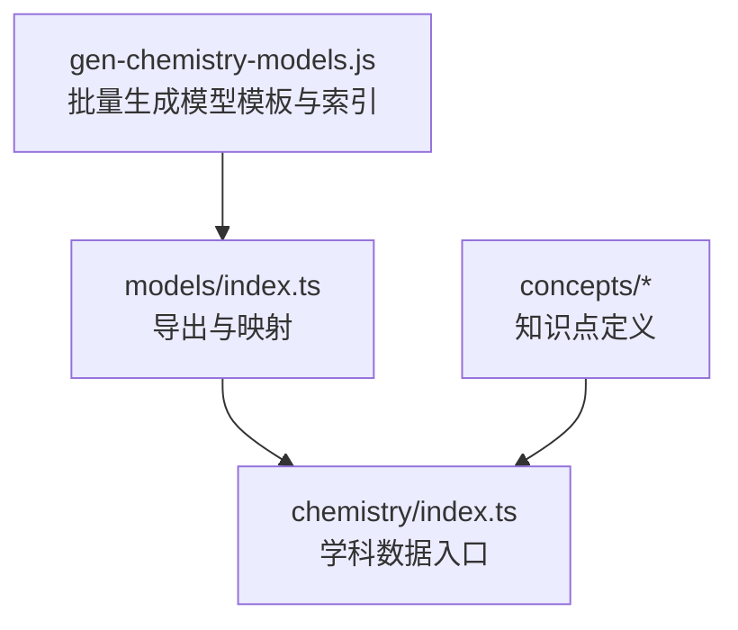

# 基础概念模型

<cite>
**本文引用的文件**
- [M01_物质分类树模型.ts](file://src/data/chemistry/models/M01_物质分类树模型.ts)
- [M02_摩尔计算模型.ts](file://src/data/chemistry/models/M02_摩尔计算模型.ts)
- [M07_原子结构与元素推断模型.ts](file://src/data/chemistry/models/M07_原子结构与元素推断模型.ts)
- [M08_元素周期表应用模型.ts](file://src/data/chemistry/models/M08_元素周期表应用模型.ts)
- [M09_分子结构预测模型.ts](file://src/data/chemistry/models/M09_分子结构预测模型.ts)
- [M10_晶体结构分析模型.ts](file://src/data/chemistry/models/M10_晶体结构分析模型.ts)
- [C01_物质的分类.ts](file://src/data/chemistry/concepts/C01_物质的分类.ts)
- [C03_物质的量.ts](file://src/data/chemistry/concepts/C03_物质的量.ts)
- [C13_原子结构.ts](file://src/data/chemistry/concepts/C13_原子结构.ts)
- [C14_元素周期表与元素周期律.ts](file://src/data/chemistry/concepts/C14_元素周期表与元素周期律.ts)
- [C16_分子结构与空间构型.ts](file://src/data/chemistry/concepts/C16_分子结构与空间构型.ts)
- [C18_晶体结构与性质.ts](file://src/data/chemistry/concepts/C18_晶体结构与性质.ts)
- [index.ts（化学模型索引）](file://src/data/chemistry/models/index.ts)
- [index.ts（化学学科数据入口）](file://src/data/chemistry/index.ts)
- [gen-chemistry-models.js](file://scripts/gen-chemistry-models.js)
</cite>

## 目录
1. [引言](#引言)
2. [项目结构](#项目结构)
3. [核心组件](#核心组件)
4. [架构总览](#架构总览)
5. [详细组件分析](#详细组件分析)
6. [依赖分析](#依赖分析)
7. [性能考虑](#性能考虑)
8. [故障排查指南](#故障排查指南)
9. [结论](#结论)
10. [附录](#附录)

## 引言
本文件面向“星耀平台”化学学科，系统梳理并阐述六大基础概念模型：物质分类树模型、摩尔计算模型、原子结构与元素推断模型、元素周期表应用模型、分子结构预测模型、晶体结构分析模型。通过对模型的定位、原理、方法论、知识网络、变式与应用进行结构化描述，帮助教师与学习者建立清晰的知识脉络与解题范式，并提供可复用的图谱化资源组织方式。

## 项目结构
化学数据采用“模块-章节-知识点/模型”的三层组织，模型与知识点通过统一的数据入口注册，支持前端按模块与难度检索与渲染。

**图示来源**
- [index.ts（化学学科数据入口）:22-93](file://src/data/chemistry/index.ts#L22-L93)
- [index.ts（化学模型索引）:57-106](file://src/data/chemistry/models/index.ts#L57-L106)

**章节来源**
- [index.ts（化学学科数据入口）:22-93](file://src/data/chemistry/index.ts#L22-L93)
- [index.ts（化学模型索引）:1-209](file://src/data/chemistry/models/index.ts#L1-L209)

## 核心组件
六大基础概念模型均遵循统一的结构化模板，包含以下关键字段：
- 基本信息：id、title、module、chapter、difficulty
- 定位与要点：positioning.core/essence/keyInsight
- 原理与公式：principle、knowledgeNetwork.coreFormula
- 方法论：methodology.approach、decisionTree、tips、commonMistakes
- 变式与应用：variations.basic/advanced/challenge、applications
- 自测与关联：selfCheck、knowledgeNetwork.parents/children/related

该模板确保不同模型在“内容组织—方法论—应用迁移”层面的一致性，便于教学与学习路径的贯通。

**章节来源**
- [M01_物质分类树模型.ts:4-49](file://src/data/chemistry/models/M01_物质分类树模型.ts#L4-L49)
- [M02_摩尔计算模型.ts:4-49](file://src/data/chemistry/models/M02_摩尔计算模型.ts#L4-L49)
- [M07_原子结构与元素推断模型.ts:4-49](file://src/data/chemistry/models/M07_原子结构与元素推断模型.ts#L4-L49)
- [M08_元素周期表应用模型.ts:4-49](file://src/data/chemistry/models/M08_元素周期表应用模型.ts#L4-L49)
- [M09_分子结构预测模型.ts:4-49](file://src/data/chemistry/models/M09_分子结构预测模型.ts#L4-L49)
- [M10_晶体结构分析模型.ts:4-49](file://src/data/chemistry/models/M10_晶体结构分析模型.ts#L4-L49)

## 架构总览
下图展示“知识点—模型—应用”的知识图谱化组织与调用关系，体现从概念到模型再到实践应用的闭环。

**图示来源**
- [index.ts（化学学科数据入口）:135-183](file://src/data/chemistry/index.ts#L135-L183)
- [index.ts（化学模型索引）:159-208](file://src/data/chemistry/models/index.ts#L159-L208)

## 详细组件分析

### 物质分类树模型
- 定位与本质
  - 核心：以纯净物/混合物为根，单质/化合物为一级分支；酸、碱、盐、氧化物为二级分支，形成“树形分类体系”
  - 本质：通过“是否由一种物质组成”和“组成种类”两个维度进行二分决策
- 判断标准
  - 单质：由同种元素组成的纯净物
  - 化合物：由不同元素组成的纯净物
  - 酸：电离出的阳离子全部为氢离子
  - 碱：电离出的阴离子全部为氢氧根
  - 盐：金属阳离子（或铵根）+酸根阴离子
  - 氧化物：仅含两种元素，其中之一为氧
- 解题步骤
  1) 观察物质组成与形态
  2) 判断是否为纯净物
  3) 若为纯净物，进一步判断元素种类与产物特征
  4) 归入相应分支并校验互斥性
- 典型例题
  - 将NaCl、HClO、Ca(OH)₂、CO₂、Al分别归类，并说明理由
- 易错点
  - 混淆“混合物”与“化合物”，如王水虽为混合物但其组分仍为HCl与HNO₃
  - 将过氧化物、超氧化物误判为普通氧化物

**图示来源**
- [M01_物质分类树模型.ts:4-49](file://src/data/chemistry/models/M01_物质分类树模型.ts#L4-L49)
- [C01_物质的分类.ts:4-41](file://src/data/chemistry/concepts/C01_物质的分类.ts#L4-L41)

**章节来源**
- [M01_物质分类树模型.ts:4-49](file://src/data/chemistry/models/M01_物质分类树模型.ts#L4-L49)
- [C01_物质的分类.ts:4-41](file://src/data/chemistry/concepts/C01_物质的分类.ts#L4-L41)

### 摩尔计算模型
- 核心要点
  - 物质的量 n、质量 m、粒子数 N、气体体积 V 的换算关系
  - 阿伏伽德罗常数 N_A 的使用场景与单位换算
  - 气体摩尔体积在标准状况下的数值与适用条件
- 计算技巧
  - 统一单位：质量用 g，体积用 L 或 m³，温度压强需标准化
  - 多步换算优先使用 n 作为桥梁，减少错误传播
  - 注意气体摩尔体积仅适用于标准状况
- 解题步骤
  1) 明确已知量与目标量
  2) 写出相关公式并标注单位
  3) 代入数值前先进行单位换算
  4) 计算结果保留合理有效数字
- 典型例题
  - 已知某气体在标准状况下的体积，求其物质的量与分子数
- 易错点
  - 忽视标准状况条件，直接套用 22.4 L/mol
  - 单位换算错误，如 mL 与 L、m³ 与 L 的关系

**图示来源**
- [M02_摩尔计算模型.ts:4-49](file://src/data/chemistry/models/M02_摩尔计算模型.ts#L4-L49)
- [C03_物质的量.ts:4-41](file://src/data/chemistry/concepts/C03_物质的量.ts#L4-L41)

**章节来源**
- [M02_摩尔计算模型.ts:4-49](file://src/data/chemistry/models/M02_摩尔计算模型.ts#L4-L49)
- [C03_物质的量.ts:4-41](file://src/data/chemistry/concepts/C03_物质的量.ts#L4-L41)

### 原子结构与元素推断模型
- 推理路径
  - 依据原子序数确定质子数与电子总数
  - 依据电子排布确定主族、周期、区（s/p/d/f）
  - 依据价电子数与成键倾向推断常见化合价
- 方法论
  - 电子层排布：K、L、M、N…层最多容纳 2n² 个电子
  - 价电子：最外层电子决定化学性质
  - 推断策略：从 Z 出发，逐步写出电子构型，再判断元素类别与性质
- 解题步骤
  1) 由题目给出的条件列出约束
  2) 确定电子总数与价电子数
  3) 判断周期、族与区
  4) 验证常见氧化态与成键特性
- 典型例题
  - 已知某元素原子最外层电子数为其电子层数的 3 倍，推断元素并写出其常见氧化态
- 易错点
  - d 区元素价电子包括次外层 d 电子
  - 过渡元素常见价态多样，需结合具体情境判断

**图示来源**
- [M07_原子结构与元素推断模型.ts:4-49](file://src/data/chemistry/models/M07_原子结构与元素推断模型.ts#L4-L49)
- [C13_原子结构.ts:4-41](file://src/data/chemistry/concepts/C13_原子结构.ts#L4-L41)

**章节来源**
- [M07_原子结构与元素推断模型.ts:4-49](file://src/data/chemistry/models/M07_原子结构与元素推断模型.ts#L4-L49)
- [C13_原子结构.ts:4-41](file://src/data/chemistry/concepts/C13_原子结构.ts#L4-L41)

### 元素周期表应用模型
- 应用规律
  - 周期性：从左到右金属性减弱、非金属性增强；从上到下金属性增强、非金属性减弱
  - 位-构-性：原子半径、电负性、第一电离能等性质随位置呈周期性变化
  - 性质预测：基于已知元素性质推测未知元素的反应性、稳定性与化合物特征
- 解题步骤
  1) 明确所涉元素在周期表中的位置
  2) 判断其所属周期与族
  3) 基于周期律趋势进行性质对比与预测
  4) 结合实验事实或反应现象验证
- 典型例题
  - 比较 Na、Mg、Al 的金属性强弱，并预测其最高价氧化物对应水化物的碱性强弱
- 易错点
  - 将“金属性”与“得电子能力”混淆
  - 忽视同周期与同族的差异导致判断偏差

**图示来源**
- [M08_元素周期表应用模型.ts:4-49](file://src/data/chemistry/models/M08_元素周期表应用模型.ts#L4-L49)
- [C14_元素周期表与元素周期律.ts:4-41](file://src/data/chemistry/concepts/C14_元素周期表与元素周期律.ts#L4-L41)

**章节来源**
- [M08_元素周期表应用模型.ts:4-49](file://src/data/chemistry/models/M08_元素周期表应用模型.ts#L4-L49)
- [C14_元素周期表与元素周期律.ts:4-41](file://src/data/chemistry/concepts/C14_元素周期表与元素周期律.ts#L4-L41)

### 分子结构预测模型（VSEPR）
- 理论应用
  - VSEPR：价电子对互斥，分子构型由中心原子价电子对总数与成键电子对/孤对电子数决定
  - 通过价层电子对数（VSEPR 数）预测几何构型（直线、平面三角、四面体等）
- 解题步骤
  1) 画出中心原子的Lewis结构，标出成键与孤电子对
  2) 计算价层电子对总数（成键+孤对）
  3) 忽略孤对电子的空间排布确定几何构型
  4) 判断分子极性（根据对称性与电负性差异）
- 典型例题
  - 用VSEPR预测 NH₃、H₂O、SO₂ 的空间构型与极性
- 易错点
  - 误将孤对电子当作“成键电子对”计数
  - 忽视分子极性的判断需结合对称性

**图示来源**
- [M09_分子结构预测模型.ts:4-49](file://src/data/chemistry/models/M09_分子结构预测模型.ts#L4-L49)
- [C16_分子结构与空间构型.ts:4-41](file://src/data/chemistry/concepts/C16_分子结构与空间构型.ts#L4-L41)

**章节来源**
- [M09_分子结构预测模型.ts:4-49](file://src/data/chemistry/models/M09_分子结构预测模型.ts#L4-L49)
- [C16_分子结构与空间构型.ts:4-41](file://src/data/chemistry/concepts/C16_分子结构与空间构型.ts#L4-L41)

### 晶体结构分析模型
- 晶体类型与性质
  - 离子晶体：高熔沸点、固态不导电、水溶液或熔融导电
  - 原子晶体：高熔沸点、硬度大、不导电
  - 分子晶体：低熔沸点、可升华、多数不导电
  - 金属晶体：导电导热、延展性好
- 晶胞参数与堆积方式
  - 晶胞参数：a=b=c，α=β=γ=90°（简单立方）或更复杂
  - 常见堆积：简单立方、体心立方、面心立方、六方最密堆积
  - 密度计算：利用晶胞体积与原子数估算
- 解题步骤
  1) 判断晶体类型（依据构成微粒与作用力）
  2) 识别晶胞形状与原子排列方式
  3) 由晶胞参数与原子数计算密度或晶胞体积
  4) 结合性质解释物理特性
- 典型例题
  - 已知NaCl晶胞参数与晶胞中粒子数，计算NaCl晶体密度
- 易错点
  - 晶胞中原子归属计算错误（角、棱、面、心的贡献）
  - 忽视不同堆积方式对应的配位数与空间利用率

**图示来源**
- [M10_晶体结构分析模型.ts:4-49](file://src/data/chemistry/models/M10_晶体结构分析模型.ts#L4-L49)
- [C18_晶体结构与性质.ts:4-41](file://src/data/chemistry/concepts/C18_晶体结构与性质.ts#L4-L41)

**章节来源**
- [M10_晶体结构分析模型.ts:4-49](file://src/data/chemistry/models/M10_晶体结构分析模型.ts#L4-L49)
- [C18_晶体结构与性质.ts:4-41](file://src/data/chemistry/concepts/C18_晶体结构与性质.ts#L4-L41)

## 依赖分析
- 数据入口依赖模型索引与知识点索引，统一暴露给前端模块
- 模型索引集中导出并维护 ID 到模型对象的映射，便于按模块/难度检索
- 生成脚本批量创建模型文件与索引，保证结构一致性与可扩展性

**图示来源**
- [gen-chemistry-models.js:125-165](file://scripts/gen-chemistry-models.js#L125-L165)
- [index.ts（化学模型索引）:131-165](file://src/data/chemistry/models/index.ts#L131-L165)
- [index.ts（化学学科数据入口）:135-183](file://src/data/chemistry/index.ts#L135-L183)

**章节来源**
- [gen-chemistry-models.js:125-165](file://scripts/gen-chemistry-models.js#L125-L165)
- [index.ts（化学模型索引）:131-165](file://src/data/chemistry/models/index.ts#L131-L165)
- [index.ts（化学学科数据入口）:135-183](file://src/data/chemistry/index.ts#L135-L183)

## 性能考虑
- 模型与知识点采用静态数据结构，加载时一次性注入，避免运行时重复计算
- 按模块与难度分层组织，前端可按需懒加载，降低首屏压力
- 统一的映射表支持 O(1) 查找，适合高频查询场景

## 故障排查指南
- 模型未显示
  - 检查模型 ID 是否在 ALL_MODEL_IDS 中
  - 确认模块名与章节名与学科元数据一致
- 数据缺失
  - 模板字段未填充：定位对应模型文件，完善 positioning/principle/methodology 等字段
  - 知识点未关联：在 concepts 文件中补充 relatedModels/crossLinks
- 生成异常
  - 使用生成脚本重新生成模型文件与索引，确保文件名与导出一致

**章节来源**
- [index.ts（化学模型索引）:108-157](file://src/data/chemistry/models/index.ts#L108-L157)
- [index.ts（化学学科数据入口）:135-183](file://src/data/chemistry/index.ts#L135-L183)

## 结论
六大基础概念模型以统一模板构建，覆盖物质分类、计量、结构与周期律、分子与晶体等核心主题。通过明确的定位、严谨的方法论与系统化的知识网络，能够有效支撑教学与学习路径的设计与实施。建议在实际使用中持续完善各模型的“七模块内容”，并结合题库与评测数据迭代优化。

## 附录
- 模块与模型对照（节选）
  - 物质分类与计量：M01、M02
  - 物质结构与元素周期律：M07、M08、M09、M10
- 生成脚本用途
  - 自动生成模型文件与索引，便于快速扩展与维护

**章节来源**
- [index.ts（化学模型索引）:159-208](file://src/data/chemistry/models/index.ts#L159-L208)
- [gen-chemistry-models.js:10-68](file://scripts/gen-chemistry-models.js#L10-L68)