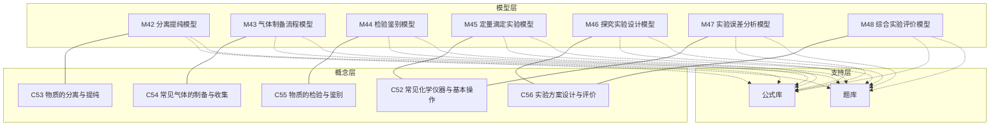
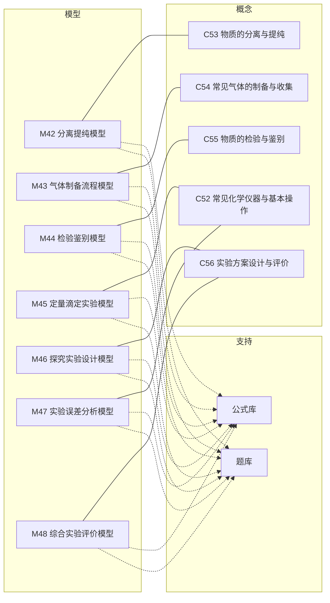
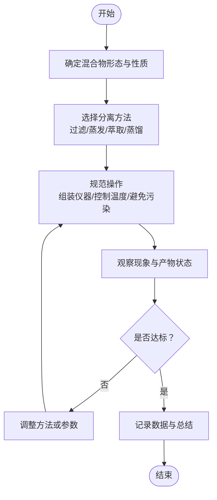
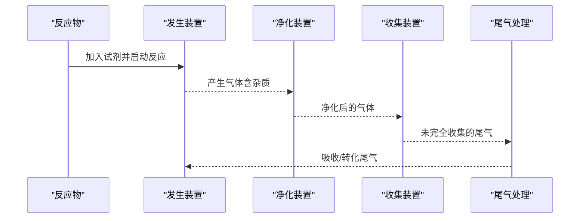
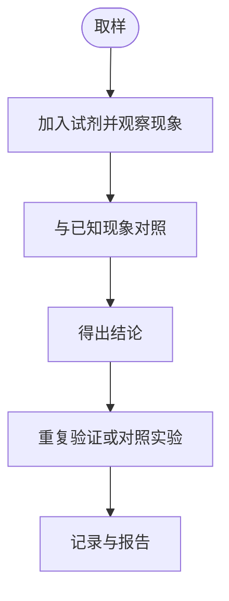
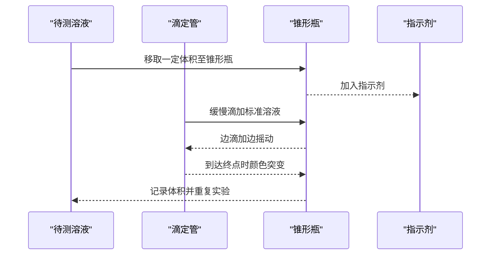
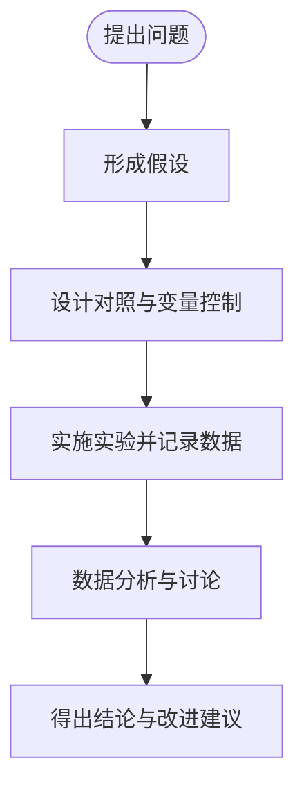
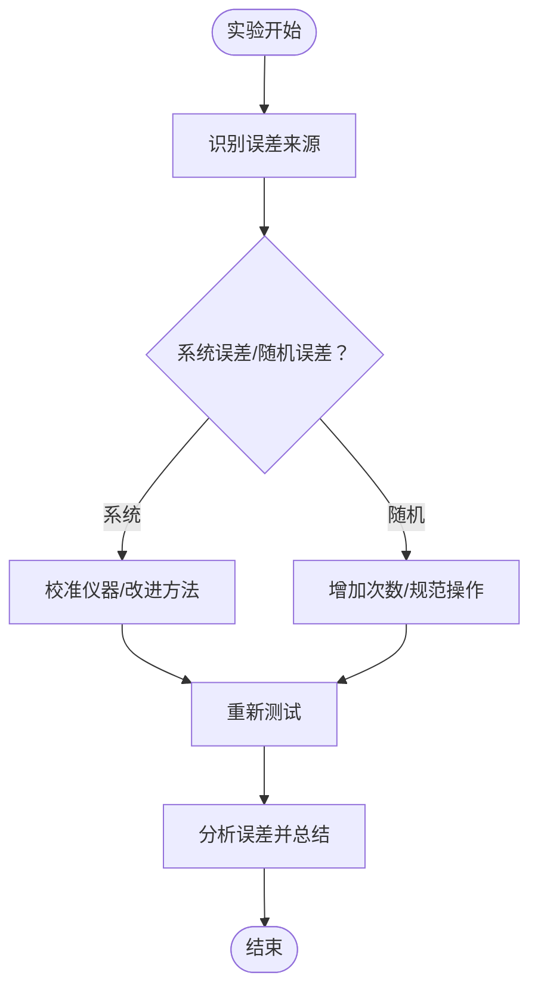
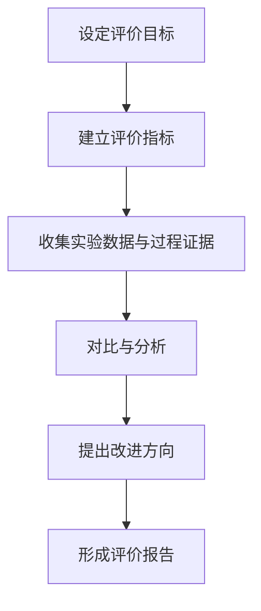
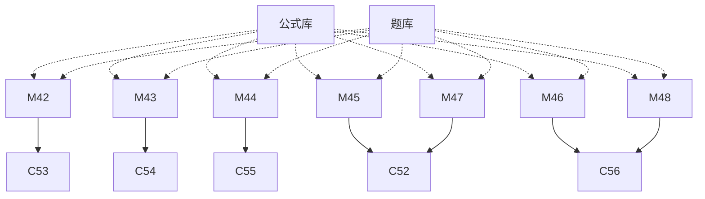

# 实验分析模型

<cite>
**本文引用的文件**
- [M42_分离提纯模型.ts](file://src/data/chemistry/models/M42_分离提纯模型.ts)
- [M43_气体制备流程模型.ts](file://src/data/chemistry/models/M43_气体制备流程模型.ts)
- [M44_检验鉴别模型.ts](file://src/data/chemistry/models/M44_检验鉴别模型.ts)
- [M45_定量滴定实验模型.ts](file://src/data/chemistry/models/M45_定量滴定实验模型.ts)
- [M46_探究实验设计模型.ts](file://src/data/chemistry/models/M46_探究实验设计模型.ts)
- [M47_实验误差分析模型.ts](file://src/data/chemistry/models/M47_实验误差分析模型.ts)
- [M48_综合实验评价模型.ts](file://src/data/chemistry/models/M48_综合实验评价模型.ts)
- [C52_常见化学仪器与基本操作.ts](file://src/data/chemistry/concepts/C52_常见化学仪器与基本操作.ts)
- [C53_物质的分离与提纯.ts](file://src/data/chemistry/concepts/C53_物质的分离与提纯.ts)
- [C54_常见气体的制备与收集.ts](file://src/data/chemistry/concepts/C54_常见气体的制备与收集.ts)
- [C55_物质的检验与鉴别.ts](file://src/data/chemistry/concepts/C55_物质的检验与鉴别.ts)
- [C56_实验方案设计与评价.ts](file://src/data/chemistry/concepts/C56_实验方案设计与评价.ts)
- [index.ts（模型索引）](file://src/data/chemistry/models/index.ts)
- [index.ts（公式库）](file://src/data/chemistry/formulas/index.ts)
- [index.ts（题库）](file://src/data/chemistry/questions/index.ts)
</cite>

## 目录
1. [简介](#简介)
2. [项目结构](#项目结构)
3. [核心组件](#核心组件)
4. [架构总览](#架构总览)
5. [详细组件分析](#详细组件分析)
6. [依赖分析](#依赖分析)
7. [性能考虑](#性能考虑)
8. [故障排查指南](#故障排查指南)
9. [结论](#结论)
10. [附录](#附录)

## 简介
本文件面向星耀平台化学学科的“实验分析模型”，系统梳理并阐述以下七个模型：分离提纯模型、气体制备流程模型、检验鉴别模型、定量滴定实验模型、探究实验设计模型、实验误差分析模型、综合实验评价模型。文档旨在帮助教师与学习者理解各模型的结构化知识、操作流程、判断依据与评价标准，并提供可迁移的思维方法与实践路径。

## 项目结构
化学实验分析模型位于数据层的“模型”与“概念”目录中，采用“模型-概念-公式-题库”的分层组织方式：
- 模型层：以编号命名的模型文件，定义模型元数据、定位、原理、方法论、自测与应用等
- 概念层：支撑模型的底层知识点，如仪器使用、分离提纯、气体制备、检验鉴别、实验设计与评价
- 公式库：通用公式卡片与检索接口
- 题库：按模型组织的题目集合与统计

图表来源
- [M42_分离提纯模型.ts:1-50](file://src/data/chemistry/models/M42_分离提纯模型.ts#L1-L50)
- [M43_气体制备流程模型.ts:1-50](file://src/data/chemistry/models/M43_气体制备流程模型.ts#L1-L50)
- [M44_检验鉴别模型.ts:1-50](file://src/data/chemistry/models/M44_检验鉴别模型.ts#L1-L50)
- [M45_定量滴定实验模型.ts:1-50](file://src/data/chemistry/models/M45_定量滴定实验模型.ts#L1-L50)
- [M46_探究实验设计模型.ts:1-50](file://src/data/chemistry/models/M46_探究实验设计模型.ts#L1-L50)
- [M47_实验误差分析模型.ts:1-50](file://src/data/chemistry/models/M47_实验误差分析模型.ts#L1-L50)
- [M48_综合实验评价模型.ts:1-50](file://src/data/chemistry/models/M48_综合实验评价模型.ts#L1-L50)
- [C52_常见化学仪器与基本操作.ts:1-42](file://src/data/chemistry/concepts/C52_常见化学仪器与基本操作.ts#L1-L42)
- [C53_物质的分离与提纯.ts:1-42](file://src/data/chemistry/concepts/C53_物质的分离与提纯.ts#L1-L42)
- [C54_常见气体的制备与收集.ts:1-42](file://src/data/chemistry/concepts/C54_常见气体的制备与收集.ts#L1-L42)
- [C55_物质的检验与鉴别.ts:1-42](file://src/data/chemistry/concepts/C55_物质的检验与鉴别.ts#L1-L42)
- [C56_实验方案设计与评价.ts:1-42](file://src/data/chemistry/concepts/C56_实验方案设计与评价.ts#L1-L42)

章节来源
- [index.ts（模型索引）:201-208](file://src/data/chemistry/models/index.ts#L201-L208)

## 核心组件
本节聚焦七个实验分析模型的结构化要素：定位（核心/本质/关键洞察）、原理、变式（基础/进阶/挑战）、知识网络、方法论（思路/决策树/要点/常见误区）、自测与应用。

- 分离提纯模型（M42）
  - 定位：围绕混合物分离与目标组分提纯的系统方法
  - 方法论：基于物质性质差异选择合适方法；强调流程设计与产物纯度评估
  - 自测与应用：通过典型题型与应用场景巩固方法迁移能力

- 气体制备流程模型（M43）
  - 定位：从反应原理到装置设计再到收集与尾气处理的完整流程
  - 方法论：发生→净化→收集→尾气处理；关注反应条件、气密性与安全
  - 自测与应用：结合常见气体（如氧气、氢气、二氧化碳）的制备实例

- 检验鉴别模型（M44）
  - 定位：基于特征反应的定性检验与物质鉴别
  - 方法论：先取样、后操作、再观察现象、最后得出结论；避免交叉污染
  - 自测与应用：覆盖常见离子与官能团的检验方法

- 定量滴定实验模型（M45）
  - 定位：以指示剂变色或仪器测量为终点的定量分析
  - 方法论：准确移取、缓慢滴加、摇匀观察、重复校准、数据处理
  - 自测与应用：涵盖酸碱滴定与氧化还原滴定的典型流程

- 探究实验设计模型（M46）
  - 定位：以科学问题为导向的实验设计与变量控制
  - 方法论：明确目的→提出假设→设计对照→控制变量→实施与记录→分析与讨论
  - 自测与应用：提升实验设计的科学性与可重复性

- 实验误差分析模型（M47）
  - 定位：识别与量化误差来源，提出减小误差的方法
  - 方法论：系统误差与随机误差的识别；多次测量取平均；校准仪器
  - 自测与应用：结合具体实验情境进行误差溯源与改进

- 综合实验评价模型（M48）
  - 定位：从目标达成度、方法合理性、结果可靠性与创新性等维度进行综合评价
  - 方法论：建立评价指标体系；对比不同方案；给出改进建议
  - 自测与应用：用于实验报告与展示的评价与反思

章节来源
- [M42_分离提纯模型.ts:1-50](file://src/data/chemistry/models/M42_分离提纯模型.ts#L1-L50)
- [M43_气体制备流程模型.ts:1-50](file://src/data/chemistry/models/M43_气体制备流程模型.ts#L1-L50)
- [M44_检验鉴别模型.ts:1-50](file://src/data/chemistry/models/M44_检验鉴别模型.ts#L1-L50)
- [M45_定量滴定实验模型.ts:1-50](file://src/data/chemistry/models/M45_定量滴定实验模型.ts#L1-L50)
- [M46_探究实验设计模型.ts:1-50](file://src/data/chemistry/models/M46_探究实验设计模型.ts#L1-L50)
- [M47_实验误差分析模型.ts:1-50](file://src/data/chemistry/models/M47_实验误差分析模型.ts#L1-L50)
- [M48_综合实验评价模型.ts:1-50](file://src/data/chemistry/models/M48_综合实验评价模型.ts#L1-L50)

## 架构总览
下图展示七个模型与其支撑概念、公式与题库的关系，体现“模型驱动、概念支撑、公式辅助、题库验证”的知识架构。

图表来源
- [M42_分离提纯模型.ts:1-50](file://src/data/chemistry/models/M42_分离提纯模型.ts#L1-L50)
- [M43_气体制备流程模型.ts:1-50](file://src/data/chemistry/models/M43_气体制备流程模型.ts#L1-L50)
- [M44_检验鉴别模型.ts:1-50](file://src/data/chemistry/models/M44_检验鉴别模型.ts#L1-L50)
- [M45_定量滴定实验模型.ts:1-50](file://src/data/chemistry/models/M45_定量滴定实验模型.ts#L1-L50)
- [M46_探究实验设计模型.ts:1-50](file://src/data/chemistry/models/M46_探究实验设计模型.ts#L1-L50)
- [M47_实验误差分析模型.ts:1-50](file://src/data/chemistry/models/M47_实验误差分析模型.ts#L1-L50)
- [M48_综合实验评价模型.ts:1-50](file://src/data/chemistry/models/M48_综合实验评价模型.ts#L1-L50)
- [C52_常见化学仪器与基本操作.ts:1-42](file://src/data/chemistry/concepts/C52_常见化学仪器与基本操作.ts#L1-L42)
- [C53_物质的分离与提纯.ts:1-42](file://src/data/chemistry/concepts/C53_物质的分离与提纯.ts#L1-L42)
- [C54_常见气体的制备与收集.ts:1-42](file://src/data/chemistry/concepts/C54_常见气体的制备与收集.ts#L1-L42)
- [C55_物质的检验与鉴别.ts:1-42](file://src/data/chemistry/concepts/C55_物质的检验与鉴别.ts#L1-L42)
- [C56_实验方案设计与评价.ts:1-42](file://src/data/chemistry/concepts/C56_实验方案设计与评价.ts#L1-L42)
- [index.ts（公式库）:1-19](file://src/data/chemistry/formulas/index.ts#L1-L19)
- [index.ts（题库）:1-19](file://src/data/chemistry/questions/index.ts#L1-L19)

## 详细组件分析

### 分离提纯模型（M42）
- 操作方法
  - 过滤：适用于固液分离，注意滤纸选择与漏斗组装
  - 蒸发/结晶：适用于溶解度随温度变化的固体溶质
  - 萃取：利用物质在不同溶剂中的溶解度差异
  - 蒸馏：利用沸点差异分离液体混合物
- 适用范围
  - 根据混合物形态与性质选择最合适的分离方法
  - 注意产物纯度与产率的权衡
- 评价标准
  - 现象清晰、操作规范、产物纯度达标、收率合理
- 自测与应用
  - 结合常见混合物（如粗盐提纯、乙醇水分离）进行流程设计与评价

图表来源
- [M42_分离提纯模型.ts:1-50](file://src/data/chemistry/models/M42_分离提纯模型.ts#L1-L50)
- [C53_物质的分离与提纯.ts:1-42](file://src/data/chemistry/concepts/C53_物质的分离与提纯.ts#L1-L42)

章节来源
- [M42_分离提纯模型.ts:1-50](file://src/data/chemistry/models/M42_分离提纯模型.ts#L1-L50)
- [C53_物质的分离与提纯.ts:1-42](file://src/data/chemistry/concepts/C53_物质的分离与提纯.ts#L1-L42)

### 气体制备流程模型（M43）
- 反应原理
  - 依据化学反应方程式选择反应物与条件
  - 控制反应速率与产气量
- 装置设计
  - 发生装置：固液不加热或需加热的反应选择
  - 净化装置：去除杂质气体（水蒸气、酸雾等）
  - 收集装置：排水法或排空气法
  - 尾气处理：吸收或点燃，防止污染
- 评价标准
  - 气密性良好、反应稳定、收集纯净、尾气处理得当

图表来源
- [M43_气体制备流程模型.ts:1-50](file://src/data/chemistry/models/M43_气体制备流程模型.ts#L1-L50)
- [C54_常见气体的制备与收集.ts:1-42](file://src/data/chemistry/concepts/C54_常见气体的制备与收集.ts#L1-L42)

章节来源
- [M43_气体制备流程模型.ts:1-50](file://src/data/chemistry/models/M43_气体制备流程模型.ts#L1-L50)
- [C54_常见气体的制备与收集.ts:1-42](file://src/data/chemistry/concepts/C54_常见气体的制备与收集.ts#L1-L42)

### 检验鉴别模型（M44）
- 现象观察
  - 颜色变化、沉淀生成、气体放出、溶解或分层等
- 判断依据
  - 基于特征反应与对照实验，避免主观臆断
- 操作要点
  - 先取样、后操作、再观察；避免交叉污染
- 评价标准
  - 现象明显、结论可靠、表述规范

图表来源
- [M44_检验鉴别模型.ts:1-50](file://src/data/chemistry/models/M44_检验鉴别模型.ts#L1-L50)
- [C55_物质的检验与鉴别.ts:1-42](file://src/data/chemistry/concepts/C55_物质的检验与鉴别.ts#L1-L42)

章节来源
- [M44_检验鉴别模型.ts:1-50](file://src/data/chemistry/models/M44_检验鉴别模型.ts#L1-L50)
- [C55_物质的检验与鉴别.ts:1-42](file://src/data/chemistry/concepts/C55_物质的检验与鉴别.ts#L1-L42)

### 定量滴定实验模型（M45）
- 原理
  - 利用反应计量关系，通过滴定终点（指示剂或仪器）确定被测物质含量
- 操作技巧
  - 准确移取试样、缓慢滴加、不断摇匀、观察颜色变化、重复实验取平均
- 误差控制
  - 滴定管、移液管校准；避免读数误差；控制滴速与终点判断
- 评价标准
  - 数据重现性好、计算准确、误差在允许范围内

图表来源
- [M45_定量滴定实验模型.ts:1-50](file://src/data/chemistry/models/M45_定量滴定实验模型.ts#L1-L50)
- [C52_常见化学仪器与基本操作.ts:1-42](file://src/data/chemistry/concepts/C52_常见化学仪器与基本操作.ts#L1-L42)

章节来源
- [M45_定量滴定实验模型.ts:1-50](file://src/data/chemistry/models/M45_定量滴定实验模型.ts#L1-L50)
- [C52_常见化学仪器与基本操作.ts:1-42](file://src/data/chemistry/concepts/C52_常见化学仪器与基本操作.ts#L1-L42)

### 探究实验设计模型（M46）
- 设计流程
  - 提出问题→形成假设→设计对照→控制变量→实施与记录→分析与讨论
- 科学性与可行性
  - 变量单一、对照明确、步骤可重复、结果可量化
- 评价标准
  - 目标明确、方法合理、数据充分、结论有据

图表来源
- [M46_探究实验设计模型.ts:1-50](file://src/data/chemistry/models/M46_探究实验设计模型.ts#L1-L50)
- [C56_实验方案设计与评价.ts:1-42](file://src/data/chemistry/concepts/C56_实验方案设计与评价.ts#L1-L42)

章节来源
- [M46_探究实验设计模型.ts:1-50](file://src/data/chemistry/models/M46_探究实验设计模型.ts#L1-L50)
- [C56_实验方案设计与评价.ts:1-42](file://src/data/chemistry/concepts/C56_实验方案设计与评价.ts#L1-L42)

### 实验误差分析模型（M47）
- 误差来源
  - 系统误差（仪器、方法、环境）与随机误差（读数、操作）
- 减小方法
  - 多次测量取平均；校准仪器；规范操作；控制环境因素
- 评价标准
  - 误差在允许范围内；结果具有可重复性与可信度

图表来源
- [M47_实验误差分析模型.ts:1-50](file://src/data/chemistry/models/M47_实验误差分析模型.ts#L1-L50)
- [C52_常见化学仪器与基本操作.ts:1-42](file://src/data/chemistry/concepts/C52_常见化学仪器与基本操作.ts#L1-L42)

章节来源
- [M47_实验误差分析模型.ts:1-50](file://src/data/chemistry/models/M47_实验误差分析模型.ts#L1-L50)
- [C52_常见化学仪器与基本操作.ts:1-42](file://src/data/chemistry/concepts/C52_常见化学仪器与基本操作.ts#L1-L42)

### 综合实验评价模型（M48）
- 综合指标
  - 目标达成度、方法合理性、结果可靠性、创新性与可推广性
- 改进方向
  - 优化流程、降低误差、提升效率与安全性
- 评价流程
  - 明确指标→收集证据→对比分析→形成建议

图表来源
- [M48_综合实验评价模型.ts:1-50](file://src/data/chemistry/models/M48_综合实验评价模型.ts#L1-L50)
- [C56_实验方案设计与评价.ts:1-42](file://src/data/chemistry/concepts/C56_实验方案设计与评价.ts#L1-L42)

章节来源
- [M48_综合实验评价模型.ts:1-50](file://src/data/chemistry/models/M48_综合实验评价模型.ts#L1-L50)
- [C56_实验方案设计与评价.ts:1-42](file://src/data/chemistry/concepts/C56_实验方案设计与评价.ts#L1-L42)

## 依赖分析
- 模型与概念的耦合关系
  - M42 依赖 C53 的分离提纯知识
  - M43 依赖 C54 的气体制备知识
  - M44 依赖 C55 的检验鉴别知识
  - M45 与 M47 依赖 C52 的仪器与基本操作
  - M46 与 M48 依赖 C56 的实验设计与评价
- 支持层的作用
  - 公式库提供通用公式与检索能力
  - 题库提供按模型组织的题目与统计

图表来源
- [index.ts（模型索引）:201-208](file://src/data/chemistry/models/index.ts#L201-L208)
- [index.ts（公式库）:1-19](file://src/data/chemistry/formulas/index.ts#L1-L19)
- [index.ts（题库）:1-19](file://src/data/chemistry/questions/index.ts#L1-L19)

章节来源
- [index.ts（模型索引）:201-208](file://src/data/chemistry/models/index.ts#L201-L208)
- [index.ts（公式库）:1-19](file://src/data/chemistry/formulas/index.ts#L1-L19)
- [index.ts（题库）:1-19](file://src/data/chemistry/questions/index.ts#L1-L19)

## 性能考虑
- 数据访问与检索
  - 公式库与题库提供按关键词检索能力，有助于快速定位相关知识与练习
- 可扩展性
  - 模型与概念均采用统一的数据结构，便于新增模型与更新内容
- 教学效率
  - 通过“模型-概念-公式-题库”的闭环，提高教学与学习的连贯性与效率

## 故障排查指南
- 内容缺失
  - 模型与概念文件当前处于占位状态，需由内容团队完善“定位/原理/方法论/自测/应用”等字段
- 数据一致性
  - 确保模型与概念的关联关系与难度层级一致
- 检索性能
  - 公式与题库的检索接口应保持简洁高效，避免复杂正则导致性能下降

章节来源
- [index.ts（公式库）:10-19](file://src/data/chemistry/formulas/index.ts#L10-L19)
- [index.ts（题库）:10-19](file://src/data/chemistry/questions/index.ts#L10-L19)

## 结论
七个实验分析模型构成了星耀平台化学实验教学的核心知识骨架。通过明确的结构化要素、严谨的流程设计与可迁移的评价体系，能够有效提升学生的实验规范意识与科学思维能力。建议在内容完善后，结合题库与公式库开展教学实践，持续迭代优化。

## 附录
- 相关概念与模型一览
  - 分离提纯：C53 → M42
  - 气体制备：C54 → M43
  - 检验鉴别：C55 → M44
  - 仪器与基本操作：C52 → M45, M47
  - 实验设计与评价：C56 → M46, M48

章节来源
- [index.ts（模型索引）:201-208](file://src/data/chemistry/models/index.ts#L201-L208)
- [C52_常见化学仪器与基本操作.ts:1-42](file://src/data/chemistry/concepts/C52_常见化学仪器与基本操作.ts#L1-L42)
- [C53_物质的分离与提纯.ts:1-42](file://src/data/chemistry/concepts/C53_物质的分离与提纯.ts#L1-L42)
- [C54_常见气体的制备与收集.ts:1-42](file://src/data/chemistry/concepts/C54_常见气体的制备与收集.ts#L1-L42)
- [C55_物质的检验与鉴别.ts:1-42](file://src/data/chemistry/concepts/C55_物质的检验与鉴别.ts#L1-L42)
- [C56_实验方案设计与评价.ts:1-42](file://src/data/chemistry/concepts/C56_实验方案设计与评价.ts#L1-L42)