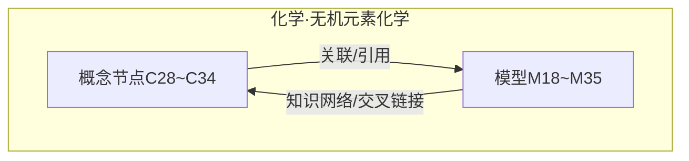
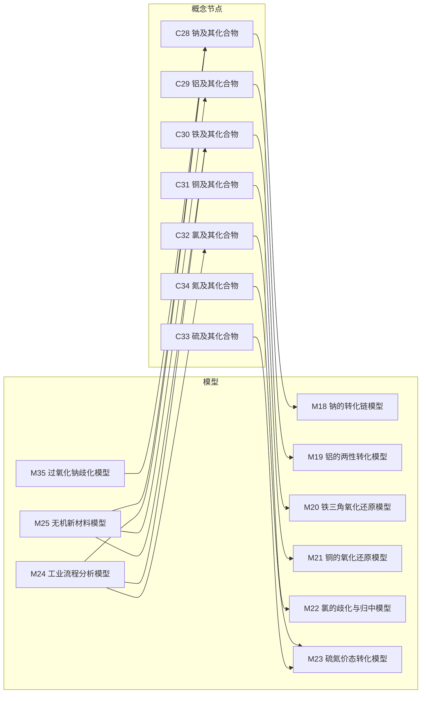
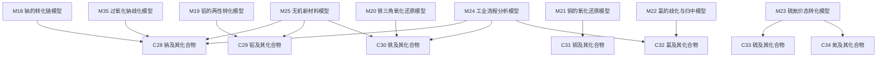

# 无机元素化学模型

<cite>
**本文引用的文件**
- [M18_钠的转化链模型.ts](file://src/data/chemistry/models/M18_钠的转化链模型.ts)
- [M19_铝的两性转化模型.ts](file://src/data/chemistry/models/M19_铝的两性转化模型.ts)
- [M20_铁三角氧化还原模型.ts](file://src/data/chemistry/models/M20_铁三角氧化还原模型.ts)
- [M21_铜的氧化还原模型.ts](file://src/data/chemistry/models/M21_铜的氧化还原模型.ts)
- [M22_氯的歧化与归中模型.ts](file://src/data/chemistry/models/M22_氯的歧化与归中模型.ts)
- [M23_硫氮价态转化模型.ts](file://src/data/chemistry/models/M23_硫氮价态转化模型.ts)
- [M24_工业流程分析模型.ts](file://src/data/chemistry/models/M24_工业流程分析模型.ts)
- [M25_无机新材料模型.ts](file://src/data/chemistry/models/M25_无机新材料模型.ts)
- [M35_过氧化钠歧化模型.ts](file://src/data/chemistry/models/M35_过氧化钠歧化模型.ts)
- [C28_钠及其化合物.ts](file://src/data/chemistry/concepts/C28_钠及其化合物.ts)
- [C29_铝及其化合物.ts](file://src/data/chemistry/concepts/C29_铝及其化合物.ts)
- [C30_铁及其化合物.ts](file://src/data/chemistry/concepts/C30_铁及其化合物.ts)
- [C31_铜及其化合物.ts](file://src/data/chemistry/concepts/C31_铜及其化合物.ts)
- [C32_氯及其化合物.ts](file://src/data/chemistry/concepts/C32_氯及其化合物.ts)
- [C33_硫及其化合物.ts](file://src/data/chemistry/concepts/C33_硫及其化合物.ts)
- [C34_氮及其化合物.ts](file://src/data/chemistry/concepts/C34_氮及其化合物.ts)
</cite>

## 目录
1. [引言](#引言)
2. [项目结构](#项目结构)
3. [核心组件](#核心组件)
4. [架构总览](#架构总览)
5. [详细组件分析](#详细组件分析)
6. [依赖分析](#依赖分析)
7. [性能考虑](#性能考虑)
8. [故障排查指南](#故障排查指南)
9. [结论](#结论)
10. [附录](#附录)

## 引言
本文件面向“星耀平台”化学学科的无机元素化学教学与学习，系统梳理并阐述以下九个关键模型：钠的转化链模型、铝的两性转化模型、铁三角氧化还原模型、铜的氧化还原模型、氯的歧化与归中模型、硫氮价态转化模型、工业流程分析模型、无机新材料模型、过氧化钠歧化模型。通过对各元素及其典型化合物的转化关系、氧化还原反应特点、工业制备流程设计思路、新材料结构与应用前景进行归纳总结，并辅以反应路径示意与实例，帮助学生建立系统化、可迁移的知识网络。

## 项目结构
本项目采用“按学科与主题分层”的数据组织方式，无机元素化学相关的内容分布在“概念节点（concepts）”与“模型（models）”两大类数据文件中。每个模型文件以“Mxx_名称.ts”的形式命名，概念文件以“Cxx_名称.ts”的形式命名，便于检索与扩展。

- 模型文件（models）：定义模型的结构化元数据、难度、定位、原理、变式、方法论、自测题与应用场景等。
- 概念文件（concepts）：定义元素或化合物的知识节点，包含前置检测、叙事结构、公式、变式与关联模型等。

图表来源
- [M18_钠的转化链模型.ts:1-50](file://src/data/chemistry/models/M18_钠的转化链模型.ts#L1-L50)
- [M19_铝的两性转化模型.ts:1-50](file://src/data/chemistry/models/M19_铝的两性转化模型.ts#L1-L50)
- [M20_铁三角氧化还原模型.ts:1-50](file://src/data/chemistry/models/M20_铁三角氧化还原模型.ts#L1-L50)
- [M21_铜的氧化还原模型.ts:1-50](file://src/data/chemistry/models/M21_铜的氧化还原模型.ts#L1-L50)
- [M22_氯的歧化与归中模型.ts:1-50](file://src/data/chemistry/models/M22_氯的歧化与归中模型.ts#L1-L50)
- [M23_硫氮价态转化模型.ts:1-50](file://src/data/chemistry/models/M23_硫氮价态转化模型.ts#L1-L50)
- [M24_工业流程分析模型.ts:1-50](file://src/data/chemistry/models/M24_工业流程分析模型.ts#L1-L50)
- [M25_无机新材料模型.ts:1-50](file://src/data/chemistry/models/M25_无机新材料模型.ts#L1-L50)
- [M35_过氧化钠歧化模型.ts:1-50](file://src/data/chemistry/models/M35_过氧化钠歧化模型.ts#L1-L50)
- [C28_钠及其化合物.ts:1-42](file://src/data/chemistry/concepts/C28_钠及其化合物.ts#L1-L42)
- [C29_铝及其化合物.ts:1-42](file://src/data/chemistry/concepts/C29_铝及其化合物.ts#L1-L42)
- [C30_铁及其化合物.ts:1-42](file://src/data/chemistry/concepts/C30_铁及其化合物.ts#L1-L42)
- [C31_铜及其化合物.ts:1-42](file://src/data/chemistry/concepts/C31_铜及其化合物.ts#L1-L42)
- [C32_氯及其化合物.ts:1-42](file://src/data/chemistry/concepts/C32_氯及其化合物.ts#L1-L42)
- [C33_硫及其化合物.ts:1-42](file://src/data/chemistry/concepts/C33_硫及其化合物.ts#L1-L42)
- [C34_氮及其化合物.ts:1-42](file://src/data/chemistry/concepts/C34_氮及其化合物.ts#L1-L42)

章节来源
- [M18_钠的转化链模型.ts:1-50](file://src/data/chemistry/models/M18_钠的转化链模型.ts#L1-L50)
- [M19_铝的两性转化模型.ts:1-50](file://src/data/chemistry/models/M19_铝的两性转化模型.ts#L1-L50)
- [M20_铁三角氧化还原模型.ts:1-50](file://src/data/chemistry/models/M20_铁三角氧化还原模型.ts#L1-L50)
- [M21_铜的氧化还原模型.ts:1-50](file://src/data/chemistry/models/M21_铜的氧化还原模型.ts#L1-L50)
- [M22_氯的歧化与归中模型.ts:1-50](file://src/data/chemistry/models/M22_氯的歧化与归中模型.ts#L1-L50)
- [M23_硫氮价态转化模型.ts:1-50](file://src/data/chemistry/models/M23_硫氮价态转化模型.ts#L1-L50)
- [M24_工业流程分析模型.ts:1-50](file://src/data/chemistry/models/M24_工业流程分析模型.ts#L1-L50)
- [M25_无机新材料模型.ts:1-50](file://src/data/chemistry/models/M25_无机新材料模型.ts#L1-L50)
- [M35_过氧化钠歧化模型.ts:1-50](file://src/data/chemistry/models/M35_过氧化钠歧化模型.ts#L1-L50)
- [C28_钠及其化合物.ts:1-42](file://src/data/chemistry/concepts/C28_钠及其化合物.ts#L1-L42)
- [C29_铝及其化合物.ts:1-42](file://src/data/chemistry/concepts/C29_铝及其化合物.ts#L1-L42)
- [C30_铁及其化合物.ts:1-42](file://src/data/chemistry/concepts/C30_铁及其化合物.ts#L1-L42)
- [C31_铜及其化合物.ts:1-42](file://src/data/chemistry/concepts/C31_铜及其化合物.ts#L1-L42)
- [C32_氯及其化合物.ts:1-42](file://src/data/chemistry/concepts/C32_氯及其化合物.ts#L1-L42)
- [C33_硫及其化合物.ts:1-42](file://src/data/chemistry/concepts/C33_硫及其化合物.ts#L1-L42)
- [C34_氮及其化合物.ts:1-42](file://src/data/chemistry/concepts/C34_氮及其化合物.ts#L1-L42)

## 核心组件
本节聚焦九个无机元素化学模型的数据结构与内容框架，展示其通用字段与组织方式，便于后续填充具体内容与实现可视化。

- 模型元数据：id、title、module、chapter、difficulty、subtitle、description
- 定位与洞察：positioning.core/essence/keyInsight
- 原理与变式：principle；variations.basic/advanced/challenge
- 知识网络：knowledgeNetwork.parents/children/related/coreFormula
- 方法论：methodology.approach、decisionTree、tips、commonMistakes
- 自测与应用：selfCheck[]、applications[]
- 概念节点：Cxx 文件包含前置检测、叙事、公式、变式与关联模型

章节来源
- [M18_钠的转化链模型.ts:4-49](file://src/data/chemistry/models/M18_钠的转化链模型.ts#L4-L49)
- [M19_铝的两性转化模型.ts:4-49](file://src/data/chemistry/models/M19_铝的两性转化模型.ts#L4-L49)
- [M20_铁三角氧化还原模型.ts:4-49](file://src/data/chemistry/models/M20_铁三角氧化还原模型.ts#L4-L49)
- [M21_铜的氧化还原模型.ts:4-49](file://src/data/chemistry/models/M21_铜的氧化还原模型.ts#L4-L49)
- [M22_氯的歧化与归中模型.ts:4-49](file://src/data/chemistry/models/M22_氯的歧化与归中模型.ts#L4-L49)
- [M23_硫氮价态转化模型.ts:4-49](file://src/data/chemistry/models/M23_硫氮价态转化模型.ts#L4-L49)
- [M24_工业流程分析模型.ts:4-49](file://src/data/chemistry/models/M24_工业流程分析模型.ts#L4-L49)
- [M25_无机新材料模型.ts:4-49](file://src/data/chemistry/models/M25_无机新材料模型.ts#L4-L49)
- [M35_过氧化钠歧化模型.ts:4-49](file://src/data/chemistry/models/M35_过氧化钠歧化模型.ts#L4-L49)
- [C28_钠及其化合物.ts:4-41](file://src/data/chemistry/concepts/C28_钠及其化合物.ts#L4-L41)
- [C29_铝及其化合物.ts:4-41](file://src/data/chemistry/concepts/C29_铝及其化合物.ts#L4-L41)
- [C30_铁及其化合物.ts:4-41](file://src/data/chemistry/concepts/C30_铁及其化合物.ts#L4-L41)
- [C31_铜及其化合物.ts:4-41](file://src/data/chemistry/concepts/C31_铜及其化合物.ts#L4-L41)
- [C32_氯及其化合物.ts:4-41](file://src/data/chemistry/concepts/C32_氯及其化合物.ts#L4-L41)
- [C33_硫及其化合物.ts:4-41](file://src/data/chemistry/concepts/C33_硫及其化合物.ts#L4-L41)
- [C34_氮及其化合物.ts:4-41](file://src/data/chemistry/concepts/C34_氮及其化合物.ts#L4-L41)

## 架构总览
下图展示了“概念节点”与“模型”之间的双向关联关系：概念节点为模型提供背景知识与术语支撑，模型则通过知识网络与方法论反向强化概念节点的理解与迁移。

图表来源
- [C28_钠及其化合物.ts:39-40](file://src/data/chemistry/concepts/C28_钠及其化合物.ts#L39-L40)
- [C29_铝及其化合物.ts:39-40](file://src/data/chemistry/concepts/C29_铝及其化合物.ts#L39-L40)
- [C30_铁及其化合物.ts:39-40](file://src/data/chemistry/concepts/C30_铁及其化合物.ts#L39-L40)
- [C31_铜及其化合物.ts:39-40](file://src/data/chemistry/concepts/C31_铜及其化合物.ts#L39-L40)
- [C32_氯及其化合物.ts:39-40](file://src/data/chemistry/concepts/C32_氯及其化合物.ts#L39-L40)
- [C33_硫及其化合物.ts:39-40](file://src/data/chemistry/concepts/C33_硫及其化合物.ts#L39-L40)
- [C34_氮及其化合物.ts:39-40](file://src/data/chemistry/concepts/C34_氮及其化合物.ts#L39-L40)
- [M18_钠的转化链模型.ts:28-33](file://src/data/chemistry/models/M18_钠的转化链模型.ts#L28-L33)
- [M19_铝的两性转化模型.ts:28-33](file://src/data/chemistry/models/M19_铝的两性转化模型.ts#L28-L33)
- [M20_铁三角氧化还原模型.ts:28-33](file://src/data/chemistry/models/M20_铁三角氧化还原模型.ts#L28-L33)
- [M21_铜的氧化还原模型.ts:28-33](file://src/data/chemistry/models/M21_铜的氧化还原模型.ts#L28-L33)
- [M22_氯的歧化与归中模型.ts:28-33](file://src/data/chemistry/models/M22_氯的歧化与归中模型.ts#L28-L33)
- [M23_硫氮价态转化模型.ts:28-33](file://src/data/chemistry/models/M23_硫氮价态转化模型.ts#L28-L33)
- [M24_工业流程分析模型.ts:28-33](file://src/data/chemistry/models/M24_工业流程分析模型.ts#L28-L33)
- [M25_无机新材料模型.ts:28-33](file://src/data/chemistry/models/M25_无机新材料模型.ts#L28-L33)
- [M35_过氧化钠歧化模型.ts:28-33](file://src/data/chemistry/models/M35_过氧化钠歧化模型.ts#L28-L33)

## 详细组件分析

### 钠的转化链模型（M18）
- 模型定位：以“Na → Na₂O → Na₂O₂ → NaOH/Na₂CO₃/NaHCO₃”为主线，强调价态变化与典型反应。
- 关键转化：单质→碱性氧化物→过氧化物→强碱/碳酸盐/酸式碳酸盐。
- 氧化还原特性：Na→Na⁺（失电子），Na₂O₂中O为-1价，既可被氧化也可被还原，体现歧化/归中倾向。
- 工业应用：电解熔融NaCl制备Na；NaOH用于造纸、纺织；Na₂CO₃用于玻璃、洗涤剂。
- 反应路径示意（概念性）：单质钠在空气中缓慢氧化生成过氧化钠，遇水剧烈水解放出氧气，与CO₂反应生成碳酸钠与氧气。
- 典型实例：工业制备NaOH的“苛化法”流程；Na₂O₂作为供氧剂在潜艇/太空舱中的应用。

章节来源
- [M18_钠的转化链模型.ts:4-49](file://src/data/chemistry/models/M18_钠的转化链模型.ts#L4-L49)
- [C28_钠及其化合物.ts:6-8](file://src/data/chemistry/concepts/C28_钠及其化合物.ts#L6-L8)

### 铝的两性转化模型（M19）
- 模型定位：突出Al、Al₂O₃、Al(OH)₃的两性，强调与强酸/强碱的反应差异。
- 关键转化：Al ⇄ Al(OH)₃ ⇄ AlO₂⁻（在不同pH条件下互变）。
- 氧化还原特性：Al参与置换反应与某些复分解反应，但不涉及典型的元素价态变化。
- 工业应用：电解法制铝；Al(OH)₃作为阻燃剂与净水剂；Al₂O₃作为耐火材料。
- 反应路径示意（概念性）：Al(OH)₃分别与强酸/强碱反应生成偏铝酸盐/铝盐，体现两性。
- 典型实例：明矾净水原理；工业炼铝的电解槽设计要点。

章节来源
- [M19_铝的两性转化模型.ts:4-49](file://src/data/chemistry/models/M19_铝的两性转化模型.ts#L4-L49)
- [C29_铝及其化合物.ts:6-8](file://src/data/chemistry/concepts/C29_铝及其化合物.ts#L6-L8)

### 铁三角氧化还原模型（M20）
- 模型定位：以Fe、Fe²⁺、Fe³⁺为核心，构建氧化还原循环。
- 关键转化：Fe ⇄ Fe²⁺ ⇄ Fe³⁺，在不同介质中可相互转化。
- 氧化还原特性：Fe²⁺既可被氧化为Fe³⁺，也可被还原为Fe；Fe³⁺具有较强氧化性。
- 工业应用：高炉炼铁；FeCl₃蚀刻印刷电路板；铁盐净水。
- 反应路径示意（概念性）：Fe + H⁺→Fe²⁺（还原）；2Fe²⁺ + H₂O₂ + 2H⁺→2Fe³⁺ + 2H₂O（氧化）。
- 典型实例：硫酸亚铁绿矾的保存与变色；铁氰化钾检验Fe²⁺。

章节来源
- [M20_铁三角氧化还原模型.ts:4-49](file://src/data/chemistry/models/M20_铁三角氧化还原模型.ts#L4-L49)
- [C30_铁及其化合物.ts:6-8](file://src/data/chemistry/concepts/C30_铁及其化合物.ts#L6-L8)

### 铜的氧化还原模型（M21）
- 模型定位：以Cu、Cu⁺、Cu²⁺为核心，强调不同价态的氧化还原行为。
- 关键转化：Cu → Cu⁺ → Cu²⁺（失电子趋势）；Cu²⁺ → Cu⁺ → Cu（得电子趋势）。
- 氧化还原特性：Cu₂O中Cu为+1价不稳定，易发生歧化；CuO为高价态，表现氧化性。
- 工业应用：湿法炼铜；电镀；CuSO₄用作杀菌剂与催化剂。
- 反应路径示意（概念性）：CuO + H₂ → Cu + H₂O（还原）；Cu + Cl₂ → CuCl₂（氧化）。
- 典型实例：电解精炼铜的原理与流程；波尔多液的配制。

章节来源
- [M21_铜的氧化还原模型.ts:4-49](file://src/data/chemistry/models/M21_铜的氧化还原模型.ts#L4-L49)
- [C31_铜及其化合物.ts:6-8](file://src/data/chemistry/concepts/C31_铜及其化合物.ts#L6-L8)

### 氯的歧化与归中模型（M22）
- 模型定位：聚焦Cl₂在一定条件下的歧化与归中反应。
- 关键转化：Cl₂ → HClO + HCl（歧化）；HClO → HCl + O₂（归中/分解）。
- 氧化还原特性：Cl₂中Cl为0价，歧化后一部分升价、一部分降价，体现自身氧化还原。
- 工业应用：漂白粉制备；自来水消毒；含氯消毒剂的稳定性与失效机理。
- 反应路径示意（概念性）：Cl₂ + H₂O ⇌ HClO + HCl；光照或加热促进归中。
- 典型实例：漂白粉的有效氯含量计算；次氯酸不稳定导致的失效。

章节来源
- [M22_氯的歧化与归中模型.ts:4-49](file://src/data/chemistry/models/M22_氯的歧化与归中模型.ts#L4-L49)
- [C32_氯及其化合物.ts:6-8](file://src/data/chemistry/concepts/C32_氯及其化合物.ts#L6-L8)

### 硫氮价态转化模型（M23）
- 模型定位：以S、SO₂、H₂SO₄及N₂、NH₃、HNO₃为主线，构建价态转化网络。
- 关键转化：S → SO₂ → SO₃ → H₂SO₄；N₂ → NH₃ → NO → NO₂ → HNO₃。
- 氧化还原特性：S与N在不同价态间可相互转化，体现还原性与氧化性的双重角色。
- 工业应用：接触法制硫酸；哈伯法制氨；硝酸工业的尾气处理。
- 反应路径示意（概念性）：S + O₂ → SO₂；NH₃ + O₂ → NO；NO + O₂ → NO₂。
- 典型实例：硫酸工业的催化氧化；合成氨的平衡与活化能优化。

章节来源
- [M23_硫氮价态转化模型.ts:4-49](file://src/data/chemistry/models/M23_硫氮价态转化模型.ts#L4-L49)
- [C33_硫及其化合物.ts:6-8](file://src/data/chemistry/concepts/C33_硫及其化合物.ts#L6-L8)
- [C34_氮及其化合物.ts:6-8](file://src/data/chemistry/concepts/C34_氮及其化合物.ts#L6-L8)

### 工业流程分析模型（M24）
- 模型定位：以典型工业流程为载体，训练学生对原料、反应、分离、循环利用的系统性思维。
- 关键环节：原料预处理、反应条件优化、产物分离、三废治理、能量回收。
- 氧化还原特性：流程中常伴随氧化还原反应，需控制温度、压强、催化剂与惰性气氛。
- 应用价值：提升流程设计能力、成本控制意识与绿色化学理念。
- 流程示例（概念性）：合成氨：N₂ + 3H₂ ⇌ 2NH₃（高温高压、催化剂）；硫酸：S → SO₂ → SO₃ → H₂SO₄。
- 典型实例：侯氏制碱法的反应序列与副产物利用；电石法聚氯乙烯的工艺链。

章节来源
- [M24_工业流程分析模型.ts:4-49](file://src/data/chemistry/models/M24_工业流程分析模型.ts#L4-L49)
- [C28_钠及其化合物.ts:6-8](file://src/data/chemistry/concepts/C28_钠及其化合物.ts#L6-L8)
- [C30_铁及其化合物.ts:6-8](file://src/data/chemistry/concepts/C30_铁及其化合物.ts#L6-L8)
- [C32_氯及其化合物.ts:6-8](file://src/data/chemistry/concepts/C32_氯及其化合物.ts#L6-L8)

### 无机新材料模型（M25）
- 模型定位：以典型无机材料（如陶瓷、玻璃、复合材料）为例，讲解结构-性能-应用的关系。
- 关键要素：原子排列、化学键、缺陷与界面；宏观性能（强度、导电、热稳定性）。
- 结构特点：离子晶体（NaCl型）、共价晶体（SiO₂）、金属晶体（Al）等。
- 应用前景：储能材料（Li-ion导体）、光催化材料（TiO₂）、生物相容材料（羟基磷灰石）。
- 设计思路：基于元素电负性、原子半径与价态，预测键性与结构稳定性。
- 典型实例：锂辉石（LiAlSi₄O₁₀）的结构与导锂机制；石墨烯的二维结构与电子传输。

章节来源
- [M25_无机新材料模型.ts:4-49](file://src/data/chemistry/models/M25_无机新材料模型.ts#L4-L49)
- [C28_钠及其化合物.ts:6-8](file://src/data/chemistry/concepts/C28_钠及其化合物.ts#L6-L8)
- [C29_铝及其化合物.ts:6-8](file://src/data/chemistry/concepts/C29_铝及其化合物.ts#L6-L8)
- [C30_铁及其化合物.ts:6-8](file://src/data/chemistry/concepts/C30_铁及其化合物.ts#L6-L8)

### 过氧化钠歧化模型（M35）
- 模型定位：聚焦Na₂O₂的歧化反应，理解超氧化物的不稳定性与应用。
- 关键转化：2Na₂O₂ → 2Na₂O + O₂↑（歧化）；Na₂O₂ + CO₂ → Na₂CO₃ + ½O₂。
- 氧化还原特性：O₂²⁻中O为-1价，歧化为O₂（0价）与O²⁻（-2价）。
- 工业应用：作为供氧剂（潜艇/航天）、脱氟剂、漂白剂。
- 反应路径示意（概念性）：Na₂O₂与H₂O放热反应产生O₂；与CO₂反应再生Na₂CO₃。
- 典型实例：潜水艇中的氧气再生系统；过氧化钠与水的快速放热反应。

章节来源
- [M35_过氧化钠歧化模型.ts:4-49](file://src/data/chemistry/models/M35_过氧化钠歧化模型.ts#L4-L49)
- [C28_钠及其化合物.ts:6-8](file://src/data/chemistry/concepts/C28_钠及其化合物.ts#L6-L8)

## 依赖分析
- 内部耦合：模型文件通过knowledgeNetwork与concept文件形成知识耦合；部分模型（如M24、M25）与多个概念节点交叉引用。
- 外部依赖：本仓库未发现直接的外部依赖文件；模型与概念的耦合通过字段（如related、parents、children、coreFormula）体现。
- 潜在风险：若未来扩展至多版本/多语言，需在模型元数据中增加版本号与本地化字段。

图表来源
- [M18_钠的转化链模型.ts:28-33](file://src/data/chemistry/models/M18_钠的转化链模型.ts#L28-L33)
- [M19_铝的两性转化模型.ts:28-33](file://src/data/chemistry/models/M19_铝的两性转化模型.ts#L28-L33)
- [M20_铁三角氧化还原模型.ts:28-33](file://src/data/chemistry/models/M20_铁三角氧化还原模型.ts#L28-L33)
- [M21_铜的氧化还原模型.ts:28-33](file://src/data/chemistry/models/M21_铜的氧化还原模型.ts#L28-L33)
- [M22_氯的歧化与归中模型.ts:28-33](file://src/data/chemistry/models/M22_氯的歧化与归中模型.ts#L28-L33)
- [M23_硫氮价态转化模型.ts:28-33](file://src/data/chemistry/models/M23_硫氮价态转化模型.ts#L28-L33)
- [M24_工业流程分析模型.ts:28-33](file://src/data/chemistry/models/M24_工业流程分析模型.ts#L28-L33)
- [M25_无机新材料模型.ts:28-33](file://src/data/chemistry/models/M25_无机新材料模型.ts#L28-L33)
- [M35_过氧化钠歧化模型.ts:28-33](file://src/data/chemistry/models/M35_过氧化钠歧化模型.ts#L28-L33)
- [C28_钠及其化合物.ts:39-40](file://src/data/chemistry/concepts/C28_钠及其化合物.ts#L39-L40)
- [C29_铝及其化合物.ts:39-40](file://src/data/chemistry/concepts/C29_铝及其化合物.ts#L39-L40)
- [C30_铁及其化合物.ts:39-40](file://src/data/chemistry/concepts/C30_铁及其化合物.ts#L39-L40)
- [C31_铜及其化合物.ts:39-40](file://src/data/chemistry/concepts/C31_铜及其化合物.ts#L39-L40)
- [C32_氯及其化合物.ts:39-40](file://src/data/chemistry/concepts/C32_氯及其化合物.ts#L39-L40)
- [C33_硫及其化合物.ts:39-40](file://src/data/chemistry/concepts/C33_硫及其化合物.ts#L39-L40)
- [C34_氮及其化合物.ts:39-40](file://src/data/chemistry/concepts/C34_氮及其化合物.ts#L39-L40)

## 性能考虑
- 数据规模：当前模型与概念文件均为占位模板，建议在填充完成后统一进行字段校验与一致性检查。
- 查询效率：若未来引入前端搜索/过滤，可在模型元数据中增加索引字段（如关键词、难度标签、所属模块）。
- 扩展性：建议在模型元数据中增加“版本号”“更新时间”“作者”等字段，便于追踪与审计。

## 故障排查指南
- 字段缺失：若出现“内容整理中...”提示，请检查模型文件与概念文件的对应字段是否已填充。
- 关联错误：若模型无法正确关联到概念节点，请核对related/parents/children/coreFormula字段的ID是否一致。
- 方法论偏差：若方法论与实际反应不符，请对照具体反应机理调整principle与variations。
- 自测题无效：若自测题无法评分，请检查selfCheck中的answer与选项是否匹配。

章节来源
- [M18_钠的转化链模型.ts:14-18](file://src/data/chemistry/models/M18_钠的转化链模型.ts#L14-L18)
- [M19_铝的两性转化模型.ts:14-18](file://src/data/chemistry/models/M19_铝的两性转化模型.ts#L14-L18)
- [M20_铁三角氧化还原模型.ts:14-18](file://src/data/chemistry/models/M20_铁三角氧化还原模型.ts#L14-L18)
- [M21_铜的氧化还原模型.ts:14-18](file://src/data/chemistry/models/M21_铜的氧化还原模型.ts#L14-L18)
- [M22_氯的歧化与归中模型.ts:14-18](file://src/data/chemistry/models/M22_氯的歧化与归中模型.ts#L14-L18)
- [M23_硫氮价态转化模型.ts:14-18](file://src/data/chemistry/models/M23_硫氮价态转化模型.ts#L14-L18)
- [M24_工业流程分析模型.ts:14-18](file://src/data/chemistry/models/M24_工业流程分析模型.ts#L14-L18)
- [M25_无机新材料模型.ts:14-18](file://src/data/chemistry/models/M25_无机新材料模型.ts#L14-L18)
- [M35_过氧化钠歧化模型.ts:14-18](file://src/data/chemistry/models/M35_过氧化钠歧化模型.ts#L14-L18)

## 结论
本文件系统梳理了九个无机元素化学模型的结构与定位，明确了各元素及其典型化合物的转化关系、氧化还原反应特点、工业流程设计思路与新材料结构应用。建议在后续工作中逐步完善各模型的“七模块内容”（定位、本质、关键洞察、原理、变式、方法论、自测与应用），并结合真实工业实例与反应路径图，帮助学生建立从微观到宏观、从理论到实践的完整认知闭环。

## 附录
- 反应路径图示例（概念性，示意用途）
  - 钠转化链：Na → Na₂O → Na₂O₂ → NaOH/Na₂CO₃/NaHCO₃
  - 铁三角：Fe → Fe²⁺ → Fe³⁺
  - 氯歧化/归中：Cl₂ → HClO + HCl → HCl + O₂
  - 硫氮价态：S → SO₂ → SO₃ → H₂SO₄；N₂ → NH₃ → NO → NO₂ → HNO₃
  - 工业流程：原料→反应→分离→循环→产品
  - 新材料：结构→性能→应用
  - 过氧化钠歧化：Na₂O₂ → Na₂O + O₂