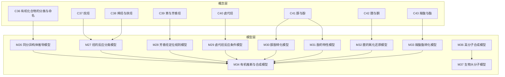
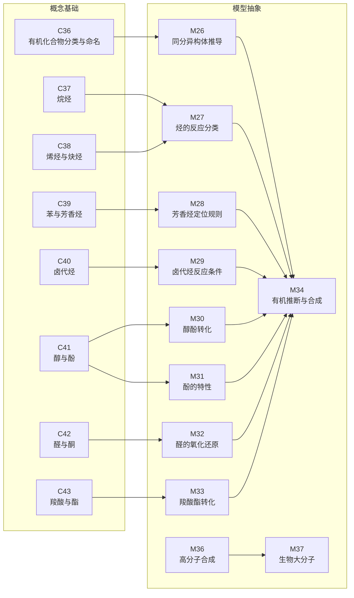
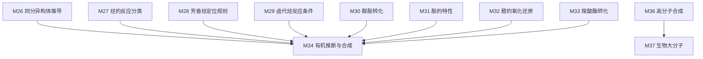
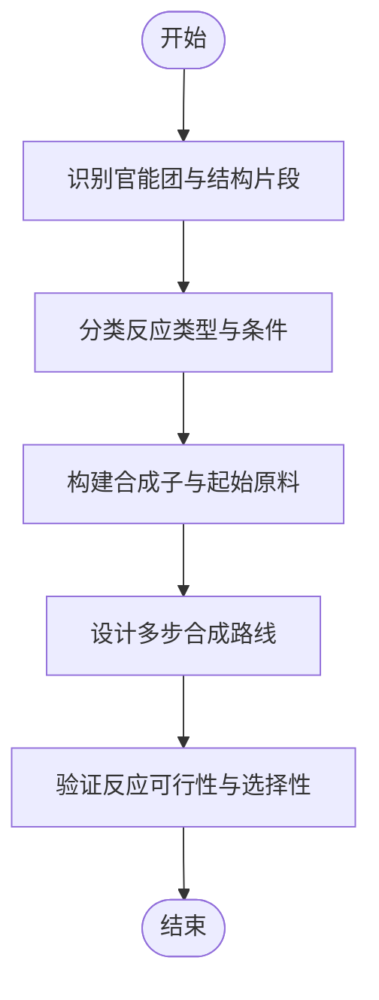

# 有机化学模型

<cite>
**本文引用的文件**
- [M26_同分异构体推导模型.ts](file://src/data/chemistry/models/M26_同分异构体推导模型.ts)
- [M27_烃的反应分类模型.ts](file://src/data/chemistry/models/M27_烃的反应分类模型.ts)
- [M28_芳香烃定位规则模型.ts](file://src/data/chemistry/models/M28_芳香烃定位规则模型.ts)
- [M29_卤代烃反应条件模型.ts](file://src/data/chemistry/models/M29_卤代烃反应条件模型.ts)
- [M30_醇酚转化模型.ts](file://src/data/chemistry/models/M30_醇酚转化模型.ts)
- [M31_酚的特性模型.ts](file://src/data/chemistry/models/M31_酚的特性模型.ts)
- [M32_醛的氧化还原模型.ts](file://src/data/chemistry/models/M32_醛的氧化还原模型.ts)
- [M33_羧酸酯转化模型.ts](file://src/data/chemistry/models/M33_羧酸酯转化模型.ts)
- [M34_有机推断与合成模型.ts](file://src/data/chemistry/models/M34_有机推断与合成模型.ts)
- [M36_高分子合成模型.ts](file://src/data/chemistry/models/M36_高分子合成模型.ts)
- [M37_生物大分子模型.ts](file://src/data/chemistry/models/M37_生物大分子模型.ts)
- [C36_有机化合物的分类与命名.ts](file://src/data/chemistry/concepts/C36_有机化合物的分类与命名.ts)
- [C37_烷烃.ts](file://src/data/chemistry/concepts/C37_烷烃.ts)
- [C38_烯烃与炔烃.ts](file://src/data/chemistry/concepts/C38_烯烃与炔烃.ts)
- [C39_苯与芳香烃.ts](file://src/data/chemistry/concepts/C39_苯与芳香烃.ts)
- [C40_卤代烃.ts](file://src/data/chemistry/concepts/C40_卤代烃.ts)
- [C41_醇与酚.ts](file://src/data/chemistry/concepts/C41_醇与酚.ts)
- [C42_醛与酮.ts](file://src/data/chemistry/concepts/C42_醛与酮.ts)
- [C43_羧酸与酯.ts](file://src/data/chemistry/concepts/C43_羧酸与酯.ts)
</cite>

## 目录
1. [引言](#引言)
2. [项目结构](#项目结构)
3. [核心组件](#核心组件)
4. [架构总览](#架构总览)
5. [详细组件分析](#详细组件分析)
6. [依赖分析](#依赖分析)
7. [性能考虑](#性能考虑)
8. [故障排查指南](#故障排查指南)
9. [结论](#结论)
10. [附录](#附录)

## 引言
本文件面向星耀平台化学学科“有机化学”板块，围绕11个核心模型（同分异构体推导、烃的反应分类、芳香烃定位规则、卤代烃反应条件、醇酚转化、酚的特性、醛的氧化还原、羧酸酯转化、有机推断与合成、高分子合成、生物大分子）进行系统化知识梳理与应用指导。文档旨在帮助学习者建立“反应类型—官能团性质—推断方法—合成路径—高分子机理”的完整认知框架，并通过可视化图示呈现关键反应机理与推断流程。

## 项目结构
有机化学模型与概念节点采用“按主题分层”的组织方式：
- 概念层：C36~C43覆盖官能团与命名、烷烃、烯炔、芳香烃、卤代烃、醇酚、醛酮、羧酸酯等基础知识点。
- 模型层：M26~M37将概念抽象为可迁移的“模型”，包含定位（核心/本质/关键洞察）、原理、变式、知识网络、方法论、自测、应用等模块。

图表来源
- [C36_有机化合物的分类与命名.ts:1-42](file://src/data/chemistry/concepts/C36_有机化合物的分类与命名.ts#L1-L42)
- [C37_烷烃.ts:1-42](file://src/data/chemistry/concepts/C37_烷烃.ts#L1-L42)
- [C38_烯烃与炔烃.ts:1-42](file://src/data/chemistry/concepts/C38_烯烃与炔烃.ts#L1-L42)
- [C39_苯与芳香烃.ts:1-42](file://src/data/chemistry/concepts/C39_苯与芳香烃.ts#L1-L42)
- [C40_卤代烃.ts:1-42](file://src/data/chemistry/concepts/C40_卤代烃.ts#L1-L42)
- [C41_醇与酚.ts:1-42](file://src/data/chemistry/concepts/C41_醇与酚.ts#L1-L42)
- [C42_醛与酮.ts:1-42](file://src/data/chemistry/concepts/C42_醛与酮.ts#L1-L42)
- [C43_羧酸与酯.ts:1-42](file://src/data/chemistry/concepts/C43_羧酸与酯.ts#L1-L42)
- [M26_同分异构体推导模型.ts:1-50](file://src/data/chemistry/models/M26_同分异构体推导模型.ts#L1-L50)
- [M27_烃的反应分类模型.ts:1-50](file://src/data/chemistry/models/M27_烃的反应分类模型.ts#L1-L50)
- [M28_芳香烃定位规则模型.ts:1-50](file://src/data/chemistry/models/M28_芳香烃定位规则模型.ts#L1-L50)
- [M29_卤代烃反应条件模型.ts:1-50](file://src/data/chemistry/models/M29_卤代烃反应条件模型.ts#L1-L50)
- [M30_醇酚转化模型.ts:1-50](file://src/data/chemistry/models/M30_醇酚转化模型.ts#L1-L50)
- [M31_酚的特性模型.ts:1-50](file://src/data/chemistry/models/M31_酚的特性模型.ts#L1-L50)
- [M32_醛的氧化还原模型.ts:1-50](file://src/data/chemistry/models/M32_醛的氧化还原模型.ts#L1-L50)
- [M33_羧酸酯转化模型.ts:1-50](file://src/data/chemistry/models/M33_羧酸酯转化模型.ts#L1-L50)
- [M34_有机推断与合成模型.ts:1-50](file://src/data/chemistry/models/M34_有机推断与合成模型.ts#L1-L50)
- [M36_高分子合成模型.ts:1-50](file://src/data/chemistry/models/M36_高分子合成模型.ts#L1-L50)
- [M37_生物大分子模型.ts:1-50](file://src/data/chemistry/models/M37_生物大分子模型.ts#L1-L50)

章节来源
- [C36_有机化合物的分类与命名.ts:1-42](file://src/data/chemistry/concepts/C36_有机化合物的分类与命名.ts#L1-L42)
- [C37_烷烃.ts:1-42](file://src/data/chemistry/concepts/C37_烷烃.ts#L1-L42)
- [C38_烯烃与炔烃.ts:1-42](file://src/data/chemistry/concepts/C38_烯烃与炔烃.ts#L1-L42)
- [C39_苯与芳香烃.ts:1-42](file://src/data/chemistry/concepts/C39_苯与芳香烃.ts#L1-L42)
- [C40_卤代烃.ts:1-42](file://src/data/chemistry/concepts/C40_卤代烃.ts#L1-L42)
- [C41_醇与酚.ts:1-42](file://src/data/chemistry/concepts/C41_醇与酚.ts#L1-L42)
- [C42_醛与酮.ts:1-42](file://src/data/chemistry/concepts/C42_醛与酮.ts#L1-L42)
- [C43_羧酸与酯.ts:1-42](file://src/data/chemistry/concepts/C43_羧酸与酯.ts#L1-L42)
- [M26_同分异构体推导模型.ts:1-50](file://src/data/chemistry/models/M26_同分异构体推导模型.ts#L1-L50)
- [M27_烃的反应分类模型.ts:1-50](file://src/data/chemistry/models/M27_烃的反应分类模型.ts#L1-L50)
- [M28_芳香烃定位规则模型.ts:1-50](file://src/data/chemistry/models/M28_芳香烃定位规则模型.ts#L1-L50)
- [M29_卤代烃反应条件模型.ts:1-50](file://src/data/chemistry/models/M29_卤代烃反应条件模型.ts#L1-L50)
- [M30_醇酚转化模型.ts:1-50](file://src/data/chemistry/models/M30_醇酚转化模型.ts#L1-L50)
- [M31_酚的特性模型.ts:1-50](file://src/data/chemistry/models/M31_酚的特性模型.ts#L1-L50)
- [M32_醛的氧化还原模型.ts:1-50](file://src/data/chemistry/models/M32_醛的氧化还原模型.ts#L1-L50)
- [M33_羧酸酯转化模型.ts:1-50](file://src/data/chemistry/models/M33_羧酸酯转化模型.ts#L1-L50)
- [M34_有机推断与合成模型.ts:1-50](file://src/data/chemistry/models/M34_有机推断与合成模型.ts#L1-L50)
- [M36_高分子合成模型.ts:1-50](file://src/data/chemistry/models/M36_高分子合成模型.ts#L1-L50)
- [M37_生物大分子模型.ts:1-50](file://src/data/chemistry/models/M37_生物大分子模型.ts#L1-L50)

## 核心组件
本节聚焦11个有机化学模型的“七模块”结构与知识网络，帮助读者快速把握每个模型的定位、原理、方法论与应用。

- 定位（核心/本质/关键洞察）：明确模型在有机化学中的核心地位与关键洞察点。
- 原理：模型所依据的化学原理或规律。
- 变式：基础、进阶、挑战三个层级的典型问题与要点。
- 知识网络：父节点、子节点、相关节点与核心公式的关系。
- 方法论：解题思路、决策树、技巧与常见误区。
- 自测：用于诊断理解程度的题目与解析。
- 应用：模型在实际问题中的应用场景。

章节来源
- [M26_同分异构体推导模型.ts:1-50](file://src/data/chemistry/models/M26_同分异构体推导模型.ts#L1-L50)
- [M27_烃的反应分类模型.ts:1-50](file://src/data/chemistry/models/M27_烃的反应分类模型.ts#L1-L50)
- [M28_芳香烃定位规则模型.ts:1-50](file://src/data/chemistry/models/M28_芳香烃定位规则模型.ts#L1-L50)
- [M29_卤代烃反应条件模型.ts:1-50](file://src/data/chemistry/models/M29_卤代烃反应条件模型.ts#L1-L50)
- [M30_醇酚转化模型.ts:1-50](file://src/data/chemistry/models/M30_醇酚转化模型.ts#L1-L50)
- [M31_酚的特性模型.ts:1-50](file://src/data/chemistry/models/M31_酚的特性模型.ts#L1-L50)
- [M32_醛的氧化还原模型.ts:1-50](file://src/data/chemistry/models/M32_醛的氧化还原模型.ts#L1-L50)
- [M33_羧酸酯转化模型.ts:1-50](file://src/data/chemistry/models/M33_羧酸酯转化模型.ts#L1-L50)
- [M34_有机推断与合成模型.ts:1-50](file://src/data/chemistry/models/M34_有机推断与合成模型.ts#L1-L50)
- [M36_高分子合成模型.ts:1-50](file://src/data/chemistry/models/M36_高分子合成模型.ts#L1-L50)
- [M37_生物大分子模型.ts:1-50](file://src/data/chemistry/models/M37_生物大分子模型.ts#L1-L50)

## 架构总览
下图展示“概念—模型—应用”的知识架构映射，体现各模型如何由具体概念抽象而来，并服务于推断与合成实践。

图表来源
- [C36_有机化合物的分类与命名.ts:1-42](file://src/data/chemistry/concepts/C36_有机化合物的分类与命名.ts#L1-L42)
- [C37_烷烃.ts:1-42](file://src/data/chemistry/concepts/C37_烷烃.ts#L1-L42)
- [C38_烯烃与炔烃.ts:1-42](file://src/data/chemistry/concepts/C38_烯烃与炔烃.ts#L1-L42)
- [C39_苯与芳香烃.ts:1-42](file://src/data/chemistry/concepts/C39_苯与芳香烃.ts#L1-L42)
- [C40_卤代烃.ts:1-42](file://src/data/chemistry/concepts/C40_卤代烃.ts#L1-L42)
- [C41_醇与酚.ts:1-42](file://src/data/chemistry/concepts/C41_醇与酚.ts#L1-L42)
- [C42_醛与酮.ts:1-42](file://src/data/chemistry/concepts/C42_醛与酮.ts#L1-L42)
- [C43_羧酸与酯.ts:1-42](file://src/data/chemistry/concepts/C43_羧酸与酯.ts#L1-L42)
- [M26_同分异构体推导模型.ts:1-50](file://src/data/chemistry/models/M26_同分异构体推导模型.ts#L1-L50)
- [M27_烃的反应分类模型.ts:1-50](file://src/data/chemistry/models/M27_烃的反应分类模型.ts#L1-L50)
- [M28_芳香烃定位规则模型.ts:1-50](file://src/data/chemistry/models/M28_芳香烃定位规则模型.ts#L1-L50)
- [M29_卤代烃反应条件模型.ts:1-50](file://src/data/chemistry/models/M29_卤代烃反应条件模型.ts#L1-L50)
- [M30_醇酚转化模型.ts:1-50](file://src/data/chemistry/models/M30_醇酚转化模型.ts#L1-L50)
- [M31_酚的特性模型.ts:1-50](file://src/data/chemistry/models/M31_酚的特性模型.ts#L1-L50)
- [M32_醛的氧化还原模型.ts:1-50](file://src/data/chemistry/models/M32_醛的氧化还原模型.ts#L1-L50)
- [M33_羧酸酯转化模型.ts:1-50](file://src/data/chemistry/models/M33_羧酸酯转化模型.ts#L1-L50)
- [M34_有机推断与合成模型.ts:1-50](file://src/data/chemistry/models/M34_有机推断与合成模型.ts#L1-L50)
- [M36_高分子合成模型.ts:1-50](file://src/data/chemistry/models/M36_高分子合成模型.ts#L1-L50)
- [M37_生物大分子模型.ts:1-50](file://src/data/chemistry/models/M37_生物大分子模型.ts#L1-L50)

## 详细组件分析

### 同分异构体推导模型（M26）
- 定位：在有机合成与推断中，同分异构体的系统性列举是确定结构的关键第一步。
- 原理：基于碳骨架异构、官能团位置异构、顺反异构等维度的系统枚举。
- 方法论：骨架构建→官能团定位→立体异构标注→排除重复与不合理结构。
- 典型应用：推断未知物结构、设计合成路线、避免遗漏可能产物。

章节来源
- [M26_同分异构体推导模型.ts:1-50](file://src/data/chemistry/models/M26_同分异构体推导模型.ts#L1-L50)

### 烃的反应分类模型（M27）
- 定位：将烷烃、烯烃、炔烃的典型反应统一分类，便于识别反应类型与条件。
- 原理：根据键的饱和度与电子分布，区分加成、取代、消除等反应类型。
- 方法论：先判断烃类类别→再匹配典型反应→最后确定反应条件与产物。
- 典型应用：推断反应产物、设计多步合成、选择性控制。

章节来源
- [M27_烃的反应分类模型.ts:1-50](file://src/data/chemistry/models/M27_烃的反应分类模型.ts#L1-L50)

### 芳香烃定位规则模型（M28）
- 定位：在苯环上发生亲电取代时，定位基决定新取代基进入位置。
- 原理：邻/对位与间位定位基的电子效应差异决定反应区域选择性。
- 方法论：识别定位基→判断活化/钝化→预测主要产物→验证动力学/热力学控制。
- 典型应用：多步芳香取代合成、逆合成分析。

章节来源
- [M28_芳香烃定位规则模型.ts:1-50](file://src/data/chemistry/models/M28_芳香烃定位规则模型.ts#L1-L50)

### 卤代烃反应条件模型（M29）
- 定位：卤代烃在不同条件下发生取代或消去，产物取决于反应条件与底物结构。
- 原理：亲核取代（SN1/SN2）与消除（E1/E2）的竞争关系。
- 方法论：判断卤代烃级别→确定亲核试剂强度→选择溶剂与温度→预测产物比例。
- 典型应用：官能团互变、合成中间体制备。

章节来源
- [M29_卤代烃反应条件模型.ts:1-50](file://src/data/chemistry/models/M29_卤代烃反应条件模型.ts#L1-L50)

### 醇酚转化模型（M30）
- 定位：醇与酚在特定条件下可相互转化，涉及氧化、脱水、置换等过程。
- 原理：羟基的活性差异与电子环境对反应取向的影响。
- 方法论：识别底物类型→选择合适试剂与条件→控制选择性→避免副反应。
- 典型应用：官能团转换、复杂分子修饰。

章节来源
- [M30_醇酚转化模型.ts:1-50](file://src/data/chemistry/models/M30_醇酚转化模型.ts#L1-L50)

### 酚的特性模型（M31）
- 定位：酚具有特殊的酸性与显色反应，是重要的官能团识别标志。
- 原理：酚羟基的酸性源于共振稳定化的邻/对位负电荷。
- 方法论：利用显色反应与酸性强弱进行定性与定量分析。
- 典型应用：定性鉴别、含量测定、结构确认。

章节来源
- [M31_酚的特性模型.ts:1-50](file://src/data/chemistry/models/M31_酚的特性模型.ts#L1-L50)

### 醛的氧化还原模型（M32）
- 定位：醛易被氧化为羧酸，也易被还原为伯醇；是推断与合成的关键节点。
- 原理：羰基的还原/氧化反应机理与选择性试剂的应用。
- 方法论：根据目标产物选择氧化或还原→选用温和或剧烈条件→避免过度反应。
- 典型应用：官能团互变、天然产物合成。

章节来源
- [M32_醛的氧化还原模型.ts:1-50](file://src/data/chemistry/models/M32_醛的氧化还原模型.ts#L1-L50)

### 羧酸酯转化模型（M33）
- 定位：羧酸与酯之间可互相转化，是合成中重要的官能团转换工具。
- 原理：酸催化下的酯交换、碱催化的水解与皂化反应。
- 方法论：根据反应条件选择可逆/不可逆路径→控制pH与温度→提高转化率。
- 典型应用：药物与天然产物的侧链修饰、高分子单体制备。

章节来源
- [M33_羧酸酯转化模型.ts:1-50](file://src/data/chemistry/models/M33_羧酸酯转化模型.ts#L1-L50)

### 有机推断与合成模型（M34）
- 定位：整合上述模型，形成从结构推断到合成设计的闭环。
- 原理：官能团识别→反应类型判定→逆合成分析→路线设计与验证。
- 方法论：多步合成的“目标分子→合成子→起始原料”回溯法。
- 典型应用：复杂天然产物与药物分子的合成路径设计。

章节来源
- [M34_有机推断与合成模型.ts:1-50](file://src/data/chemistry/models/M34_有机推断与合成模型.ts#L1-L50)

### 高分子合成模型（M36）
- 定位：高分子材料的合成机理与聚合方式决定其结构与性能。
- 原理：加聚与缩聚两类机理及引发体系的选择。
- 方法论：根据目标高分子选择聚合机理→控制聚合度与分子量分布→优化加工性能。
- 典型应用：塑料、橡胶、纤维的工业合成。

章节来源
- [M36_高分子合成模型.ts:1-50](file://src/data/chemistry/models/M36_高分子合成模型.ts#L1-L50)

### 生物大分子模型（M37）
- 定位：蛋白质、核酸、多糖等生物大分子的结构与功能密切相关。
- 原理：一级至四级结构的层次性与相互作用力。
- 方法论：序列→折叠→活性位点→功能表现的系统分析。
- 典型应用：生物催化、药物设计、基因工程。

章节来源
- [M37_生物大分子模型.ts:1-50](file://src/data/chemistry/models/M37_生物大分子模型.ts#L1-L50)

## 依赖分析
- 概念到模型：各概念节点为相应模型提供事实基础与术语支撑。
- 模型到模型：M34作为中枢模型整合M26~M33；M36与M37分别拓展至高分子与生物领域。
- 知识网络：模型内部的父子/相关关系有助于构建知识图谱与导航。

图表来源
- [M26_同分异构体推导模型.ts:1-50](file://src/data/chemistry/models/M26_同分异构体推导模型.ts#L1-L50)
- [M27_烃的反应分类模型.ts:1-50](file://src/data/chemistry/models/M27_烃的反应分类模型.ts#L1-L50)
- [M28_芳香烃定位规则模型.ts:1-50](file://src/data/chemistry/models/M28_芳香烃定位规则模型.ts#L1-L50)
- [M29_卤代烃反应条件模型.ts:1-50](file://src/data/chemistry/models/M29_卤代烃反应条件模型.ts#L1-L50)
- [M30_醇酚转化模型.ts:1-50](file://src/data/chemistry/models/M30_醇酚转化模型.ts#L1-L50)
- [M31_酚的特性模型.ts:1-50](file://src/data/chemistry/models/M31_酚的特性模型.ts#L1-L50)
- [M32_醛的氧化还原模型.ts:1-50](file://src/data/chemistry/models/M32_醛的氧化还原模型.ts#L1-L50)
- [M33_羧酸酯转化模型.ts:1-50](file://src/data/chemistry/models/M33_羧酸酯转化模型.ts#L1-L50)
- [M34_有机推断与合成模型.ts:1-50](file://src/data/chemistry/models/M34_有机推断与合成模型.ts#L1-L50)
- [M36_高分子合成模型.ts:1-50](file://src/data/chemistry/models/M36_高分子合成模型.ts#L1-L50)
- [M37_生物大分子模型.ts:1-50](file://src/data/chemistry/models/M37_生物大分子模型.ts#L1-L50)

## 性能考虑
- 数据结构复用：模型对象采用统一的“七模块”字段，便于前端渲染与检索。
- 知识网络：parents/children/related字段支持构建知识图谱，提升导航效率。
- 变式分层：basic/advanced/challenge三级结构适配不同学习阶段，降低认知负荷。
- 可扩展性：新增模型只需遵循现有接口，即可无缝接入现有体系。

## 故障排查指南
- 字段缺失：若某模型的“七模块”字段未填充，需检查占位注释是否遗漏。
- 关系错误：若知识网络中的父/子/相关节点指向不正确，应对照概念节点与模型定位进行修正。
- 方法论偏差：若方法论与模型定位不符，应回归原理与应用背景重新梳理。
- 自测无效：若自测题无法诊断学习效果，应结合模型难度与变式层级调整题目质量与数量。

## 结论
本文件将有机化学的11个核心模型置于统一的知识架构之下，既强调概念基础，又突出模型抽象与应用迁移。通过系统化的“定位—原理—方法论—应用”路径，学习者可以逐步建立起从基础反应到复杂合成与高分子设计的完整能力体系。

## 附录
- 推断与合成流程示意（概念性）

