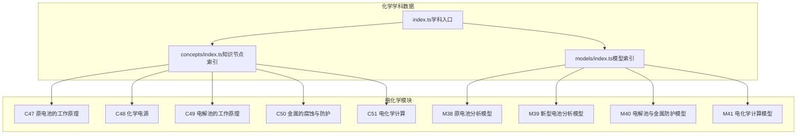
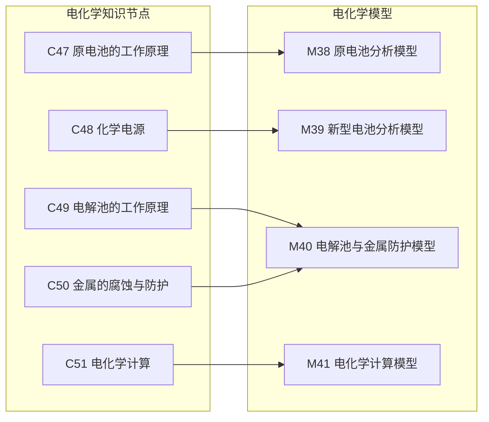
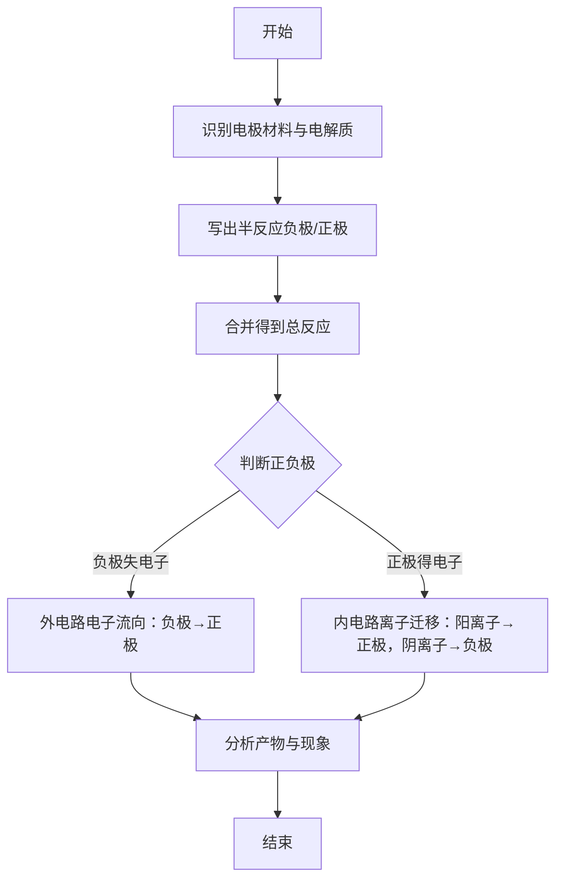
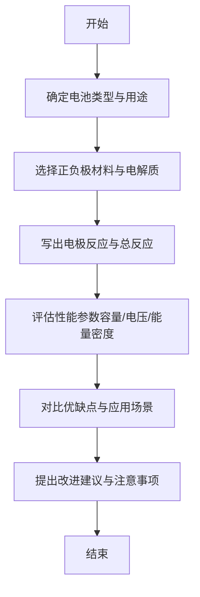
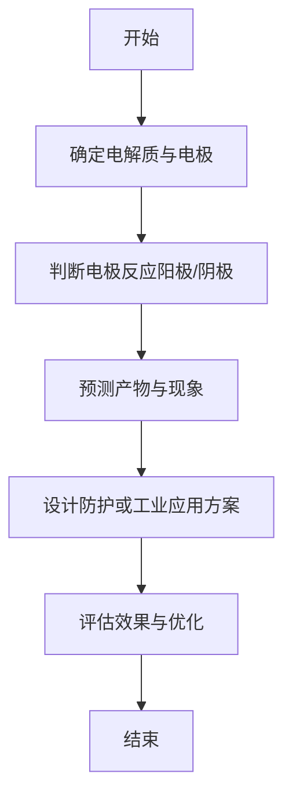
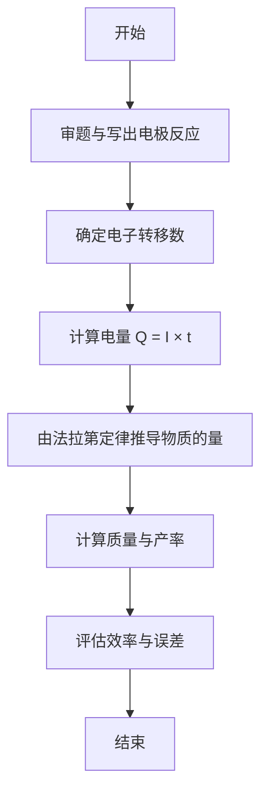
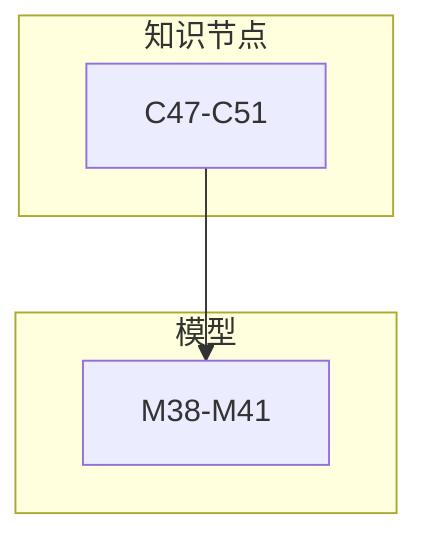

# 电化学模型

<cite>
**本文引用的文件**
- [M38_原电池分析模型.ts](file://src/data/chemistry/models/M38_原电池分析模型.ts)
- [M39_新型电池分析模型.ts](file://src/data/chemistry/models/M39_新型电池分析模型.ts)
- [M40_电解池与金属防护模型.ts](file://src/data/chemistry/models/M40_电解池与金属防护模型.ts)
- [M41_电化学计算模型.ts](file://src/data/chemistry/models/M41_电化学计算模型.ts)
- [C47_原电池的工作原理.ts](file://src/data/chemistry/concepts/C47_原电池的工作原理.ts)
- [C48_化学电源.ts](file://src/data/chemistry/concepts/C48_化学电源.ts)
- [C49_电解池的工作原理.ts](file://src/data/chemistry/concepts/C49_电解池的工作原理.ts)
- [C50_金属的腐蚀与防护.ts](file://src/data/chemistry/concepts/C50_金属的腐蚀与防护.ts)
- [C51_电化学计算.ts](file://src/data/chemistry/concepts/C51_电化学计算.ts)
- [index.ts（化学模型索引）](file://src/data/chemistry/models/index.ts)
- [index.ts（化学知识节点索引）](file://src/data/chemistry/concepts/index.ts)
- [index.ts（化学学科数据入口）](file://src/data/chemistry/index.ts)
- [gen-chemistry-models.js](file://scripts/gen-chemistry-models.js)
</cite>

## 目录
1. [简介](#简介)
2. [项目结构](#项目结构)
3. [核心组件](#核心组件)
4. [架构总览](#架构总览)
5. [详细组件分析](#详细组件分析)
6. [依赖分析](#依赖分析)
7. [性能考虑](#性能考虑)
8. [故障排查指南](#故障排查指南)
9. [结论](#结论)
10. [附录](#附录)

## 简介
本文件面向星耀平台化学学科“电化学”板块，系统梳理并阐述四大电化学模型：原电池分析模型、新型电池分析模型、电解池与金属防护模型、电化学计算模型。文档基于仓库现有数据结构与模板，结合电化学教学与学习需求，提供原理应用、计算方法、电极反应与电池构造图示的指导思路，并给出可操作的学习路径与实践建议，帮助学生建立从概念到模型再到应用的完整知识体系。

## 项目结构
电化学模型与知识节点均位于 src/data/chemistry 下，采用“模块-章节-知识点/模型”的层级组织：
- 知识节点（concepts）：覆盖原电池、化学电源、电解池、金属腐蚀与防护、电化学计算等基础概念。
- 模型（models）：覆盖原电池分析、新型电池分析、电解池与金属防护、电化学计算等应用模型。
- 数据入口（index.ts）：统一注册学科元数据、模块/章节映射、模型索引与查询接口。

**图示来源**
- [index.ts（化学学科数据入口）:22-93](file://src/data/chemistry/index.ts#L22-L93)
- [index.ts（化学知识节点索引）:210-219](file://src/data/chemistry/concepts/index.ts#L210-L219)
- [index.ts（化学模型索引）:159-209](file://src/data/chemistry/models/index.ts#L159-L209)

**章节来源**
- [index.ts（化学学科数据入口）:22-93](file://src/data/chemistry/index.ts#L22-L93)
- [index.ts（化学知识节点索引）:210-219](file://src/data/chemistry/concepts/index.ts#L210-L219)
- [index.ts（化学模型索引）:159-209](file://src/data/chemistry/models/index.ts#L159-L209)

## 核心组件
- 原电池分析模型（M38）：聚焦原电池的构成、电极反应、电子流向与正负极判定，以及典型装置（如铜锌原电池）的分析方法。
- 新型电池分析模型（M39）：覆盖二次电池、燃料电池、锂电池等新型电池的工作原理、优缺点与适用场景。
- 电解池与金属防护模型（M40）：讲解电解池的电极反应与产物分析，以及牺牲阳极保护、外加电流保护等金属防护策略。
- 电化学计算模型（M41）：围绕电量、质量、效率等计算，结合法拉第定律与电子守恒，提供计算流程与实例思路。

上述模型均遵循统一的数据结构模板，包含定位（核心/本质/关键洞察）、原理、变式（基础/进阶/挑战）、知识网络、方法论（思路/决策树/要点/常见误区）、自测与应用示例等维度，便于系统化学习与评估。

**章节来源**
- [M38_原电池分析模型.ts:4-49](file://src/data/chemistry/models/M38_原电池分析模型.ts#L4-L49)
- [M39_新型电池分析模型.ts:4-49](file://src/data/chemistry/models/M39_新型电池分析模型.ts#L4-L49)
- [M40_电解池与金属防护模型.ts:4-49](file://src/data/chemistry/models/M40_电解池与金属防护模型.ts#L4-L49)
- [M41_电化学计算模型.ts:4-49](file://src/data/chemistry/models/M41_电化学计算模型.ts#L4-L49)

## 架构总览
下图展示电化学模型在学科数据层的组织与关联关系，体现“知识节点—模型—应用”的递进结构。

**图示来源**
- [index.ts（化学知识节点索引）:210-219](file://src/data/chemistry/concepts/index.ts#L210-L219)
- [index.ts（化学模型索引）:159-209](file://src/data/chemistry/models/index.ts#L159-L209)

## 详细组件分析

### 原电池分析模型（M38）
- 定位与本质
  - 核心：原电池将化学能转化为电能，通过氧化还原反应产生电流。
  - 本质：负极失电子被氧化，正极得电子被还原；电子经外电路从负极流向正极；内电路中离子迁移维持电荷守恒。
  - 关键洞察：电极反应的书写、电极产物的判断、外电路与内电路的区分。
- 原理与应用
  - 电极反应：负极（失电子）与正极（得电子）的半反应书写；总反应为两半反应相加。
  - 电池构造：盐桥或质子交换膜的作用；正负极材料的选择；电解质溶液的设置。
  - 计算与判断：电动势、电极电势差与反应方向的关系；外电路电流方向与电子流向一致。
- 方法论
  - 思路：明确电极材料与电解质→写出半反应→合并得到总反应→判断正负极→分析产物与现象。
  - 决策树：识别氧化还原反应→确定电子流向→标注电极→计算电动势→解释现象。
  - 要点：注意半反应的配平与电子守恒；盐桥的作用不可省略；产物分析需结合电极材料。
  - 常见误区：混淆内/外电路；误判电极材料；忽略盐桥导致电流中断。
- 自测与应用
  - 自测：典型原电池（如铜锌原电池）的电极反应、产物与电流方向判断。
  - 应用：解释水果电池、纽扣电池等生活实例；分析电池失效原因与改进措施。

**章节来源**
- [M38_原电池分析模型.ts:4-49](file://src/data/chemistry/models/M38_原电池分析模型.ts#L4-L49)
- [C47_原电池的工作原理.ts:4-41](file://src/data/chemistry/concepts/C47_原电池的工作原理.ts#L4-L41)

### 新型电池分析模型（M39）
- 定位与本质
  - 核心：新型电池（二次电池、燃料电池、锂电池等）在能量存储与转换方面的优势与局限。
  - 本质：通过优化电极材料、电解质与结构设计，提升容量、寿命、安全性与环境友好性。
  - 关键洞察：不同电池体系的反应机理、能量密度、循环稳定性与成本权衡。
- 原理与应用
  - 二次电池：可逆充放电，典型如锂离子电池；正极材料（如钴酸锂）与负极材料（石墨）的嵌锂/脱锂过程。
  - 燃料电池：氢气与氧气反应生成水，效率高且清洁；需要催化剂与质子交换膜。
  - 锂电池：高能量密度、轻量化，广泛用于便携设备与电动汽车；需关注安全与回收。
- 方法论
  - 思路：明确电池类型→分析正负极材料→写出电极反应→评估性能参数（容量、电压、能量密度）→讨论优缺点与应用场景。
  - 决策树：用途需求（便携/储能/交通）→材料可行性→安全性与成本→技术成熟度。
  - 要点：注意材料稳定性与副反应；关注循环寿命与衰减机制。
  - 常见误区：忽视充电过程的可逆性；误以为所有电池都适合同一场景。
- 自测与应用
  - 自测：比较不同电池的优缺点与适用范围；解释电池失效与维护方法。
  - 应用：分析电动车电池包设计、家庭储能系统选型与废弃电池处理。

**章节来源**
- [M39_新型电池分析模型.ts:4-49](file://src/data/chemistry/models/M39_新型电池分析模型.ts#L4-L49)
- [C48_化学电源.ts:4-41](file://src/data/chemistry/concepts/C48_化学电源.ts#L4-L41)

### 电解池与金属防护模型（M40）
- 定位与本质
  - 核心：电解池利用外加电能驱动非自发氧化还原反应，实现物质的电化学合成或金属的电化学防护。
  - 本质：阳极失电子被氧化，阴极得电子被还原；产物取决于电极材料与电解质。
  - 关键洞察：电极反应与产物的预测、防护策略的选择与实施。
- 原理与应用
  - 电极反应与产物：根据电极材料与电解质，判断阳极产物（如氯气、氧气）与阴极产物（如氢气、金属单质）。
  - 金属防护：牺牲阳极保护（如镁块保护铁船体）与外加电流保护（如给钢铁通负电流）。
- 方法论
  - 思路：明确电解质与电极→判断电极反应→预测产物→设计防护方案→评估效果。
  - 决策树：目标（电镀/电解精炼/防护）→电极材料→电解质→电流强度→运行条件。
  - 要点：注意电极材料的活性顺序；避免副反应影响产物纯度。
  - 常见误区：混淆原电池与电解池；误判电极产物。
- 自测与应用
  - 自测：判断电解池产物、设计金属防护方案。
  - 应用：电镀铜、氯碱工业、金属防腐工程实例分析。

**章节来源**
- [M40_电解池与金属防护模型.ts:4-49](file://src/data/chemistry/models/M40_电解池与金属防护模型.ts#L4-L49)
- [C49_电解池的工作原理.ts:4-41](file://src/data/chemistry/concepts/C49_电解池的工作原理.ts#L4-L41)
- [C50_金属的腐蚀与防护.ts:4-41](file://src/data/chemistry/concepts/C50_金属的腐蚀与防护.ts#L4-L41)

### 电化学计算模型（M41）
- 定位与本质
  - 核心：基于法拉第定律与电子守恒，进行电量、质量、效率等电化学计算。
  - 本质：通过法拉第常数与电子转移数，建立电荷与物质的定量关系。
  - 关键洞察：计算流程标准化、单位换算与误差控制。
- 原理与应用
  - 电量与物质：Q = n × F（F为法拉第常数，n为电子转移物质的量）。
  - 质量与效率：结合电极反应的摩尔关系，计算析出物的质量与产率。
  - 流程：确定反应与电子转移数→计算电量→推导物质的量与质量→评估效率。
- 方法论
  - 思路：审题→写出电极反应→确定电子转移数→计算电量→求物质的量与质量→评估效率。
  - 决策树：已知量（电流/时间/质量）→选择公式→代入数值→单位换算→结果校验。
  - 要点：注意电子转移数与反应物系数的一致性；电流单位换算（安培·秒）。
  - 常见误区：忽略电子转移数；单位不统一；效率计算忽略损耗。
- 自测与应用
  - 自测：典型计算题（电解水、电镀、电解精炼）。
  - 应用：工业电解槽设计、电镀工艺优化、电池容量估算。

**章节来源**
- [M41_电化学计算模型.ts:4-49](file://src/data/chemistry/models/M41_电化学计算模型.ts#L4-L49)
- [C51_电化学计算.ts:4-41](file://src/data/chemistry/concepts/C51_电化学计算.ts#L4-L41)

## 依赖分析
- 模块耦合
  - 知识节点为模型提供概念基础；模型在知识节点之上形成应用能力。
  - 模型之间存在交叉：如电解池与金属防护模型共享电极反应与产物分析方法。
- 导入与索引
  - 模型与知识节点分别通过各自的 index.ts 汇总导出，学科入口统一注册。
- 外部依赖
  - 本节仅分析内部模块关系，未涉及外部依赖。

**图示来源**
- [index.ts（化学知识节点索引）:210-219](file://src/data/chemistry/concepts/index.ts#L210-L219)
- [index.ts（化学模型索引）:159-209](file://src/data/chemistry/models/index.ts#L159-L209)

**章节来源**
- [index.ts（化学知识节点索引）:210-219](file://src/data/chemistry/concepts/index.ts#L210-L219)
- [index.ts（化学模型索引）:159-209](file://src/data/chemistry/models/index.ts#L159-L209)
- [index.ts（化学学科数据入口）:135-183](file://src/data/chemistry/index.ts#L135-L183)

## 性能考虑
- 数据规模与加载
  - 当前模型与知识节点数量适中，采用静态导入与索引映射，加载开销低。
- 查询与检索
  - 通过 modelDataMap 与 conceptDataMap 提供 O(1) 级别的数据访问，有利于前端渲染与交互。
- 可扩展性
  - 新增模型与知识节点只需遵循现有模板与索引格式，保持结构一致性。

[本节为通用性能讨论，无需特定文件引用]

## 故障排查指南
- 模板未填充
  - 现有模型与知识节点仍处于占位模板状态，需按“七模块内容”与“六段式内容”完善。
  - 建议：对照 gen-chemistry-models.js 的生成逻辑，逐项填写核心、本质、关键洞察、原理、变式、方法论、自测与应用。
- 导入与索引错误
  - 若新增模型后页面无法显示，请检查 models/index.ts 与 concepts/index.ts 中的导入与导出是否匹配。
- 数据结构不一致
  - 确保新增对象符合现有接口定义（如 id、title、module、chapter、difficulty 等字段）。

**章节来源**
- [gen-chemistry-models.js:72-123](file://scripts/gen-chemistry-models.js#L72-L123)
- [index.ts（化学模型索引）:57-106](file://src/data/chemistry/models/index.ts#L57-L106)
- [index.ts（化学知识节点索引）:65-123](file://src/data/chemistry/concepts/index.ts#L65-L123)

## 结论
本文件基于星耀平台化学学科的电化学板块，系统梳理了原电池、新型电池、电解池与金属防护、电化学计算四大模型的结构与应用。尽管当前模型与知识节点仍为占位模板，但其统一的数据结构与清晰的模块划分，为后续内容填充与教学应用提供了坚实基础。建议优先完善核心概念与模型的“七模块内容”，再逐步补充实例与练习，以实现从“理解原理”到“解决实际问题”的闭环学习路径。

[本节为总结性内容，无需特定文件引用]

## 附录
- 生成脚本
  - 使用 scripts/gen-chemistry-models.js 可批量生成模型模板与索引文件，便于快速扩展。
- 学科入口
  - 通过 chemistry/index.ts 注册学科元数据、模型与问题资源，支持前端按模块/章节检索与导航。

**章节来源**
- [gen-chemistry-models.js:1-166](file://scripts/gen-chemistry-models.js#L1-L166)
- [index.ts（化学学科数据入口）:135-183](file://src/data/chemistry/index.ts#L135-L183)