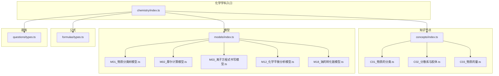
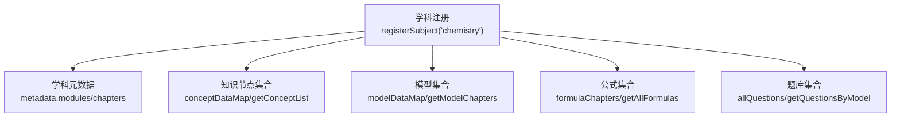
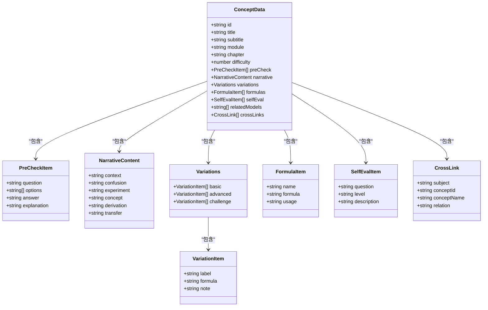
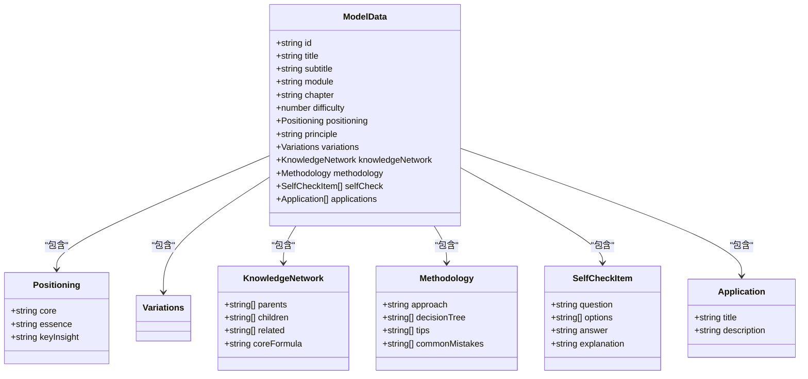
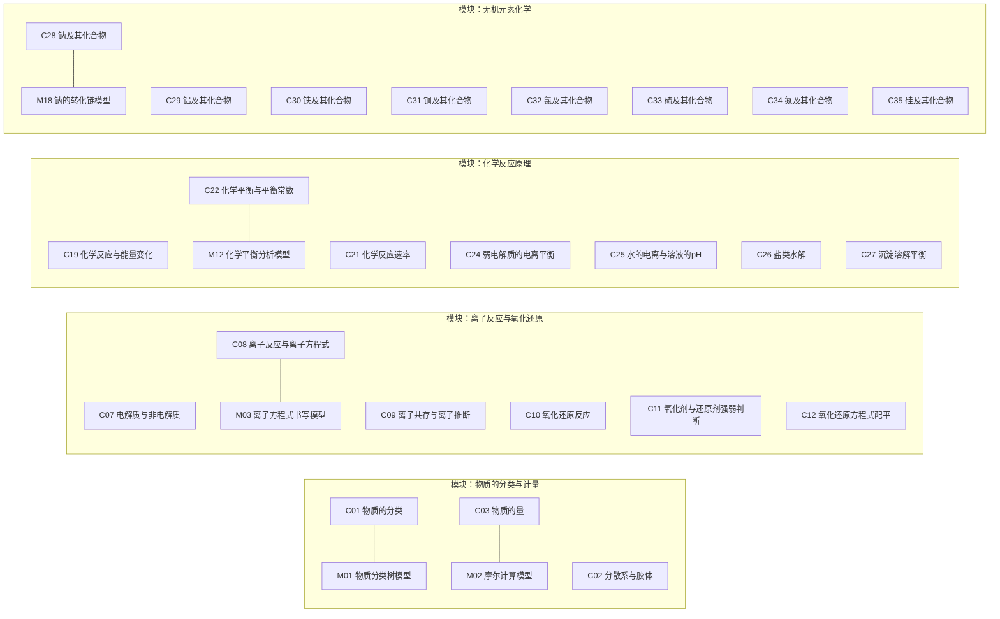
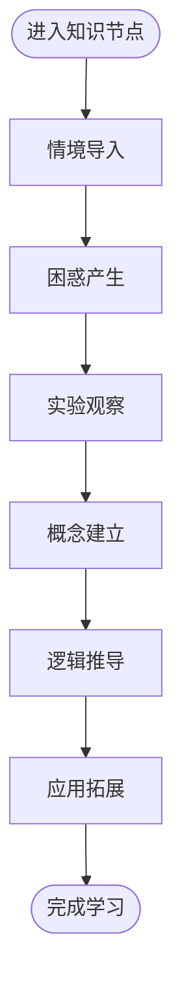
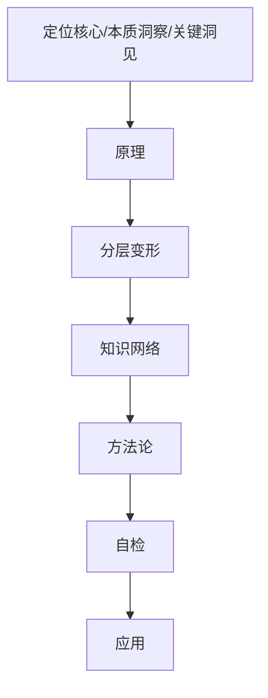
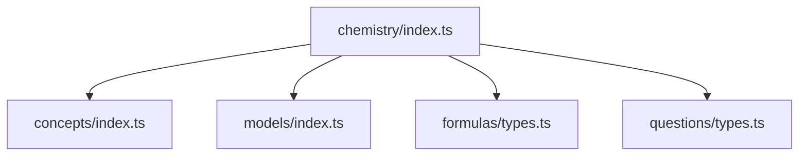

# 化学知识节点

<cite>
**本文引用的文件**
- [src/data/chemistry/index.ts](file://src/data/chemistry/index.ts)
- [src/data/chemistry/concepts/types.ts](file://src/data/chemistry/concepts/types.ts)
- [src/data/chemistry/formulas/types.ts](file://src/data/chemistry/formulas/types.ts)
- [src/data/chemistry/concepts/index.ts](file://src/data/chemistry/concepts/index.ts)
- [src/data/chemistry/concepts/C01_物质的分类.ts](file://src/data/chemistry/concepts/C01_物质的分类.ts)
- [src/data/chemistry/concepts/C02_分散系与胶体.ts](file://src/data/chemistry/concepts/C02_分散系与胶体.ts)
- [src/data/chemistry/concepts/C03_物质的量.ts](file://src/data/chemistry/concepts/C03_物质的量.ts)
- [src/data/chemistry/models/index.ts](file://src/data/chemistry/models/index.ts)
- [src/data/chemistry/models/M01_物质分类树模型.ts](file://src/data/chemistry/models/M01_物质分类树模型.ts)
- [src/data/chemistry/models/M02_摩尔计算模型.ts](file://src/data/chemistry/models/M02_摩尔计算模型.ts)
- [src/data/chemistry/models/M03_离子方程式书写模型.ts](file://src/data/chemistry/models/M03_离子方程式书写模型.ts)
- [src/data/chemistry/models/M12_化学平衡分析模型.ts](file://src/data/chemistry/models/M12_化学平衡分析模型.ts)
- [src/data/chemistry/models/M18_钠的转化链模型.ts](file://src/data/chemistry/models/M18_钠的转化链模型.ts)
- [src/data/chemistry/questions/types.ts](file://src/data/chemistry/questions/types.ts)
</cite>

## 目录
1. [简介](#简介)
2. [项目结构](#项目结构)
3. [核心组件](#核心组件)
4. [架构总览](#架构总览)
5. [详细组件分析](#详细组件分析)
6. [依赖分析](#依赖分析)
7. [性能考虑](#性能考虑)
8. [故障排查指南](#故障排查指南)
9. [结论](#结论)
10. [附录](#附录)

## 简介
本文件面向“星耀平台”的化学学科，系统化梳理并文档化57个K层知识节点（C01–C57）的组织结构与内容体系，覆盖物质的分类与计量、离子反应与氧化还原、物质结构与元素周期律、化学反应原理、无机元素化学、有机化学、电化学、化学实验基础八大板块。文档重点阐述每个知识节点的结构组成（情境导入、困惑产生、实验观察、概念建立、逻辑推导、应用拓展）、难度等级、模块归属、章节组织与学习路径设计，并解释如何通过模块化设计实现知识的系统化呈现及节点间的逻辑递进关系。同时，提供知识节点的数据结构与实现方式参考路径，帮助开发者与内容建设者快速理解与扩展。

## 项目结构
化学学科数据采用“学科入口 + 知识节点 + 模型 + 公式 + 题库”五维一体的模块化组织方式：
- 学科入口负责聚合模块、章节、模型、公式与题库，并向平台注册主题数据接口。
- 知识节点（ConceptData）承载K层知识点的完整叙事与能力训练闭环。
- 模型（Model）以“方法论+知识网络+应用”形式支撑知识迁移与深度学习。
- 公式（FormulaCard）提供可检索、可溯源的公式卡片。
- 题库（Question）提供按模型与难度组织的题目资源。

图表来源
- [src/data/chemistry/index.ts:1-186](file://src/data/chemistry/index.ts#L1-L186)
- [src/data/chemistry/concepts/index.ts:1-244](file://src/data/chemistry/concepts/index.ts#L1-L244)
- [src/data/chemistry/models/index.ts:1-209](file://src/data/chemistry/models/index.ts#L1-L209)
- [src/data/chemistry/concepts/C01_物质的分类.ts:1-42](file://src/data/chemistry/concepts/C01_物质的分类.ts#L1-L42)
- [src/data/chemistry/concepts/C02_分散系与胶体.ts:1-42](file://src/data/chemistry/concepts/C02_分散系与胶体.ts#L1-L42)
- [src/data/chemistry/concepts/C03_物质的量.ts:1-42](file://src/data/chemistry/concepts/C03_物质的量.ts#L1-L42)
- [src/data/chemistry/models/M01_物质分类树模型.ts:1-50](file://src/data/chemistry/models/M01_物质分类树模型.ts#L1-L50)
- [src/data/chemistry/models/M02_摩尔计算模型.ts:1-50](file://src/data/chemistry/models/M02_摩尔计算模型.ts#L1-L50)
- [src/data/chemistry/models/M03_离子方程式书写模型.ts:1-50](file://src/data/chemistry/models/M03_离子方程式书写模型.ts#L1-L50)
- [src/data/chemistry/models/M12_化学平衡分析模型.ts:1-50](file://src/data/chemistry/models/M12_化学平衡分析模型.ts#L1-L50)
- [src/data/chemistry/models/M18_钠的转化链模型.ts:1-50](file://src/data/chemistry/models/M18_钠的转化链模型.ts#L1-L50)
- [src/data/chemistry/formulas/types.ts:1-31](file://src/data/chemistry/formulas/types.ts#L1-L31)
- [src/data/chemistry/questions/types.ts:1-28](file://src/data/chemistry/questions/types.ts#L1-L28)

章节来源
- [src/data/chemistry/index.ts:1-186](file://src/data/chemistry/index.ts#L1-L186)
- [src/data/chemistry/concepts/index.ts:1-244](file://src/data/chemistry/concepts/index.ts#L1-L244)
- [src/data/chemistry/models/index.ts:1-209](file://src/data/chemistry/models/index.ts#L1-L209)
- [src/data/chemistry/concepts/C01_物质的分类.ts:1-42](file://src/data/chemistry/concepts/C01_物质的分类.ts#L1-L42)
- [src/data/chemistry/concepts/C02_分散系与胶体.ts:1-42](file://src/data/chemistry/concepts/C02_分散系与胶体.ts#L1-L42)
- [src/data/chemistry/concepts/C03_物质的量.ts:1-42](file://src/data/chemistry/concepts/C03_物质的量.ts#L1-L42)
- [src/data/chemistry/models/M01_物质分类树模型.ts:1-50](file://src/data/chemistry/models/M01_物质分类树模型.ts#L1-L50)
- [src/data/chemistry/models/M02_摩尔计算模型.ts:1-50](file://src/data/chemistry/models/M02_摩尔计算模型.ts#L1-L50)
- [src/data/chemistry/models/M03_离子方程式书写模型.ts:1-50](file://src/data/chemistry/models/M03_离子方程式书写模型.ts#L1-L50)
- [src/data/chemistry/models/M12_化学平衡分析模型.ts:1-50](file://src/data/chemistry/models/M12_化学平衡分析模型.ts#L1-L50)
- [src/data/chemistry/models/M18_钠的转化链模型.ts:1-50](file://src/data/chemistry/models/M18_钠的转化链模型.ts#L1-L50)
- [src/data/chemistry/formulas/types.ts:1-31](file://src/data/chemistry/formulas/types.ts#L1-L31)
- [src/data/chemistry/questions/types.ts:1-28](file://src/data/chemistry/questions/types.ts#L1-L28)

## 核心组件
- 学科入口与模块组织
  - 化学学科入口统一注册主题数据，提供概念列表、模型章节、公式与题库接口；定义八大模块与章节映射，确保知识节点与模型的模块归属一致。
  - 模块到颜色映射用于前端视觉呈现，便于学习路径可视化。
- 知识节点（ConceptData）
  - 结构包含：前置检测、叙事正文（情境导入/困惑产生/实验观察/概念建立/逻辑推导/应用拓展）、分层变形（基础/进阶/挑战）、公式卡片、自评、关联模型与跨学科链接。
  - 提供元数据查询与全部ID枚举，支撑前端列表与详情页渲染。
- 模型（Model）
  - 以“定位核心/本质洞察/关键洞见、原理、分层变形、知识网络、方法论、自检、应用”七模块组织，强调可迁移的学习范式与知识网络构建。
  - 模型与知识节点通过relatedModels建立双向关联，形成“知识—模型”闭环。
- 公式卡片（FormulaCard）
  - 支持变量说明、适用条件、推导过程、来源概念、标签等字段，便于检索与溯源。
- 题库（Question）
  - 支持难度层级（B/J/T）、题型分类、目标与功能标签、难度D值等，服务于练习、诊断与综合测评。

章节来源
- [src/data/chemistry/index.ts:22-93](file://src/data/chemistry/index.ts#L22-L93)
- [src/data/chemistry/index.ts:107-116](file://src/data/chemistry/index.ts#L107-L116)
- [src/data/chemistry/concepts/types.ts:52-79](file://src/data/chemistry/concepts/types.ts#L52-L79)
- [src/data/chemistry/models/index.ts:159-209](file://src/data/chemistry/models/index.ts#L159-L209)
- [src/data/chemistry/formulas/types.ts:10-31](file://src/data/chemistry/formulas/types.ts#L10-L31)
- [src/data/chemistry/questions/types.ts:4-27](file://src/data/chemistry/questions/types.ts#L4-L27)

## 架构总览
下图展示化学学科数据在平台中的总体架构与交互关系：

图表来源
- [src/data/chemistry/index.ts:135-183](file://src/data/chemistry/index.ts#L135-L183)

章节来源
- [src/data/chemistry/index.ts:135-183](file://src/data/chemistry/index.ts#L135-L183)

## 详细组件分析

### 知识节点数据结构与实现要点
- 数据结构要点
  - 必备字段：id、title、subtitle、module、chapter、difficulty。
  - 叙事正文：context、confusion、experiment、concept、derivation、transfer。
  - 变形分层：basic/advanced/challenge。
  - 公式卡片：name/formula/usage。
  - 自评：question/level/description。
  - 关联：relatedModels、crossLinks。
- 实现方式
  - 每个CXX文件导出一个只读对象，作为该知识节点的完整数据快照。
  - concepts/index.ts汇总所有CXX并导出映射与分组列表，提供元数据查询与ID枚举。
  - chemistry/index.ts注册学科，将概念、模型、公式、题库整合为统一数据源。

图表来源
- [src/data/chemistry/concepts/types.ts:5-79](file://src/data/chemistry/concepts/types.ts#L5-L79)

章节来源
- [src/data/chemistry/concepts/types.ts:52-79](file://src/data/chemistry/concepts/types.ts#L52-L79)
- [src/data/chemistry/concepts/C01_物质的分类.ts:4-42](file://src/data/chemistry/concepts/C01_物质的分类.ts#L4-L42)
- [src/data/chemistry/concepts/C02_分散系与胶体.ts:4-42](file://src/data/chemistry/concepts/C02_分散系与胶体.ts#L4-L42)
- [src/data/chemistry/concepts/C03_物质的量.ts:4-42](file://src/data/chemistry/concepts/C03_物质的量.ts#L4-L42)
- [src/data/chemistry/concepts/index.ts:65-123](file://src/data/chemistry/concepts/index.ts#L65-L123)

### 模型数据结构与实现要点
- 数据结构要点
  - 定位核心/本质洞察/关键洞见、原理、分层变形、知识网络、方法论、自检、应用。
  - 知识网络包含parents/children/related/coreFormula，便于构建知识图谱。
- 实现方式
  - 每个MXX文件导出一个模型对象，models/index.ts汇总并导出映射、ID列表与按模块排序的模型数组。
  - chemistry/index.ts将模型章节与模型数据映射注入学科注册。

图表来源
- [src/data/chemistry/models/index.ts:57-106](file://src/data/chemistry/models/index.ts#L57-L106)
- [src/data/chemistry/models/M01_物质分类树模型.ts:4-50](file://src/data/chemistry/models/M01_物质分类树模型.ts#L4-L50)
- [src/data/chemistry/models/M02_摩尔计算模型.ts:4-50](file://src/data/chemistry/models/M02_摩尔计算模型.ts#L4-L50)
- [src/data/chemistry/models/M03_离子方程式书写模型.ts:4-50](file://src/data/chemistry/models/M03_离子方程式书写模型.ts#L4-L50)
- [src/data/chemistry/models/M12_化学平衡分析模型.ts:4-50](file://src/data/chemistry/models/M12_化学平衡分析模型.ts#L4-L50)
- [src/data/chemistry/models/M18_钠的转化链模型.ts:4-50](file://src/data/chemistry/models/M18_钠的转化链模型.ts#L4-L50)

章节来源
- [src/data/chemistry/models/index.ts:57-106](file://src/data/chemistry/models/index.ts#L57-L106)
- [src/data/chemistry/models/M01_物质分类树模型.ts:4-50](file://src/data/chemistry/models/M01_物质分类树模型.ts#L4-L50)
- [src/data/chemistry/models/M02_摩尔计算模型.ts:4-50](file://src/data/chemistry/models/M02_摩尔计算模型.ts#L4-L50)
- [src/data/chemistry/models/M03_离子方程式书写模型.ts:4-50](file://src/data/chemistry/models/M03_离子方程式书写模型.ts#L4-L50)
- [src/data/chemistry/models/M12_化学平衡分析模型.ts:4-50](file://src/data/chemistry/models/M12_化学平衡分析模型.ts#L4-L50)
- [src/data/chemistry/models/M18_钠的转化链模型.ts:4-50](file://src/data/chemistry/models/M18_钠的转化链模型.ts#L4-L50)

### 知识节点与模型的关联与递进
- 关联方式
  - 知识节点通过relatedModels指向模型ID，实现“知识—模型”双向关联。
  - 模型与知识节点在module/chapter层面保持一致，确保学习路径的连贯性。
- 递进关系
  - 同模块内按order或difficulty体现难度梯度；跨模块间以“基础—原理—应用”的顺序组织。
  - 示例：物质的分类与计量（C01–C06）→ 离子反应与氧化还原（C07–C12）→ 物质结构与元素周期律（C13–C18）→ 化学反应原理（C19–C27）→ 无机元素化学（C28–C35）→ 有机化学（C36–C46）→ 电化学（C47–C51）→ 化学实验基础（C52–C57）。

图表来源
- [src/data/chemistry/concepts/index.ts:126-232](file://src/data/chemistry/concepts/index.ts#L126-L232)
- [src/data/chemistry/models/index.ts:159-209](file://src/data/chemistry/models/index.ts#L159-L209)
- [src/data/chemistry/concepts/C01_物质的分类.ts:39-41](file://src/data/chemistry/concepts/C01_物质的分类.ts#L39-L41)
- [src/data/chemistry/concepts/C03_物质的量.ts:39-41](file://src/data/chemistry/concepts/C03_物质的量.ts#L39-L41)
- [src/data/chemistry/concepts/C08_离子反应与离子方程式.ts:39-41](file://src/data/chemistry/concepts/C08_离子反应与离子方程式.ts#L39-L41)
- [src/data/chemistry/concepts/C22_化学平衡与平衡常数.ts:39-41](file://src/data/chemistry/concepts/C22_化学平衡与平衡常数.ts#L39-L41)
- [src/data/chemistry/concepts/C28_钠及其化合物.ts:39-41](file://src/data/chemistry/concepts/C28_钠及其化合物.ts#L39-L41)

章节来源
- [src/data/chemistry/concepts/index.ts:126-232](file://src/data/chemistry/concepts/index.ts#L126-L232)
- [src/data/chemistry/models/index.ts:159-209](file://src/data/chemistry/models/index.ts#L159-L209)

### 知识节点的“六段式”教学流程
- 情境导入：以真实实验或工业背景引入，激发认知冲突。
- 困惑产生：指出常见误区或易混点，引发思考。
- 实验观察：呈现直观现象，建立感性认识。
- 概念建立：抽象出核心概念，给出严谨定义。
- 逻辑推导：从微观结构或反应机理角度解释规律。
- 应用拓展：迁移到新情境，解决实际问题。

图表来源
- [src/data/chemistry/concepts/types.ts:12-19](file://src/data/chemistry/concepts/types.ts#L12-L19)

章节来源
- [src/data/chemistry/concepts/types.ts:12-19](file://src/data/chemistry/concepts/types.ts#L12-L19)

### 模型的“七模块”学习范式
- 定位核心/本质洞察/关键洞见：明确模型的核心价值与迁移边界。
- 原理：给出可操作的原理或公式。
- 分层变形：提供基础、进阶、挑战三个层次的练习路径。
- 知识网络：构建与相关知识节点的关系图谱。
- 方法论：总结解题思路、决策树、技巧与常见错误。
- 自检：以小测形式巩固关键要点。
- 应用：给出真实情境下的应用示例。

图表来源
- [src/data/chemistry/models/M01_物质分类树模型.ts:14-49](file://src/data/chemistry/models/M01_物质分类树模型.ts#L14-L49)

章节来源
- [src/data/chemistry/models/M01_物质分类树模型.ts:14-49](file://src/data/chemistry/models/M01_物质分类树模型.ts#L14-L49)

### 章节组织与学习路径设计
- 八大模块与章节
  - 物质的分类与计量（C01–C06）
  - 离子反应与氧化还原（C07–C12）
  - 物质结构与元素周期律（C13–C18）
  - 化学反应原理（C19–C27）
  - 无机元素化学（C28–C35）
  - 有机化学（C36–C46）
  - 电化学（C47–C51）
  - 化学实验基础（C52–C57）
- 学习路径建议
  - 基础阶段：物质的分类与计量 → 离子反应与氧化还原 → 物质结构与元素周期律。
  - 进阶阶段：化学反应原理 → 无机元素化学 → 有机化学。
  - 应用阶段：电化学 → 化学实验基础。
  - 复合训练：以模型为载体，串联相关知识节点，强化迁移能力。

章节来源
- [src/data/chemistry/index.ts:27-92](file://src/data/chemistry/index.ts#L27-L92)
- [src/data/chemistry/concepts/index.ts:126-232](file://src/data/chemistry/concepts/index.ts#L126-L232)

### 具体代码示例（数据结构与实现路径）
- 知识节点对象导出（C01）
  - 参考路径：[src/data/chemistry/concepts/C01_物质的分类.ts:4-42](file://src/data/chemistry/concepts/C01_物质的分类.ts#L4-L42)
- 知识节点索引与分组（concepts/index.ts）
  - 参考路径：[src/data/chemistry/concepts/index.ts:65-232](file://src/data/chemistry/concepts/index.ts#L65-L232)
- 模型对象导出（M01/M02/M03/M12/M18）
  - 参考路径：
    - [src/data/chemistry/models/M01_物质分类树模型.ts:4-50](file://src/data/chemistry/models/M01_物质分类树模型.ts#L4-L50)
    - [src/data/chemistry/models/M02_摩尔计算模型.ts:4-50](file://src/data/chemistry/models/M02_摩尔计算模型.ts#L4-L50)
    - [src/data/chemistry/models/M03_离子方程式书写模型.ts:4-50](file://src/data/chemistry/models/M03_离子方程式书写模型.ts#L4-L50)
    - [src/data/chemistry/models/M12_化学平衡分析模型.ts:4-50](file://src/data/chemistry/models/M12_化学平衡分析模型.ts#L4-L50)
    - [src/data/chemistry/models/M18_钠的转化链模型.ts:4-50](file://src/data/chemistry/models/M18_钠的转化链模型.ts#L4-L50)
- 模型索引与排序（models/index.ts）
  - 参考路径：[src/data/chemistry/models/index.ts:57-209](file://src/data/chemistry/models/index.ts#L57-L209)
- 学科入口注册（chemistry/index.ts）
  - 参考路径：[src/data/chemistry/index.ts:135-183](file://src/data/chemistry/index.ts#L135-L183)

章节来源
- [src/data/chemistry/concepts/C01_物质的分类.ts:4-42](file://src/data/chemistry/concepts/C01_物质的分类.ts#L4-L42)
- [src/data/chemistry/concepts/index.ts:65-232](file://src/data/chemistry/concepts/index.ts#L65-L232)
- [src/data/chemistry/models/M01_物质分类树模型.ts:4-50](file://src/data/chemistry/models/M01_物质分类树模型.ts#L4-L50)
- [src/data/chemistry/models/M02_摩尔计算模型.ts:4-50](file://src/data/chemistry/models/M02_摩尔计算模型.ts#L4-L50)
- [src/data/chemistry/models/M03_离子方程式书写模型.ts:4-50](file://src/data/chemistry/models/M03_离子方程式书写模型.ts#L4-L50)
- [src/data/chemistry/models/M12_化学平衡分析模型.ts:4-50](file://src/data/chemistry/models/M12_化学平衡分析模型.ts#L4-L50)
- [src/data/chemistry/models/M18_钠的转化链模型.ts:4-50](file://src/data/chemistry/models/M18_钠的转化链模型.ts#L4-L50)
- [src/data/chemistry/models/index.ts:57-209](file://src/data/chemistry/models/index.ts#L57-L209)
- [src/data/chemistry/index.ts:135-183](file://src/data/chemistry/index.ts#L135-L183)

## 依赖分析
- 组件耦合
  - chemistry/index.ts是中枢，依赖concepts、models、formulas、questions的导出，形成“入口—数据—模型—公式—题库”的单向依赖。
  - concepts/index.ts与models/index.ts分别维护CXX与MXX的映射，彼此独立但通过module/chapter保持语义一致。
- 外部依赖
  - 注册接口registerSubject来自通用注册机制，确保学科数据接入平台统一数据流。
- 循环依赖
  - 当前结构未发现循环依赖，模块职责清晰。

图表来源
- [src/data/chemistry/index.ts:1-10](file://src/data/chemistry/index.ts#L1-L10)
- [src/data/chemistry/concepts/index.ts:1-5](file://src/data/chemistry/concepts/index.ts#L1-L5)
- [src/data/chemistry/models/index.ts:1-5](file://src/data/chemistry/models/index.ts#L1-L5)
- [src/data/chemistry/formulas/types.ts:1-3](file://src/data/chemistry/formulas/types.ts#L1-L3)
- [src/data/chemistry/questions/types.ts:1-3](file://src/data/chemistry/questions/types.ts#L1-L3)

章节来源
- [src/data/chemistry/index.ts:1-10](file://src/data/chemistry/index.ts#L1-L10)
- [src/data/chemistry/concepts/index.ts:1-5](file://src/data/chemistry/concepts/index.ts#L1-L5)
- [src/data/chemistry/models/index.ts:1-5](file://src/data/chemistry/models/index.ts#L1-L5)
- [src/data/chemistry/formulas/types.ts:1-3](file://src/data/chemistry/formulas/types.ts#L1-L3)
- [src/data/chemistry/questions/types.ts:1-3](file://src/data/chemistry/questions/types.ts#L1-L3)

## 性能考虑
- 数据加载
  - 知识节点与模型均为静态常量，按需导入，避免运行时计算开销。
  - 通过模块化索引集中导出，减少重复遍历。
- 查询效率
  - conceptDataMap与modelDataMap提供O(1)键值访问；getAllConceptIds与ALL_MODEL_IDS提供批量枚举。
- 渲染优化
  - 按模块分组的conceptList减少前端渲染压力；模块颜色映射用于快速样式切换。

## 故障排查指南
- 常见问题
  - 知识节点缺失：检查concepts/index.ts是否正确导出并加入映射。
  - 模型未显示：确认models/index.ts中ID与标题配置正确，且module/chapter与知识节点一致。
  - 题库无法匹配：核对questions/types.ts中modelId与模型ID一致。
- 定位方法
  - 在chemistry/index.ts中逐一核对getConceptList/getModelChapters/getAllFormulas/getAllQuestions返回值。
  - 使用getAllConceptIds与ALL_MODEL_IDS进行完整性校验。

章节来源
- [src/data/chemistry/index.ts:135-183](file://src/data/chemistry/index.ts#L135-L183)
- [src/data/chemistry/concepts/index.ts:241-244](file://src/data/chemistry/concepts/index.ts#L241-L244)
- [src/data/chemistry/models/index.ts:108-157](file://src/data/chemistry/models/index.ts#L108-L157)
- [src/data/chemistry/questions/types.ts:4-27](file://src/data/chemistry/questions/types.ts#L4-L27)

## 结论
星耀平台的化学知识节点通过“知识节点—模型—公式—题库—入口注册”的五维架构，实现了K层知识的系统化组织与模块化呈现。每个知识节点遵循“六段式”教学流程，配合模型的“七模块”学习范式，形成从基础到应用的完整学习路径。八大模块与章节划分清晰，节点间逻辑递进明确，既满足教学需求，也为平台的个性化学习与能力诊断提供了坚实的数据基础。

## 附录
- 知识节点与模型对照（部分示例）
  - C01（物质的分类） ↔ M01（物质分类树模型）
  - C03（物质的量） ↔ M02（摩尔计算模型）
  - C08（离子反应与离子方程式） ↔ M03（离子方程式书写模型）
  - C22（化学平衡与平衡常数） ↔ M12（化学平衡分析模型）
  - C28（钠及其化合物） ↔ M18（钠的转化链模型）

章节来源
- [src/data/chemistry/concepts/index.ts:126-232](file://src/data/chemistry/concepts/index.ts#L126-L232)
- [src/data/chemistry/models/index.ts:159-209](file://src/data/chemistry/models/index.ts#L159-L209)