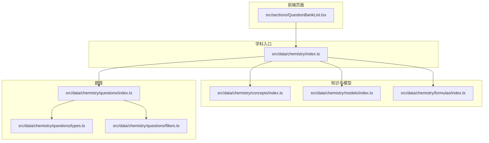
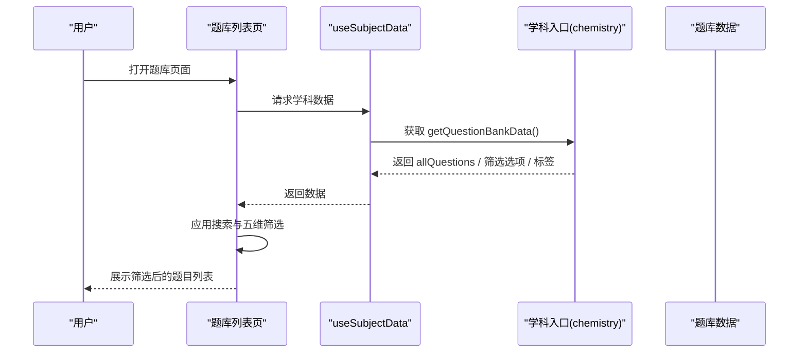
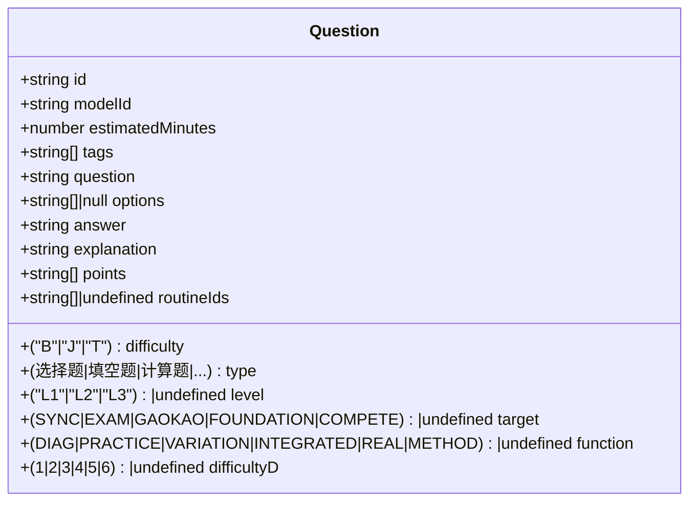
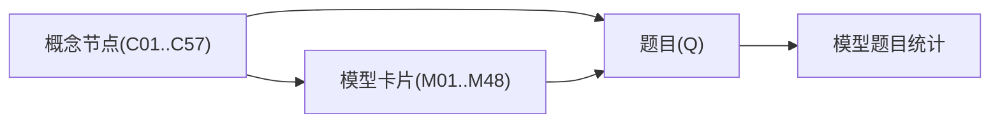
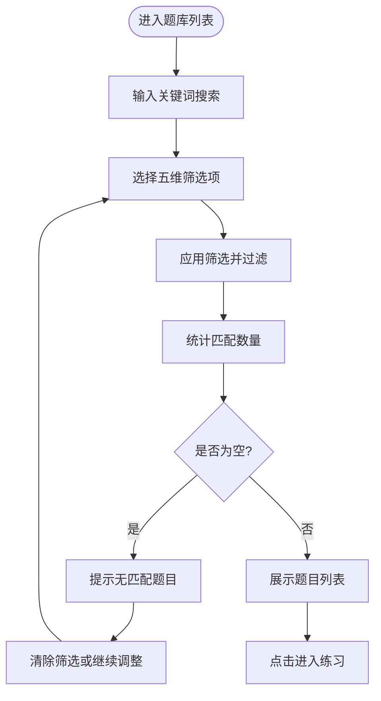
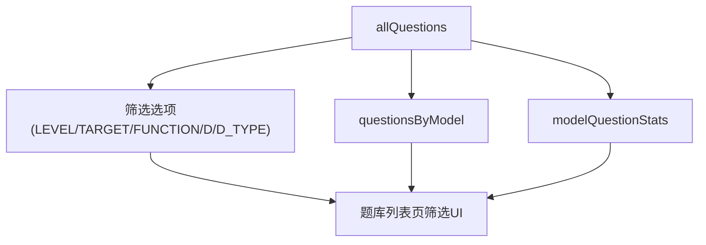
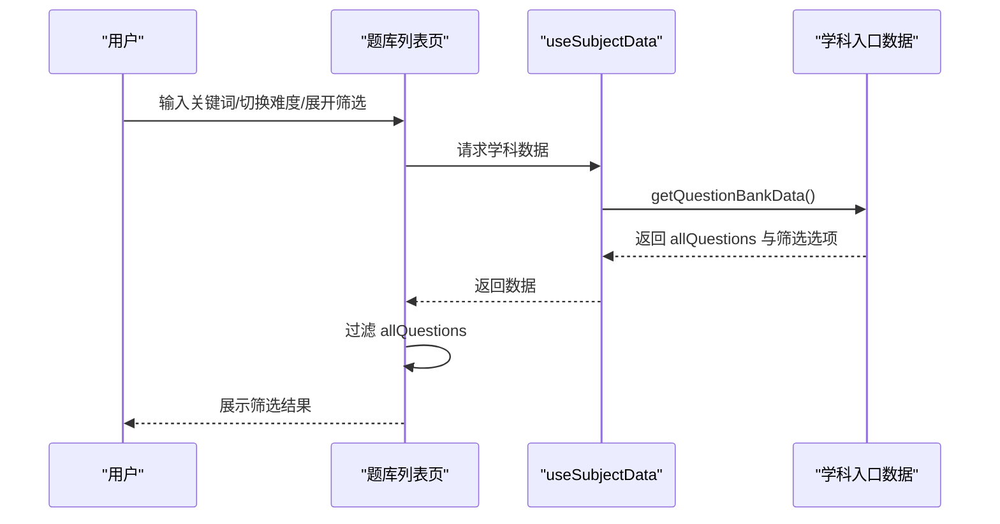
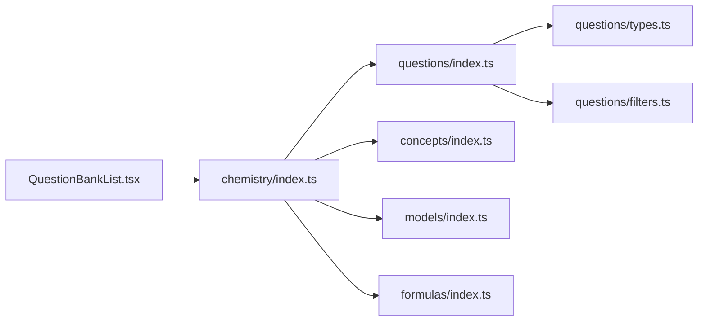

# 化学练习题库

<cite>
**本文引用的文件**
- [src/data/chemistry/questions/index.ts](file://src/data/chemistry/questions/index.ts)
- [src/data/chemistry/questions/types.ts](file://src/data/chemistry/questions/types.ts)
- [src/data/chemistry/questions/filters.ts](file://src/data/chemistry/questions/filters.ts)
- [src/data/chemistry/index.ts](file://src/data/chemistry/index.ts)
- [src/data/chemistry/concepts/index.ts](file://src/data/chemistry/concepts/index.ts)
- [src/data/chemistry/concepts/types.ts](file://src/data/chemistry/concepts/types.ts)
- [src/data/chemistry/models/index.ts](file://src/data/chemistry/models/index.ts)
- [src/data/chemistry/formulas/index.ts](file://src/data/chemistry/formulas/index.ts)
- [src/data/chemistry/formulas/types.ts](file://src/data/chemistry/formulas/types.ts)
- [src/sections/QuestionBankList.tsx](file://src/sections/QuestionBankList.tsx)
</cite>

## 目录
1. [简介](#简介)
2. [项目结构](#项目结构)
3. [核心组件](#核心组件)
4. [架构总览](#架构总览)
5. [详细组件分析](#详细组件分析)
6. [依赖分析](#依赖分析)
7. [性能考虑](#性能考虑)
8. [故障排查指南](#故障排查指南)
9. [结论](#结论)
10. [附录](#附录)

## 简介
本文件面向“星耀平台”的化学练习题库，系统化阐述题库的数据结构、组织方式与筛选机制。重点覆盖以下方面：
- 题目分类与难度分级体系
- 知识点与模型的关联关系
- 题型标注与层级/目标/功能/难度/题型五维筛选
- 题目数据结构、标签系统与统计分析
- 智能化筛选与个性化学习路径推荐思路
- 错题管理与学习报告生成机制建议
- 最佳实践与学习策略

## 项目结构
化学题库采用“学科入口 + 知识/模型/公式 + 题库”三层组织：
- 学科入口：注册学科元数据、模块/章节映射、模型与题目聚合接口
- 知识与模型：概念节点与模型卡片，支撑题目的知识点与方法论来源
- 题库：题目集合、按模型分组、难度与筛选选项、统计指标

图表来源
- [src/data/chemistry/index.ts:135-183](file://src/data/chemistry/index.ts#L135-L183)
- [src/data/chemistry/questions/index.ts:4-20](file://src/data/chemistry/questions/index.ts#L4-L20)
- [src/data/chemistry/questions/filters.ts:1-47](file://src/data/chemistry/questions/filters.ts#L1-L47)
- [src/data/chemistry/questions/types.ts:4-27](file://src/data/chemistry/questions/types.ts#L4-L27)
- [src/data/chemistry/concepts/index.ts:65-123](file://src/data/chemistry/concepts/index.ts#L65-L123)
- [src/data/chemistry/models/index.ts:57-106](file://src/data/chemistry/models/index.ts#L57-L106)
- [src/data/chemistry/formulas/index.ts:6-18](file://src/data/chemistry/formulas/index.ts#L6-L18)
- [src/sections/QuestionBankList.tsx:29-100](file://src/sections/QuestionBankList.tsx#L29-L100)

章节来源
- [src/data/chemistry/index.ts:22-93](file://src/data/chemistry/index.ts#L22-L93)
- [src/data/chemistry/concepts/index.ts:125-232](file://src/data/chemistry/concepts/index.ts#L125-L232)
- [src/data/chemistry/models/index.ts:159-208](file://src/data/chemistry/models/index.ts#L159-L208)

## 核心组件
- 题目数据结构与字段
  - 字段涵盖：题目ID、模型ID、难度等级、题型、预估时长、标签、题干、选项、答案、解析、知识点、典型题型、层级、目标、功能、难度D、可选的模型关联等
  - 支持Markdown与LaTeX渲染，便于复杂表达式与图文结合
- 题目筛选常量
  - 能力层级：L1/L2/L3
  - 学习目标：同步练习、期中期末、高考真题、基础巩固、竞赛拓展
  - 题目功能：诊断、练习、变式、综合、真实情境、方法
  - 难度等级D：1-6级
  - 题型：选择题、填空题、计算题、多选题、图像分析题、实验设计题、无机推断题、有机推断题、流程分析题
- 题库聚合与统计
  - 全量题目数组、按模型分组、模型题目统计（含B/J/T计数与总数）

章节来源
- [src/data/chemistry/questions/types.ts:4-27](file://src/data/chemistry/questions/types.ts#L4-L27)
- [src/data/chemistry/questions/filters.ts:4-46](file://src/data/chemistry/questions/filters.ts#L4-L46)
- [src/data/chemistry/questions/index.ts:4-20](file://src/data/chemistry/questions/index.ts#L4-L20)

## 架构总览
化学题库通过学科入口统一对外暴露：
- 概念与模型：提供概念列表、模块章节映射、模型数据与统计
- 公式库：提供公式卡片与检索
- 题库：提供全量题目、按模型分组、难度标签与筛选选项
- 页面：题库列表页基于上述数据进行五维筛选与结果展示

图表来源
- [src/sections/QuestionBankList.tsx:29-100](file://src/sections/QuestionBankList.tsx#L29-L100)
- [src/data/chemistry/index.ts:170-179](file://src/data/chemistry/index.ts#L170-L179)

章节来源
- [src/data/chemistry/index.ts:135-183](file://src/data/chemistry/index.ts#L135-L183)
- [src/sections/QuestionBankList.tsx:29-100](file://src/sections/QuestionBankList.tsx#L29-L100)

## 详细组件分析

### 题目数据结构与字段
- 关键字段说明
  - id/modelId：唯一标识与模型归属
  - difficulty：基础(B)/进阶(J)/挑战(T)
  - type：题型枚举
  - estimatedMinutes：预估耗时
  - tags：标签用于快速检索
  - question/options/answer/explanation：题干、选项、答案与解析
  - points：知识点关联（与概念ID对应）
  - level/target/function/difficultyD：层级/目标/功能/难度D
- 数据结构设计要点
  - 字段复用物理题库结构，适配化学题型
  - 支持Markdown与LaTeX，满足化学方程式与图像分析题需求
  - 通过points与relatedModels建立题-知识点/题-模型的双向关联

图表来源
- [src/data/chemistry/questions/types.ts:4-27](file://src/data/chemistry/questions/types.ts#L4-L27)

章节来源
- [src/data/chemistry/questions/types.ts:4-27](file://src/data/chemistry/questions/types.ts#L4-L27)

### 知识与模型组织
- 概念节点（C01-C57）按8大板块组织，每个概念包含：
  - 基础元数据：模块、章节、难度
  - 前置检测、叙事正文、分层变形、公式卡片、自评、相关模型与跨学科链接
- 模型卡片（M01-M48）按9个子分类组织，每个模型包含：
  - 定位与要点、原理、分层变式、知识网络、方法论、自测与应用

图表来源
- [src/data/chemistry/concepts/index.ts:125-232](file://src/data/chemistry/concepts/index.ts#L125-L232)
- [src/data/chemistry/models/index.ts:159-208](file://src/data/chemistry/models/index.ts#L159-L208)
- [src/data/chemistry/questions/index.ts:8-10](file://src/data/chemistry/questions/index.ts#L8-L10)

章节来源
- [src/data/chemistry/concepts/index.ts:65-123](file://src/data/chemistry/concepts/index.ts#L65-L123)
- [src/data/chemistry/models/index.ts:57-106](file://src/data/chemistry/models/index.ts#L57-L106)

### 题库五维筛选系统
- 维度与取值
  - 能力层级：L1/L2/L3
  - 学习目标：SYNC/EXAM/GAOKAO/FOUNDATION/COMPETE
  - 题目功能：DIAG/PRACTICE/VARIATION/INTEGRATED/REAL/METHOD
  - 难度等级D：1/2/3/4/5/6
  - 题型：选择题/填空题/计算题/多选题/图像分析题/实验设计题/无机推断题/有机推断题/流程分析题
- 筛选逻辑
  - 支持多维组合筛选与关键词搜索
  - 基础难度（B/J/T）与难度D可同时生效
  - 支持清除筛选与动态显示已激活筛选标签

图表来源
- [src/sections/QuestionBankList.tsx:61-83](file://src/sections/QuestionBankList.tsx#L61-L83)
- [src/data/chemistry/questions/filters.ts:4-46](file://src/data/chemistry/questions/filters.ts#L4-L46)

章节来源
- [src/sections/QuestionBankList.tsx:61-83](file://src/sections/QuestionBankList.tsx#L61-L83)
- [src/data/chemistry/questions/filters.ts:4-46](file://src/data/chemistry/questions/filters.ts#L4-L46)

### 题库聚合与统计
- 聚合接口
  - 全量题目、按模型分组、难度标签与颜色映射、五维筛选选项
- 统计指标
  - 模型题目统计：包含模型ID、标题、B/J/T与总数，便于可视化与学习进度跟踪

图表来源
- [src/data/chemistry/questions/index.ts:6-10](file://src/data/chemistry/questions/index.ts#L6-L10)
- [src/data/chemistry/index.ts:167-179](file://src/data/chemistry/index.ts#L167-L179)

章节来源
- [src/data/chemistry/questions/index.ts:6-10](file://src/data/chemistry/questions/index.ts#L6-L10)
- [src/data/chemistry/index.ts:167-179](file://src/data/chemistry/index.ts#L167-L179)

### 页面交互与筛选流程
- 页面组件职责
  - 提供关键词搜索框、基础难度切换按钮、五维筛选面板、已激活筛选标签与清除按钮
  - 将筛选结果映射到题目列表，支持跳转至具体题目练习
- 筛选流程
  - 同时匹配关键词、基础难度、能力层级、学习目标、题目功能、难度D、题型
  - 动态更新匹配数量与提示信息

图表来源
- [src/sections/QuestionBankList.tsx:29-100](file://src/sections/QuestionBankList.tsx#L29-L100)
- [src/data/chemistry/index.ts:170-179](file://src/data/chemistry/index.ts#L170-L179)

章节来源
- [src/sections/QuestionBankList.tsx:29-100](file://src/sections/QuestionBankList.tsx#L29-L100)

## 依赖分析
- 学科入口对题库、概念、模型、公式模块的依赖清晰，形成“入口 -> 数据 -> UI”的单向依赖
- 题库模块内部通过类型定义与筛选常量被页面组件直接消费
- 概念与模型作为题目的知识来源，通过points与relatedModels间接关联题目

图表来源
- [src/data/chemistry/index.ts:135-183](file://src/data/chemistry/index.ts#L135-L183)
- [src/data/chemistry/questions/index.ts:4-20](file://src/data/chemistry/questions/index.ts#L4-L20)
- [src/data/chemistry/questions/filters.ts:1-47](file://src/data/chemistry/questions/filters.ts#L1-L47)
- [src/data/chemistry/questions/types.ts:4-27](file://src/data/chemistry/questions/types.ts#L4-L27)
- [src/sections/QuestionBankList.tsx:29-100](file://src/sections/QuestionBankList.tsx#L29-L100)

章节来源
- [src/data/chemistry/index.ts:135-183](file://src/data/chemistry/index.ts#L135-L183)
- [src/sections/QuestionBankList.tsx:29-100](file://src/sections/QuestionBankList.tsx#L29-L100)

## 性能考虑
- 前端筛选
  - 当前实现为内存过滤，适合中小规模数据；若题目量增长，建议引入服务端分页与后端筛选
- 渲染优化
  - 列表项使用虚拟滚动与懒加载，减少首屏压力
- 缓存策略
  - 学科数据与筛选选项可缓存于store，避免重复请求
- 图片与公式
  - 图像分析题与LaTeX公式需注意懒加载与CDN加速

## 故障排查指南
- 题库为空
  - 检查学科入口是否正确注册，确认 getQuestionBankData 是否返回数据
  - 确认 allQuestions 是否已填充，筛选条件是否过于严格
- 筛选无效
  - 检查筛选选项与题目标签是否一致，确认枚举值大小写与空值处理
- 页面空白
  - 检查 useSubjectData 的加载状态与错误分支，确认路由与学科ID匹配

章节来源
- [src/sections/QuestionBankList.tsx:35-48](file://src/sections/QuestionBankList.tsx#L35-L48)
- [src/data/chemistry/index.ts:170-179](file://src/data/chemistry/index.ts#L170-L179)

## 结论
化学题库以清晰的学科入口与模块化数据结构为基础，结合五维筛选与统计指标，为学生提供了高效、可扩展的练习体验。通过知识点与模型的深度关联，配合难度与功能标注，能够支撑个性化学习路径与智能推荐的进一步演进。

## 附录

### 题目数据结构字段速览
- 必填字段：id、modelId、question、answer、explanation
- 常用筛选字段：difficulty、type、level、target、function、difficultyD、tags
- 关联字段：points（知识点）、routineIds（典型题型）、modelId（模型）

章节来源
- [src/data/chemistry/questions/types.ts:4-27](file://src/data/chemistry/questions/types.ts#L4-L27)

### 知识与模型索引
- 概念节点：C01-C57，按8大板块组织
- 模型卡片：M01-M48，按9个子分类组织

章节来源
- [src/data/chemistry/concepts/index.ts:125-232](file://src/data/chemistry/concepts/index.ts#L125-L232)
- [src/data/chemistry/models/index.ts:159-208](file://src/data/chemistry/models/index.ts#L159-L208)

### 公式库与检索
- 公式卡片包含名称、LaTeX表达式、适用条件、变量说明、来源概念与标签
- 提供按名称/公式/标签的模糊检索

章节来源
- [src/data/chemistry/formulas/index.ts:6-18](file://src/data/chemistry/formulas/index.ts#L6-L18)
- [src/data/chemistry/formulas/types.ts:10-30](file://src/data/chemistry/formulas/types.ts#L10-L30)