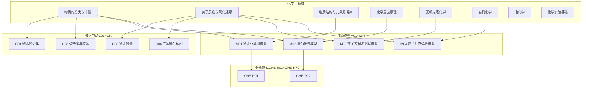
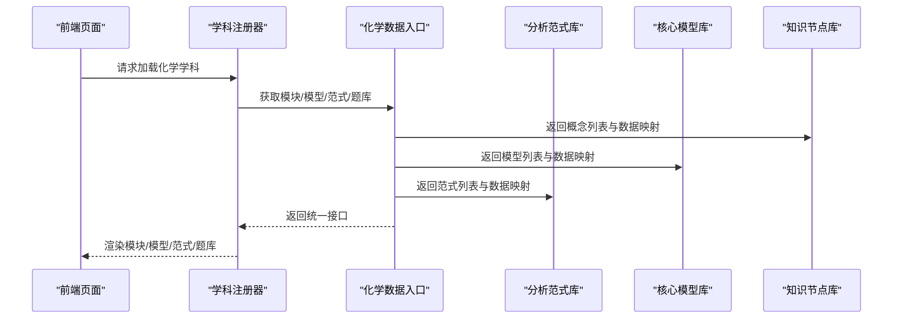
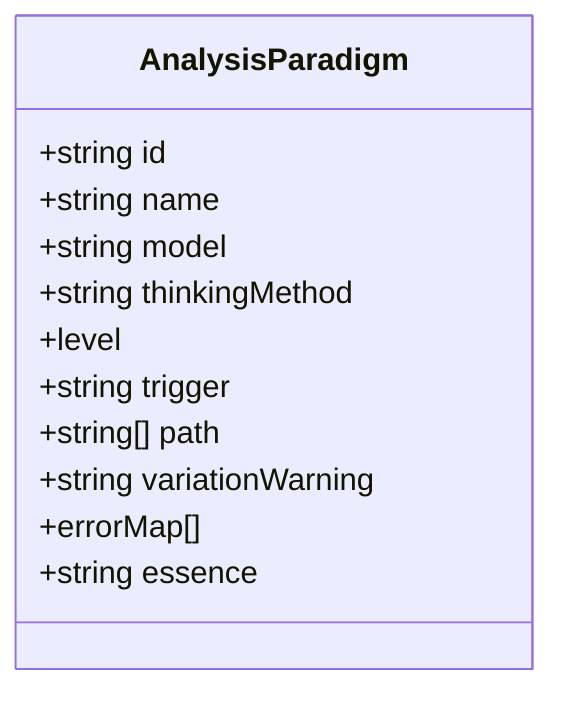
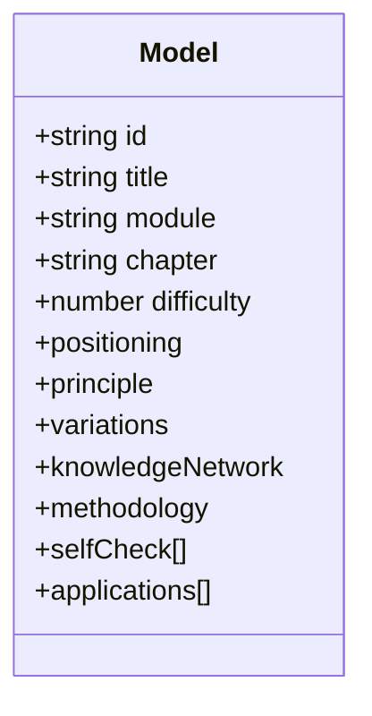
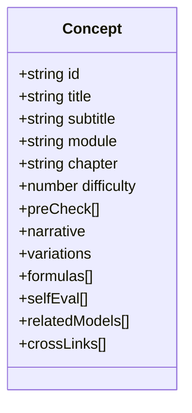
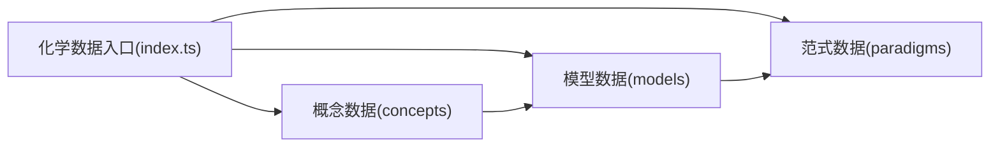

# 化学解题套路

<cite>
**本文引用的文件**
- [src/data/chemistry/paradigms.ts](file://src/data/chemistry/paradigms.ts)
- [src/data/chemistry/index.ts](file://src/data/chemistry/index.ts)
- [scripts/gen-chemistry-models.js](file://scripts/gen-chemistry-models.js)
- [src/data/chemistry/models/M01_物质分类树模型.ts](file://src/data/chemistry/models/M01_物质分类树模型.ts)
- [src/data/chemistry/models/M02_摩尔计算模型.ts](file://src/data/chemistry/models/M02_摩尔计算模型.ts)
- [src/data/chemistry/models/M03_离子方程式书写模型.ts](file://src/data/chemistry/models/M03_离子方程式书写模型.ts)
- [src/data/chemistry/models/M04_离子共存分析模型.ts](file://src/data/chemistry/models/M04_离子共存分析模型.ts)
- [src/data/chemistry/concepts/C01_物质的分类.ts](file://src/data/chemistry/concepts/C01_物质的分类.ts)
- [src/data/chemistry/concepts/C02_分散系与胶体.ts](file://src/data/chemistry/concepts/C02_分散系与胶体.ts)
- [src/data/chemistry/concepts/C03_物质的量.ts](file://src/data/chemistry/concepts/C03_物质的量.ts)
- [src/data/chemistry/concepts/C04_气体摩尔体积.ts](file://src/data/chemistry/concepts/C04_气体摩尔体积.ts)
</cite>

## 目录
1. [引言](#引言)
2. [项目结构](#项目结构)
3. [核心组件](#核心组件)
4. [架构总览](#架构总览)
5. [详细组件分析](#详细组件分析)
6. [依赖分析](#依赖分析)
7. [性能考虑](#性能考虑)
8. [故障排查指南](#故障排查指南)
9. [结论](#结论)
10. [附录](#附录)

## 引言
本文件面向“星耀平台”的化学学科，系统化梳理并呈现面向高考与强基的“R层解题套路”体系。依据项目现有数据骨架与脚本，我们将：
- 解释“R层解题套路”的分类体系与应用策略，覆盖化学计算、实验设计、反应机理、物质推断、平衡计算、电化学计算、有机合成、实验分析等核心方向；
- 明确每类套路的适用题型、解题步骤、关键技巧与易错点；
- 解析套路与核心模型的对应关系，以及如何通过套路训练提升解题效率与准确率；
- 说明套路的递进关系与组合使用策略（一题多解、一法多用）；
- 提供具体示例与思维过程展示路径，帮助学生建立系统化的解题方法论。

## 项目结构
化学数据采用“主题域 + 知识节点 + 模型 + 范式 + 题库”的分层组织：
- 主题域（Module）：物质的分类与计量、离子反应与氧化还原、物质结构与元素周期律、化学反应原理、无机元素化学、有机化学、电化学、化学实验基础；
- 知识节点（Concept）：以C01~C57编号，承载“情境—困惑—实验—概念—推导—迁移”的六段式叙事；
- 核心模型（Model）：以M01~M48编号，承载“定位—本质—要点—方法—变式—应用”的七模块内容；
- 分析范式（Paradigm）：以CHE-R01~CHE-R70编号，承载“触发—路径—变式预警—错误映射—本质回溯”的范式结构；
- 题库与过滤：提供难度、目标、功能、题型等多维过滤选项，支撑练习与诊断。

图示来源
- [src/data/chemistry/index.ts:22-93](file://src/data/chemistry/index.ts#L22-L93)
- [src/data/chemistry/concepts/C01_物质的分类.ts:1-42](file://src/data/chemistry/concepts/C01_物质的分类.ts#L1-L42)
- [src/data/chemistry/concepts/C02_分散系与胶体.ts:1-42](file://src/data/chemistry/concepts/C02_分散系与胶体.ts#L1-L42)
- [src/data/chemistry/concepts/C03_物质的量.ts:1-42](file://src/data/chemistry/concepts/C03_物质的量.ts#L1-L42)
- [src/data/chemistry/concepts/C04_气体摩尔体积.ts:1-42](file://src/data/chemistry/concepts/C04_气体摩尔体积.ts#L1-L42)
- [src/data/chemistry/models/M01_物质分类树模型.ts:1-50](file://src/data/chemistry/models/M01_物质分类树模型.ts#L1-L50)
- [src/data/chemistry/models/M02_摩尔计算模型.ts:1-50](file://src/data/chemistry/models/M02_摩尔计算模型.ts#L1-L50)
- [src/data/chemistry/models/M03_离子方程式书写模型.ts:1-50](file://src/data/chemistry/models/M03_离子方程式书写模型.ts#L1-L50)
- [src/data/chemistry/models/M04_离子共存分析模型.ts:1-50](file://src/data/chemistry/models/M04_离子共存分析模型.ts#L1-L50)
- [src/data/chemistry/paradigms.ts:1-25](file://src/data/chemistry/paradigms.ts#L1-L25)

章节来源
- [src/data/chemistry/index.ts:22-93](file://src/data/chemistry/index.ts#L22-L93)

## 核心组件
- 分析范式（Paradigm）：定义了“触发信号、思考路径、变式预警、错误映射、本质回溯”等要素，是R层套路的抽象模型。当前为占位数组，待AI填充。
- 核心模型（Model）：以M01~M48覆盖九大学块，每个模型包含定位、本质、要点、方法、变式、知识网络、自测、应用等七模块内容，是套路的具体载体。
- 知识节点（Concept）：以C01~C57覆盖基础知识点，承载前置检测、叙事、变式、公式、自评与跨链接，支撑模型学习与迁移。
- 主题域（Module）：将知识点与模型按模块组织，便于教学与练习的模块化推进。

章节来源
- [src/data/chemistry/paradigms.ts:6-25](file://src/data/chemistry/paradigms.ts#L6-L25)
- [src/data/chemistry/models/M01_物质分类树模型.ts:1-50](file://src/data/chemistry/models/M01_物质分类树模型.ts#L1-L50)
- [src/data/chemistry/concepts/C01_物质的分类.ts:1-42](file://src/data/chemistry/concepts/C01_物质的分类.ts#L1-L42)
- [src/data/chemistry/index.ts:22-93](file://src/data/chemistry/index.ts#L22-L93)

## 架构总览
化学R层解题套路的运行与展示路径如下：
- 数据入口注册：通过注册函数将化学学科的数据暴露给前端页面与工具；
- 模块化加载：按模块聚合知识节点与模型，支持按模块检索与导航；
- 范式与模型联动：范式作为“套路模板”，模型作为“具体套路”，二者通过编号与关系耦合；
- 练习与诊断：基于题库过滤选项与模型统计，形成“模型—题型—难度”的练习闭环。

图示来源
- [src/data/chemistry/index.ts:135-183](file://src/data/chemistry/index.ts#L135-L183)
- [src/data/chemistry/paradigms.ts:23-24](file://src/data/chemistry/paradigms.ts#L23-L24)

章节来源
- [src/data/chemistry/index.ts:135-183](file://src/data/chemistry/index.ts#L135-L183)

## 详细组件分析

### 分析范式（CHE-R系列）——R层套路的抽象模板
- 结构要点
  - 编号规则：CHE-R01~CHE-R70；
  - 思维维度：7个思维方法维度（范式接口中定义）；
  - 难度层级：B（知识掌握）、J（思维运用）、T（迁移创新）；
  - 关键字段：触发信号、思考路径（3-7步）、变式预警、错误映射（错误类型、认知根源、正确路径）、本质回溯。
- 应用策略
  - 触发信号：识别题干关键词或情境，激活对应范式；
  - 思考路径：按步骤拆解问题，避免跳跃；
  - 变式预警：提前识别易错陷阱与常见变式；
  - 错误映射：对症下药，纠正认知偏差；
  - 本质回溯：回到原理与模型，确保理解深度。

图示来源
- [src/data/chemistry/paradigms.ts:6-21](file://src/data/chemistry/paradigms.ts#L6-L21)

章节来源
- [src/data/chemistry/paradigms.ts:1-25](file://src/data/chemistry/paradigms.ts#L1-L25)

### 核心模型（M01~M48）——R层套路的具体实现
- 结构要点
  - 定位（positioning）：核心、本质、关键洞察；
  - 原理（principle）：模型所依循的化学原理；
  - 变式（variations）：基础、进阶、挑战三个层级；
  - 知识网络（knowledgeNetwork）：父子关系、相关关系、核心公式；
  - 方法论（methodology）：解题思路、决策树、技巧、常见误区；
  - 自测（selfCheck）：配套小测；
  - 应用（applications）：典型应用场景。
- 与主题域的对应
  - 物质分类与计量：M01（物质分类树模型）、M02（摩尔计算模型）；
  - 离子反应与氧化还原：M03（离子方程式书写模型）、M04（离子共存分析模型）；
  - 物质结构与元素周期律：M07~M10（原子结构、周期表、分子结构、晶体结构）；
  - 化学反应原理：M11~M17（热化学、平衡、电离、沉淀、速率、pH）；
  - 无机元素化学：M18~M25（Na、Al、Fe、Cu、Cl、S/N、工业流程、新材料、过氧化钠）；
  - 有机化学：M26~M37（同分异构、烃反应、芳香烃、卤代烃、醇酚、醛、羧酸酯、推断与合成、高分子、生物大分子）；
  - 电化学：M38~M41（原电池、新型电池、电解池、电化学计算）；
  - 化学实验基础：M42~M48（分离提纯、气体制备、检验鉴别、定量滴定、实验设计、误差分析、综合评价）。

图示来源
- [src/data/chemistry/models/M01_物质分类树模型.ts:4-49](file://src/data/chemistry/models/M01_物质分类树模型.ts#L4-L49)
- [src/data/chemistry/models/M02_摩尔计算模型.ts:4-49](file://src/data/chemistry/models/M02_摩尔计算模型.ts#L4-L49)
- [src/data/chemistry/models/M03_离子方程式书写模型.ts:4-49](file://src/data/chemistry/models/M03_离子方程式书写模型.ts#L4-L49)
- [src/data/chemistry/models/M04_离子共存分析模型.ts:4-49](file://src/data/chemistry/models/M04_离子共存分析模型.ts#L4-L49)

章节来源
- [scripts/gen-chemistry-models.js:9-68](file://scripts/gen-chemistry-models.js#L9-L68)
- [src/data/chemistry/models/M01_物质分类树模型.ts:1-50](file://src/data/chemistry/models/M01_物质分类树模型.ts#L1-L50)
- [src/data/chemistry/models/M02_摩尔计算模型.ts:1-50](file://src/data/chemistry/models/M02_摩尔计算模型.ts#L1-L50)
- [src/data/chemistry/models/M03_离子方程式书写模型.ts:1-50](file://src/data/chemistry/models/M03_离子方程式书写模型.ts#L1-L50)
- [src/data/chemistry/models/M04_离子共存分析模型.ts:1-50](file://src/data/chemistry/models/M04_离子共存分析模型.ts#L1-L50)

### 知识节点（C01~C57）——支撑模型学习的基础素材
- 结构要点
  - 前置检测（preCheck）：评估先决知识；
  - 叙事（narrative）：情境—困惑—实验—概念—推导—迁移；
  - 变式（variations）：基础、进阶、挑战；
  - 公式（formulas）：核心公式与用法；
  - 自我评估（selfEval）：能力水平与描述；
  - 相关模型（relatedModels）、交叉链接（crossLinks）。
- 与模型的关系
  - 知识节点为模型提供背景与支撑，模型为知识节点提供方法论与迁移路径。

图示来源
- [src/data/chemistry/concepts/C01_物质的分类.ts:4-41](file://src/data/chemistry/concepts/C01_物质的分类.ts#L4-L41)
- [src/data/chemistry/concepts/C02_分散系与胶体.ts:4-41](file://src/data/chemistry/concepts/C02_分散系与胶体.ts#L4-L41)
- [src/data/chemistry/concepts/C03_物质的量.ts:4-41](file://src/data/chemistry/concepts/C03_物质的量.ts#L4-L41)
- [src/data/chemistry/concepts/C04_气体摩尔体积.ts:4-41](file://src/data/chemistry/concepts/C04_气体摩尔体积.ts#L4-L41)

章节来源
- [src/data/chemistry/concepts/C01_物质的分类.ts:1-42](file://src/data/chemistry/concepts/C01_物质的分类.ts#L1-L42)
- [src/data/chemistry/concepts/C02_分散系与胶体.ts:1-42](file://src/data/chemistry/concepts/C02_分散系与胶体.ts#L1-L42)
- [src/data/chemistry/concepts/C03_物质的量.ts:1-42](file://src/data/chemistry/concepts/C03_物质的量.ts#L1-L42)
- [src/data/chemistry/concepts/C04_气体摩尔体积.ts:1-42](file://src/data/chemistry/concepts/C04_气体摩尔体积.ts#L1-L42)

### 主题域（Module）与模块化组织
- 模块划分：物质的分类与计量、离子反应与氧化还原、物质结构与元素周期律、化学反应原理、无机元素化学、有机化学、电化学、化学实验基础；
- 模块到模型/知识点的映射：通过模块聚合，支持按模块检索与导航，便于教学与练习的模块化推进。

章节来源
- [src/data/chemistry/index.ts:22-93](file://src/data/chemistry/index.ts#L22-L93)

## 依赖分析
- 组件耦合
  - 化学数据入口依赖：概念数据映射、模型数据映射、范式列表、公式与题库；
  - 模型与范式：模型通过编号与范式关联，范式为模型提供“套路模板”；
  - 知识节点与模型：知识节点为模型提供背景与支撑，模型为知识节点提供方法论。
- 外部依赖
  - 注册机制：通过注册函数将学科数据暴露给前端；
  - 过滤与统计：提供难度、目标、功能、题型等多维过滤选项，支撑练习与诊断。

图示来源
- [src/data/chemistry/index.ts:135-183](file://src/data/chemistry/index.ts#L135-L183)
- [src/data/chemistry/paradigms.ts:23-24](file://src/data/chemistry/paradigms.ts#L23-L24)

章节来源
- [src/data/chemistry/index.ts:135-183](file://src/data/chemistry/index.ts#L135-L183)

## 性能考虑
- 数据加载
  - 采用映射表（Map）缓存范式与模型，减少重复查询开销；
  - 模块化加载，按需渲染，降低首屏压力。
- 计算复杂度
  - 范式匹配与模型检索为O(1)查找；
  - 知识节点与模型的层级关系为树形结构，查询复杂度与深度成正比。
- 优化建议
  - 将常用范式与模型进行预热；
  - 对题库过滤采用索引与缓存策略；
  - 在移动端采用懒加载与虚拟滚动。

## 故障排查指南
- 症状：范式列表为空
  - 检查范式数据是否正确导入与导出；
  - 确认注册函数是否正确调用。
- 症状：模型无法显示
  - 检查模型文件是否生成并导出；
  - 确认模块映射与颜色配置是否正确。
- 症状：知识节点与模型不匹配
  - 检查模块归属与编号一致性；
  - 核对relatedModels与crossLinks的引用。

章节来源
- [src/data/chemistry/paradigms.ts:23-24](file://src/data/chemistry/paradigms.ts#L23-L24)
- [src/data/chemistry/index.ts:135-183](file://src/data/chemistry/index.ts#L135-L183)

## 结论
星耀平台的化学R层解题套路以“范式—模型—知识—模块”的分层架构为基础，通过系统化的套路模板与模型实现，为学生提供可迁移、可组合、可诊断的解题方法论。结合题库与过滤选项，可形成“模型—题型—难度”的练习闭环，助力学生在高考与强基中稳定提升解题效率与准确率。

## 附录
- 生成模型骨架的脚本：scripts/gen-chemistry-models.js
- 化学数据入口：src/data/chemistry/index.ts
- 分析范式接口：src/data/chemistry/paradigms.ts
- 示例模型文件：M01、M02、M03、M04
- 示例知识节点：C01、C02、C03、C04