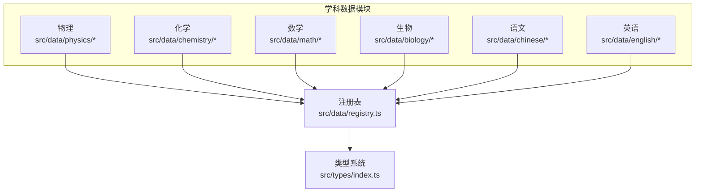
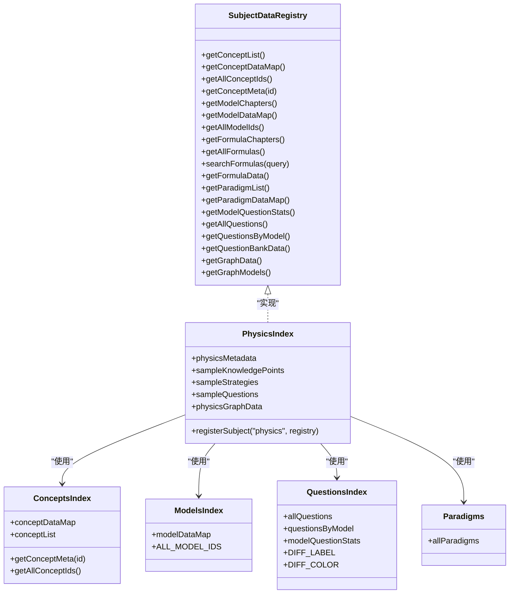
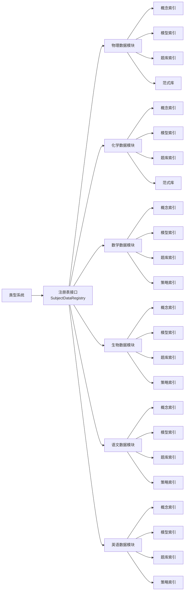

# 学科知识体系

<cite>
**本文引用的文件**
- [src/data/physics/index.ts](file://src/data/physics/index.ts)
- [src/data/physics/concepts/index.ts](file://src/data/physics/concepts/index.ts)
- [src/data/physics/models/index.ts](file://src/data/physics/models/index.ts)
- [src/data/physics/questions/index.ts](file://src/data/physics/questions/index.ts)
- [src/data/physics/paradigms.ts](file://src/data/physics/paradigms.ts)
- [src/data/chemistry/index.ts](file://src/data/chemistry/index.ts)
- [src/data/math/index.ts](file://src/data/math/index.ts)
- [src/data/biology/index.ts](file://src/data/biology/index.ts)
- [src/data/chinese/index.ts](file://src/data/chinese/index.ts)
- [src/data/english/index.ts](file://src/data/english/index.ts)
- [src/data/registry.ts](file://src/data/registry.ts)
- [src/types/index.ts](file://src/types/index.ts)
</cite>

## 目录
1. [简介](#简介)
2. [项目结构](#项目结构)
3. [核心组件](#核心组件)
4. [架构总览](#架构总览)
5. [详细组件分析](#详细组件分析)
6. [依赖分析](#依赖分析)
7. [性能考量](#性能考量)
8. [故障排查指南](#故障排查指南)
9. [结论](#结论)
10. [附录](#附录)

## 简介
本文件面向“星耀平台”的学科知识体系，系统化阐述物理、化学、数学、生物、语文、英语六大学科的知识组织结构与实现方式。文档聚焦以下三层知识模型：
- K 层知识节点：以知识点为核心，承载原理、网络、方法论与生活应用。
- M 层核心模型：以模型为载体，沉淀典型问题范式与解题路径。
- R 层解题套路：以分析范式为工具，形成可迁移的思维方法与错因图谱。
- P 层练习题库：以题型与难度为维度，提供筛选、统计与评测能力。

同时，文档给出学科特有的学习方法、思维模式与实践指导，并总结扩展机制与维护流程，展示如何通过模块化设计实现学科知识的系统化呈现。

## 项目结构
平台采用“学科数据模块 + 注册表 + 统一类型”的分层组织方式：
- 每个学科在 src/data/<subject>/ 下提供 concepts、models、questions、paradigms 等子模块，统一通过 registerSubject 注册到全局注册表。
- 类型系统在 src/types/index.ts 中集中定义，确保各学科数据结构一致、可扩展。
- 顶层注册表 src/data/registry.ts 定义 SubjectDataRegistry 接口，规范各学科数据访问能力。



图表来源
- [src/data/registry.ts:1-48](file://src/data/registry.ts#L1-L48)
- [src/types/index.ts:1-209](file://src/types/index.ts#L1-L209)

章节来源
- [src/data/registry.ts:1-48](file://src/data/registry.ts#L1-L48)
- [src/types/index.ts:1-209](file://src/types/index.ts#L1-L209)

## 核心组件
- 学科元数据与模块划分：各学科 index.ts 定义学科元信息（id、名称、颜色、模块与章节映射），并导出样例知识节点、策略与题库数据，用于前端展示与交互。
- 知识节点（K 层）：concepts/index.ts 提供概念数据映射与章节列表，支持按模块/章节检索与遍历。
- 核心模型（M 层）：models/index.ts 提供模型数据映射与模型 ID 列表，支撑题库与教学模型的统一管理。
- 解题套路（R 层）：paradigms.ts 提供分析范式集合，包含触发信号、思考路径、错因图谱与本质回溯，便于学生形成可迁移的思维方法。
- 练习题库（P 层）：questions/index.ts 提供题库汇总、按模型分组与难度统计，配合筛选选项实现精准练习。
- 注册表与类型系统：registry.ts 定义 SubjectDataRegistry 接口，统一暴露学科数据访问能力；types/index.ts 定义学科、模块、章节、知识点、策略、题目、认知图谱等核心类型。

章节来源
- [src/data/physics/index.ts:1-433](file://src/data/physics/index.ts#L1-L433)
- [src/data/physics/concepts/index.ts:1-196](file://src/data/physics/concepts/index.ts#L1-L196)
- [src/data/physics/models/index.ts:1-98](file://src/data/physics/models/index.ts#L1-L98)
- [src/data/physics/questions/index.ts:1-45](file://src/data/physics/questions/index.ts#L1-L45)
- [src/data/physics/paradigms.ts:1-800](file://src/data/physics/paradigms.ts#L1-L800)
- [src/data/chemistry/index.ts:1-186](file://src/data/chemistry/index.ts#L1-L186)
- [src/data/math/index.ts:1-166](file://src/data/math/index.ts#L1-L166)
- [src/data/biology/index.ts:1-150](file://src/data/biology/index.ts#L1-L150)
- [src/data/chinese/index.ts:1-150](file://src/data/chinese/index.ts#L1-L150)
- [src/data/english/index.ts:1-150](file://src/data/english/index.ts#L1-L150)
- [src/data/registry.ts:1-48](file://src/data/registry.ts#L1-L48)
- [src/types/index.ts:1-209](file://src/types/index.ts#L1-L209)

## 架构总览
学科数据通过注册表统一对外暴露，前端页面按需调用相应学科的数据接口，实现“模块化 + 可插拔”的知识体系呈现。



图表来源
- [src/data/registry.ts:4-38](file://src/data/registry.ts#L4-L38)
- [src/data/physics/index.ts:383-431](file://src/data/physics/index.ts#L383-L431)
- [src/data/physics/concepts/index.ts:77-196](file://src/data/physics/concepts/index.ts#L77-L196)
- [src/data/physics/models/index.ts:52-98](file://src/data/physics/models/index.ts#L52-L98)
- [src/data/physics/questions/index.ts:8-45](file://src/data/physics/questions/index.ts#L8-L45)
- [src/data/physics/paradigms.ts:56-800](file://src/data/physics/paradigms.ts#L56-L800)

章节来源
- [src/data/registry.ts:1-48](file://src/data/registry.ts#L1-L48)
- [src/data/physics/index.ts:1-433](file://src/data/physics/index.ts#L1-L433)

## 详细组件分析

### 物理学科（K/M/R/P 四层体系）
- K 层知识节点
  - 数据来源：concepts/index.ts 提供概念映射与章节列表，支持按模块/章节检索与遍历。
  - 结构要点：每个知识点包含原理、知识网络（节点/边）、方法论与生活应用，便于构建认知图谱。
- M 层核心模型
  - 数据来源：models/index.ts 提供模型映射与模型 ID 列表，覆盖运动学、力学、电磁学、热学、光学、近代物理等模块。
  - 结构要点：模型与模块一一对应，便于题库与教学的统一管理。
- R 层解题套路
  - 数据来源：paradigms.ts 提供分析范式集合，包含触发信号、思考路径、错因图谱与本质回溯。
  - 结构要点：范式与模型绑定，形成“模型-范式”双层思维工具箱。
- P 层练习题库
  - 数据来源：questions/index.ts 提供题库汇总、按模型分组与难度统计，配合筛选选项实现精准练习。
  - 结构要点：支持按难度、类型、目标等维度筛选，提供题库概览与统计。

```mermaid
sequenceDiagram
    participant UI as "前端页面"
    participant REG as "注册表"
    participant PHY as "物理数据模块"
    participant CON as "概念索引"
    participant MOD as "模型索引"
    participant QUE as "题库索引"
    participant PAR as "范式库"
    UI->>REG: "请求获取物理学科数据"
    REG->>PHY: "调用 registerSubject(\"physics\", ...)"
    PHY->>CON: "getConceptList()/getConceptDataMap()"
    PHY->>MOD: "getModelChapters()/getModelDataMap()"
    PHY->>QUE: "getAllQuestions()/getQuestionsByModel()"
    PHY->>PAR: "getParadigmList()/getParadigmDataMap()"
    PHY-->>UI: "返回统一数据结构"
```

图表来源
- [src/data/physics/index.ts:383-431](file://src/data/physics/index.ts#L383-L431)
- [src/data/physics/concepts/index.ts:102-196](file://src/data/physics/concepts/index.ts#L102-L196)
- [src/data/physics/models/index.ts:52-98](file://src/data/physics/models/index.ts#L52-L98)
- [src/data/physics/questions/index.ts:8-45](file://src/data/physics/questions/index.ts#L8-L45)
- [src/data/physics/paradigms.ts:56-800](file://src/data/physics/paradigms.ts#L56-L800)

章节来源
- [src/data/physics/index.ts:1-433](file://src/data/physics/index.ts#L1-L433)
- [src/data/physics/concepts/index.ts:1-196](file://src/data/physics/concepts/index.ts#L1-L196)
- [src/data/physics/models/index.ts:1-98](file://src/data/physics/models/index.ts#L1-L98)
- [src/data/physics/questions/index.ts:1-45](file://src/data/physics/questions/index.ts#L1-L45)
- [src/data/physics/paradigms.ts:1-800](file://src/data/physics/paradigms.ts#L1-L800)

### 化学学科（K/M/R/P 四层体系）
- K 层知识节点：concepts/index.ts 提供概念映射与章节列表，支持按模块/章节检索与遍历。
- M 层核心模型：models/index.ts 提供模型映射与模型 ID 列表，覆盖物质分类与计量、离子反应与氧化还原、物质结构与元素周期律、化学反应原理、无机元素化学、有机化学、电化学、化学实验基础等模块。
- R 层解题套路：paradigms.ts 提供分析范式集合，与模型绑定，形成思维工具箱。
- P 层练习题库：questions/index.ts 提供题库汇总、按模型分组与难度统计，配合筛选选项实现精准练习。

章节来源
- [src/data/chemistry/index.ts:1-186](file://src/data/chemistry/index.ts#L1-L186)

### 数学学科（K/M/R/P 四层体系）
- K 层知识节点：concepts/index.ts 提供概念映射与章节列表，支持按模块/章节检索与遍历。
- M 层核心模型：models/index.ts 提供模型映射与模型 ID 列表，覆盖各模块主题。
- R 层解题套路：strategies/index.ts 提供策略集合，作为范式的一种形态。
- P 层练习题库：questions/index.ts 提供题库汇总、按模型分组与难度统计，配合筛选选项实现精准练习。

章节来源
- [src/data/math/index.ts:1-166](file://src/data/math/index.ts#L1-L166)

### 生物学科（K/M/R/P 四层体系）
- K 层知识节点：concepts/index.ts 提供概念映射与章节列表，支持按模块/章节检索与遍历。
- M 层核心模型：models/index.ts 提供模型映射与模型 ID 列表，覆盖各章节主题。
- R 层解题套路：strategies/index.ts 提供策略集合，作为范式的一种形态。
- P 层练习题库：questions/index.ts 提供题库汇总、按模型分组与难度统计，配合筛选选项实现精准练习。

章节来源
- [src/data/biology/index.ts:1-150](file://src/data/biology/index.ts#L1-L150)

### 语文学科（K/M/R/P 四层体系）
- K 层知识节点：concepts/index.ts 提供概念映射与章节列表，支持按模块/章节检索与遍历。
- M 层核心模型：models/index.ts 提供模型映射与模型 ID 列表，覆盖各章节主题。
- R 层解题套路：strategies/index.ts 提供策略集合，作为范式的一种形态。
- P 层练习题库：questions/index.ts 提供题库汇总、按模型分组与难度统计，配合筛选选项实现精准练习。

章节来源
- [src/data/chinese/index.ts:1-150](file://src/data/chinese/index.ts#L1-L150)

### 英语学科（K/M/R/P 四层体系）
- K 层知识节点：concepts/index.ts 提供概念映射与章节列表，支持按模块/章节检索与遍历。
- M 层核心模型：models/index.ts 提供模型映射与模型 ID 列表，覆盖各章节主题。
- R 层解题套路：strategies/index.ts 提供策略集合，作为范式的一种形态。
- P 层练习题库：questions/index.ts 提供题库汇总、按模型分组与难度统计，配合筛选选项实现精准练习。

章节来源
- [src/data/english/index.ts:1-150](file://src/data/english/index.ts#L1-L150)

### 概念与数据模型
- 学科、模块、章节、知识点、策略、题目、认知图谱等核心类型在 types/index.ts 中统一定义，确保各学科数据结构一致、可扩展。
- 知识点包含原理、知识网络（节点/边）、方法论与生活应用，便于构建认知图谱。
- 策略包含适用类型、难度、核心思想、步骤、技巧、常见错误与关联知识/策略。
- 题目包含类型、难度、内容、选项、答案、解释、提示、来源、年份与标签等字段。

章节来源
- [src/types/index.ts:1-209](file://src/types/index.ts#L1-L209)

## 依赖分析
- 学科数据模块依赖注册表接口，统一暴露数据访问能力。
- 各学科内部模块之间存在清晰的依赖关系：index.ts 依赖 concepts、models、questions、paradigms 等子模块。
- 类型系统为所有学科提供统一的数据契约，保证跨学科的一致性与可扩展性。



图表来源
- [src/data/registry.ts:4-38](file://src/data/registry.ts#L4-L38)
- [src/data/physics/index.ts:383-431](file://src/data/physics/index.ts#L383-L431)
- [src/data/chemistry/index.ts:135-183](file://src/data/chemistry/index.ts#L135-L183)
- [src/data/math/index.ts:126-151](file://src/data/math/index.ts#L126-L151)
- [src/data/biology/index.ts:125-150](file://src/data/biology/index.ts#L125-L150)
- [src/data/chinese/index.ts:125-150](file://src/data/chinese/index.ts#L125-L150)
- [src/data/english/index.ts:125-150](file://src/data/english/index.ts#L125-L150)
- [src/types/index.ts:1-209](file://src/types/index.ts#L1-L209)

章节来源
- [src/data/registry.ts:1-48](file://src/data/registry.ts#L1-L48)
- [src/types/index.ts:1-209](file://src/types/index.ts#L1-L209)

## 性能考量
- 模块化加载：各学科数据模块独立导出，前端可按需加载，减少初始包体。
- 数据映射优化：通过 Map 结构存储概念与模型映射，提升查找效率。
- 统一类型系统：类型定义集中管理，减少跨模块类型不一致带来的运行时开销。
- 题库统计：按模型分组与难度统计，便于前端快速渲染与筛选，降低渲染压力。

## 故障排查指南
- 数据缺失或为空
  - 现象：学科数据为空或部分字段缺失。
  - 排查：检查各学科 index.ts 是否正确导入并导出数据；确认 concepts、models、questions、paradigms 等子模块是否存在。
- 注册失败
  - 现象：registerSubject 调用后无法通过 getSubjectData 获取数据。
  - 排查：确认 registerSubject 调用参数与学科标识一致；检查返回的对象是否实现了 SubjectDataRegistry 接口。
- 类型不匹配
  - 现象：前端编译或运行时报类型错误。
  - 排查：核对 types/index.ts 中的类型定义与实际数据结构是否一致；确保新增字段在类型系统中同步更新。
- 题库统计异常
  - 现象：题库统计不准确或为空。
  - 排查：检查 questions/index.ts 中的统计逻辑与数据来源；确认题目难度与模型 ID 的映射关系。

章节来源
- [src/data/registry.ts:42-48](file://src/data/registry.ts#L42-L48)
- [src/data/physics/index.ts:383-431](file://src/data/physics/index.ts#L383-L431)
- [src/data/physics/questions/index.ts:20-37](file://src/data/physics/questions/index.ts#L20-L37)

## 结论
星耀平台通过“K/M/R/P 四层知识体系 + 模块化数据组织 + 统一类型系统 + 注册表接口”，实现了物理、化学、数学、生物、语文、英语六大学科的系统化知识呈现。该架构具备良好的扩展性与可维护性，能够支撑持续的内容沉淀与教学实践迭代。

## 附录
- 学科扩展建议
  - 新增学科：参照现有学科 index.ts 结构，实现 SubjectDataRegistry 接口并通过 registerSubject 注册。
  - 新增知识点/模型/题型：在对应学科的 concepts、models、questions 目录下添加新条目，并在 index.ts 中导出。
  - 新增范式：在 paradigms.ts 中新增分析范式，确保与模型绑定并完善触发信号、思考路径与错因图谱。
- 维护流程
  - 数据校验：定期校验概念、模型、题库与范式的完整性与一致性。
  - 类型演进：新增字段时同步更新 types/index.ts，并在各学科 index.ts 中适配。
  - 性能监控：关注模块加载与渲染性能，必要时引入懒加载与缓存策略。