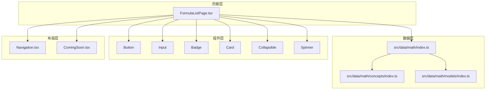
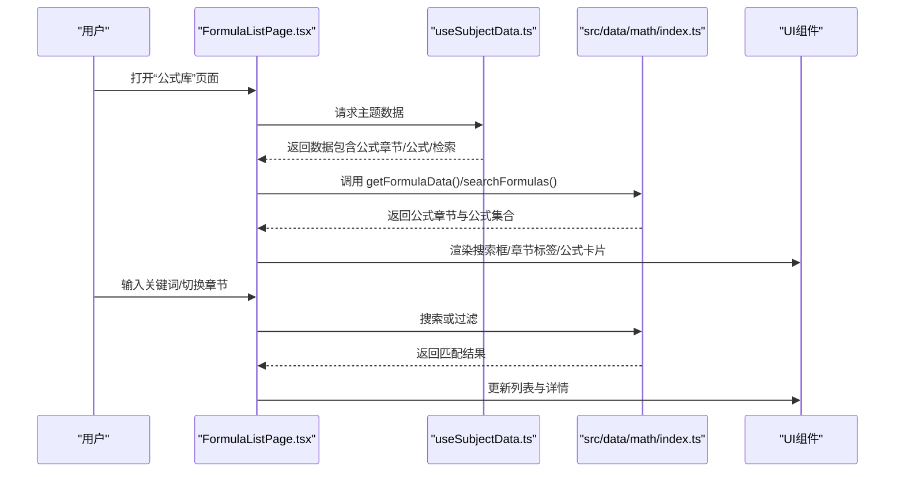
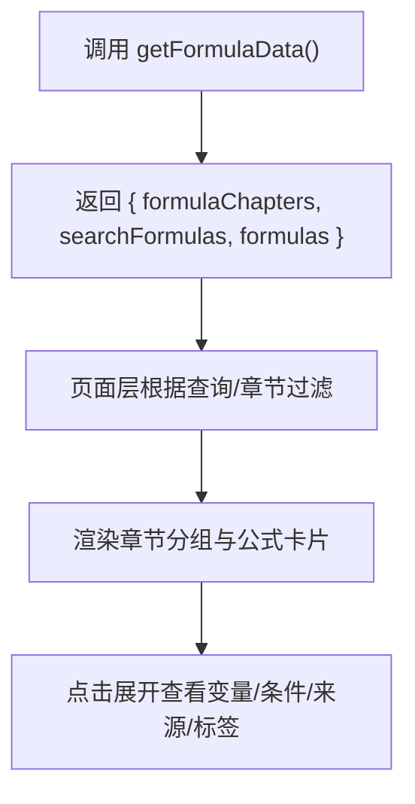
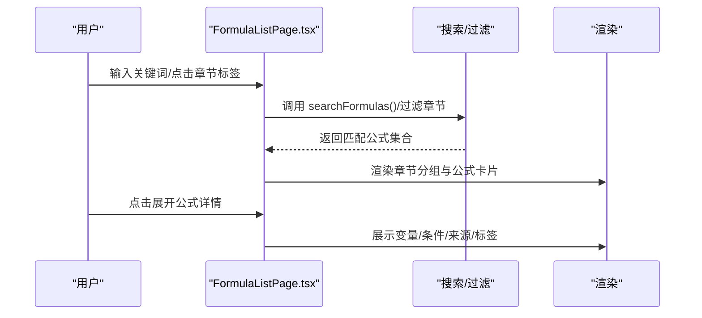
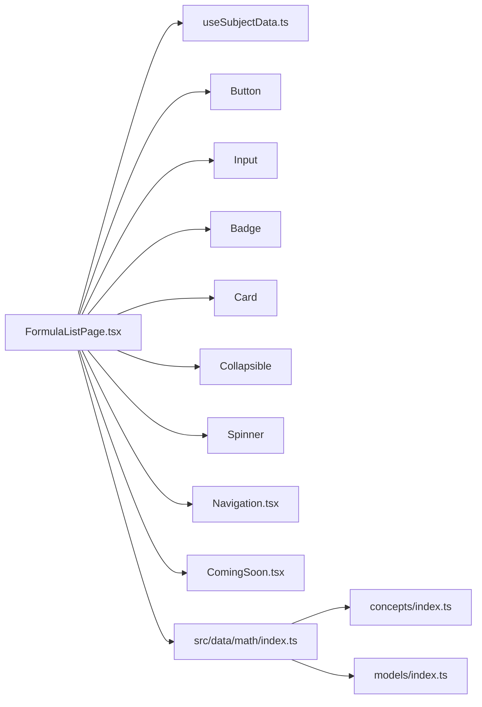

# 数学公式章节

<cite>
**本文引用的文件**
- [src/data/math/index.ts](file://src/data/math/index.ts)
- [src/sections/FormulaListPage.tsx](file://src/sections/FormulaListPage.tsx)
- [src/data/math/concepts/index.ts](file://src/data/math/concepts/index.ts)
- [src/data/math/models/index.ts](file://src/data/math/models/index.ts)
- [src/hooks/useSubjectData.ts](file://src/hooks/useSubjectData.ts)
- [src/components/layout/Navigation.tsx](file://src/components/layout/Navigation.tsx)
- [src/components/ui/button.tsx](file://src/components/ui/button.tsx)
- [src/components/ui/input.tsx](file://src/components/ui/input.tsx)
- [src/components/ui/badge.tsx](file://src/components/ui/badge.tsx)
- [src/components/ui/card.tsx](file://src/components/ui/card.tsx)
- [src/components/ui/collapsible.tsx](file://src/components/ui/collapsible.tsx)
- [src/components/ui/spinner.tsx](file://src/components/ui/spinner.tsx)
- [src/components/ComingSoon.tsx](file://src/components/ComingSoon.tsx)
</cite>

## 目录
1. [简介](#简介)
2. [项目结构](#项目结构)
3. [核心组件](#核心组件)
4. [架构总览](#架构总览)
5. [详细组件分析](#详细组件分析)
6. [依赖分析](#依赖分析)
7. [性能考虑](#性能考虑)
8. [故障排查指南](#故障排查指南)
9. [结论](#结论)
10. [附录](#附录)

## 简介
本文件系统化梳理星耀平台数学学科“公式章节”的组织结构与管理机制，覆盖公式分类体系、索引与检索能力、与知识节点和核心模型的关联关系，并给出公式呈现方式、记忆方法与应用技巧建议。同时提供使用指南，帮助学生快速定位公式、理解适用条件与变形形式，并通过公式体系支撑完整的数学知识网络。

## 项目结构
数学公式章节由“数据层（数学学科数据聚合）+ 页面层（公式列表页）+ UI 组件层（通用 UI 组件）+ 布局层（导航与布局）”构成。数据层负责公式章节、公式集合与检索接口的暴露；页面层负责渲染与交互；UI 组件层提供可复用的按钮、输入框、徽章、卡片、折叠面板等；布局层提供统一导航与页面容器。

图表来源
- [src/sections/FormulaListPage.tsx:1-261](file://src/sections/FormulaListPage.tsx#L1-L261)
- [src/data/math/index.ts:1-166](file://src/data/math/index.ts#L1-L166)
- [src/data/math/concepts/index.ts:1-119](file://src/data/math/concepts/index.ts#L1-L119)
- [src/data/math/models/index.ts:1-56](file://src/data/math/models/index.ts#L1-L56)

章节来源
- [src/sections/FormulaListPage.tsx:1-261](file://src/sections/FormulaListPage.tsx#L1-L261)
- [src/data/math/index.ts:1-166](file://src/data/math/index.ts#L1-L166)

## 核心组件
- 数据聚合与导出：数学学科数据入口，提供公式章节、公式集合、公式检索等接口，并注册到全局主题数据注册表。
- 公式列表页：提供搜索、按章节过滤、折叠展开查看变量说明、适用条件、来源知识节点与标签等功能。
- UI 组件：按钮、输入框、徽章、卡片、折叠面板、加载指示器等，用于构建公式卡片与交互体验。
- 布局与占位：统一导航布局与“即将上线”占位组件，保证页面一致性与可用性。

章节来源
- [src/data/math/index.ts:58-64](file://src/data/math/index.ts#L58-L64)
- [src/sections/FormulaListPage.tsx:20-39](file://src/sections/FormulaListPage.tsx#L20-L39)

## 架构总览
公式章节的前端架构遵循“页面组件调用主题数据钩子 -> 从数学数据入口获取公式数据 -> 渲染 UI 组件”的模式。数据入口将公式章节、公式集合与检索函数统一暴露，页面层负责搜索与分组展示。

图表来源
- [src/sections/FormulaListPage.tsx:20-97](file://src/sections/FormulaListPage.tsx#L20-L97)
- [src/data/math/index.ts:58-64](file://src/data/math/index.ts#L58-L64)
- [src/hooks/useSubjectData.ts](file://src/hooks/useSubjectData.ts)

## 详细组件分析

### 数据层：数学公式数据聚合与导出
- 功能职责
  - 暴露公式章节数组、公式集合与检索函数，供页面层直接消费。
  - 注册数学学科数据入口，统一对外提供概念、模型、公式、题目等能力。
- 关键接口
  - 获取公式数据：返回公式章节、公式集合与检索函数。
  - 搜索公式：基于关键词匹配公式名称、LaTeX 内容或变量名。
  - 获取公式章节：返回章节级结构，便于页面按章节分组展示。
- 设计要点
  - 将公式章节与公式集合解耦，分别提供查询与过滤能力。
  - 通过注册表集中暴露，便于主题切换与扩展。

图表来源
- [src/data/math/index.ts:58-64](file://src/data/math/index.ts#L58-L64)
- [src/sections/FormulaListPage.tsx:40-56](file://src/sections/FormulaListPage.tsx#L40-L56)

章节来源
- [src/data/math/index.ts:58-64](file://src/data/math/index.ts#L58-L64)
- [src/data/math/index.ts:126-151](file://src/data/math/index.ts#L126-L151)

### 页面层：公式列表页（FormulaListPage）
- 功能职责
  - 提供搜索框，支持按名称、LaTeX 内容、变量名检索。
  - 提供章节标签切换，按章节过滤显示。
  - 使用折叠面板展示每个公式，展开后显示变量说明、适用条件、来源知识节点与标签。
  - 使用 KaTeX 渲染公式与变量符号，确保排版质量。
- 交互流程
  - 加载阶段：显示加载指示器。
  - 数据就绪：渲染章节标签、搜索框与公式卡片。
  - 用户输入：实时更新搜索结果。
  - 章节切换：仅显示目标章节下的公式。
  - 展开详情：查看变量、条件、来源与标签。

图表来源
- [src/sections/FormulaListPage.tsx:20-97](file://src/sections/FormulaListPage.tsx#L20-L97)
- [src/sections/FormulaListPage.tsx:115-238](file://src/sections/FormulaListPage.tsx#L115-L238)

章节来源
- [src/sections/FormulaListPage.tsx:20-97](file://src/sections/FormulaListPage.tsx#L20-L97)
- [src/sections/FormulaListPage.tsx:115-238](file://src/sections/FormulaListPage.tsx#L115-L238)

### UI 组件与布局
- 组件使用
  - 按钮：用于折叠/展开、章节切换。
  - 输入框：用于搜索关键词。
  - 徽章：用于标签与章节标识。
  - 卡片：承载单个公式条目。
  - 折叠面板：展开/收起公式详情。
  - 加载指示器：数据加载时提示。
- 布局
  - 统一导航布局，页面居中展示，最大宽度约束。
  - “即将上线”占位组件用于未就绪场景。

章节来源
- [src/sections/FormulaListPage.tsx:4-18](file://src/sections/FormulaListPage.tsx#L4-L18)
- [src/components/layout/Navigation.tsx](file://src/components/layout/Navigation.tsx)
- [src/components/ComingSoon.tsx](file://src/components/ComingSoon.tsx)

### 与知识节点与核心模型的关联
- 知识节点关联
  - 公式来源知识节点字段用于链接到具体的知识节点页面，便于回溯知识点。
- 核心模型关联
  - 公式与模型模块（如函数、三角、数列、几何、解析几何、概率统计、集合与逻辑、复数）保持一致的模块划分，便于按模块检索与学习路径串联。
- 关联意义
  - 通过“来源知识节点”与“模块分类”，形成“公式—模型—概念”的知识闭环，支撑从概念到模型再到公式的学习路径。

章节来源
- [src/data/math/concepts/index.ts:109-119](file://src/data/math/concepts/index.ts#L109-L119)
- [src/data/math/models/index.ts:39-48](file://src/data/math/models/index.ts#L39-L48)
- [src/sections/FormulaListPage.tsx:209-219](file://src/sections/FormulaListPage.tsx#L209-L219)

## 依赖分析
- 页面层依赖
  - 主题数据钩子：useSubjectData，用于获取数学学科数据。
  - UI 组件：按钮、输入框、徽章、卡片、折叠面板、加载指示器。
  - 布局组件：导航与“即将上线”占位。
- 数据层依赖
  - 数学概念与模型数据作为上下文，支撑公式来源与模块映射。
- 外部依赖
  - KaTeX：用于公式与变量符号的高质量渲染。

图表来源
- [src/sections/FormulaListPage.tsx:1-261](file://src/sections/FormulaListPage.tsx#L1-L261)
- [src/data/math/index.ts:1-166](file://src/data/math/index.ts#L1-L166)
- [src/data/math/concepts/index.ts:1-119](file://src/data/math/concepts/index.ts#L1-L119)
- [src/data/math/models/index.ts:1-56](file://src/data/math/models/index.ts#L1-L56)

章节来源
- [src/sections/FormulaListPage.tsx:1-261](file://src/sections/FormulaListPage.tsx#L1-L261)
- [src/data/math/index.ts:1-166](file://src/data/math/index.ts#L1-L166)

## 性能考虑
- 列表渲染优化
  - 使用分组与按章节过滤减少一次性渲染量，提升滚动性能。
- 搜索性能
  - 建议在数据层对公式名称、LaTeX 内容与变量名建立索引，避免每次渲染时进行全量字符串匹配。
- 渲染成本
  - KaTeX 渲染公式与变量符号会带来一定开销，建议在展开时再渲染详情，或对频繁切换的公式做缓存。
- 数据加载
  - 在数据未就绪时显示加载指示器，避免空白页面带来的感知延迟。

## 故障排查指南
- 页面空白或未显示数据
  - 检查主题数据钩子是否正确返回数据；确认数学数据入口已注册。
- 搜索无结果
  - 确认检索关键词是否包含公式名称、LaTeX 内容或变量名；检查检索函数是否被正确调用。
- 公式渲染异常
  - 检查 KaTeX 渲染参数与公式字符串格式；确认渲染时机（建议在展开时触发）。
- 章节过滤无效
  - 确认章节标签与公式章节名称一致；检查过滤逻辑是否正确应用。

章节来源
- [src/sections/FormulaListPage.tsx:25-39](file://src/sections/FormulaListPage.tsx#L25-L39)
- [src/sections/FormulaListPage.tsx:44-46](file://src/sections/FormulaListPage.tsx#L44-L46)
- [src/sections/FormulaListPage.tsx:135-141](file://src/sections/FormulaListPage.tsx#L135-L141)

## 结论
数学公式章节以“数据聚合 + 页面渲染 + UI 组件 + 布局”分层设计，实现了按章节分组、关键词检索、展开查看详情的能力。通过与知识节点和模型模块的关联，公式章节成为串联数学知识体系的重要纽带。建议在数据层完善索引与缓存策略，持续优化渲染性能与用户体验。

## 附录

### 使用指南：如何高效使用公式章节
- 快速查找
  - 使用顶部搜索框输入“公式名称/变量名/LaTeX 片段”进行检索。
  - 通过章节标签快速定位到目标模块（如“函数与导数”“三角与向量”等）。
- 理解适用条件与变形
  - 展开公式卡片，查看“适用条件”与“标签”，结合“来源知识节点”回看知识点。
  - 注意变量单位与取值范围，确保在正确条件下使用。
- 记忆与应用技巧
  - 将公式与典型例题、模型对应起来，建立“模型—公式—题型”的映射。
  - 对易混公式进行对比记忆，关注符号、顺序与约束条件。
- 建立知识联系
  - 通过“来源知识节点”回溯到概念页，理解公式推导背景与适用场景。
  - 结合模型模块进行系统性复习，逐步构建知识网络。

### 公式呈现与交互要点
- 排版与可读性
  - 使用 KaTeX 渲染公式与变量符号，确保数学符号清晰美观。
- 交互细节
  - 折叠面板仅在需要时渲染详情，降低初始渲染压力。
  - 章节标签与搜索框支持即时反馈，提升查找效率。