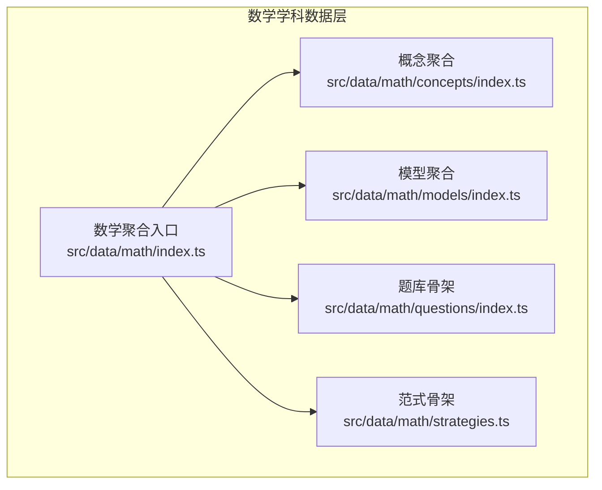
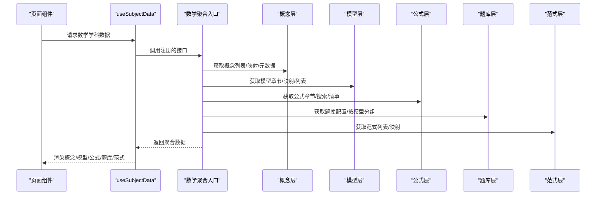
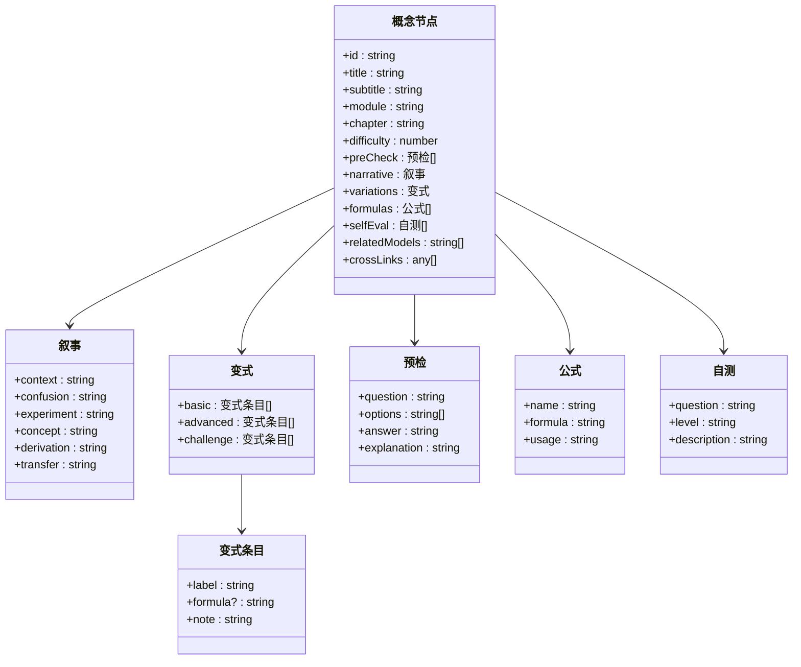
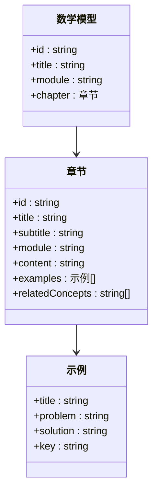
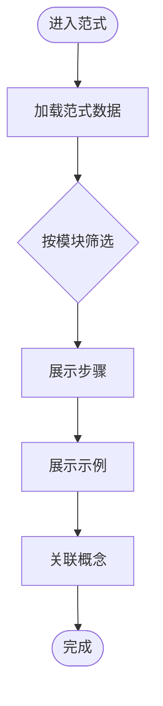
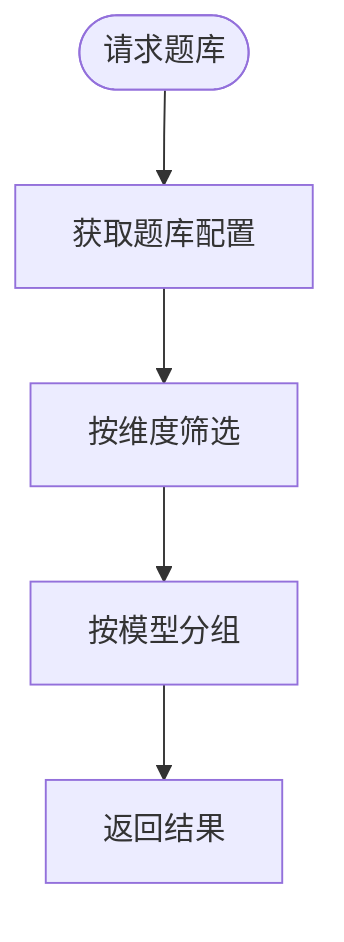
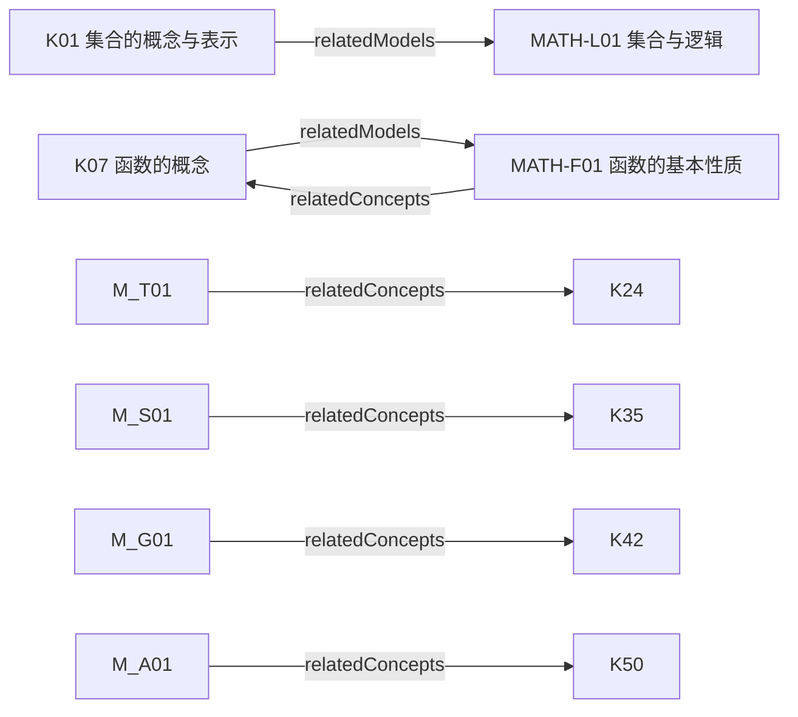
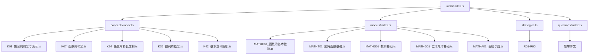

# 数学学科

<cite>
**本文引用的文件**
- [src/data/math/index.ts](file://src/data/math/index.ts)
- [src/data/math/concepts/index.ts](file://src/data/math/concepts/index.ts)
- [src/data/math/models/index.ts](file://src/data/math/models/index.ts)
- [src/data/math/questions/index.ts](file://src/data/math/questions/index.ts)
- [src/data/math/strategies.ts](file://src/data/math/strategies.ts)
- [src/data/math/concepts/K01_集合的概念与表示.ts](file://src/data/math/concepts/K01_集合的概念与表示.ts)
- [src/data/math/concepts/K07_函数的概念.ts](file://src/data/math/concepts/K07_函数的概念.ts)
- [src/data/math/concepts/K24_任意角和弧度制.ts](file://src/data/math/concepts/K24_任意角和弧度制.ts)
- [src/data/math/concepts/K35_数列的概念.ts](file://src/data/math/concepts/K35_数列的概念.ts)
- [src/data/math/concepts/K42_基本立体图形.ts](file://src/data/math/concepts/K42_基本立体图形.ts)
- [src/data/math/models/MATHF01_函数的基本性质.ts](file://src/data/math/models/MATHF01_函数的基本性质.ts)
- [src/data/math/models/MATHT01_三角函数基础.ts](file://src/data/math/models/MATHT01_三角函数基础.ts)
- [src/data/math/models/MATHS01_数列基础.ts](file://src/data/math/models/MATHS01_数列基础.ts)
- [src/data/math/models/MATHG01_立体几何基础.ts](file://src/data/math/models/MATHG01_立体几何基础.ts)
- [src/data/math/models/MATHA01_直线与圆.ts](file://src/data/math/models/MATHA01_直线与圆.ts)
</cite>

## 目录
1. [引言](#引言)
2. [项目结构](#项目结构)
3. [核心组件](#核心组件)
4. [架构总览](#架构总览)
5. [详细组件分析](#详细组件分析)
6. [依赖分析](#依赖分析)
7. [性能考虑](#性能考虑)
8. [故障排查指南](#故障排查指南)
9. [结论](#结论)
10. [附录](#附录)

## 引言
本文件面向“星耀平台”的数学学科，系统化梳理其知识组织结构与模块化设计。数学学科采用三层知识层级与配套模型、套路、题库的协同体系：
- K层知识节点：覆盖75个核心知识点，按8大模块组织，形成“情境—困惑—实验—概念—推导—迁移”的完整认知闭环。
- M层核心模型：汇聚8个主题模型，每个模型细分为若干章节，承载“概念—例题—相关概念”的结构化呈现。
- R层解题套路：规划90个解题范式，按模块分层，强调“步骤—示例—关联概念”的可迁移方法论。
- P层练习题库：提供筛选维度与难度等级，支撑个性化学习与能力诊断。

同时，文档阐述数学学科的模块划分与章节组织，涵盖集合与逻辑、函数与导数、三角与向量、数列与归纳、立体几何、解析几何、概率与统计、复数等核心领域，并给出思维方法与解题策略的系统化说明，以及通过模块化设计实现知识体系化与学习路径优化的实践建议。

## 项目结构
数学学科的数据层采用“subject barrel + 分类目录”的组织方式：
- subject注册入口：在数学学科的聚合入口中，统一导出概念、模型、公式、题库、范式等数据接口，并注册到全局subject注册表。
- 概念层（concepts）：按模块与章节组织75个K层节点，每个节点包含预检、叙事、变式、公式、自测、关联模型等结构。
- 模型层（models）：按模块组织8个核心模型，每个模型包含多个章节，章节内含标题、子标题、内容、示例与关联概念。
- 题库层（questions）：当前为骨架文件，预留筛选与统计接口。
- 范式层（strategies）：定义90个解题套路，按模块分层，提供步骤、示例与关联概念。

**图表来源**
- [src/data/math/index.ts:126-151](file://src/data/math/index.ts#L126-L151)
- [src/data/math/concepts/index.ts:82-119](file://src/data/math/concepts/index.ts#L82-L119)
- [src/data/math/models/index.ts:25-56](file://src/data/math/models/index.ts#L25-L56)
- [src/data/math/questions/index.ts:6-13](file://src/data/math/questions/index.ts#L6-L13)
- [src/data/math/strategies.ts:18-66](file://src/data/math/strategies.ts#L18-L66)

**章节来源**
- [src/data/math/index.ts:126-151](file://src/data/math/index.ts#L126-L151)
- [src/data/math/concepts/index.ts:82-119](file://src/data/math/concepts/index.ts#L82-L119)
- [src/data/math/models/index.ts:25-56](file://src/data/math/models/index.ts#L25-L56)
- [src/data/math/questions/index.ts:6-13](file://src/data/math/questions/index.ts#L6-L13)
- [src/data/math/strategies.ts:18-66](file://src/data/math/strategies.ts#L18-L66)

## 核心组件
- 概念聚合（K层）：75个知识点，按8大模块组织，提供概念元数据查询、按模块/章节检索、概念映射表等接口。
- 模型聚合（M层）：8个核心模型，每个模型包含若干章节，提供模型元数据查询、按模块检索、模型-概念关联等。
- 公式与章节：提供公式章节、搜索接口与公式清单，支撑概念与模型的公式索引。
- 范式（R层）：90个解题套路，按模块分层，提供范式列表、映射表与按模块检索。
- 题库（P层）：题库骨架，提供题目集合、按模型分组、筛选接口，支持难度、目标、功能、类型等维度。
- 图谱与统计：提供空图谱占位与按模型统计的接口，便于后续扩展。

**章节来源**
- [src/data/math/index.ts:12-151](file://src/data/math/index.ts#L12-L151)
- [src/data/math/concepts/index.ts:82-119](file://src/data/math/concepts/index.ts#L82-L119)
- [src/data/math/models/index.ts:25-56](file://src/data/math/models/index.ts#L25-L56)
- [src/data/math/questions/index.ts:6-13](file://src/data/math/questions/index.ts#L6-L13)
- [src/data/math/strategies.ts:18-66](file://src/data/math/strategies.ts#L18-L66)

## 架构总览
数学学科的前端数据流围绕subject注册入口展开：页面组件通过subject钩子获取概念、模型、公式、题库与范式数据；聚合入口负责数据的组织与对外暴露；各模块目录负责具体数据的维护与扩展。

**图表来源**
- [src/data/math/index.ts:126-151](file://src/data/math/index.ts#L126-L151)
- [src/data/math/concepts/index.ts:82-119](file://src/data/math/concepts/index.ts#L82-L119)
- [src/data/math/models/index.ts:25-56](file://src/data/math/models/index.ts#L25-L56)
- [src/data/math/questions/index.ts:6-13](file://src/data/math/questions/index.ts#L6-L13)
- [src/data/math/strategies.ts:18-66](file://src/data/math/strategies.ts#L18-L66)

## 详细组件分析

### 概念层（K层：75个知识节点）
- 模块划分：集合与逻辑、函数与导数、三角与向量、数列与归纳、立体几何、解析几何、概率与统计、复数。
- 数据结构：每个概念节点包含id、模块、章节、难度、预检、叙事（情境/困惑/实验/概念/推导/迁移）、变式（基础/进阶/挑战）、公式、自测、关联模型、交叉链接等。
- 查询接口：按模块/章节检索、概念映射表、概念元数据查询、概念列表生成。

**图表来源**
- [src/data/math/concepts/K01_集合的概念与表示.ts:4-57](file://src/data/math/concepts/K01_集合的概念与表示.ts#L4-L57)
- [src/data/math/concepts/K07_函数的概念.ts:4-56](file://src/data/math/concepts/K07_函数的概念.ts#L4-L56)
- [src/data/math/concepts/K24_任意角和弧度制.ts:4-55](file://src/data/math/concepts/K24_任意角和弧度制.ts#L4-L55)
- [src/data/math/concepts/K35_数列的概念.ts:4-54](file://src/data/math/concepts/K35_数列的概念.ts#L4-L54)
- [src/data/math/concepts/K42_基本立体图形.ts:4-55](file://src/data/math/concepts/K42_基本立体图形.ts#L4-L55)

**章节来源**
- [src/data/math/concepts/index.ts:82-119](file://src/data/math/concepts/index.ts#L82-L119)
- [src/data/math/concepts/K01_集合的概念与表示.ts:4-57](file://src/data/math/concepts/K01_集合的概念与表示.ts#L4-L57)
- [src/data/math/concepts/K07_函数的概念.ts:4-56](file://src/data/math/concepts/K07_函数的概念.ts#L4-L56)
- [src/data/math/concepts/K24_任意角和弧度制.ts:4-55](file://src/data/math/concepts/K24_任意角和弧度制.ts#L4-L55)
- [src/data/math/concepts/K35_数列的概念.ts:4-54](file://src/data/math/concepts/K35_数列的概念.ts#L4-L54)
- [src/data/math/concepts/K42_基本立体图形.ts:4-55](file://src/data/math/concepts/K42_基本立体图形.ts#L4-L55)

### 模型层（M层：8个核心模型）
- 模块划分：函数与导数、三角与向量、数列与归纳、立体几何、解析几何、概率与统计、集合与逻辑、复数。
- 数据结构：每个模型包含id、title、module、chapter（含id、title、subtitle、module、content、examples、relatedConcepts），examples包含问题、解答与关键点。
- 查询接口：模型映射表、按模块检索、模型列表。

**图表来源**
- [src/data/math/models/MATHF01_函数的基本性质.ts:4-25](file://src/data/math/models/MATHF01_函数的基本性质.ts#L4-L25)
- [src/data/math/models/MATHT01_三角函数基础.ts:4-135](file://src/data/math/models/MATHT01_三角函数基础.ts#L4-L135)
- [src/data/math/models/MATHS01_数列基础.ts:4-179](file://src/data/math/models/MATHS01_数列基础.ts#L4-L179)
- [src/data/math/models/MATHG01_立体几何基础.ts:4-157](file://src/data/math/models/MATHG01_立体几何基础.ts#L4-L157)
- [src/data/math/models/MATHA01_直线与圆.ts:4-179](file://src/data/math/models/MATHA01_直线与圆.ts#L4-L179)

**章节来源**
- [src/data/math/models/index.ts:25-56](file://src/data/math/models/index.ts#L25-L56)
- [src/data/math/models/MATHF01_函数的基本性质.ts:4-25](file://src/data/math/models/MATHF01_函数的基本性质.ts#L4-L25)
- [src/data/math/models/MATHT01_三角函数基础.ts:4-135](file://src/data/math/models/MATHT01_三角函数基础.ts#L4-L135)
- [src/data/math/models/MATHS01_数列基础.ts:4-179](file://src/data/math/models/MATHS01_数列基础.ts#L4-L179)
- [src/data/math/models/MATHG01_立体几何基础.ts:4-157](file://src/data/math/models/MATHG01_立体几何基础.ts#L4-L157)
- [src/data/math/models/MATHA01_直线与圆.ts:4-179](file://src/data/math/models/MATHA01_直线与圆.ts#L4-L179)

### 范式层（R层：90个解题套路）
- 结构：每个范式包含id、title、subtitle、module、content、steps（步骤）、examples（问题与解答）、relatedConcepts（关联概念）。
- 分层：按模块分层（函数与导数、三角与向量、数列与归纳、立体几何、解析几何、概率与统计、集合与逻辑、不等式、复数与平面向量）。
- 价值：提供可迁移的解题步骤与示例，强化方法论与知识迁移。

**图表来源**
- [src/data/math/strategies.ts:18-66](file://src/data/math/strategies.ts#L18-L66)

**章节来源**
- [src/data/math/strategies.ts:18-66](file://src/data/math/strategies.ts#L18-L66)

### 题库层（P层：练习题库）
- 当前状态：题库骨架文件，题目数组为空，按模型分组映射为空。
- 接口：提供allQuestions、questionsByModel、getQuestionsByFilter等骨架接口，便于后续填充与扩展。
- 筛选维度：难度等级（基础/进阶/挑战）、目标（同步学习/期中期末/高考专项/竞赛拓展）、功能（巩固练习/复习检测/诊断评估/真题演练）、类型（选择/填空/判断/解答）。

**图表来源**
- [src/data/math/index.ts:66-100](file://src/data/math/index.ts#L66-L100)
- [src/data/math/questions/index.ts:6-13](file://src/data/math/questions/index.ts#L6-L13)

**章节来源**
- [src/data/math/index.ts:66-100](file://src/data/math/index.ts#L66-L100)
- [src/data/math/questions/index.ts:6-13](file://src/data/math/questions/index.ts#L6-L13)

### 概念到模型的映射与学习路径
- 关联关系：概念节点通过relatedModels指向模型id；模型章节通过relatedConcepts指向概念id。
- 学习路径：先概念（K层）→再模型（M层）→再范式（R层）→最后题库（P层）的递进式学习闭环。

**图表来源**
- [src/data/math/concepts/K01_集合的概念与表示.ts:54-54](file://src/data/math/concepts/K01_集合的概念与表示.ts#L54-L54)
- [src/data/math/concepts/K07_函数的概念.ts:53-53](file://src/data/math/concepts/K07_函数的概念.ts#L53-L53)
- [src/data/math/models/MATHF01_函数的基本性质.ts:22-22](file://src/data/math/models/MATHF01_函数的基本性质.ts#L22-L22)
- [src/data/math/models/MATHT01_三角函数基础.ts:22-22](file://src/data/math/models/MATHT01_三角函数基础.ts#L22-L22)
- [src/data/math/models/MATHS01_数列基础.ts:22-22](file://src/data/math/models/MATHS01_数列基础.ts#L22-L22)
- [src/data/math/models/MATHG01_立体几何基础.ts:22-22](file://src/data/math/models/MATHG01_立体几何基础.ts#L22-L22)
- [src/data/math/models/MATHA01_直线与圆.ts:22-22](file://src/data/math/models/MATHA01_直线与圆.ts#L22-L22)

**章节来源**
- [src/data/math/concepts/K01_集合的概念与表示.ts:54-54](file://src/data/math/concepts/K01_集合的概念与表示.ts#L54-L54)
- [src/data/math/concepts/K07_函数的概念.ts:53-53](file://src/data/math/concepts/K07_函数的概念.ts#L53-L53)
- [src/data/math/models/MATHF01_函数的基本性质.ts:22-22](file://src/data/math/models/MATHF01_函数的基本性质.ts#L22-L22)
- [src/data/math/models/MATHT01_三角函数基础.ts:22-22](file://src/data/math/models/MATHT01_三角函数基础.ts#L22-L22)
- [src/data/math/models/MATHS01_数列基础.ts:22-22](file://src/data/math/models/MATHS01_数列基础.ts#L22-L22)
- [src/data/math/models/MATHG01_立体几何基础.ts:22-22](file://src/data/math/models/MATHG01_立体几何基础.ts#L22-L22)
- [src/data/math/models/MATHA01_直线与圆.ts:22-22](file://src/data/math/models/MATHA01_直线与圆.ts#L22-L22)

## 依赖分析
- 概念层依赖：概念聚合文件导入各K节点文件，构建allConcepts与conceptDataMap；提供按模块/章节检索与概念映射。
- 模型层依赖：模型聚合文件导入各模型文件，构建allModels与modelDataMap；提供按模块检索与模型映射。
- 范式层依赖：范式聚合文件定义Strategy接口与allStrategies数组，提供按模块检索与映射。
- 题库层依赖：题库聚合文件提供骨架接口，供后续填充使用。
- 注册依赖：数学聚合入口通过registerSubject注册上述数据接口，供页面组件统一调用。

**图表来源**
- [src/data/math/concepts/index.ts:4-91](file://src/data/math/concepts/index.ts#L4-L91)
- [src/data/math/models/index.ts:4-33](file://src/data/math/models/index.ts#L4-L33)
- [src/data/math/strategies.ts:18-66](file://src/data/math/strategies.ts#L18-L66)
- [src/data/math/questions/index.ts:6-13](file://src/data/math/questions/index.ts#L6-L13)
- [src/data/math/index.ts:126-151](file://src/data/math/index.ts#L126-L151)

**章节来源**
- [src/data/math/concepts/index.ts:4-91](file://src/data/math/concepts/index.ts#L4-L91)
- [src/data/math/models/index.ts:4-33](file://src/data/math/models/index.ts#L4-L33)
- [src/data/math/strategies.ts:18-66](file://src/data/math/strategies.ts#L18-L66)
- [src/data/math/questions/index.ts:6-13](file://src/data/math/questions/index.ts#L6-L13)
- [src/data/math/index.ts:126-151](file://src/data/math/index.ts#L126-L151)

## 性能考虑
- 数据加载：通过聚合入口集中导出，避免页面重复导入，降低包体与初始化开销。
- 查询优化：conceptDataMap与modelDataMap提供O(1)映射查找；按模块过滤减少遍历成本。
- 懒加载：题库与范式可按需加载，避免一次性渲染全部数据。
- 缓存策略：页面组件可缓存已加载的概念/模型/公式/题库数据，减少重复请求。

## 故障排查指南
- 概念缺失：检查concepts/index.ts中的allConcepts与conceptDataMap是否包含目标id。
- 模型缺失：检查models/index.ts中的allModels与modelDataMap是否包含目标id。
- 范式缺失：检查strategies.ts中的allStrategies是否包含目标id。
- 题库为空：确认questions/index.ts中是否已填充题目数据与按模型分组映射。
- 模块检索异常：确认MATH_MODULES与MATH_MODEL_MODULES中的模块名与概念/模型模块一致。

**章节来源**
- [src/data/math/concepts/index.ts:82-119](file://src/data/math/concepts/index.ts#L82-L119)
- [src/data/math/models/index.ts:25-56](file://src/data/math/models/index.ts#L25-L56)
- [src/data/math/strategies.ts:18-66](file://src/data/math/strategies.ts#L18-L66)
- [src/data/math/questions/index.ts:6-13](file://src/data/math/questions/index.ts#L6-L13)

## 结论
星耀平台的数学学科以“K-M-R-P”四层结构为核心，结合模块化设计与清晰的数据接口，实现了知识的系统化组织与学习路径的可迁移性。通过概念（K层）奠定认知基础、模型（M层）提供结构化框架、范式（R层）强化方法论、题库（P层）支撑能力训练，最终达成“情境—困惑—实验—概念—推导—应用”的完整学习闭环。建议后续完善题库骨架、补齐范式条目，并持续扩展模型章节与概念节点，以满足不同阶段的学习需求。

## 附录
- 模块划分与章节组织（示例）
  - 集合与逻辑：K01-K06，模型L01
  - 函数与导数：K07-K23，模型F01、F02
  - 三角与向量：K24-K34，模型T01
  - 数列与归纳：K35-K41，模型S01
  - 立体几何：K42-K49，模型G01
  - 解析几何：K50-K58，模型A01
  - 概率与统计：K59-K69
  - 复数：K70-K75
- 方法论与生活应用
  - 方法论：范式R01-R90提供可迁移的解题步骤与示例。
  - 生活应用：概念节点的narrative与transfer部分体现数学在现实中的应用场景与迁移能力。