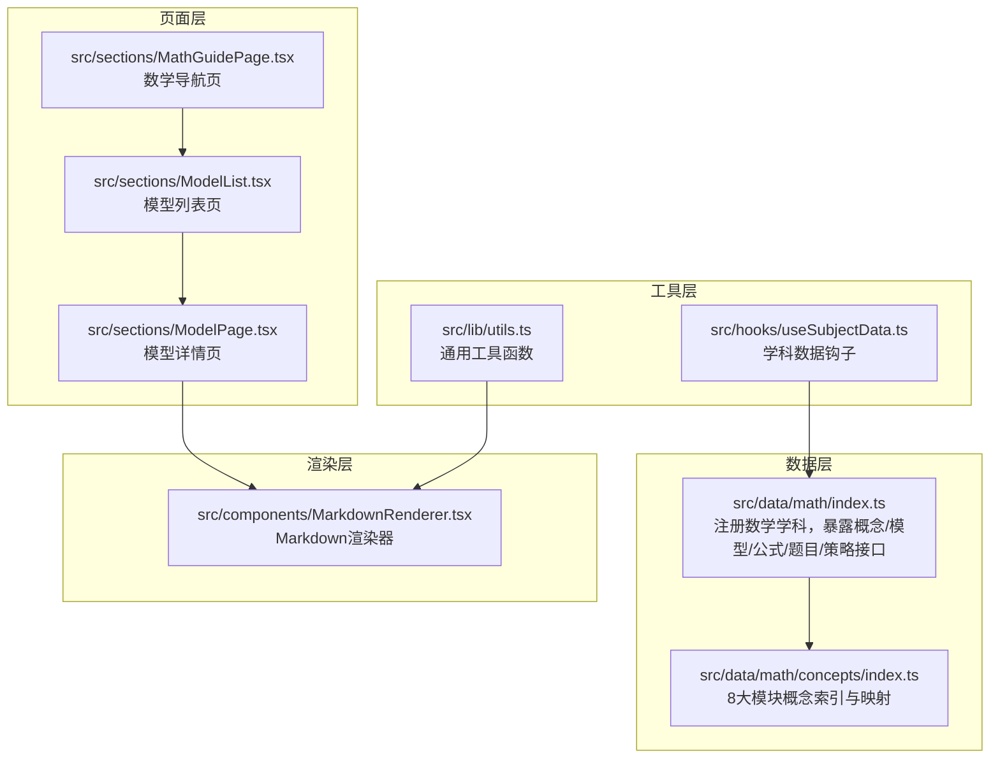
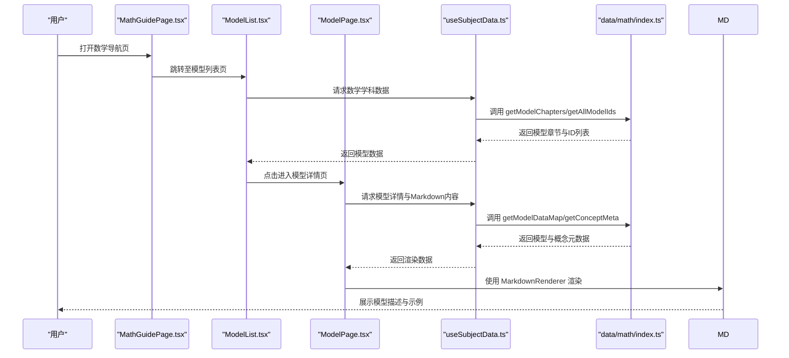
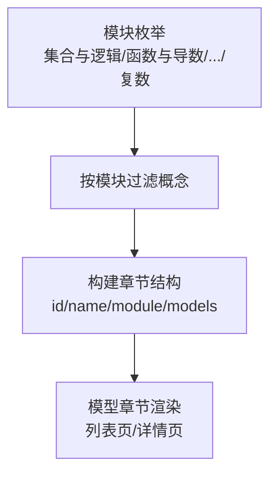
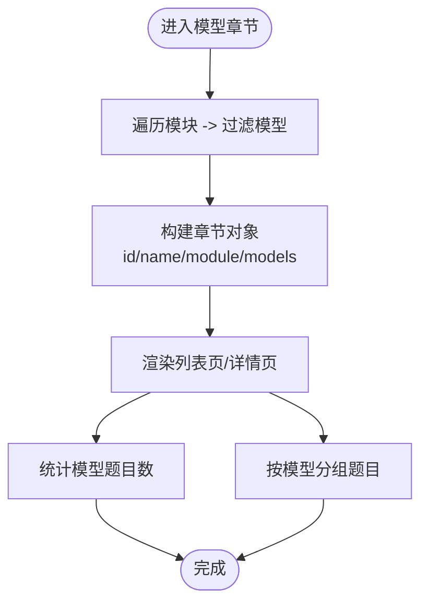
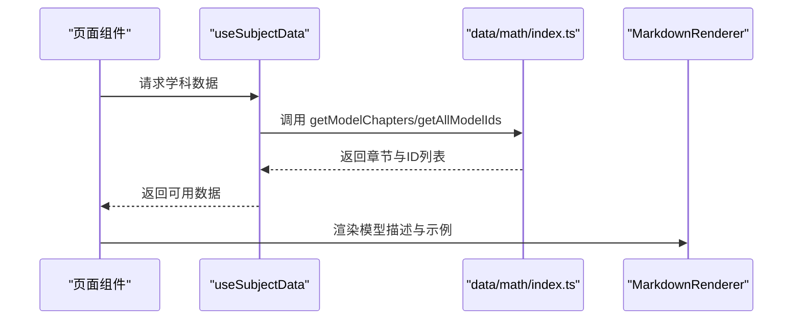
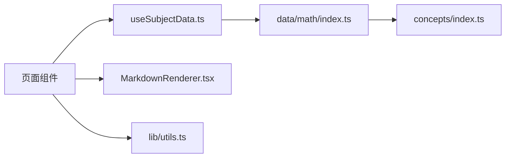

# 数学核心模型

<cite>
**本文引用的文件**
- [src/data/math/index.ts](file://src/data/math/index.ts)
- [src/data/math/concepts/index.ts](file://src/data/math/concepts/index.ts)
- [src/sections/MathGuidePage.tsx](file://src/sections/MathGuidePage.tsx)
- [src/sections/ModelList.tsx](file://src/sections/ModelList.tsx)
- [src/sections/ModelPage.tsx](file://src/sections/ModelPage.tsx)
- [src/components/MarkdownRenderer.tsx](file://src/components/MarkdownRenderer.tsx)
- [src/hooks/useSubjectData.ts](file://src/hooks/useSubjectData.ts)
- [src/lib/utils.ts](file://src/lib/utils.ts)
</cite>

## 目录
1. [引言](#引言)
2. [项目结构](#项目结构)
3. [核心组件](#核心组件)
4. [架构总览](#架构总览)
5. [详细组件分析](#详细组件分析)
6. [依赖分析](#依赖分析)
7. [性能考虑](#性能考虑)
8. [故障排查指南](#故障排查指南)
9. [结论](#结论)
10. [附录](#附录)

## 引言
本文件系统化梳理星耀平台数学学科的“M层”（模型层）核心体系，围绕8大知识模块，阐述数学模型的组织结构、分类体系、与知识节点的映射关系，以及如何以模型化思维驱动复杂问题的解决。文档同时给出模型与页面组件的集成方式、数据流与渲染机制，并提供可操作的应用示例与最佳实践，帮助教师与学生将抽象的数学概念转化为可执行的解题工具。

## 项目结构
数学M层数据与页面组件的组织遵循“学科-模块-模型”的层次化设计：
- 数据层：位于 src/data/math，负责聚合概念、模型、公式、题目与策略数据，并提供查询接口。
- 页面层：位于 src/sections，提供数学导航页、模型列表页、模型详情页等用户交互界面。
- 渲染层：位于 src/components，使用 Markdown 渲染器统一呈现模型描述与示例。
- 工具层：位于 src/lib 与 src/hooks，提供通用工具函数与主题/路由钩子。

图表来源
- [src/data/math/index.ts:126-151](file://src/data/math/index.ts#L126-L151)
- [src/data/math/concepts/index.ts:109-118](file://src/data/math/concepts/index.ts#L109-L118)
- [src/sections/MathGuidePage.tsx](file://src/sections/MathGuidePage.tsx)
- [src/sections/ModelList.tsx](file://src/sections/ModelList.tsx)
- [src/sections/ModelPage.tsx](file://src/sections/ModelPage.tsx)
- [src/components/MarkdownRenderer.tsx](file://src/components/MarkdownRenderer.tsx)
- [src/hooks/useSubjectData.ts](file://src/hooks/useSubjectData.ts)
- [src/lib/utils.ts](file://src/lib/utils.ts)

章节来源
- [src/data/math/index.ts:126-151](file://src/data/math/index.ts#L126-L151)
- [src/data/math/concepts/index.ts:109-118](file://src/data/math/concepts/index.ts#L109-L118)

## 核心组件
- 数学学科注册与数据聚合
  - 通过 registerSubject 注册数学学科，统一暴露概念、模型、公式、题目与策略的查询接口。
  - 提供模块化数据访问：按模块获取概念列表、按ID获取概念元数据、按模块获取模型列表等。
- 模型章节与难度标注
  - 模型章节按模块划分，支持按难度字符串化展示；提供模型问题统计与按模型分组的题目集合。
- 页面组件与渲染
  - 导航页、列表页、详情页分别承担入口、浏览与深度学习职责；Markdown 渲染器用于统一展示模型描述与示例。
- 钩子与工具
  - useSubjectData 钩子封装学科数据获取；utils 提供通用工具函数，保障页面与数据层的解耦。

章节来源
- [src/data/math/index.ts:126-151](file://src/data/math/index.ts#L126-L151)
- [src/sections/MathGuidePage.tsx](file://src/sections/MathGuidePage.tsx)
- [src/sections/ModelList.tsx](file://src/sections/ModelList.tsx)
- [src/sections/ModelPage.tsx](file://src/sections/ModelPage.tsx)
- [src/components/MarkdownRenderer.tsx](file://src/components/MarkdownRenderer.tsx)
- [src/hooks/useSubjectData.ts](file://src/hooks/useSubjectData.ts)
- [src/lib/utils.ts](file://src/lib/utils.ts)

## 架构总览
下图展示了从页面到数据层的调用链路与职责边界：

图表来源
- [src/sections/MathGuidePage.tsx](file://src/sections/MathGuidePage.tsx)
- [src/sections/ModelList.tsx](file://src/sections/ModelList.tsx)
- [src/sections/ModelPage.tsx](file://src/sections/ModelPage.tsx)
- [src/hooks/useSubjectData.ts](file://src/hooks/useSubjectData.ts)
- [src/data/math/index.ts:126-151](file://src/data/math/index.ts#L126-L151)
- [src/components/MarkdownRenderer.tsx](file://src/components/MarkdownRenderer.tsx)

## 详细组件分析

### 数学M层与8大模块
- 模块划分
  - 集合与逻辑
  - 函数与导数
  - 三角与向量
  - 数列与归纳
  - 立体几何
  - 解析几何
  - 概率与统计
  - 复数
- 模块与概念映射
  - 每个模块由若干概念节点构成，通过模块字段进行聚合与过滤。
  - 支持按模块检索概念列表，便于构建“模块-概念-模型”的三级导航。

图表来源
- [src/data/math/concepts/index.ts:109-118](file://src/data/math/concepts/index.ts#L109-L118)
- [src/data/math/index.ts:42-56](file://src/data/math/index.ts#L42-L56)

章节来源
- [src/data/math/concepts/index.ts:109-118](file://src/data/math/concepts/index.ts#L109-L118)
- [src/data/math/index.ts:42-56](file://src/data/math/index.ts#L42-L56)

### 模型章节与难度标注
- 模型章节
  - 依据模块划分模型章节，每章包含若干模型条目，包含ID、标题与难度字符串化表示。
- 难度体系
  - 难度以字符串形式存储，便于前端样式映射与排序。
- 统计与分组
  - 提供模型问题统计与按模型分组的题目集合，支撑个性化学习与错题分析。

图表来源
- [src/data/math/index.ts:42-56](file://src/data/math/index.ts#L42-L56)
- [src/data/math/index.ts:106-124](file://src/data/math/index.ts#L106-L124)

章节来源
- [src/data/math/index.ts:42-56](file://src/data/math/index.ts#L42-L56)
- [src/data/math/index.ts:106-124](file://src/data/math/index.ts#L106-L124)

### 页面与数据交互
- 导航页
  - 提供模块入口与跳转，串联列表页与详情页。
- 列表页
  - 展示模型章节与模型卡片，支持按难度筛选与排序。
- 详情页
  - 加载模型详情与Markdown内容，使用 MarkdownRenderer 渲染。
- 钩子与工具
  - useSubjectData 封装学科数据请求；utils 提供通用工具，保证页面与数据层解耦。

图表来源
- [src/sections/ModelList.tsx](file://src/sections/ModelList.tsx)
- [src/sections/ModelPage.tsx](file://src/sections/ModelPage.tsx)
- [src/hooks/useSubjectData.ts](file://src/hooks/useSubjectData.ts)
- [src/data/math/index.ts:126-151](file://src/data/math/index.ts#L126-L151)
- [src/components/MarkdownRenderer.tsx](file://src/components/MarkdownRenderer.tsx)

章节来源
- [src/sections/ModelList.tsx](file://src/sections/ModelList.tsx)
- [src/sections/ModelPage.tsx](file://src/sections/ModelPage.tsx)
- [src/hooks/useSubjectData.ts](file://src/hooks/useSubjectData.ts)
- [src/data/math/index.ts:126-151](file://src/data/math/index.ts#L126-L151)
- [src/components/MarkdownRenderer.tsx](file://src/components/MarkdownRenderer.tsx)

### 模型化思维与问题解决
- 模型化思维的要点
  - 抽象建模：将实际问题映射到数学模型框架。
  - 分步求解：按照模型步骤进行符号化、推导与验证。
  - 可视化与迁移：利用模型图示与类比，实现跨情境迁移。
- 在教学中的价值
  - 培养逻辑思维与系统化分析能力。
  - 提升复杂问题的拆解与整合能力。
  - 建立“模型—知识—应用”的闭环学习路径。

（本节为概念性说明，不直接分析具体文件）

## 依赖分析
- 模块内聚与耦合
  - data/math/index.ts 作为学科数据中枢，向上游页面组件提供稳定接口；向下聚合概念、模型、公式、题目与策略数据。
  - 页面组件仅依赖钩子与渲染器，避免直接依赖底层数据源，降低耦合。
- 外部依赖
  - Markdown 渲染器用于统一展示模型描述与示例，提升可维护性。
  - 工具函数与钩子提供通用能力，减少重复代码。

图表来源
- [src/sections/ModelList.tsx](file://src/sections/ModelList.tsx)
- [src/sections/ModelPage.tsx](file://src/sections/ModelPage.tsx)
- [src/hooks/useSubjectData.ts](file://src/hooks/useSubjectData.ts)
- [src/data/math/index.ts:126-151](file://src/data/math/index.ts#L126-L151)
- [src/data/math/concepts/index.ts:109-118](file://src/data/math/concepts/index.ts#L109-L118)
- [src/components/MarkdownRenderer.tsx](file://src/components/MarkdownRenderer.tsx)
- [src/lib/utils.ts](file://src/lib/utils.ts)

章节来源
- [src/data/math/index.ts:126-151](file://src/data/math/index.ts#L126-L151)
- [src/data/math/concepts/index.ts:109-118](file://src/data/math/concepts/index.ts#L109-L118)

## 性能考虑
- 数据懒加载
  - 页面按需请求模型数据，避免一次性加载全部数据。
- 缓存与去重
  - 使用数据映射与ID集合，减少重复查询与渲染。
- 渲染优化
  - Markdown 渲染器集中处理，避免重复解析与DOM操作。
- 接口稳定性
  - 通过 registerSubject 统一暴露接口，便于未来扩展与重构。

（本节为通用建议，不直接分析具体文件）

## 故障排查指南
- 页面无法显示模型列表
  - 检查 useSubjectData 是否正确调用 getModelChapters。
  - 确认 data/math/index.ts 中 getModelChapters 的实现与模块枚举一致。
- 模型详情页空白
  - 检查 MarkdownRenderer 的输入内容是否为空或格式错误。
  - 确认 useSubjectData 获取的模型数据包含标题与描述。
- 难度显示异常
  - 检查难度字符串化逻辑与前端样式映射是否一致。
- 性能问题
  - 对大量模型进行虚拟滚动或分页加载。
  - 合理缓存数据映射与ID集合，避免重复计算。

章节来源
- [src/hooks/useSubjectData.ts](file://src/hooks/useSubjectData.ts)
- [src/data/math/index.ts:42-56](file://src/data/math/index.ts#L42-L56)
- [src/components/MarkdownRenderer.tsx](file://src/components/MarkdownRenderer.tsx)

## 结论
星耀平台数学M层以“模块-模型-知识节点”为核心，通过数据层的统一聚合与页面层的清晰分层，实现了从概念到模型再到应用的完整闭环。借助模型化思维，学生能够将抽象的数学知识转化为可操作的解题工具，提升逻辑思维与问题解决能力。未来可在模型示例库、交互式演示与自适应推荐等方面进一步增强体验与效果。

## 附录
- 模块与概念映射参考
  - 模块枚举与概念过滤逻辑见 [src/data/math/concepts/index.ts:109-118](file://src/data/math/concepts/index.ts#L109-L118)
- 模型章节与统计接口参考
  - 模型章节构建与统计接口见 [src/data/math/index.ts:42-56](file://src/data/math/index.ts#L42-L56) 与 [src/data/math/index.ts:106-124](file://src/data/math/index.ts#L106-L124)
- 页面与数据交互参考
  - 页面组件与钩子调用见 [src/sections/ModelList.tsx](file://src/sections/ModelList.tsx)、[src/sections/ModelPage.tsx](file://src/sections/ModelPage.tsx)、[src/hooks/useSubjectData.ts](file://src/hooks/useSubjectData.ts)