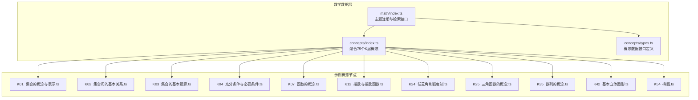
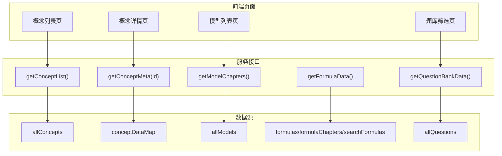
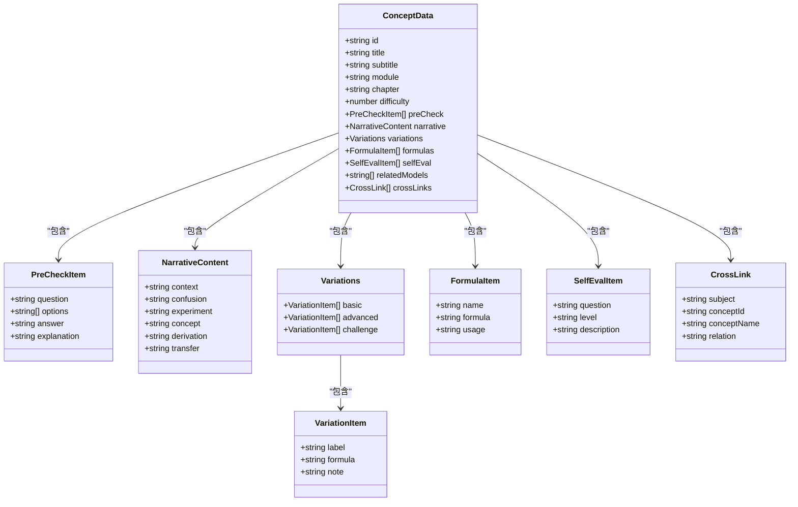
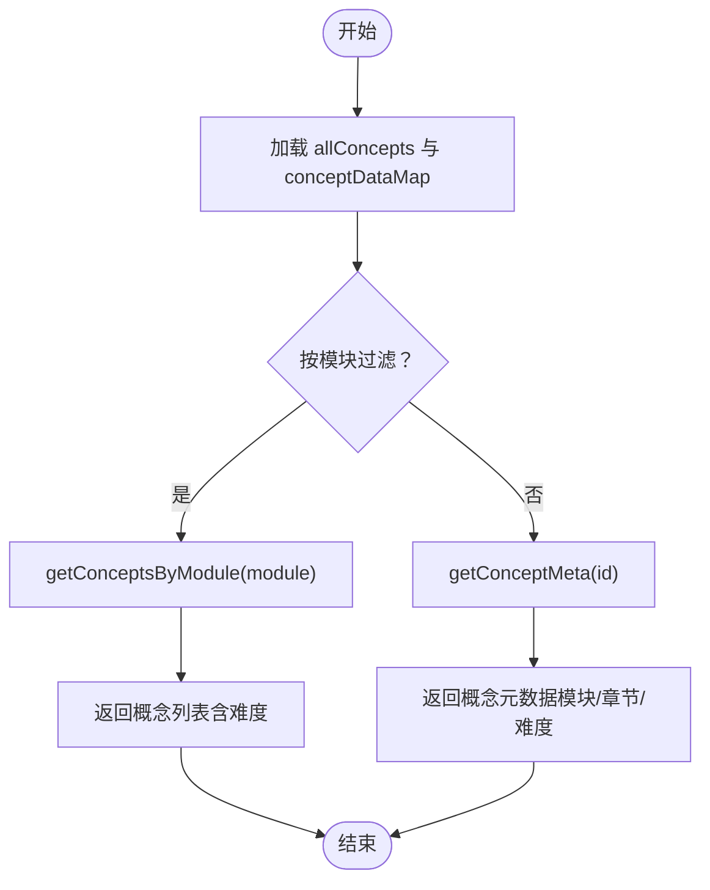
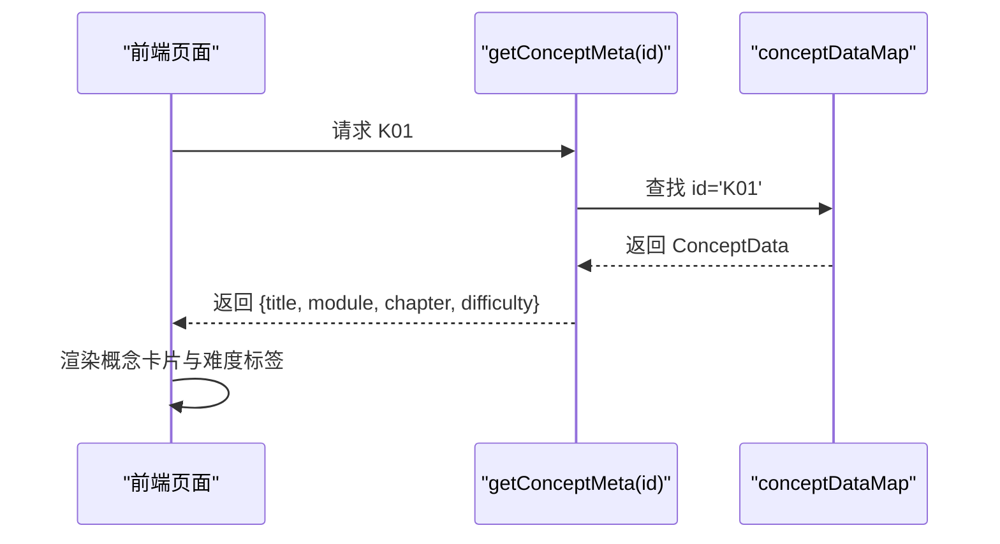
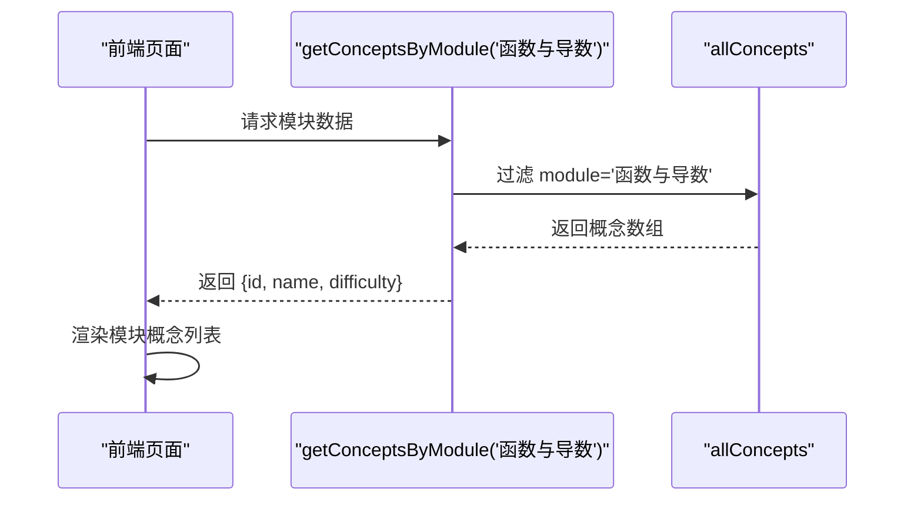
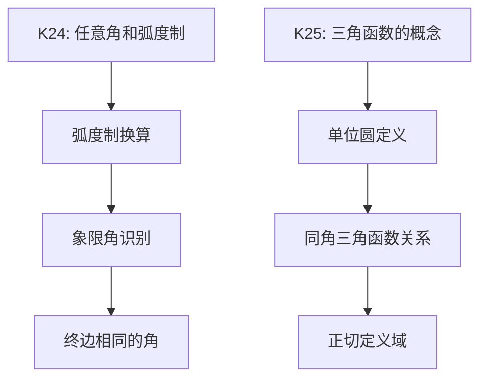
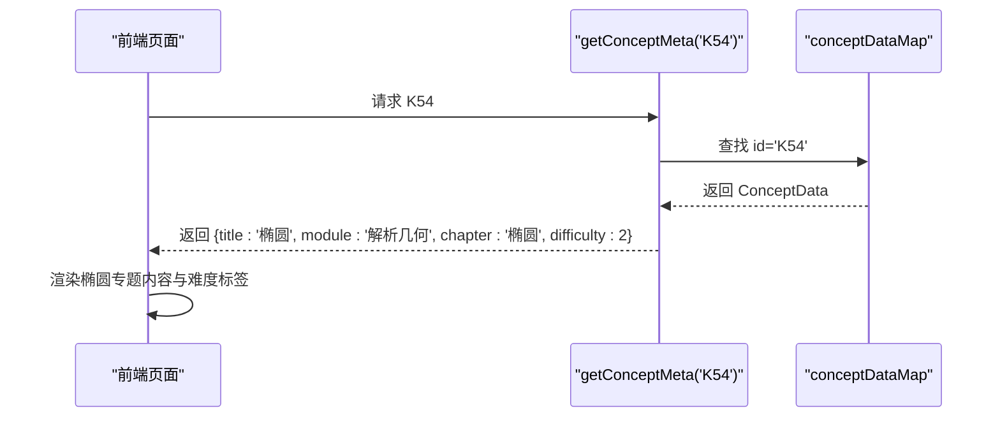
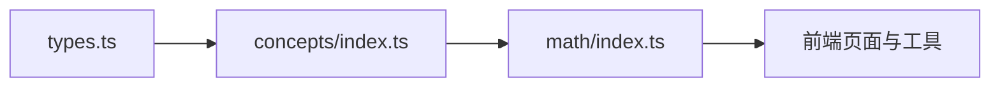

# 数学知识节点

<cite>
**本文引用的文件**
- [src/data/math/concepts/index.ts](file://src/data/math/concepts/index.ts)
- [src/data/math/index.ts](file://src/data/math/index.ts)
- [src/data/math/concepts/types.ts](file://src/data/math/concepts/types.ts)
- [src/data/math/concepts/K01_集合的概念与表示.ts](file://src/data/math/concepts/K01_集合的概念与表示.ts)
- [src/data/math/concepts/K02_集合间的基本关系.ts](file://src/data/math/concepts/K02_集合间的基本关系.ts)
- [src/data/math/concepts/K03_集合的基本运算.ts](file://src/data/math/concepts/K03_集合的基本运算.ts)
- [src/data/math/concepts/K04_充分条件与必要条件.ts](file://src/data/math/concepts/K04_充分条件与必要条件.ts)
- [src/data/math/concepts/K07_函数的概念.ts](file://src/data/math/concepts/K07_函数的概念.ts)
- [src/data/math/concepts/K12_指数与指数函数.ts](file://src/data/math/concepts/K12_指数与指数函数.ts)
- [src/data/math/concepts/K24_任意角和弧度制.ts](file://src/data/math/concepts/K24_任意角和弧度制.ts)
- [src/data/math/concepts/K25_三角函数的概念.ts](file://src/data/math/concepts/K25_三角函数的概念.ts)
- [src/data/math/concepts/K35_数列的概念.ts](file://src/data/math/concepts/K35_数列的概念.ts)
- [src/data/math/concepts/K42_基本立体图形.ts](file://src/data/math/concepts/K42_基本立体图形.ts)
- [src/data/math/concepts/K54_椭圆.ts](file://src/data/math/concepts/K54_椭圆.ts)
</cite>

## 目录
1. [引言](#引言)
2. [项目结构](#项目结构)
3. [核心组件](#核心组件)
4. [架构总览](#架构总览)
5. [详细组件分析](#详细组件分析)
6. [依赖分析](#依赖分析)
7. [性能考虑](#性能考虑)
8. [故障排查指南](#故障排查指南)
9. [结论](#结论)
10. [附录](#附录)

## 引言
本文件围绕星耀平台数学学科的K层知识节点，系统梳理75个核心知识点的组织方式与呈现结构，覆盖集合与逻辑、函数与导数、三角与向量、数列与归纳、立体几何、解析几何、概率与统计、复数八大模块。文档重点说明：
- 知识节点的数据结构组成：概念定义、核心要点、应用场景、典型例题、公式、变式、自测、相关模型与跨学科链接。
- 分类体系与难度等级（基础、进阶、挑战）划分。
- 知识节点间的关联关系与学习路径优化建议。
- 通过模块化设计实现系统化知识呈现与可扩展的维护机制。

## 项目结构
数学K层知识节点位于数据层，采用“模块化聚合 + 统一索引”的组织方式：
- 概念数据入口：聚合所有K层概念，提供按模块/章节检索与映射查询能力。
- 主题注册：将数学学科数据注册到统一的学科注册中心，供前端页面与工具使用。
- 类型约束：统一的概念数据接口，确保各节点字段一致、便于扩展。

图表来源
- [src/data/math/concepts/index.ts:1-119](file://src/data/math/concepts/index.ts#L1-L119)
- [src/data/math/index.ts:1-166](file://src/data/math/index.ts#L1-L166)

章节来源
- [src/data/math/concepts/index.ts:1-119](file://src/data/math/concepts/index.ts#L1-L119)
- [src/data/math/index.ts:1-166](file://src/data/math/index.ts#L1-L166)

## 核心组件
- 概念数据接口（ConceptData）：统一描述知识节点的字段与结构，包括标识、标题、副标题、模块、章节、难度、前置检查、叙述内容、变式、公式、自测、相关模型、跨学科链接等。
- 概念聚合与检索：
  - allConcepts：75个K层概念的数组。
  - conceptDataMap：按id索引的概念映射，支持O(1)查找。
  - getConceptById：按id获取概念。
  - getConceptsByModule/getConceptsByChapter：按模块/章节过滤。
  - MATH_MODULES：八大模块名称列表。
- 主题注册：
  - 将数学学科的概念、模型、公式、策略、题库等数据统一注册，提供给前端页面与工具使用。
  - 提供难度标签、目标标签、功能标签、题型选项等配置，支撑题库筛选与学习路径。

章节来源
- [src/data/math/concepts/types.ts:52-72](file://src/data/math/concepts/types.ts#L52-L72)
- [src/data/math/concepts/index.ts:82-119](file://src/data/math/concepts/index.ts#L82-L119)
- [src/data/math/index.ts:12-151](file://src/data/math/index.ts#L12-L151)

## 架构总览
数学K层知识节点的模块化架构如下：
- 数据层：概念、模型、公式、策略、题库各自独立，通过统一的学科注册中心对外暴露。
- 服务层：提供概念列表、元数据、模型章节、公式数据、题库配置等查询接口。
- 前端层：基于这些接口渲染学习路径、知识卡片、模型列表、题库筛选等页面。

图表来源
- [src/data/math/index.ts:12-151](file://src/data/math/index.ts#L12-L151)

章节来源
- [src/data/math/index.ts:126-151](file://src/data/math/index.ts#L126-L151)

## 详细组件分析

### 概念数据结构（ConceptData）
概念数据结构由类型定义统一约束，确保各节点字段一致、便于扩展与维护。关键字段说明：
- 基本信息：id、title、subtitle、module、chapter、difficulty。
- 前置检查：用于学习前的诊断性题目与解析。
- 叙述内容：context（情境）、confusion（易错点）、experiment（实验/思考）、concept（概念）、derivation（推导）、transfer（迁移）。
- 变式：basic/advanced/challenge三个层级的要点与公式。
- 公式：name/formula/usage的条目集合。
- 自测：question/level/description的条目集合。
- 关联：relatedModels（相关模型ID）、crossLinks（跨学科链接）。

图表来源
- [src/data/math/concepts/types.ts:5-72](file://src/data/math/concepts/types.ts#L5-L72)

章节来源
- [src/data/math/concepts/types.ts:52-72](file://src/data/math/concepts/types.ts#L52-L72)

### 模块化组织与难度等级
- 模块划分：集合与逻辑、函数与导数、三角与向量、数列与归纳、立体几何、解析几何、概率与统计、复数。
- 难度等级：基础（1）、进阶（2）、挑战（3）。难度作为概念元数据的一部分，用于学习路径排序与题库难度筛选。

图表来源
- [src/data/math/concepts/index.ts:101-107](file://src/data/math/concepts/index.ts#L101-L107)
- [src/data/math/index.ts:31-40](file://src/data/math/index.ts#L31-L40)

章节来源
- [src/data/math/concepts/index.ts:109-119](file://src/data/math/concepts/index.ts#L109-L119)
- [src/data/math/index.ts:31-40](file://src/data/math/index.ts#L31-L40)

### 示例：集合与逻辑模块
- K01 集合的概念与表示：定义元素与集合、列举法/描述法/图示法、元素与集合关系。
- K02 集合间的基本关系：子集、真子集、空集、集合相等与空集性质。
- K03 集合的基本运算：交、并、补、德·摩根定律、容斥原理。
- K04 充分条件与必要条件：充分/必要/充要条件、逆否命题、判定方法。

图表来源
- [src/data/math/index.ts:31-40](file://src/data/math/index.ts#L31-L40)
- [src/data/math/concepts/K01_集合的概念与表示.ts:4-56](file://src/data/math/concepts/K01_集合的概念与表示.ts#L4-L56)

章节来源
- [src/data/math/concepts/K01_集合的概念与表示.ts:4-56](file://src/data/math/concepts/K01_集合的概念与表示.ts#L4-L56)
- [src/data/math/concepts/K02_集合间的基本关系.ts:4-56](file://src/data/math/concepts/K02_集合间的基本关系.ts#L4-L56)
- [src/data/math/concepts/K03_集合的基本运算.ts:4-57](file://src/data/math/concepts/K03_集合的基本运算.ts#L4-L57)
- [src/data/math/concepts/K04_充分条件与必要条件.ts:4-57](file://src/data/math/concepts/K04_充分条件与必要条件.ts#L4-L57)

### 示例：函数与导数模块
- K07 函数的概念：函数三要素、表示法、分段函数、隐函数。
- K12 指数与指数函数：指数运算律、指数函数定义与性质、复合指数。

图表来源
- [src/data/math/concepts/index.ts:101-103](file://src/data/math/concepts/index.ts#L101-L103)
- [src/data/math/concepts/K07_函数的概念.ts:4-55](file://src/data/math/concepts/K07_函数的概念.ts#L4-L55)
- [src/data/math/concepts/K12_指数与指数函数.ts:4-54](file://src/data/math/concepts/K12_指数与指数函数.ts#L4-L54)

章节来源
- [src/data/math/concepts/K07_函数的概念.ts:4-55](file://src/data/math/concepts/K07_函数的概念.ts#L4-L55)
- [src/data/math/concepts/K12_指数与指数函数.ts:4-54](file://src/data/math/concepts/K12_指数与指数函数.ts#L4-L54)

### 示例：三角与向量模块
- K24 任意角和弧度制：角度与弧度换算、象限角、终边相同的角。
- K25 三角函数的概念：单位圆定义、同角三角函数关系、正切定义。

图表来源
- [src/data/math/concepts/K24_任意角和弧度制.ts:4-54](file://src/data/math/concepts/K24_任意角和弧度制.ts#L4-L54)
- [src/data/math/concepts/K25_三角函数的概念.ts:4-55](file://src/data/math/concepts/K25_三角函数的概念.ts#L4-L55)

章节来源
- [src/data/math/concepts/K24_任意角和弧度制.ts:4-54](file://src/data/math/concepts/K24_任意角和弧度制.ts#L4-L54)
- [src/data/math/concepts/K25_三角函数的概念.ts:4-55](file://src/data/math/concepts/K25_三角函数的概念.ts#L4-L55)

### 示例：数列与归纳模块
- K35 数列的概念：通项公式与递推公式、前n项和、数列的有界性。

章节来源
- [src/data/math/concepts/K35_数列的概念.ts:4-53](file://src/data/math/concepts/K35_数列的概念.ts#L4-L53)

### 示例：立体几何模块
- K42 基本立体图形：棱柱、棱锥、圆柱圆锥、正多面体、欧拉公式。

章节来源
- [src/data/math/concepts/K42_基本立体图形.ts:4-54](file://src/data/math/concepts/K42_基本立体图形.ts#L4-L54)

### 示例：解析几何模块
- K54 椭圆：标准方程、顶点、焦点、离心率、第二定义、焦半径、参数方程。

图表来源
- [src/data/math/index.ts:31-40](file://src/data/math/index.ts#L31-L40)
- [src/data/math/concepts/K54_椭圆.ts:4-56](file://src/data/math/concepts/K54_椭圆.ts#L4-L56)

章节来源
- [src/data/math/concepts/K54_椭圆.ts:4-56](file://src/data/math/concepts/K54_椭圆.ts#L4-L56)

## 依赖分析
- 概念聚合与检索依赖：
  - concepts/index.ts 导入所有K层概念，并导出 allConcepts、conceptDataMap、按模块/章节过滤函数与模块列表。
  - math/index.ts 注册数学学科，提供概念列表、元数据、模型章节、公式数据、题库配置等接口。
- 类型约束：
  - concepts/types.ts 定义 ConceptData 与相关子结构，保证数据一致性。
- 扩展性：
  - 新增概念只需在 concepts 下新增文件并加入聚合入口，即可自动纳入 allConcepts 与 conceptDataMap。
  - 模块与章节的扩展通过 module/chapter 字段与过滤函数实现。

图表来源
- [src/data/math/concepts/types.ts:52-72](file://src/data/math/concepts/types.ts#L52-L72)
- [src/data/math/concepts/index.ts:1-119](file://src/data/math/concepts/index.ts#L1-L119)
- [src/data/math/index.ts:1-166](file://src/data/math/index.ts#L1-L166)

章节来源
- [src/data/math/concepts/index.ts:1-119](file://src/data/math/concepts/index.ts#L1-L119)
- [src/data/math/index.ts:1-166](file://src/data/math/index.ts#L1-L166)

## 性能考虑
- 查询效率：
  - conceptDataMap 提供 O(1) 的按id查找，适合高频访问场景。
  - 按模块/章节过滤使用 filter，复杂度 O(n)，在75个概念规模下仍具备良好性能。
- 内存占用：
  - 概念数据以只读数据结构存储，避免重复拷贝。
- 扩展成本：
  - 新增概念仅需在聚合入口追加导入与数组拼接，维护成本低。
- 前端渲染：
  - 建议按模块懒加载概念数据，减少首屏压力；对难度标签与章节列表进行本地缓存。

## 故障排查指南
- 概念缺失或id错误：
  - 使用 getConceptById(id) 返回 undefined 时，检查id是否正确或是否已加入聚合入口。
- 模块/章节过滤异常：
  - 确认 module/chapter 字段与 MATH_MODULES/过滤函数一致。
- 题库难度显示异常：
  - 检查 getQuestionBankData() 中难度标签与颜色映射是否与后端一致。
- 跨学科链接无效：
  - 检查 crossLinks 的 subject、conceptId、conceptName、relation 是否完整。

章节来源
- [src/data/math/concepts/index.ts:97-107](file://src/data/math/concepts/index.ts#L97-L107)
- [src/data/math/index.ts:66-100](file://src/data/math/index.ts#L66-L100)

## 结论
数学K层知识节点通过统一的数据结构与模块化聚合，实现了75个核心知识点的系统化组织与高效检索。结合难度等级与模块划分，能够为学习者提供清晰的学习路径与资源导航。未来可在以下方面持续优化：
- 增强跨学科链接与模型联动，完善知识网络。
- 引入动态难度调整与个性化推荐策略。
- 丰富变式与自测题目的层级与题型，提升学习效果。

## 附录
- 模块与概念映射（节选）
  - 集合与逻辑：K01-K06
  - 函数与导数：K07-K23
  - 三角与向量：K24-K34
  - 数列与归纳：K35-K41
  - 立体几何：K42-K49
  - 解析几何：K50-K59
  - 概率与统计：K60-K69
  - 复数：K70-K75

章节来源
- [src/data/math/concepts/index.ts:109-119](file://src/data/math/concepts/index.ts#L109-L119)