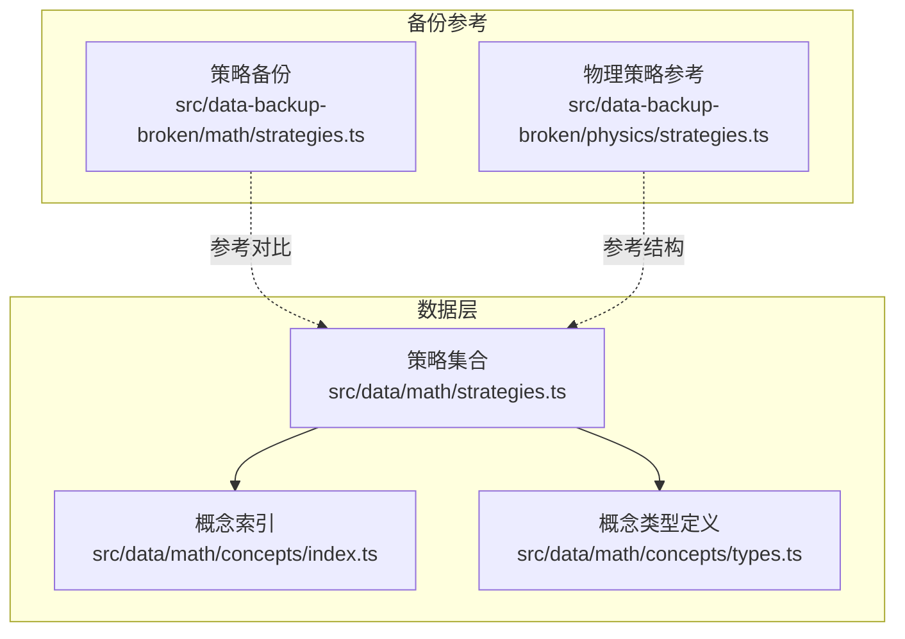
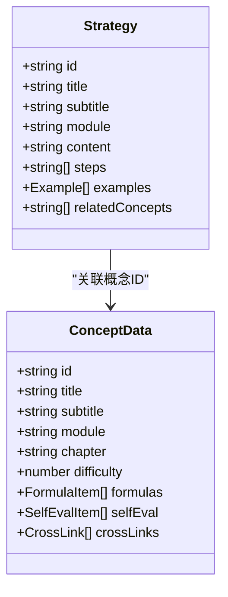
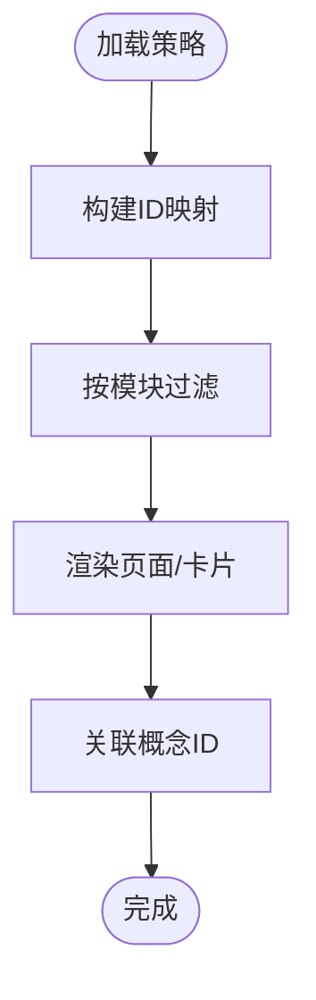
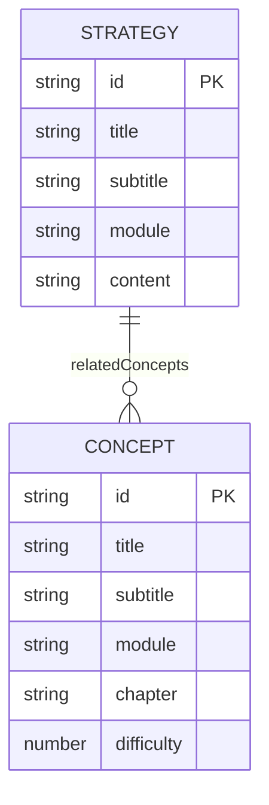
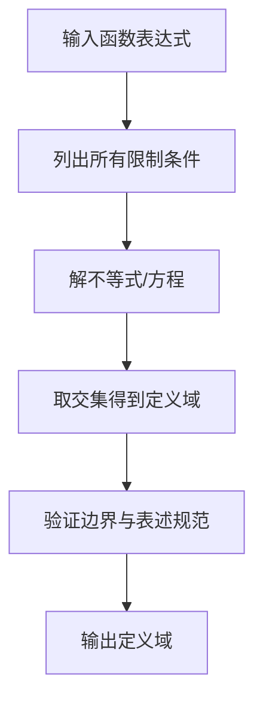
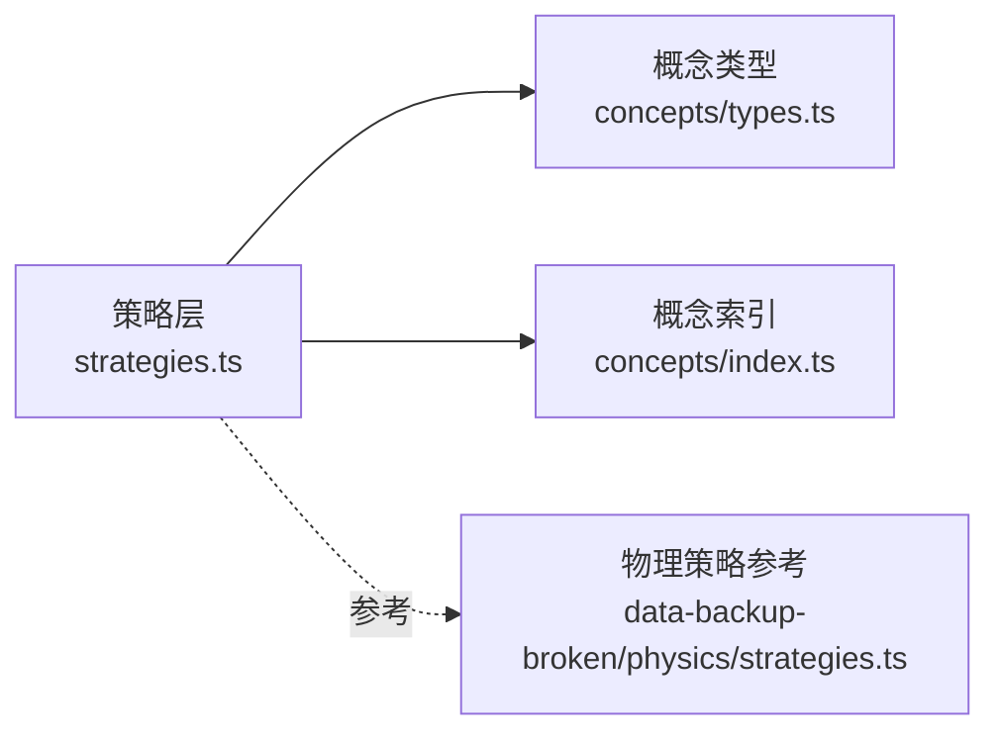

# 数学解题套路

<cite>
**本文引用的文件**
- [src/data/math/strategies.ts](file://src/data/math/strategies.ts)
- [src/data/math/concepts/index.ts](file://src/data/math/concepts/index.ts)
- [src/data/math/concepts/types.ts](file://src/data/math/concepts/types.ts)
- [src/data-backup-broken/math/strategies.ts](file://src/data-backup-broken/math/strategies.ts)
- [src/data-backup-broken/physics/strategies.ts](file://src/data-backup-broken/physics/strategies.ts)
</cite>

## 目录
1. [引言](#引言)
2. [项目结构](#项目结构)
3. [核心组件](#核心组件)
4. [架构总览](#架构总览)
5. [详细组件分析](#详细组件分析)
6. [依赖分析](#依赖分析)
7. [性能考虑](#性能考虑)
8. [故障排查指南](#故障排查指南)
9. [结论](#结论)
10. [附录](#附录)

## 引言
本文件系统化梳理星耀平台数学学科“R层解题套路”的组织与使用方式，覆盖90个核心解题套路的结构化呈现，并结合题型分类（选择题、填空题、解答题）与方法分类（代数法、几何法、函数法），解释套路与核心概念模型的关系，帮助学习者通过套路化训练提升解题效率与应试能力。

## 项目结构
数学R层解题套路位于数据层，采用“策略（Strategy）”与“概念（Concept）”双轨数据结构：
- 策略层：以“R01-R90”编号组织，描述解题步骤、示例与关联概念
- 概念层：以“K01-K75”编号组织，描述知识点的模块、章节、公式、变式与交叉链接

图表来源
- [src/data/math/strategies.ts:1-66](file://src/data/math/strategies.ts#L1-L66)
- [src/data/math/concepts/index.ts:1-119](file://src/data/math/concepts/index.ts#L1-L119)
- [src/data/math/concepts/types.ts:1-73](file://src/data/math/concepts/types.ts#L1-L73)
- [src/data-backup-broken/math/strategies.ts:1-57](file://src/data-backup-broken/math/strategies.ts#L1-L57)
- [src/data-backup-broken/physics/strategies.ts:1-37](file://src/data-backup-broken/physics/strategies.ts#L1-L37)

章节来源
- [src/data/math/strategies.ts:1-66](file://src/data/math/strategies.ts#L1-L66)
- [src/data/math/concepts/index.ts:1-119](file://src/data/math/concepts/index.ts#L1-L119)
- [src/data/math/concepts/types.ts:1-73](file://src/data/math/concepts/types.ts#L1-L73)

## 核心组件
- 策略接口（Strategy）：包含唯一标识、标题、副标题、模块、内容摘要、步骤列表、示例数组、相关概念ID列表
- 策略集合（allStrategies）：按模块分组的90个套路骨架，当前已实现约前2个（R01-R02）
- 策略映射（strategyDataMap）：按ID快速检索策略
- 模块查询（getStrategiesByModule）：按模块过滤策略
- 概念接口（ConceptData）：包含模块、章节、难度、公式、自测、交叉链接等字段
- 概念索引（allConcepts）：聚合75个核心概念，按模块与章节组织

章节来源
- [src/data/math/strategies.ts:7-16](file://src/data/math/strategies.ts#L7-L16)
- [src/data/math/strategies.ts:18-53](file://src/data/math/strategies.ts#L18-L53)
- [src/data/math/strategies.ts:55-65](file://src/data/math/strategies.ts#L55-L65)
- [src/data/math/concepts/types.ts:52-72](file://src/data/math/concepts/types.ts#L52-L72)
- [src/data/math/concepts/index.ts:82-119](file://src/data/math/concepts/index.ts#L82-L119)

## 架构总览
R层解题套路与概念层的耦合关系如下：
- 策略通过relatedConcepts关联概念ID（如K07、K09、K19）
- 概念通过chapter/module组织，策略按module分组，便于教学与练习
- 备份文件提供了与物理R层（PHY-R01~PHY-R90）相似的结构参考，便于统一规范

图表来源
- [src/data/math/strategies.ts:7-16](file://src/data/math/strategies.ts#L7-L16)
- [src/data/math/concepts/types.ts:52-72](file://src/data/math/concepts/types.ts#L52-L72)

## 详细组件分析

### 组件A：策略数据结构与模块化组织
- 设计要点
  - 使用ID（R01-R90）与模块（函数与导数、三角与向量、数列与归纳、立体几何、解析几何、概率与统计、复数等）双维度组织
  - 步骤列表标准化，便于形成可执行的解题流程
  - 示例数组提供“问题-解答”对，便于对照学习
  - relatedConcepts指向概念ID，建立“套路-知识”的双向链接
- 当前实现
  - 已实现R01-R02两个典型套路，覆盖函数定义域与单调性判断
  - 模块分组注释覆盖R01-R90的分布（函数与导数、三角与向量、数列与归纳、立体几何、解析几何、概率与统计、集合与逻辑、不等式、复数与平面向量）

图表来源
- [src/data/math/strategies.ts:55-65](file://src/data/math/strategies.ts#L55-L65)

章节来源
- [src/data/math/strategies.ts:18-53](file://src/data/math/strategies.ts#L18-L53)
- [src/data/math/strategies.ts:55-65](file://src/data/math/strategies.ts#L55-L65)

### 组件B：概念数据结构与模块化组织
- 设计要点
  - 概念按chapter/module组织，便于与教材章节对齐
  - 提供公式、变式、自测、交叉链接等丰富属性
  - relatedModels/crossLinks支撑“概念-模型-套路”的知识网络
- 与策略的关联
  - 策略通过relatedConcepts反向链接概念，形成“套路-知识”闭环

图表来源
- [src/data/math/concepts/types.ts:52-72](file://src/data/math/concepts/types.ts#L52-L72)
- [src/data/math/strategies.ts:14](file://src/data/math/strategies.ts#L14)

章节来源
- [src/data/math/concepts/index.ts:82-119](file://src/data/math/concepts/index.ts#L82-L119)
- [src/data/math/concepts/types.ts:12-31](file://src/data/math/concepts/types.ts#L12-L31)

### 组件C：题型与方法分类体系
- 题型分类（建议）
  - 选择题：侧重排除法、特殊值法、数形结合
  - 填空题：强调步骤严谨、结果准确、避免跳步
  - 解答题：强调条理清晰、格式规范、关键步骤必写
- 方法分类（建议）
  - 代数法：方程、不等式、函数、数列等
  - 几何法：平面几何、立体几何、解析几何、向量
  - 函数法：单调性、奇偶性、周期性、导数
- 与模块的对应
  - 函数与导数：函数法为主
  - 三角与向量：几何法与函数法并重
  - 解析几何：代数法与几何法融合
  - 立体几何：几何法与向量法
  - 概率与统计：代数法与枚举法
  - 数列与归纳：代数法与构造法
  - 复数：代数法与几何法

[本节为概念性说明，无需文件引用]

### 组件D：套路与核心模型的关系
- 核心模型（概念层）是套路的知识根基，套路是模型在具体题型中的应用模板
- 关联方式
  - 策略的relatedConcepts指向概念ID，体现“套路源于模型”
  - 概念的crossLinks与relatedModels体现“模型支撑多套路”
- 训练价值
  - 先掌握模型（概念），再迁移为套路，最后形成条件反射式的解题流程

[本节为概念性说明，无需文件引用]

### 组件E：从题目到答案的完整思维过程示例
以下以R01为例，展示典型流程（仅示意步骤，不展示具体代码）：
- 步骤1：审题与建模
  - 明确函数表达式与变量范围
  - 列出使表达式有意义的全部约束（分母不为零、根号下非负等）
- 步骤2：解约束
  - 将约束转化为不等式或方程并求解
- 步骤3：合并解集
  - 取各约束解集的交集，得到定义域
- 步骤4：验证与表述
  - 检查边界与特殊点，用区间形式规范表述

图表来源
- [src/data/math/strategies.ts:26](file://src/data/math/strategies.ts#L26)

章节来源
- [src/data/math/strategies.ts:20-31](file://src/data/math/strategies.ts#L20-L31)

### 组件F：与物理R层的结构对标
- 物理R层（PHY-R01~PHY-R90）采用Routine接口，包含category、difficulty、oneLine、coreSteps、applicableTypes、commonMistakes、memoryTip等字段
- 数学R层（R01~R90）采用Strategy接口，字段更贴近“步骤+示例+关联概念”的教学形态
- 对标的积极意义
  - 统一编号与层级，便于跨学科比较与迁移
  - 保持教学目标一致：从“套路”到“模型”，再到“迁移应用”

章节来源
- [src/data-backup-broken/physics/strategies.ts:1-37](file://src/data-backup-broken/physics/strategies.ts#L1-L37)
- [src/data/math/strategies.ts:1-6](file://src/data/math/strategies.ts#L1-L6)

## 依赖分析
- 策略层依赖概念层的类型定义与索引，用于ID映射与模块过滤
- 策略层与概念层之间通过relatedConcepts/crossLinks建立弱耦合关联
- 备份文件提供结构参考，便于后续扩展至R03~R90

图表来源
- [src/data/math/strategies.ts:5-6](file://src/data/math/strategies.ts#L5-L6)
- [src/data/math/concepts/types.ts:1-73](file://src/data/math/concepts/types.ts#L1-L73)
- [src/data/math/concepts/index.ts:1-119](file://src/data/math/concepts/index.ts#L1-L119)
- [src/data-backup-broken/physics/strategies.ts:1-37](file://src/data-backup-broken/physics/strategies.ts#L1-L37)

章节来源
- [src/data/math/strategies.ts:5-6](file://src/data/math/strategies.ts#L5-L6)
- [src/data/math/concepts/types.ts:1-73](file://src/data/math/concepts/types.ts#L1-L73)
- [src/data/math/concepts/index.ts:1-119](file://src/data/math/concepts/index.ts#L1-L119)

## 性能考虑
- 数据规模
  - 策略与概念均为静态聚合，加载成本低
- 查询性能
  - ID映射（strategyDataMap）支持O(1)检索
  - 模块过滤（getStrategiesByModule）为线性扫描，适合小到中等规模
- 扩展建议
  - 若未来策略数量增长，可引入二级索引（如按module+chapter）
  - 对示例与公式等字段可做懒加载或分包

[本节为通用建议，无需文件引用]

## 故障排查指南
- 现象：策略ID重复或缺失
  - 排查：确认ID是否符合R01-R90命名规范，检查strategyDataMap构建逻辑
  - 参考：策略映射与查询函数
- 现象：模块过滤结果为空
  - 排查：确认模块名称与概念索引中的模块一致
  - 参考：模块过滤函数与概念索引
- 现象：相关概念ID不存在
  - 排查：确认relatedConcepts中的ID在概念索引中存在
  - 参考：概念索引与类型定义

章节来源
- [src/data/math/strategies.ts:55-65](file://src/data/math/strategies.ts#L55-L65)
- [src/data/math/concepts/index.ts:82-119](file://src/data/math/concepts/index.ts#L82-L119)

## 结论
数学R层解题套路以“策略-概念”双轨结构实现知识到方法的高效迁移。通过模块化组织与题型/方法分类，配合套路化训练，可显著提升解题效率与应试能力。建议后续按模块逐步完善R03~R90，并配套题型与模型的交叉标注，形成可教、可用、可评的完整体系。

## 附录
- 章节来源
  - [src/data/math/strategies.ts:1-66](file://src/data/math/strategies.ts#L1-L66)
  - [src/data/math/concepts/index.ts:1-119](file://src/data/math/concepts/index.ts#L1-L119)
  - [src/data/math/concepts/types.ts:1-73](file://src/data/math/concepts/types.ts#L1-L73)
  - [src/data-backup-broken/math/strategies.ts:1-57](file://src/data-backup-broken/math/strategies.ts#L1-L57)
  - [src/data-backup-broken/physics/strategies.ts:1-37](file://src/data-backup-broken/physics/strategies.ts#L1-L37)