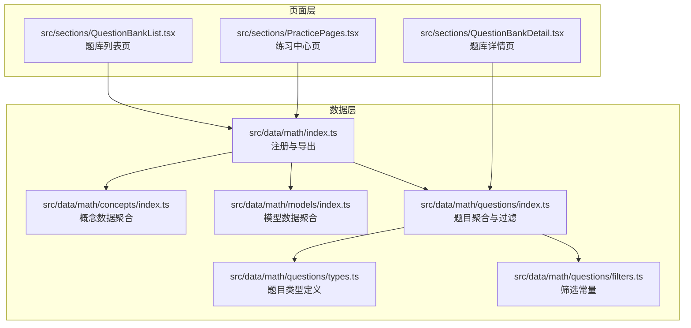
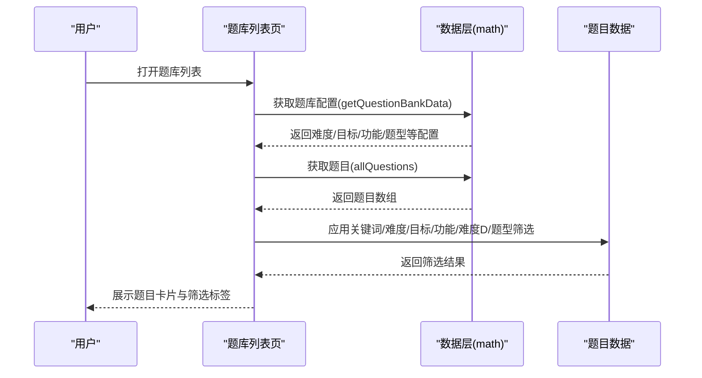
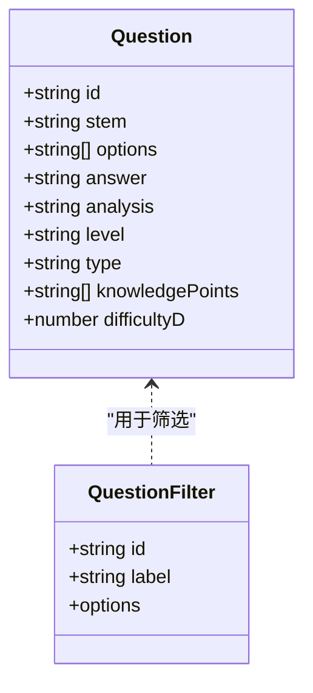
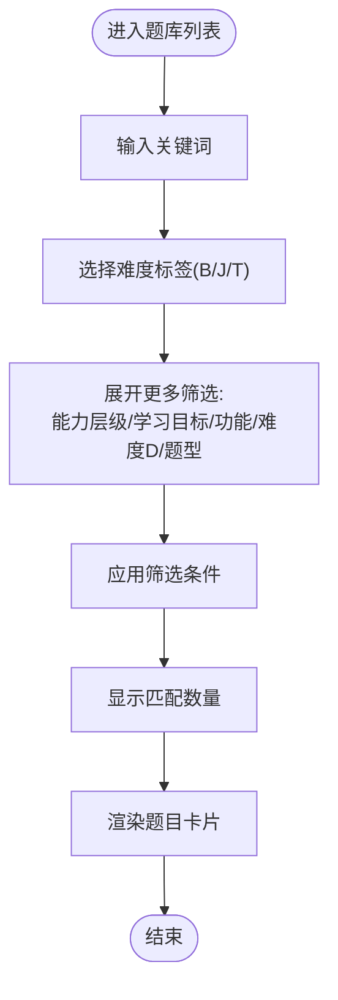
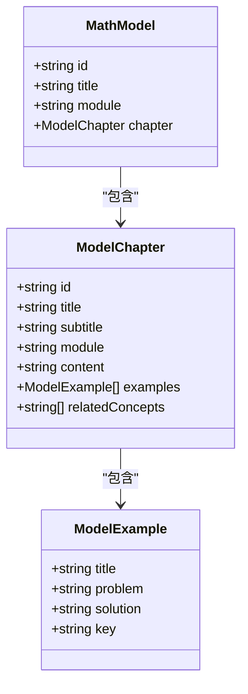
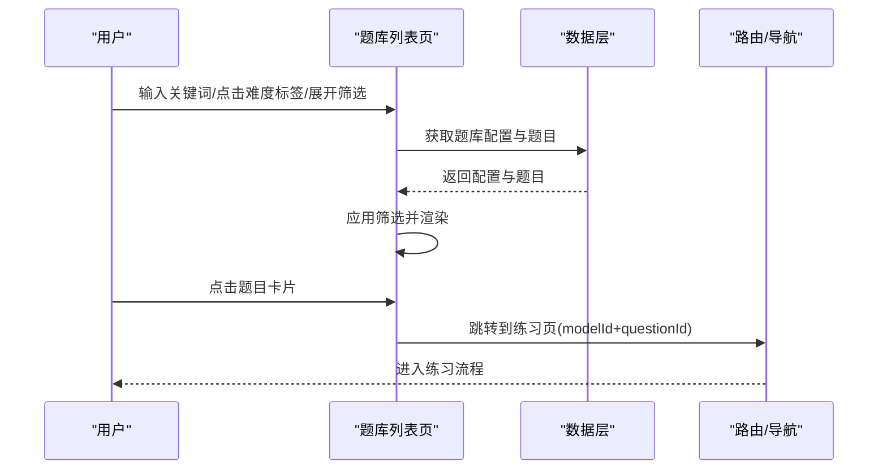
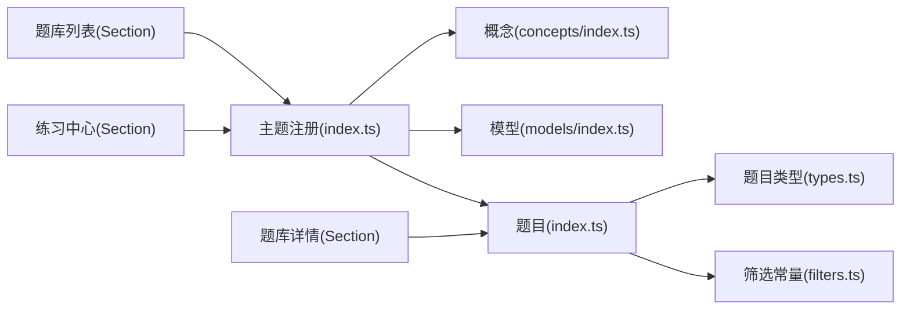

# 数学题库系统

<cite>
**本文引用的文件**
- [src/data/math/index.ts](file://src/data/math/index.ts)
- [src/data/math/questions/index.ts](file://src/data/math/questions/index.ts)
- [src/data/math/questions/types.ts](file://src/data/math/questions/types.ts)
- [src/data/math/questions/filters.ts](file://src/data/math/questions/filters.ts)
- [src/data/math/models/index.ts](file://src/data/math/models/index.ts)
- [src/data/math/models/types.ts](file://src/data/math/models/types.ts)
- [src/data/math/concepts/index.ts](file://src/data/math/concepts/index.ts)
- [src/data/math/concepts/types.ts](file://src/data/math/concepts/types.ts)
- [src/data/math/models/MATHF01_函数的基本性质.ts](file://src/data/math/models/MATHF01_函数的基本性质.ts)
- [src/data/math/models/MATHT01_三角函数基础.ts](file://src/data/math/models/MATHT01_三角函数基础.ts)
- [src/sections/QuestionBankList.tsx](file://src/sections/QuestionBankList.tsx)
- [src/sections/QuestionBankDetail.tsx](file://src/sections/QuestionBankDetail.tsx)
- [src/sections/PracticePages.tsx](file://src/sections/PracticePages.tsx)
</cite>

## 目录
1. [引言](#引言)
2. [项目结构](#项目结构)
3. [核心组件](#核心组件)
4. [架构总览](#架构总览)
5. [详细组件分析](#详细组件分析)
6. [依赖分析](#依赖分析)
7. [性能考虑](#性能考虑)
8. [故障排查指南](#故障排查指南)
9. [结论](#结论)
10. [附录](#附录)

## 引言
本文件面向星耀平台数学学科的题库系统，系统性阐述数学P层练习题库的设计理念、组织结构与使用方式。文档聚焦以下关键点：
- 题目分类体系：按能力层级（L1/L2/L3）、学习目标（同步学习/期中期末/高考专项/竞赛拓展）、题目功能（巩固练习/复习检测/诊断评估/真题演练）、难度等级（基础B、进阶J、挑战T）与题型（选择/填空/判断/解答）进行组织。
- 标签系统与筛选机制：支持关键词搜索、难度标签、目标类型、功能类型、难度等级D与题型等多维筛选。
- 智能推荐与模型关联：通过“模型”（MathModel）将题目与核心知识范式绑定，实现基于模型的题目聚合与导航。
- 使用指南：如何依据学习进度选择合适难度题目、如何利用错题本进行针对性练习、如何结合模型巩固知识点。
- 个性化学习与能力评估：通过题库的多维筛选与模型导航，实现因材施教与能力画像。

## 项目结构
数学题库系统采用“数据层 + 页面层”的分层架构：
- 数据层：负责数学学科的知识概念、模型、公式与题目数据的聚合与导出，并提供查询接口。
- 页面层：提供题库列表、题库详情、练习中心等页面，承载筛选、标签、导航与交互。

图表来源
- [src/data/math/index.ts:126-151](file://src/data/math/index.ts#L126-L151)
- [src/data/math/questions/index.ts:1-13](file://src/data/math/questions/index.ts#L1-13)
- [src/data/math/questions/types.ts:4-21](file://src/data/math/questions/types.ts#L4-L21)
- [src/data/math/questions/filters.ts:1-25](file://src/data/math/questions/filters.ts#L1-L25)
- [src/data/math/models/index.ts:1-56](file://src/data/math/models/index.ts#L1-L56)
- [src/data/math/concepts/index.ts:1-119](file://src/data/math/concepts/index.ts#L1-L119)
- [src/sections/QuestionBankList.tsx:29-424](file://src/sections/QuestionBankList.tsx#L29-L424)
- [src/sections/QuestionBankDetail.tsx:92-185](file://src/sections/QuestionBankDetail.tsx#L92-L185)
- [src/sections/PracticePages.tsx:88-375](file://src/sections/PracticePages.tsx#L88-L375)

章节来源
- [src/data/math/index.ts:126-151](file://src/data/math/index.ts#L126-L151)
- [src/data/math/questions/index.ts:1-13](file://src/data/math/questions/index.ts#L1-L13)
- [src/data/math/questions/types.ts:4-21](file://src/data/math/questions/types.ts#L4-L21)
- [src/data/math/questions/filters.ts:1-25](file://src/data/math/questions/filters.ts#L1-L25)
- [src/data/math/models/index.ts:1-56](file://src/data/math/models/index.ts#L1-L56)
- [src/data/math/concepts/index.ts:1-119](file://src/data/math/concepts/index.ts#L1-L119)
- [src/sections/QuestionBankList.tsx:29-424](file://src/sections/QuestionBankList.tsx#L29-L424)
- [src/sections/QuestionBankDetail.tsx:92-185](file://src/sections/QuestionBankDetail.tsx#L92-L185)
- [src/sections/PracticePages.tsx:88-375](file://src/sections/PracticePages.tsx#L88-L375)

## 核心组件
- 主题注册与数据导出：通过统一入口注册数学学科数据，提供概念、模型、公式、策略与题库数据的访问接口。
- 题库数据与类型：定义题目字段（题干、选项、答案、解析、层级、类型、知识点、难度D等），并提供按模型分组与过滤查询。
- 筛选常量：定义能力层级、题型、模块等筛选维度，供前端页面使用。
- 页面组件：题库列表页支持关键词搜索、难度标签与多维筛选；题库详情页按难度分块展示题目；练习中心页提供多种练习模式与难度说明。

章节来源
- [src/data/math/index.ts:66-100](file://src/data/math/index.ts#L66-L100)
- [src/data/math/questions/types.ts:4-21](file://src/data/math/questions/types.ts#L4-L21)
- [src/data/math/questions/filters.ts:3-25](file://src/data/math/questions/filters.ts#L3-L25)
- [src/sections/QuestionBankList.tsx:29-424](file://src/sections/QuestionBankList.tsx#L29-L424)
- [src/sections/QuestionBankDetail.tsx:92-185](file://src/sections/QuestionBankDetail.tsx#L92-L185)
- [src/sections/PracticePages.tsx:88-375](file://src/sections/PracticePages.tsx#L88-L375)

## 架构总览
数学题库系统围绕“主题注册 + 数据聚合 + 页面渲染”的模式组织，核心流程如下：
- 数据层：在数学主题注册中导出题库配置（难度标签、颜色、层级、目标、功能、难度D、题型等），并提供题目聚合与按模型分组。
- 页面层：题库列表页接收筛选参数，调用数据层接口获取题目并渲染；题库详情页按模型聚合题目并按难度分块；练习中心页提供模式与难度说明。

图表来源
- [src/data/math/index.ts:66-100](file://src/data/math/index.ts#L66-L100)
- [src/sections/QuestionBankList.tsx:29-424](file://src/sections/QuestionBankList.tsx#L29-L424)

## 详细组件分析

### 题库数据与类型
- 题目字段：包含题干、选项、答案、解析、层级（A/B/C）、类型、知识点数组、难度D（数值1/2/3）等。
- 聚合与过滤：提供allQuestions与按模型分组的映射，以及按过滤条件返回题目集的函数占位（待填充）。
- 筛选常量：定义能力层级（L1/L2/L3）、学习目标（同步学习/期中期末/高考专项/竞赛拓展）、题目功能（巩固练习/复习检测/诊断评估/真题演练）、难度等级D（1/2/3）、题型（选择/填空/判断/解答）等。

图表来源
- [src/data/math/questions/types.ts:4-21](file://src/data/math/questions/types.ts#L4-L21)

章节来源
- [src/data/math/questions/types.ts:4-21](file://src/data/math/questions/types.ts#L4-L21)
- [src/data/math/questions/index.ts:1-13](file://src/data/math/questions/index.ts#L1-L13)
- [src/data/math/questions/filters.ts:3-25](file://src/data/math/questions/filters.ts#L3-L25)

### 题库筛选机制与标签系统
- 关键词搜索：支持在题干与标签中检索。
- 难度标签：B/J/T三层标签与颜色映射，便于快速识别。
- 能力层级：L1/L2/L3，对应不同学习阶段。
- 学习目标：同步学习、期中期末、高考专项、竞赛拓展。
- 题目功能：巩固练习、复习检测、诊断评估、真题演练。
- 难度等级D：1/2/3，与B/J/T形成互补。
- 题型：选择、填空、判断、解答。

图表来源
- [src/sections/QuestionBankList.tsx:29-424](file://src/sections/QuestionBankList.tsx#L29-L424)
- [src/data/math/index.ts:66-100](file://src/data/math/index.ts#L66-L100)

章节来源
- [src/sections/QuestionBankList.tsx:29-424](file://src/sections/QuestionBankList.tsx#L29-L424)
- [src/data/math/index.ts:66-100](file://src/data/math/index.ts#L66-L100)

### 题目与核心模型的对应关系
- 模型聚合：数学模型按模块（函数与导数、三角与向量、数列与归纳、立体几何、解析几何、概率与统计、集合与逻辑、复数）组织。
- 模型类型：每个模型包含章节标题、子标题、模块、内容、示例与关联概念。
- 题目与模型：题目对象包含modelId字段，页面层按modelId进行聚合与导航，详情页按难度分块展示。

图表来源
- [src/data/math/models/types.ts:21-27](file://src/data/math/models/types.ts#L21-L27)
- [src/data/math/models/types.ts:4-19](file://src/data/math/models/types.ts#L4-L19)

章节来源
- [src/data/math/models/index.ts:1-56](file://src/data/math/models/index.ts#L1-L56)
- [src/data/math/models/types.ts:21-27](file://src/data/math/models/types.ts#L21-L27)
- [src/data/math/models/MATHF01_函数的基本性质.ts:4-24](file://src/data/math/models/MATHF01_函数的基本性质.ts#L4-L24)
- [src/data/math/models/MATHT01_三角函数基础.ts:4-24](file://src/data/math/models/MATHT01_三角函数基础.ts#L4-L24)

### 题库页面与交互流程
- 题库列表页：支持关键词搜索、难度标签切换、多维筛选面板展开/收起、筛选标签展示与一键清除、题目卡片展示与跳转。
- 题库详情页：按模型聚合题目，按难度分块（B/J/T），支持题型筛选，展示题目概览与开始练习入口。
- 练习中心页：提供多种练习模式（知识点练习、章节测试、考试真题、竞赛练习），说明B/J/T难度与章节导航。

图表来源
- [src/sections/QuestionBankList.tsx:29-424](file://src/sections/QuestionBankList.tsx#L29-L424)
- [src/sections/QuestionBankDetail.tsx:92-185](file://src/sections/QuestionBankDetail.tsx#L92-L185)
- [src/sections/PracticePages.tsx:88-375](file://src/sections/PracticePages.tsx#L88-L375)

章节来源
- [src/sections/QuestionBankList.tsx:29-424](file://src/sections/QuestionBankList.tsx#L29-L424)
- [src/sections/QuestionBankDetail.tsx:92-185](file://src/sections/QuestionBankDetail.tsx#L92-L185)
- [src/sections/PracticePages.tsx:88-375](file://src/sections/PracticePages.tsx#L88-L375)

### 智能推荐与个性化学习
- 基于模型的推荐：通过modelId将题目与核心模型绑定，用户可按知识点模型进行针对性练习，实现“模型驱动”的智能推荐。
- 多维筛选：结合能力层级、学习目标、功能类型、难度D与题型，帮助用户快速定位符合当前学习阶段与目标的题目。
- 错题本建议：页面层提供“清除筛选”“返回列表”等交互，便于用户在练习后回溯与调整策略，配合后台错题记录可实现个性化巩固。

章节来源
- [src/data/math/index.ts:116-124](file://src/data/math/index.ts#L116-L124)
- [src/sections/QuestionBankList.tsx:29-424](file://src/sections/QuestionBankList.tsx#L29-L424)

## 依赖分析
- 数据层依赖：数学主题注册依赖概念、模型、公式、策略与题目数据模块；题目模块进一步依赖类型与筛选常量。
- 页面层依赖：题库列表与详情依赖数据层提供的题库配置与题目数据；练习中心页依赖主题注册提供的模型与配置。

图表来源
- [src/data/math/index.ts:126-151](file://src/data/math/index.ts#L126-L151)
- [src/data/math/questions/index.ts:1-13](file://src/data/math/questions/index.ts#L1-L13)
- [src/data/math/questions/types.ts:4-21](file://src/data/math/questions/types.ts#L4-L21)
- [src/data/math/questions/filters.ts:1-25](file://src/data/math/questions/filters.ts#L1-L25)
- [src/sections/QuestionBankList.tsx:29-424](file://src/sections/QuestionBankList.tsx#L29-L424)
- [src/sections/QuestionBankDetail.tsx:92-185](file://src/sections/QuestionBankDetail.tsx#L92-L185)
- [src/sections/PracticePages.tsx:88-375](file://src/sections/PracticePages.tsx#L88-L375)

章节来源
- [src/data/math/index.ts:126-151](file://src/data/math/index.ts#L126-L151)
- [src/data/math/questions/index.ts:1-13](file://src/data/math/questions/index.ts#L1-L13)
- [src/data/math/questions/types.ts:4-21](file://src/data/math/questions/types.ts#L4-L21)
- [src/data/math/questions/filters.ts:1-25](file://src/data/math/questions/filters.ts#L1-L25)
- [src/sections/QuestionBankList.tsx:29-424](file://src/sections/QuestionBankList.tsx#L29-L424)
- [src/sections/QuestionBankDetail.tsx:92-185](file://src/sections/QuestionBankDetail.tsx#L92-L185)
- [src/sections/PracticePages.tsx:88-375](file://src/sections/PracticePages.tsx#L88-L375)

## 性能考虑
- 前端筛选性能：当前题目数组在客户端进行过滤，建议在题目规模扩大后引入服务端分页与条件索引，减少一次性渲染压力。
- 渲染优化：列表页对题干进行截断与清理，避免长文本影响布局；详情页按难度分块折叠，降低首屏渲染复杂度。
- 数据懒加载：模型与题目数据可按需加载，避免一次性导入过多模块导致首屏卡顿。

## 故障排查指南
- 题库为空：确认数据层是否正确导出allQuestions与按模型分组映射；检查页面筛选条件是否过于严格导致无结果。
- 题目无法跳转：检查题目对象是否包含modelId与questionId；确认路由参数拼接是否正确。
- 难度标签不显示：确认数据层getQuestionBankData返回的DIFF_LABEL与DIFF_COLOR是否正确传入页面组件。
- 筛选无效：检查getQuestionsByFilter函数是否已实现；若为占位实现，需完善过滤逻辑。

章节来源
- [src/data/math/questions/index.ts:10-12](file://src/data/math/questions/index.ts#L10-L12)
- [src/sections/QuestionBankList.tsx:69-83](file://src/sections/QuestionBankList.tsx#L69-L83)

## 结论
数学题库系统以“主题注册 + 数据聚合 + 页面渲染”为核心，围绕多维筛选、模型绑定与难度分层，构建了可扩展、可维护的题库体系。通过能力层级、学习目标、功能类型、难度D与题型的协同，用户可以高效地进行个性化学习与能力评估；通过模型与题目的对应关系，实现知识点巩固与迁移应用。未来可在服务端筛选、分页与索引方面进一步优化，以支撑更大规模的题目数据。

## 附录
- 使用指南
  - 选择合适难度：根据学习进度选择L1/L2/L3与B/J/T，逐步提升。
  - 利用筛选：先用关键词/难度标签快速定位，再用目标/功能/题型细化。
  - 模型导航：在练习中心按知识点模型进行针对性训练，结合题库详情页按难度分块练习。
  - 错题本：结合页面的“清除筛选/返回列表”，在练习后回溯与调整策略，实现精准巩固。
- 个性化与评估
  - 通过“诊断评估”功能与“真题演练”模式，结合模型掌握情况，形成个人能力画像。
  - 利用“学习目标”与“功能类型”筛选，构建阶段性学习计划与测评方案。