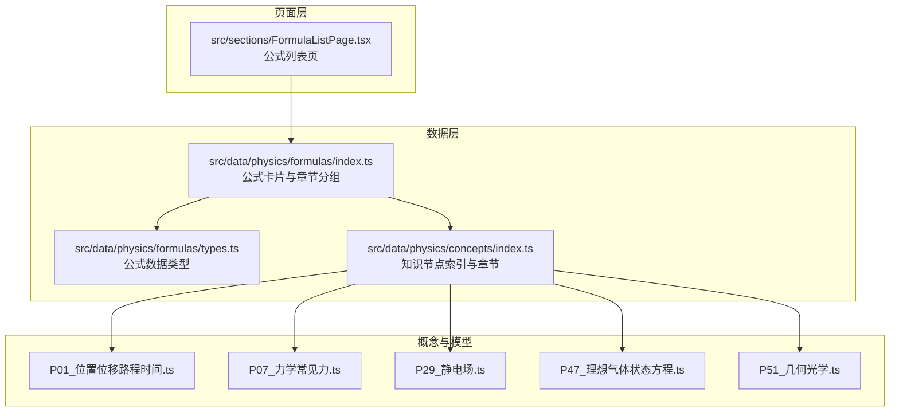
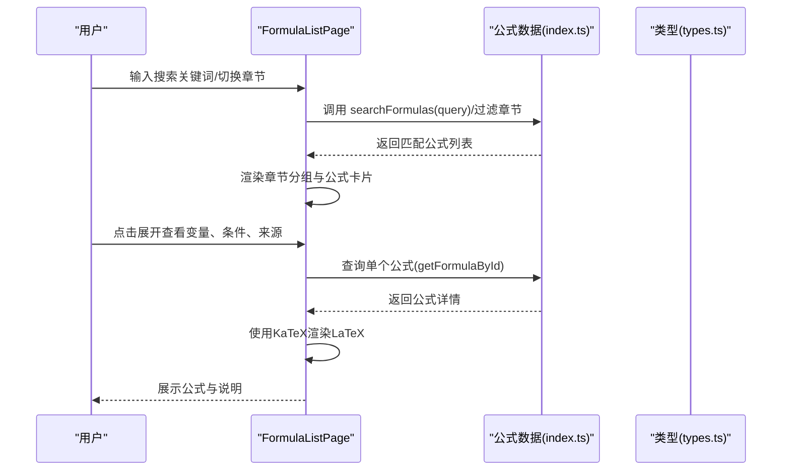
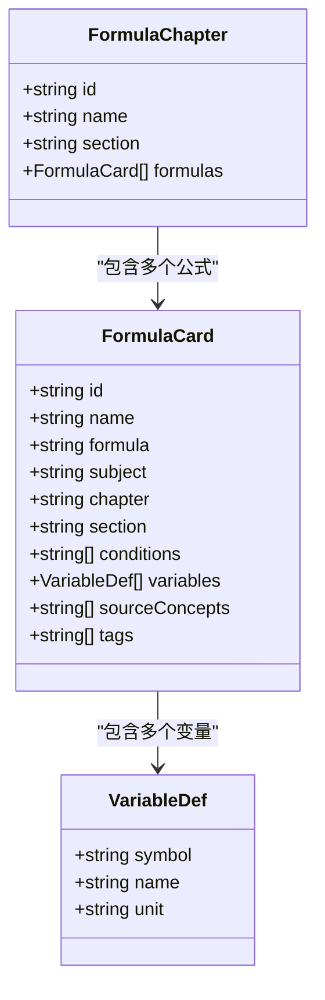
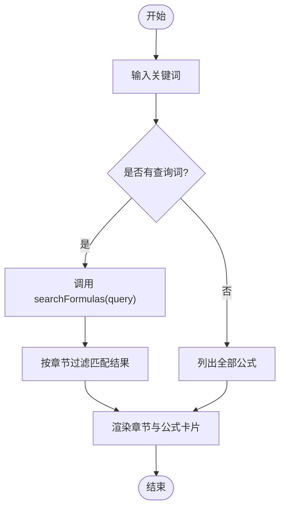
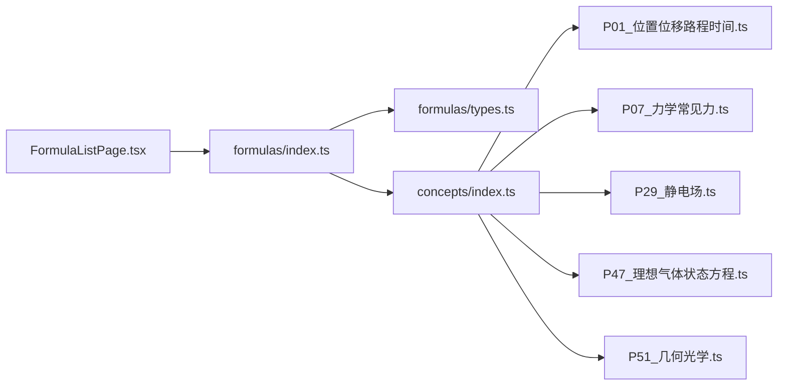

# 物理公式章节

<cite>
**本文引用的文件**
- [src/data/physics/formulas/index.ts](file://src/data/physics/formulas/index.ts)
- [src/data/physics/formulas/types.ts](file://src/data/physics/formulas/types.ts)
- [src/data/physics/concepts/index.ts](file://src/data/physics/concepts/index.ts)
- [src/data/physics/concepts/P01_位置位移路程时间.ts](file://src/data/physics/concepts/P01_位置位移路程时间.ts)
- [src/data/physics/concepts/P07_力学常见力.ts](file://src/data/physics/concepts/P07_力学常见力.ts)
- [src/data/physics/concepts/P29_静电场.ts](file://src/data/physics/concepts/P29_静电场.ts)
- [src/data/physics/concepts/P47_理想气体状态方程.ts](file://src/data/physics/concepts/P47_理想气体状态方程.ts)
- [src/data/physics/concepts/P51_几何光学.ts](file://src/data/physics/concepts/P51_几何光学.ts)
- [src/sections/FormulaListPage.tsx](file://src/sections/FormulaListPage.tsx)
</cite>

## 目录
1. [简介](#简介)
2. [项目结构](#项目结构)
3. [核心组件](#核心组件)
4. [架构总览](#架构总览)
5. [详细组件分析](#详细组件分析)
6. [依赖分析](#依赖分析)
7. [性能考虑](#性能考虑)
8. [故障排查指南](#故障排查指南)
9. [结论](#结论)
10. [附录](#附录)

## 简介
本章节围绕星耀平台物理学科“公式库”的组织与呈现，系统梳理公式数据结构、分类体系、检索机制与页面交互，并阐明公式与知识节点、核心模型的对应关系。文档覆盖运动学、力学、曲线运动与万有引力、能量与动量、电磁学、热学、机械波与光学、近代物理等模块，帮助教师与学生高效定位、理解与应用物理公式。

## 项目结构
- 公式数据位于物理数据层，采用“公式卡片”与“章节分组”两种结构组织，便于前端按模块浏览与按关键词检索。
- 页面组件负责渲染公式列表、章节筛选、搜索输入与公式详情展开，使用 KaTeX 渲染 LaTeX 公式。
- 知识节点与模型文件提供概念背景、推导与跨学科联系，支撑公式来源与应用情境。

图表来源
- [src/data/physics/formulas/index.ts](file://src/data/physics/formulas/index.ts)
- [src/data/physics/formulas/types.ts](file://src/data/physics/formulas/types.ts)
- [src/data/physics/concepts/index.ts](file://src/data/physics/concepts/index.ts)
- [src/sections/FormulaListPage.tsx](file://src/sections/FormulaListPage.tsx)

章节来源
- [src/data/physics/formulas/index.ts](file://src/data/physics/formulas/index.ts)
- [src/data/physics/formulas/types.ts](file://src/data/physics/formulas/types.ts)
- [src/data/physics/concepts/index.ts](file://src/data/physics/concepts/index.ts)
- [src/sections/FormulaListPage.tsx](file://src/sections/FormulaListPage.tsx)

## 核心组件
- 公式卡片（FormulaCard）
  - 字段：唯一标识、名称、LaTeX 表达式、所属学科、章节、小节、适用条件、变量定义、来源知识节点、标签等。
  - 用途：承载单个公式的完整元信息，支持渲染与检索。
- 章节分组（FormulaChapter）
  - 字段：章节标识、名称、小节、公式列表。
  - 用途：按模块分组展示，便于导航与筛选。
- 检索函数
  - 支持按名称、LaTeX 内容、标签、变量名进行模糊检索。
- 页面组件（FormulaListPage）
  - 提供搜索框、章节筛选按钮、公式折叠详情面板，使用 KaTeX 渲染公式。

章节来源
- [src/data/physics/formulas/types.ts](file://src/data/physics/formulas/types.ts)
- [src/data/physics/formulas/index.ts](file://src/data/physics/formulas/index.ts)
- [src/sections/FormulaListPage.tsx](file://src/sections/FormulaListPage.tsx)

## 架构总览
公式库采用“数据-页面-概念/模型”三层协作：
- 数据层：集中维护公式卡片与章节分组，提供检索与查询能力。
- 页面层：负责 UI 展示、用户交互与公式详情展开。
- 概念/模型层：提供公式来源、推导背景与跨学科联系，辅助理解与应用。

图表来源
- [src/sections/FormulaListPage.tsx](file://src/sections/FormulaListPage.tsx)
- [src/data/physics/formulas/index.ts](file://src/data/physics/formulas/index.ts)
- [src/data/physics/formulas/types.ts](file://src/data/physics/formulas/types.ts)

## 详细组件分析

### 公式数据结构与类型
- FormulaCard
  - 关键字段：id、name、formula、chapter、section、conditions、variables、sourceConcepts、tags。
  - 变量定义包含符号、名称与单位，便于统一展示与教学。
- FormulaChapter
  - 依据 section 将公式分组，形成“运动学”“力学”“曲线运动”“万有引力”“能量与动量”“电磁学”“热学”“机械波与光学”“近代物理”等模块。
- 检索机制
  - searchFormulas：支持名称、LaTeX、标签、变量名的模糊匹配，提升检索效率与准确性。

图表来源
- [src/data/physics/formulas/types.ts](file://src/data/physics/formulas/types.ts)
- [src/data/physics/formulas/index.ts](file://src/data/physics/formulas/index.ts)

章节来源
- [src/data/physics/formulas/types.ts](file://src/data/physics/formulas/types.ts)
- [src/data/physics/formulas/index.ts](file://src/data/physics/formulas/index.ts)

### 公式分类体系与模块划分
- 运动学：描述运动的语言、匀变速直线运动、自由落体与竖直上抛等。
- 力学：常见力（重力、弹力、摩擦力）、牛顿三定律、力的合成与分解等。
- 曲线运动与万有引力：抛体运动、圆周运动、向心力、万有引力定律、天体运动、开普勒三定律等。
- 能量与动量：功与功率、动能与动能定理、重力势能与弹性势能、机械能守恒、动量与冲量、动量定理与动量守恒等。
- 电磁学：库仑定律、电场强度、电势差、电容器、恒定电流、欧姆定律、电阻定律、电功与电功率、闭合电路欧姆定律、安培力、洛伦兹力、带电粒子在磁场中运动、法拉第电磁感应定律、导体切割磁感线、变压器等。
- 热学：理想气体状态方程、热力学第一定律等。
- 机械波与光学：波速公式、折射定律、全反射与临界角等。
- 近代物理：光电效应方程、质能方程等。

章节来源
- [src/data/physics/formulas/index.ts](file://src/data/physics/formulas/index.ts)

### 搜索功能与检索机制
- 搜索入口：页面顶部输入框，支持实时检索。
- 检索范围：名称、LaTeX 表达式、标签、变量名。
- 筛选方式：支持按章节分组筛选，缩小结果集。
- 结果展示：折叠卡片形式，展开后显示变量说明、适用条件、来源知识节点与标签。

图表来源
- [src/sections/FormulaListPage.tsx](file://src/sections/FormulaListPage.tsx)
- [src/data/physics/formulas/index.ts](file://src/data/physics/formulas/index.ts)

章节来源
- [src/sections/FormulaListPage.tsx](file://src/sections/FormulaListPage.tsx)
- [src/data/physics/formulas/index.ts](file://src/data/physics/formulas/index.ts)

### 公式与知识节点、核心模型的对应关系
- 来源知识节点（sourceConcepts）
  - 每个公式标注来源概念 ID（如 P01、P07、P29、P47、P51），便于跳转至对应知识点，理解背景与推导。
- 核心模型（relatedModels）
  - 概念文件中关联核心模型编号，体现公式与模型的对应关系，有助于在解题中选择合适模型。
- 示例
  - P01：位置、位移、路程与时间，对应“位移定义式”等。
  - P07：重力、弹力、摩擦力，对应“重力公式”“胡克定律”“滑动摩擦力”等。
  - P29：电场强度、电势、电势能，对应“电场强度定义”“点电荷场强”“电势能”等。
  - P47：理想气体状态方程，对应“状态方程”“状态方程标准”“气体常数”等。
  - P51：几何光学，对应“折射定律”“临界角”“光速与折射率”等。

章节来源
- [src/data/physics/concepts/P01_位置位移路程时间.ts](file://src/data/physics/concepts/P01_位置位移路程时间.ts)
- [src/data/physics/concepts/P07_力学常见力.ts](file://src/data/physics/concepts/P07_力学常见力.ts)
- [src/data/physics/concepts/P29_静电场.ts](file://src/data/physics/concepts/P29_静电场.ts)
- [src/data/physics/concepts/P47_理想气体状态方程.ts](file://src/data/physics/concepts/P47_理想气体状态方程.ts)
- [src/data/physics/concepts/P51_几何光学.ts](file://src/data/physics/concepts/P51_几何光学.ts)

### 解题中的公式选择与应用要点
- 明确研究对象与过程
  - 识别是否为直线运动、曲线运动、热力学过程、电磁过程等，据此选择相应模块公式。
- 标清已知量与未知量
  - 对照公式变量定义，确保单位一致、符号明确。
- 关注适用条件
  - 如“匀变速直线运动”“恒力做功”“理想气体”“匀强电场”等，避免误用。
- 结合知识节点与模型
  - 通过来源概念与核心模型加深理解，提升建模与迁移能力。

章节来源
- [src/data/physics/formulas/index.ts](file://src/data/physics/formulas/index.ts)
- [src/data/physics/concepts/index.ts](file://src/data/physics/concepts/index.ts)

### 记忆技巧与应用示例
- 记忆技巧
  - 将公式与物理图像或生活实例绑定（如“位移=末位置-初位置”与GPS位移对比；“摩擦力提供动力”与传送带场景）。
  - 用口诀串联：如“电场强度定义E=F/q，电势能E_p=qφ，电势差U=Ed”。
- 应用示例
  - 运动学：已知初速度、加速度与时间，用速度公式与位移公式求末速度与位移。
  - 力学：斜面问题先受力分析，再根据牛顿定律与摩擦力公式列式。
  - 电磁学：带电粒子在磁场中做圆周运动，向心力由洛伦兹力提供，结合半径公式求解。
  - 热学：理想气体状态方程用于多过程问题，先写出初态与末态方程，再联立求解。
  - 光学：全反射条件为光从光密介质到光疏介质且入射角大于临界角。

章节来源
- [src/data/physics/concepts/P01_位置位移路程时间.ts](file://src/data/physics/concepts/P01_位置位移路程时间.ts)
- [src/data/physics/concepts/P07_力学常见力.ts](file://src/data/physics/concepts/P07_力学常见力.ts)
- [src/data/physics/concepts/P29_静电场.ts](file://src/data/physics/concepts/P29_静电场.ts)
- [src/data/physics/concepts/P47_理想气体状态方程.ts](file://src/data/physics/concepts/P47_理想气体状态方程.ts)
- [src/data/physics/concepts/P51_几何光学.ts](file://src/data/physics/concepts/P51_几何光学.ts)

## 依赖分析
- 组件耦合
  - 页面组件依赖公式数据模块提供的检索与分组接口。
  - 公式数据模块依赖类型定义，保证字段一致性。
  - 知识节点索引为公式来源提供导航与交叉链接。
- 外部依赖
  - KaTeX：用于渲染 LaTeX 公式，提升公式可读性。
- 潜在风险
  - 若公式变量定义缺失或不一致，可能导致页面渲染异常或误导理解。
  - 检索关键词与标签需持续完善，以提升命中率。

图表来源
- [src/sections/FormulaListPage.tsx](file://src/sections/FormulaListPage.tsx)
- [src/data/physics/formulas/index.ts](file://src/data/physics/formulas/index.ts)
- [src/data/physics/formulas/types.ts](file://src/data/physics/formulas/types.ts)
- [src/data/physics/concepts/index.ts](file://src/data/physics/concepts/index.ts)
- [src/data/physics/concepts/P01_位置位移路程时间.ts](file://src/data/physics/concepts/P01_位置位移路程时间.ts)
- [src/data/physics/concepts/P07_力学常见力.ts](file://src/data/physics/concepts/P07_力学常见力.ts)
- [src/data/physics/concepts/P29_静电场.ts](file://src/data/physics/concepts/P29_静电场.ts)
- [src/data/physics/concepts/P47_理想气体状态方程.ts](file://src/data/physics/concepts/P47_理想气体状态方程.ts)
- [src/data/physics/concepts/P51_几何光学.ts](file://src/data/physics/concepts/P51_几何光学.ts)

章节来源
- [src/sections/FormulaListPage.tsx](file://src/sections/FormulaListPage.tsx)
- [src/data/physics/formulas/index.ts](file://src/data/physics/formulas/index.ts)
- [src/data/physics/formulas/types.ts](file://src/data/physics/formulas/types.ts)
- [src/data/physics/concepts/index.ts](file://src/data/physics/concepts/index.ts)

## 性能考虑
- 检索复杂度
  - searchFormulas 为 O(n) 遍历，n 为公式总数；当前规模较小，性能可接受。
- 渲染优化
  - 使用折叠面板延迟渲染详情，减少一次性 DOM 渲染压力。
  - KaTeX 渲染建议在客户端按需执行，避免重复计算。
- 建议
  - 若公式规模扩大，可引入索引字段（如关键词向量化）与分页加载，进一步优化检索与渲染性能。

## 故障排查指南
- 搜索无结果
  - 检查关键词是否包含公式名称、LaTeX 或变量名；尝试缩小至某一章节。
- 公式显示异常
  - 确认公式字段为合法 LaTeX 表达式；检查 KaTeX 渲染配置。
- 章节筛选无效
  - 确认 activeSection 状态更新与分组逻辑一致；检查章节名称与过滤条件。
- 导航到概念页面失败
  - 检查 sourceConcepts 是否存在于概念索引；确认路由参数与主题 ID 一致。

章节来源
- [src/sections/FormulaListPage.tsx](file://src/sections/FormulaListPage.tsx)
- [src/data/physics/formulas/index.ts](file://src/data/physics/formulas/index.ts)

## 结论
星耀平台物理公式章节以“公式卡片+章节分组+检索机制”为核心，配合知识节点与核心模型，形成“可检索、可溯源、可应用”的公式体系。通过明确模块划分、适用条件与使用注意事项，并结合记忆技巧与示例，能够有效提升学生对公式的理解与应用能力。建议持续完善检索关键词与标签，增强跨模块关联，进一步提升学习体验。

## 附录
- 快速定位公式
  - 使用页面顶部搜索框输入“公式名称/变量/标签”，或点击章节按钮按模块筛选。
- 查看公式详情
  - 点击公式卡片展开，查看变量说明、适用条件、来源知识节点与标签。
- 跳转到概念
  - 在“来源知识节点”区域点击 ID，跳转至对应概念页面，获取推导与背景。