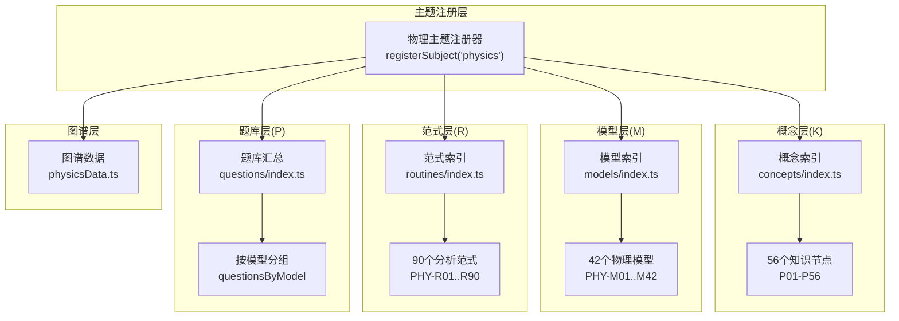
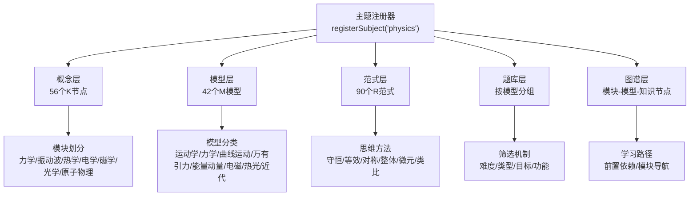
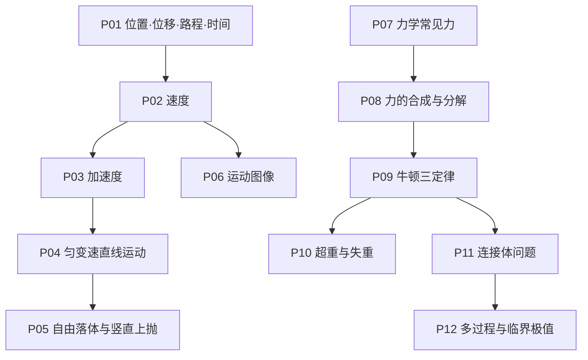
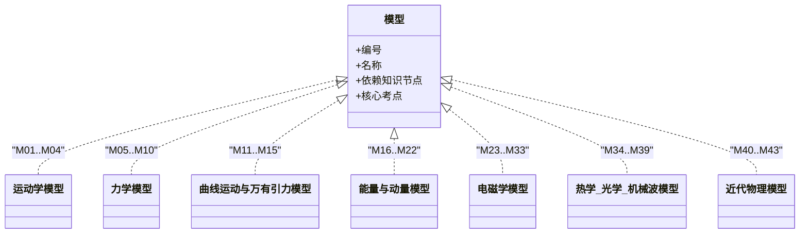
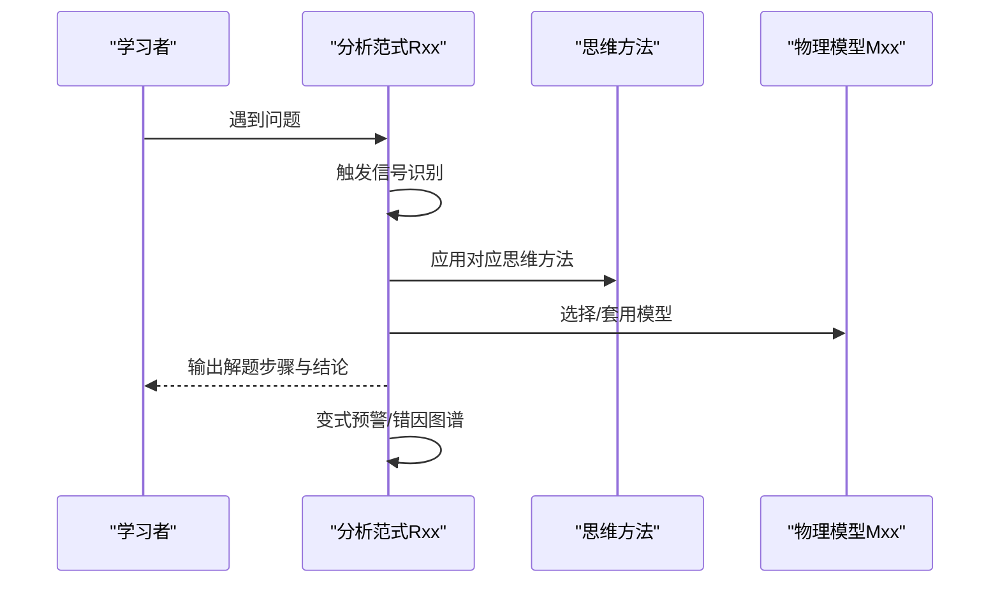
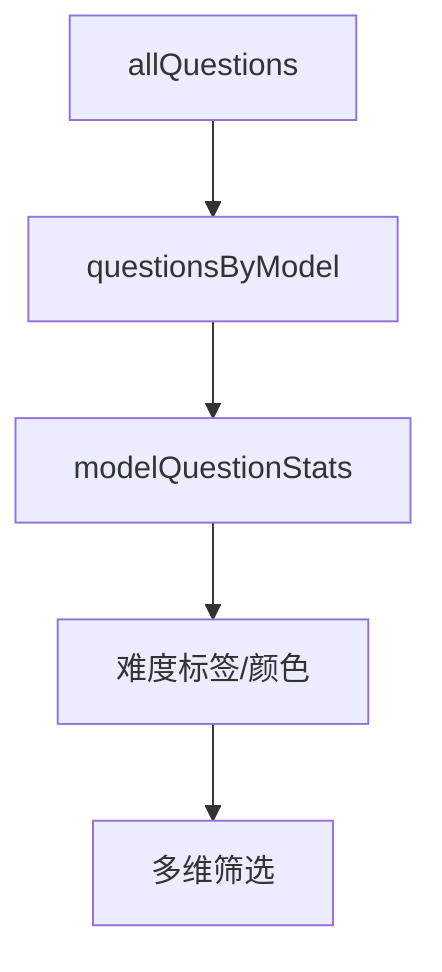
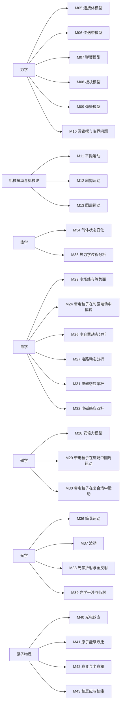
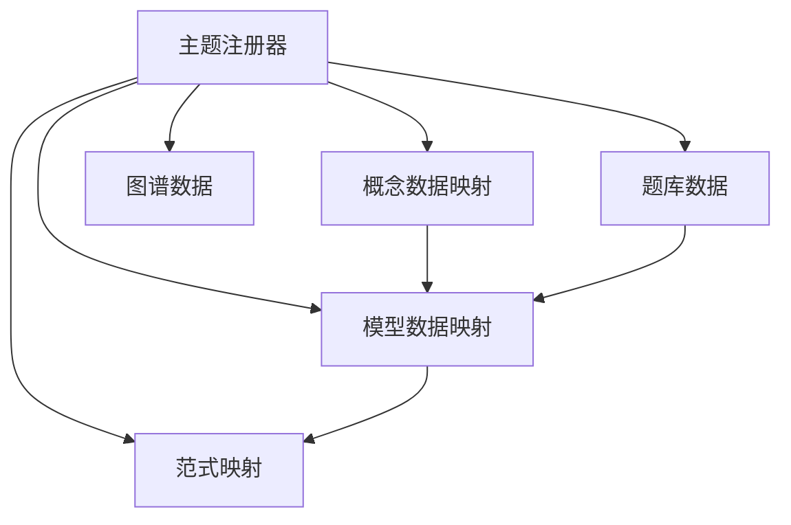

# 物理学科

<cite>
**本文引用的文件**
- [src/data/physics/index.ts](file://src/data/physics/index.ts)
- [src/data/physics/physicsData.ts](file://src/data/physics/physicsData.ts)
- [src/data/physics/physicsModels.ts](file://src/data/physics/physicsModels.ts)
- [src/data/physics/concepts/index.ts](file://src/data/physics/concepts/index.ts)
- [src/data/physics/models/index.ts](file://src/data/physics/models/index.ts)
- [src/data/physics/questions/index.ts](file://src/data/physics/questions/index.ts)
- [src/data/physics/routines/index.ts](file://src/data/physics/routines/index.ts)
- [src/data/physics/thinkingMethods.ts](file://src/data/physics/thinkingMethods.ts)
- [docs/architecture/高中物理·知识网络与内容体系.md](file://docs/architecture/高中物理·知识网络与内容体系.md)
</cite>

## 目录
1. [引言](#引言)
2. [项目结构](#项目结构)
3. [核心组件](#核心组件)
4. [架构总览](#架构总览)
5. [详细组件分析](#详细组件分析)
6. [依赖分析](#依赖分析)
7. [性能考量](#性能考量)
8. [故障排查指南](#故障排查指南)
9. [结论](#结论)
10. [附录](#附录)

## 引言
本文件面向星耀平台的物理学科，系统化阐述物理知识的三层组织结构（K层知识节点、M层物理模型、R层分析范式），以及P层练习题库的设计理念与筛选机制。文档还梳理了模块划分（力学、机械振动与机械波、热学、电学、磁学、光学、原子物理）与章节组织，阐释物理概念的principle结构（情境、困惑、实验、概念、推导、应用）、方法论与生活应用，并总结物理学科特有的思维方法（守恒思想、等效替代、整体与隔离、微元与累积）与解题策略，最后展示如何通过模块化设计实现知识的系统化呈现与学习路径优化。

## 项目结构
物理学科的数据与页面结构采用“主题注册 + 模块化数据”的组织方式：
- 主题注册：在物理主题注册器中集中导出概念、模型、范式、公式、题库、图谱等数据接口，供前端页面按需调用。
- 模块化数据：概念（56个）、模型（42个）、范式（90个）、题库（按模型分组）、图谱（模块-模型-知识节点关系）等分别位于独立文件或目录，便于维护与扩展。
- 文档规范：顶层文档《高中物理·知识网络与内容体系》定义了三层组织、思维方法、模型-范式映射与题库筛选标准，是内容生产的权威依据。

图表来源
- [src/data/physics/index.ts:383-431](file://src/data/physics/index.ts#L383-L431)
- [src/data/physics/concepts/index.ts:1-196](file://src/data/physics/concepts/index.ts#L1-L196)
- [src/data/physics/models/index.ts:1-98](file://src/data/physics/models/index.ts#L1-L98)
- [src/data/physics/routines/index.ts:1-279](file://src/data/physics/routines/index.ts#L1-L279)
- [src/data/physics/questions/index.ts:1-45](file://src/data/physics/questions/index.ts#L1-L45)
- [src/data/physics/physicsData.ts:80-120](file://src/data/physics/physicsData.ts#L80-L120)

章节来源
- [src/data/physics/index.ts:1-433](file://src/data/physics/index.ts#L1-L433)
- [src/data/physics/concepts/index.ts:1-196](file://src/data/physics/concepts/index.ts#L1-L196)
- [src/data/physics/models/index.ts:1-98](file://src/data/physics/models/index.ts#L1-L98)
- [src/data/physics/routines/index.ts:1-279](file://src/data/physics/routines/index.ts#L1-L279)
- [src/data/physics/questions/index.ts:1-45](file://src/data/physics/questions/index.ts#L1-L45)
- [src/data/physics/physicsData.ts:1-138](file://src/data/physics/physicsData.ts#L1-L138)
- [docs/architecture/高中物理·知识网络与内容体系.md:1-800](file://docs/architecture/高中物理·知识网络与内容体系.md#L1-L800)

## 核心组件
- 物理主题注册器：统一暴露概念、模型、范式、公式、题库、图谱等数据接口，供页面组件按需消费。
- 概念层（K01-K56）：覆盖运动学、力学、曲线运动与万有引力、能量与动量、电磁学、热学·光学·机械波、近代物理等七大板块，形成完整的知识网络。
- 模型层（M01-M42）：围绕典型物理场景与问题类型，提供可迁移的建模范式，支撑从知识到题目的桥梁。
- 范式层（R01-R90）：将思维方法结构化为可执行的思考路径，覆盖触发信号、思考路径、变式预警、错因图谱与本质回溯。
- 题库层（P）：按模型分组，提供难度标签与统计，支持筛选与导航。
- 图谱层：模块-模型-知识节点的层级关系与前置依赖，支撑学习路径与知识导航。

章节来源
- [src/data/physics/index.ts:19-76](file://src/data/physics/index.ts#L19-L76)
- [src/data/physics/concepts/index.ts:101-175](file://src/data/physics/concepts/index.ts#L101-L175)
- [src/data/physics/physicsModels.ts:22-65](file://src/data/physics/physicsModels.ts#L22-L65)
- [src/data/physics/routines/index.ts:95-186](file://src/data/physics/routines/index.ts#L95-L186)
- [src/data/physics/questions/index.ts:14-37](file://src/data/physics/questions/index.ts#L14-L37)
- [src/data/physics/physicsData.ts:80-120](file://src/data/physics/physicsData.ts#L80-L120)

## 架构总览
物理学科的三层组织与主题注册器协同工作，形成“知识网络—物理模型—分析范式—题库—图谱”的闭环：

图表来源
- [src/data/physics/index.ts:383-431](file://src/data/physics/index.ts#L383-L431)
- [docs/architecture/高中物理·知识网络与内容体系.md:28-49](file://docs/architecture/高中物理·知识网络与内容体系.md#L28-L49)

章节来源
- [src/data/physics/index.ts:383-431](file://src/data/physics/index.ts#L383-L431)
- [docs/architecture/高中物理·知识网络与内容体系.md:28-49](file://docs/architecture/高中物理·知识网络与内容体系.md#L28-L49)

## 详细组件分析

### 概念层（K层：56个知识节点）
- 板块组织：运动学、力学、曲线运动与万有引力、能量与动量、电磁学、热学·光学·机械波、近代物理。
- 节点属性：每个节点包含学科本质、常见迷思、跨学科关联、关联模型等，支撑深度理解与迁移。
- 前置依赖：节点之间存在严格的依赖关系（如P01→P02→P03→P04→P05、P06），形成学习路径的逻辑顺序。
- 示例节点：位置与位移、速度、加速度、匀变速直线运动、自由落体与竖直上抛、运动图像、力学常见力、牛顿三定律、连接体问题、多过程与临界极值等。

图表来源
- [docs/architecture/高中物理·知识网络与内容体系.md:247-478](file://docs/architecture/高中物理·知识网络与内容体系.md#L247-L478)

章节来源
- [src/data/physics/concepts/index.ts:101-175](file://src/data/physics/concepts/index.ts#L101-L175)
- [docs/architecture/高中物理·知识网络与内容体系.md:247-478](file://docs/architecture/高中物理·知识网络与内容体系.md#L247-L478)

### 模型层（M层：42个物理模型）
- 模型分类：运动学（4个）、力学（6个）、曲线运动与万有引力（5个）、能量与动量（7个）、电磁学（11个）、热学·光学·机械波（6个）、近代物理（4个）。
- 模型与知识节点挂靠：每个模型对应若干核心知识节点，部分模型横跨多个知识节点，体现知识整合。
- 示例模型：匀变速直线运动、自由落体与竖直上抛、连接体模型、传送带模型、板块模型、平抛运动、斜抛运动、圆周运动、天体运动、机械能守恒、动量守恒、电容器动态分析、带电粒子在磁场中圆周运动、电磁感应单杆、简谐运动、光学折射与全反射、光电效应、原子能级跃迁、衰变与半衰期、核反应与核能等。

图表来源
- [docs/architecture/高中物理·知识网络与内容体系.md:483-567](file://docs/architecture/高中物理·知识网络与内容体系.md#L483-L567)

章节来源
- [src/data/physics/physicsModels.ts:22-65](file://src/data/physics/physicsModels.ts#L22-L65)
- [src/data/physics/models/index.ts:52-95](file://src/data/physics/models/index.ts#L52-L95)
- [docs/architecture/高中物理·知识网络与内容体系.md:483-567](file://docs/architecture/高中物理·知识网络与内容体系.md#L483-L567)

### 范式层（R层：90个分析范式）
- 范式结构：触发信号→思考路径→变式预警→错因图谱→本质回溯，覆盖B/J/T三级难度。
- 思维方法映射：范式与“建模与理想化、守恒思想、等效替代、对称与极限、整体与隔离、微元与累积、类比推理”等思维方法深度结合。
- 示例范式：匀变速基本公式选择、刹车陷阱处理、追及相遇分析、v-t图分析法、整体法与隔离法选择、传送带分析流程、斜抛运动分解、圆周运动动力学方程、天体运动基本方程、机械能守恒判断、动量守恒列式、电容器动态分析、带电粒子磁场圆周运动、电磁感应中的电荷量计算、简谐运动特征、折射定律应用、光电效应方程应用、核反应方程配平等。

图表来源
- [docs/architecture/高中物理·知识网络与内容体系.md:571-741](file://docs/architecture/高中物理·知识网络与内容体系.md#L571-L741)

章节来源
- [src/data/physics/routines/index.ts:95-186](file://src/data/physics/routines/index.ts#L95-L186)
- [src/data/physics/thinkingMethods.ts:51-691](file://src/data/physics/thinkingMethods.ts#L51-L691)
- [docs/architecture/高中物理·知识网络与内容体系.md:571-741](file://docs/architecture/高中物理·知识网络与内容体系.md#L571-L741)

### 题库层（P层：练习题库）
- 汇总与分组：题库按模型分组，支持按模型快速检索与练习。
- 统计与标签：提供难度标签（基础/进阶/挑战）与统计信息，便于学习者选择。
- 筛选机制：题库筛选维度包含难度、类型、目标、功能等，支持多维组合筛选。

图表来源
- [src/data/physics/questions/index.ts:8-45](file://src/data/physics/questions/index.ts#L8-L45)

章节来源
- [src/data/physics/questions/index.ts:1-45](file://src/data/physics/questions/index.ts#L1-L45)

### 图谱层（模块-模型-知识节点）
- 模块划分：力学、机械振动与机械波、热学、电学、磁学、光学、原子物理。
- 前置依赖：模型与模型之间存在前置依赖关系，支撑系统化的学习路径。
- 认知图谱：模块→模型→知识节点的层级关系，辅以前置关系边，形成可导航的学习图谱。

图表来源
- [src/data/physics/physicsData.ts:4-39](file://src/data/physics/physicsData.ts#L4-L39)
- [src/data/physics/physicsData.ts:80-120](file://src/data/physics/physicsData.ts#L80-L120)

章节来源
- [src/data/physics/physicsData.ts:1-138](file://src/data/physics/physicsData.ts#L1-L138)

### 模块划分与章节组织
- 模块划分：力学、机械振动与机械波、热学、电学、磁学、光学、原子物理。
- 章节组织：每个模块下包含若干章节，章节内包含若干知识节点，形成“模块→章节→知识节点”的层级结构。
- 示例：力学模块包含“运动的描述”“匀变速直线运动”“相互作用”“牛顿运动定律”等章节；电学模块包含“静电场”等章节。

章节来源
- [src/data/physics/index.ts:24-76](file://src/data/physics/index.ts#L24-L76)
- [src/data/physics/concepts/index.ts:101-175](file://src/data/physics/concepts/index.ts#L101-L175)

### 物理概念的principle结构
- 结构要素：情境、困惑、实验、概念、推导、应用。
- 设计理念：通过真实情境引发困惑，引导实验观察，形成概念定义，进行数学推导，最终回到实际应用，强化知识迁移与实践能力。
- 示例：位置与位移、速度与速率、加速度等核心概念均遵循该结构，确保学习者从“现象—理解—建模—应用”的完整闭环。

章节来源
- [src/data/physics/index.ts:78-196](file://src/data/physics/index.ts#L78-L196)

### 方法论与生活应用
- 方法论：建模与理想化、守恒思想、等效替代、对称与极限、整体与隔离、微元与累积、类比推理。
- 生活应用：将物理原理与日常生活（如GPS定位、高铁提速、电梯信号、安全气囊、充电宝电量、电磁感应等）相结合，提升学习兴趣与迁移能力。

章节来源
- [src/data/physics/thinkingMethods.ts:51-691](file://src/data/physics/thinkingMethods.ts#L51-L691)
- [src/data/physics/index.ts:114-117](file://src/data/physics/index.ts#L114-L117)

### 思维方法与解题策略
- 思维方法：七类核心认知维度，覆盖建模、过程分析、守恒、临界、对称与等效、迁移创新等。
- 解题策略：范式化思维路径，强调触发信号识别、方法选择、路径执行与结果校验，形成可复用的“操作手册”。

章节来源
- [docs/architecture/高中物理·知识网络与内容体系.md:53-77](file://docs/architecture/高中物理·知识网络与内容体系.md#L53-L77)
- [src/data/physics/thinkingMethods.ts:51-691](file://src/data/physics/thinkingMethods.ts#L51-L691)

### 题库筛选机制
- 维度：难度（B/J/T）、类型、目标、功能。
- 统计：按模型统计各难度题量，支持学习者按能力梯度选择。
- 导航：按模型分组，便于针对性练习与巩固。

章节来源
- [src/data/physics/questions/index.ts:14-45](file://src/data/physics/questions/index.ts#L14-L45)

## 依赖分析
- 主题注册器依赖：概念数据映射、模型数据映射、范式映射、公式与题库数据、图谱数据。
- 概念与模型：概念列表与章节元信息支撑模型挂靠与导航。
- 模型与范式：模型-范式映射表明确每个模型对应的范式集合。
- 题库与模型：按模型分组，便于范式与题目的双向联动。

图表来源
- [src/data/physics/index.ts:3-17](file://src/data/physics/index.ts#L3-L17)
- [src/data/physics/routines/index.ts:188-279](file://src/data/physics/routines/index.ts#L188-L279)
- [src/data/physics/questions/index.ts:14-17](file://src/data/physics/questions/index.ts#L14-L17)

章节来源
- [src/data/physics/index.ts:3-17](file://src/data/physics/index.ts#L3-L17)
- [src/data/physics/routines/index.ts:188-279](file://src/data/physics/routines/index.ts#L188-L279)
- [src/data/physics/questions/index.ts:14-17](file://src/data/physics/questions/index.ts#L14-L17)

## 性能考量
- 数据加载：主题注册器集中导出，前端按需调用，避免全量加载。
- 模块化拆分：概念、模型、范式、题库、图谱分别维护，降低耦合，提升可维护性。
- 前置依赖：通过模型-模型与知识-知识的依赖关系，减少无效学习路径，提高学习效率。
- 图谱渲染：模块-模型-知识节点的层级关系清晰，有利于前端高效渲染与导航。

## 故障排查指南
- 概念缺失：检查概念索引与章节元信息，确认概念ID与章节映射是否正确。
- 模型缺失：检查模型索引与数据映射，确认模型ID与数据是否存在。
- 范式缺失：检查范式汇总与映射表，确认范式ID与所属模型是否匹配。
- 题库缺失：检查按模型分组与统计，确认模型ID与题库分组是否一致。
- 图谱异常：检查模块-模型-知识节点的层级关系与前置依赖，确保边的方向与权重正确。

章节来源
- [src/data/physics/concepts/index.ts:177-196](file://src/data/physics/concepts/index.ts#L177-L196)
- [src/data/physics/models/index.ts:52-95](file://src/data/physics/models/index.ts#L52-L95)
- [src/data/physics/routines/index.ts:188-279](file://src/data/physics/routines/index.ts#L188-L279)
- [src/data/physics/questions/index.ts:14-37](file://src/data/physics/questions/index.ts#L14-L37)
- [src/data/physics/physicsData.ts:80-120](file://src/data/physics/physicsData.ts#L80-L120)

## 结论
星耀平台的物理学科通过“三层组织+主题注册+模块化数据”的架构，实现了知识网络、物理模型、分析范式与题库的有机融合。依托思维方法与范式化路径，学习者能够从“情境—理解—建模—应用”的闭环中掌握物理本质；通过模块化设计与图谱导航，学习路径得以系统化呈现与优化。该体系既满足第一遍学习阶段的需求，也为后续专题与高考复习奠定坚实基础。

## 附录
- 术语对照：知识节点（K）、物理模型（M）、分析范式（R）、练习题库（P）、模块（M）、章节（C）、知识节点（K）。
- 参考文档：《高中物理·知识网络与内容体系》定义了三层组织、思维方法、模型-范式映射与题库筛选标准。