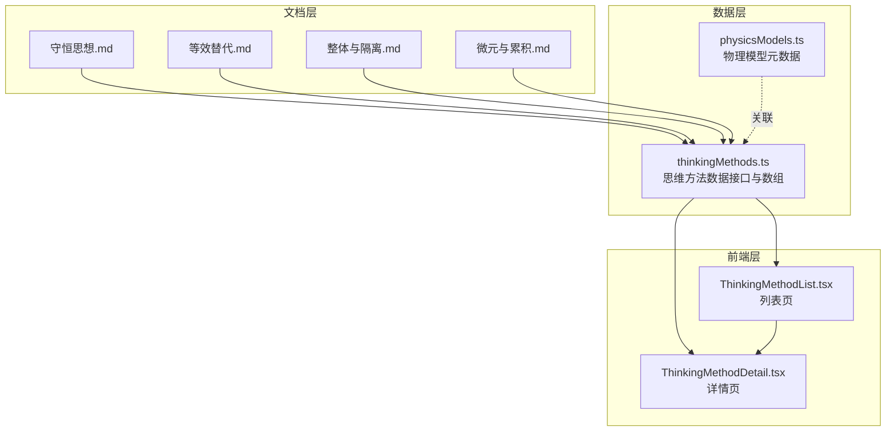
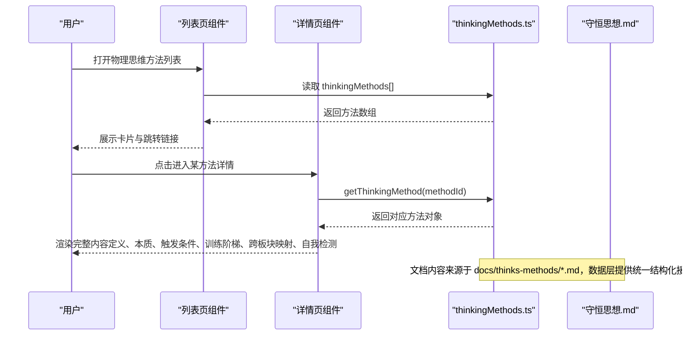
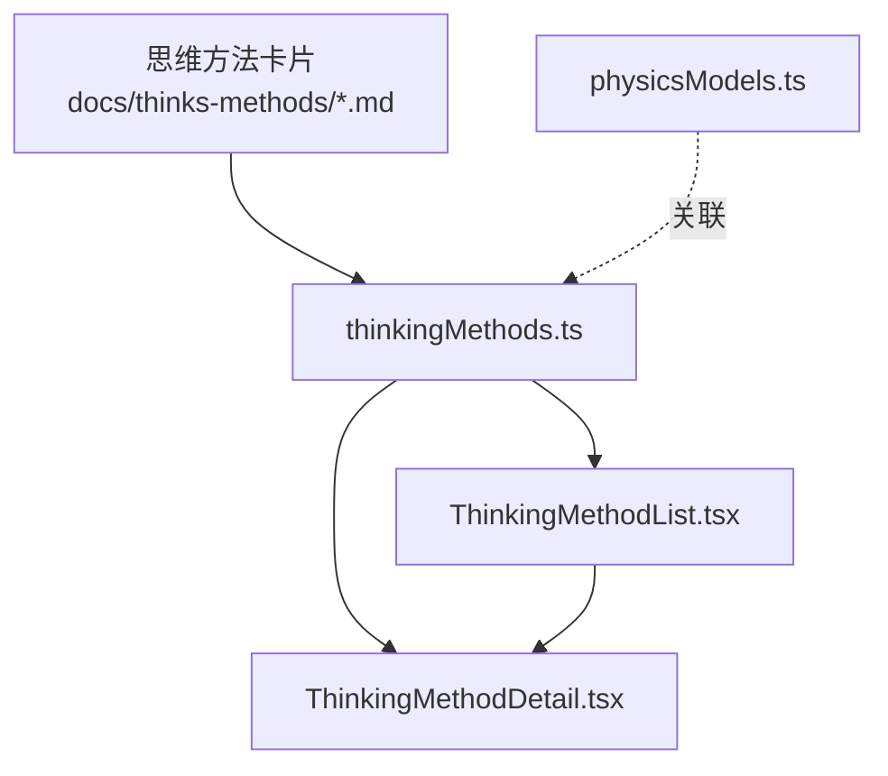

# 物理思维方法

<cite>
**本文引用的文件**
- [思维方法卡片：守恒思想](file://docs/thinks-methods/02_守恒思想.md)
- [思维方法卡片：等效替代](file://docs/thinks-methods/03_等效替代.md)
- [思维方法卡片：整体与隔离](file://docs/thinks-methods/05_整体与隔离.md)
- [思维方法卡片：微元与累积](file://docs/thinks-methods/06_微元与累积.md)
- [思维方法详情页面组件](file://src/sections/physics/ThinkingMethodDetail.tsx)
- [思维方法列表页面组件](file://src/sections/physics/ThinkingMethodList.tsx)
- [物理思维方法数据](file://src/data/physics/thinkingMethods.ts)
- [物理模型元数据](file://src/data/physics/physicsModels.ts)
</cite>

## 目录
1. [引言](#引言)
2. [项目结构](#项目结构)
3. [核心组件](#核心组件)
4. [架构总览](#架构总览)
5. [详细组件分析](#详细组件分析)
6. [依赖分析](#依赖分析)
7. [性能考虑](#性能考虑)
8. [故障排查指南](#故障排查指南)
9. [结论](#结论)
10. [附录](#附录)

## 引言
本文件面向星耀平台物理学科的“思维方法”主题，系统梳理并文档化四种物理特有的思维方法：守恒思想、等效替代、整体与隔离、微元与累积。文档旨在帮助教师与学生：
- 深入理解每种思维方法的核心理念、适用场景与应用技巧；
- 明晰思维方法与具体物理知识、模型、范式的映射关系；
- 掌握在解题过程中识别、运用与验证思维方法的流程；
- 通过系统训练提升物理学习效率与迁移能力。

## 项目结构
星耀平台的“物理思维方法”模块由三层构成：
- 文档层：以思维方法卡片形式呈现，覆盖定义、本质、触发条件、训练阶梯、跨板块映射与自我检测；
- 数据层：以 TypeScript 数据结构承载思维方法的元数据，便于前端渲染与检索；
- 前端层：提供列表页与详情页，支持按编号浏览与前后翻页。

图表来源
- [思维方法卡片：守恒思想](file://docs/thinks-methods/02_守恒思想.md)
- [思维方法卡片：等效替代](file://docs/thinks-methods/03_等效替代.md)
- [思维方法卡片：整体与隔离](file://docs/thinks-methods/05_整体与隔离.md)
- [思维方法卡片：微元与累积](file://docs/thinks-methods/06_微元与累积.md)
- [物理思维方法数据](file://src/data/physics/thinkingMethods.ts)
- [物理模型元数据](file://src/data/physics/physicsModels.ts)
- [思维方法列表页面组件](file://src/sections/physics/ThinkingMethodList.tsx)
- [思维方法详情页面组件](file://src/sections/physics/ThinkingMethodDetail.tsx)

章节来源
- [思维方法卡片：守恒思想](file://docs/thinks-methods/02_守恒思想.md)
- [思维方法卡片：等效替代](file://docs/thinks-methods/03_等效替代.md)
- [思维方法卡片：整体与隔离](file://docs/thinks-methods/05_整体与隔离.md)
- [思维方法卡片：微元与累积](file://docs/thinks-methods/06_微元与累积.md)
- [物理思维方法数据](file://src/data/physics/thinkingMethods.ts)
- [物理模型元数据](file://src/data/physics/physicsModels.ts)
- [思维方法列表页面组件](file://src/sections/physics/ThinkingMethodList.tsx)
- [思维方法详情页面组件](file://src/sections/physics/ThinkingMethodDetail.tsx)

## 核心组件
- 思维方法卡片（文档层）
  - 每张卡片包含：一句话定义、学科本质、触发条件、训练阶梯（B/J/T三级）、跨板块映射、自我检测（费曼式）等。
  - 代表方法：守恒思想、等效替代、整体与隔离、微元与累积。
- 思维方法数据（数据层）
  - 定义统一接口 ThinkingMethod，包含 id、name、subtitle、definition、essence、value、idealizationTypes、trainingGains、triggers、keywords、traps、ladder、cross板块、selfTests、relatedModels、relatedParadigms、code 等字段。
  - 提供数组 thinkingMethods 与查询函数 getThinkingMethod。
- 前端页面（前端层）
  - 列表页：展示所有思维方法卡片，支持跳转至详情页。
  - 详情页：按编号渲染对应思维方法的完整内容，支持前后翻页与关键词高亮。

章节来源
- [物理思维方法数据](file://src/data/physics/thinkingMethods.ts)
- [思维方法列表页面组件](file://src/sections/physics/ThinkingMethodList.tsx)
- [思维方法详情页面组件](file://src/sections/physics/ThinkingMethodDetail.tsx)

## 架构总览
下面以“守恒思想”为例，展示从文档到数据再到前端的端到端流转：

图表来源
- [思维方法详情页面组件](file://src/sections/physics/ThinkingMethodDetail.tsx)
- [思维方法列表页面组件](file://src/sections/physics/ThinkingMethodList.tsx)
- [物理思维方法数据](file://src/data/physics/thinkingMethods.ts)
- [思维方法卡片：守恒思想](file://docs/thinks-methods/02_守恒思想.md)

## 详细组件分析

### 守恒思想
- 核心理念
  - 在复杂变化过程中寻找“不变量”，直接建立初态与末态联系，跳过中间过程，实现“以不变应万变”。
- 适用场景
  - 碰撞/爆炸/反冲（动量守恒）；
  - 仅有重力/弹力做功（机械能守恒）；
  - 电荷转移（电荷守恒）；
  - 电路稳定（电流守恒）。
- 应用技巧
  - 条件-守恒对应表：识别“只有重力/弹力”“光滑”“弹性碰撞/爆炸”等关键词；
  - 反例训练：摩擦力做功→内能增加，总能量守恒；“只有光滑”≠“机械能守恒”。
- 跨板块映射
  - 力学：连接体、弹簧振子；
  - 电磁学：电荷在电路中流动、电磁感应；
  - 热学：热力学第一定律；
  - 光学：光子的产生与消失；
  - 原子物理：核反应、衰变。
- 解题流程
  - 识别“过程混乱/初末明确/关键词/多过程”等触发信号；
  - 判断可用守恒类型与条件；
  - 若常规条件不满足，尝试“等效守恒”（如类动量守恒、电荷量守恒）；
  - 多守恒并存时，综合使用（如弹性碰撞同时满足动量与机械能守恒）。
- 自我检测（费曼式）
  - 能否用“守恒思想”更快解决过去用全过程分析的问题？
  - 是否曾“套用公式”而条件不满足？
  - 面对新情境，能否快速判断“哪个量可能守恒”？

章节来源
- [思维方法卡片：守恒思想](file://docs/thinks-methods/02_守恒思想.md)

### 等效替代
- 核心理念
  - 将复杂问题替换为等价的简单问题，等效是“在特定条件下结果完全相同”的严格等价，不是近似。
- 适用场景
  - 复合场中的带电粒子运动（等效重力场：g' = g + qE/m）；
  - 复杂电路（逐层等效为简单串并联）；
  - 斜面问题（重力分解等效为沿斜面方向的重力分量）；
  - 均匀球壳（等效为球心处质点的万有引力）；
  - 交流电路（峰值、有效值、瞬时值的等效替换）。
- 应用技巧
  - 等效映射表训练：明确原问题、等效问题与等效条件；
  - 等效验证训练：理解“为什么等效成立”；
  - 多步等效：复杂问题可能需要多次等效；
  - 等效的边界：替换后功率可能不同（不是所有物理量都等效）。
- 跨板块映射
  - 力学：斜面→水平、合成与分解；
  - 电磁学：电路化简、复合场；
  - 热学：理想气体（分子模型）；
  - 光学：光线模型；
  - 天体：双星系统、均匀球壳。
- 解题流程
  - 识别“问题复杂/计算繁琐/概念抽象/结果异常”等触发信号；
  - 问“能否等效为更简单的问题？”；
  - 明确等效条件与适用范围；
  - 验证等效结果的一致性。
- 自我检测（费曼式）
  - 等效与近似的区别在哪里？
  - 是否习惯性地“硬算”而未尝试“等效简化”？
  - 面对新情境，能否在2分钟内建立“等效变换”思路？

章节来源
- [思维方法卡片：等效替代](file://docs/thinks-methods/03_等效替代.md)

### 整体与隔离
- 核心理念
  - 在多体系统中，“先整体后隔离”：整体法看加速度与趋势，隔离法求内力与细节；两者互为补充，不是二选一。
- 适用场景
  - 连接体（轻绳/轻杆/弹簧）；
  - 传送带+物体；
  - 竖直连接（通过滑轮）；
  - 有摩擦的连接体；
  - 判断“是否相对滑动”。
- 应用技巧
  - 问题类型→方法映射：问加速度→整体法；问内力→隔离法；
  - 标准流程：整体列式→求加速度；隔离列式→求内力；
  - “坑”的识别：整体法求完加速度就以为结束；隔离时把施加在外物上的力也画进来。
- 跨板块映射
  - 力学：连接体、叠放板块、弹簧系统；
  - 电磁学：电磁感应双杆、复合场多粒子；
  - 能量分析：系统能量 vs 单体能量；
  - 动量分析：碰撞系统。
- 解题流程
  - 先看问题类型：问加速度用整体法；问内力用隔离法；
  - 若需要综合求解，采用“先整体后隔离”的标准流程；
  - 多次切换与反向思维：先猜内力，再用整体法验证。
- 自我检测（费曼式）
  - 为什么整体法能忽略内力？隔离法为什么能求出内力？
  - 是否曾“用整体法求完加速度就以为做完”？
  - 面对新情境，能否确定解题路径（整体/隔离/切换顺序）？

章节来源
- [思维方法卡片：整体与隔离](file://docs/thinks-methods/05_整体与隔离.md)

### 微元与累积
- 核心理念
  - 将连续变化的过程分解为无数个微小单元，在每个单元内将变量视为常量，分析后再求和（积分思想）；当单元趋于无穷小时，近似变为精确。
- 适用场景
  - 变力做功（W = ∫F dx）；
  - 非匀强电场电势差（U = ∫E dl）；
  - 连续分布电荷（微元电荷 dq）；
  - 流体连续性（每小段管道 dx）；
  - 电磁感应中的电荷量（Δq = ∫I dt）。
- 应用技巧
  - 从直观到极限：先用有限分割理解，再理解极限；
  - 公式来源理解：不背公式，理解其推导（如 W = ½kx²）；
  - 微元选择训练：问“用什么做微元？”（如带电圆环用微元电荷、非匀强电场用微元路径）。
- 跨板块映射
  - 力学：变力做功、弹簧振子；
  - 电磁学：非匀强电场、感应电量；
  - 热学：气体状态变化；
  - 近代物理：连续谱问题（黑体辐射的积分）。
- 解题流程
  - 识别“变量问题/连续体/非均匀/累积效应”等触发信号；
  - 问“能否把过程分成小段？”；
  - 选择合适的微元，使微元内物理量视为常量；
  - 利用对称性简化积分，建立积分式并求解。
- 自我检测（费曼式）
  - 微元法为什么不是“近似”？微元法成功的关键是什么？
  - 是否曾“逃避变力做功、非匀强场问题”？
  - 面对“变化”问题，能否主动尝试微元化思路？

章节来源
- [思维方法卡片：微元与累积](file://docs/thinks-methods/06_微元与累积.md)

### 思维方法与模型、范式的映射
- 关联模型（示例）
  - 守恒思想：M07 板块模型、M09 弹簧模型、M18 功能关系综合模型、M26 电容器动态分析模型、M31 电磁感应单杆模型、M32 电磁感应双杆模型；
  - 等效替代：M08 斜面问题、M26 电容器动态分析、M27 电路动态分析、M30 带电粒子复合场运动；
  - 整体与隔离：M05 连接体模型、M06 传送带模型、M21 碰撞模型、M31 电磁感应单杆模型、M32 电磁感应双杆模型；
  - 微元与累积：M09 弹簧模型、M23 电场线与等势面模型、M33 交变电流与变压器模型、M31 电磁感应单杆模型、M32 电磁感应双杆模型。
- 关联分析范式（示例）
  - 守恒思想：R35 动能定理全程法、R37 机械能守恒判断、R42 功能关系选判、R40 传送带能量分析；
  - 等效替代：R14 斜面问题通法、R11 正交分解法；
  - 整体与隔离：R09 整体法与隔离法选择、R10 受力分析标准流程、R11 正交分解法；
  - 微元与累积：R36 变力做功计算、R44 变力冲量求法、R90 含电容器的电磁感应。

章节来源
- [物理模型元数据](file://src/data/physics/physicsModels.ts)
- [物理思维方法数据](file://src/data/physics/thinkingMethods.ts)

## 依赖分析
- 组件耦合与协作
  - 文档层（思维方法卡片）与数据层（thinkingMethods.ts）通过统一接口耦合，确保内容结构化与可扩展；
  - 前端列表页与详情页均依赖数据层，实现“列表浏览—详情深读”的闭环；
  - 模型元数据（physicsModels.ts）为“关联模型”提供静态基础信息，便于导航与交叉引用。
- 外部依赖与集成点
  - React Router：用于页面路由与参数传递（methodId）；
  - Lucide 图标库：用于界面装饰与语义提示；
  - Tailwind CSS：用于样式与响应式布局。

图表来源
- [物理思维方法数据](file://src/data/physics/thinkingMethods.ts)
- [思维方法列表页面组件](file://src/sections/physics/ThinkingMethodList.tsx)
- [思维方法详情页面组件](file://src/sections/physics/ThinkingMethodDetail.tsx)
- [物理模型元数据](file://src/data/physics/physicsModels.ts)

章节来源
- [物理思维方法数据](file://src/data/physics/thinkingMethods.ts)
- [思维方法列表页面组件](file://src/sections/physics/ThinkingMethodList.tsx)
- [思维方法详情页面组件](file://src/sections/physics/ThinkingMethodDetail.tsx)
- [物理模型元数据](file://src/data/physics/physicsModels.ts)

## 性能考虑
- 数据加载
  - thinkingMethods.ts 为静态数组，前端按需渲染，避免远程请求带来的延迟；
  - 列表页仅渲染基础信息，详情页按需加载完整内容，降低首屏压力。
- 渲染优化
  - 使用 React Router 的 params 获取 methodId，避免重复查询；
  - 列表页采用卡片网格布局，详情页按需展开内容，提升滚动体验。
- 可扩展性
  - 新增思维方法只需在 docs/thinks-methods 下新增卡片并同步到 thinkingMethods.ts，保持数据与界面解耦。

## 故障排查指南
- 问题：进入详情页显示“未找到该思维方法”
  - 排查：确认 methodId 是否存在于 thinkingMethods.ts 的 id 列表中；
  - 处理：修正路由参数或检查数据一致性。
- 问题：列表页空白或缺少内容
  - 排查：检查 thinkingMethods.ts 是否正确导出数组；
  - 处理：确保数据结构与接口一致，重新构建前端。
- 问题：跨板块映射或关联模型显示为空
  - 排查：确认 physicsModels.ts 中是否存在对应模型元数据；
  - 处理：补充缺失模型或调整关联字段。
- 问题：等效/整体/微元等概念混淆
  - 建议：对照“触发条件”“训练阶梯”“自我检测”逐步梳理；优先从“等效条件/整体视角/微元选择”入手，再进行计算。

章节来源
- [思维方法详情页面组件](file://src/sections/physics/ThinkingMethodDetail.tsx)
- [物理思维方法数据](file://src/data/physics/thinkingMethods.ts)
- [物理模型元数据](file://src/data/physics/physicsModels.ts)

## 结论
星耀平台的“物理思维方法”模块以结构化的思维卡片为核心，辅以统一数据接口与清晰的前端页面，形成了“内容—数据—界面”的高效协同。通过系统掌握守恒思想、等效替代、整体与隔离、微元与累积四大思维方法，学习者能够：
- 在复杂问题面前快速识别适用方法；
- 建立严谨的等效与系统视角；
- 以积分与极限思维应对连续变化；
- 通过跨板块映射与自我检测持续提升迁移能力。

建议在教学实践中：
- 将思维方法与具体模型、范式结合，形成“方法—模型—范式”的学习闭环；
- 以“费曼式自我检测”驱动元认知，不断反思与改进；
- 鼓励学生在新情境中主动迁移，培养“以不变应万变”的物理直觉。

## 附录
- 思维方法与物理板块的映射（节选）
  - 守恒思想：力学（动量、机械能）、电磁学（电荷、能量）、热学（热力学第一定律）、光学（光子能量）、原子物理（质量数、电荷数、能量）；
  - 等效替代：力学（斜面、复合场）、电磁学（电路、复合场）、热学（理想气体）、光学（光线模型）、天体（双星、均匀球壳）；
  - 整体与隔离：力学（连接体、传送带）、电磁学（双杆、复合场）、能量与动量（系统分析）；
  - 微元与累积：力学（变力做功、弹簧）、电磁学（非匀强场、感应电量）、热学（气体状态变化）、近代物理（连续谱）。

章节来源
- [思维方法卡片：守恒思想](file://docs/thinks-methods/02_守恒思想.md)
- [思维方法卡片：等效替代](file://docs/thinks-methods/03_等效替代.md)
- [思维方法卡片：整体与隔离](file://docs/thinks-methods/05_整体与隔离.md)
- [思维方法卡片：微元与累积](file://docs/thinks-methods/06_微元与累积.md)