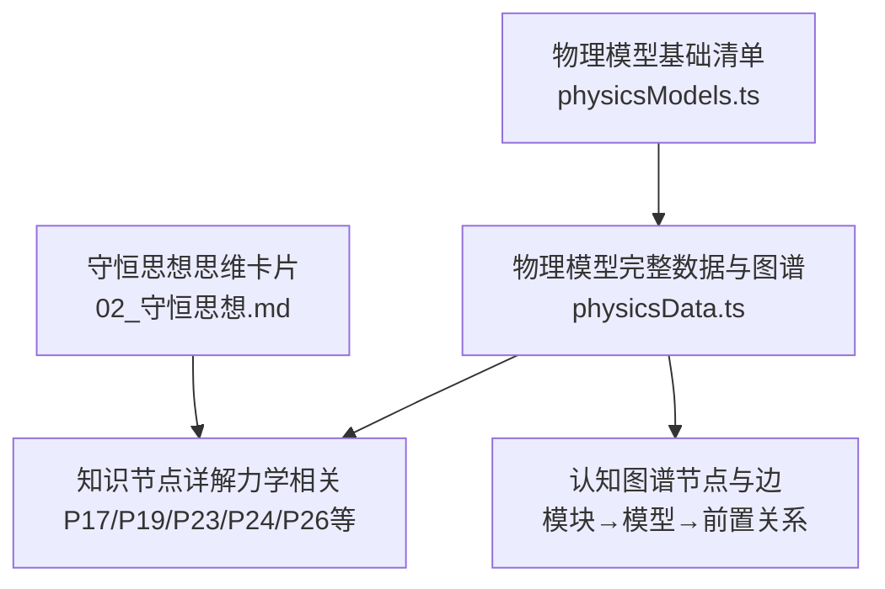
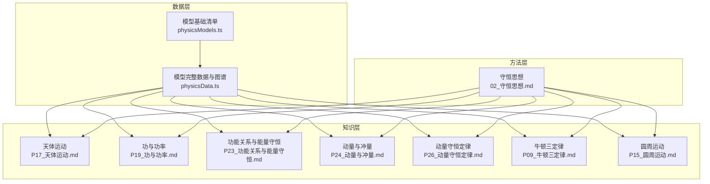
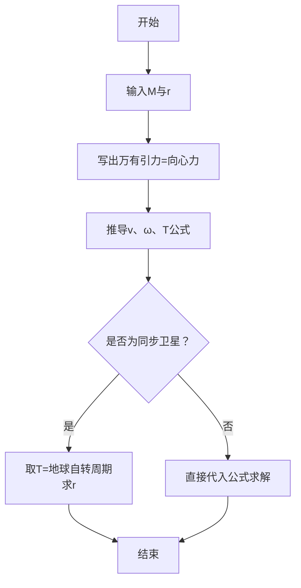
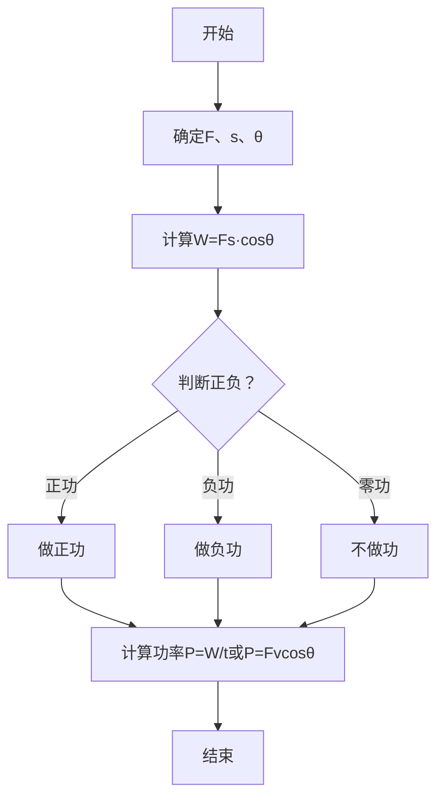
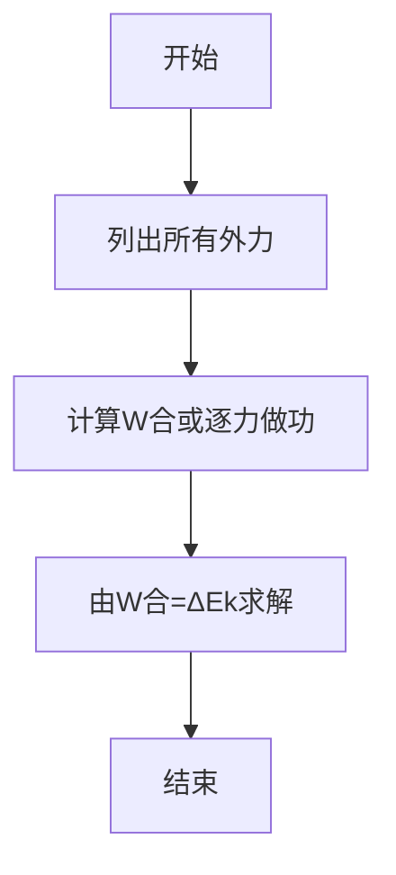
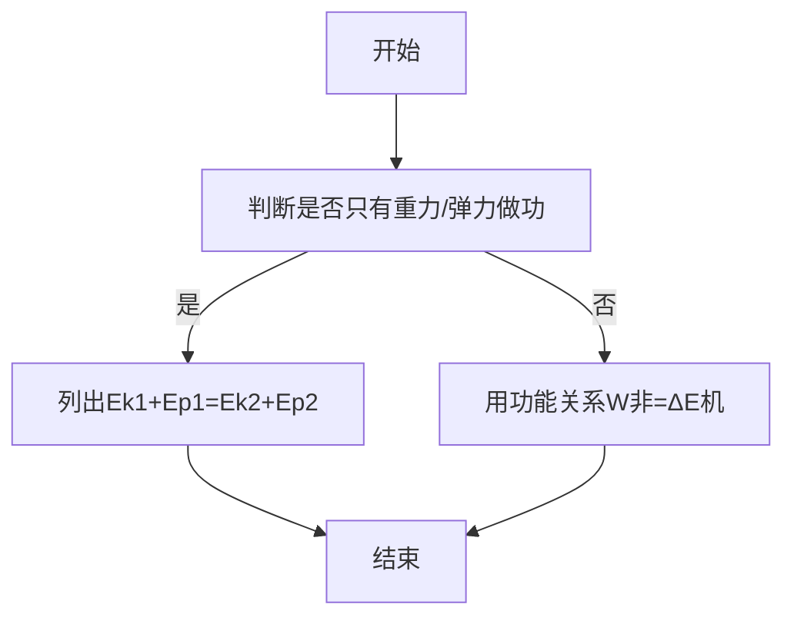
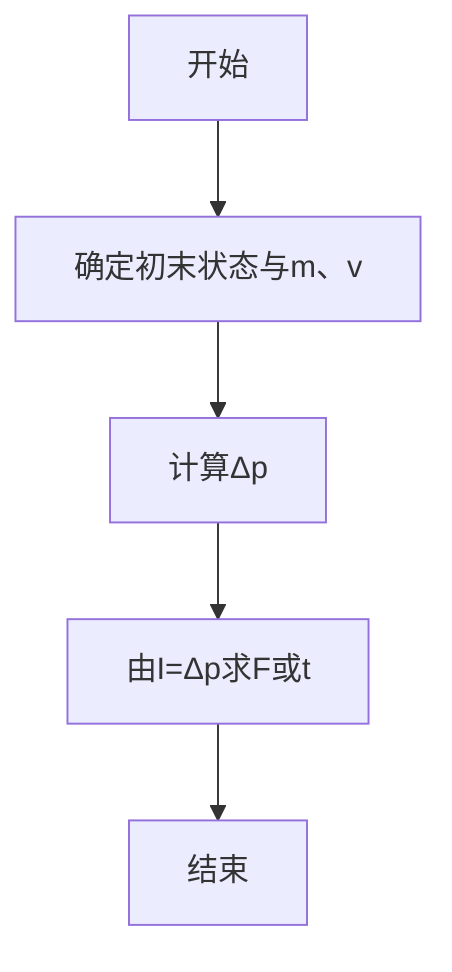
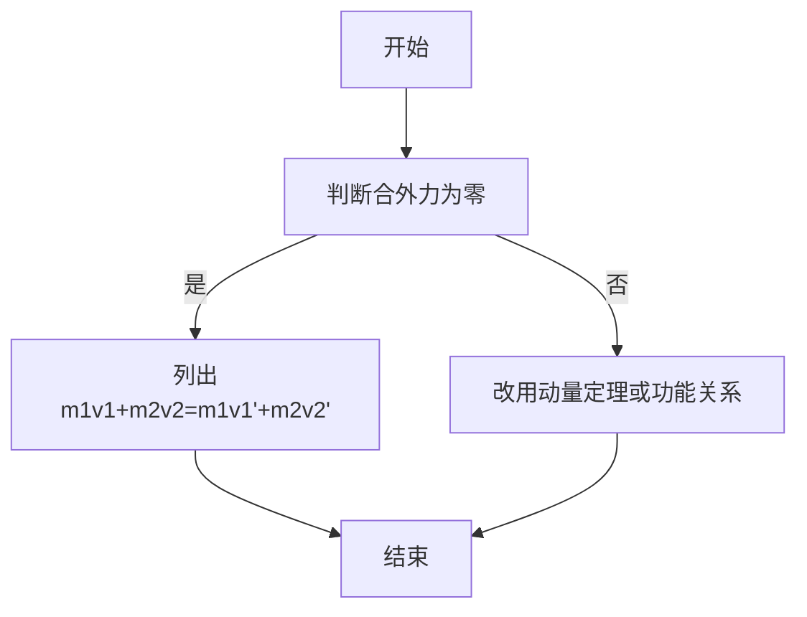
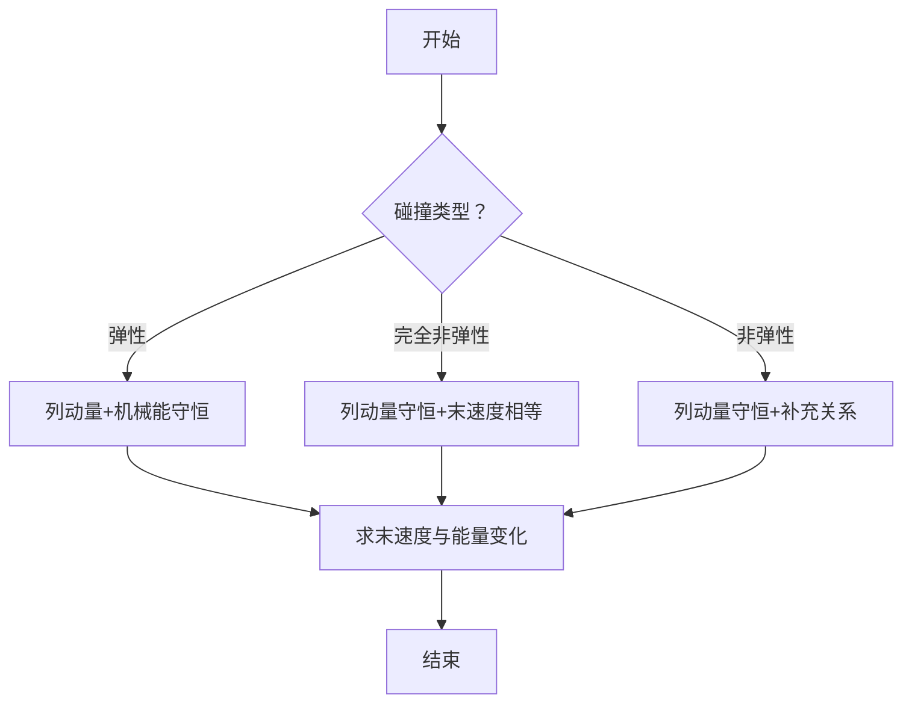
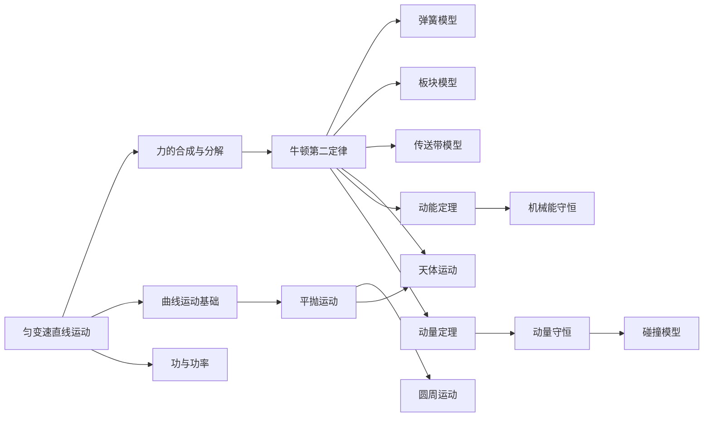

# 力学模型

<cite>
**本文引用的文件**
- [力学模型基础清单](file://src/data/physics/physicsModels.ts)
- [物理模型完整数据与图谱](file://src/data/physics/physicsData.ts)
- [天体运动（知识节点）](file://docs/knowledge/physics/P17_天体运动.md)
- [功与功率（知识节点）](file://docs/knowledge/physics/P19_功与功率.md)
- [功能关系与能量守恒（知识节点）](file://docs/knowledge/physics/P23_功能关系与能量守恒.md)
- [动量与冲量（知识节点）](file://docs/knowledge/physics/P24_动量与冲量.md)
- [动量守恒定律（知识节点）](file://docs/knowledge/physics/P26_动量守恒定律.md)
- [牛顿三定律（知识节点）](file://docs/knowledge/physics/P09_牛顿三定律.md)
- [圆周运动（知识节点）](file://docs/knowledge/physics/P15_圆周运动.md)
- [守恒思想（思维方法卡片）](file://docs/thinks-methods/02_守恒思想.md)
</cite>

## 目录
1. [引言](#引言)
2. [项目结构](#项目结构)
3. [核心组件](#核心组件)
4. [架构总览](#架构总览)
5. [详细组件分析](#详细组件分析)
6. [依赖分析](#依赖分析)
7. [性能考量](#性能考量)
8. [故障排查指南](#故障排查指南)
9. [结论](#结论)
10. [附录](#附录)

## 引言
本文件面向“星耀平台”物理学科的力学模型，系统梳理并文档化以下核心模型：天体运动、功与功率、动能定理、机械能守恒、动量定理、动量守恒、碰撞模型。文档不仅覆盖模型的适用场景、核心假设、数学表达与解题步骤，还强调物理原理、守恒定律与模型间的相互关系，并提供模型建立与应用的示例与模板，帮助学习者在复杂物理问题中高效建模与求解。

## 项目结构
力学模型在平台中的组织方式如下：
- 模型基础元数据：来源于“物理模型基础清单”，提供模型的标识、标题、模块、章节与排序。
- 模型完整数据与认知图谱：来源于“物理模型完整数据与图谱”，包含模型列表、前置关系边、模块节点与模型节点，形成完整的知识网络与学习路径。
- 知识节点文档：来源于“知识节点详解”系列文档，提供每个模型对应的物理原理、公式、例题与迁移应用。
- 思维方法：来源于“守恒思想”思维卡片，强调在力学问题中识别与应用守恒量的通用策略。

图表来源
- [力学模型基础清单:22-65](file://src/data/physics/physicsModels.ts#L22-L65)
- [物理模型完整数据与图谱:4-39](file://src/data/physics/physicsData.ts#L4-L39)
- [物理模型完整数据与图谱:81-120](file://src/data/physics/physicsData.ts#L81-L120)
- [守恒思想（思维方法卡片）:1-203](file://docs/thinks-methods/02_守恒思想.md#L1-L203)

章节来源
- [力学模型基础清单:1-66](file://src/data/physics/physicsModels.ts#L1-L66)
- [物理模型完整数据与图谱:1-138](file://src/data/physics/physicsData.ts#L1-L138)

## 核心组件
- 模型基础清单（physicsModels.ts）
  - 提供模型的基础元数据（id、title、module、chapter、order），用于页面渲染与导航。
  - 与模型文件自动同步，无需手动维护。
- 模型完整数据与图谱（physicsData.ts）
  - 提供模型列表、前置关系边、模块节点与模型节点，生成完整的认知图谱数据结构。
  - 通过生成函数输出节点与边，支撑学习路径与知识关联。
- 知识节点详解（力学相关）
  - 天体运动、功与功率、功能关系与能量守恒、动量与冲量、动量守恒定律、牛顿三定律、圆周运动等。
  - 每个节点包含：定位声明、学科本质、常见迷思、情境锚定、困惑预设、实验/现象呈现、概念涌现、推导叙事、迁移应用、分层变形、公式卡片、理解度自评、跨学科关联、检查清单等。
- 思维方法卡片（守恒思想）
  - 强调“识别守恒量”的通用策略，涵盖触发条件、训练阶梯、跨板块映射与自我检测。

章节来源
- [力学模型基础清单:1-66](file://src/data/physics/physicsModels.ts#L1-L66)
- [物理模型完整数据与图谱:1-138](file://src/data/physics/physicsData.ts#L1-L138)
- [守恒思想（思维方法卡片）:1-203](file://docs/thinks-methods/02_守恒思想.md#L1-L203)

## 架构总览
力学模型在平台中的架构分为三层：
- 数据层：模型基础清单与完整数据，负责模型元数据与图谱生成。
- 知识层：知识节点详解文档，提供模型的物理原理、公式与应用。
- 方法层：思维方法卡片，提供识别与应用守恒量的策略与训练路径。

图表来源
- [力学模型基础清单:22-65](file://src/data/physics/physicsModels.ts#L22-L65)
- [物理模型完整数据与图谱:4-39](file://src/data/physics/physicsData.ts#L4-L39)
- [天体运动（知识节点）:1-248](file://docs/knowledge/physics/P17_天体运动.md#L1-L248)
- [功与功率（知识节点）:1-257](file://docs/knowledge/physics/P19_功与功率.md#L1-L257)
- [功能关系与能量守恒（知识节点）:1-234](file://docs/knowledge/physics/P23_功能关系与能量守恒.md#L1-L234)
- [动量与冲量（知识节点）:1-242](file://docs/knowledge/physics/P24_动量与冲量.md#L1-L242)
- [动量守恒定律（知识节点）:1-225](file://docs/knowledge/physics/P26_动量守恒定律.md#L1-L225)
- [牛顿三定律（知识节点）:1-257](file://docs/knowledge/physics/P09_牛顿三定律.md#L1-L257)
- [圆周运动（知识节点）:1-253](file://docs/knowledge/physics/P15_圆周运动.md#L1-L253)
- [守恒思想（思维方法卡片）:1-203](file://docs/thinks-methods/02_守恒思想.md#L1-L203)

## 详细组件分析

### 天体运动模型
- 适用场景
  - 卫星绕地球做圆周运动、同步卫星轨道、双星或多星系统、卫星变轨与能量变化。
- 核心假设
  - 轨道为圆周运动；万有引力提供向心力；忽略其他天体干扰。
- 数学表达
  - 线速度：$v = \sqrt{GM/r}$
  - 角速度：$\omega = \sqrt{GM/r^3}$
  - 周期：$T = 2\pi\sqrt{r^3/GM}$
  - 同步卫星：周期与地球自转周期一致，轨道位于赤道上空。
- 解题步骤
  - 识别中心天体质量M与轨道半径r；
  - 由万有引力提供向心力列出等式；
  - 求解速度、周期或轨道半径；
  - 变轨问题：分析近地点与远地点的速度与机械能变化。
- 物理原理与相互关系
  - 与圆周运动的向心力模型一致，结合牛顿三定律与万有引力定律。
- 示例与模板
  - 近地卫星速度计算（黄金代换）；
  - 同步卫星轨道半径计算；
  - 双星系统周期计算；
  - 卫星变轨过程与能量变化分析。

图表来源
- [天体运动（知识节点）:70-106](file://docs/knowledge/physics/P17_天体运动.md#L70-L106)

章节来源
- [天体运动（知识节点）:1-248](file://docs/knowledge/physics/P17_天体运动.md#L1-L248)
- [牛顿三定律（知识节点）:1-257](file://docs/knowledge/physics/P09_牛顿三定律.md#L1-L257)
- [圆周运动（知识节点）:1-253](file://docs/knowledge/physics/P15_圆周运动.md#L1-L253)

### 功与功率模型
- 适用场景
  - 恒力做功、变力做功（积分或图像面积）、功率与速度关系、传送带与摩擦生热。
- 核心假设
  - 恒力做功使用标量定义式；变力做功采用积分或图像面积；功率$P = Fv\cos\theta$。
- 数学表达
  - 功：$W = Fs\cos\theta$
  - 平均功率：$P = W/t$
  - 瞬时功率：$P = Fv\cos\theta$
  - 重力做功：$W = mgh$
- 解题步骤
  - 明确力与位移夹角θ；
  - 判断正负功与不做功的情形；
  - 计算平均功率或瞬时功率；
  - 变力做功用积分或面积。
- 物理原理与相互关系
  - 功是能量转化的量度；功率反映做功快慢；与动能定理、功能关系密切相关。
- 示例与模板
  - 水平拉力做功与重力做功；
  - 斜面角度变化下的功计算；
  - 汽车恒功率上坡的最大速度。

图表来源
- [功与功率（知识节点）:73-111](file://docs/knowledge/physics/P19_功与功率.md#L73-L111)

章节来源
- [功与功率（知识节点）:1-257](file://docs/knowledge/physics/P19_功与功率.md#L1-L257)

### 动能定理模型
- 适用场景
  - 单过程或多过程的变力做功、全程法分析、动能变化与合外力做功的关系。
- 核心假设
  - 合外力做功等于动能变化；适用于任意过程与参考系。
- 数学表达
  - 动能定理：$W_{合} = \Delta E_k$
  - 重力做功与势能变化：$W_G = -\Delta E_p$
- 解题步骤
  - 识别所有外力与做功情况；
  - 计算合外力做功或各力做功代数和；
  - 由动能定理求末速度或动能变化。
- 物理原理与相互关系
  - 与功能关系、机械能守恒互为补充；是处理变力与复杂过程的重要工具。
- 示例与模板
  - 自由落体、斜面下滑、传送带摩擦生热过程中的动能变化。

图表来源
- [功能关系与能量守恒（知识节点）:66-89](file://docs/knowledge/physics/P23_功能关系与能量守恒.md#L66-L89)
- [功与功率（知识节点）:94-111](file://docs/knowledge/physics/P19_功与功率.md#L94-L111)

章节来源
- [功能关系与能量守恒（知识节点）:1-234](file://docs/knowledge/physics/P23_功能关系与能量守恒.md#L1-L234)

### 机械能守恒模型
- 适用场景
  - 只有重力或弹力做功的系统；弹簧振子、竖直平面内的圆周运动、抛体运动等。
- 核心假设
  - 系统内只有保守力做功；非保守力做功时用功能关系。
- 数学表达
  - $E = E_k + E_p = 常数$
  - $W_{非重力} = \Delta E_{机械}$
- 解题步骤
  - 判断是否只有重力/弹力做功；
  - 选取初末态，列出守恒式；
  - 若存在摩擦等非保守力，用功能关系修正。
- 物理原理与相互关系
  - 是能量守恒在力学中的特例；与动能定理、功能关系互补。
- 示例与模板
  - 弹簧振子、小球沿竖直圆环内侧运动、斜面上的滑块问题。

图表来源
- [功能关系与能量守恒（知识节点）:66-89](file://docs/knowledge/physics/P23_功能关系与能量守恒.md#L66-L89)

章节来源
- [功能关系与能量守恒（知识节点）:1-234](file://docs/knowledge/physics/P23_功能关系与能量守恒.md#L1-L234)

### 动量定理模型
- 适用场景
  - 变力冲量、缓冲问题、碰撞过程中的动量变化、F-t图像面积。
- 核心假设
  - 冲量等于动量变化；矢量性需注意方向。
- 数学表达
  - 冲量：$I = Ft$（恒力）或$I = \Delta p$（任意过程）
  - 动量：$p = mv$
- 解题步骤
  - 明确研究对象与初末状态；
  - 计算动量变化$\Delta p$；
  - 由冲量定理求力或时间。
- 物理原理与相互关系
  - 与牛顿三定律、动量守恒互为支撑；是处理瞬时相互作用的关键。
- 示例与模板
  - 安全气囊延长作用时间减小冲击力；
  - 变力冲量（F-t图像面积）计算。

图表来源
- [动量与冲量（知识节点）:77-96](file://docs/knowledge/physics/P24_动量与冲量.md#L77-L96)

章节来源
- [动量与冲量（知识节点）:1-242](file://docs/knowledge/physics/P24_动量与冲量.md#L1-L242)
- [牛顿三定律（知识节点）:1-257](file://docs/knowledge/physics/P09_牛顿三定律.md#L1-L257)

### 动量守恒模型
- 适用场景
  - 碰撞、爆炸、反冲、多体系统；人船模型、子弹打木块、火箭推进。
- 核心假设
  - 系统所受合外力为零；内力远大于外力可忽略。
- 数学表达
  - $m_1v_1 + m_2v_2 = m_1v_1' + m_2v_2'$
- 解题步骤
  - 明确系统边界与外力；
  - 列出守恒方程；
  - 结合能量关系（弹性/非弹性）求解未知量。
- 物理原理与相互关系
  - 与动量定理同源；与能量守恒在碰撞中协同使用。
- 示例与模板
  - 完全非弹性碰撞中的动能耗散；
  - 火箭反冲速度计算；
  - 多物体系统总动量计算。

图表来源
- [动量守恒定律（知识节点）:63-91](file://docs/knowledge/physics/P26_动量守恒定律.md#L63-L91)

章节来源
- [动量守恒定律（知识节点）:1-225](file://docs/knowledge/physics/P26_动量守恒定律.md#L1-L225)

### 碰撞模型
- 适用场景
  - 弹性碰撞、非弹性碰撞、完全非弹性碰撞；恢复系数与能量耗散。
- 核心假设
  - 弹性碰撞：动量守恒+机械能守恒；
  - 完全非弹性碰撞：动量守恒，末速度相等，动能损失最大。
- 数学表达
  - 动量守恒：$m_1v_1 + m_2v_2 = m_1v_1' + m_2v_2'$；
  - 弹性碰撞：$\frac{1}{2}m_1v_1^2 + \frac{1}{2}m_2v_2^2 = \frac{1}{2}m_1v_1'^2 + \frac{1}{2}m_2v_2'^2$；
  - 完全非弹性碰撞：动能损失$E_{损} = \frac{1}{2}m_1v_1^2 + \frac{1}{2}m_2v_2^2 - \frac{1}{2}(m_1+m_2)v'^2$。
- 解题步骤
  - 判断碰撞类型；
  - 列出守恒方程与补充关系；
  - 求解末速度与能量耗散。
- 物理原理与相互关系
  - 与动量守恒、功能关系、机械能守恒共同构成碰撞分析的理论基础。
- 示例与模板
  - 一维弹性碰撞的末速度表达；
  - 完全非弹性碰撞中的共同速度与最大动能损失。

图表来源
- [动量守恒定律（知识节点）:164-170](file://docs/knowledge/physics/P26_动量守恒定律.md#L164-L170)
- [功能关系与能量守恒（知识节点）:169-180](file://docs/knowledge/physics/P23_功能关系与能量守恒.md#L169-L180)

章节来源
- [动量守恒定律（知识节点）:1-225](file://docs/knowledge/physics/P26_动量守恒定律.md#L1-L225)
- [功能关系与能量守恒（知识节点）:1-234](file://docs/knowledge/physics/P23_功能关系与能量守恒.md#L1-L234)

## 依赖分析
力学模型的知识网络与学习路径由“前置关系边”驱动，体现为：
- 运动学→力学：匀变速直线运动为力与运动关系奠定基础；
- 力学→曲线运动与天体：牛顿三定律→圆周运动→天体运动；
- 功与功率→动能定理→机械能守恒；
- 动量定理→动量守恒→碰撞模型；
- 电场与电路等其他板块与力学存在跨模块关联。

图表来源
- [物理模型完整数据与图谱:42-78](file://src/data/physics/physicsData.ts#L42-L78)

章节来源
- [物理模型完整数据与图谱:41-120](file://src/data/physics/physicsData.ts#L41-L120)

## 性能考量
- 数据生成与渲染
  - 图谱数据通过生成函数一次性产出，避免重复计算；
  - 模型基础清单与完整数据解耦，便于增量更新与版本管理。
- 学习路径优化
  - 前置关系边确保学习顺序合理，减少无效回溯；
  - 思维方法卡片（守恒思想）贯穿各模型，提升解题效率与迁移能力。

## 故障排查指南
- 常见误区与纠正
  - 功与功率：忽略夹角导致功的正负误判；恒力与变力混淆；
  - 圆周运动：将“匀速圆周运动”误为“匀速运动”；向心力是效果力，非独立性质的力；
  - 天体运动：同步卫星轨道位置与周期误解；变轨时速度与机械能变化的反直觉；
  - 动量与冲量：忽略矢量方向；动量与速度并非等价；
  - 动量守恒：误以为“速度守恒”；外力不可忽略时的判断；
  - 碰撞：未明确弹性/非弹性类型；能量耗散与恢复系数混淆。
- 自检清单
  - 是否正确识别模型适用条件与核心假设；
  - 是否列出正确的守恒量与物理关系；
  - 是否关注矢量方向与正负功/冲量；
  - 是否结合图谱与前置关系进行路径选择。

章节来源
- [天体运动（知识节点）:25-28](file://docs/knowledge/physics/P17_天体运动.md#L25-L28)
- [功与功率（知识节点）:25-28](file://docs/knowledge/physics/P19_功与功率.md#L25-L28)
- [圆周运动（知识节点）:25-28](file://docs/knowledge/physics/P15_圆周运动.md#L25-L28)
- [动量与冲量（知识节点）:25-28](file://docs/knowledge/physics/P24_动量与冲量.md#L25-L28)
- [动量守恒定律（知识节点）:25-27](file://docs/knowledge/physics/P26_动量守恒定律.md#L25-L27)

## 结论
力学模型在星耀平台中通过“数据—知识—方法”三层架构实现系统化组织与教学支持。以守恒思想为核心，结合天体运动、功与功率、动能定理、机械能守恒、动量定理、动量守恒与碰撞模型，形成从运动到相互作用再到能量与动量的完整知识网络。建议学习者在掌握各模型物理原理与适用条件的基础上，强化守恒识别与跨模型整合能力，以应对复杂物理问题。

## 附录
- 模型索引与章节对应
  - 天体运动：P17_天体运动.md
  - 功与功率：P19_功与功率.md
  - 功能关系与能量守恒：P23_功能关系与能量守恒.md
  - 动量与冲量：P24_动量与冲量.md
  - 动量守恒定律：P26_动量守恒定律.md
  - 牛顿三定律：P09_牛顿三定律.md
  - 圆周运动：P15_圆周运动.md
  - 守恒思想：02_守恒思想.md