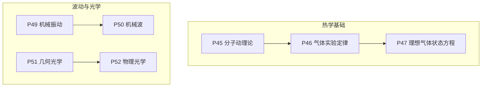
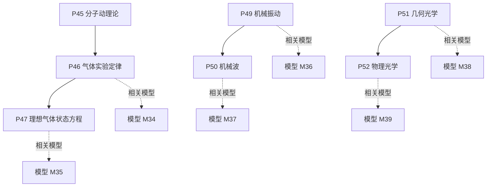
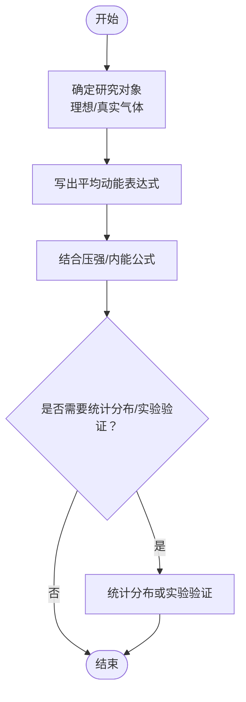
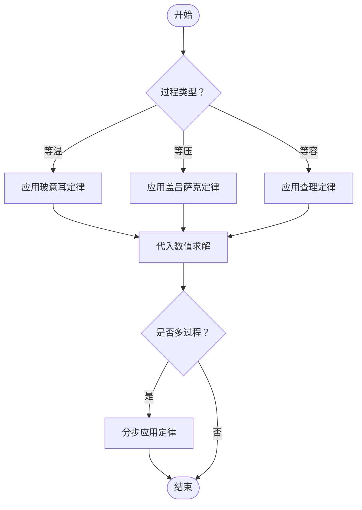
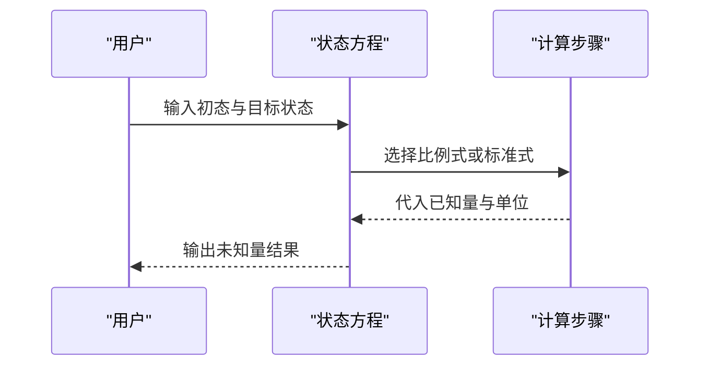
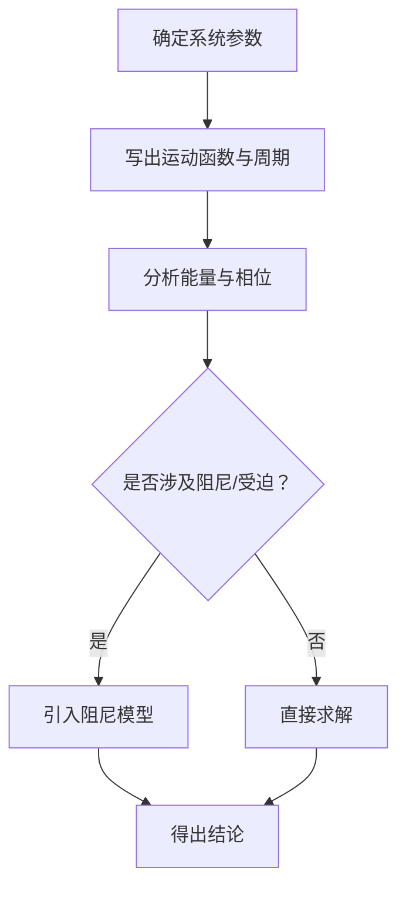
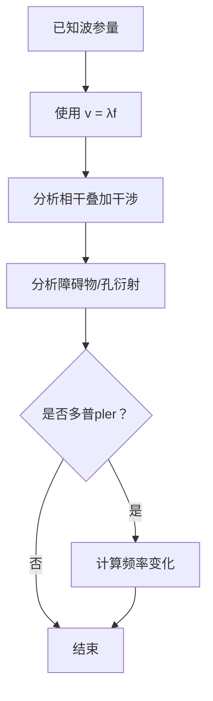
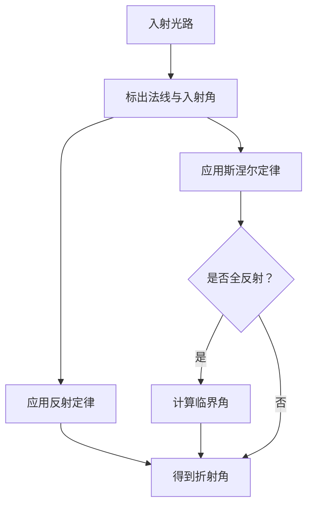
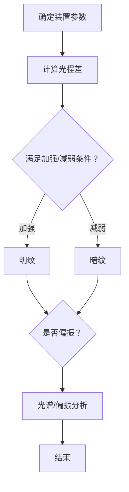
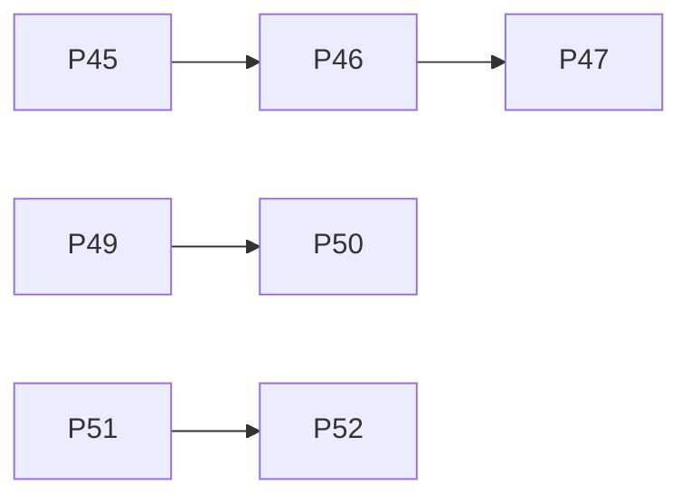

# 热学与光学模型

<cite>
**本文引用的文件**
- [P45_分子动理论.md](file://docs/knowledge/physics/P45_分子动理论.md)
- [P46_气体实验定律.md](file://docs/knowledge/physics/P46_气体实验定律.md)
- [P47_理想气体状态方程.md](file://docs/knowledge/physics/P47_理想气体状态方程.md)
- [P49_机械振动.md](file://docs/knowledge/physics/P49_机械振动.md)
- [P50_机械波.md](file://docs/knowledge/physics/P50_机械波.md)
- [P51_几何光学.md](file://docs/knowledge/physics/P51_几何光学.md)
- [P52_物理光学.md](file://docs/knowledge/physics/P52_物理光学.md)
</cite>

## 目录
1. [引言](#引言)
2. [项目结构](#项目结构)
3. [核心组件](#核心组件)
4. [架构总览](#架构总览)
5. [详细组件分析](#详细组件分析)
6. [依赖分析](#依赖分析)
7. [性能考虑](#性能考虑)
8. [故障排查指南](#故障排查指南)
9. [结论](#结论)
10. [附录](#附录)

## 引言
本文件面向“星耀平台”物理学科的热学与光学主题，系统梳理并文档化以下核心模型与知识节点：分子动理论、气体实验定律、理想气体状态方程、机械振动、机械波、几何光学、物理光学（波动光学）。文档从“知识节点”的角度出发，给出每个模型的定位声明、学科本质、常见误区、情境导入、实验/现象呈现、概念涌现、推导叙事、迁移应用、分层练习与公式卡片，并辅以可视化图示与解题模板，帮助学习者建立完整的知识网络与建模能力。

## 项目结构
热学与光学相关内容以“知识节点”形式组织在 docs/knowledge/physics 下，每个节点包含：
- 基本信息（id、名称、章节、前置节点、相关模型）
- 学科本质与常见误区
- 叙事正文（情境锚定、困惑预设、实验/现象呈现、概念涌现、推导叙事、迁移应用）
- 前置知识检测与分层变形（B/J/T）
- 公式卡片
- 自评与跨学科关联
- 检查清单

图表来源
- [P45_分子动理论.md:1-216](file://docs/knowledge/physics/P45_分子动理论.md#L1-L216)
- [P46_气体实验定律.md:1-211](file://docs/knowledge/physics/P46_气体实验定律.md#L1-L211)
- [P47_理想气体状态方程.md:1-200](file://docs/knowledge/physics/P47_理想气体状态方程.md#L1-L200)
- [P49_机械振动.md:1-215](file://docs/knowledge/physics/P49_机械振动.md#L1-L215)
- [P50_机械波.md:1-214](file://docs/knowledge/physics/P50_机械波.md#L1-L214)
- [P51_几何光学.md:1-213](file://docs/knowledge/physics/P51_几何光学.md#L1-L213)
- [P52_物理光学.md:1-218](file://docs/knowledge/physics/P52_物理光学.md#L1-L218)

章节来源
- [P45_分子动理论.md:1-216](file://docs/knowledge/physics/P45_分子动理论.md#L1-L216)
- [P46_气体实验定律.md:1-211](file://docs/knowledge/physics/P46_气体实验定律.md#L1-L211)
- [P47_理想气体状态方程.md:1-200](file://docs/knowledge/physics/P47_理想气体状态方程.md#L1-L200)
- [P49_机械振动.md:1-215](file://docs/knowledge/physics/P49_机械振动.md#L1-L215)
- [P50_机械波.md:1-214](file://docs/knowledge/physics/P50_机械波.md#L1-L214)
- [P51_几何光学.md:1-213](file://docs/knowledge/physics/P51_几何光学.md#L1-L213)
- [P52_物理光学.md:1-218](file://docs/knowledge/physics/P52_物理光学.md#L1-L218)

## 核心组件
本节按主题划分，逐项说明模型的适用场景、核心假设、数学表达与解题步骤，并给出典型应用与示例。

- 分子动理论
  - 适用场景：解释热现象的微观本质，理解温度与分子平均动能的关系、内能构成、压强的微观解释。
  - 核心假设：物质由大量分子组成；分子永不停息地做无规则运动；分子间存在相互作用力。
  - 数学表达：平均动能与温度成正比、压强的微观表达式、阿伏伽德罗常数。
  - 解题步骤：明确研究对象（理想气体）、写出平均动能表达式、结合压强微观公式、必要时引入统计分布或实验验证。
  - 示例：用分子动理论解释热膨胀、扩散、布朗运动；计算分子平均动能与阿伏伽德罗常数相关问题。

- 气体实验定律
  - 适用场景：单一过程（等温、等压、等容）下的状态参量关系，作为理想气体状态方程的基础。
  - 核心假设：理想气体模型；过程限定（等温、等压、等容）。
  - 数学表达：玻意耳定律、查理定律、盖吕萨克定律；统一为理想气体状态方程。
  - 解题步骤：识别过程类型（等温/等压/等容）、列出对应公式、代入已知量求解未知量、注意单位换算与温度绝对值。
  - 示例：等温压缩、等容升温、等压膨胀等典型问题；图像分析与多过程串联。

- 理想气体状态方程
  - 适用场景：描述初末状态或任意过程的状态参量关系，广泛用于热机、气象、呼吸系统等领域。
  - 核心假设：理想气体模型（分子间距大、除碰撞外无相互作用）。
  - 数学表达：标准形式与比例形式；气体常数与标准状况下的体积。
  - 解题步骤：确定初末状态、选择合适形式（比例式或标准式）、代入数值、注意温度单位与体积单位。
  - 示例：卡诺循环、肺泡气体交换、多过程分析与微观推导。

- 机械振动
  - 适用场景：弹簧振子、单摆等简谐运动系统；与能量转化、相位关系、阻尼振动相关。
  - 核心假设：回复力与位移成正比反向；无阻尼或小阻尼近似。
  - 数学表达：回复力、位移、速度、加速度、周期与频率；相位关系与能量分配。
  - 解题步骤：确定系统参数（m、k或L、g）、写出运动函数、计算周期/频率、分析能量与相位。
  - 示例：单摆测重力加速度、LC振荡电路类比、阻尼振动与相位分析。

- 机械波
  - 适用场景：波的传播、干涉、衍射、多普勒效应、驻波等现象。
  - 核心假设：振动在介质中的传播；介质不随波迁移；波源频率决定周期。
  - 数学表达：波速公式、波长与频率关系、干涉加强与减弱条件、衍射条件。
  - 解题步骤：确定波速、频率或波长，计算其他参量；分析相干叠加与边界条件。
  - 示例：声波传播、地震波、超声波应用、多普勒效应与驻波分析。

- 几何光学
  - 适用场景：反射、折射、全反射现象；透镜成像与光学器件设计。
  - 核心假设：光在均匀介质中沿直线传播；界面处遵循反射与折射定律。
  - 数学表达：反射定律、斯涅尔定律、全反射临界角、光速与折射率关系。
  - 解题步骤：识别界面与介质、画光路图、应用反射/折射定律、计算临界角与折射角。
  - 示例：光纤通信、眼镜、棱镜色散、平面镜成像。

- 物理光学（波动光学）
  - 适用场景：光的波动性验证（干涉、衍射、偏振）；光谱分析与光学镀膜。
  - 核心假设：光具有波动性；相干光源满足频率相同与相位差恒定。
  - 数学表达：双缝/单缝/薄膜干涉公式、衍射条件、偏振定律。
  - 解题步骤：确定实验装置与几何参数、计算光程差、判定明暗条纹、分析偏振效果。
  - 示例：光学镀膜增透、光谱分析、液晶显示器、迈克耳孙干涉仪。

章节来源
- [P45_分子动理论.md:173-182](file://docs/knowledge/physics/P45_分子动理论.md#L173-L182)
- [P46_气体实验定律.md:167-176](file://docs/knowledge/physics/P46_气体实验定律.md#L167-L176)
- [P47_理想气体状态方程.md:157-166](file://docs/knowledge/physics/P47_理想气体状态方程.md#L157-L166)
- [P49_机械振动.md:171-180](file://docs/knowledge/physics/P49_机械振动.md#L171-L180)
- [P50_机械波.md:171-180](file://docs/knowledge/physics/P50_机械波.md#L171-L180)
- [P51_几何光学.md:170-179](file://docs/knowledge/physics/P51_几何光学.md#L170-L179)
- [P52_物理光学.md:175-184](file://docs/knowledge/physics/P52_物理光学.md#L175-L184)

## 架构总览
热学与光学的知识节点在“章节—小节—模型”的层级上形成闭环：热学以“分子动理论”为起点，经“气体实验定律”过渡到“理想气体状态方程”；波动与光学以“机械振动”为基础，发展为“机械波”，随后进入“几何光学”再到“物理光学”。该结构既体现知识的递进关系，又便于学习者按“前置知识—模型—应用”的路径进行学习。

图表来源
- [P45_分子动理论.md:15-17](file://docs/knowledge/physics/P45_分子动理论.md#L15-L17)
- [P46_气体实验定律.md:15-17](file://docs/knowledge/physics/P46_气体实验定律.md#L15-L17)
- [P47_理想气体状态方程.md:15-17](file://docs/knowledge/physics/P47_理想气体状态方程.md#L15-L17)
- [P49_机械振动.md:15-17](file://docs/knowledge/physics/P49_机械振动.md#L15-L17)
- [P50_机械波.md:15-17](file://docs/knowledge/physics/P50_机械波.md#L15-L17)
- [P51_几何光学.md:15-17](file://docs/knowledge/physics/P51_几何光学.md#L15-L17)
- [P52_物理光学.md:15-17](file://docs/knowledge/physics/P52_物理光学.md#L15-L17)

## 详细组件分析

### 分子动理论
- 物理原理：温度是分子平均动能的量度；内能由平均动能与势能组成；压强的微观解释源于分子对器壁的碰撞。
- 解题模板：
  1) 明确对象：理想气体/真实气体
  2) 写出平均动能表达式与相关常数
  3) 结合压强微观公式或内能公式
  4) 必要时进行统计分布或实验验证
- 应用示例：热膨胀、扩散、布朗运动；计算分子平均动能与阿伏伽德罗常数。

图表来源
- [P45_分子动理论.md:75-87](file://docs/knowledge/physics/P45_分子动理论.md#L75-L87)
- [P45_分子动理论.md:173-182](file://docs/knowledge/physics/P45_分子动理论.md#L173-L182)

章节来源
- [P45_分子动理论.md:1-216](file://docs/knowledge/physics/P45_分子动理论.md#L1-L216)

### 气体实验定律
- 物理原理：在特定约束下（等温、等压、等容），压强、体积、温度满足简单函数关系；统一于理想气体状态方程。
- 解题模板：
  1) 识别过程类型（等温/等压/等容）
  2) 写出对应公式
  3) 代入已知量，注意温度单位与体积单位
  4) 多过程串联时分步应用
- 应用示例：打气筒压缩、温度计原理、高压锅等。

图表来源
- [P46_气体实验定律.md:69-82](file://docs/knowledge/physics/P46_气体实验定律.md#L69-L82)
- [P46_气体实验定律.md:167-176](file://docs/knowledge/physics/P46_气体实验定律.md#L167-L176)

章节来源
- [P46_气体实验定律.md:1-211](file://docs/knowledge/physics/P46_气体实验定律.md#L1-L211)

### 理想气体状态方程
- 物理原理：统一描述初末状态或任意过程；可由分子动理论推导；广泛应用于热机、气象、生物系统。
- 解题模板：
  1) 选择合适形式（比例式或标准式）
  2) 确定初末状态参量
  3) 代入气体常数与单位
  4) 多过程分析时分步处理
- 应用示例：卡诺循环、肺泡气体交换、p-V图像分析。

图表来源
- [P47_理想气体状态方程.md:50-67](file://docs/knowledge/physics/P47_理想气体状态方程.md#L50-L67)
- [P47_理想气体状态方程.md:157-166](file://docs/knowledge/physics/P47_理想气体状态方程.md#L157-L166)

章节来源
- [P47_理想气体状态方程.md:1-200](file://docs/knowledge/physics/P47_理想气体状态方程.md#L1-L200)

### 机械振动
- 物理原理：简谐运动的回复力与位移成正比反向；周期与振幅无关；涉及能量转化与相位关系。
- 解题模板：
  1) 确定系统参数（m、k或L、g）
  2) 写出运动函数与周期公式
  3) 分析能量与相位关系
  4) 阻尼与受迫振动的拓展
- 应用示例：单摆测重力加速度、LC振荡电路类比、阻尼振动分析。

图表来源
- [P49_机械振动.md:58-86](file://docs/knowledge/physics/P49_机械振动.md#L58-L86)
- [P49_机械振动.md:171-180](file://docs/knowledge/physics/P49_机械振动.md#L171-L180)

章节来源
- [P49_机械振动.md:1-215](file://docs/knowledge/physics/P49_机械振动.md#L1-L215)

### 机械波
- 物理原理：振动在介质中的传播；波传播的是能量与信息；涉及干涉、衍射、多普勒效应与驻波。
- 解题模板：
  1) 确定波速、频率或波长
  2) 使用波速公式与相干条件
  3) 分析边界与叠加
  4) 多普勒与驻波的拓展
- 应用示例：声波传播、地震波、超声波、多普勒效应与驻波分析。

图表来源
- [P50_机械波.md:73-86](file://docs/knowledge/physics/P50_机械波.md#L73-L86)
- [P50_机械波.md:171-180](file://docs/knowledge/physics/P50_机械波.md#L171-L180)

章节来源
- [P50_机械波.md:1-214](file://docs/knowledge/physics/P50_机械波.md#L1-L214)

### 几何光学
- 物理原理：光在均匀介质中沿直线传播；界面处遵循反射与折射定律；全反射条件与临界角。
- 解题模板：
  1) 识别界面与介质
  2) 画光路图
  3) 应用反射/折射定律
  4) 计算临界角与折射角
- 应用示例：光纤通信、眼镜、棱镜色散、平面镜成像。

图表来源
- [P51_几何光学.md:60-82](file://docs/knowledge/physics/P51_几何光学.md#L60-L82)
- [P51_几何光学.md:170-179](file://docs/knowledge/physics/P51_几何光学.md#L170-L179)

章节来源
- [P51_几何光学.md:1-213](file://docs/knowledge/physics/P51_几何光学.md#L1-L213)

### 物理光学（波动光学）
- 物理原理：光的波动性通过干涉、衍射与偏振得以验证；相干条件与光程差决定明暗条纹。
- 解题模板：
  1) 确定实验装置与几何参数
  2) 计算光程差
  3) 判定明暗条纹
  4) 分析偏振与波长测量
- 应用示例：光学镀膜、光谱分析、液晶显示器、迈克耳孙干涉仪。

图表来源
- [P52_物理光学.md:74-90](file://docs/knowledge/physics/P52_物理光学.md#L74-L90)
- [P52_物理光学.md:175-184](file://docs/knowledge/physics/P52_物理光学.md#L175-L184)

章节来源
- [P52_物理光学.md:1-218](file://docs/knowledge/physics/P52_物理光学.md#L1-L218)

## 依赖分析
- 知识依赖：热学部分呈线性递进，P45→P46→P47；波动与光学部分亦呈线性递进，P49→P50，P51→P52。
- 模型关联：各节点标注“相关模型”，便于学习者在掌握模型后回看对应知识节点，强化理解。

图表来源
- [P45_分子动理论.md:15-17](file://docs/knowledge/physics/P45_分子动理论.md#L15-L17)
- [P46_气体实验定律.md:15-17](file://docs/knowledge/physics/P46_气体实验定律.md#L15-L17)
- [P47_理想气体状态方程.md:15-17](file://docs/knowledge/physics/P47_理想气体状态方程.md#L15-L17)
- [P49_机械振动.md:15-17](file://docs/knowledge/physics/P49_机械振动.md#L15-L17)
- [P50_机械波.md:15-17](file://docs/knowledge/physics/P50_机械波.md#L15-L17)
- [P51_几何光学.md:15-17](file://docs/knowledge/physics/P51_几何光学.md#L15-L17)
- [P52_物理光学.md:15-17](file://docs/knowledge/physics/P52_物理光学.md#L15-L17)

章节来源
- [P45_分子动理论.md:15-17](file://docs/knowledge/physics/P45_分子动理论.md#L15-L17)
- [P46_气体实验定律.md:15-17](file://docs/knowledge/physics/P46_气体实验定律.md#L15-L17)
- [P47_理想气体状态方程.md:15-17](file://docs/knowledge/physics/P47_理想气体状态方程.md#L15-L17)
- [P49_机械振动.md:15-17](file://docs/knowledge/physics/P49_机械振动.md#L15-L17)
- [P50_机械波.md:15-17](file://docs/knowledge/physics/P50_机械波.md#L15-L17)
- [P51_几何光学.md:15-17](file://docs/knowledge/physics/P51_几何光学.md#L15-L17)
- [P52_物理光学.md:15-17](file://docs/knowledge/physics/P52_物理光学.md#L15-L17)

## 性能考虑
- 学习效率：建议按“前置知识—模型—应用”的路径推进，避免跳跃导致概念混淆。
- 计算精度：注意单位换算（温度用开尔文、体积用立方米、压强用帕斯卡），减少计算误差。
- 图像辅助：p-V图、波形图、光路图有助于快速锁定过程与参量关系。

## 故障排查指南
- 常见误区
  - 将温度视为分子动能总量而非平均值
  - 将等温过程误认为初末温度相同
  - 将波传播等同于介质迁移
  - 将反射与折射混淆
  - 将干涉仅限于双缝实验
- 自检清单
  - 是否正确识别过程类型与适用公式
  - 是否注意单位与温度绝对值
  - 是否画出必要的图示（光路、p-V、波形）
  - 是否区分波动与粒子特性

章节来源
- [P45_分子动理论.md:25-27](file://docs/knowledge/physics/P45_分子动理论.md#L25-L27)
- [P46_气体实验定律.md:25-27](file://docs/knowledge/physics/P46_气体实验定律.md#L25-L27)
- [P50_机械波.md:25-27](file://docs/knowledge/physics/P50_机械波.md#L25-L27)
- [P51_几何光学.md:25-27](file://docs/knowledge/physics/P51_几何光学.md#L25-L27)
- [P52_物理光学.md:25-27](file://docs/knowledge/physics/P52_物理光学.md#L25-L27)

## 结论
通过上述知识节点与模型的系统化梳理，学习者可在“热学—波动—光学”的主线框架下，建立从微观到宏观、从几何到波动的完整认知体系。建议配合分层练习与图像分析，逐步提升建模与解题能力，并将模型迁移到生活与科技应用中，深化对热现象与光现象的理解。

## 附录
- 公式卡片（节选）
  - 分子动理论：平均动能、压强微观表达式、阿伏伽德罗常数
  - 气体实验定律：玻意耳定律、查理定律、盖吕萨克定律
  - 理想气体状态方程：标准形式与比例形式、气体常数
  - 机械振动：回复力、周期、相位关系
  - 机械波：波速公式、干涉与衍射条件
  - 几何光学：反射定律、斯涅尔定律、全反射临界角
  - 物理光学：双缝/单缝/薄膜干涉公式、偏振定律

章节来源
- [P45_分子动理论.md:173-182](file://docs/knowledge/physics/P45_分子动理论.md#L173-L182)
- [P46_气体实验定律.md:167-176](file://docs/knowledge/physics/P46_气体实验定律.md#L167-L176)
- [P47_理想气体状态方程.md:157-166](file://docs/knowledge/physics/P47_理想气体状态方程.md#L157-L166)
- [P49_机械振动.md:171-180](file://docs/knowledge/physics/P49_机械振动.md#L171-L180)
- [P50_机械波.md:171-180](file://docs/knowledge/physics/P50_机械波.md#L171-L180)
- [P51_几何光学.md:170-179](file://docs/knowledge/physics/P51_几何光学.md#L170-L179)
- [P52_物理光学.md:175-184](file://docs/knowledge/physics/P52_物理光学.md#L175-L184)