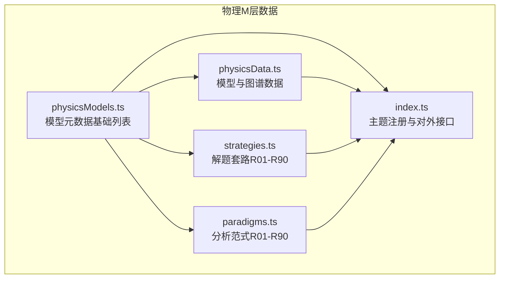
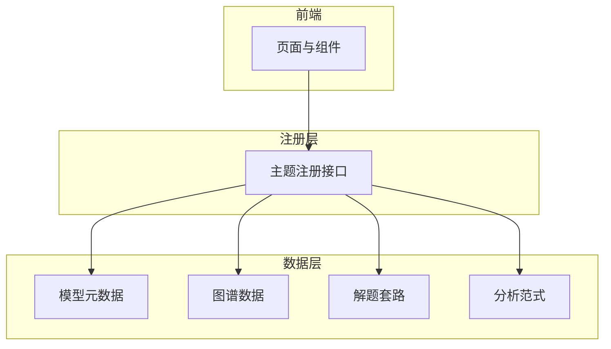
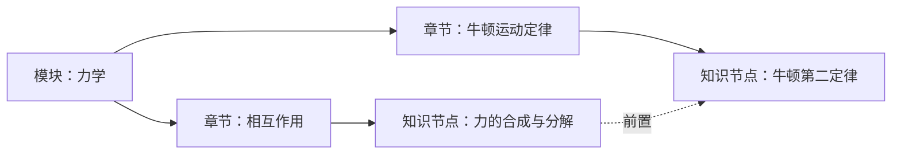
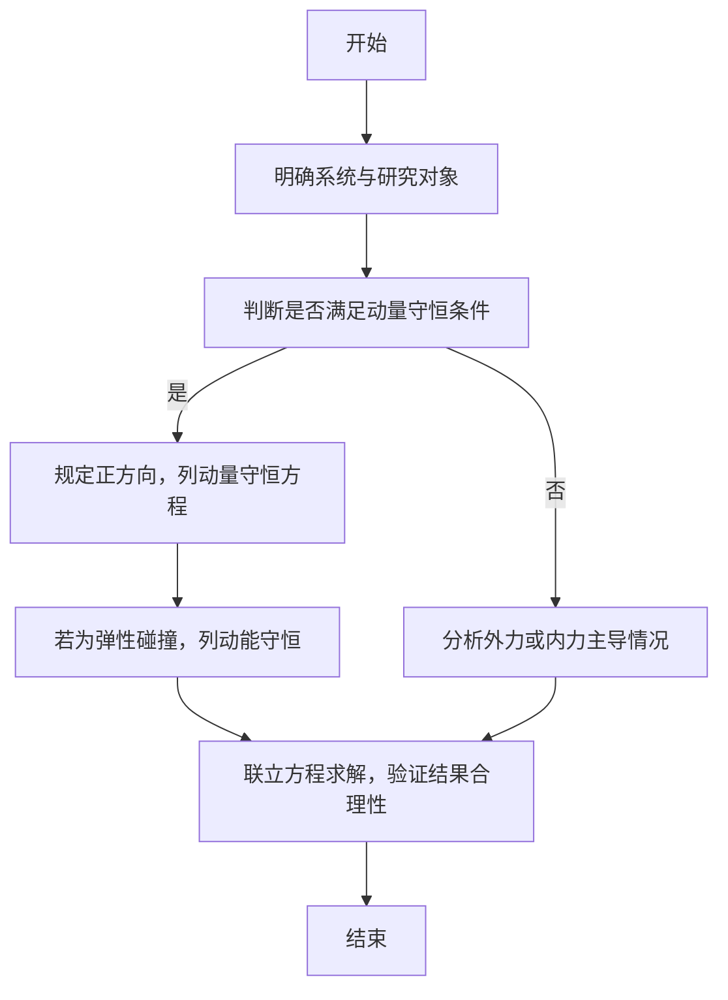
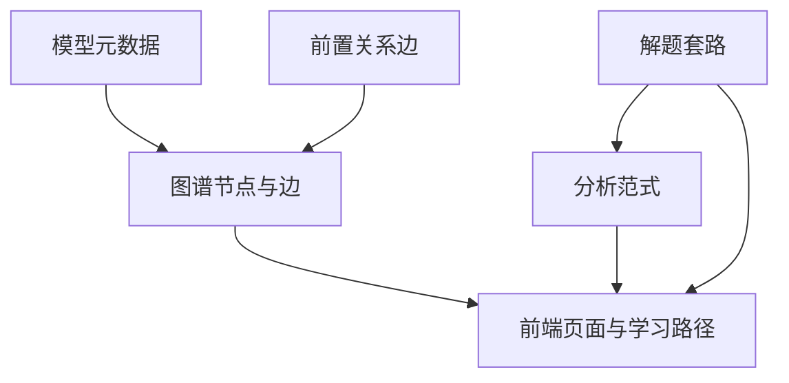

# 物理核心模型（M层）

<cite>
**本文引用的文件**
- [physicsModels.ts](file://src/data/physics/physicsModels.ts)
- [physicsData.ts](file://src/data/physics/physicsData.ts)
- [strategies.ts](file://src/data/physics/strategies.ts)
- [paradigms.ts](file://src/data/physics/paradigms.ts)
- [index.ts](file://src/data/physics/index.ts)
</cite>

## 目录
1. [引言](#引言)
2. [项目结构](#项目结构)
3. [核心组件](#核心组件)
4. [架构总览](#架构总览)
5. [详细组件分析](#详细组件分析)
6. [依赖分析](#依赖分析)
7. [性能考量](#性能考量)
8. [故障排查指南](#故障排查指南)
9. [结论](#结论)
10. [附录](#附录)

## 引言
本文件面向“星耀平台”物理学科的“核心模型（M层）”，系统化梳理并文档化42个物理核心模型的分类体系、模块归属、难度等级、适用场景与知识节点对应关系，并给出典型模型的建立思路、适用条件与解题步骤。文档同时呈现模型与知识节点的层级关系、模型间的前置依赖关系，以及如何通过模型与范式（Paradigms）协同解决复杂物理问题。

## 项目结构
物理M层数据由以下模块化文件支撑：
- 物理模型清单与元数据：physicsModels.ts
- 模型与知识节点的图谱数据：physicsData.ts
- 解题套路（Routines）：strategies.ts
- 分析范式（Paradigms）：paradigms.ts
- 主题注册与对外接口：index.ts

**图表来源**
- [physicsModels.ts:1-66](file://src/data/physics/physicsModels.ts#L1-L66)
- [physicsData.ts:1-138](file://src/data/physics/physicsData.ts#L1-L138)
- [strategies.ts:1-1920](file://src/data/physics/strategies.ts#L1-L1920)
- [paradigms.ts:1-1978](file://src/data/physics/paradigms.ts#L1-L1978)
- [index.ts:1-433](file://src/data/physics/index.ts#L1-L433)

**章节来源**
- [physicsModels.ts:1-66](file://src/data/physics/physicsModels.ts#L1-L66)
- [physicsData.ts:1-138](file://src/data/physics/physicsData.ts#L1-L138)
- [index.ts:1-433](file://src/data/physics/index.ts#L1-L433)

## 核心组件
- 模型元数据（基础列表）：提供42个模型的标准化元数据（id、title、module、chapter、order），作为前端页面与图谱构建的基础。
- 模型与图谱数据：提供模型节点、模块节点、前置关系边，以及难度等级映射，用于生成认知图谱。
- 解题套路（Routines）：覆盖运动学、力学、功能关系、动量、电场、电路、磁场、电磁感应、热学、光学、机械波、近代物理等，提供“触发信号—思考路径—常见错因—本质回溯”的结构化解题流程。
- 分析范式（Paradigms）：将Routines进一步抽象为“范式”，强调“思维方法—难度层级—触发条件—思考路径—错因图谱—本质回溯”。

**章节来源**
- [physicsModels.ts:22-65](file://src/data/physics/physicsModels.ts#L22-L65)
- [physicsData.ts:80-120](file://src/data/physics/physicsData.ts#L80-L120)
- [strategies.ts:19-1920](file://src/data/physics/strategies.ts#L19-L1920)
- [paradigms.ts:15-55](file://src/data/physics/paradigms.ts#L15-L55)

## 架构总览
物理M层采用“模型元数据 + 图谱数据 + 范式/套路 + 注册接口”的分层架构：
- 模型元数据驱动前端列表与详情页
- 图谱数据驱动认知图谱与学习路径
- 范式/套路驱动解题与错因分析
- 注册接口统一对外暴露能力

**图表来源**
- [index.ts:383-431](file://src/data/physics/index.ts#L383-L431)
- [physicsModels.ts:22-65](file://src/data/physics/physicsModels.ts#L22-L65)
- [physicsData.ts:80-120](file://src/data/physics/physicsData.ts#L80-L120)
- [strategies.ts:19-1920](file://src/data/physics/strategies.ts#L19-L1920)
- [paradigms.ts:56-55](file://src/data/physics/paradigms.ts#L56-L55)

## 详细组件分析

### 模型分类体系与模块归属
- 运动学：4个模型（匀变速直线运动、自由落体与竖直上抛、竖直上抛与追及相遇、追及与相遇）
- 力学：5个模型（力的合成与分解、牛顿第二定律、弹簧模型、板块模型、传送带模型）
- 曲线运动：3个模型（曲线运动基础、平抛运动、圆周运动）
- 万有引力：1个模型（天体运动）
- 机械能：3个模型（功和功率、动能定理、机械能守恒）
- 动量：3个模型（动量定理、动量守恒、碰撞模型）
- 电场：3个模型（电场强度、电势与电势能、电容器）
- 电路：1个模型（欧姆定律与电路）
- 磁场：2个模型（磁场与安培力、洛伦兹力）
- 电磁感应：3个模型（电磁感应、交变电流、理想变压器）
- 热学：4个模型（分子动理论、气体状态方程、热力学第一定律、热力学第二定律）
- 光学：3个模型（光的折射与全反射、透镜成像规律、干涉与衍射）
- 机械波：3个模型（机械振动、机械波、波的干涉与衍射）
- 近代物理：4个模型（光电效应与波粒二象性、原子结构、核反应与核能、相对论基础）

难度等级映射规则：
- order≤4：难度1
- 4<order≤16：难度2
- order>16：难度3

**章节来源**
- [physicsModels.ts:22-65](file://src/data/physics/physicsModels.ts#L22-L65)
- [physicsData.ts:84-101](file://src/data/physics/physicsData.ts#L84-L101)

### 模型与知识节点的对应关系
- 模型与知识节点通过“包含”关系连接，形成“模块→章节→知识节点”的层级。
- 模型与知识节点的前置关系通过“prerequisite”边体现，支持学习路径规划与能力诊断。

**图表来源**
- [physicsData.ts:104-117](file://src/data/physics/physicsData.ts#L104-L117)

**章节来源**
- [physicsData.ts:80-120](file://src/data/physics/physicsData.ts#L80-L120)

### 模型与范式（Paradigms）的协同
- Paradigms将Routine中的“触发信号—思考路径—常见错因—本质回溯”结构化，便于教学与错因分析。
- 不同难度层级（B/J/T）对应不同思维层次，便于个性化学习路径设计。

**章节来源**
- [paradigms.ts:15-55](file://src/data/physics/paradigms.ts#L15-L55)
- [strategies.ts:19-1920](file://src/data/physics/strategies.ts#L19-L1920)

### 典型模型示例

#### 匀变速直线运动模型（PHY-M01）
- 适用场景：单物体匀变速直线运动、刹车问题、多过程与临界极值
- 核心假设：加速度恒定
- 数学表达式：v=v₀+at；x=v₀t+½at²；v²-v₀²=2ax
- 解题步骤：
  1) 明确已知量（v₀、v、a、t、x）
  2) 依据“缺什么→选什么”选择公式
  3) 代入求解，注意方向与正负
- 典型错因：混淆位移公式、忽略刹车停止时间、a的正负号

**章节来源**
- [strategies.ts:25-42](file://src/data/physics/strategies.ts#L25-L42)
- [paradigms.ts:62-80](file://src/data/physics/paradigms.ts#L62-L80)

#### 圆周运动模型（PHY-M12）
- 适用场景：水平面圆周、竖直平面圆周（绳/杆）、圆锥摆
- 核心假设：向心力由合外力提供
- 数学表达式：F=mv²/r=mω²r=m(2π/T)²r
- 解题步骤：
  1) 找圆心，受力分析，列出指向圆心的合力
  2) 判断是匀速还是变速圆周，选择合适公式
  3) 竖直圆周注意最高点与最低点的受力差异
- 典型错因：把某个分力当向心力、速度方向与向心力方向混淆

**章节来源**
- [strategies.ts:751-768](file://src/data/physics/strategies.ts#L751-L768)
- [paradigms.ts:464-483](file://src/data/physics/paradigms.ts#L464-L483)

#### 动量守恒模型（PHY-M18）
- 适用场景：碰撞、爆炸、反冲、发射卫星
- 核心假设：系统不受外力或外力远小于内力
- 数学表达式：Σp=常数；m₁v₁+m₂v₂=m₁v₁'+m₂v₂'
- 解题步骤：
  1) 明确系统，判断是否满足动量守恒
  2) 规定正方向，列动量守恒方程
  3) 若为弹性碰撞，再列动能守恒
- 典型错因：把内力当外力、不规定正方向、多物体速度未分清

**章节来源**
- [strategies.ts:1064-1082](file://src/data/physics/strategies.ts#L1064-L1082)
- [paradigms.ts:806-823](file://src/data/physics/paradigms.ts#L806-L823)

#### 电场强度模型（PHY-M20）
- 适用场景：点电荷、均匀带电球壳、均匀带电平面
- 核心假设：静电场、叠加原理
- 数学表达式：点电荷 E=kQ/r²；球壳内部 E=0；无限大平面 E=σ/(2ε₀)
- 解题步骤：
  1) 识别场源形状，选择合适公式
  2) 均匀带电球壳：内部 E=0，外部等效为球心处点电荷
  3) 叠加原理：多个场源矢量合成
- 典型错因：混淆球壳内外场强、用叠加时忽略矢量性

**章节来源**
- [strategies.ts:911-928](file://src/data/physics/strategies.ts#L911-L928)
- [paradigms.ts:911-928](file://src/data/physics/paradigms.ts#L911-L928)

#### 电磁感应模型（PHY-M26）
- 适用场景：导体棒切割磁感线、闭合回路感应电动势
- 核心假设：导体棒垂直切割、匀强磁场
- 数学表达式：E=BLv（垂直切割）；安培力 F=BIL
- 解题步骤：
  1) 识别电源：切割导体棒内部为非静电力方向
  2) 感应电动势 E=BLv，判断电流方向
  3) 按闭合电路欧姆定律分析回路电流与功率
- 典型错因：误用有效长度、忽略电流方向、混淆感应电动势与安培力

**章节来源**
- [strategies.ts:1188-1200](file://src/data/physics/strategies.ts#L1188-L1200)
- [paradigms.ts:1188-1200](file://src/data/physics/paradigms.ts#L1188-L1200)

### 模型建立流程与解题步骤（以动量守恒为例）

**图表来源**
- [strategies.ts:1064-1082](file://src/data/physics/strategies.ts#L1064-L1082)

## 依赖分析
- 模型元数据驱动图谱构建：physicsModels.ts提供节点与边的数据来源。
- 前置关系驱动学习路径：prerequisiteEdges定义模型间的先后顺序。
- 范式与套路协同：paradigms.ts与strategies.ts在“触发—路径—错因—本质”层面互补。

**图表来源**
- [physicsModels.ts:22-65](file://src/data/physics/physicsModels.ts#L22-L65)
- [physicsData.ts:42-78](file://src/data/physics/physicsData.ts#L42-L78)
- [paradigms.ts:56-55](file://src/data/physics/paradigms.ts#L56-L55)

**章节来源**
- [physicsData.ts:41-120](file://src/data/physics/physicsData.ts#L41-L120)

## 性能考量
- 数据结构：模型元数据与图谱数据采用扁平数组与映射，便于前端快速渲染与查询。
- 渲染优化：模块与难度等级在服务端预计算，前端按需加载。
- 扩展性：通过注册接口统一暴露能力，新增模型与范式无需改动前端。

## 故障排查指南
- 模型缺失：若模型不在模型清单中，需先在模型数据映射中补充，再由清单自动同步。
- 前置关系错误：检查prerequisiteEdges中源/目标模型ID是否与模型清单一致。
- 范式与套路不一致：确保paradigms.ts与strategies.ts字段映射正确（如level、trigger、path、errorMap）。

**章节来源**
- [physicsModels.ts:7-9](file://src/data/physics/physicsModels.ts#L7-L9)
- [physicsData.ts:42-78](file://src/data/physics/physicsData.ts#L42-L78)
- [paradigms.ts:6-14](file://src/data/physics/paradigms.ts#L6-L14)

## 结论
物理M层通过“模型元数据—图谱数据—范式/套路—注册接口”的分层设计，实现了模型、知识节点与学习路径的有机融合。42个核心模型覆盖运动学、力学、曲线运动、万有引力、机械能、动量、电场、电路、磁场、电磁感应、热学、光学、机械波、近代物理等主干知识域，配合范式化的解题流程与错因分析，能够有效支撑学生从“知识掌握”到“思维运用”再到“迁移创新”的进阶学习。

## 附录
- 模型与模块/章节映射：见模型元数据清单
- 难度等级：基于order字段映射（1/2/3）
- 前置关系：见prerequisiteEdges

**章节来源**
- [physicsModels.ts:22-65](file://src/data/physics/physicsModels.ts#L22-L65)
- [physicsData.ts:84-101](file://src/data/physics/physicsData.ts#L84-L101)
- [physicsData.ts:42-78](file://src/data/physics/physicsData.ts#L42-L78)