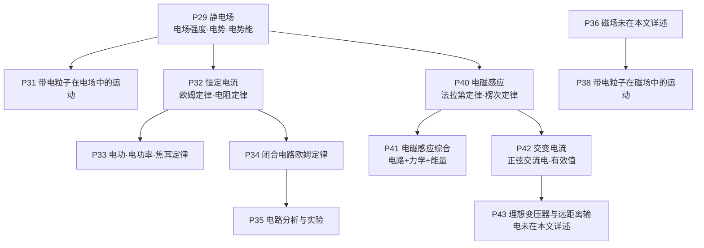
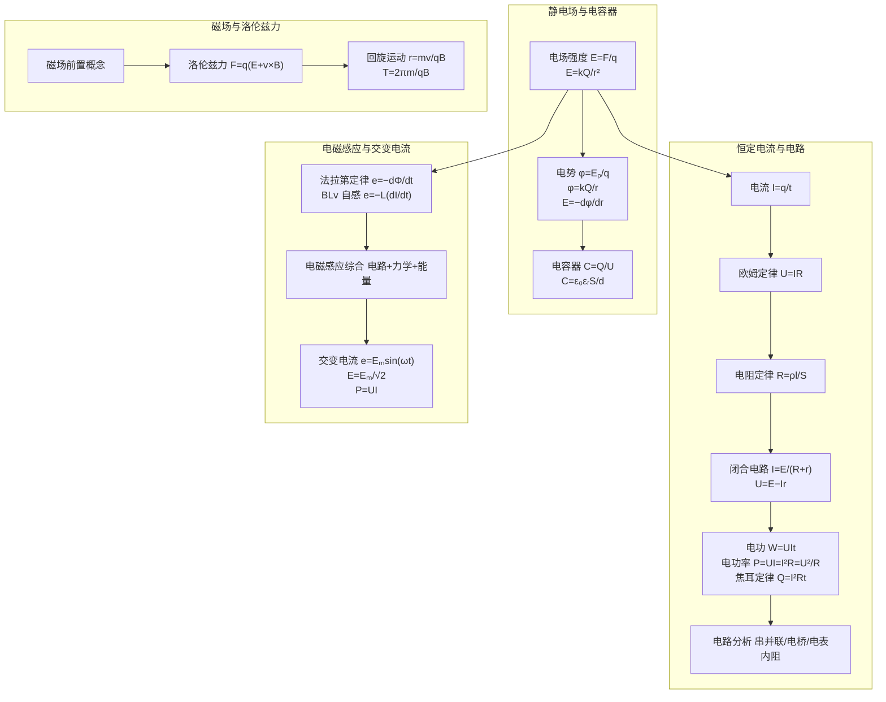
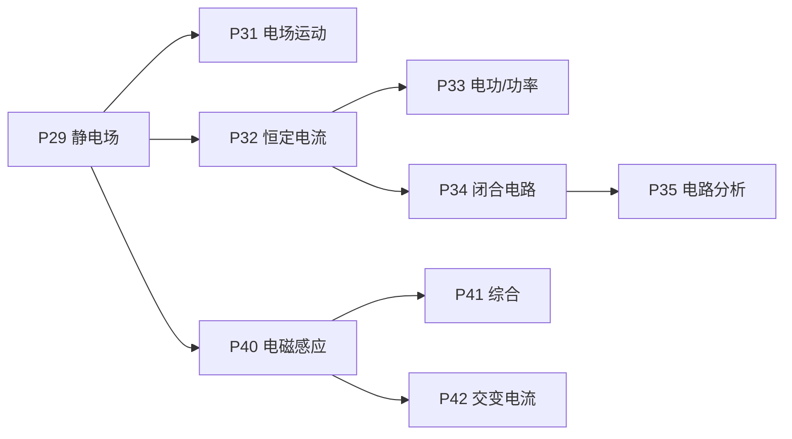

# 电磁学模型

<cite>
**本文引用的文件**   
- [静电场.md](file://docs/knowledge/physics/P29_静电场.md)
- [带电粒子在电场中的运动.md](file://docs/knowledge/physics/P31_带电粒子在电场中的运动.md)
- [恒定电流.md](file://docs/knowledge/physics/P32_恒定电流.md)
- [电功与电功率.md](file://docs/knowledge/physics/P33_电功与电功率.md)
- [闭合电路欧姆定律.md](file://docs/knowledge/physics/P34_闭合电路欧姆定律.md)
- [电路分析与实验.md](file://docs/knowledge/physics/P35_电路分析与实验.md)
- [带电粒子在磁场中的运动.md](file://docs/knowledge/physics/P38_带电粒子在磁场中的运动.md)
- [电磁感应.md](file://docs/knowledge/physics/P40_电磁感应.md)
- [电磁感应综合.md](file://docs/knowledge/physics/P41_电磁感应综合.md)
- [交变电流.md](file://docs/knowledge/physics/P42_交变电流.md)
</cite>

## 目录
1. [引言](#引言)
2. [项目结构](#项目结构)
3. [核心组件](#核心组件)
4. [架构总览](#架构总览)
5. [详细组件分析](#详细组件分析)
6. [依赖分析](#依赖分析)
7. [性能考量](#性能考量)
8. [故障排查指南](#故障排查指南)
9. [结论](#结论)
10. [附录](#附录)

## 引言
本文件面向星耀平台物理学科的“电磁学模型”，系统梳理并文档化以下核心主题：电场强度、电势与电势能、电容器、欧姆定律与电路、磁场与安培力、洛伦兹力、电磁感应、交变电流、理想变压器等。文档从知识节点视角出发，结合“情境锚定—困惑预设—实验/现象呈现—概念涌现—推导叙事—迁移应用”的叙述结构，给出适用场景、核心假设、数学表达式、解题步骤与典型示例，帮助学习者建立完整的电磁学知识网络与建模能力。

## 项目结构
本仓库中与电磁学相关的内容主要分布在 docs/knowledge/physics 下的知识节点文档，覆盖从静电场到交变电流与电磁感应综合的完整主线。这些文档以“知识节点”为单位，统一采用结构化叙事与分层练习，便于形成从基础到综合的学习闭环。

图示来源
- [静电场.md](file://docs/knowledge/physics/P29_静电场.md)
- [带电粒子在电场中的运动.md](file://docs/knowledge/physics/P31_带电粒子在电场中的运动.md)
- [恒定电流.md](file://docs/knowledge/physics/P32_恒定电流.md)
- [电功与电功率.md](file://docs/knowledge/physics/P33_电功与电功率.md)
- [闭合电路欧姆定律.md](file://docs/knowledge/physics/P34_闭合电路欧姆定律.md)
- [电路分析与实验.md](file://docs/knowledge/physics/P35_电路分析与实验.md)
- [带电粒子在磁场中的运动.md](file://docs/knowledge/physics/P38_带电粒子在磁场中的运动.md)
- [电磁感应.md](file://docs/knowledge/physics/P40_电磁感应.md)
- [电磁感应综合.md](file://docs/knowledge/physics/P41_电磁感应综合.md)
- [交变电流.md](file://docs/knowledge/physics/P42_交变电流.md)

章节来源
- [静电场.md](file://docs/knowledge/physics/P29_静电场.md)
- [恒定电流.md](file://docs/knowledge/physics/P32_恒定电流.md)
- [闭合电路欧姆定律.md](file://docs/knowledge/physics/P34_闭合电路欧姆定律.md)
- [电路分析与实验.md](file://docs/knowledge/physics/P35_电路分析与实验.md)
- [带电粒子在电场中的运动.md](file://docs/knowledge/physics/P31_带电粒子在电场中的运动.md)
- [带电粒子在磁场中的运动.md](file://docs/knowledge/physics/P38_带电粒子在磁场中的运动.md)
- [电磁感应.md](file://docs/knowledge/physics/P40_电磁感应.md)
- [电磁感应综合.md](file://docs/knowledge/physics/P41_电磁感应综合.md)
- [交变电流.md](file://docs/knowledge/physics/P42_交变电流.md)

## 核心组件
本节从“模型—原理—公式—应用”的维度，对电磁学九个核心模型进行系统化梳理。

- 电场强度
  - 适用场景：判断电荷在电场中的受力、分析电场分布、计算电场叠加
  - 核心假设：试探电荷不影响原电场；真空中点电荷模型
  - 数学表达式：定义式 E = F/q；点电荷场强 E = kQ/r²
  - 解题步骤：确定场源电荷→选择合适公式→代入数值→矢量合成
  - 示例：点电荷在空间某点的场强大小与方向；均匀带电球体内外场强分布

- 电势与电势能
  - 适用场景：计算电势差、电势能变化、电场力做功
  - 核心假设：零电势参考点（通常取无穷远）
  - 数学表达式：电势 φ = Eₚ/q；点电荷 φ = kQ/r；E = −dφ/dr
  - 解题步骤：选定参考点→计算电势→求电势差→计算电势能变化
  - 示例：电势公式的逆推求电荷量；场强与电势关系的微分形式

- 电容器
  - 适用场景：储能、滤波、振荡电路
  - 核心假设：平行板电容器（忽略边缘效应）
  - 数学表达式：C = Q/U；C = ε₀εᵣS/d；电场 E = U/d
  - 解题步骤：识别电容器结构→写出电容公式→代入已知量→求电量/电压/能量
  - 示例：电容器串并联等效；电容器与电阻构成RC电路的时间常数

- 欧姆定律与电阻定律
  - 适用场景：恒定电流电路的电压、电流、电阻关系
  - 核心假设：金属导体；温度对电阻的影响
  - 数学表达式：U = IR；R = ρl/S
  - 解题步骤：识别电路结构→应用欧姆定律→考虑温度修正
  - 示例：串联分压、并联分流；金属电阻随温度变化

- 闭合电路欧姆定律
  - 适用场景：含电源的全电路分析
  - 核心假设：电源有内阻
  - 数学表达式：I = E/(R+r)；U = E − Ir；E = U外 + U内
  - 解题步骤：画出全电路→列出电流与路端电压表达式→讨论功率与效率
  - 示例：短路电流；最大输出功率条件；动态电路分析

- 电路分析与实验
  - 适用场景：复杂电路等效、电表内阻影响、电桥平衡
  - 核心假设：理想电表；电桥平衡时检流计无电流
  - 数学表达式：串联总电阻求和；并联倒数和；电桥平衡 R₁/R₂ = R₃/R₄
  - 解题步骤：识别串并联→等效替换→逐步简化→误差分析
  - 示例：电流表内接/外接的选择；电桥平衡的证明与应用

- 带电粒子在磁场中的运动
  - 适用场景：回旋运动、质谱仪、回旋加速器
  - 核心假设：匀强磁场；粒子速度垂直于B
  - 数学表达式：r = mv/qB；T = 2πm/qB；ω = qB/m
  - 解题步骤：受力分析→向心力提供→写出轨道半径与周期→螺旋运动分解
  - 示例：垂直入射的匀速圆周运动；倾斜入射的螺旋线运动

- 洛伦兹力
  - 适用场景：带电粒子在复合场中的受力分析
  - 核心假设：静磁场；速度与磁场垂直（或一般情况）
  - 数学表达式：F = q(E + v×B)；安培力 F = BIL
  - 解题步骤：区分电场力与洛伦兹力→受力合成→运动状态判定
  - 示例：霍尔电压；带电粒子在正交场中的偏转与稳定

- 电磁感应
  - 适用场景：导体切割磁感线、磁通量变化、自感与互感
  - 核心假设：闭合回路；线圈平动切割
  - 数学表达式：e = −dΦ/dt；e = BLv；e = −L(dI/dt)
  - 解题步骤：判断磁通量变化→应用法拉第定律→方向用楞次定律→计算感应电流
  - 示例：磁铁插入/拔出线圈；自感现象解释；互感与变压器

- 交变电流
  - 适用场景：交流发电机、传输与用电
  - 核心假设：正弦交流电；有效值定义基于热效应
  - 数学表达式：e = Eₘsin(ωt)；E = Eₘ/√2；P = UI = I²R = U²/R
  - 解题步骤：写出瞬时值表达式→计算峰值→求有效值→分析功率与损耗
  - 示例：有效值与平均值的区别；远距离输电的功率损耗

章节来源
- [静电场.md](file://docs/knowledge/physics/P29_静电场.md)
- [恒定电流.md](file://docs/knowledge/physics/P32_恒定电流.md)
- [电功与电功率.md](file://docs/knowledge/physics/P33_电功与电功率.md)
- [闭合电路欧姆定律.md](file://docs/knowledge/physics/P34_闭合电路欧姆定律.md)
- [电路分析与实验.md](file://docs/knowledge/physics/P35_电路分析与实验.md)
- [带电粒子在磁场中的运动.md](file://docs/knowledge/physics/P38_带电粒子在磁场中的运动.md)
- [电磁感应.md](file://docs/knowledge/physics/P40_电磁感应.md)
- [电磁感应综合.md](file://docs/knowledge/physics/P41_电磁感应综合.md)
- [交变电流.md](file://docs/knowledge/physics/P42_交变电流.md)

## 架构总览
下图展示了从“静电场”到“交变电流”的知识与模型递进关系，强调“场—电路—能量—变化”的主线贯穿。

图示来源
- [静电场.md](file://docs/knowledge/physics/P29_静电场.md)
- [恒定电流.md](file://docs/knowledge/physics/P32_恒定电流.md)
- [电功与电功率.md](file://docs/knowledge/physics/P33_电功与电功率.md)
- [闭合电路欧姆定律.md](file://docs/knowledge/physics/P34_闭合电路欧姆定律.md)
- [电路分析与实验.md](file://docs/knowledge/physics/P35_电路分析与实验.md)
- [带电粒子在磁场中的运动.md](file://docs/knowledge/physics/P38_带电粒子在磁场中的运动.md)
- [电磁感应.md](file://docs/knowledge/physics/P40_电磁感应.md)
- [电磁感应综合.md](file://docs/knowledge/physics/P41_电磁感应综合.md)
- [交变电流.md](file://docs/knowledge/physics/P42_交变电流.md)

## 详细组件分析

### 电场强度与电势模型
- 物理原理：电场是电荷周围空间的力的媒介；电势是能的属性；二者无直接数量关系。
- 数学表达式与适用条件：
  - E = F/q（任意）；E = kQ/r²（真空点电荷）
  - φ = Eₚ/q；φ = kQ/r（真空点电荷）
  - E = −dφ/dr
- 解题步骤模板：
  1) 明确场源电荷与位置
  2) 选择合适公式（点电荷/叠加）
  3) 计算电场强度（矢量合成）
  4) 计算电势（标量代数和）
  5) 利用关系式校验或求场强
- 典型示例与练习：
  - 直接计算：点电荷在某点的场强与电势
  - 叠加计算：等量同号/异号电荷连线中点的场强
  - 实验设计：用试探电荷测量电场强度的原理与步骤

章节来源
- [静电场.md](file://docs/knowledge/physics/P29_静电场.md)

### 带电粒子在电场中的运动模型
- 物理原理：电场力 F = qE；运动类型取决于初速度与电场方向关系。
- 数学表达式与适用条件：
  - a = qE/m；类平抛运动的分运动分析
  - 偏转位移 y = qEL²/(2mv₀²)
- 解题步骤模板：
  1) 受力分析（仅电场力）
  2) 运动分解（平行/垂直电场方向）
  3) 求加速度与运动参量
  4) 结合初速与边界条件求位移/速度
- 典型示例与练习：
  - 直接计算：电子/质子在电场中的加速度
  - 组合过程：先加速后偏转，求最终偏转位移
  - 实验设计：测量电子荷质比的方法

章节来源
- [带电粒子在电场中的运动.md](file://docs/knowledge/physics/P31_带电粒子在电场中的运动.md)

### 恒定电流与欧姆定律模型
- 物理原理：电流是电荷定向移动；欧姆定律描述线性关系；电阻定律描述材料属性。
- 数学表达式与适用条件：
  - I = q/t；U = IR；R = ρl/S
- 解题步骤模板：
  1) 识别电路结构（串联/并联）
  2) 应用欧姆定律与电阻定律
  3) 考虑温度对电阻的影响
- 典型示例与练习：
  - 直接计算：电流、电阻、电压
  - 串并联：分压与分流
  - 实验设计：测电阻率与电表内接/外接选择

章节来源
- [恒定电流.md](file://docs/knowledge/physics/P32_恒定电流.md)

### 电功、电功率与焦耳定律模型
- 物理原理：电功是能量转化的量度；电功率是转化快慢；焦耳定律描述热效应。
- 数学表达式与适用条件：
  - W = UIt；P = UI；P = I²R = U²/R；Q = I²Rt
- 解题步骤模板：
  1) 明确所求（功/功率/热）
  2) 选择合适公式（注意有效值）
  3) 考虑效率与能量损失
- 典型示例与练习：
  - 直接计算：电功与电功率
  - 效率问题：电动机的总功率、热功率与效率
  - 实验设计：用伏安法测功率

章节来源
- [电功与电功率.md](file://docs/knowledge/physics/P33_电功与电功率.md)

### 闭合电路欧姆定律模型
- 物理原理：电源的电动势等于内外电压之和；内阻导致路端电压下降。
- 数学表达式与适用条件：
  - I = E/(R+r)；U = E − Ir；E = U外 + U内
- 解题步骤模板：
  1) 画出全电路图
  2) 列出电流与路端电压表达式
  3) 讨论最大输出功率与动态变化
- 典型示例与练习：
  - 直接计算：电流与路端电压
  - 短路电流：r = E/I短路
  - 功率分析：总功率、输出功率、热功率

章节来源
- [闭合电路欧姆定律.md](file://docs/knowledge/physics/P34_闭合电路欧姆定律.md)

### 电路分析与实验模型
- 物理原理：复杂电路可用等效变换简化；电表内阻带来系统误差；电桥平衡用于精密测量。
- 数学表达式与适用条件：
  - 串联总电阻求和；并联倒数和；电桥平衡 R₁R₃ = R₂R₄
- 解题步骤模板：
  1) 识别串并联关系
  2) 逐步等效替换
  3) 误差分析与仪器选择
- 典型示例与练习：
  - 直接计算：总电阻
  - 电桥平衡：证明与应用
  - 实验设计：测电源参数与电表内阻

章节来源
- [电路分析与实验.md](file://docs/knowledge/physics/P35_电路分析与实验.md)

### 带电粒子在磁场中的运动模型
- 物理原理：洛伦兹力提供向心力；垂直入射做匀速圆周运动；周期与速度无关。
- 数学表达式与适用条件：
  - r = mv/qB；T = 2πm/qB；ω = qB/m
- 解题步骤模板：
  1) 受力分析（洛伦兹力）
  2) 向心力公式建立
  3) 求半径与周期；分析螺旋运动
- 典型示例与练习：
  - 直接计算：电子/α粒子的轨道半径与周期
  - 螺旋运动：分解为圆周与匀速直线
  - 实验设计：测荷质比

章节来源
- [带电粒子在磁场中的运动.md](file://docs/knowledge/physics/P38_带电粒子在磁场中的运动.md)

### 洛伦兹力与安培力模型
- 物理原理：F = q(E + v×B)；通电导线在磁场中受安培力 F = BIL。
- 数学表达式与适用条件：
  - F = q(E + v×B)；F = BIL（垂直时）
- 解题步骤模板：
  1) 区分电场力与洛伦兹力
  2) 受力合成与方向判定
  3) 结合运动状态与边界条件
- 典型示例与练习：
  - 霍尔效应：导体两侧电势差
  - 复合场：速度选择器与偏转

章节来源
- [带电粒子在磁场中的运动.md](file://docs/knowledge/physics/P38_带电粒子在磁场中的运动.md)

### 电磁感应模型
- 物理原理：变化的磁场产生电场；法拉第定律描述感应电动势；楞次定律判断方向。
- 数学表达式与适用条件：
  - e = −dΦ/dt；e = BLv（切割）；e = −L(dI/dt)（自感）
- 解题步骤模板：
  1) 判断磁通量是否变化
  2) 应用法拉第定律求感应电动势
  3) 用楞次定律或右手定则判断方向
  4) 闭合回路求感应电流
- 典型示例与练习：
  - 直接计算：磁通量变化率与感应电动势
  - 切割公式：导体棒切割磁感线
  - 自感现象：断电时灯泡闪亮

章节来源
- [电磁感应.md](file://docs/knowledge/physics/P40_电磁感应.md)

### 电磁感应综合模型
- 物理原理：力学、电路、能量三者交织；安培力做功与焦耳热相等。
- 数学表达式与适用条件：
  - e = BLv；I = e/R；F安 = BIL；P热 = I²R
- 解题步骤模板：
  1) 电路分析：求感应电动势与电流
  2) 力学分析：受力与加速度
  3) 能量分析：外力功 = 动能增量 + 焦耳热
- 典型示例与练习：
  - 直接计算：最大加速度与最大高度
  - 稳态分析：匀速条件与功率平衡
  - 实验设计：验证能量转化

章节来源
- [电磁感应综合.md](file://docs/knowledge/physics/P41_电磁感应综合.md)

### 交变电流模型
- 物理原理：正弦交流电的瞬时值、峰值、有效值与功率；有效值基于热效应等效。
- 数学表达式与适用条件：
  - e = Eₘsin(ωt)；E = Eₘ/√2；P = UI = I²R = U²/R
- 解题步骤模板：
  1) 写出瞬时值表达式
  2) 求峰值与有效值
  3) 计算功率与热损耗
  4) 注意非正弦波的有效值需重新积分
- 典型示例与练习：
  - 直接计算：峰值与有效值
  - 综合分析：交流发电机经变压器的远距离输电
  - 实验设计：用热效应等效验证有效值

章节来源
- [交变电流.md](file://docs/knowledge/physics/P42_交变电流.md)

## 依赖分析
- 知识依赖链：
  - P29（静电场）→ P31（电场中的运动）、P32（恒定电流）
  - P32（恒定电流）→ P33（电功与电功率）、P34（闭合电路）、P35（电路分析）
  - P29（静电场）+ P36（磁场）→ P40（电磁感应）
  - P40（电磁感应）→ P41（电磁感应综合）、P42（交变电流）
- 模型耦合关系：
  - 电容器与电路分析相互依赖
  - 欧姆定律与闭合电路共同支撑恒定电流分析
  - 洛伦兹力与安培力在磁场模型中互补
  - 电磁感应与交变电流在时间变化中衔接

图示来源
- [静电场.md](file://docs/knowledge/physics/P29_静电场.md)
- [恒定电流.md](file://docs/knowledge/physics/P32_恒定电流.md)
- [电功与电功率.md](file://docs/knowledge/physics/P33_电功与电功率.md)
- [闭合电路欧姆定律.md](file://docs/knowledge/physics/P34_闭合电路欧姆定律.md)
- [电路分析与实验.md](file://docs/knowledge/physics/P35_电路分析与实验.md)
- [电磁感应.md](file://docs/knowledge/physics/P40_电磁感应.md)
- [电磁感应综合.md](file://docs/knowledge/physics/P41_电磁感应综合.md)
- [交变电流.md](file://docs/knowledge/physics/P42_交变电流.md)

## 性能考量
- 计算精度与误差控制：
  - 电表内阻引入系统误差，应根据待测电阻大小选择内接/外接
  - 有效值与平均值的区别避免误判功率与热效应
- 算法复杂度与简化：
  - 电路等效变换优先采用串并联合并，减少节点/回路分析次数
  - 电磁感应问题中，优先用切割公式与法拉第定律的直接形式
- 数值稳定性：
  - 交变电流有效值计算使用标准关系 E = Eₘ/√2，避免逐次积分
  - 闭合电路中注意内阻对电流与功率的影响，防止过载

## 故障排查指南
- 常见误区与纠正：
  - 电场与电势混淆：电势高不等于场强大
  - 电流方向误解：电源外部从正极到负极，内部从负极到正极
  - 有效值误用：有效值不是平均值，正弦交流电才适用 E = Eₘ/√2
  - 感应电流误区：磁通量变化产生感应电动势，需闭合回路才产生感应电流
- 实验误差来源：
  - 电表内阻：内接法测大电阻更准；外接法测小电阻更准
  - 仪器精度：电压表、电流表内阻与量程选择
- 电路故障诊断：
  - 短路电流无穷大；断路电流为零
  - 电桥平衡时检流计无电流，满足比例关系

章节来源
- [静电场.md](file://docs/knowledge/physics/P29_静电场.md)
- [恒定电流.md](file://docs/knowledge/physics/P32_恒定电流.md)
- [闭合电路欧姆定律.md](file://docs/knowledge/physics/P34_闭合电路欧姆定律.md)
- [电路分析与实验.md](file://docs/knowledge/physics/P35_电路分析与实验.md)
- [交变电流.md](file://docs/knowledge/physics/P42_交变电流.md)
- [电磁感应.md](file://docs/knowledge/physics/P40_电磁感应.md)

## 结论
本文件基于星耀平台的电磁学知识节点，系统化梳理了从“场—电路—能量—变化”的完整模型体系。通过明确适用场景、核心假设、数学表达式与解题步骤，配合典型示例与实验设计，帮助学习者建立扎实的建模与应用能力。建议按知识节点顺序推进，逐步完成从基础到综合的训练闭环。

## 附录
- 模型公式速查（核心要点）
  - 电场强度：E = F/q；E = kQ/r²
  - 电势：φ = Eₚ/q；φ = kQ/r；E = −dφ/dr
  - 电容器：C = Q/U；C = ε₀εᵣS/d；E = U/d
  - 欧姆定律：U = IR；电阻定律：R = ρl/S
  - 闭合电路：I = E/(R+r)；U = E − Ir
  - 电功/功率/焦耳定律：W = UIt；P = UI；P = I²R = U²/R；Q = I²Rt
  - 粒子在磁场：r = mv/qB；T = 2πm/qB；F = q(E + v×B)
  - 电磁感应：e = −dΦ/dt；e = BLv；e = −L(dI/dt)
  - 交变电流：e = Eₘsin(ωt)；E = Eₘ/√2；P = UI