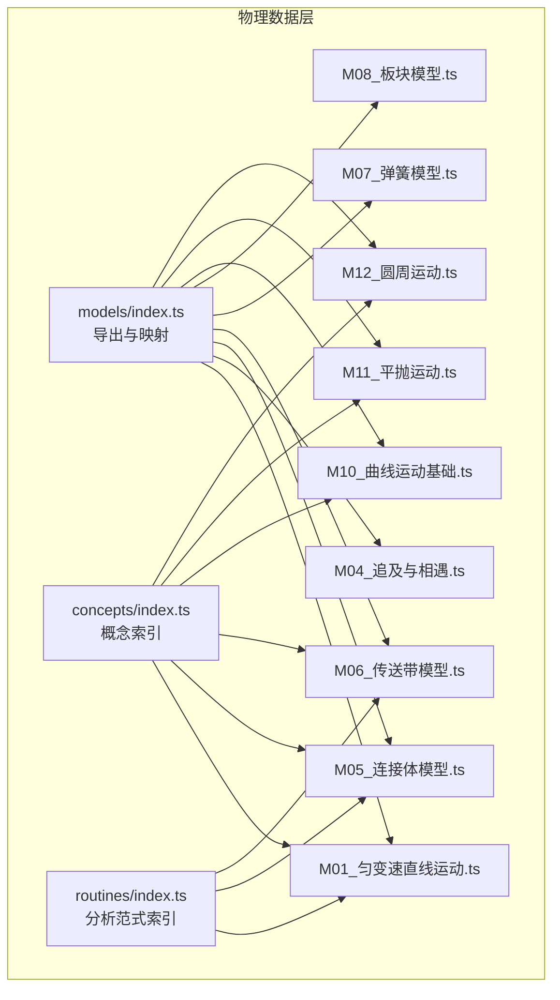
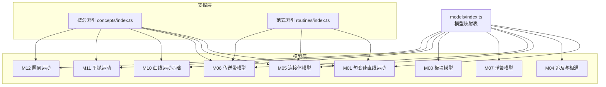
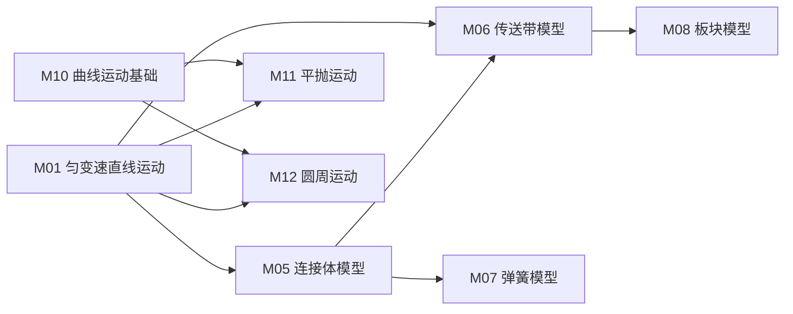

# 运动学模型

<cite>
**本文引用的文件**
- [src/data/physics/models/index.ts](file://src/data/physics/models/index.ts)
- [src/data/physics/models/M01_匀变速直线运动.ts](file://src/data/physics/models/M01_匀变速直线运动.ts)
- [src/data/physics/models/M04_追及与相遇.ts](file://src/data/physics/models/M04_追及与相遇.ts)
- [src/data/physics/models/M05_连接体模型.ts](file://src/data/physics/models/M05_连接体模型.ts)
- [src/data/physics/models/M06_传送带模型.ts](file://src/data/physics/models/M06_传送带模型.ts)
- [src/data/physics/models/M07_弹簧模型.ts](file://src/data/physics/models/M07_弹簧模型.ts)
- [src/data/physics/models/M08_板块模型.ts](file://src/data/physics/models/M08_板块模型.ts)
- [src/data/physics/models/M10_曲线运动基础.ts](file://src/data/physics/models/M10_曲线运动基础.ts)
- [src/data/physics/models/M11_平抛运动.ts](file://src/data/physics/models/M11_平抛运动.ts)
- [src/data/physics/models/M12_圆周运动.ts](file://src/data/physics/models/M12_圆周运动.ts)
- [src/data/physics/concepts/index.ts](file://src/data/physics/concepts/index.ts)
- [src/data/physics/routines/index.ts](file://src/data/physics/routines/index.ts)
</cite>

## 目录
1. [引言](#引言)
2. [项目结构](#项目结构)
3. [核心组件](#核心组件)
4. [架构总览](#架构总览)
5. [详细组件分析](#详细组件分析)
6. [依赖分析](#依赖分析)
7. [性能考虑](#性能考虑)
8. [故障排查指南](#故障排查指南)
9. [结论](#结论)
10. [附录](#附录)

## 引言
本文件面向“星耀平台”物理学科的运动学模型，系统梳理并文档化以下核心模型：匀变速直线运动、追及与相遇、连接体问题、传送带模型、弹簧模型、板块模型、曲线运动基础、平抛运动、圆周运动。文档覆盖每个模型的适用场景、核心假设、数学表达式、解题步骤、物理原理、运动规律与边界条件，并给出模型间的关联关系与复杂运动现象的分析方法。同时提供示例与解题模板，帮助学习者建立可迁移的思维范式。

## 项目结构
运动学模型的数据以“模型定义文件”形式组织在物理数据层，通过索引文件集中导出与映射，便于前端按 ID 快速检索与渲染。知识节点与分析范式同样采用类似的模块化组织方式，形成“概念—模型—范式”的知识网络。

图表来源
- [src/data/physics/models/index.ts:1-98](file://src/data/physics/models/index.ts#L1-L98)
- [src/data/physics/concepts/index.ts:1-196](file://src/data/physics/concepts/index.ts#L1-L196)
- [src/data/physics/routines/index.ts:1-279](file://src/data/physics/routines/index.ts#L1-L279)

章节来源
- [src/data/physics/models/index.ts:1-98](file://src/data/physics/models/index.ts#L1-L98)
- [src/data/physics/concepts/index.ts:1-196](file://src/data/physics/concepts/index.ts#L1-L196)
- [src/data/physics/routines/index.ts:1-279](file://src/data/physics/routines/index.ts#L1-L279)

## 核心组件
本节聚焦运动学模型的七模块结构：定位与本质、核心原理、分层变形、知识网络、方法论、自我检测、生活应用。以“匀变速直线运动”为例，展示完整结构如何支撑教学与训练。

- 定位与本质：明确运动类型与加速度恒定的物理本质，强调“等加速度”与速度均匀变化的直观理解。
- 核心原理：提供速度-时间、位移-时间、速度-位移、平均速度等核心公式，辅以图像面积与推论式（如相邻相等时间间隔的位移差）。
- 分层变形：基础（匀加速/匀减速/刹车）、进阶（无时间公式/平均速度法/推论式）、挑战（多段衔接/往返运动/图像综合）。
- 知识网络：标注父节点、子节点、相关模型与核心公式，体现模型间的继承与拓展关系。
- 方法论：给出“有t用基本/无t用变形/已知v0v用无t公式”的决策树与常见陷阱。
- 自我检测：提供基础/进阶题目与答案要点，评估掌握程度。
- 生活应用：结合刹车距离等现实问题，强调物理与工程安全的联系。

章节来源
- [src/data/physics/models/M01_匀变速直线运动.ts:1-85](file://src/data/physics/models/M01_匀变速直线运动.ts#L1-L85)

## 架构总览
运动学模型在平台中的组织遵循“数据即文档”的理念：每个模型以 JSON 化的结构体呈现，包含元信息、公式、变式、网络关系、方法论与应用；通过统一的映射表实现按 ID 的快速检索；概念与范式作为支撑，形成“概念—模型—范式”的闭环。

图表来源
- [src/data/physics/models/index.ts:52-98](file://src/data/physics/models/index.ts#L52-L98)
- [src/data/physics/concepts/index.ts:102-175](file://src/data/physics/concepts/index.ts#L102-L175)
- [src/data/physics/routines/index.ts:188-279](file://src/data/physics/routines/index.ts#L188-L279)

## 详细组件分析

### 匀变速直线运动（M01）
- 适用场景：初速度不为零、加速度恒定的直线运动，如汽车刹车、竖直上抛、自由落体等。
- 核心假设：加速度 a 恒定，运动轨迹为直线。
- 数学表达式：
  - 速度-时间：v = v0 + at
  - 位移-时间：x = v0t + ½at²
  - 速度-位移：v² − v0² = 2ax
  - 平均速度：x = ½(v0 + v)t
  - 推论式：Δx = aT²（相邻相等时间间隔的位移差）
- 解题步骤：
  - 明确已知量与未知量；
  - 判断是否涉及时间 t；
  - 有 t 用速度-时间公式；无 t 用速度-位移或平均速度；已知 v0 与 v 用无 t 公式；
  - 注意刹车问题需先判定停止时间与最大位移。
- 物理原理与边界条件：
  - 加速度恒定意味着速度均匀变化；
  - 刹车模型中，若 v0/|a| 计算得到的停止时间大于总时间，则物体未停下，需用最终速度与位移公式校验。
- 与其他模型的关系：
  - 与 M02（自由落体与竖直上抛）共享速度-位移与位移-时间公式；
  - 与 M03（竖直上抛与追及相遇）在最高点对称性与往返运动上有联系；
  - 与 M05（连接体模型）在整体法求加速度时使用匀变速公式；
  - 与 M06（传送带模型）在共速阶段可视为匀速运动的衔接。
- 示例与模板：
  - 模板1：已知初速度、加速度与时间，求末速度与位移；
  - 模板2：已知初速度、末速度与位移，求加速度与时间；
  - 模板3：刹车问题先判停，再求最大位移。

章节来源
- [src/data/physics/models/M01_匀变速直线运动.ts:1-85](file://src/data/physics/models/M01_匀变速直线运动.ts#L1-L85)

### 追及与相遇（M04）
- 适用场景：两个或多个物体同时运动，比较到达同一位置或同一时刻的状态。
- 核心假设：物体可视为质点；运动可分解为直线或曲线分量。
- 数学表达式：通常基于位移相等或速度相等的条件建立方程组。
- 解题步骤：
  - 建立坐标系与正方向；
  - 写出各物体的位移-时间函数；
  - 寻找相遇条件（位移相等）或最接近条件（速度相等）；
  - 考虑临界情形（恰好追上、恰好避免相撞）。
- 物理原理与边界条件：
  - 相遇要求位移在同一时刻相等；
  - 最短距离发生在速度相等的瞬时；
  - 若速度差为零且间距不再缩小，则为临界状态。
- 与其他模型的关系：
  - 与 M01（匀变速直线运动）结合，建立位移函数；
  - 与 M03（竖直上抛与追及相遇）在最高点附近分析相遇可能性；
  - 与 M11（平抛运动）在水平与竖直方向分别建立位移函数。
- 示例与模板：
  - 模板1：两车同向同地出发，求何时相遇；
  - 模板2：一车匀速、一车匀加速追赶，求最小间距与最短时间差。

章节来源
- [src/data/physics/models/M04_追及与相遇.ts:1-18](file://src/data/physics/models/M04_追及与相遇.ts#L1-L18)

### 连接体模型（M05）
- 适用场景：多个物体通过绳、杆、弹簧等连接，整体加速度相同的情况。
- 核心假设：刚性连接导致系统内各物体加速度相同；内力为系统内部相互作用力。
- 数学表达式：整体法求加速度 a = F合/(m1 + m2)，隔离法求内力 T = m1a。
- 解题步骤：
  - 判断是否整体法适用（加速度相同）；
  - 先整体法求加速度；
  - 再隔离法求内力（优先选受力较少的物体）。
- 物理原理与边界条件：
  - 整体法不包含内力，隔离法需考虑内力；
  - 斜面连接体需正交分解重力；
  - 是否发生相对滑动取决于最大静摩擦与 ma 的比较。
- 与其他模型的关系：
  - 与 M01（匀变速直线运动）在整体法求加速度时一致；
  - 与 M06（传送带模型）在共速后内力消失的思路相通；
  - 与 M07（弹簧模型）在弹力提供内力时相关。
- 示例与模板：
  - 模板1：水平拉力作用下的两物体加速度与绳拉力；
  - 模板2：斜面连接体的加速度与拉力（含摩擦）。

章节来源
- [src/data/physics/models/M05_连接体模型.ts:1-66](file://src/data/physics/models/M05_连接体模型.ts#L1-L66)

### 传送带模型（M06）
- 适用场景：物体在传送带上的运动，摩擦力方向随相对速度变化。
- 核心假设：摩擦力方向在共速瞬间突变；物体初速度与传送带速度不同。
- 数学表达式：a = μg（方向依据相对运动），共速条件 v物(t) = v带。
- 解题步骤：
  - 比较 v物 与 v带，确定初始摩擦力方向；
  - 列牛二定律求匀变速运动；
  - 找到共速时刻，摩擦力消失；
  - 新阶段重新分析（可能继续匀变速或匀速）。
- 特殊情形：
  - 水平传送带：v物 < v带 时向前加速；v物 > v带 时向后减速；
  - 倾斜传送带：需分解重力并判断支持力；
  - 多段传送带：每段独立分析，衔接处速度连续。
- 物理原理与边界条件：
  - 共速后摩擦力消失，物体以恒定速度运动；
  - 若物体无法达到传送带速度，可能停在传送带上。
- 与其他模型的关系：
  - 与 M05（连接体模型）在内力与加速度关系上相通；
  - 与 M01（匀变速直线运动）在共速后的匀速阶段衔接。
- 示例与模板：
  - 模板1：物体从静止释放，求达到传送带速度的时间；
  - 模板2：物体以初速度滑上传送带，求能否追上并分析最终状态。

章节来源
- [src/data/physics/models/M06_传送带模型.ts:1-65](file://src/data/physics/models/M06_传送带模型.ts#L1-L65)

### 弹簧模型（M07）
- 适用场景：弹簧弹力随形变线性变化的问题，作为连接体或振子模型的基础。
- 核心假设：胡克定律适用；忽略弹簧质量；形变量与弹力成正比。
- 数学表达式：F = kx（k 为劲度系数，x 为形变量）。
- 解题步骤：
  - 确定平衡位置与形变量；
  - 应用牛顿定律或能量守恒；
  - 分析弹力与外力的平衡与变化。
- 物理原理与边界条件：
  - 弹力方向与形变方向相反；
  - 在简谐运动中，回复力与位移成正比。
- 与其他模型的关系：
  - 与 M05（连接体模型）在弹力提供内力时相关；
  - 与 M08（板块模型）在接触面形变与弹力传递上有关联。
- 示例与模板：
  - 模板1：弹簧秤挂重物，求伸长量；
  - 模板2：弹簧振子的简谐运动参数。

章节来源
- [src/data/physics/models/M07_弹簧模型.ts:1-18](file://src/data/physics/models/M07_弹簧模型.ts#L1-L18)

### 板块模型（M08）
- 适用场景：多个物体之间存在相对运动，摩擦力方向随相对运动变化。
- 核心假设：存在相对滑动；摩擦力为滑动摩擦力；板块间相互作用力需隔离分析。
- 数学表达式：f = μN，加速度 a = f/m。
- 解题步骤：
  - 分析初始状态与相对运动趋势；
  - 隔离法分别求各物体的加速度；
  - 判断是否发生相对滑动与最终相对静止。
- 物理原理与边界条件：
  - 相对滑动时摩擦力为滑动摩擦力；
  - 相对静止时需满足加速度相同与静摩擦力平衡。
- 与其他模型的关系：
  - 与 M06（传送带模型）在摩擦力方向变化与共速思路相似；
  - 与 M05（连接体模型）在隔离分析与内力求解上相通。
- 示例与模板：
  - 模板1：两板相对滑动，求加速度与相对位移；
  - 模板2：板块系统最终相对静止的条件与过程。

章节来源
- [src/data/physics/models/M08_板块模型.ts:1-18](file://src/data/physics/models/M08_板块模型.ts#L1-L18)

### 曲线运动基础（M10）
- 适用场景：速度方向沿轨迹切线，合外力指向曲线内侧的运动。
- 核心假设：轨迹为曲线；速度方向沿切线；合外力提供向心力。
- 数学表达式：速度方向沿切线；合外力 F = ma，其中 a 指向曲率内侧。
- 解题步骤：
  - 分析速度方向与加速度方向；
  - 建立切向与法向分量；
  - 结合牛顿定律与运动学公式。
- 物理原理与边界条件：
  - 切向加速度改变速率，法向加速度改变方向；
  - 圆周运动中，合外力提供向心力。
- 与其他模型的关系：
  - 为平抛运动与圆周运动奠定基础；
  - 与 M11（平抛运动）在运动分解上相通；
  - 与 M12（圆周运动）在向心力与加速度关系上相通。
- 示例与模板：
  - 模板1：曲线轨道上的受力分析；
  - 模板2：切向与法向加速度的分解。

章节来源
- [src/data/physics/models/M10_曲线运动基础.ts:1-18](file://src/data/physics/models/M10_曲线运动基础.ts#L1-L18)

### 平抛运动（M11）
- 适用场景：水平方向匀速、竖直方向自由落体的运动。
- 核心假设：忽略空气阻力；初速度仅在水平方向。
- 数学表达式：
  - 水平方向：x = v0t（匀速）；
  - 竖直方向：y = ½gt²（自由落体）；
  - 合运动：轨迹为抛物线。
- 解题步骤：
  - 将运动分解为水平与竖直两个方向；
  - 分别列出运动学方程；
  - 联立求解时间、位移、速度与轨迹。
- 物理原理与边界条件：
  - 水平方向速度恒定；
  - 竖直方向初速度为零；
  - 落地时间由竖直方向决定。
- 与其他模型的关系：
  - 与 M10（曲线运动基础）在运动分解与轨迹分析上相通；
  - 与 M01（匀变速直线运动）在竖直方向的自由落体部分相通。
- 示例与模板：
  - 模板1：已知初速度与高度，求飞行时间与水平射程；
  - 模板2：求落地速度与速度方向。

章节来源
- [src/data/physics/models/M11_平抛运动.ts:1-18](file://src/data/physics/models/M11_平抛运动.ts#L1-L18)

### 圆周运动（M12）
- 适用场景：物体绕圆心做圆周运动，涉及线速度、角速度与向心加速度。
- 核心假设：轨道半径恒定；速度大小可能变化。
- 数学表达式：
  - 线速度：v = ωR；
  - 向心加速度：an = v²/R = ω²R；
  - 角速度：ω = Δθ/Δt。
- 解题步骤：
  - 明确半径与角速度或线速度；
  - 计算向心加速度与所需向心力；
  - 分析约束力（如绳子张力、轨道支持力）。
- 物理原理与边界条件：
  - 向心力由合外力提供；
  - 超过临界速度时，约束力不足以提供向心力，物体脱离轨道。
- 与其他模型的关系：
  - 与 M10（曲线运动基础）在向心加速度与合外力方向上相通；
  - 与 M01（匀变速直线运动）在匀速圆周运动的加速度方向上相通。
- 示例与模板：
  - 模板1：水平转盘上的物体，求最大角速度；
  - 模板2：汽车过拱桥，求最高点对桥的压力。

章节来源
- [src/data/physics/models/M12_圆周运动.ts:1-18](file://src/data/physics/models/M12_圆周运动.ts#L1-L18)

## 依赖分析
- 模型索引依赖：models/index.ts 统一导出与映射所有模型，供前端按 ID 检索。
- 概念支撑：concepts/index.ts 提供概念章节与难度分布，辅助模型定位与学习路径设计。
- 范式支撑：routines/index.ts 提供分析范式集合，与模型形成“范式—模型”联动，提升解题效率。
- 模型间关系：M01 为多数模型的基础；M05/M06 与 M07/M08 在内力与摩擦力分析上互通；M10/M11/M12 构成曲线运动的知识链。

图表来源
- [src/data/physics/models/index.ts:52-98](file://src/data/physics/models/index.ts#L52-L98)
- [src/data/physics/concepts/index.ts:102-175](file://src/data/physics/concepts/index.ts#L102-L175)

章节来源
- [src/data/physics/models/index.ts:52-98](file://src/data/physics/models/index.ts#L52-L98)
- [src/data/physics/concepts/index.ts:102-175](file://src/data/physics/concepts/index.ts#L102-L175)

## 性能考虑
- 数据结构简洁：模型以扁平 JSON 结构存储，便于序列化与传输。
- 映射高效：通过 ID→对象的映射表实现 O(1) 查找，适合前端快速渲染。
- 可扩展性强：新增模型只需在 models/index.ts 中注册，即可纳入统一检索与导航。
- 渲染优化：概念与范式索引提供章节与模块划分，利于前端分页与懒加载。

## 故障排查指南
- 常见错误
  - 单位不统一：速度与加速度的单位需换算一致后再代入公式。
  - 判定停止时间：刹车问题需先计算停止时间，再与总时间比较。
  - 隔离法误用：整体法不包含内力，隔离时才考虑内力。
  - 摩擦力方向：传送带与板块模型需根据相对速度判断摩擦力方向。
- 排查建议
  - 逐项检查已知量与未知量，确认选用公式是否匹配；
  - 对多过程问题，分阶段列出方程，确保衔接条件正确；
  - 使用图像法（如 v-t 图）辅助理解位移与速度变化。

## 结论
运动学模型在星耀平台中以“七模块结构”实现知识的系统化与可迁移化。通过统一的模型索引、概念支撑与范式联动，学习者可以按模块逐步构建知识网络，从匀变速直线运动出发，延伸至曲线运动与复杂连接体问题，最终具备分析真实物理情境的能力。建议在教学实践中以模板化流程贯穿训练，强化“定位—原理—变形—方法—应用”的闭环思维。

## 附录
- 模型清单与映射
  - 匀变速直线运动（M01）、追及与相遇（M04）、连接体模型（M05）、传送带模型（M06）、弹簧模型（M07）、板块模型（M08）、曲线运动基础（M10）、平抛运动（M11）、圆周运动（M12）。
- 相关概念与范式
  - 概念索引涵盖运动学与力学基础、曲线运动与万有引力、能量与动量等模块；
  - 范式索引提供分析流程与解题模板，与模型形成互补。