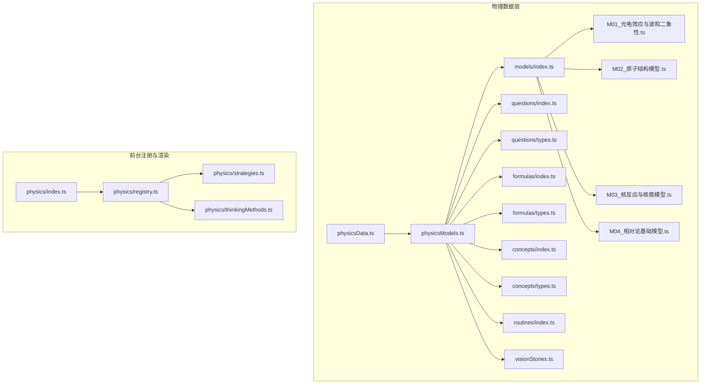
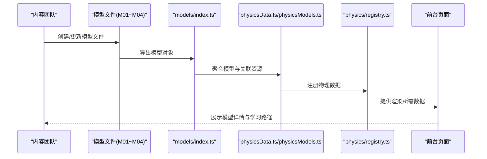
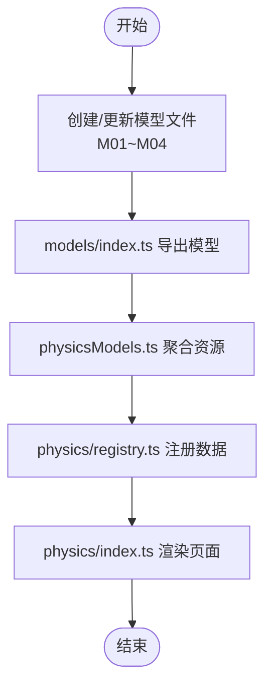
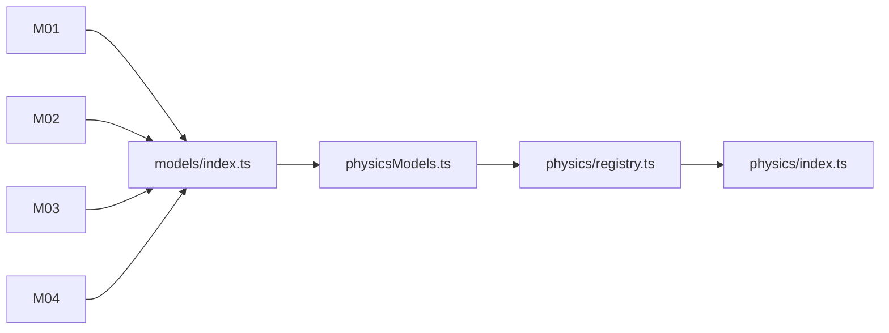

# 近代物理模型

<cite>
**本文引用的文件**   
- [SPEC.md](file://SPEC.md)
- [TECH_ARCHITECTURE.md](file://TECH_ARCHITECTURE.md)
- [WORKFLOW.md](file://WORKFLOW.md)
- [physicsData.ts](file://src/data/physics/physicsData.ts)
- [physicsModels.ts](file://src/data/physics/physicsModels.ts)
- [index.ts](file://src/data/physics/models/index.ts)
- [M01_光电效应与波粒二象性.ts](file://src/data/physics/models/M01_光电效应与波粒二象性.ts)
- [M02_原子结构模型.ts](file://src/data/physics/models/M02_原子结构模型.ts)
- [M03_核反应与核能模型.ts](file://src/data/physics/models/M03_核反应与核能模型.ts)
- [M04_相对论基础模型.ts](file://src/data/physics/models/M04_相对论基础模型.ts)
- [physics/index.ts](file://src/data/physics/index.ts)
- [physics/registry.ts](file://src/data/physics/registry.ts)
- [physics/strategies.ts](file://src/data/physics/strategies.ts)
- [physics/thinkingMethods.ts](file://src/data/physics/thinkingMethods.ts)
- [physics/visionStories.ts](file://src/data/physics/visionStories.ts)
- [physics/questions/index.ts](file://src/data/physics/questions/index.ts)
- [physics/questions/types.ts](file://src/data/physics/questions/types.ts)
- [physics/routines/index.ts](file://src/data/physics/routines/index.ts)
- [physics/routines/R01.ts](file://src/data/physics/routines/R01.ts)
- [physics/concepts/index.ts](file://src/data/physics/concepts/index.ts)
- [physics/concepts/types.ts](file://src/data/physics/concepts/types.ts)
- [physics/formulas/index.ts](file://src/data/physics/formulas/index.ts)
- [physics/formulas/types.ts](file://src/data/physics/formulas/types.ts)
</cite>

## 目录
1. [引言](#引言)
2. [项目结构](#项目结构)
3. [核心组件](#核心组件)
4. [架构总览](#架构总览)
5. [详细组件分析](#详细组件分析)
6. [依赖分析](#依赖分析)
7. [性能考虑](#性能考虑)
8. [故障排除指南](#故障排除指南)
9. [结论](#结论)
10. [附录](#附录)

## 引言
本文件面向星耀平台物理学科“近代物理模型”的知识沉淀与教学应用，系统梳理并文档化以下核心模型：光电效应与波粒二象性、原子结构、核反应与核能、相对论基础。文档覆盖模型分类体系、适用场景、核心假设、数学表达式与解题步骤，并结合平台的数据结构与前端渲染机制，给出可复用的教学与学习模板。同时，阐述这些模型对现代科学与技术的影响，帮助学习者理解微观粒子行为与宏观时空结构。

## 项目结构
星耀平台采用“学科-知识域-模型/套路/题库”三层数据结构，物理学科数据位于 src/data/physics 下，包含模型、套路、题库、公式、概念等模块。模型层以 M01~Mxx 编号组织，配套索引文件统一导出；题库按模型维度聚合；公式与概念分别按章节与类型管理；前台通过物理数据注册器接入并渲染。

**图表来源**
- [SPEC.md:879-881](file://SPEC.md#L879-L881)
- [TECH_ARCHITECTURE.md:66](file://TECH_ARCHITECTURE.md#L66)
- [WORKFLOW.md:207](file://WORKFLOW.md#L207)

**章节来源**
- [SPEC.md:879-881](file://SPEC.md#L879-L881)
- [TECH_ARCHITECTURE.md:66](file://TECH_ARCHITECTURE.md#L66)
- [WORKFLOW.md:207](file://WORKFLOW.md#L207)

## 核心组件
- 模型数据层：M01~M04 等模型文件，定义模型名称、分类、适用场景、核心假设、数学表达式、解题步骤与示例。
- 题库与题目类型：按模型维度聚合题目，支持筛选与导航。
- 公式与概念：按章节与类型组织，支撑模型学习与复习。
- 前台注册与渲染：通过物理数据注册器统一接入，驱动页面渲染与交互。

**章节来源**
- [SPEC.md:879-881](file://SPEC.md#L879-L881)
- [TECH_ARCHITECTURE.md:66](file://TECH_ARCHITECTURE.md#L66)
- [WORKFLOW.md:207](file://WORKFLOW.md#L207)

## 架构总览
下图展示从模型数据到前台渲染的关键路径，体现“数据-索引-注册-渲染”的闭环。

**图表来源**
- [SPEC.md:879-881](file://SPEC.md#L879-L881)
- [TECH_ARCHITECTURE.md:66](file://TECH_ARCHITECTURE.md#L66)

## 详细组件分析

### 模型：光电效应与波粒二象性（M01）
- 分类与定位：属于“近代物理”范畴，用于解释光的粒子性与电子发射现象。
- 适用场景：光电子发射、太阳能电池、光电管工作原理等。
- 核心假设：
  - 光具有粒子性（光子），能量 E=hν。
  - 电子吸收一个光子后获得足够能量逸出金属表面。
- 数学表达式：
  - 光子能量：E=hν。
  - 爱因斯坦光电效应方程：hν=φ+Ek（φ 为逸出功，Ek 为光电子最大初动能）。
  - 阻止电压：eUc=Ek。
- 解题步骤模板：
  1) 识别已知量（ν、Uc、λ 或 Ek）。
  2) 计算光子能量 E=hν。
  3) 利用方程求逸出功 φ=E−Ek。
  4) 若求截止频率 ν0，由 φ=hν0。
  5) 验证结果的合理性与单位一致。
- 教学要点：强调“一个光子—一个电子”的瞬时性与能量守恒。

**章节来源**
- [M01_光电效应与波粒二象性.ts](file://src/data/physics/models/M01_光电效应与波粒二象性.ts)
- [SPEC.md:879-881](file://SPEC.md#L879-L881)

### 模型：原子结构（M02）
- 分类与定位：解释原子能级、电子跃迁与光谱产生机制。
- 适用场景：氢原子光谱、激光、原子能级跃迁计算。
- 核心假设：
  - 电子在特定轨道上稳定运动不辐射能量。
  - 跃迁时满足 ΔE=hν。
  - 能级公式 En=E1/n²（适用于氢原子）。
- 数学表达式：
  - 能级：En=E1/n²。
  - 跃迁能量：ΔE=Ei−Ef=hν。
  - 波长关系：c=λν。
- 解题步骤模板：
  1) 确定初末能级 n1、n2。
  2) 计算 ΔE=Ei−Ef。
  3) 求频率 ν=ΔE/h。
  4) 求波长 λ=c/ν。
  5) 判断光谱区域（可见光、紫外、红外）。
- 教学要点：结合能级图直观理解跃迁与光谱线系。

**章节来源**
- [M02_原子结构模型.ts](file://src/data/physics/models/M02_原子结构模型.ts)
- [SPEC.md:879-881](file://SPEC.md#L879-L881)

### 模型：核反应与核能（M03）
- 分类与定位：研究原子核变化与质量-能量关系。
- 适用场景：核裂变、核聚变、核能发电、放射性衰变。
- 核心假设：
  - 质量亏损 Δm 与能量释放 E=Δmc²。
  - 质量数与电荷数守恒。
- 数学表达式：
  - 质量亏损：Δm=反应前总质量−反应后总质量。
  - 能量释放：E=Δmc²。
  - 结合能：核子结合成原子核时的最低能量需求。
- 解题步骤模板：
  1) 写出核反应方程式，标出质量数与电荷数。
  2) 计算反应前后质量：m前、m后。
  3) 求 Δm=m前−m后。
  4) 用 E=Δmc² 求能量释放（注意单位换算）。
  5) 判断反应类型（裂变/聚变/衰变）。
- 教学要点：强调质量-能量等价与核能巨大潜力。

**章节来源**
- [M03_核反应与核能模型.ts](file://src/data/physics/models/M03_核反应与核能模型.ts)
- [SPEC.md:879-881](file://SPEC.md#L879-L881)

### 模型：相对论基础（M04）
- 分类与定位：阐述狭义相对论基本原理与时空观。
- 适用场景：高速运动物体、粒子加速器、GPS 时间校正。
- 核心假设：
  - 物理定律在所有惯性系中相同。
  - 真空光速 c 对所有观察者恒定。
- 数学表达式：
  - 时间膨胀：Δt=Δt₀/√(1−v²/c²)。
  - 长度收缩：L=L₀√(1−v²/c²)。
  - 质能方程：E=mc²。
  - 动能与总能量关系：Ek=(γ−1)mc²（γ=1/√(1−v²/c²)）。
- 解题步骤模板：
  1) 明确静止参考系与运动参考系。
  2) 识别已知量（v、Δt₀、L₀）。
  3) 计算 γ 因子。
  4) 代入相应公式求 Δt、L 或 Ek。
  5) 验证 v≪c 时退化为经典结果。
- 教学要点：强调“同时性的相对性”与“时空统一”。

**章节来源**
- [M04_相对论基础模型.ts](file://src/data/physics/models/M04_相对论基础模型.ts)
- [SPEC.md:879-881](file://SPEC.md#L879-L881)

### 模型索引与注册流程
- 模型索引：models/index.ts 统一导出 M01~M04，便于前台按需加载。
- 数据聚合：physicsModels.ts 聚合模型与其关联的公式、概念、套路、题库。
- 前台注册：physics/registry.ts 将物理数据注册到全局注册表，供页面组件调用。
- 页面渲染：physics/index.ts 提供物理学科入口，整合导航与内容展示。

**图表来源**
- [SPEC.md:879-881](file://SPEC.md#L879-L881)
- [TECH_ARCHITECTURE.md:66](file://TECH_ARCHITECTURE.md#L66)

**章节来源**
- [SPEC.md:879-881](file://SPEC.md#L879-L881)
- [TECH_ARCHITECTURE.md:66](file://TECH_ARCHITECTURE.md#L66)
- [WORKFLOW.md:207](file://WORKFLOW.md#L207)

## 依赖分析
- 模块耦合：
  - 模型文件依赖于公式、概念、套路与题库的类型定义。
  - 前台注册器依赖物理数据聚合层，确保数据一致性。
- 关键依赖链：
  - 模型文件 → models/index.ts → physicsModels.ts → physics/registry.ts → physics/index.ts → 前台页面。
- 外部集成点：
  - 题库按模型维度索引，支持筛选与练习。
  - 公式与概念按章节组织，支撑模型学习闭环。

**图表来源**
- [SPEC.md:879-881](file://SPEC.md#L879-L881)
- [TECH_ARCHITECTURE.md:66](file://TECH_ARCHITECTURE.md#L66)

**章节来源**
- [SPEC.md:879-881](file://SPEC.md#L879-L881)
- [TECH_ARCHITECTURE.md:66](file://TECH_ARCHITECTURE.md#L66)

## 性能考虑
- 模块化加载：通过 models/index.ts 按需导出，避免一次性加载全部模型。
- 数据聚合：physicsModels.ts 将模型与其资源合并，减少运行时查找开销。
- 前台注册：统一注册与缓存，降低重复渲染成本。
- 题库与公式：按需加载与懒加载策略，提升页面响应速度。

## 故障排除指南
- 模型文件缺失或命名错误：检查 models/index.ts 是否正确导出目标模型。
- 题库未显示：确认 physics/questions/index.ts 中是否按模型编号生成题目映射。
- 公式/概念类型不匹配：核对 physics/formulas/types.ts 与 physics/concepts/types.ts 的接口定义。
- 前台空白或报错：检查 physics/registry.ts 是否成功注册物理数据，以及 physics/index.ts 的入口配置。

**章节来源**
- [WORKFLOW.md:283](file://WORKFLOW.md#L283)
- [SPEC.md:1054-1056](file://SPEC.md#L1054-L1056)

## 结论
星耀平台的近代物理模型以“模型-题库-公式-概念-套路”一体化数据结构支撑教学与学习。M01~M04 覆盖光电效应、原子结构、核反应与核能、相对论基础四大主题，既保持物理原理的严谨性，又提供可操作的解题模板与示例。通过统一的索引与注册机制，平台实现了高效的内容组织与稳定的前端渲染，有助于学生系统掌握微观与宏观世界的物理规律。

## 附录
- 模型示例与解题模板可参考各模型文件的“解题步骤模板”字段。
- 题库与练习可通过 questions/index.ts 与 questions/types.ts 查看与筛选。
- 公式与概念按章节组织，便于复习与交叉引用。