# 力学知识节点

<cite>
**本文档引用的文件**
- [P07_力学常见力.md](file://docs/knowledge/physics/P07_力学常见力.md)
- [P08_力的合成与分解.md](file://docs/knowledge/physics/P08_力的合成与分解.md)
- [P09_牛顿三定律.md](file://docs/knowledge/physics/P09_牛顿三定律.md)
- [P10_超重与失重.md](file://docs/knowledge/physics/P10_超重与失重.md)
- [P11_连接体问题.md](file://docs/knowledge/physics/P11_连接体问题.md)
- [P12_多过程与临界极值.md](file://docs/knowledge/physics/P12_多过程与临界极值.md)
- [P14_抛体运动.md](file://docs/knowledge/physics/P14_抛体运动.md)
- [P15_圆周运动.md](file://docs/knowledge/physics/P15_圆周运动.md)
- [P17_天体运动.md](file://docs/knowledge/physics/P17_天体运动.md)
- [P19_功与功率.md](file://docs/knowledge/physics/P19_功与功率.md)
- [P21_重力势能·弹性势能.md](file://docs/knowledge/physics/P21_重力势能·弹性势能.md)
- [P23_功能关系与能量守恒.md](file://docs/knowledge/physics/P23_功能关系与能量守恒.md)
- [P24_动量与冲量.md](file://docs/knowledge/physics/P24_动量与冲量.md)
- [P26_动量守恒定律.md](file://docs/knowledge/physics/P26_动量守恒定律.md)
- [P29_静电场.md](file://docs/knowledge/physics/P29_静电场.md)
- [P31_带电粒子在电场中的运动.md](file://docs/knowledge/physics/P31_带电粒子在电场中的运动.md)
- [P32_恒定电流.md](file://docs/knowledge/physics/P32_恒定电流.md)
- [P33_电功与电功率.md](file://docs/knowledge/physics/P33_电功与电功率.md)
</cite>

## 目录
1. [引言](#引言)
2. [项目结构](#项目结构)
3. [核心组件](#核心组件)
4. [架构总览](#架构总览)
5. [详细组件分析](#详细组件分析)
6. [依赖分析](#依赖分析)
7. [性能考虑](#性能考虑)
8. [故障排除指南](#故障排除指南)
9. [结论](#结论)
10. [附录](#附录)

## 引言
本文件为“星耀平台物理学科力学知识节点”的系统化文档，覆盖力学与部分电磁学核心知识点，包含20个重点主题。文档采用统一的principle结构设计，逐项阐述情境引入、困惑激发、实验验证、概念建立、推导过程、应用拓展，并给出难度等级、前置知识、关联知识点与学习路径建议，辅以教学策略与示例，帮助教师与学生高效掌握。

## 项目结构
力学与相关知识节点分布在docs/knowledge/physics目录下，采用“知识点文件”形式，每份文件包含：
- 基本信息（id、名称、章节、小节、前置节点、相关模型）
- 学科本质与常见迷思
- 叙事正文（情境锚定、困惑预设、实验/现象呈现、概念涌现、推导叙事、迁移应用）
- 前置知识检测、分层变形（B/J/T三级）、公式卡片、理解度自评、跨学科关联、检查清单

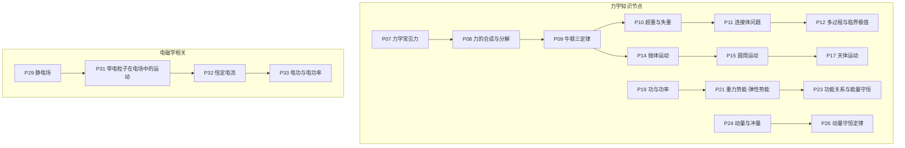

图表来源
- [P07_力学常见力.md:1-252](file://docs/knowledge/physics/P07_力学常见力.md#L1-L252)
- [P08_力的合成与分解.md:1-252](file://docs/knowledge/physics/P08_力的合成与分解.md#L1-L252)
- [P09_牛顿三定律.md:1-257](file://docs/knowledge/physics/P09_牛顿三定律.md#L1-L257)
- [P10_超重与失重.md:1-247](file://docs/knowledge/physics/P10_超重与失重.md#L1-L247)
- [P11_连接体问题.md:1-248](file://docs/knowledge/physics/P11_连接体问题.md#L1-L248)
- [P12_多过程与临界极值.md:1-219](file://docs/knowledge/physics/P12_多过程与临界极值.md#L1-L219)
- [P14_抛体运动.md:1-245](file://docs/knowledge/physics/P14_抛体运动.md#L1-L245)
- [P15_圆周运动.md:1-253](file://docs/knowledge/physics/P15_圆周运动.md#L1-L253)
- [P17_天体运动.md:1-248](file://docs/knowledge/physics/P17_天体运动.md#L1-L248)
- [P19_功与功率.md:1-257](file://docs/knowledge/physics/P19_功与功率.md#L1-L257)
- [P21_重力势能·弹性势能.md:1-255](file://docs/knowledge/physics/P21_重力势能·弹性势能.md#L1-L255)
- [P23_功能关系与能量守恒.md:1-234](file://docs/knowledge/physics/P23_功能关系与能量守恒.md#L1-L234)
- [P24_动量与冲量.md:1-242](file://docs/knowledge/physics/P24_动量与冲量.md#L1-L242)
- [P26_动量守恒定律.md:1-225](file://docs/knowledge/physics/P26_动量守恒定律.md#L1-L225)
- [P29_静电场.md:1-230](file://docs/knowledge/physics/P29_静电场.md#L1-L230)
- [P31_带电粒子在电场中的运动.md:1-216](file://docs/knowledge/physics/P31_带电粒子在电场中的运动.md#L1-L216)
- [P32_恒定电流.md:1-221](file://docs/knowledge/physics/P32_恒定电流.md#L1-L221)
- [P33_电功与电功率.md:1-222](file://docs/knowledge/physics/P33_电功与电功率.md#L1-L222)

章节来源
- [P07_力学常见力.md:1-252](file://docs/knowledge/physics/P07_力学常见力.md#L1-L252)
- [P08_力的合成与分解.md:1-252](file://docs/knowledge/physics/P08_力的合成与分解.md#L1-L252)
- [P09_牛顿三定律.md:1-257](file://docs/knowledge/physics/P09_牛顿三定律.md#L1-L257)
- [P10_超重与失重.md:1-247](file://docs/knowledge/physics/P10_超重与失重.md#L1-L247)
- [P11_连接体问题.md:1-248](file://docs/knowledge/physics/P11_连接体问题.md#L1-L248)
- [P12_多过程与临界极值.md:1-219](file://docs/knowledge/physics/P12_多过程与临界极值.md#L1-L219)
- [P14_抛体运动.md:1-245](file://docs/knowledge/physics/P14_抛体运动.md#L1-L245)
- [P15_圆周运动.md:1-253](file://docs/knowledge/physics/P15_圆周运动.md#L1-L253)
- [P17_天体运动.md:1-248](file://docs/knowledge/physics/P17_天体运动.md#L1-L248)
- [P19_功与功率.md:1-257](file://docs/knowledge/physics/P19_功与功率.md#L1-L257)
- [P21_重力势能·弹性势能.md:1-255](file://docs/knowledge/physics/P21_重力势能·弹性势能.md#L1-L255)
- [P23_功能关系与能量守恒.md:1-234](file://docs/knowledge/physics/P23_功能关系与能量守恒.md#L1-L234)
- [P24_动量与冲量.md:1-242](file://docs/knowledge/physics/P24_动量与冲量.md#L1-L242)
- [P26_动量守恒定律.md:1-225](file://docs/knowledge/physics/P26_动量守恒定律.md#L1-L225)
- [P29_静电场.md:1-230](file://docs/knowledge/physics/P29_静电场.md#L1-L230)
- [P31_带电粒子在电场中的运动.md:1-216](file://docs/knowledge/physics/P31_带电粒子在电场中的运动.md#L1-L216)
- [P32_恒定电流.md:1-221](file://docs/knowledge/physics/P32_恒定电流.md#L1-L221)
- [P33_电功与电功率.md:1-222](file://docs/knowledge/physics/P33_电功与电功率.md#L1-L222)

## 核心组件
以下为力学与相关知识节点的principle结构要点与学习路径设计：

- P07 力学常见力
  - 难度：入门
  - 前置：运动学基础（P01-P06）
  - 关键点：重力、弹力、摩擦力的定义与计算；常见误区辨析
  - 学习路径：P07 → P08（力的合成与分解）

- P08 力的合成与分解
  - 难度：入门
  - 前置：P07
  - 关键点：平行四边形法则、正交分解；合力大小与分力关系
  - 学习路径：P08 → P09（牛顿三定律）

- P09 牛顿三定律
  - 难度：基础
  - 前置：P08
  - 关键点：F=ma；作用力与反作用力；惯性与加速度方向
  - 学习路径：P09 → P10（超重与失重）、P11（连接体问题）、P13（曲线运动）

- P10 超重与失重
  - 难度：基础
  - 前置：P09
  - 关键点：视重与实重；加速度方向决定超重/失重
  - 学习路径：P10 → P11（连接体问题）

- P11 连接体问题
  - 难度：基础
  - 前置：P08、P09
  - 关键点：整体法与隔离法；内力与外力分析
  - 学习路径：P11 → P12（多过程与临界极值）

- P12 多过程与临界极值
  - 难度：提高
  - 前置：P09
  - 关键点：转折点识别；分段分析；临界条件
  - 学习路径：P12 → 能量与动量板块

- P14 抛体运动
  - 难度：提高
  - 前置：P13（运动的合成与分解）
  - 关键点：平抛与斜抛；时间t是分运动桥梁；轨迹方程
  - 学习路径：P14 → P15（圆周运动）

- P15 圆周运动
  - 难度：提高
  - 前置：P13
  - 关键点：向心加速度与向心力；效果力概念
  - 学习路径：P15 → P17（天体运动）

- P17 天体运动
  - 难度：提高
  - 前置：P15（圆周运动）、P16（万有引力）
  - 关键点：万有引力提供向心力；同步卫星；变轨问题
  - 学习路径：P17 → P18（宇宙速度）

- P19 功与功率
  - 难度：基础
  - 前置：P09（牛顿三定律）
  - 关键点：W=Fs cosθ；功率P=Fv；常见不做功情形
  - 学习路径：P19 → P20（动能定理）→ P21（势能）→ P22（机械能守恒）→ P23（功能关系）

- P21 重力势能·弹性势能
  - 难度：基础
  - 前置：P19、P20
  - 关键点：Ep=mgh；Ep=½kx²；重力做功与势能变化
  - 学习路径：P21 → P22（机械能守恒）→ P23（功能关系）

- P23 功能关系与能量守恒
  - 难度：提高
  - 前置：P22（机械能守恒）
  - 关键点：W合=ΔEk；W重=-ΔEp；W非重=ΔE机械；摩擦生热Q=f·s相对
  - 学习路径：P23 → 动量板块

- P24 动量与冲量
  - 难度：基础
  - 前置：P09（牛顿三定律）
  - 关键点：p=mv；I=Ft；动量定理I=Δp；矢量性
  - 学习路径：P24 → P25（动量定理）→ P26（动量守恒）

- P26 动量守恒定律
  - 难度：提高
  - 前置：P25（动量定理）
  - 关键点：合外力为零时总动量守恒；爆炸、碰撞、反冲
  - 学习路径：P26 → P27（碰撞与反冲）

- 电磁学相关（作为力学知识的延展与应用）
  - P29 静电场：场强与电势；E=-dφ/dr
  - P31 带电粒子在电场中的运动：类平抛；偏转位移
  - P32 恒定电流：欧姆定律、电阻定律
  - P33 电功与电功率：W=UIt；P=UI；焦耳定律Q=I²Rt

章节来源
- [P07_力学常见力.md:7-18](file://docs/knowledge/physics/P07_力学常见力.md#L7-L18)
- [P08_力的合成与分解.md:7-18](file://docs/knowledge/physics/P08_力的合成与分解.md#L7-L18)
- [P09_牛顿三定律.md:7-18](file://docs/knowledge/physics/P09_牛顿三定律.md#L7-L18)
- [P10_超重与失重.md:7-18](file://docs/knowledge/physics/P10_超重与失重.md#L7-L18)
- [P11_连接体问题.md:7-18](file://docs/knowledge/physics/P11_连接体问题.md#L7-L18)
- [P12_多过程与临界极值.md:7-18](file://docs/knowledge/physics/P12_多过程与临界极值.md#L7-L18)
- [P14_抛体运动.md:7-18](file://docs/knowledge/physics/P14_抛体运动.md#L7-L18)
- [P15_圆周运动.md:7-18](file://docs/knowledge/physics/P15_圆周运动.md#L7-L18)
- [P17_天体运动.md:7-18](file://docs/knowledge/physics/P17_天体运动.md#L7-L18)
- [P19_功与功率.md:7-18](file://docs/knowledge/physics/P19_功与功率.md#L7-L18)
- [P21_重力势能·弹性势能.md:7-18](file://docs/knowledge/physics/P21_重力势能·弹性势能.md#L7-L18)
- [P23_功能关系与能量守恒.md:7-18](file://docs/knowledge/physics/P23_功能关系与能量守恒.md#L7-L18)
- [P24_动量与冲量.md:7-18](file://docs/knowledge/physics/P24_动量与冲量.md#L7-L18)
- [P26_动量守恒定律.md:7-18](file://docs/knowledge/physics/P26_动量守恒定律.md#L7-L18)
- [P29_静电场.md:7-18](file://docs/knowledge/physics/P29_静电场.md#L7-L18)
- [P31_带电粒子在电场中的运动.md:7-18](file://docs/knowledge/physics/P31_带电粒子在电场中的运动.md#L7-L18)
- [P32_恒定电流.md:7-18](file://docs/knowledge/physics/P32_恒定电流.md#L7-L18)
- [P33_电功与电功率.md:7-18](file://docs/knowledge/physics/P33_电功与电功率.md#L7-L18)

## 架构总览
以下序列图展示从“常见力”到“牛顿定律”再到“曲线运动与天体运动”的知识流，以及从“功与能”到“动量”的另一条主线。

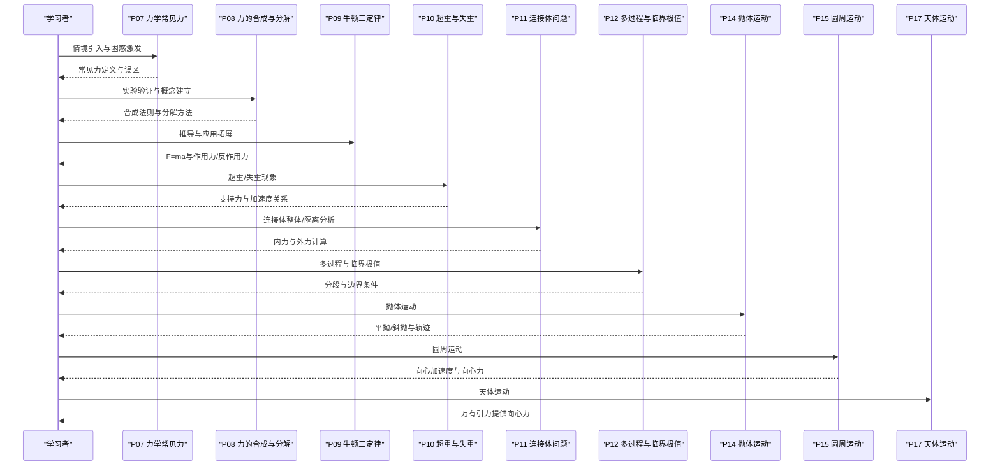

图表来源
- [P07_力学常见力.md:32-116](file://docs/knowledge/physics/P07_力学常见力.md#L32-L116)
- [P08_力的合成与分解.md:31-120](file://docs/knowledge/physics/P08_力的合成与分解.md#L31-L120)
- [P09_牛顿三定律.md:32-122](file://docs/knowledge/physics/P09_牛顿三定律.md#L32-L122)
- [P10_超重与失重.md:32-117](file://docs/knowledge/physics/P10_超重与失重.md#L32-L117)
- [P11_连接体问题.md:32-116](file://docs/knowledge/physics/P11_连接体问题.md#L32-L116)
- [P12_多过程与临界极值.md:30-99](file://docs/knowledge/physics/P12_多过程与临界极值.md#L30-L99)
- [P14_抛体运动.md:31-114](file://docs/knowledge/physics/P14_抛体运动.md#L31-L114)
- [P15_圆周运动.md:31-118](file://docs/knowledge/physics/P15_圆周运动.md#L31-L118)
- [P17_天体运动.md:31-117](file://docs/knowledge/physics/P17_天体运动.md#L31-L117)

## 详细组件分析

### P07 力学常见力
- 情境引入：教室中的重力、弹力、摩擦力
- 困惑激发：摩擦力是否总是阻力；弹力与形变关系；重力本质
- 实验/现象：弹簧拉伸实验、斜面角度与摩擦因数关系
- 概念建立：G=mg；F=kx；静/滑动摩擦力
- 推导过程：公式来源与适用条件；方向与大小
- 应用拓展：蹦极、传送带、弓弩

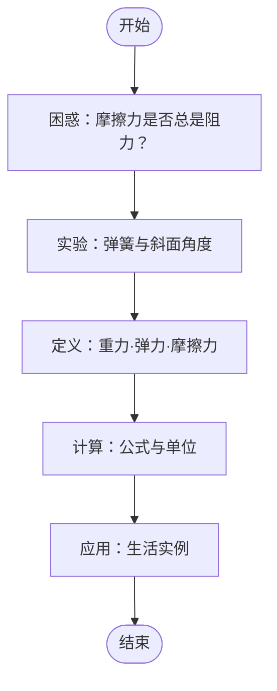

图表来源
- [P07_力学常见力.md:34-115](file://docs/knowledge/physics/P07_力学常见力.md#L34-L115)

章节来源
- [P07_力学常见力.md:3-252](file://docs/knowledge/physics/P07_力学常见力.md#L3-L252)

### P08 力的合成与分解
- 情境引入：两根绳子提重物的等效替代
- 困惑激发：合力一定大于分力？分解后力变小？
- 实验/现象：弹簧秤验证平行四边形法则
- 概念建立：平行四边形法则；正交分解
- 推导过程：余弦定理与勾股定理
- 应用拓展：桥梁设计、吊车、力的测量

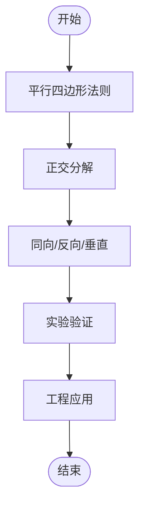

图表来源
- [P08_力的合成与分解.md:52-120](file://docs/knowledge/physics/P08_力的合成与分解.md#L52-L120)

章节来源
- [P08_力的合成与分解.md:1-252](file://docs/knowledge/physics/P08_力的合成与分解.md#L1-L252)

### P09 牛顿三定律
- 情境引入：推箱子加速运动
- 困惑激发：作用力与反作用力能否抵消？有力就有运动？
- 实验/现象：弹簧秤互拉；小车加速度测量
- 概念建立：第一定律（惯性）；第二定律（F=ma）；第三定律
- 推导过程：F与a的因果关系；单位制意义
- 应用拓展：火箭反冲；汽车刹车；跳高起跳

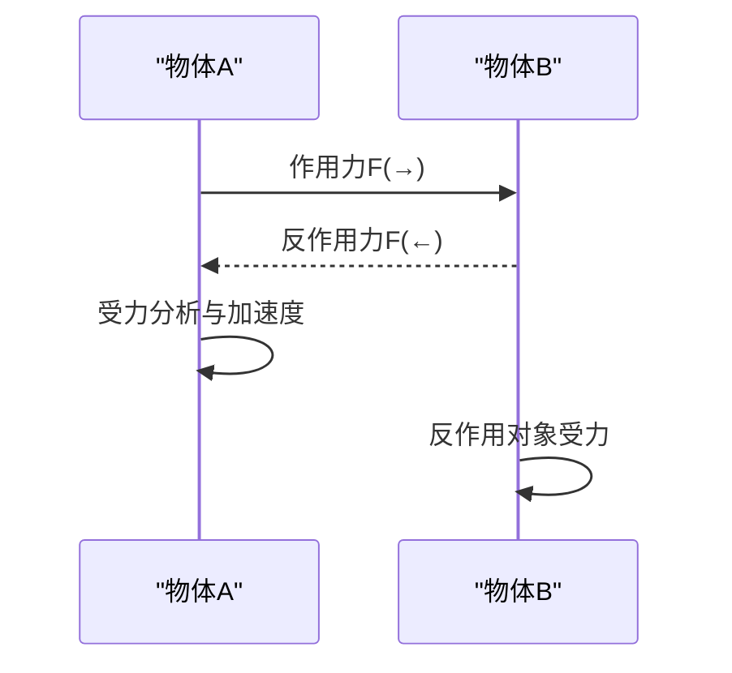

图表来源
- [P09_牛顿三定律.md:53-122](file://docs/knowledge/physics/P09_牛顿三定律.md#L53-L122)

章节来源
- [P09_牛顿三定律.md:1-257](file://docs/knowledge/physics/P09_牛顿三定律.md#L1-L257)

### P10 超重与失重
- 情境引入：电梯加速上升/下降时体重变化
- 困惑激发：失重=没有重力？超重=重力变大？
- 实验/现象：体重秤读数随加速度变化
- 概念建立：N=m(g±a)；完全失重
- 推导过程：牛顿第二定律列式；视重与实重
- 应用拓展：航天员训练；蹦极；微重力实验

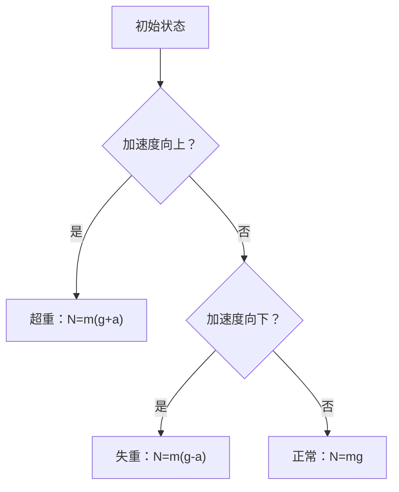

图表来源
- [P10_超重与失重.md:53-117](file://docs/knowledge/physics/P10_超重与失重.md#L53-L117)

章节来源
- [P10_超重与失重.md:1-247](file://docs/knowledge/physics/P10_超重与失重.md#L1-L247)

### P11 连接体问题
- 情境引入：两物块用绳连接，整体加速
- 困惑激发：何时用整体法？何时用隔离法？
- 实验/现象：A、B连接体加速度与张力
- 概念建立：整体法求加速度；隔离法求内力
- 推导过程：F=(mA+mB)a；T=mB·a
- 应用拓展：火车车厢；拔河；传送带系统

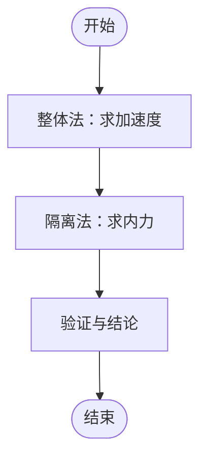

图表来源
- [P11_连接体问题.md:51-115](file://docs/knowledge/physics/P11_连接体问题.md#L51-L115)

章节来源
- [P11_连接体问题.md:1-248](file://docs/knowledge/physics/P11_连接体问题.md#L1-L248)

### P12 多过程与临界极值
- 情境引入：传送带先加速后匀速；弹簧振子往返
- 困惑激发：过程分不清；临界条件如何判断？
- 实验/现象：转折点识别（v=0、a=0、N=0）
- 概念建立：分段原则；边界条件；极值条件
- 推导过程：运动学与能量分析结合
- 应用拓展：传送带相对滑动；斜面-圆弧脱离；弹簧振子

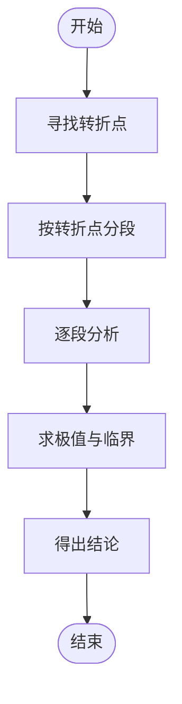

图表来源
- [P12_多过程与临界极值.md:49-99](file://docs/knowledge/physics/P12_多过程与临界极值.md#L49-L99)

章节来源
- [P12_多过程与临界极值.md:1-219](file://docs/knowledge/physics/P12_多过程与临界极值.md#L1-L219)

### P14 抛体运动
- 情境引入：水平扔石子与斜向上投掷
- 困惑激发：最高点速度是否为零？水平方向为何匀速？
- 实验/现象：频闪照片显示等差与等加速
- 概念建立：平抛与斜抛；时间t是桥梁；轨迹方程
- 推导过程：水平匀速、竖直自由落体；合速度与轨迹
- 应用拓展：篮球投篮、炮弹轨迹、喷泉测量

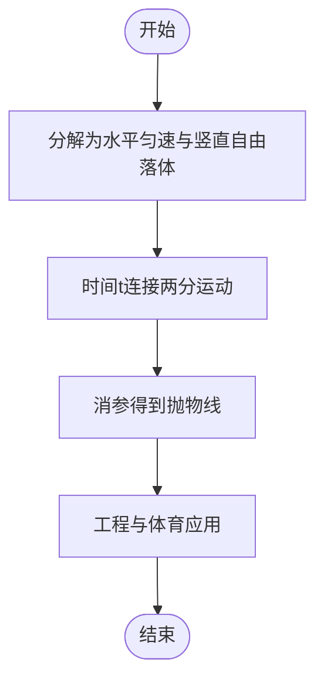

图表来源
- [P14_抛体运动.md:52-114](file://docs/knowledge/physics/P14_抛体运动.md#L52-L114)

章节来源
- [P14_抛体运动.md:1-245](file://docs/knowledge/physics/P14_抛体运动.md#L1-L245)

### P15 圆周运动
- 情境引入：绳子拉球做圆周运动
- 困惑激发：匀速圆周运动速度不变？向心力是特殊力？
- 实验/现象：转盘测量向心力与角速度关系
- 概念建立：a=v²/r=rω²；F=mv²/r；向心力是效果力
- 推导过程：速度变化率；牛顿第二定律
- 应用拓展：汽车转弯；洗衣机脱水；地球自转

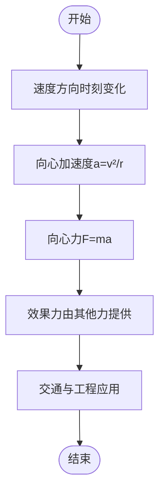

图表来源
- [P15_圆周运动.md:52-118](file://docs/knowledge/physics/P15_圆周运动.md#L52-L118)

章节来源
- [P15_圆周运动.md:1-253](file://docs/knowledge/physics/P15_圆周运动.md#L1-L253)

### P17 天体运动
- 情境引入：地球绕太阳、月球绕地球、人造卫星
- 困惑激发：卫星为何不掉下来？离地越近速度越快？
- 实验/现象：不同高度卫星运行数据
- 概念建立：万有引力提供向心力；v=√(GM/r)；同步卫星
- 推导过程：黄金代换；变轨与机械能变化
- 应用拓展：GPS定位、天气预报、通讯卫星

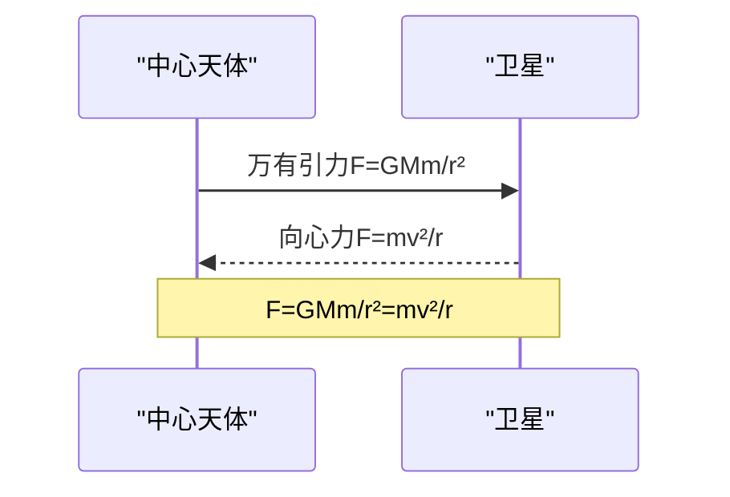

图表来源
- [P17_天体运动.md:51-117](file://docs/knowledge/physics/P17_天体运动.md#L51-L117)

章节来源
- [P17_天体运动.md:1-248](file://docs/knowledge/physics/P17_天体运动.md#L1-L248)

### P19 功与功率
- 情境引入：推箱子与推墙的区别
- 困惑激发：有力就一定做功？功与功率的区别？
- 实验/现象：不同角度拉力做功对比
- 概念建立：W=Fs cosθ；P=W/t=Fv cosθ；常见不做功情形
- 推导过程：恒力做功；变力做功（积分）；瞬时功率
- 应用拓展：汽车爬坡；人爬楼；风力发电

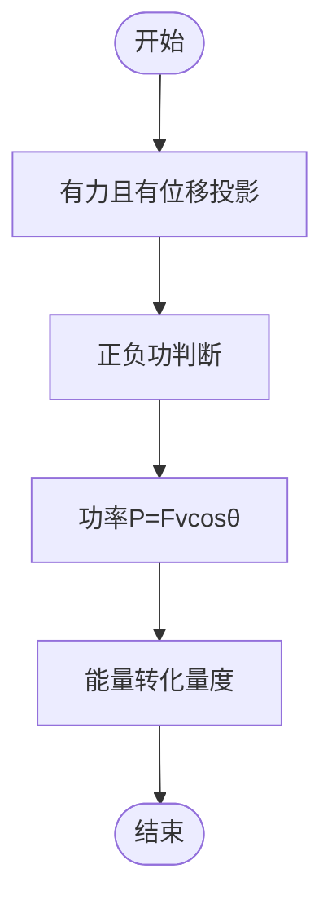

图表来源
- [P19_功与功率.md:52-126](file://docs/knowledge/physics/P19_功与功率.md#L52-L126)

章节来源
- [P19_功与功率.md:1-257](file://docs/knowledge/physics/P19_功与功率.md#L1-L257)

### P21 重力势能·弹性势能
- 情境引入：举高物体与压缩弹簧
- 困惑激发：势能属于谁？势能可正可负？
- 实验/现象：自由落体动能变化验证
- 概念建立：Ep=mgh；Ep=½kx²；W重=-ΔEp
- 推导过程：重力做功与势能关系；弹性势能来源
- 应用拓展：蹦极；发条储能；水力发电

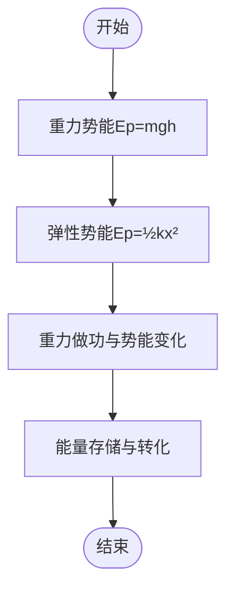

图表来源
- [P21_重力势能·弹性势能.md:52-121](file://docs/knowledge/physics/P21_重力势能·弹性势能.md#L52-L121)

章节来源
- [P21_重力势能·弹性势能.md:1-255](file://docs/knowledge/physics/P21_重力势能·弹性势能.md#L1-L255)

### P23 功能关系与能量守恒
- 情境引入：推箱子动能增加
- 困惑激发：摩擦生热Q=fs相对？能量守恒条件？
- 实验/现象：不同过程的功与能变化
- 概念建立：W合=ΔEk；W重=-ΔEp；W非重=ΔE机械；能量守恒
- 推导过程：动能定理；保守力做功；非保守力做功
- 应用拓展：摩擦生热；蹦极；摩擦起电

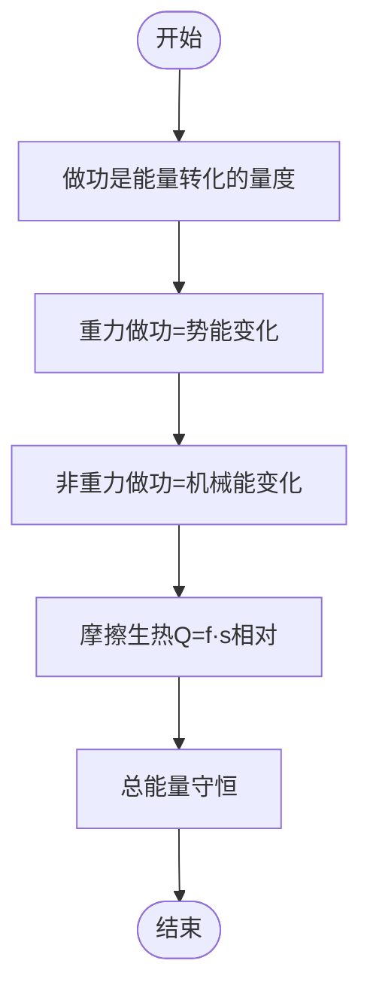

图表来源
- [P23_功能关系与能量守恒.md:50-104](file://docs/knowledge/physics/P23_功能关系与能量守恒.md#L50-L104)

章节来源
- [P23_功能关系与能量守恒.md:1-234](file://docs/knowledge/physics/P23_功能关系与能量守恒.md#L1-L234)

### P24 动量与冲量
- 情境引入：大象与子弹的难停程度
- 困惑激发：动量大速度就大？冲量是力？
- 实验/现象：不同质量速度产生相同动量
- 概念建立：p=mv；I=Ft；I=Δp；矢量性
- 推导过程：牛顿第二定律变形；冲量与动量变化
- 应用拓展：安全气囊；跳垫子；缓冲包装

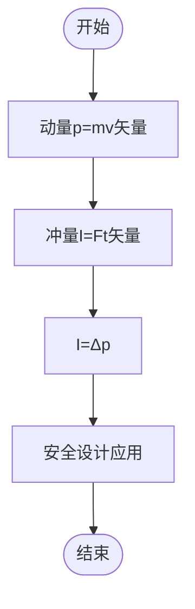

图表来源
- [P24_动量与冲量.md:52-111](file://docs/knowledge/physics/P24_动量与冲量.md#L52-L111)

章节来源
- [P24_动量与冲量.md:1-242](file://docs/knowledge/physics/P24_动量与冲量.md#L1-L242)

### P26 动量守恒定律
- 情境引入：冰面上两物体碰撞
- 困惑激发：动量守恒=速度守恒？
- 实验/现象：碰撞前后总动量相等
- 概念建立：合外力为零时总动量守恒；内力不影响总动量
- 推导过程：动量定理；内力成对出现；合外力为零
- 应用拓展：碰撞分析；爆炸；火箭推进

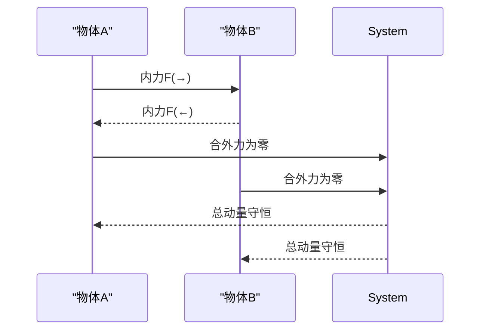

图表来源
- [P26_动量守恒定律.md:49-102](file://docs/knowledge/physics/P26_动量守恒定律.md#L49-L102)

章节来源
- [P26_动量守恒定律.md:1-225](file://docs/knowledge/physics/P26_动量守恒定律.md#L1-L225)

### 电磁学相关（力学知识延展）
- P29 静电场：场强E=F/q；电势φ=Ep/q；E=-dφ/dr
- P31 带电粒子在电场中的运动：F=qE；类平抛；偏转位移
- P32 恒定电流：I=q/t；欧姆定律U=IR；电阻定律R=ρl/S
- P33 电功与电功率：W=UIt；P=UI；焦耳定律Q=I²Rt

章节来源
- [P29_静电场.md:1-230](file://docs/knowledge/physics/P29_静电场.md#L1-L230)
- [P31_带电粒子在电场中的运动.md:1-216](file://docs/knowledge/physics/P31_带电粒子在电场中的运动.md#L1-L216)
- [P32_恒定电流.md:1-221](file://docs/knowledge/physics/P32_恒定电流.md#L1-L221)
- [P33_电功与电功率.md:1-222](file://docs/knowledge/physics/P33_电功与电功率.md#L1-L222)

## 依赖分析
- 前置知识要求
  - P07 → P08（力的合成与分解）
  - P08 → P09（牛顿三定律）
  - P09 → P10（超重与失重）、P11（连接体问题）
  - P11 → P12（多过程与临界极值）
  - P13（运动的合成与分解） → P14（抛体运动）、P15（圆周运动）
  - P15 → P17（天体运动）
  - P19（功与功率） → P21（势能） → P23（功能关系与能量守恒）
  - P24（动量与冲量） → P26（动量守恒定律）
  - P29（静电场） → P31（带电粒子在电场中的运动）
  - P31（带电粒子在电场中的运动） → P32（恒定电流）
  - P32（恒定电流） → P33（电功与电功率）

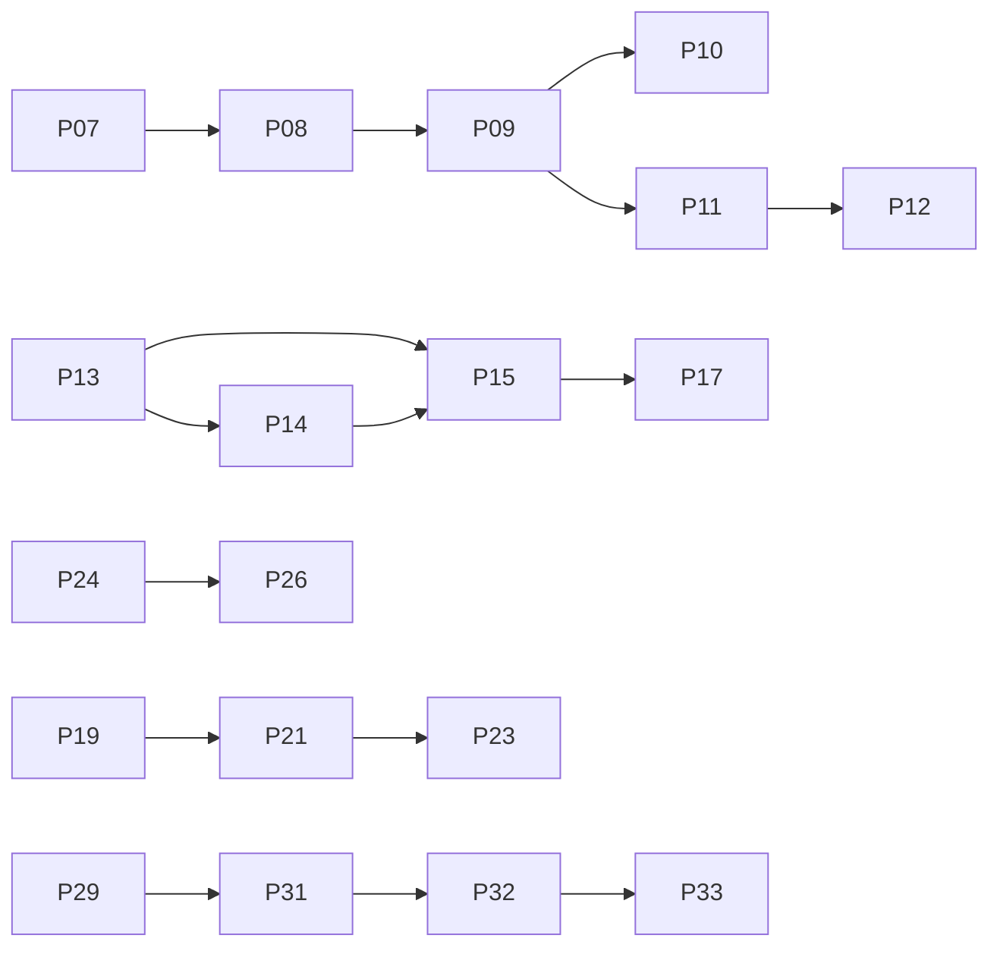

图表来源
- [P07_力学常见力.md:15-16](file://docs/knowledge/physics/P07_力学常见力.md#L15-L16)
- [P08_力的合成与分解.md:15-16](file://docs/knowledge/physics/P08_力的合成与分解.md#L15-L16)
- [P09_牛顿三定律.md:15-16](file://docs/knowledge/physics/P09_牛顿三定律.md#L15-L16)
- [P10_超重与失重.md:15-16](file://docs/knowledge/physics/P10_超重与失重.md#L15-L16)
- [P11_连接体问题.md:15-16](file://docs/knowledge/physics/P11_连接体问题.md#L15-L16)
- [P12_多过程与临界极值.md:15-16](file://docs/knowledge/physics/P12_多过程与临界极值.md#L15-L16)
- [P14_抛体运动.md:15-16](file://docs/knowledge/physics/P14_抛体运动.md#L15-L16)
- [P15_圆周运动.md:15-16](file://docs/knowledge/physics/P15_圆周运动.md#L15-L16)
- [P17_天体运动.md:15-16](file://docs/knowledge/physics/P17_天体运动.md#L15-L16)
- [P19_功与功率.md:15-16](file://docs/knowledge/physics/P19_功与功率.md#L15-L16)
- [P21_重力势能·弹性势能.md:15-16](file://docs/knowledge/physics/P21_重力势能·弹性势能.md#L15-L16)
- [P23_功能关系与能量守恒.md:15-16](file://docs/knowledge/physics/P23_功能关系与能量守恒.md#L15-L16)
- [P24_动量与冲量.md:15-16](file://docs/knowledge/physics/P24_动量与冲量.md#L15-L16)
- [P26_动量守恒定律.md:15-16](file://docs/knowledge/physics/P26_动量守恒定律.md#L15-L16)
- [P29_静电场.md:15-16](file://docs/knowledge/physics/P29_静电场.md#L15-L16)
- [P31_带电粒子在电场中的运动.md:15-16](file://docs/knowledge/physics/P31_带电粒子在电场中的运动.md#L15-L16)
- [P32_恒定电流.md:15-16](file://docs/knowledge/physics/P32_恒定电流.md#L15-L16)
- [P33_电功与电功率.md:15-16](file://docs/knowledge/physics/P33_电功与电功率.md#L15-L16)

章节来源
- [P07_力学常见力.md:15-16](file://docs/knowledge/physics/P07_力学常见力.md#L15-L16)
- [P08_力的合成与分解.md:15-16](file://docs/knowledge/physics/P08_力的合成与分解.md#L15-L16)
- [P09_牛顿三定律.md:15-16](file://docs/knowledge/physics/P09_牛顿三定律.md#L15-L16)
- [P10_超重与失重.md:15-16](file://docs/knowledge/physics/P10_超重与失重.md#L15-L16)
- [P11_连接体问题.md:15-16](file://docs/knowledge/physics/P11_连接体问题.md#L15-L16)
- [P12_多过程与临界极值.md:15-16](file://docs/knowledge/physics/P12_多过程与临界极值.md#L15-L16)
- [P14_抛体运动.md:15-16](file://docs/knowledge/physics/P14_抛体运动.md#L15-L16)
- [P15_圆周运动.md:15-16](file://docs/knowledge/physics/P15_圆周运动.md#L15-L16)
- [P17_天体运动.md:15-16](file://docs/knowledge/physics/P17_天体运动.md#L15-L16)
- [P19_功与功率.md:15-16](file://docs/knowledge/physics/P19_功与功率.md#L15-L16)
- [P21_重力势能·弹性势能.md:15-16](file://docs/knowledge/physics/P21_重力势能·弹性势能.md#L15-L16)
- [P23_功能关系与能量守恒.md:15-16](file://docs/knowledge/physics/P23_功能关系与能量守恒.md#L15-L16)
- [P24_动量与冲量.md:15-16](file://docs/knowledge/physics/P24_动量与冲量.md#L15-L16)
- [P26_动量守恒定律.md:15-16](file://docs/knowledge/physics/P26_动量守恒定律.md#L15-L16)
- [P29_静电场.md:15-16](file://docs/knowledge/physics/P29_静电场.md#L15-L16)
- [P31_带电粒子在电场中的运动.md:15-16](file://docs/knowledge/physics/P31_带电粒子在电场中的运动.md#L15-L16)
- [P32_恒定电流.md:15-16](file://docs/knowledge/physics/P32_恒定电流.md#L15-L16)
- [P33_电功与电功率.md:15-16](file://docs/knowledge/physics/P33_电功与电功率.md#L15-L16)

## 性能考虑
- 教学节奏控制：基础知识点（P07-P09）建议课堂讲授为主，配套实验验证；提高知识点（P12、P15、P23、P26）建议以问题驱动与分层练习为主。
- 计算复杂度：圆周运动与天体运动涉及较多代数与函数关系，建议配合图像与数值代入降低认知负荷。
- 实验与演示：推荐使用数字化仿真（如抛体、圆周、天体运动）与传感器数据采集（功与功率、超重/失重）提升直观性。
- 错题与误区：针对常见迷思（如摩擦力、向心力、动量与冲量、功能关系）设置专项纠错与辨析练习。

## 故障排除指南
- 学生混淆“做功”与“功率”
  - 症状：只关注功率大小，忽略时间因素
  - 处理：强调W=Pt；用电费计量说明“功率×时间”的意义
- 学生误以为“向心力是特殊力”
  - 症状：认为向心力是独立性质的力
  - 处理：强调向心力是效果力，由重力、弹力、摩擦力等提供
- 学生把“动量守恒”等同于“速度守恒”
  - 症状：认为质量不同时速度不变
  - 处理：强调m₁v₁+m₂v₂守恒，速度可变
- 学生对“超重/失重”与“重力”混淆
  - 症状：认为失重时重力消失
  - 处理：明确重力不变，支持力变化；N=m(g±a)

章节来源
- [P09_牛顿三定律.md:25-29](file://docs/knowledge/physics/P09_牛顿三定律.md#L25-L29)
- [P10_超重与失重.md:25-29](file://docs/knowledge/physics/P10_超重与失重.md#L25-L29)
- [P15_圆周运动.md:25-29](file://docs/knowledge/physics/P15_圆周运动.md#L25-L29)
- [P26_动量守恒定律.md:25-27](file://docs/knowledge/physics/P26_动量守恒定律.md#L25-L27)

## 结论
本文件基于星耀平台现有力学与部分电磁学知识节点，构建了统一的principle结构与学习路径。通过情境引入、困惑激发、实验验证、概念建立、推导过程、应用拓展的完整闭环，配合难度等级、前置知识、关联知识点与分层练习，既适合教师备课与教学设计，也可作为学生自主学习与复习的导航。建议在教学中结合实验与数字化资源，强化直观体验与思维迁移。

## 附录
- 教学策略建议
  - 情境化导入：用生活实例引发认知冲突
  - 实验驱动：以动手实验验证理论假设
  - 分层任务：B级（基础套用）→J级（方法迁移）→T级（综合建模）
  - 错题复盘：针对常见迷思设计辨析题
  - 跨学科整合：与数学（函数、图像）、生物（航天医学）、地理（同步卫星）等融合
- 学习路径设计（示例）
  - 起点：P07（常见力）→P08（合成与分解）→P09（牛顿三定律）
  - 曲线运动：P09→P14（抛体）→P15（圆周）→P17（天体）
  - 能量动量：P19→P21→P23→P24→P26
  - 电磁延伸：P29→P31→P32→P33