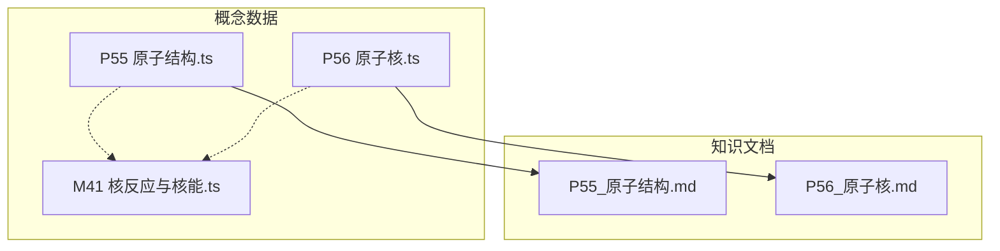
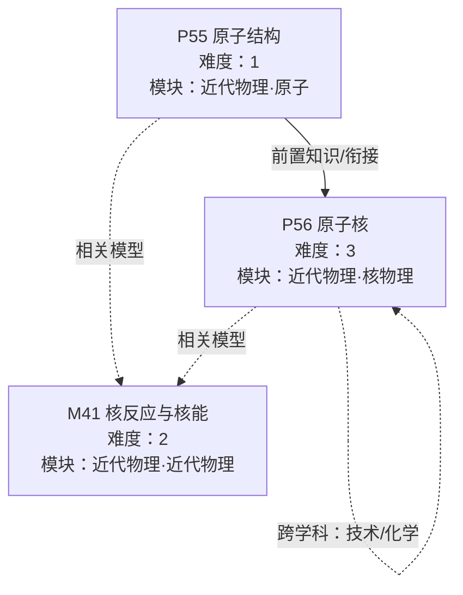
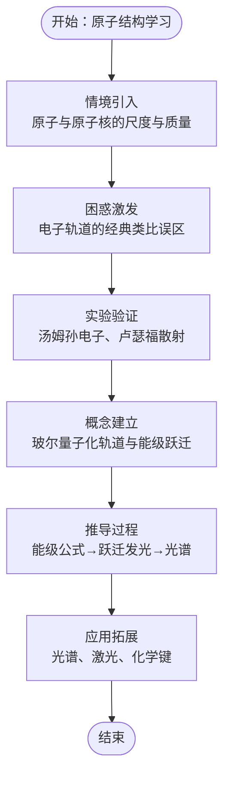
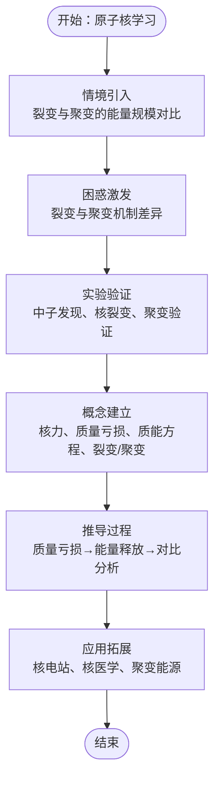
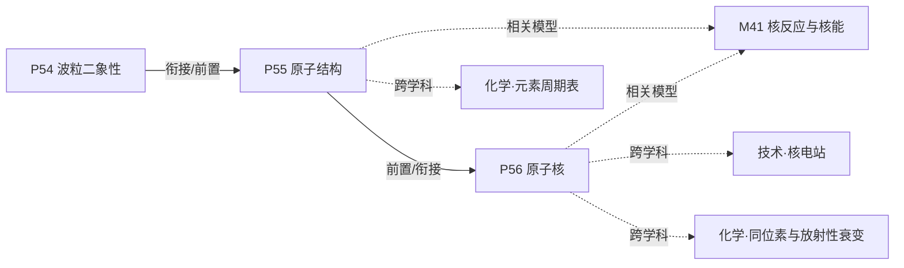

# 原子物理与核物理知识节点

<cite>
**本文引用的文件**   
- [P55_原子结构.ts](file://src/data/physics/concepts/P55_原子结构.ts)
- [P56_原子核.ts](file://src/data/physics/concepts/P56_原子核.ts)
- [M41_核反应与核能.ts](file://src/data/physics/models/M41_核反应与核能.ts)
- [P55_原子结构.md](file://docs/knowledge/physics/P55_原子结构.md)
- [P56_原子核.md](file://docs/knowledge/physics/P56_原子核.md)
- [C13_原子结构.ts](file://src/data/chemistry/concepts/C13_原子结构.ts)
</cite>

## 目录
1. [引言](#引言)
2. [项目结构](#项目结构)
3. [核心组件](#核心组件)
4. [架构总览](#架构总览)
5. [详细组件分析](#详细组件分析)
6. [依赖分析](#依赖分析)
7. [性能考虑](#性能考虑)
8. [故障排查指南](#故障排查指南)
9. [结论](#结论)
10. [附录](#附录)

## 引言
本文件面向“星耀平台”物理学科的原子物理与核物理知识节点，聚焦两个核心知识点：原子结构与原子核。文档基于仓库中的概念数据与知识文档，系统梳理每个知识点的principle结构设计（情境引入、困惑激发、实验验证、概念建立、推导过程、应用拓展），并给出难度等级、前置知识、相关知识点与学习路径建议。同时，提供教学策略与实践案例，帮助教师与学习者高效掌握α粒子散射实验与原子结构的关系、原子核的基本性质、核反应与核能的利用。

## 项目结构
本项目采用“概念数据 + 知识文档”的双轨组织方式：
- 概念数据：位于 src/data/physics/concepts 与 src/data/physics/models，以 TypeScript 对象形式承载知识点的结构化信息（如难度、前置检测、公式卡片、分层变形、自评等）。
- 知识文档：位于 docs/knowledge/physics，以 Markdown 文档形式提供完整叙事与教学内容。

图表来源
- [P55_原子结构.ts:1-103](file://src/data/physics/concepts/P55_原子结构.ts#L1-L103)
- [P56_原子核.ts:1-164](file://src/data/physics/concepts/P56_原子核.ts#L1-L164)
- [M41_核反应与核能.ts:1-18](file://src/data/physics/models/M41_核反应与核能.ts#L1-L18)
- [P55_原子结构.md:1-203](file://docs/knowledge/physics/P55_原子结构.md#L1-L203)
- [P56_原子核.md:1-242](file://docs/knowledge/physics/P56_原子核.md#L1-L242)

章节来源
- [P55_原子结构.ts:1-103](file://src/data/physics/concepts/P55_原子结构.ts#L1-L103)
- [P56_原子核.ts:1-164](file://src/data/physics/concepts/P56_原子核.ts#L1-L164)
- [M41_核反应与核能.ts:1-18](file://src/data/physics/models/M41_核反应与核能.ts#L1-L18)
- [P55_原子结构.md:1-203](file://docs/knowledge/physics/P55_原子结构.md#L1-L203)
- [P56_原子核.md:1-242](file://docs/knowledge/physics/P56_原子核.md#L1-L242)

## 核心组件
- 原子结构（P55）：以“模型发展—能级—跃迁—光谱”为主线，强调从汤姆孙、卢瑟福到玻尔再到量子力学的演化，突出“电子只能在特定轨道上”的量子化思想与光谱的分立性。
- 原子核（P56）：围绕“核力—质量亏损—质能方程—裂变与聚变—核能应用”展开，强调核反应能量远大于化学反应，并通过实验事实支撑概念建立。
- 模型（M41）：当前处于“内容建设中”，尚未完善，但与原子结构（P55）存在关联。

章节来源
- [P55_原子结构.ts:6-102](file://src/data/physics/concepts/P55_原子结构.ts#L6-L102)
- [P56_原子核.ts:6-163](file://src/data/physics/concepts/P56_原子核.ts#L6-L163)
- [M41_核反应与核能.ts:1-18](file://src/data/physics/models/M41_核反应与核能.ts#L1-L18)

## 架构总览
以下图展示两个核心知识点在知识网络中的位置与关系，以及与模型、跨学科的连接。

图表来源
- [P55_原子结构.ts:10-12](file://src/data/physics/concepts/P55_原子结构.ts#L10-L12)
- [P56_原子核.ts:10-12](file://src/data/physics/concepts/P56_原子核.ts#L10-L12)
- [M41_核反应与核能.ts:3-10](file://src/data/physics/models/M41_核反应与核能.ts#L3-L10)
- [P55_原子结构.md:15-16](file://docs/knowledge/physics/P55_原子结构.md#L15-L16)
- [P56_原子核.md:15-17](file://docs/knowledge/physics/P56_原子核.md#L15-L17)

## 详细组件分析

### 组件A：原子结构（P55）
- 难度等级：1（入门级）
- 模块与章节：近代物理·原子
- 前置知识：与P54（如波粒二象性）衔接，用于检验学生对原子结构的初步认知。
- 教学重点：
  - 情境引入：原子与原子核的尺度差异，质量集中在原子核。
  - 困惑激发：学生常误以为“电子像行星绕太阳一样运动”，需指出这是过渡模型。
  - 实验验证：以汤姆孙发现电子、卢瑟福α粒子散射实验（作为背景知识）为支撑。
  - 概念建立：玻尔模型的量子化假设与能级跃迁，解释光谱的分立性。
  - 推导过程：从经典轨道到量子化轨道，从能级公式到跃迁发光。
  - 应用拓展：光谱、激光、化学键等。

图表来源
- [P55_原子结构.ts:52-59](file://src/data/physics/concepts/P55_原子结构.ts#L52-L59)
- [P55_原子结构.md:32-71](file://docs/knowledge/physics/P55_原子结构.md#L32-L71)

章节来源
- [P55_原子结构.ts:6-102](file://src/data/physics/concepts/P55_原子结构.ts#L6-L102)
- [P55_原子结构.md:1-203](file://docs/knowledge/physics/P55_原子结构.md#L1-L203)

### 组件B：原子核（P56）
- 难度等级：3（较高）
- 模块与章节：近代物理·核物理
- 前置知识：原子结构（P55），用于理解核内组成与质量亏损的来源。
- 教学重点：
  - 情境引入：广岛长崎事件与太阳能量来源，对比裂变与聚变的能量规模。
  - 困惑激发：裂变与聚变“都是原子核变化”的误区，强调机制差异（重核分裂 vs 轻核聚合）。
  - 实验验证：查德威克发现中子、哈恩-斯特拉斯曼发现核裂变、氢弹验证聚变。
  - 概念建立：核力、质量亏损、质能方程 ΔE=Δmc²、裂变与聚变反应式。
  - 推导过程：以铀235裂变为例，计算质量亏损与能量释放；对比裂变与聚变的单位质量释能。
  - 应用拓展：核电站、核医学（PET）、未来聚变能源（ITER）。

图表来源
- [P56_原子核.ts:52-59](file://src/data/physics/concepts/P56_原子核.ts#L52-L59)
- [P56_原子核.md:32-94](file://docs/knowledge/physics/P56_原子核.md#L32-L94)

章节来源
- [P56_原子核.ts:6-163](file://src/data/physics/concepts/P56_原子核.ts#L6-L163)
- [P56_原子核.md:1-242](file://docs/knowledge/physics/P56_原子核.md#L1-L242)

### 教学策略与范例
- α粒子散射实验与原子结构：
  - 通过实验现象引导学生质疑“原子内部是实心球”的传统观念，进而接受“原子核集中质量”的核式结构。
  - 结合玻尔模型解释光谱的分立性，强调能级跃迁与光子频率的关系。
- 原子核概念建立：
  - 以质量亏损与质能方程为核心，通过典型核反应（如铀235裂变）演示质量到能量的转换。
  - 对比裂变与聚变的触发条件、反应产物与能量规模，澄清常见误区。
- 核反应与核能利用：
  - 以核电站、核医学、聚变能源为应用案例，帮助学生理解核能的现实意义与未来潜力。

章节来源
- [P55_原子结构.ts:52-59](file://src/data/physics/concepts/P55_原子结构.ts#L52-L59)
- [P56_原子核.ts:52-59](file://src/data/physics/concepts/P56_原子核.ts#L52-L59)
- [P56_原子核.md:40-94](file://docs/knowledge/physics/P56_原子核.md#L40-L94)

## 依赖分析
- 知识依赖：
  - P56 以 P55 为前置知识，强调“原子结构→原子核组成→核反应”的递进关系。
- 模型依赖：
  - P55 与 M41 存在相关关系；P56 与 M41 存在相关关系，但当前 M41 内容尚未完善。
- 跨学科关联：
  - 原子结构（P55）与化学（元素周期表、电子排布）相关。
  - 原子核（P56）与技术（核电站）与化学（同位素与放射性衰变）相关。

图表来源
- [P55_原子结构.ts:10-12](file://src/data/physics/concepts/P55_原子结构.ts#L10-L12)
- [P56_原子核.ts:10-12](file://src/data/physics/concepts/P56_原子核.ts#L10-L12)
- [P55_原子结构.md:15-16](file://docs/knowledge/physics/P55_原子结构.md#L15-L16)
- [P56_原子核.md:15-17](file://docs/knowledge/physics/P56_原子核.md#L15-L17)
- [M41_核反应与核能.ts:3-10](file://src/data/physics/models/M41_核反应与核能.ts#L3-L10)

章节来源
- [P55_原子结构.ts:90-101](file://src/data/physics/concepts/P55_原子结构.ts#L90-L101)
- [P56_原子核.ts:144-162](file://src/data/physics/concepts/P56_原子核.ts#L144-L162)
- [P55_原子结构.md:186-191](file://docs/knowledge/physics/P55_原子结构.md#L186-L191)
- [P56_原子核.md:222-228](file://docs/knowledge/physics/P56_原子核.md#L222-L228)

## 性能考虑
- 数据结构与渲染效率：
  - 概念数据采用扁平对象，便于前端按需加载与快速渲染。
  - 公式卡片与分层变形以数组形式组织，利于统一处理与展示。
- 学习路径优化：
  - 建议先完成 P55（难度1），再进入 P56（难度3），避免因知识断层导致理解困难。
  - 在 P56 中穿插“理解度自评”与“分层变形”，有助于及时反馈与巩固。

## 故障排查指南
- 常见问题与对策：
  - 学生混淆“单次释能”与“单位质量释能”：通过对比裂变与聚变的计算，明确“单位质量释能”更具工程价值。
  - 对核反应机制理解偏差：强调裂变需要链式反应控制，聚变需要极高温度，二者触发条件与产物差异显著。
  - 对质量亏损与质能方程的单位换算不熟练：提供标准换算关系与典型计算步骤，强化训练。
- 自评与调整：
  - 使用“理解度自评”进行阶段性评估，A/B/C三级分别对应不同的学习行动建议。

章节来源
- [P56_原子核.ts:125-142](file://src/data/physics/concepts/P56_原子核.ts#L125-L142)
- [P56_原子核.md:209-219](file://docs/knowledge/physics/P56_原子核.md#L209-L219)

## 结论
本知识节点以“原子结构—原子核”为主线，构建了从模型发展到实验验证、从概念建立到应用拓展的完整principle结构。通过清晰的难度分级、前置知识与跨学科关联，配合分层变形与自评机制，能够有效支持不同层次的学习需求。建议在教学中以实验事实为依托，以质量亏损与质能方程为核心，逐步深化对核反应与核能的理解，并结合实际应用提升学习动机与迁移能力。

## 附录
- 相关概念与模型索引：
  - 物理概念：P55（原子结构）、P56（原子核）
  - 物理模型：M41（核反应与核能，内容建设中）
  - 化学概念：C13（原子结构，占位模板）

章节来源
- [C13_原子结构.ts:1-41](file://src/data/chemistry/concepts/C13_原子结构.ts#L1-L41)