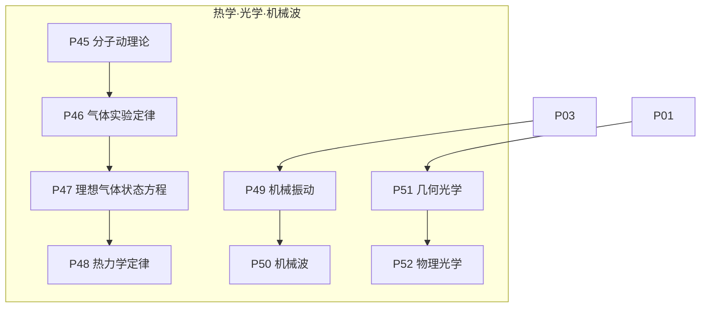
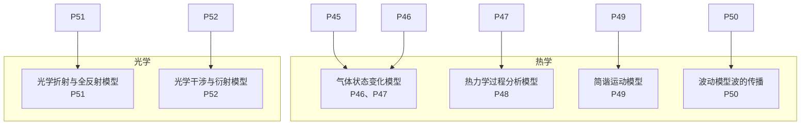
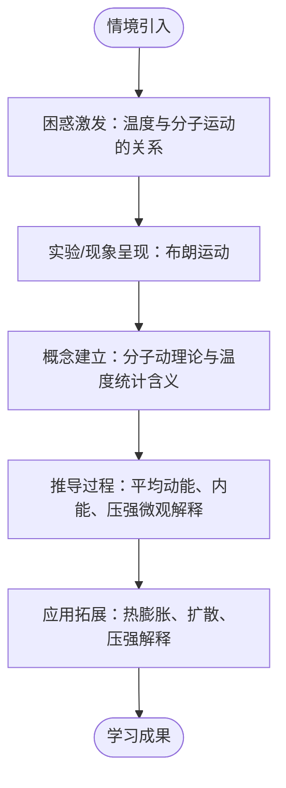
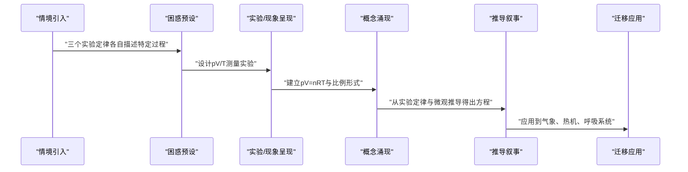
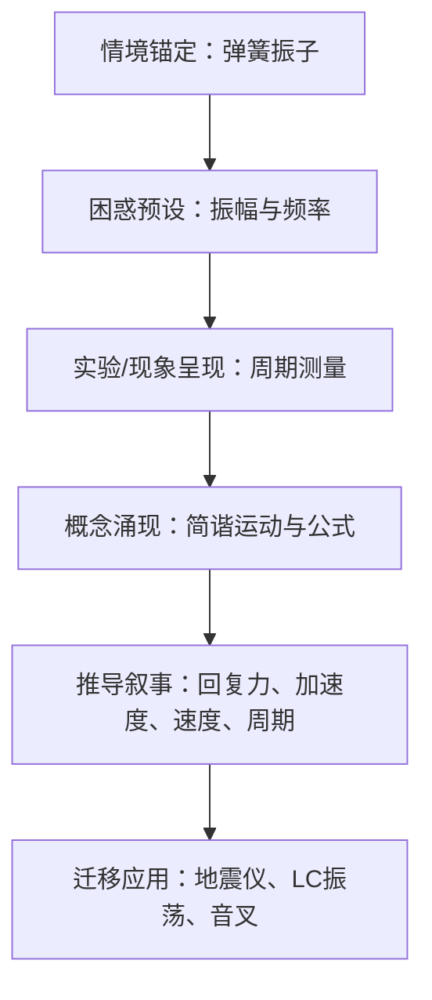
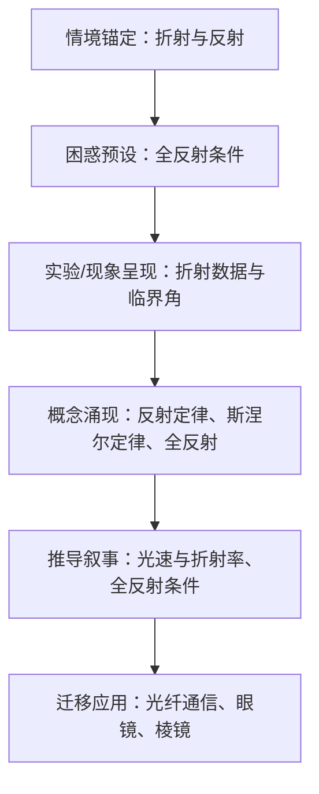
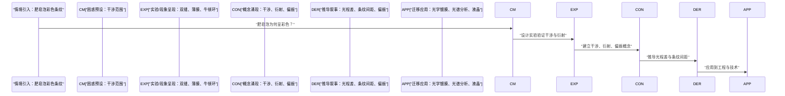
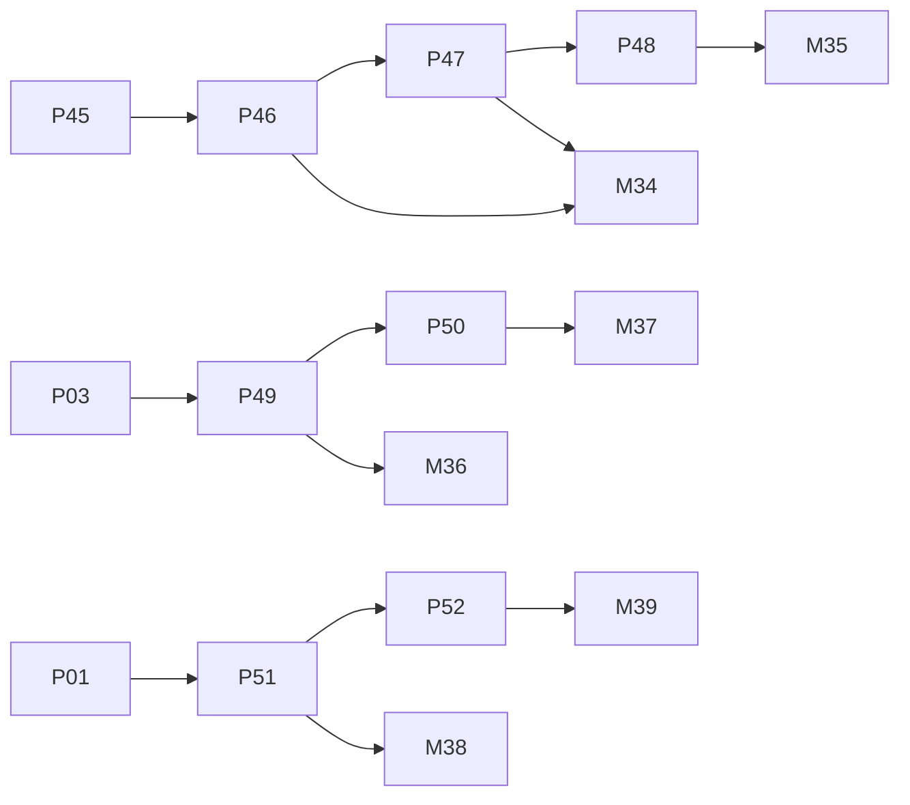

# 热学与光学知识节点

<cite>
**本文引用的文件**
- [P45_分子动理论.md](file://docs/knowledge/physics/P45_分子动理论.md)
- [P47_理想气体状态方程.md](file://docs/knowledge/physics/P47_理想气体状态方程.md)
- [P49_机械振动.md](file://docs/knowledge/physics/P49_机械振动.md)
- [P51_几何光学.md](file://docs/knowledge/physics/P51_几何光学.md)
- [P52_物理光学.md](file://docs/knowledge/physics/P52_物理光学.md)
- [高中物理·知识网络与内容体系.md](file://docs/architecture/高中物理·知识网络与内容体系.md)
</cite>

## 目录
1. [引言](#引言)
2. [项目结构](#项目结构)
3. [核心组件](#核心组件)
4. [架构总览](#架构总览)
5. [详细组件分析](#详细组件分析)
6. [依赖分析](#依赖分析)
7. [性能考虑](#性能考虑)
8. [故障排查指南](#故障排查指南)
9. [结论](#结论)
10. [附录](#附录)

## 引言
本文件面向“星耀平台”物理学科的热学与光学知识节点，围绕以下8个核心知识点进行系统化梳理与教学设计：
- 分子动理论
- 气体实验定律
- 理想气体状态方程
- 热力学定律
- 机械振动
- 机械波
- 几何光学
- 物理光学

文档以“principle结构设计”为主线，逐项阐述情境引入、困惑激发、实验验证、概念建立、推导过程、应用拓展六个环节，并补充难度等级、前置知识、相关模型、学习路径与教学策略，帮助教师与学习者高效掌握热学与光学的主干知识。

## 项目结构
热学与光学模块位于“板块6：热学·光学·机械波”，包含如下核心节点与依赖关系：
- 分子动理论 → 气体实验定律 → 理想气体状态方程 → 热力学定律
- 机械振动（P03 → P49） → 机械波
- 几何光学（P01 → P51） → 物理光学

图表来源
- [高中物理·知识网络与内容体系.md:437-440](file://docs/architecture/高中物理·知识网络与内容体系.md#L437-L440)

章节来源
- [高中物理·知识网络与内容体系.md:422-453](file://docs/architecture/高中物理·知识网络与内容体系.md#L422-L453)

## 核心组件
本节对8个核心知识点逐一进行principle结构设计与教学要点提炼，强调从微观到宏观、从几何到波动的认知进阶。

- 分子动理论
  - 情境引入：热水与冷水的分子运动差异
  - 困惑激发：温度高是否意味着每个分子都运动快
  - 实验验证：布朗运动随温度变化的观察
  - 概念建立：分子动理论三要素与温度的统计含义
  - 推导过程：平均动能与温度关系、内能构成、压强的微观解释
  - 应用拓展：热膨胀、扩散、压强微观解释
  - 难度等级：入门
  - 前置知识：无
  - 相关模型：M34、M35
  - 教学策略：以统计平均为核心，用微观粒子运动解释宏观热现象

- 理想气体状态方程
  - 情境引入：单一方程统一三个实验定律
  - 困惑激发：标准状况的数值记忆误区
  - 实验验证：pV/T是否为常数的测量
  - 概念建立：pV=nRT与比例形式
  - 推导过程：从实验定律综合推导、微观推导（压强与平均动能）
  - 应用拓展：气象、热机、呼吸系统
  - 难度等级：入门
  - 前置知识：P46
  - 相关模型：M34、M35
  - 教学策略：强调模型近似与适用条件，强化图像与多过程分析

- 机械振动
  - 情境引入：弹簧振子来回振动
  - 困惑激发：振幅与频率的关系误解
  - 实验验证：不同振幅下的周期测量
  - 概念建立：简谐运动定义、位移与周期公式
  - 推导过程：回复力、加速度、速度与周期
  - 应用拓展：地震仪、LC振荡、音叉
  - 难度等级：入门
  - 前置知识：P03
  - 相关模型：M36、M37
  - 教学策略：突出“变加速”与相位关系，结合能量分析

- 机械波
  - 情境引入：振动在介质中的传播
  - 困惑激发：质点是否随波迁移
  - 实验验证：波的传播与干涉、衍射现象
  - 概念建立：波速、频率、波长关系与多普勒效应
  - 推导过程：波的形成、传播与典型现象
  - 应用拓展：声波、地震波、波的图像分析
  - 难度等级：入门
  - 前置知识：P49
  - 相关模型：M37
  - 教学策略：强调“传播能量与信息”，区分波源与介质运动

- 几何光学
  - 情境引入：筷子在水中看起来弯折、镜子成像
  - 困惑激发：全反射发生的条件误解
  - 实验验证：折射实验与临界角测量
  - 概念建立：反射定律、斯涅尔定律、全反射
  - 推导过程：光速与折射率关系、全反射条件
  - 应用拓展：光纤通信、眼镜、棱镜色散
  - 难度等级：入门
  - 前置知识：P01
  - 相关模型：M38、M39
  - 教学策略：强调“直线传播近似”，结合插针法测折射率

- 物理光学
  - 情境引入：肥皂泡的彩色条纹
  - 困惑激发：干涉仅在双缝中出现的误解
  - 实验验证：双缝、薄膜、牛顿环等实验
  - 概念建立：干涉、衍射与偏振
  - 推导过程：光程差条件、条纹间距、偏振定律
  - 应用拓展：光学镀膜、光谱分析、液晶显示
  - 难度等级：入门
  - 前置知识：P51
  - 相关模型：M39
  - 教学策略：以实验为载体，建立波动光学的直观认识

章节来源
- [P45_分子动理论.md:1-216](file://docs/knowledge/physics/P45_分子动理论.md#L1-L216)
- [P47_理想气体状态方程.md:1-200](file://docs/knowledge/physics/P47_理想气体状态方程.md#L1-L200)
- [P49_机械振动.md:1-215](file://docs/knowledge/physics/P49_机械振动.md#L1-L215)
- [P51_几何光学.md:1-213](file://docs/knowledge/physics/P51_几何光学.md#L1-L213)
- [P52_物理光学.md:1-218](file://docs/knowledge/physics/P52_物理光学.md#L1-L218)

## 架构总览
热学与光学模块遵循“微观→宏观、几何→波动”的认知路径，通过模型与范式支撑知识迁移与能力发展。

图表来源
- [高中物理·知识网络与内容体系.md:547-556](file://docs/architecture/高中物理·知识网络与内容体系.md#L547-L556)

章节来源
- [高中物理·知识网络与内容体系.md:422-453](file://docs/architecture/高中物理·知识网络与内容体系.md#L422-L453)

## 详细组件分析

### 分子动理论（P45）
- 设计要点
  - 情境引入：以“热水与冷水”对比，聚焦分子运动差异
  - 困惑激发：纠正“温度高即每个分子都快”的误区
  - 实验验证：通过布朗运动观察温度与分子运动的关系
  - 概念建立：分子动理论三要素与温度的统计含义
  - 推导过程：平均动能与温度关系、内能构成、压强的微观解释
  - 应用拓展：热膨胀、扩散、压强微观解释
- 教学策略
  - 以统计平均为核心，强调“平均动能”而非“瞬时动能”
  - 结合实验数据表格，引导学生归纳结论
  - 用模型（M34、M35）强化从微观到宏观的迁移

图表来源
- [P45_分子动理论.md:32-98](file://docs/knowledge/physics/P45_分子动理论.md#L32-L98)

章节来源
- [P45_分子动理论.md:1-216](file://docs/knowledge/physics/P45_分子动理论.md#L1-L216)

### 理想气体状态方程（P47）
- 设计要点
  - 情境引入：单一方程统一三个实验定律
  - 困惑激发：标准状况数值的记忆误区
  - 实验验证：pV/T为常数的测量与验证
  - 概念建立：pV=nRT与比例形式
  - 推导过程：从实验定律综合推导、微观推导（压强与平均动能）
  - 应用拓展：气象、热机、呼吸系统
- 教学策略
  - 强调模型近似与适用条件
  - 结合图像分析与多过程问题，提升综合能力

图表来源
- [P47_理想气体状态方程.md:32-82](file://docs/knowledge/physics/P47_理想气体状态方程.md#L32-L82)

章节来源
- [P47_理想气体状态方程.md:1-200](file://docs/knowledge/physics/P47_理想气体状态方程.md#L1-L200)

### 机械振动（P49）
- 设计要点
  - 情境引入：弹簧振子的来回振动
  - 困惑激发：振幅与频率关系的误解
  - 实验验证：不同振幅下的周期测量
  - 概念建立：简谐运动定义与位移、周期公式
  - 推导过程：回复力、加速度、速度与周期
  - 应用拓展：地震仪、LC振荡、音叉
- 教学策略
  - 突出“变加速”与相位关系
  - 结合能量分析与阻尼振动，深化理解

图表来源
- [P49_机械振动.md:32-96](file://docs/knowledge/physics/P49_机械振动.md#L32-L96)

章节来源
- [P49_机械振动.md:1-215](file://docs/knowledge/physics/P49_机械振动.md#L1-L215)

### 机械波（P50）
- 设计要点
  - 情境引入：振动在介质中的传播
  - 困惑激发：质点是否随波迁移
  - 实验验证：波的传播与干涉、衍射现象
  - 概念建立：波速、频率、波长关系与多普勒效应
  - 推导过程：波的形成、传播与典型现象
  - 应用拓展：声波、地震波、波的图像分析
- 教学策略
  - 强调“传播能量与信息”，区分波源与介质运动
  - 结合图像与多过程分析，提升综合能力

章节来源
- [高中物理·知识网络与内容体系.md:450-451](file://docs/architecture/高中物理·知识网络与内容体系.md#L450-L451)

### 几何光学（P51）
- 设计要点
  - 情境引入：筷子在水中看起来弯折、镜子成像
  - 困惑激发：全反射发生的条件误解
  - 实验验证：折射实验与临界角测量
  - 概念建立：反射定律、斯涅尔定律、全反射
  - 推导过程：光速与折射率关系、全反射条件
  - 应用拓展：光纤通信、眼镜、棱镜色散
- 教学策略
  - 强调“直线传播近似”，结合插针法测折射率
  - 用图像与几何关系加深理解

图表来源
- [P51_几何光学.md:32-94](file://docs/knowledge/physics/P51_几何光学.md#L32-L94)

章节来源
- [P51_几何光学.md:1-213](file://docs/knowledge/physics/P51_几何光学.md#L1-L213)

### 物理光学（P52）
- 设计要点
  - 情境引入：肥皂泡的彩色条纹
  - 困惑激发：干涉仅在双缝中出现的误解
  - 实验验证：双缝、薄膜、牛顿环等实验
  - 概念建立：干涉、衍射与偏振
  - 推导过程：光程差条件、条纹间距、偏振定律
  - 应用拓展：光学镀膜、光谱分析、液晶显示
- 教学策略
  - 以实验为载体，建立波动光学的直观认识
  - 强调“波动性证据”与“横波特性”

图表来源
- [P52_物理光学.md:32-98](file://docs/knowledge/physics/P52_物理光学.md#L32-L98)

章节来源
- [P52_物理光学.md:1-218](file://docs/knowledge/physics/P52_物理光学.md#L1-L218)

## 依赖分析
- 知识依赖
  - 分子动理论 → 气体实验定律 → 理想气体状态方程 → 热力学定律
  - 机械振动（P03 → P49） → 机械波
  - 几何光学（P01 → P51） → 物理光学
- 模型依赖
  - P46、P47 → M34（气体状态变化）
  - P48 → M35（热力学过程分析）
  - P49 → M36（简谐运动）
  - P50 → M37（波动传播）
  - P51 → M38（折射与全反射）
  - P52 → M39（干涉与衍射）

图表来源
- [高中物理·知识网络与内容体系.md:437-440](file://docs/architecture/高中物理·知识网络与内容体系.md#L437-L440)
- [高中物理·知识网络与内容体系.md:547-556](file://docs/architecture/高中物理·知识网络与内容体系.md#L547-L556)

章节来源
- [高中物理·知识网络与内容体系.md:422-453](file://docs/architecture/高中物理·知识网络与内容体系.md#L422-L453)

## 性能考虑
- 教学效率
  - 以“principle结构设计”串联情境、困惑、实验、概念、推导与应用，有助于学生快速建立知识脉络
  - 分层练习（B/J/T）覆盖基础、综合与拓展，满足不同层次学习需求
- 认知负荷
  - 从微观到宏观、从几何到波动的进阶路径，避免跳跃式知识堆砌
  - 通过模型与范式降低抽象概念的理解难度

## 故障排查指南
- 常见误区与对策
  - 温度与分子运动：强调“平均”而非“个别”
  - 标准状况：明确数值与近似条件
  - 振幅与频率：频率由系统参数决定，与振幅无关
  - 全反射：需满足“光密到光疏+入射角大于临界角”
  - 干涉范围：不仅限于双缝，薄膜干涉、牛顿环亦属干涉
- 自检清单
  - 是否按“叙事六段”组织教学
  - 推导是否具备依据
  - 应用是否贴近真实情境
  - 分层练习是否覆盖B/J/T三级

章节来源
- [P45_分子动理论.md:25-27](file://docs/knowledge/physics/P45_分子动理论.md#L25-L27)
- [P47_理想气体状态方程.md:25-27](file://docs/knowledge/physics/P47_理想气体状态方程.md#L25-L27)
- [P49_机械振动.md:25-27](file://docs/knowledge/physics/P49_机械振动.md#L25-L27)
- [P51_几何光学.md:25-27](file://docs/knowledge/physics/P51_几何光学.md#L25-L27)
- [P52_物理光学.md:25-27](file://docs/knowledge/physics/P52_物理光学.md#L25-L27)

## 结论
热学与光学模块以“微观统计观”和“波动观”为核心，通过“principle结构设计”实现从情境到概念、从实验到应用的闭环教学。配合模型与范式，既保证知识的系统性，又兼顾学习者的认知发展节奏。建议在教学中坚持：
- 以实验为载体，强化证据意识
- 以模型为支点，促进知识迁移
- 以分层练习，落实能力进阶

## 附录
- 学习路径设计（示例）
  - 入门路径：P01（几何光学）→ P51 → P52；P03（机械振动）→ P49 → P50；P45 → P46 → P47 → P48
  - 综合路径：P51 → P52（光学）+ P49 → P50（机械波）+ P45 → P47（热学）
- 教学策略要点
  - 微观解释宏观：用分子动理论解释热现象
  - 波动光学建立：以实验为基础，逐步建立干涉、衍射、偏振概念
  - 模型驱动：依托M34–M39模型，提升问题解决能力