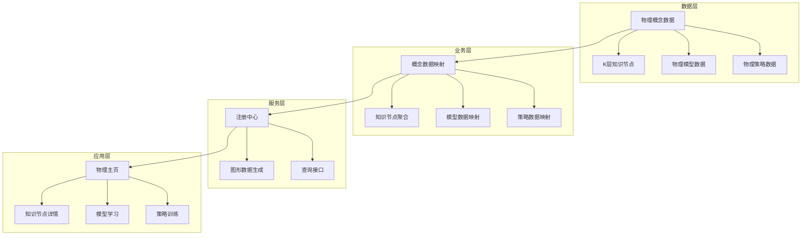
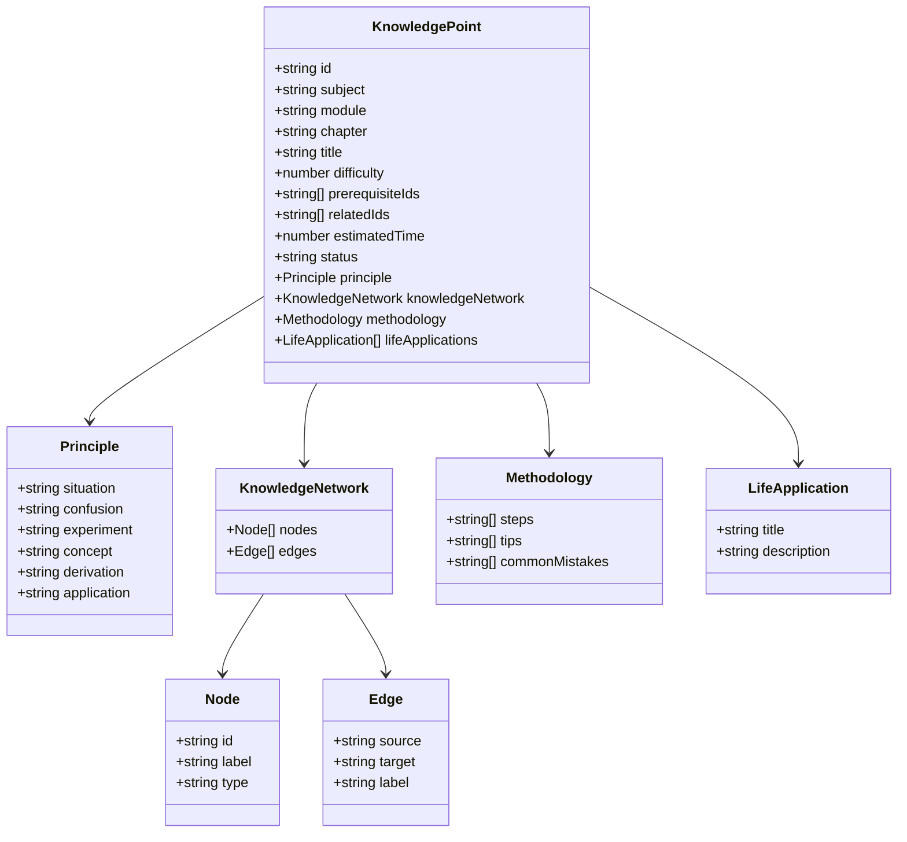
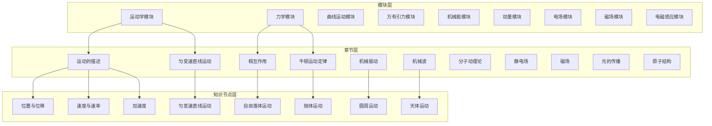
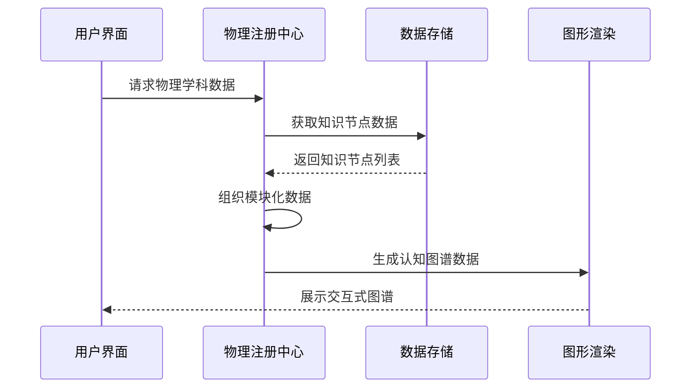
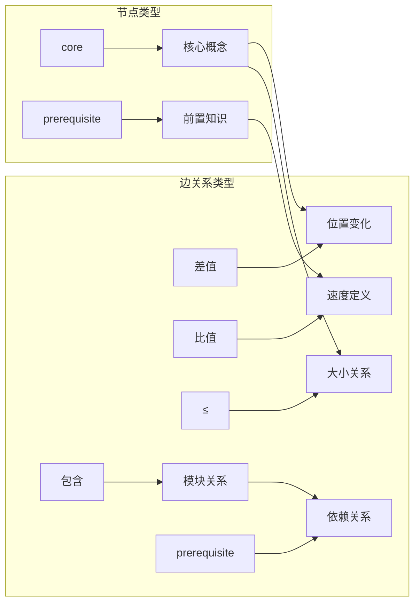
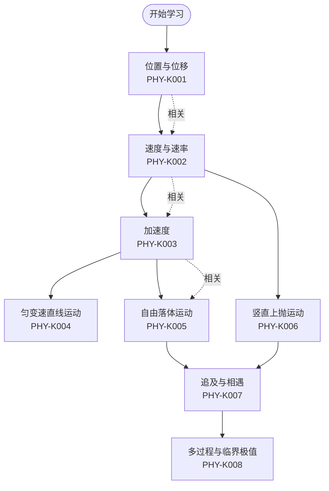
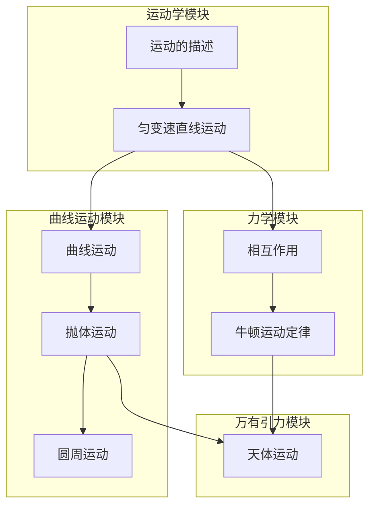
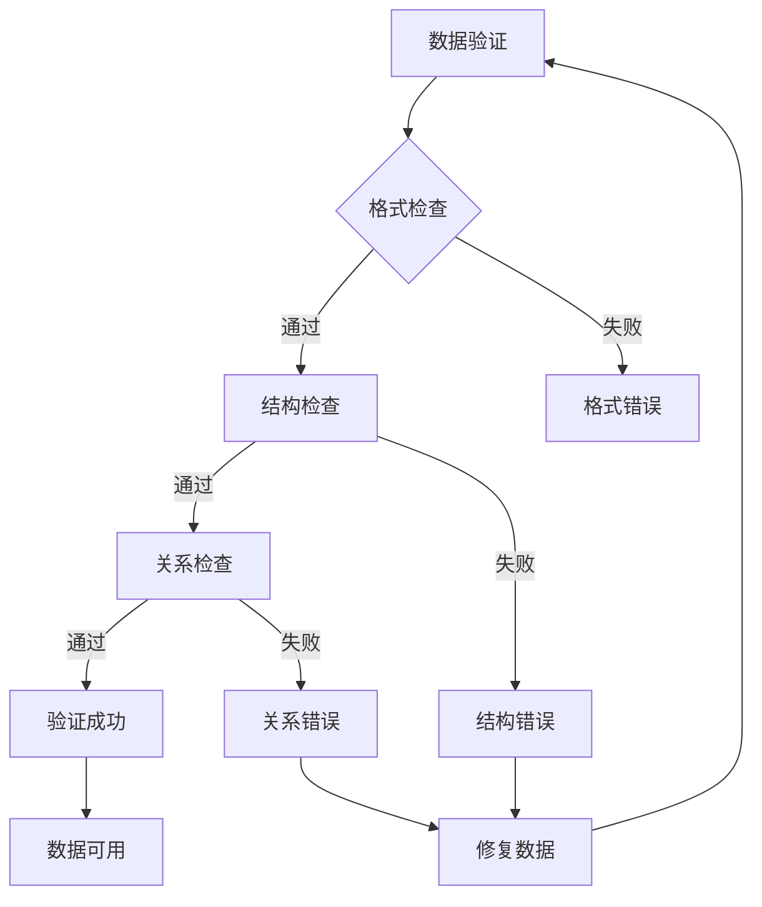

# 物理知识节点（K层）

<cite>
**本文档引用的文件**
- [physics/index.ts](file://src/data/physics/index.ts)
- [physicsData.ts](file://src/data/physics/physicsData.ts)
- [concepts/types.ts](file://src/data/physics/concepts/types.ts)
- [P01_位置位移路程时间.ts](file://src/data/physics/concepts/P01_位置位移路程时间.ts)
- [P02_速度.ts](file://src/data/physics/concepts/P02_速度.ts)
- [README.md](file://docs/knowledge/physics/README.md)
- [SPEC.md](file://SPEC.md)
</cite>

## 目录
1. [简介](#简介)
2. [项目结构](#项目结构)
3. [核心组件](#核心组件)
4. [架构总览](#架构总览)
5. [详细组件分析](#详细组件分析)
6. [依赖分析](#依赖分析)
7. [性能考虑](#性能考虑)
8. [故障排除指南](#故障排除指南)
9. [结论](#结论)

## 简介

星耀平台物理学科知识节点（K层）是构建高中物理认知图谱的核心数据结构。该系统采用模块化的知识组织方式，将56个物理知识节点按照运动学、力学、曲线运动与万有引力、能量与动量、电磁学、热学·光学·机械波、近代物理等七大板块进行分类管理。

每个知识节点都遵循统一的principle结构设计，包含情境(situation)、困惑(confusion)、实验(experiment)、概念(concept)、推导(derivation)、应用(application)六个维度，旨在通过真实情境引入物理概念，设计实验验证，并将抽象概念与生活应用相结合。

## 项目结构

物理知识节点系统采用分层架构设计，主要包含以下层次：

**图表来源**
- [physics/index.ts:19-76](file://src/data/physics/index.ts#L19-L76)
- [physics/index.ts:383-431](file://src/data/physics/index.ts#L383-L431)

**章节来源**
- [physics/index.ts:1-433](file://src/data/physics/index.ts#L1-L433)

## 核心组件

### 知识节点数据结构

每个物理知识节点都遵循统一的数据结构规范，包含以下核心字段：

**图表来源**
- [physics/index.ts:90-117](file://src/data/physics/index.ts#L90-L117)
- [physics/index.ts:176-195](file://src/data/physics/index.ts#L176-L195)

### 模块化组织架构

物理学科按照七大板块进行模块化组织：

| 板块编号 | 板块名称 | 章节数量 | 知识节点数量 |
|---------|----------|----------|--------------|
| 运动学 | 运动的描述 | 2 | 4 |
| 力学 | 相互作用 | 2 | 8 |
| 曲线运动与万有引力 | 曲线运动 | 2 | 12 |
| 能量与动量 | 机械能守恒 | 2 | 16 |
| 电磁学 | 电场 | 3 | 20 |
| 热学·光学·机械波 | 分子动理论 | 1 | 4 |
| 近代物理 | 原子结构 | 1 | 4 |

**章节来源**
- [physics/index.ts:24-76](file://src/data/physics/index.ts#L24-L76)

## 架构总览

### 认知图谱架构

**图表来源**
- [physics/index.ts:24-76](file://src/data/physics/index.ts#L24-L76)
- [physicsData.ts:4-39](file://src/data/physics/physicsData.ts#L4-L39)

### 数据流架构

**图表来源**
- [physics/index.ts:383-431](file://src/data/physics/index.ts#L383-L431)

## 详细组件分析

### 运动的描述模块（PHY-K001至PHY-K004）

#### 位置与位移（PHY-K001）

**设计理念**：通过GPS定位的真实情境引入位置与位移概念，强调矢量与标量的本质区别。

**principle结构分析**：
- **情境**：小明从家到学校的实际路径
- **困惑**：位移大小与路程的关系
- **实验**：刻度尺测量小车运动距离
- **概念**：位置的坐标描述与位移的有向线段定义
- **推导**：Δx = x₂ - x₁的数学表达
- **应用**：GPS定位中的位移计算

**难度等级**：1（基础层）
**前置知识**：无
**相关知识点**：PHY-K002（速度与速率）、PHY-K003（加速度）
**学习时间**：25分钟

#### 速度与速率（PHY-K002）

**设计理念**：通过高铁运行速度的现实情境，区分平均速度与瞬时速度，建立速度概念的精确理解。

**principle结构分析****：
- **情境**：高铁仪表盘显示300km/h
- **困惑**：速度与速率的区别
- **实验**：打点计时器测量纸带
- **概念**：速度的定义与单位
- **推导**：平均速度与瞬时速度的数学表达
- **应用**：汽车行驶中的速度计算

**难度等级**：1（基础层）
**前置知识**：PHY-K001（位置与位移）
**相关知识点**：PHY-K003（加速度）、PHY-K005（匀变速直线运动）
**学习时间**：30分钟

#### 加速度（PHY-K003）

**设计理念**：通过赛车起步的真实情境，理解加速度作为速度变化快慢的物理量。

**principle结构分析**：
- **情境**：赛车从0加速到100km/h仅需3秒
- **困惑**：加速度的正负含义
- **实验**：打点计时器分析匀加速运动
- **概念**：加速度的定义与单位
- **推导**：a = Δv/Δt的物理意义
- **应用**：汽车安全气囊的工作原理

**难度等级**：2（进阶层）
**前置知识**：PHY-K001（位置与位移）、PHY-K002（速度与速率）
**相关知识点**：PHY-K005（匀变速直线运动）
**学习时间**：35分钟

#### 匀变速直线运动（PHY-K004）

**设计理念**：整合前三个概念，建立匀变速直线运动的完整知识体系。

**principle结构分析**：
- **情境**：汽车在直路上的匀加速运动
- **困惑**：匀变速运动的规律性
- **实验**：运动学实验验证
- **概念**：匀变速运动的特征
- **推导**：运动学公式的推导过程
- **应用**：实际交通场景中的运动分析

**难度等级**：2（进阶层）
**前置知识**：PHY-K001至PHY-K003
**相关知识点**：PHY-K005至PHY-K008
**学习时间**：40分钟

### 匀变速直线运动模块（PHY-K005至PHY-K008）

#### 自由落体运动（PHY-K005）

**设计理念**：通过重力作用下的自由落体现象，理解重力加速度的特殊性。

**知识网络关系**：
- 节点类型：core
- 相关概念：重力、加速度
- 边关系：与PHY-K003（加速度）形成比值关系

**难度等级**：2（进阶层）
**前置知识**：PHY-K003（加速度）
**相关知识点**：PHY-K006（竖直上抛运动）、PHY-K013（运动的合成与分解）
**学习时间**：30分钟

#### 竖直上抛运动（PHY-K006）

**设计理念**：通过物体竖直向上抛出的典型运动，理解运动的对称性和时间关系。

**知识网络关系**：
- 节点类型：core
- 相关概念：速度变化、时间对称
- 边关系：与PHY-K005（自由落体）形成差值关系

**难度等级**：3（挑战层）
**前置知识**：PHY-K003（加速度）、PHY-K005（自由落体）
**相关知识点**：PHY-K014（抛体运动）
**学习时间**：35分钟

#### 追及与相遇问题（PHY-K007）

**设计理念**：通过两物体相对运动的实际问题，培养运动学应用能力。

**知识网络关系**：
- 节点类型：core
- 相关概念：相对运动、临界条件
- 边关系：与PHY-K002（速度与速率）形成比值关系

**难度等级**：3（挑战层）
**前置知识**：PHY-K002（速度与速率）、PHY-K005（匀变速直线运动）
**相关知识点**：PHY-K008（多过程与临界极值）
**学习时间**：45分钟

#### 多过程与临界极值（PHY-K008）

**设计理念**：通过复杂运动过程的分析，培养解决综合性物理问题的能力。

**知识网络关系**：
- 节点类型：core
- 相关概念：过程分析、极值判断
- 边关系：与PHY-K007（追及与相遇）形成≤关系

**难度等级**：3（挑战层）
**前置知识**：PHY-K007（追及与相遇）
**相关知识点**：PHY-K012（多过程与临界极值）
**学习时间**：50分钟

### 认知图谱节点类型与边关系

**图表来源**
- [physics/index.ts:98-108](file://src/data/physics/index.ts#L98-L108)
- [physics/index.ts:137-147](file://src/data/physics/index.ts#L137-L147)
- [physics/index.ts:176-186](file://src/data/physics/index.ts#L176-L186)

## 依赖分析

### 前置知识依赖关系

**图表来源**
- [physics/index.ts:86-88](file://src/data/physics/index.ts#L86-L88)
- [physics/index.ts:125-127](file://src/data/physics/index.ts#L125-L127)
- [physics/index.ts:164-166](file://src/data/physics/index.ts#L164-L166)

### 模块间依赖关系

**图表来源**
- [physicsData.ts:42-78](file://src/data/physics/physicsData.ts#L42-L78)

**章节来源**
- [physicsData.ts:4-39](file://src/data/physics/physicsData.ts#L4-L39)

## 性能考虑

### 数据加载优化

1. **按需加载**：物理数据采用延迟加载机制，仅在需要时加载特定模块的数据
2. **缓存策略**：已加载的知识节点数据会被缓存，避免重复请求
3. **分页加载**：大量数据采用分页加载，提升用户体验

### 认知图谱渲染优化

1. **节点简化**：图形渲染时对节点进行简化处理，减少DOM节点数量
2. **动态布局**：使用动态布局算法，根据数据量调整渲染策略
3. **增量更新**：支持增量更新，只重新渲染变化的部分

## 故障排除指南

### 常见问题诊断

1. **知识节点加载失败**
   - 检查网络连接状态
   - 验证知识节点文件完整性
   - 清除浏览器缓存后重试

2. **认知图谱显示异常**
   - 检查浏览器兼容性
   - 验证数据格式正确性
   - 查看控制台错误信息

3. **模块切换问题**
   - 确认模块ID格式正确
   - 检查模块依赖关系
   - 验证前置知识完成状态

### 数据验证规则

**图表来源**
- [SPEC.md:575-585](file://SPEC.md#L575-L585)

**章节来源**
- [SPEC.md:540-585](file://SPEC.md#L540-L585)

## 结论

星耀平台物理知识节点（K层）系统通过模块化的设计理念，建立了完整的物理知识体系。每个知识节点都遵循统一的principle结构，确保了知识传授的一致性和有效性。

系统的核心优势在于：

1. **结构化组织**：56个知识节点按照七大板块有序排列，便于学习和管理
2. **循序渐进**：严格的前置知识依赖关系，确保学习的连贯性
3. **实践导向**：真实情境引入和实验设计，增强知识的应用性
4. **可视化呈现**：认知图谱提供直观的学习路径指导

通过持续完善知识节点内容和优化系统性能，该系统能够为学生提供高质量的物理学习体验，有效支撑高中物理教学和学习需求。