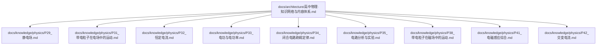
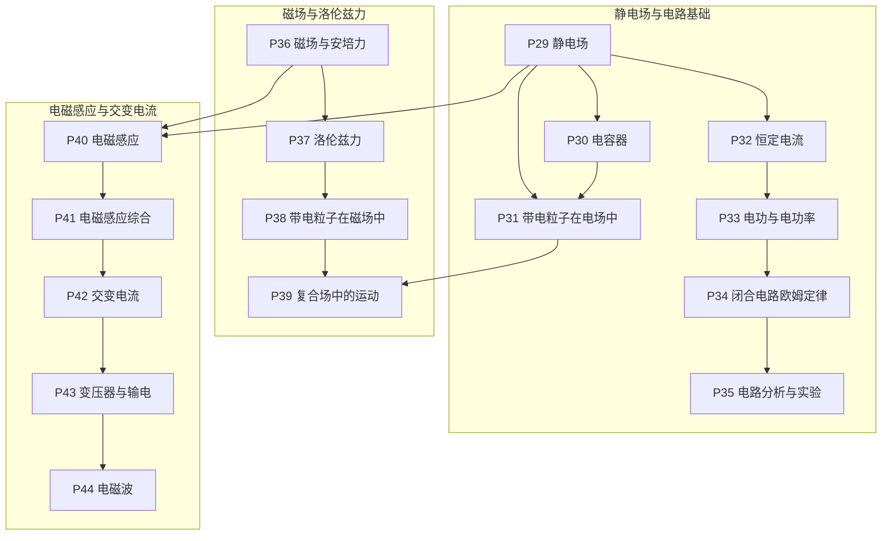
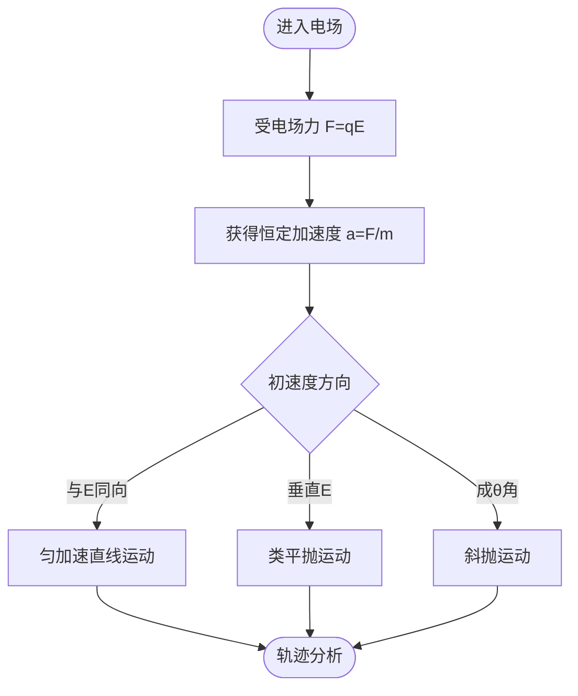
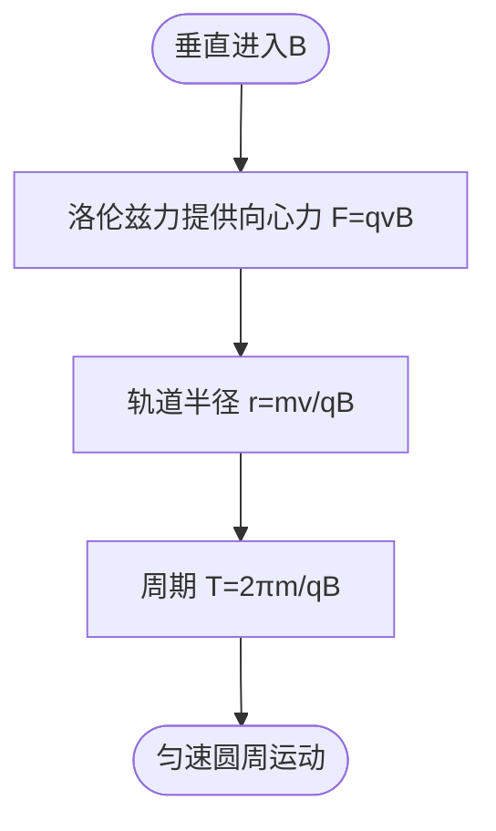
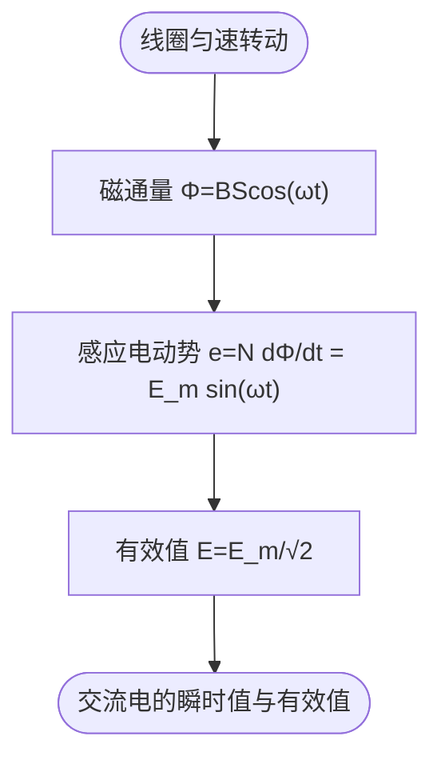
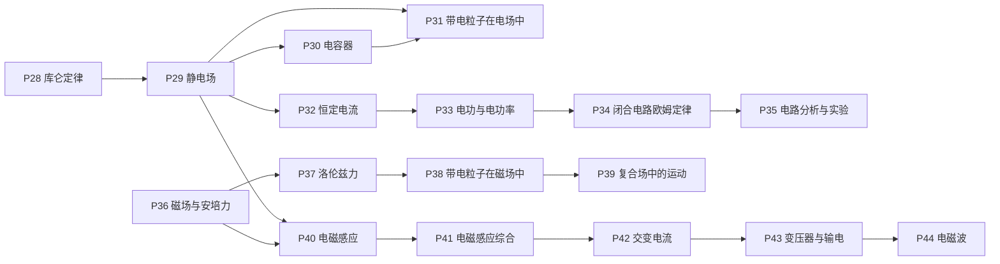

# 电磁学知识节点

<cite>
**本文引用的文件**
- [P29_静电场.md](file://docs/knowledge/physics/P29_静电场.md)
- [P31_带电粒子在电场中的运动.md](file://docs/knowledge/physics/P31_带电粒子在电场中的运动.md)
- [P32_恒定电流.md](file://docs/knowledge/physics/P32_恒定电流.md)
- [P33_电功与电功率.md](file://docs/knowledge/physics/P33_电功与电功率.md)
- [P34_闭合电路欧姆定律.md](file://docs/knowledge/physics/P34_闭合电路欧姆定律.md)
- [P35_电路分析与实验.md](file://docs/knowledge/physics/P35_电路分析与实验.md)
- [P38_带电粒子在磁场中的运动.md](file://docs/knowledge/physics/P38_带电粒子在磁场中的运动.md)
- [P41_电磁感应综合.md](file://docs/knowledge/physics/P41_电磁感应综合.md)
- [P42_交变电流.md](file://docs/knowledge/physics/P42_交变电流.md)
- [高中物理·知识网络与内容体系.md](file://docs/architecture/高中物理·知识网络与内容体系.md)
</cite>

## 目录
1. [引言](#引言)
2. [项目结构](#项目结构)
3. [核心组件](#核心组件)
4. [架构总览](#架构总览)
5. [详细组件分析](#详细组件分析)
6. [依赖分析](#依赖分析)
7. [性能考量](#性能考量)
8. [故障排查指南](#故障排查指南)
9. [结论](#结论)
10. [附录](#附录)

## 引言
本文件面向“星耀平台”物理学科的电磁学知识节点，围绕12个核心知识点（电容器、带电粒子在电场中的运动、恒定电流、电功与电功率、闭合电路欧姆定律、电路分析与实验、磁场、洛伦兹力、带电粒子在磁场中的运动、电磁感应、电磁感应综合、交变电流）进行系统化梳理。文档采用统一的principle结构设计，覆盖情境引入、困惑激发、实验验证、概念建立、推导过程、应用拓展六个阶段；并给出难度等级、前置知识要求、相关知识点关联与学习路径建议，帮助教师与学习者高效掌握电磁学知识脉络。

## 项目结构
本仓库中与电磁学知识节点直接相关的资料主要位于以下路径：
- docs/knowledge/physics：存放各物理知识点的详细讲解文档
- docs/architecture：包含知识网络与内容体系的总体架构说明

**图表来源**
- [高中物理·知识网络与内容体系.md:398-418](file://docs/architecture/高中物理·知识网络与内容体系.md#L398-L418)

**章节来源**
- [高中物理·知识网络与内容体系.md:398-418](file://docs/architecture/高中物理·知识网络与内容体系.md#L398-L418)

## 核心组件
本节汇总12个核心知识点的“学科本质”“常见迷思”“前置知识”“后继节点”“关联模型”等关键信息，便于快速检索与路径规划。

- P29 静电场：电场是“电荷周围空间的一种物质”——场强描述力的性质，电势描述能的性质
- P30 电容器：电容器是“储存电荷和电能的装置”
- P31 带电粒子在电场中：类平抛运动——电场力提供恒定加速度
- P32 恒定电流：欧姆定律是电路分析的基础——电流的本质是电荷的定向移动
- P33 电功·电功率：电功是“电场力做的功”，焦耳热是“电流通过电阻产生的热”
- P34 闭合电路欧姆定律：$E=U_{外}+U_{内}$——揭示电源的“非静电力”本质
- P35 电路分析与实验：伏安法测电阻、滑线变阻器分压/限流
- P36 磁场与安培力：磁场是“运动电荷或电流周围的一种物质”
- P37 洛伦兹力：洛伦兹力是磁场对运动电荷的作用力——始终垂直于速度方向，不做功
- P38 带电粒子在磁场中：匀速圆周运动——洛伦兹力提供向心力
- P39 复合场中的运动：重力场+电场+磁场的复合场
- P40 电磁感应：法拉第定律“磁通量变化产生感应电动势”
- P41 电磁感应综合：电路+力学+能量的综合
- P42 交变电流：交变电流是“大小和方向随时间周期性变化的电流”
- P43 变压器与输电：理想变压器输入功率=输出功率
- P44 电磁波：麦克斯韦预言、赫兹验证

**章节来源**
- [高中物理·知识网络与内容体系.md:398-418](file://docs/architecture/高中物理·知识网络与内容体系.md#L398-L418)

## 架构总览
下图展示电磁学核心知识节点之间的层级关系与前后衔接，强调“从场到路再到感生与交变”的主线。

**图表来源**
- [高中物理·知识网络与内容体系.md:398-418](file://docs/architecture/高中物理·知识网络与内容体系.md#L398-L418)

## 详细组件分析

### 电容器（P30）
- 学科本质：电容器是“储存电荷和电能的装置”，电容$C=Q/U$，由几何结构决定
- 常见迷思：“电容器断开后电荷不变”——只对孤立电容器成立，接在电路中时电压不变
- 前置知识：P29（静电场）
- 后继节点：P31（带电粒子在电场中）
- 关联模型：M26
- 教学策略：通过平行板电容器演示电容与极板间距、正对面积的关系；结合充电/放电过程讲解能量存储与释放

**章节来源**
- [高中物理·知识网络与内容体系.md:398-418](file://docs/architecture/高中物理·知识网络与内容体系.md#L398-L418)

### 带电粒子在电场中的运动（P31）
- 学科本质：带电粒子在匀强电场中的偏转是“类平抛运动”，电场力提供恒定加速度
- 常见迷思：“电场力不做功则电势能不变”——正确，但学生常混淆“电场力”与“电场”
- 前置知识：P29（静电场）、P14（抛体运动）
- 后继节点：P39（复合场中的运动）
- 关联模型：M24、M25、M30
- 教学策略：示波器实验展示电子束在电场中的偏转；类平抛分解法分析轨迹与侧向位移

**图表来源**
- [P31_带电粒子在电场中的运动.md:72-87](file://docs/knowledge/physics/P31_带电粒子在电场中的运动.md#L72-L87)

**章节来源**
- [P31_带电粒子在电场中的运动.md:1-216](file://docs/knowledge/physics/P31_带电粒子在电场中的运动.md#L1-L216)

### 恒定电流（P32）
- 学科本质：电流是“电荷的定向移动”——欧姆定律描述U-I关系，电阻定律描述材料对电流的阻碍
- 常见迷思：“电流从正极流向负极”——在电源外部成立，内部从负极到正极
- 前置知识：P29（静电场）
- 后继节点：P33（电功与电功率）
- 关联模型：M27、M28
- 教学策略：用恒压源与可变电阻验证欧姆定律；对比不同材料导体的电阻特性

**章节来源**
- [P32_恒定电流.md:1-221](file://docs/knowledge/physics/P32_恒定电流.md#L1-L221)

### 电功与电功率（P33）
- 学科本质：电功是电能转化为其他形式能的量度，电功率是转化快慢，焦耳定律描述热效应
- 常见迷思：“电功率大的用电器耗电多”——还与时间有关
- 前置知识：P32（恒定电流）
- 后继节点：P34（闭合电路欧姆定律）
- 关联模型：M27
- 教学策略：结合家庭用电场景讲解kWh与电能计量；演示焦耳热效应与安全用电

**章节来源**
- [P33_电功与电功率.md:1-222](file://docs/knowledge/physics/P33_电功与电功率.md#L1-L222)

### 闭合电路欧姆定律（P34）
- 学科本质：$E=U_{外}+U_{内}$——电源的电动势等于内外电压之和，揭示电源的“非静电力”本质
- 常见迷思：“路端电压等于电动势”——只有外电路断路时成立
- 前置知识：P32、P33（恒定电流与电功率）
- 后继节点：P35（电路分析与实验）
- 关联模型：M27、M28
- 教学策略：用不同外电阻测量路端电压与电流，绘制U-I图像确定E与r

**章节来源**
- [P34_闭合电路欧姆定律.md:1-221](file://docs/knowledge/physics/P34_闭合电路欧姆定律.md#L1-L221)

### 电路分析与实验（P35）
- 学科本质：复杂电路分析需要等效变换，实验测量需要正确选择仪器和方法
- 常见迷思：“安培表内接外接无所谓”——大电阻内接、小电阻外接（“大内小外”）
- 前置知识：P34（闭合电路欧姆定律）
- 后继节点：无（作为电路分析的收尾）
- 关联模型：M27、M28
- 教学策略：练习串并联等效、电表内接外接的选择与误差分析

**章节来源**
- [P35_电路分析与实验.md:1-214](file://docs/knowledge/physics/P35_电路分析与实验.md#L1-L214)

### 磁场（P36）
- 学科本质：磁场是“运动电荷或电流周围的一种物质”——安培力是磁场对电流的作用力
- 常见迷思：“安培力方向用右手定则”——应使用左手定则（F、B、I）
- 前置知识：无（作为独立起点）
- 后继节点：P37（洛伦兹力）
- 关联模型：M28、M29、M30
- 教学策略：演示通电导线在磁场中的受力；用左手定则判定安培力方向

**章节来源**
- [高中物理·知识网络与内容体系.md:398-418](file://docs/architecture/高中物理·知识网络与内容体系.md#L398-L418)

### 洛伦兹力（P37）
- 学科本质：洛伦兹力是磁场对运动电荷的作用力——始终垂直于速度方向，不做功
- 常见迷思：“洛伦兹力会改变带电粒子的速度大小”——不可能，因为它始终垂直于速度
- 前置知识：P36（磁场与安培力）
- 后继节点：P38（带电粒子在磁场中）
- 关联模型：M29、M30
- 教学策略：通过电子束在磁场中的偏转演示洛伦兹力方向；强调不做功导致动能不变

**章节来源**
- [高中物理·知识网络与内容体系.md:398-418](file://docs/architecture/高中物理·知识网络与内容体系.md#L398-L418)

### 带电粒子在磁场中的运动（P38）
- 学科本质：带电粒子垂直进入匀强磁场时做匀速圆周运动——半径$r = mv/qB$，周期$T = 2\pi m/qB$
- 常见迷思：“粒子在磁场中运动时间与速度无关”——偏转角越大时间越长，而偏转角与速度有关
- 前置知识：P37（洛伦兹力）、P15（圆周运动）
- 后继节点：P39（复合场中的运动）
- 关联模型：M29、M30
- 教学策略：回旋加速器原理与质谱仪应用；螺旋运动的分解分析

**图表来源**
- [P38_带电粒子在磁场中的运动.md:72-86](file://docs/knowledge/physics/P38_带电粒子在磁场中的运动.md#L72-L86)

**章节来源**
- [P38_带电粒子在磁场中的运动.md:1-218](file://docs/knowledge/physics/P38_带电粒子在磁场中的运动.md#L1-L218)

### 电磁感应（P40）
- 学科本质：法拉第定律“磁通量变化产生感应电动势”——揭示了电与磁的深层联系
- 常见迷思：“导体切割磁感线就一定有电流”——必须形成闭合回路才有电流
- 前置知识：P29（静电场）、P36（磁场）
- 后继节点：P41（电磁感应综合）
- 关联模型：M31、M32
- 教学策略：线圈在磁场中转动产生正弦感应电动势；楞次定律判定感应电流方向

**章节来源**
- [高中物理·知识网络与内容体系.md:398-418](file://docs/architecture/高中物理·知识网络与内容体系.md#L398-L418)

### 电磁感应综合（P41）
- 学科本质：电磁感应中的力学问题=电路+力学+能量的综合——安培力、感应电流、能量转化交织
- 常见迷思：“导体棒做减速运动最终速度为零”——不一定，可能达到匀速（安培力=摩擦力）
- 前置知识：P40（电磁感应）
- 后继节点：无（作为电磁感应的收尾）
- 关联模型：M31、M32
- 教学策略：导体棒在磁场中运动的全过程分析；能量守恒视角理解焦耳热

**章节来源**
- [P41_电磁感应综合.md:1-210](file://docs/knowledge/physics/P41_电磁感应综合.md#L1-L210)

### 交变电流（P42）
- 学科本质：交变电流是“大小和方向随时间周期性变化的电流”——正弦交流电是其中最重要的
- 常见迷思：“交流电的有效值就是平均值”——有效值是平方平均的平方根（均方根）
- 前置知识：P40（电磁感应）
- 后继节点：P43（变压器与输电）
- 关联模型：M25、M33
- 教学策略：线圈在匀强磁场中匀速转动产生正弦交流电；有效值与峰值关系推导

**图表来源**
- [P42_交变电流.md:75-109](file://docs/knowledge/physics/P42_交变电流.md#L75-L109)

**章节来源**
- [P42_交变电流.md:1-269](file://docs/knowledge/physics/P42_交变电流.md#L1-L269)

## 依赖分析
下图展示12个核心知识点的前置与后继关系，帮助规划学习路径与阶段性检测。

**图表来源**
- [高中物理·知识网络与内容体系.md:398-418](file://docs/architecture/高中物理·知识网络与内容体系.md#L398-L418)

**章节来源**
- [高中物理·知识网络与内容体系.md:398-418](file://docs/architecture/高中物理·知识网络与内容体系.md#L398-L418)

## 性能考量
- 教学效率：采用“情境—困惑—实验—概念—推导—应用”的principle结构，有助于学生在短时间内建立知识框架与认知冲突，提升课堂互动与理解深度
- 认知负荷：将复杂问题（如复合场、电磁感应综合、交变电流）拆分为“电路—力学—能量”三个层面，逐步推进，避免一次性信息过载
- 可迁移性：通过示波器、回旋加速器、质谱仪、变压器等真实应用场景，增强知识的现实意义与迁移能力

## 故障排查指南
- 电场与电势混淆：参考P29“常见迷思”与“概念涌现”，强调电场强度描述力性质，电势描述能性质
- 电流方向误解：参考P32“常见迷思”，明确电源外部与内部电流方向差异
- 安培表内接外接误判：参考P35“常见迷思”，掌握“大内小外”口诀与误差来源
- 洛伦兹力做功错误：参考P37“常见迷思”，强调始终垂直速度方向，不做功
- 有效值与平均值混淆：参考P42“常见迷思”，从热效应等效定义入手理解有效值

**章节来源**
- [P29_静电场.md:25-27](file://docs/knowledge/physics/P29_静电场.md#L25-L27)
- [P32_恒定电流.md:25-27](file://docs/knowledge/physics/P32_恒定电流.md#L25-L27)
- [P35_电路分析与实验.md:25-27](file://docs/knowledge/physics/P35_电路分析与实验.md#L25-L27)
- [P37_洛伦兹力.md:25-27](file://docs/knowledge/physics/P37_洛伦兹力.md#L25-L27)
- [P42_交变电流.md:25-27](file://docs/knowledge/physics/P42_交变电流.md#L25-L27)

## 结论
通过对12个核心电磁学知识点的principle结构化梳理，结合知识网络与前后置关系，可形成清晰的学习路径与教学策略。建议以“静电场—恒定电流—电磁感应—交变电流”为主线，辅以“磁场—洛伦兹力—带电粒子运动—复合场”的另一条主线，最后整合“电路分析与实验”“电磁感应综合”“变压器与输电”等应用环节，实现从基础到综合、从静态到动态、从定性到定量的全链条知识建构。

## 附录
- 学习路径设计建议
  - 初学者：P29→P30→P31→P32→P33→P34→P35
  - 进阶者：P36→P37→P38→P39；P40→P41；P42→P43→P44
- 教学策略要点
  - 情境引入：从生活实例（示波器、白炽灯、发电机、变压器）切入
  - 困惑激发：设置典型误区，引导学生自我纠正
  - 实验验证：演示与测量相结合，强调误差分析
  - 概念建立：用类比与模型（场、回路、圆周运动）帮助理解
  - 推导过程：从基本定律出发，逐步建立公式与关系
  - 应用拓展：联系技术与工程应用，强化迁移能力