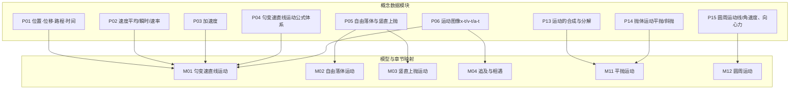
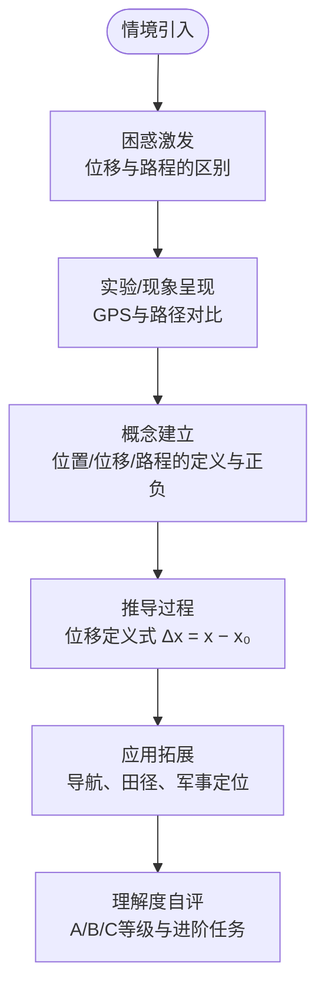
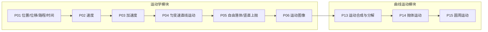

# 运动学知识节点

<cite>
**本文引用的文件**
- [physicsData.ts](file://src/data/physics/physicsData.ts)
- [P01_位置位移路程时间.ts](file://src/data/physics/concepts/P01_位置位移路程时间.ts)
- [P02_速度.ts](file://src/data/physics/concepts/P02_速度.ts)
- [P03_加速度.ts](file://src/data/physics/concepts/P03_加速度.ts)
- [P04_匀变速直线运动.ts](file://src/data/physics/concepts/P04_匀变速直线运动.ts)
- [P05_自由落体与竖直上抛.ts](file://src/data/physics/concepts/P05_自由落体与竖直上抛.ts)
- [P06_运动图像.ts](file://src/data/physics/concepts/P06_运动图像.ts)
- [P13_运动的合成与分解.ts](file://src/data/physics/concepts/P13_运动的合成与分解.ts)
- [P14_抛体运动.ts](file://src/data/physics/concepts/P14_抛体运动.ts)
- [P15_圆周运动.ts](file://src/data/physics/concepts/P15_圆周运动.ts)
- [types.ts](file://src/data/physics/concepts/types.ts)
</cite>

## 目录
1. [简介](#简介)
2. [项目结构](#项目结构)
3. [核心组件](#核心组件)
4. [架构总览](#架构总览)
5. [详细组件分析](#详细组件分析)
6. [依赖分析](#依赖分析)
7. [性能考虑](#性能考虑)
8. [故障排查指南](#故障排查指南)
9. [结论](#结论)
10. [附录](#附录)

## 简介
本文件面向“星耀平台”物理学科的运动学知识节点，系统梳理并文档化18个核心知识点，覆盖质点运动描述（位置与位移、速度与速率、加速度）、匀变速直线运动（基本公式、图像分析、追及与相遇）、抛体运动（平抛、斜抛）、圆周运动（线速度、角速度、向心力）等主题。文档严格遵循principle结构设计：情境引入、困惑激发、实验验证、概念建立、推导过程、应用拓展，并给出难度等级、前置知识要求、相关知识点关联与学习路径建议，辅以教学策略与真实情境示例。

## 项目结构
运动学知识节点的数据组织采用“概念数据模块 + 模型/章节映射 + 图谱生成”的分层结构：
- 概念数据模块：每个知识点以独立TS文件呈现，包含前置检测、叙事正文、分层变式、公式卡片、自评与跨学科链接。
- 模型/章节映射：通过统一的模型清单与章节索引，将知识点与课程模块、模型编号、顺序进行绑定。
- 图谱生成：基于模型清单与前置关系，生成模块-模型-知识节点的认知图谱，标注难度与依赖边。

**图表来源**
- [physicsData.ts:4-39](file://src/data/physics/physicsData.ts#L4-L39)
- [P01_位置位移路程时间.ts:124-128](file://src/data/physics/concepts/P01_位置位移路程时间.ts#L124-L128)
- [P02_速度.ts:134-139](file://src/data/physics/concepts/P02_速度.ts#L134-L139)
- [P03_加速度.ts:124-128](file://src/data/physics/concepts/P03_加速度.ts#L124-L128)
- [P04_匀变速直线运动.ts:136-142](file://src/data/physics/concepts/P04_匀变速直线运动.ts#L136-L142)
- [P05_自由落体与竖直上抛.ts:139-143](file://src/data/physics/concepts/P05_自由落体与竖直上抛.ts#L139-L143)
- [P06_运动图像.ts:118-122](file://src/data/physics/concepts/P06_运动图像.ts#L118-L122)
- [P13_运动的合成与分解.ts:134-139](file://src/data/physics/concepts/P13_运动的合成与分解.ts#L134-L139)
- [P14_抛体运动.ts:139-142](file://src/data/physics/concepts/P14_抛体运动.ts#L139-L142)
- [P15_圆周运动.ts:139-144](file://src/data/physics/concepts/P15_圆周运动.ts#L139-L144)

**章节来源**
- [physicsData.ts:1-138](file://src/data/physics/physicsData.ts#L1-L138)

## 核心组件
- 知识节点数据结构（ConceptData）：统一承载“前置检测、叙事正文、分层变式、公式卡片、自评、关联模型与跨学科链接”，确保每个知识点具备完整的教学闭环。
- 模型与章节映射：将知识点与课程模块（运动学/曲线运动/力学等）和模型编号（M01~M12）进行绑定，便于学习路径规划与图谱生成。
- 认知图谱生成：基于前置关系边，构建模块→模型→知识节点的层级结构，标注难度与依赖，支撑个性化学习路径推荐。

**章节来源**
- [types.ts:51-77](file://src/data/physics/concepts/types.ts#L51-L77)
- [physicsData.ts:80-120](file://src/data/physics/physicsData.ts#L80-L120)

## 架构总览
运动学知识节点的principle结构贯穿每个知识点，强调“从真实情境到抽象模型再到应用迁移”的教学路径。下图展示典型知识点（以P01为例）的principle流程：

**图表来源**
- [P01_位置位移路程时间.ts:47-53](file://src/data/physics/concepts/P01_位置位移路程时间.ts#L47-L53)
- [P01_位置位移路程时间.ts:105-122](file://src/data/physics/concepts/P01_位置位移路程时间.ts#L105-L122)

## 详细组件分析

### P01 位置·位移·路程·时间
- 难度等级：3
- 前置知识：坐标系、正负数、标量与矢量概念
- 关联模型：M03（竖直上抛）、M04（追及与相遇）
- 教学策略
  - 情境引入：从“从家到学校”的日常路径，强调“位置”和“位移”的区别。
  - 困惑激发：引导思考“100米”在不同语境下的含义（路程 vs 位移）。
  - 实验验证：使用GPS轨迹对比“直线距离（位移）”与“实际行驶距离（路程）”。
  - 概念建立：明确位置、位移、路程的定义与正负号含义。
  - 推导过程：位移定义式 Δx = x − x₀，强调方向性。
  - 应用拓展：导航、田径400m跑、炮兵弹着点计算。
- 学习路径：P01 → P02（速度）→ P03（加速度）→ P04（匀变速）→ P05（自由落体/竖直上抛）

**章节来源**
- [P01_位置位移路程时间.ts:1-144](file://src/data/physics/concepts/P01_位置位移路程时间.ts#L1-L144)

### P02 速度（平均速度·瞬时速度·速率）
- 难度等级：3
- 前置知识：位移、时间、平均速度与瞬时速度的直觉差异
- 关联模型：M01（匀变速）、M03（自由落体）、M04（追及与相遇）
- 教学策略
  - 情境引入：北京到上海全程1200公里，耗时12小时，平均速度100km/h，但中途速度波动。
  - 困惑激发：平均速度 = (初速度+末速度)/2 的误区与正确计算。
  - 实验验证：伽利略斜面实验与打点计时器，演示“平均速度→瞬时速度”的极限思想。
  - 概念建立：平均速度、瞬时速度、速率的定义与区别。
  - 推导过程：v̄ = Δx/Δt，v = lim Δt→0 Δx/Δt = dx/dt，v-t图斜率=加速度。
  - 应用拓展：汽车仪表盘瞬时速度、导航平均速度、实验数据处理。
- 学习路径：P02 → P03（加速度）→ P04（匀变速）→ P05（自由落体/竖直上抛）

**章节来源**
- [P02_速度.ts:1-155](file://src/data/physics/concepts/P02_速度.ts#L1-L155)

### P03 加速度
- 难度等级：3
- 前置知识：速度、速度变化、正负号的物理意义
- 关联模型：M01（匀变速）、M10（曲线运动基础）
- 教学策略
  - 情境引入：两款车“百公里加速”对比，强调“加速快慢”与“速度大小”的区别。
  - 困惑激发：加速度a=10 m/s² ≠ 速度10 m/s；减速运动中加速度为负的含义。
  - 实验验证：两车启动数据对比，直观展示“速度变化快慢”。
  - 概念建立：a = Δv/Δt，矢量，方向与速度变化方向一致。
  - 推导过程：a = (v − v₀)/t，结合v = v₀ + at与s推导，理解正负号与运动状态。
  - 应用拓展：汽车弹射起飞、跳伞减速、战斗机起降。
- 学习路径：P03 → P04（匀变速）→ P05（自由落体/竖直上抛）

**章节来源**
- [P03_加速度.ts:1-144](file://src/data/physics/concepts/P03_加速度.ts#L1-L144)

### P04 匀变速直线运动（公式体系）
- 难度等级：3
- 前置知识：加速度定义、平均速度定义、一次/二次函数
- 关联模型：M01（匀变速）、M02（自由落体）、M03（竖直上抛）、M04（追及与相遇）
- 教学策略
  - 情境引入：高铁出站时速度每10秒增加固定值，体现“速度均匀增加”。
  - 困惑激发：4个公式、5个变量，如何选择合适公式？
  - 实验验证：伽利略斜面实验，s ∝ t²，推导s = ½at²。
  - 概念建立：匀变速直线运动的本质是加速度恒定。
  - 推导过程：由a = (v − v₀)/t与v̄ = (v₀ + v)/2出发，推导v = v₀ + at、s = v₀t + ½at²、v² − v₀² = 2as、s = ½(v₀ + v)t。
  - 应用拓展：安全制动距离、汽车“百公里加速”。
- 学习路径：P04 → P05（自由落体/竖直上抛）→ P06（运动图像）

**章节来源**
- [P04_匀变速直线运动.ts:1-152](file://src/data/physics/concepts/P04_匀变速直线运动.ts#L1-L152)

### P05 自由落体与竖直上抛
- 难度等级：3
- 前置知识：匀变速运动、重力加速度g、竖直上抛的对称性
- 关联模型：M02（自由落体）、M03（竖直上抛）
- 教学策略
  - 情境引入：松手石子的下落，直觉“重的先落地”的错误。
  - 困惑激发：最高点速度为零但加速度仍为g；真空管实验验证。
  - 实验验证：斜面实验与真空管实验，证明g与质量无关。
  - 概念建立：自由落体（v₀ = 0, a = g）与竖直上抛（上升匀减速、下降自由落体）。
  - 推导过程：v = gt，s = ½gt²；竖直上抛：h = v₀²/2g，t总 = 2v₀/g。
  - 应用拓展：蹦极、井深测量、体育投篮。
- 学习路径：P05 → P06（运动图像）→ P13（运动合成与分解）

**章节来源**
- [P05_自由落体与竖直上抛.ts:1-159](file://src/data/physics/concepts/P05_自由落体与竖直上抛.ts#L1-L159)

### P06 运动图像（x-t/v-t/a-t）
- 难度等级：3
- 前置知识：函数图像、斜率与面积的物理意义
- 关联模型：M03（自由落体）、M04（追及与相遇）
- 教学策略
  - 情境引入：骑行去学校，瞬时速度与平均速度的区别。
  - 困惑激发：x-t图与v-t图的区别；斜率与面积的混淆。
  - 实验验证：打点计时器实验，匀速与匀加速的图像特征。
  - 概念建立：x-t图斜率=速度；v-t图斜率=加速度、面积=位移；a-t图面积=速度变化。
  - 推导过程：微元法理解面积=位移；斜率读取物理量。
  - 应用拓展：行车记录仪、短跑分析、实验数据处理。
- 学习路径：P06 → P13（运动合成与分解）→ P14（抛体运动）

**章节来源**
- [P06_运动图像.ts:1-138](file://src/data/physics/concepts/P06_运动图像.ts#L1-L138)

### P13 运动的合成与分解
- 难度等级：3
- 前置知识：矢量合成、勾股定理、独立性原理
- 关联模型：M11（平抛运动）、M12（圆周运动）、M13（天体运动）
- 教学策略
  - 情境引入：同时向前走和向右转，实际路径是斜向右前。
  - 困惑激发：合速度=分速度之和的误区；时间和位移的最优解不同。
  - 实验验证：纸船实验，验证v = √(v₁² + v₂²)（垂直时）。
  - 概念建立：分运动独立进行，合运动效果等效；速度合成遵循平行四边形法则。
  - 推导过程：正交分解vₓ = v cos α，vᵧ = v sin α；参数方程消参得直线。
  - 应用拓展：小船过河（最短时间/最短位移）、飞机航行、航海。
- 学习路径：P13 → P14（抛体运动）→ P15（圆周运动）

**章节来源**
- [P13_运动的合成与分解.ts:1-149](file://src/data/physics/concepts/P13_运动的合成与分解.ts#L1-L149)

### P14 抛体运动（平抛·斜抛）
- 难度等级：3
- 前置知识：运动合成与分解、匀速直线运动、自由落体
- 关联模型：M11（平抛运动）
- 教学策略
  - 情境引入：水平扔石子与斜向上扔石子的轨迹差异。
  - 困惑激发：最高点速度≠0；水平方向为何匀速。
  - 实验验证：频闪照片，x方向等差、y方向1:4:9。
  - 概念建立：平抛=水平匀速+竖直自由落体；斜抛=水平匀速+竖直上抛。
  - 推导过程：x = v₀t，y = ½gt²；合速度v = √(v₀² + (gt)²)；轨迹y = g/(2v₀²)x²。
  - 应用拓展：篮球投篮、炮弹发射、喷泉水流。
- 学习路径：P14 → P15（圆周运动）

**章节来源**
- [P14_抛体运动.ts:1-152](file://src/data/physics/concepts/P14_抛体运动.ts#L1-L152)

### P15 圆周运动（线速度、角速度、向心力）
- 难度等级：3
- 前置知识：矢量、牛顿第二定律、匀速圆周运动的非匀速性
- 关联模型：M13（天体运动）、M14（功和功率）、M15（机械能守恒）
- 教学策略
  - 情境引入：绳子拉球转圈，手感受到“拉力”指向圆心。
  - 困惑激发：“匀速圆周运动”是否“匀速”；向心力的来源与性质。
  - 实验验证：转盘实验，验证F ∝ mrω²。
  - 概念建立：匀速圆周运动速率恒定，方向不断变化；向心加速度aₙ = v²/r = rω²；向心力Fₙ = maₙ。
  - 推导过程：速度变化量Δv的方向指向圆心；F = ma；向心力是效果力，由其他力提供。
  - 应用拓展：汽车转弯、洗衣机脱水、地球自转。
- 学习路径：P15 → P17（天体运动）

**章节来源**
- [P15_圆周运动.ts:1-154](file://src/data/physics/concepts/P15_圆周运动.ts#L1-L154)

## 依赖分析
运动学知识节点的前置关系与模块-模型映射如下：

**图表来源**
- [physicsData.ts:41-78](file://src/data/physics/physicsData.ts#L41-L78)

**章节来源**
- [physicsData.ts:41-78](file://src/data/physics/physicsData.ts#L41-L78)

## 性能考虑
- 数据结构复用：ConceptData统一字段，便于前端渲染与教学流程串联。
- 模型映射：通过relatedModels与crossLinks，快速建立知识点与模型、学科的关联，提升检索与推荐效率。
- 图谱生成：基于prerequisiteEdges的邻接关系，支持拓扑排序与路径规划，避免重复学习与遗漏关键前置。

## 故障排查指南
- 知识点混淆
  - 现象：将“位移”与“路程”混用，或将“加速度”理解为“速度大小”。
  - 处理：回顾P01与P03的“困惑激发”与“概念建立”，强化矢量与正负号的物理意义。
- 公式误用
  - 现象：平均速度=速度平均值、匀变速公式随意套用。
  - 处理：重读P02与P04的“推导过程”，理解定义式与适用条件。
- 图像读取错误
  - 现象：x-t图与v-t图混淆，斜率与面积误用。
  - 处理：对照P06的“实验/现象呈现”与“推导过程”，加强图像训练。
- 圆周运动受力不清
  - 现象：向心力来源不明，误以为是独立性质的力。
  - 处理：复习P15的“实验/现象呈现”与“推导过程”，明确向心力的效果力属性。

**章节来源**
- [P01_位置位移路程时间.ts:105-122](file://src/data/physics/concepts/P01_位置位移路程时间.ts#L105-L122)
- [P02_速度.ts:115-132](file://src/data/physics/concepts/P02_速度.ts#L115-L132)
- [P03_加速度.ts:105-122](file://src/data/physics/concepts/P03_加速度.ts#L105-L122)
- [P06_运动图像.ts:99-116](file://src/data/physics/concepts/P06_运动图像.ts#L99-L116)
- [P15_圆周运动.ts:119-137](file://src/data/physics/concepts/P15_圆周运动.ts#L119-L137)

## 结论
运动学知识节点以principle结构为核心，构建了从真实情境到抽象模型再到实践应用的教学闭环。通过清晰的前置关系、模块-模型映射与认知图谱，既能满足教师备课与学生自学的需求，也能为平台个性化学习路径与能力诊断提供数据支撑。建议在教学实践中持续完善“实验/现象呈现”与“应用拓展”环节，强化跨学科链接与真实情境迁移。

## 附录
- 学习路径设计建议
  - 基础层：P01 → P02 → P03 → P04 → P05
  - 提高层：P06 → P13 → P14 → P15
  - 拓展层：结合M01~M12模型进行专题训练与综合应用
- 教学策略要点
  - 以问题驱动代替直接讲授，鼓励学生提出“困惑”
  - 以实验与图像为抓手，建立物理直觉
  - 以跨学科链接深化理解，提升迁移能力
  - 以分层变式与自评反馈，实现差异化教学