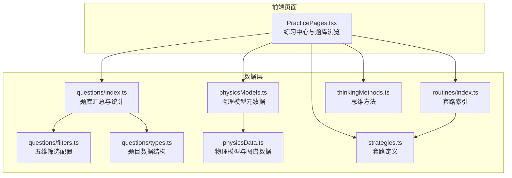
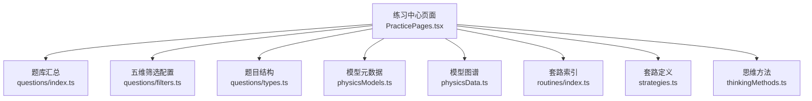
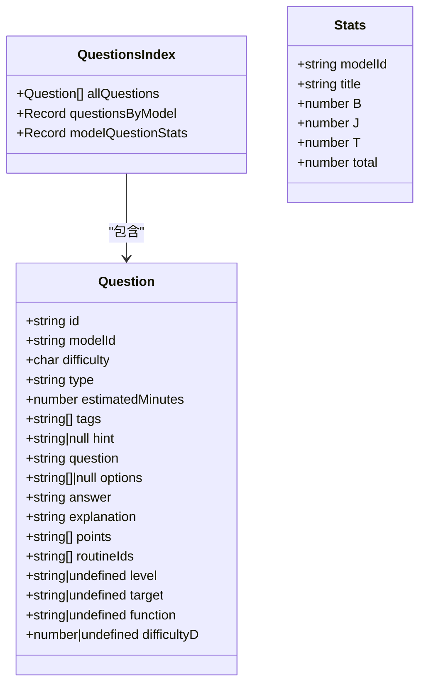
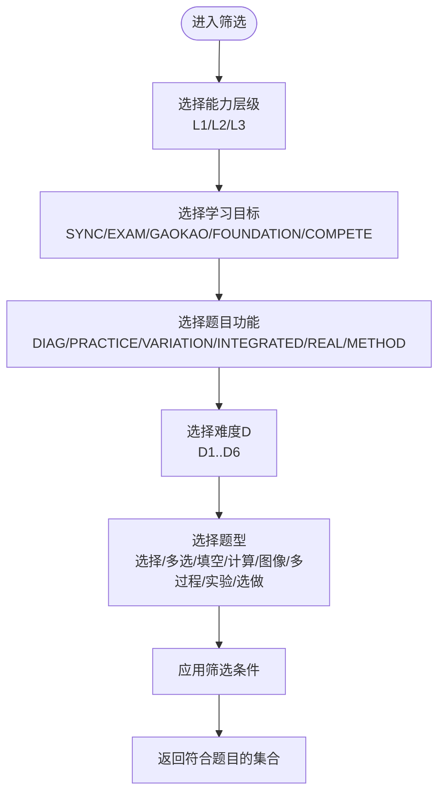
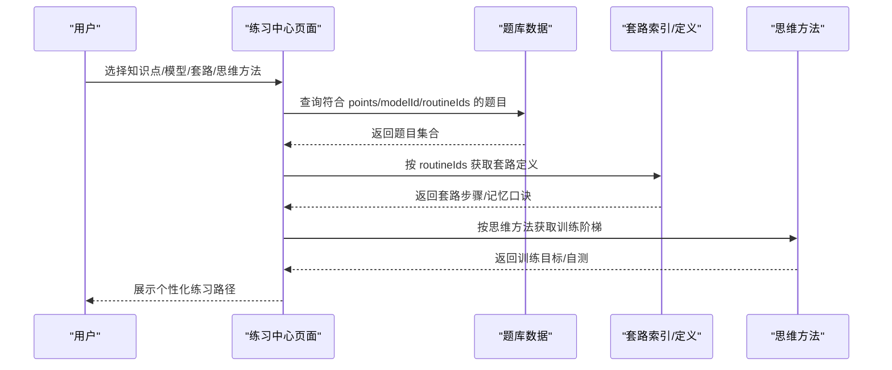
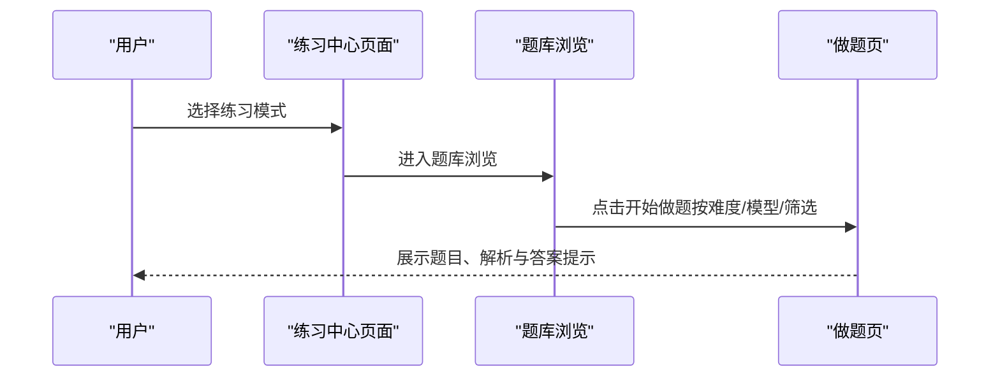
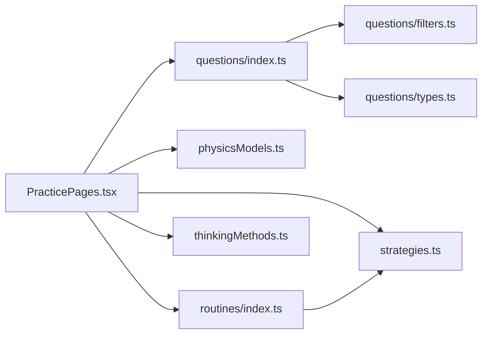

# 物理练习题库（P层）

<cite>
**本文引用的文件**
- [src/data/physics/questions/index.ts](file://src/data/physics/questions/index.ts)
- [src/data/physics/questions/filters.ts](file://src/data/physics/questions/filters.ts)
- [src/data/physics/questions/types.ts](file://src/data/physics/questions/types.ts)
- [src/data/physics/physicsModels.ts](file://src/data/physics/physicsModels.ts)
- [src/data/physics/physicsData.ts](file://src/data/physics/physicsData.ts)
- [src/data/physics/routines/index.ts](file://src/data/physics/routines/index.ts)
- [src/data/physics/strategies.ts](file://src/data/physics/strategies.ts)
- [src/data/physics/thinkingMethods.ts](file://src/data/physics/thinkingMethods.ts)
- [src/sections/PracticePages.tsx](file://src/sections/PracticePages.tsx)
</cite>

## 目录
1. [引言](#引言)
2. [项目结构](#项目结构)
3. [核心组件](#核心组件)
4. [架构总览](#架构总览)
5. [详细组件分析](#详细组件分析)
6. [依赖分析](#依赖分析)
7. [性能考虑](#性能考虑)
8. [故障排查指南](#故障排查指南)
9. [结论](#结论)
10. [附录](#附录)

## 引言
本文件面向星耀平台物理学科的“练习题库（P层）”，系统化梳理题库的数据结构、筛选机制、统计能力与智能推荐路径，并提供使用指南与最佳实践。重点覆盖：
- 题目难度分级（基础层B、进阶层J、挑战层T）与六级难度D1–D6映射
- 题型分类（选择、多选、填空、计算、图像分析、多过程综合、实验设计、选做）
- 知识点关联与解题套路匹配
- 五维筛选选项（能力层级、学习目标、题目功能、难度D、题型）
- 统计功能（modelQuestionStats、questionsByModel）
- 来源标注、年份信息与标签系统
- 基于知识节点、核心模型与解题套路的智能推荐与个性化练习
- 使用指南：五维筛选、解析与答案提示查看、错题本复习

## 项目结构
物理题库位于 src/data/physics/questions 下，采用“按模型分库 + 汇总统计”的组织方式；配套的物理模型、套路与思维方法数据位于同目录下的 physicsModels、routines、strategies、thinkingMethods 等文件中；前端练习页面位于 src/sections 下。

图表来源
- [src/data/physics/questions/index.ts:1-45](file://src/data/physics/questions/index.ts#L1-L45)
- [src/data/physics/questions/filters.ts:1-56](file://src/data/physics/questions/filters.ts#L1-L56)
- [src/data/physics/questions/types.ts:1-35](file://src/data/physics/questions/types.ts#L1-L35)
- [src/data/physics/physicsModels.ts:1-66](file://src/data/physics/physicsModels.ts#L1-L66)
- [src/data/physics/physicsData.ts:1-138](file://src/data/physics/physicsData.ts#L1-L138)
- [src/data/physics/routines/index.ts:1-279](file://src/data/physics/routines/index.ts#L1-L279)
- [src/data/physics/strategies.ts:1-800](file://src/data/physics/strategies.ts#L1-L800)
- [src/data/physics/thinkingMethods.ts:1-691](file://src/data/physics/thinkingMethods.ts#L1-L691)
- [src/sections/PracticePages.tsx:1-375](file://src/sections/PracticePages.tsx#L1-L375)

章节来源
- [src/data/physics/questions/index.ts:1-45](file://src/data/physics/questions/index.ts#L1-L45)
- [src/data/physics/questions/filters.ts:1-56](file://src/data/physics/questions/filters.ts#L1-L56)
- [src/data/physics/questions/types.ts:1-35](file://src/data/physics/questions/types.ts#L1-L35)
- [src/data/physics/physicsModels.ts:1-66](file://src/data/physics/physicsModels.ts#L1-L66)
- [src/data/physics/physicsData.ts:1-138](file://src/data/physics/physicsData.ts#L1-L138)
- [src/data/physics/routines/index.ts:1-279](file://src/data/physics/routines/index.ts#L1-L279)
- [src/data/physics/strategies.ts:1-800](file://src/data/physics/strategies.ts#L1-L800)
- [src/data/physics/thinkingMethods.ts:1-691](file://src/data/physics/thinkingMethods.ts#L1-L691)
- [src/sections/PracticePages.tsx:1-375](file://src/sections/PracticePages.tsx#L1-L375)

## 核心组件
- 题库汇总与统计
  - allQuestions：全量题目数组
  - questionsByModel：按 modelId 分组的题目字典
  - modelQuestionStats：按模型统计的难度分布与总数
  - 难度标签与颜色映射（B/J/T）
- 五维筛选配置
  - 能力层级（L1/L2/L3）
  - 学习目标（同步/考试/高考/强基/竞赛）
  - 题目功能（诊断/巩固/变式/综合/真题/方法）
  - 六级难度 D1–D6（与 B/J/T 的映射关系）
  - 题型（选择/多选/填空/计算/图像分析/多过程/实验设计/选做）
- 题目数据结构
  - 字段覆盖：id、modelId、difficulty、type、estimatedMinutes、tags、hint、question、options、answer、explanation、points、routineIds、level/target/function/difficultyD
- 物理模型与图谱
  - physicsModels：模型元数据（id/title/module/chapter/order）
  - generatePhysicsGraphData：生成模块-模型-前置关系图谱
- 解题套路与思维方法
  - routines/index + strategies：套路编号、标题、模型归属、难度、核心步骤、适用题型、常见误区、记忆口诀、内容
  - thinkingMethods：思维方法（建模与理想化、守恒思想、等效替代、对称与极限、整体与隔离、微元与累积、类比推理）

章节来源
- [src/data/physics/questions/index.ts:1-45](file://src/data/physics/questions/index.ts#L1-L45)
- [src/data/physics/questions/filters.ts:1-56](file://src/data/physics/questions/filters.ts#L1-L56)
- [src/data/physics/questions/types.ts:4-35](file://src/data/physics/questions/types.ts#L4-L35)
- [src/data/physics/physicsModels.ts:22-66](file://src/data/physics/physicsModels.ts#L22-L66)
- [src/data/physics/physicsData.ts:81-120](file://src/data/physics/physicsData.ts#L81-L120)
- [src/data/physics/routines/index.ts:95-186](file://src/data/physics/routines/index.ts#L95-L186)
- [src/data/physics/strategies.ts:5-17](file://src/data/physics/strategies.ts#L5-L17)
- [src/data/physics/thinkingMethods.ts:4-49](file://src/data/physics/thinkingMethods.ts#L4-L49)

## 架构总览
物理题库采用“数据聚合 + 前端页面”架构：
- 数据层：questions/index.ts 汇总各模型题库，导出 allQuestions、questionsByModel、modelQuestionStats；filters.ts 定义五维筛选选项；types.ts 定义题目结构；physicsModels.ts/physicsData.ts 提供模型与图谱；routines/index.ts + strategies.ts 提供套路索引与定义；thinkingMethods.ts 提供思维方法。
- 前端层：PracticePages.tsx 提供练习中心、知识点练习、章节测试、题库浏览等页面，调用上述数据进行筛选、展示与导航。

图表来源
- [src/sections/PracticePages.tsx:88-184](file://src/sections/PracticePages.tsx#L88-L184)
- [src/data/physics/questions/index.ts:8-37](file://src/data/physics/questions/index.ts#L8-L37)
- [src/data/physics/questions/filters.ts:1-56](file://src/data/physics/questions/filters.ts#L1-L56)
- [src/data/physics/questions/types.ts:4-35](file://src/data/physics/questions/types.ts#L4-L35)
- [src/data/physics/physicsModels.ts:22-66](file://src/data/physics/physicsModels.ts#L22-L66)
- [src/data/physics/physicsData.ts:81-120](file://src/data/physics/physicsData.ts#L81-L120)
- [src/data/physics/routines/index.ts:95-186](file://src/data/physics/routines/index.ts#L95-L186)
- [src/data/physics/strategies.ts:5-17](file://src/data/physics/strategies.ts#L5-L17)
- [src/data/physics/thinkingMethods.ts:51-691](file://src/data/physics/thinkingMethods.ts#L51-L691)

## 详细组件分析

### 题库数据结构与统计
- 数据结构要点
  - 题目字段：id、modelId、difficulty（B/J/T）、type（题型）、estimatedMinutes、tags、hint、question、options、answer、explanation、points（知识点）、routineIds（套路ID）、level/target/function/difficultyD（五维筛选）
- 统计与分组
  - allQuestions：全量题目
  - questionsByModel：按模型分组的题目字典
  - modelQuestionStats：按模型统计 B/J/T 数量与总数
  - 难度标签与颜色映射：B/J/T 对应中文标签与样式

图表来源
- [src/data/physics/questions/types.ts:4-35](file://src/data/physics/questions/types.ts#L4-L35)
- [src/data/physics/questions/index.ts:8-37](file://src/data/physics/questions/index.ts#L8-L37)

章节来源
- [src/data/physics/questions/types.ts:4-35](file://src/data/physics/questions/types.ts#L4-L35)
- [src/data/physics/questions/index.ts:8-37](file://src/data/physics/questions/index.ts#L8-L37)

### 五维筛选机制
- 能力层级（level）
  - L1：概念辨析（诊断）
  - L2：套路套用（模型题）
  - L3：跨模型综合（综合）
- 学习目标（target）
  - SYNC：同步学习（课堂进度）
  - EXAM：期末考试（阶段性检测）
  - GAOKAO：高考备考（真题）
  - FOUNDATION：强基校测（超纲拓展）
  - COMPETE：学科竞赛（竞赛训练）
- 题目功能（function）
  - DIAG：诊断题（检测掌握度）
  - PRACTICE：巩固题（重复训练）
  - VARIATION：变式题（条件变化）
  - INTEGRATED：综合题（多知识混合）
  - REAL：真题（考试原题）
  - METHOD：方法题（一题多解）
- 六级难度（difficultyD）
  - D1：识记；D2：辨析；D3：应用；D4：综合；D5：高考；D6：压轴
  - 与 B/J/T 的映射：B 对应 D2+D3，J 对应 D4，T 对应 D5（D6 作为更高阶题型）
- 题型（type）
  - 选择题、多选题、填空题、计算题、图像分析题、多过程综合计算题、实验设计题、选做题

图表来源
- [src/data/physics/questions/filters.ts:1-56](file://src/data/physics/questions/filters.ts#L1-L56)

章节来源
- [src/data/physics/questions/filters.ts:1-56](file://src/data/physics/questions/filters.ts#L1-L56)

### 题目来源标注、年份与标签系统
- 来源标注与年份
  - 题目结构未包含 year 字段，建议在导入时补充年份字段以便按年筛选
- 标签系统（tags）
  - 支持字符串数组标签，可用于二次标注与自定义筛选
- 知识点关联（points）
  - 与 physicsModels 中的模型 ID 对应，便于按知识点检索与图谱导航
- 套路关联（routineIds）
  - 与 routines/index.ts 中的套路 ID 对应，便于按套路检索与推荐

章节来源
- [src/data/physics/questions/types.ts:11-28](file://src/data/physics/questions/types.ts#L11-L28)
- [src/data/physics/questions/index.ts:14-17](file://src/data/physics/questions/index.ts#L14-L17)
- [src/data/physics/routines/index.ts:188-279](file://src/data/physics/routines/index.ts#L188-L279)

### 智能推荐与个性化练习
- 基于知识节点（points）
  - 通过 physicsModels 的模型元数据与 generatePhysicsGraphData 的图谱，实现知识点的模块-模型-前置关系导航
- 基于核心模型（modelId）
  - questionsByModel 与 modelQuestionStats 支持按模型分组与难度分布查看
- 基于解题套路（routineIds）
  - routines/index.ts + strategies.ts 提供套路索引与定义，支持按套路检索与推荐
- 基于思维方法（thinkingMethods）
  - thinkingMethods.ts 提供七种思维方法的定义、触发信号、关键词、训练阶梯等，便于将题目与思维训练结合

图表来源
- [src/sections/PracticePages.tsx:187-307](file://src/sections/PracticePages.tsx#L187-L307)
- [src/data/physics/questions/index.ts:14-37](file://src/data/physics/questions/index.ts#L14-L37)
- [src/data/physics/routines/index.ts:95-186](file://src/data/physics/routines/index.ts#L95-L186)
- [src/data/physics/strategies.ts:5-17](file://src/data/physics/strategies.ts#L5-L17)
- [src/data/physics/thinkingMethods.ts:51-691](file://src/data/physics/thinkingMethods.ts#L51-L691)

章节来源
- [src/sections/PracticePages.tsx:187-307](file://src/sections/PracticePages.tsx#L187-L307)
- [src/data/physics/questions/index.ts:14-37](file://src/data/physics/questions/index.ts#L14-L37)
- [src/data/physics/routines/index.ts:95-186](file://src/data/physics/routines/index.ts#L95-L186)
- [src/data/physics/strategies.ts:5-17](file://src/data/physics/strategies.ts#L5-L17)
- [src/data/physics/thinkingMethods.ts:51-691](file://src/data/physics/thinkingMethods.ts#L51-L691)

### 前端页面与使用指南
- 练习中心（PracticePage）
  - 提供四种练习模式：知识点练习、章节测试、考试真题、竞赛练习
  - 展示 B/J/T 难度说明与章节导航
- 知识点练习（KnowledgePracticePage）
  - 支持按模型标题/模块搜索，直接跳转到模型练习
- 章节测试（ChapterPracticePage）
  - 按章节列出模型，支持按难度筛选
- 题库浏览（QuestionBankPage）
  - 按难度（B/J/T）浏览题目，支持搜索与难度筛选

图表来源
- [src/sections/PracticePages.tsx:88-184](file://src/sections/PracticePages.tsx#L88-L184)
- [src/sections/PracticePages.tsx:309-375](file://src/sections/PracticePages.tsx#L309-L375)

章节来源
- [src/sections/PracticePages.tsx:88-184](file://src/sections/PracticePages.tsx#L88-L184)
- [src/sections/PracticePages.tsx:187-307](file://src/sections/PracticePages.tsx#L187-L307)
- [src/sections/PracticePages.tsx:309-375](file://src/sections/PracticePages.tsx#L309-L375)

## 依赖分析
- 组件耦合
  - PracticePages.tsx 依赖 questions/index.ts、physicsModels.ts、routines/index.ts、strategies.ts、thinkingMethods.ts
  - questions/index.ts 依赖 filters.ts、types.ts
  - routines/index.ts 依赖 strategies.ts
- 可能的循环依赖
  - 当前文件间无循环导入；若后续扩展，需避免 pages 与 data 的双向依赖
- 外部依赖
  - 前端 UI 组件库（lucide-react、@/components/ui/*）用于界面展示

图表来源
- [src/sections/PracticePages.tsx:1-13](file://src/sections/PracticePages.tsx#L1-L13)
- [src/data/physics/questions/index.ts:1-11](file://src/data/physics/questions/index.ts#L1-L11)
- [src/data/physics/questions/filters.ts:1-56](file://src/data/physics/questions/filters.ts#L1-L56)
- [src/data/physics/questions/types.ts:1-11](file://src/data/physics/questions/types.ts#L1-L11)
- [src/data/physics/routines/index.ts:1-94](file://src/data/physics/routines/index.ts#L1-L94)
- [src/data/physics/strategies.ts:1-19](file://src/data/physics/strategies.ts#L1-L19)
- [src/data/physics/thinkingMethods.ts:1-6](file://src/data/physics/thinkingMethods.ts#L1-L6)

章节来源
- [src/sections/PracticePages.tsx:1-13](file://src/sections/PracticePages.tsx#L1-L13)
- [src/data/physics/questions/index.ts:1-11](file://src/data/physics/questions/index.ts#L1-L11)
- [src/data/physics/questions/filters.ts:1-56](file://src/data/physics/questions/filters.ts#L1-L56)
- [src/data/physics/questions/types.ts:1-11](file://src/data/physics/questions/types.ts#L1-L11)
- [src/data/physics/routines/index.ts:1-94](file://src/data/physics/routines/index.ts#L1-L94)
- [src/data/physics/strategies.ts:1-19](file://src/data/physics/strategies.ts#L1-L19)
- [src/data/physics/thinkingMethods.ts:1-6](file://src/data/physics/thinkingMethods.ts#L1-L6)

## 性能考虑
- 数据加载
  - questions/index.ts 将各模型题库合并为 allQuestions，建议在页面首次渲染时按需懒加载或分页加载
- 筛选性能
  - 五维筛选在内存中进行，建议对高频筛选字段建立索引（如按 modelId、points、routineIds 建立 Map）
- 渲染优化
  - 大列表渲染建议使用虚拟滚动与分页
- 图谱与套路
  - routines/index.ts 与 thinkingMethods.ts 数据量较大，建议在页面按需加载与缓存

## 故障排查指南
- 题目缺失
  - 若 modelQuestionStats 中缺少某模型，检查 questions/index.ts 是否正确导入该模型题库
- 筛选无效
  - 确认 filters.ts 中的枚举值与题目 difficultyD/level/target/function/type 字段一致
- 套路未命中
  - 检查题目 routineIds 与 routines/index.ts 的 ID 是否一致
- 难度映射
  - 确认 difficulty 与 difficultyD 的映射关系（B/D2+D3、J/D4、T/D5）是否满足业务需求

章节来源
- [src/data/physics/questions/index.ts:14-37](file://src/data/physics/questions/index.ts#L14-L37)
- [src/data/physics/questions/filters.ts:24-31](file://src/data/physics/questions/filters.ts#L24-L31)
- [src/data/physics/routines/index.ts:188-279](file://src/data/physics/routines/index.ts#L188-L279)

## 结论
星耀平台物理题库（P层）以“按模型分库 + 汇总统计 + 五维筛选 + 套路与思维方法”为核心，形成从数据到页面的完整闭环。通过知识点、模型与套路的多维关联，能够实现智能推荐与个性化练习；通过统计与难度映射，便于教师与学生进行学情分析与学习路径规划。建议后续完善年份字段、建立索引与缓存策略，以进一步提升性能与体验。

## 附录
- 使用指南
  - 五维筛选：在题库浏览页选择能力层级、学习目标、题目功能、难度D、题型，点击应用筛选
  - 查看解析与答案提示：在做题页查看题目与解析，答案提示可在 hint 字段中获取
  - 错题本复习：建议在前端页面增加收藏与错题标记功能，结合 routines 与 thinkingMethods 进行针对性训练
- 数据扩展建议
  - 补充 year 字段用于按年份筛选
  - 为高频查询字段建立索引（modelId、points、routineIds）
  - 分页与懒加载优化大列表渲染